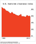
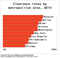
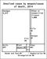

Serial Killers Should Fear This Algorithm

 

Thomas Hargrove goes over notes sent to him by police departments.

Photograph by Cait Oppermann for Bloomberg Businessweek

# Serial Killers Should Fear This Algorithm

Thomas Hargrove is building software to identify trends in unsolved murders using data nobody’s bothered with before.

by
Robert Kolker
 February 8, 2017, 12:00 PM GMT

From [(L)](https://www.bloomberg.com/businessweek)[| Subscribe](https://subscribe.businessweek.com/pubs/BW/BWK/BloombergBusiness_allaccess_05_15_RightRaUS_CA.jsp?cds_page_id=185262&cds_mag_code=BWK&id=1470086454872&lsid=62141620548031319&vid=1)[| Reprints](https://olt.theygsgroup.com/bloomberg/)

On Aug. 18, 2010, a police lieutenant in Gary, Ind., received an e-mail, the subject line of which would be right at home in the first few scenes of a David Fincher movie:

“Could there be a serial killer active in the Gary area?”

It isn’t clear what the lieutenant did with that e-mail; it would be understandable if he waved it off as a prank. But the author could not have been more serious. He’d attached source material—spreadsheets created from FBI files showing that over several years the city of Gary had recorded 14 unsolved murders of women between the ages of 20 and 50. The cause of each death was the same: strangulation. Compared with statistics from around the country, he wrote, the number of similar killings in Gary was far greater than the norm. So many people dying the same way in the same city—wouldn’t that suggest that at least a few of them, maybe more, might be connected? And that the killer might still be at large?

The police lieutenant never replied. Twelve days later, the police chief, Gary Carter, received a similar e-mail from the same person. This message added a few details. Several of the women were strangled in their homes. In at least two cases, a fire was set after the murder. In more recent cases, several women were found strangled in or around abandoned buildings. Wasn’t all of this, the writer asked, at least worth a look?

The Gary police never responded to that e-mail, either, or to two follow-up letters sent via registered mail. No one from the department has commented publicly about what was sent to them—nor would anyone comment for this story. “It was the most frustrating experience of my professional life,” says the author of those messages, a 61-year-old retired news reporter from Virginia named Thomas Hargrove.

Data on the Murder Accountability Project’s website.
Photograph by Cait Oppermann for Bloomberg Businessweek

Hargrove spent his career as a data guy. He analyzed his first set of polling data as a journalism major at the University of Missouri, where he became a student director of the university’s polling organization. He joined an E.W. Scripps newspaper right out of college and expanded his repertoire from political polling data to practically any subject that required statistical analysis. “In the newsroom,” he remembers, “they would say, ‘Give that to Hargrove. That’s a numbers problem.’ ”

In 2004, Hargrove’s editors asked him to look into statistics surrounding prostitution. The only way to study that was to get a copy of the nation’s most comprehensive repository of criminal statistics: the FBI’s Uniform Crime Report, or UCR. When Hargrove called up a copy of the report from the database library at the University of Missouri, attached to it was something he didn’t expect: the Supplementary Homicide Report. “I opened it up, and it was a record I’d never seen before,” he says. “Line by line, every murder that was reported to the FBI.”

This report, covering the year 2002, contained about 16,000 murders, broken down by the victims’ age, race, and sex, as well as the method of killing, the police department that made the report, the circumstances known about the case, and information about the offender, if the offender was known. “I don’t know where these thoughts come from,” Hargrove says, “but the second I saw that thing, I asked myself, ‘Do you suppose it’s possible to teach a computer how to spot serial killers?’ ”

Like a lot of people, Hargrove was aware of criticisms of police being afflicted by tunnel vision when investigating difficult cases. He’d heard the term “linkage blindness,” used to describe the tendency of law-enforcement jurisdictions to fail to connect the dots between similar cases occurring right across the county or state line from one another. Somewhere in this report, Hargrove thought, could be the antidote to linkage blindness. The right person, looking at the information in the right way, might be able to identify any number of at-large serial killers.

Every year he downloaded and crunched the most recent data set. What really shocked him was the number of murder cases that had never been cleared. (In law enforcement, a case is cleared when a suspect is arrested, whatever the eventual outcome.) Hargrove counted 211,487, more than a third of the homicides recorded from 1980 to 2010. Why, he wondered, wasn’t the public up in arms about such a large number of unsolved murders?

To make matters worse, Hargrove saw that despite a generation’s worth of innovation in the science of crime fighting, including DNA analysis, the rate of cleared cases wasn’t increasing but decreasing—plummeting, even. The average homicide clearance rate in the 1960s was close to 90 percent; by 2010 it was solidly in the mid-’60s. It has fallen further since.

These troubling trends were what moved Hargrove to write to the Gary police. He failed to get any traction there. Sure enough, four years later, in October 2014, in Hammond, Ind.—the town next door to Gary—police found the body of 19-year-old Afrikka Hardy in a room at a Motel 6. Using her phone records, they tracked down a suspect, 43-year-old [Darren Deon Vann](http://www.chicagotribune.com/suburbs/post-tribune/news/ct-ptb-new-vann-charges-st-0308-20160307-story.html). Once arrested, Vann took police to the abandoned buildings where he’d stowed six more bodies, all of them in and around Gary. Anith Jones had last been seen alive on Oct. 8; Tracy Martin went missing in June; Kristine Williams and Sonya Billingsley disappeared in February; and Teaira Batey and Tanya Gatlin had vanished in January.

Before invoking his right to remain silent, Vann offhandedly mentioned that he’d been killing people for years—since the 1990s. Hargrove went to Gary, reporting for Scripps, to investigate whether any of the cases he’d identified back in 2010 might possibly be attributed to Vann. He remembers getting just one helpful response, from an assistant coroner in Lake County who promised to follow up, but that too went nowhere. Now, as the Vann prosecution slogs its way through the courts, everyone involved in the case is under a gag order, prevented from speculating publicly about whether any of the victims Hargrove noted in 2010 might also have been killed by Vann. “There are at least seven women who died after I tried to convince the Gary police that they had a serial killer,” Hargrove says. “He was a pretty bad one.”

Hargrove has his eye on other possible killers, too. “I think there are a great many uncaught serial killers out there,” he declares. “I think most cities have at least a few.”

We’re in a moment when, after decades of decreases nationally in the overall crime rate, the murder rate has begun creeping upward in many major U.S. cities. For two years running, homicides in major cities jumped on average more than 10 percent. (Those increases aren’t uniform, of course: Chicago leapt from 485 reported killings in 2015 to 762 in 2016, while the number of murders dipped in New York and Baltimore.) President Trump, in the campaign and since, has vowed to usher in a new era of law and order, hammering away on Twitter at Chicago’s “carnage” in particular.

Threats of federal intervention aside, it will be difficult to fix the problem of high murder rates without first addressing clearance rates. So it’s fortuitous, perhaps, that we are living in an age in which the analysis of data is supposed to help us decipher, detect, and predict everything from the results of presidential elections to the performance of baseball players. The data-focused approach to problem-solving was brought to life for a lot of people by Michael Lewis’s *Moneyball*, which introduced the non-baseball-nerd public to the statistical evaluation of Major Leaguers and made a hero of Billy Beane, an executive with the Oakland A’s. Law enforcement would seem to be a fertile area for data to be helpful: In the 1990s the New York Police Department famously used data to more shrewdly deploy its officers to where the crimes were, and its CompStat system became the standard for other departments around the country.

What Hargrove has managed to do goes a few orders of magnitude beyond that. His innovation was to teach a computer to spot trends in unsolved murders, using publicly available information that no one, including anyone in law enforcement, had used before. This makes him, in a manner of speaking, the Billy Beane of murder. His work shines light on a question that’s gone unanswered for too long: Why, exactly, aren’t the police getting any better at solving murder? And how can we even dream of reversing any upticks in the homicide rate while so many killers remain out on the streets?

Hargrove’s home office in Alexandria, Va.
Photograph by Cait Oppermann for Bloomberg Businessweek

It took a few years for Hargrove’s editors at Scripps to agree to give him enough time to lose himself in the FBI’s homicide data. With help from a University of Missouri grad student, Hargrove first dumped the homicide report into statistics software in 2008. He spent months trying to develop an algorithm that would identify unsolved cases with enough commonalities to suggest the same murderer. Eventually, he decided to reverse-engineer the algorithm by testing his ideas against one well-known case, that of Gary Ridgway, the so-called Green River Killer, who confessed to killing 48 women over two decades in the Seattle area. Hargrove thought that if he could devise an algorithm that turned up the Green River Killer’s victims, he’d know he was on the right track.

“We found a hundred things that didn’t work,” he recalls. Finally, he settled on four characteristics for what’s called a cluster analysis: geography, sex, age group, and method of killing. For gender, he stuck with women, since they make up the vast majority of multiple-murder victims who aren’t connected to gang-related activity. When he used women between the ages of 20 and 50—the cohort most commonly targeted by serial killers—the algorithm lit up like a slot machine. “It became clear that this thing was working,” he says. “In fact, it was working too well.”

The Green River Killer came up right away in this algorithm. That was good news. Hargrove’s algorithm also pulled up 77 unsolved murders in Los Angeles, which he learned were attributed to several different killers the police were pursuing (including the so-called Southside Slayer and, most recently, the Grim Sleeper), and 64 unsolved murders of women in Phoenix.

Then there was a second group of possible serial killers, those unrecognized by local police. “The whole point of the algorithm was to find the low-hanging fruit, the obvious clusters,” Hargrove says. “But there were dozens and dozens of them all over the country.”

In 2015, Scripps spun off the last of its newspapers, and Hargrove and the other print reporters lost their jobs. “The only guy who left with a skip was me,” he says. Hargrove, who was 59 at the time and had worked at the company for 37 years, qualified for a large severance and a nice pension, leaving him well-covered. Now he had enough time to go all in on his data project. He founded the [Murder Accountability Project](http://murderdata.org/), or MAP, a tiny nonprofit seeking to make FBI murder data more widely and easily available.

Using Freedom of Information Act (FOIA) requests, MAP has tried to chase down data from the many municipalities and counties that weren’t supplying their murder data to the FBI, out of bureaucratic laziness, a lack of manpower, or perhaps just rank incompetence. MAP has already assembled case details on 638,454 homicides from 1980 through 2014, including 23,219 cases that hadn’t been reported to the FBI. This is the most complete list of case-level details of U.S. murders available anywhere, and the group’s website has open-sourced all of it. Anyone with statistical analysis software, available for free online, can start looking, across jurisdictions, for serial killers. Anyone can compare convicted killers’ timelines against the timing of unsolved murders to determine if a connection is plausible. “You can call up your hometown and look and see if you see anything suspicious,” Hargrove says. “If you’re the father of a murdered daughter, you can call up her record, and you can see if there might be other records that match. We wanted to be able to crowdsource murder.”

The police have never been great at leveraging the power of their own statistics. Police culture is notably paper-based, scattered, and siloed, and departments aren’t always receptive to technological innovation. The National Crime Information Center (NCIC) database gives police access to information such as fugitive warrants, stolen property, and missing persons, but it’s not searchable for unsolved killings. The Centers for Disease Control and Prevention’s National Violent Death Reporting System compiles death-certificate-based information for homicide victims in 32 states, but, again, can’t be searched for uncleared cases. Some states have their own homicide databases, but they can’t see the data from other states, so linkage blindness persists.

In the 1990s the FBI created another voluntary reporting database, this one specifically for violent and sexual crimes, called the Violent Criminal Apprehension Program, or ViCAP. It never succeeded, either, primarily because it’s voluntary, making it easy for police departments to ignore. “Most law enforcement agencies don’t have a real solid understanding of what the purpose of ViCAP is,” says Gregory Cooper, who ran the program for three years. “The frustration is, I’ve got a car, but no one’s putting any gas in it.” Hargrove calls ViCAP “an experiment that was never properly funded, and most police departments never really bought into the idea.”

All of this contributes to, or at least fails to mitigate, the trend in the Uniform Crime Report and its Supplementary Homicide Report. Hargrove’s analysis of that data shows that the clearance rate, already so low compared with what it was decades ago, dropped from 64.5 percent in 2014 to 61.5 percent in 2015. That translates into 6,043 murder cases in 2015 that didn’t result in arrests. He picked apart those findings and learned that large cities tend to have worse clearance rates than small towns, perhaps because major cases are more rare in less populated areas and therefore tend to get special attention. (This might at least partially explain why about 75 percent of Canada’s 500 to 600 homicides each year are cleared.)

Hargrove also learned that not all big cities are the same when it comes to murder. “The variance is breathtaking,” he says. Los Angeles, New York, and Houston are well above the average clearance rates—in the low to mid-70s. The bottom of the class includes New Orleans, Detroit, and St. Louis, all bumping along in the mid-40s.

Police in large cities with stubbornly high murder rates point the finger at gang- and drug-related killings, and the reluctance of witnesses to come forward to identify the murderers. “The biggest problem is that everyone knows everyone,” Chester, Pa., Police Commissioner Darren Alston [told](http://www.philly.com/philly/news/Getting_Away_With_Murder_in_Chester.html) the *Philadelphia Daily News* in September. (Chester’s homicide rate outstrips all other U.S. cities’—and is more than double that of nearby Philadelphia.) City residents, in turn, point to a lack of trust in the police. But one other obvious problem is resources. “We fund homicide investigations like we fund education—it comes down to a local tax,” Hargrove says. “When an economy fails enough and we just have to start firing cops, we see everything going to hell.”

MAP tracks staffing trends on its website, too. Hargrove notes that Flint, Mich., and Dayton, Ohio, have seen their clearance rates fall more than 30 percentage points since the 1990s, coinciding with huge reductions in police manpower (330 to 185 officers in Flint; 500 to 394 in Dayton). When Hargrove’s group filed a FOIA request to get homicide data about a suspected serial killer in Detroit, the response was that the police lacked the budget to fulfill the request. “What do you do when a city says, ‘We’re too broke to even try to pull the records?’ ” Hargrove says. “I joke that what we’ve done is to create what amounts to a failed government detector.”

There is a case to be made, though, that clearance rates aren’t just a function of a police department’s staffing. Priorities and management also figure heavily. In 2000, Charles Wellford, a criminologist at the University of Maryland, published a seminal [paper](https://www.ncjrs.gov/pdffiles1/jr000243b.pdf) in which he identified the commonalities for departments that do effective murder clearance. No. 1 on that list was ensuring that cops are able to chase leads in the critical early hours after a murder, even if that means earning overtime pay. Wellford’s current research looks closely at the amount of money spent per officer, the amount spent per case, and the percentage of detectives on the force. Clearance rates, Wellford says, “are very much determined by priorities and resources. I’m beyond thinking that’s an open question. The question now for me is: How can we use the resources departments have to improve what they’re doing in clearing serious crimes?”

The most discouraging thing Hargrove has learned since starting his organization is how many police departments around the country not only ignore the FBI’s data but also don’t bother sharing their data with the FBI at all. Among the offenders: the state of Illinois, which MAP has sued for the information. Hargrove recently reported that homicides were more likely to go unsolved in Illinois in 2015 than in any other state: Only 37.3 percent of the 756 homicides were cleared. That dreadful clearance rate would seem to go a long way toward explaining Chicago’s notoriously climbing homicide rate, just as the president and others start searching for solutions.

From his experience with the Gary police, Hargrove learned the first big lesson of data: If it’s bad news, not everyone wants to see the numbers. Lately, he’s taken to forcing the issue. Together with MAP Vice Chairman Eric Witzig, a retired FBI investigator who worked with ViCAP, Hargrove has conducted teaching sessions with homicide detectives at meetings of the International Homicide Investigators Association and at the FBI’s Training Division in Quantico, Va. Hargrove gets the attention of the detectives in the room by using the JonBenét Ramsey case as a test for the database. The detectives watch as he selects “Colorado” under state, “strangulation” under weapon, “female” under victim’s sex, and “6” under victim’s age. Colorado has only one such case, JonBenét. But then Hargrove broadens the criterion to include strangulations of girls ages 5 through 10, and a second Colorado case pops up: Melanie Sturm, a 10-year-old girl found strangled in Colorado Springs in 1985. Then he broadens it nationwide and finds 27 unsolved cases, 11 of them in Western states. He shows them how easy it is to download this information into a list. It’s like something from *CSI*. “I believe every law enforcement agency should be made aware of and utilize this program’s database,” Janet Oliva, president of the FBI’s International Criminal Investigative Analysis Fellowship, told Hargrove.

The police in Atlanta are working with MAP now to trace a long string of unsolved murders. But elsewhere, there’s still some skepticism about the power of transparent data to serve the public good. For one thing, it’s expensive. “This is an open debate,” Hargrove says. “Things are getting so bad out there financially that the mayors are wondering, ‘Does it make sense for me to spend my resources on solving crimes against the dead when I’ve got the living who need help, too?’ ” Why not just grab the easy cases—the cases with witnesses, ballistics, and DNA—and put the hard ones on the back burner?

The answer, at least intuitively, would seem to be that at least some of these murderers will kill again. But if that were true, it ought to affect the murder rate. Sure enough, using his database, Hargrove has confirmed that this is the case. Pulling up information from 218 metropolitan jurisdictions in the 2014 Uniform Crime Report, he found that in the places with poor clearance rates, the homicide rate was almost double that of places where the clearance rate was better—from 9.6 homicides to 17.9 per 100,000 people.

“It makes perfect sense,” Hargrove says. “If you leave the killers to walk the street, why wouldn’t that cause more killings? The answer is, it does.”

Others have reached the same conclusions in different ways. In *Ghettoside*, a powerful examination of the unsolved-murder epidemic in Los Angeles, author Jill Leovy raises the notion that solving murder cases legitimizes the social order, undermining the ad hoc phenomenon of “street justice” that emerges in lawless areas and makes people feel powerless. So much attention has been paid to police racial bias cases that another sort of injustice—lack of thorough policing—gets overlooked. “It’s not enough to just stop doing the wrong kind of policing,” Mark Funkhouser, a former mayor of Kansas City, Mo., and now publisher of the magazine *Governing*, wrote last fall. “It’s vital that we do much more of the right kind.”

A number of studies over the years show that strong community policing and giving high priority to casework can raise clearance rates, independently of workload and budget. This is where management comes in. “When Michael Nutter campaigned for mayor of Philadelphia in 2007, he was saying, ‘I’ll make solving major crimes a major issue in my administration,’ ” Hargrove says. “Well, damned if they didn’t elect him and damned if he didn’t do just that.” Over two years, Philadelphia raised its homicide clearances from 56 percent to 75 percent.

Hargrove at home.
Photograph by Cait Oppermann for Bloomberg Businessweek

In Santa Ana, Calif., the clearance rate climbed from about 28 percent in 1993 to almost 100 percent in 2013, after a new police chief created a special homicide unit for gangs and attracted anonymous donations to offer higher rewards for tips leading to arrests. In Oakland, where clearance rates dropped to 30 percent in 2012, the police worked with the FBI to add five agents to the department’s squad of 10 full-time homicide investigators; in 2015 the clearance rate rose to 60 percent. MAP has joined forces with a local TV news station to shine a light on other underperforming police departments in the Bay Area.

“I don’t want to blast a particular politician,” Hargrove says, “but it’s been my experience that when you ask a police chief or a mayor in a well-performing police jurisdiction what their clearance rate is, the mayor and the police chief can snap those figures off, because they’re paying attention.”

As are the police in Austin. Vann, the Gary murderer, was caught not long after moving back to Indiana from Texas, where he’d spent a number of years. While Hargrove never heard back from the Gary police, he did hear from the police in Austin. “They said, ‘We need to know whether he could’ve killed anyone here.’ ”

Hargrove sent the Austin police data on every strangulation death in Texas. It looked like Vann had kept his nose clean; Hargrove couldn’t see any cases there that matched his pattern. “They must have agreed,” Hargrove says, “so that’s a kind of consultation.” The first, perhaps, of many.

 [  [Subscribe to Bloomberg Businessweek](../_resources/b30fc520a76eaeb909931e0aca827c31.bin)  ➞](https://subscribe.businessweek.com/servlet/OrdersGateway?cds_mag_code=BWK&cds_page_id=205566)