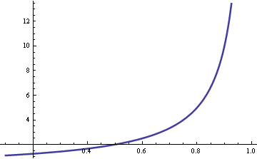

Server utilization: Joel on queueing

# Server utilization: Joel on queueing

Posted on [30 January 2009](https://www.johndcook.com/blog/2009/01/30/server-utilization-joel-on-queuing/) by [John](https://www.johndcook.com/blog/author/john/)

Joel Spolsky of Joel on Software fame mentions queueing theory in the latest StackOverflow [podcast](http://itc.conversationsnetwork.org/shows/detail3993.html). He mentions a rule of thumb that wait times go up quickly as server utilization exceeds 80%. The same principle applies whether you’re talking about computer servers or human servers. I hadn’t heard of that rule of thumb, though I knew that you don’t want anywhere near 100% utilization. Here’s the graph that justifies Joel’s remark.

The vertical axis is wait time. The horizontal access is utilization.

Here are the details. Basic queuing theory assumes customer arrivals are Poisson distributed with rate λ. Service times are exponentially distributed with rate μ. The ratio λ/μ is called utilization ρ. If this ratio is greater than 1, that says customers are arriving faster than they can be served, and so the line will grow without bound. If the ratio is less than 1, the line will reach some steady state on average.

The average waiting time is W = 1/(μ-λ). Now assume the service time μ is fixed and the arrival rate λ = ρ μ. Then W = 1/μ(1-ρ) and so the wait time is proportional to 1/(1-ρ). As the utilization ρ approaches 1, the wait time goes to infinity. The graph above plots 1/(1-ρ). As Joel said, the curve does go up quickly when ρ exceeds 0.8.

**Related post**: [What happens when you add a new teller?](https://www.johndcook.com/blog/2008/10/21/what-happens-when-you-add-a-new-teller/)

For daily posts on probability, follow [@ProbFact](https://twitter.com/probfact) on Twitter.

Categories : [Math](https://www.johndcook.com/blog/category/math/)
Tags : [Queueing theory](https://www.johndcook.com/blog/tag/queueing-theory/)

Bookmark the [permalink](https://www.johndcook.com/blog/2009/01/30/server-utilization-joel-on-queuing/)

# Post navigation

Previous Post[Whatever happened to system administration?](https://www.johndcook.com/blog/2009/01/30/whatever-happened-to-system-administration/)

Next Post[Finite differences](https://www.johndcook.com/blog/2009/02/01/finite-differences/)

## 11 thoughts on “Server utilization: Joel on queueing”

1.
  Gene

 [ 1 February 2009 at 08:49](https://www.johndcook.com/blog/2009/01/30/server-utilization-joel-on-queuing/#comment-13510)

In a restaurant, when wait times grow, a good manager will routinely visit clients’ tables, perhaps dropping off a free drink or extra hors d’oeuvres, and generally lowering the tension level. Many patrons appreciate the attempt and stress levels go down. The service isn’t any better, but we feel better.

Now, picture an Oracle server, executing on a multi-processor Linux box, trying the same approach: “I’m sorry, the queue is full and your process is waiting for execution. Would you care for an additional Quote-Of-The-Day? Or perhaps I can spawn another copy of xterm while you wait?”

It’s all about the context of the waiting period, isn’t it?

2.
  [Neil Gunther](http://www.perfdynamics.com/)

 [ 4 May 2009 at 01:09](https://www.johndcook.com/blog/2009/01/30/server-utilization-joel-on-queuing/#comment-13511)

In your post, you appeal to a queueing theory formula (for M/M/1 waiting time), which kinda comes out of nowhere. However, there’s a genuine intuition behind the shape of the curve—beyond a rule-of-thumb. It goes like this. You’re in a grocery store and it will take time S to ring up your groceries. But when you arrive at the checkout, there are N people ahead of you. Each one them also takes time S (on average) to check out their groceries. The total time you now expect to spend at the checkout is R = W + S, where W=NS is your average waiting time and S is your own service time once you get to the cashier. Clearly, W<R, so it follows that W must be some fraction of the total time R or W = R.r where r is a real number in the range 0 to 1. Now, we have: R = R.r + S and rearranging produces R=S/(1-r). This is the “residence time,” not the “waiting time” (slight bug in your argument). It should be clear that my ‘r’ is your Greek letter, rho. Moreover, writing F=R/S=1/(1-r), which is the hyperbolic function that you plotted. This function also has a name: the stretch factor. It’s also possible to relate F to the Unix/Linux [load average](http://perfdynamics.blogspot.com/search?q=stretch), which is also used a gauge of server performance.

3.
  [Neil Gunther](http://www.perfdynamics.com/)

 [ 4 May 2009 at 09:38](https://www.johndcook.com/blog/2009/01/30/server-utilization-joel-on-queuing/#comment-13512)

Cool! Now, I can show you the correct *rules-of-thumb* (ROT), which Software Joel did not actually state; he only provides a vague impression. Looking at the stretch factor F=R/S, then the first ROT is: (A) if the server or cashier is idle, i.e., no traffic coming to her checkout, then r=0 and therefore F=1 or R=S. In other words, your total residence time (R) when you arrive at the checkout is just the time spent ringing up your groceries, because nobody was ahead of you. ROT (B) Suppose the cashier is idle only 50% of the time (moderate traffic). Then, r=1/2 and F=2. In other words, when the cashier becomes 50% busy, your expected residence time climbs from 1 service period (S) to 2 service periods, i.e., R=2S. You can see this (not so clearly) in your plot above; the curve cuts the x-axis at r=1/2 and the corresponding y-value is 2—not shown. ROT (C) If the cashier becomes 75% busy r=3/4, F=4 or R=4S (heavy traffic). This case is quite clear in your plot. In other words, your residence time doubled again, even though the server only became 50% busier than case (B). This is due to the intrinsic *nonlinearity* of the queue (the hyperbolic function) and that’s what makes queueing theory rather unintuitive (even for experts).

4.
  Dilemma

 [ 3 March 2010 at 08:06](https://www.johndcook.com/blog/2009/01/30/server-utilization-joel-on-queuing/#comment-13513)

Why the waiting time becomes with less than 0.5 utilization negative?

5.
  John

 [ 3 March 2010 at 08:09](https://www.johndcook.com/blog/2009/01/30/server-utilization-joel-on-queuing/#comment-13514)

The waiting time does not become negative. The horizontal axis is drawn at waiting time = 2.

6.
  [Tim Hopper](http://www.twitter.com/tdhopper)

 [ 13 December 2014 at 14:04](https://www.johndcook.com/blog/2009/01/30/server-utilization-joel-on-queuing/#comment-443495)

An industrial engineering professor at North Carolina State has a license plate that says “RHO=1”.

7.
  Mark

 [ 3 July 2015 at 17:10](https://www.johndcook.com/blog/2009/01/30/server-utilization-joel-on-queuing/#comment-558348)

Gene: we could (and should!) do that with computers, too! It’s just that the unit of user feedback is generally not “print another motd”.

Imagine if you went to upload something to YouTube, and it said “We’re really swamped with uploads right now! This video might take a bit longer to process than usual.” (Maybe it does. I haven’t tried recently.) I think that kind of feedback would be great!

Most websites don’t do anything special in this case, so all I see is that nothing seems to be happening. Or maybe there’s a progress bar, and it seems to be moving awfully slowly. Is their system broken? Is it just always super slow? Maybe they’re just bad programmers. I don’t know! A little feedback could go a long way.

8.
  Usman

 [ 31 July 2016 at 11:22](https://www.johndcook.com/blog/2009/01/30/server-utilization-joel-on-queuing/#comment-884686)

During queuing model calculations for multi queue,multi server, infinite population,can your utilization factor be greater than 1?

### Leave a Reply

Your email address will not be published. Required fields are marked *
Comment
Name *
Email *
Website

Search for:

**John D. Cook, PhD, President**

My colleagues and I have decades of consulting experience helping companies solve complex problems involving data privacy, math, statistics, and computing.

Let’s talk. We look forward to exploring the opportunity to help your company too.