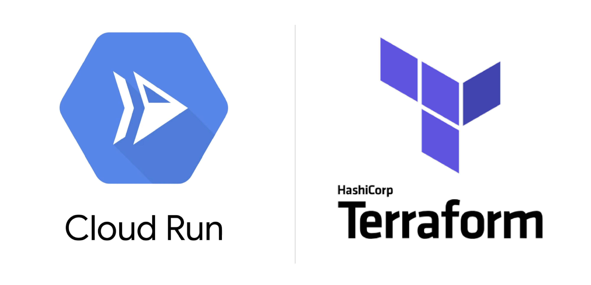
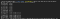
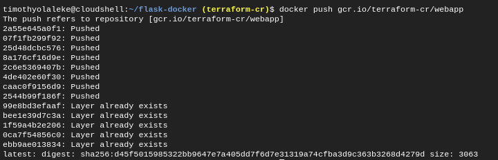
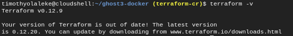
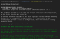
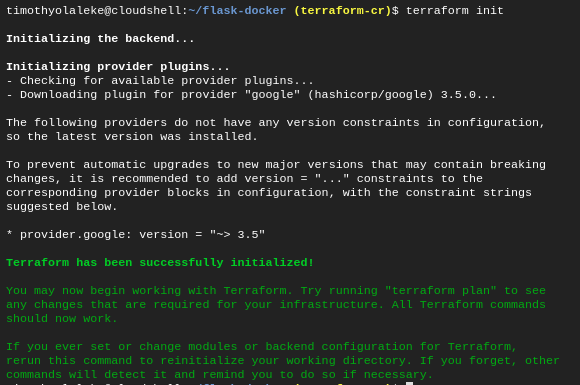
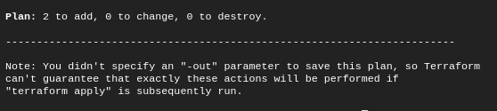
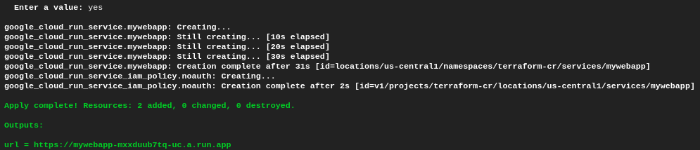

Serverless Deployment on Cloud Run using Terraform - Google Cloud - Community - Medium

# Serverless Deployment on Cloud Run using Terraform

[Timothy](https://medium.com/@timtech4u?source=post_page-----ee8ae4ecb72e----------------------)

[Jan 23](https://medium.com/google-cloud/deploying-docker-images-to-cloud-run-using-terraform-ee8ae4ecb72e?source=post_page-----ee8ae4ecb72e----------------------) · 4 min read

> In this article, we’ll deploy a serverless Flask web application to Cloud Run by building its > [> Docker image](https://github.com/Timtech4u/ghost3-docker)>  into Container Registry and use Terraform to provision our deployment as code.

> [> Terraform](https://www.terraform.io/)>  is a infrastructure as code tool for building, changing, and versioning infrastructure safely and efficiently across various cloud providers.

> [> Cloud Run](https://cloud.google.com/run/)>  is a managed compute platform that enables you to run stateless serverless containers that automatically scales.

> [> Container Registry](https://cloud.google.com/container-registry)>  is a private container image registry that runs on Google Cloud.

> [> Flask](https://github.com/pallets/flask)>  is a micro web framework written in Python.

# Prerequisites

- Create a [Google Cloud Platform (GCP) project](https://console.cloud.google.com/project), or use an existing one.
- Setup [Cloud SDK](https://cloud.google.com/sdk/), or use [Cloud Shell](https://cloud.google.com/shell/).
- Enable the [Cloud Run API](https://console.developers.google.com/apis/api/run.googleapis.com/overview).
- Enable the [Container Registry API](https://console.developers.google.com/apis/api/containerregistry.googleapis.com/overview).
- Clone the [sample codes](https://github.com/Timtech4u/flask-docker) or setup your own codes with a *Dockerfile*.

For this guide, I would stick to using Cloud Shell which has Terraform enabled by default.

If you are using the Cloud SDK on your local PC, you need a service account to use Terraform, do create one [here](https://console.cloud.google.com/apis/credentials/serviceaccountkey).

*Note that ****terraform-cr ****is my GCP project ID and you should replace that with yours.*

# Pushing Docker Image to Container Registry

We need to build the Docker image and push it to the project’s container registry so Terraform can access it.

You can clone the source codes into Cloud Shell and execute the following commands within it’s directory.

$ docker build -t gcr.io/terraform-cr/webapp .
$ docker push gcr.io/terraform-cr/webapp

Output

If this didn’t work for you, do check out other steps on the official documentation [here](https://cloud.google.com/container-registry/docs/pushing-and-pulling).

Cloud Run will only retrieve containers hosted in Container Registry and not from other sources.

If your Docker Image is on [Docker Hub](http://hub.docker.com/), I made a short video that narrates how to push a Docker Image to Container Registry. Do subscribe

Deploying Docker Images to Google Cloud Run

# Deploying to Cloud Run using Terraform

Terraform is enabled on Cloud Shell, you can verify by executing the ***terraform -v ***command. The version of Terraform installed is v0.12.9.

Terraform version

If you want to find out more details on this section, do checkout [Cloud Run - Terraform resource documentation](https://www.terraform.io/docs/providers/google/r/cloud_run_service.html).

Next step is to create a **main.tf** file which is a Terraform configuration file, you can find mine here:

# Filename: main.tf# Configure GCP project

provider "google" {
project = "terraform-cr"
}# Deploy image to Cloud Run
resource "google_cloud_run_service" "mywebapp" {
name = "mywebapp"
location = "us-central1"
template {
spec {
containers {
image = "gcr.io/terraform-cr/webapp"
}
}
}
traffic {
percent = 100
latest_revision = true
}
}# Create public access
data "google_iam_policy" "noauth" {
binding {
role = "roles/run.invoker"
members = [
"allUsers",
]
}
}# Enable public access on Cloud Run service
resource "google_cloud_run_service_iam_policy" "noauth" {
location = google_cloud_run_service.mywebapp.location
project = google_cloud_run_service.mywebapp.project
service = google_cloud_run_service.mywebapp.name
policy_data = data.google_iam_policy.noauth.policy_data
}# Return service URL
output "url" {
value = "${google_cloud_run_service.mywebapp.status[0].url}"
}
Now let’s initialize Terraform on Google Cloud Shell.
$ terraform init

Output

Then let’s plan the code in our **main.tf **file and see what the infrastructure looks like:

$ terraform plan

Truncated Output
Finally, we can apply to execute, make sure to enter ‘**yes**’ to approve.
$ terraform apply

Truncated Output

Outputs:url = [https://mywebapp-mxxduub7tq-uc.a.run.app](https://mywebapp-mxxduub7tq-uc.a.run.app/)

# Next Steps

Terraform allows you delete every resource used (including the GCP project), to do this, execute the following command, make sure to enter ‘**yes**’ to approve.

$ terraform destroy

So far we have been able to use Terraform to provision our deployment to Cloud Run as code. This could help you deploy applications much faster.

If you’re looking to automate more of your workflow on Google Cloud, the following resources would come in handy.

- [Terraform Google Cloud Provider documentation](https://www.terraform.io/docs/providers/google/index.html)
- [Google Cloud Build documentation](https://cloud.google.com/cloud-build/docs/)
- [Automation Tips on my blog.](https://fullstackgcp.com/)