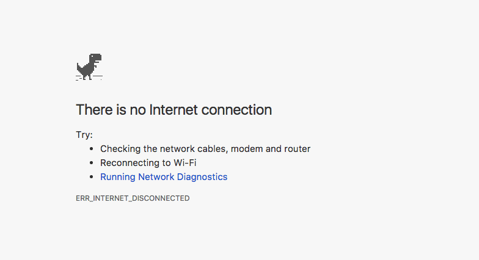

Service Workers explained

# Service Workers explained

## Service Workers are a key technology powering Progressive Web Applications on the mobile web. They allow caching of resources and push notifications, two of the main distinguishing features that up to now set native apps apart

 Published Feb 17, 2018, Last Updated Apr 14, 2019

> Learning JavaScript? Download my free **> [> JavaScript Handbook](https://flaviocopes.com/page/javascript-handbook/)**>

* * *

[   Sponsored by Microsoft Azure                  Build Machine Learning and AI Solutions    Easily train your machine learning models in Azure.    Learn More](https://srv.buysellads.com/ads/click/x/GTND42QUCTAI453WCE7LYKQMCAYIT277CVSDPZ3JCWSI4K3UCVBIC2JKC6BI5K37CYYDEK3EHJNCLSIZ?segment=placement:flaviocopescom;)

- [Introduction to Service Workers](https://flaviocopes.com/service-workers/#introduction-to-service-workers)
- [Background Processing](https://flaviocopes.com/service-workers/#background-processing)
- [Offline Support](https://flaviocopes.com/service-workers/#offline-support)
    - [Precache assets during installation](https://flaviocopes.com/service-workers/#precache-assets-during-installation)
    - [Caching network requests](https://flaviocopes.com/service-workers/#caching-network-requests)
- [A Service Worker Lifecycle](https://flaviocopes.com/service-workers/#a-service-worker-lifecycle)
    - [Registration](https://flaviocopes.com/service-workers/#registration)
    - [Scope](https://flaviocopes.com/service-workers/#scope)
    - [Installation](https://flaviocopes.com/service-workers/#installation)
    - [Activation](https://flaviocopes.com/service-workers/#activation)
- [Updating a Service Worker](https://flaviocopes.com/service-workers/#updating-a-service-worker)
- [Fetch Events](https://flaviocopes.com/service-workers/#fetch-events)
- [Background Sync](https://flaviocopes.com/service-workers/#background-sync)
- [Push Events](https://flaviocopes.com/service-workers/#push-events)
- [A note about console logs](https://flaviocopes.com/service-workers/#a-note-about-console-logs)

## Introduction to Service Workers

Service Workers are at the core of [Progressive Web Apps](https://flaviocopes.com/progressive-web-apps/), because they allow caching of resources and push notifications, two of the main distinguishing features that up to now set native apps apart.

A Service Worker is **programmable proxy** between your web page and the network, providing the ability to intercept and cache network requests, effectively **giving you the ability to create an offline-first experience for your app**.

It’s a special kind of web worker, a [JavaScript](https://flaviocopes.com/javascript/) file associated with a web page which runs on a worker context, separate from the main thread, giving the benefit of being non-blocking - so computations can be done without sacrificing the UI responsiveness.

Being on a separate thread it has no [DOM](https://flaviocopes.com/dom/) access, and no access to the [Local Storage](https://flaviocopes.com/web-storage-api/) APIs and the [XHR](https://flaviocopes.com/xhr/) API as well, and it can only communicate back to the main thread using the [**Channel Messaging API**](https://flaviocopes.com/channel-messaging-api/).

Service Workers cooperate with other recent Web APIs:

- [**Fetch API**](https://flaviocopes.com/fetch-api/)
- [**Cache API**](https://flaviocopes.com/cache-api/)

And they are **only available on HTTPS** protocol pages, except for local requests, which do not need a secure connection for an easier testing.

## Background Processing

Service Workers run independent of the application they are associated to, and they can receive messages when they are not active.

For example they can work:

- when your mobile application is **in the background**, not active
- when your mobile application is **closed**, so even not running in the background
- when **the browser is closed**, if the app is running in the browser

The main scenarios where Service Workers are very useful are:

- they can be used as a **caching layer** to handle network requests, and cache content to be used when offline
- to allow **push notifications**

A Service Worker only runs when needed, and it’s stopped when not used.

## Offline Support

Traditionally the offline experience for web apps has been very poor. Without a network, often web mobile apps won’t work, while native mobile apps have the ability to offer either a working version, or some kind of nice message.

This is not a nice message, but this is what web pages look like in Chrome without a network connection:

Possibly the only nice thing about this is that you get to play a free game by clicking the dinosaur, but it gets boring pretty quickly.

In the recent past the HTML5 AppCache already promised to allow web apps to cache resources and work offline, but its lack of flexibility and confusing behavior made it clear that it wasn’t good enough for the job, failing its promises (and [it’s been discontinued](https://html.spec.whatwg.org/multipage/offline.html#offline)).

Service Workers are the new standard for offline caching.
Which kind of caching is possible?

### Precache assets during installation

Assets that are reused throughout the application, like images, CSS, JavaScript files, can be installed the first time the app is opened.

This gives the base of what is called the [**App Shell architecture**](https://flaviocopes.com/progressive-web-apps/#the-app-shell).

### Caching network requests

Using the **Fetch API** we can edit the response coming from the server, determining if the server is not reachable and providing a response from the cache instead.

## A Service Worker Lifecycle

A Service Worker goes through 3 steps to be fully working:

- Registration
- Installation
- Activation

### Registration

Registration tells the browser where the server worker is, and it starts the installation in the background.

Example code to register a Service Worker placed in `worker.js`:

	if ('serviceWorker' in navigator) {
	  window.addEventListener('load', () => {
	    navigator.serviceWorker.register('/worker.js')
	    .then((registration) => {
	      console.log('Service Worker registration completed with scope: ',
	        registration.scope)
	    }, (err) => {
	      console.log('Service Worker registration failed', err)
	    })
	  })
	} else {
	  console.log('Service Workers not supported')
	}

Even if this code is called multiple times, the browser will only perform the registration if the service worker is new, not registered previously, or if it has been updated.

#### Scope

The `register()` call also accepts a scope parameter, which is a path that determines which part of your application can be controlled by the service worker.

It defaults to all files and subfolders contained in the folder that contains the service worker file, so if you put it in the root folder, it will have control over the entire app. In a subfolder, it will only control pages accessible under that route.

The example below registers the worker, by specifying the `/notifications/` folder scope.

	navigator.serviceWorker.register('/worker.js', {
	  scope: '/notifications/'
	})

The `/` is important: in this case, the page `/notifications` won’t trigger the Service Worker, while if the scope was

	{
	  scope: '/notifications'
	}

it would have worked.

> NOTE: The service worker cannot “up” itself from a folder: if its file is put under `/notifications`> , it cannot control the `/`>  path or any other path that is not under `/notifications`> .

### Installation

If the browser determines that a service worker is outdated or has never been registered before, it will proceed to install it.

	self.addEventListener('install', (event) => {
	  //...
	});

This is a good event to prepare the Service Worker to be used, by **initializing a cache**, and **cache the App Shell** and static assets using the **Cache API**.

### Activation

The activation stage is the third step, once the service worker has been successfully registered and installed.

At this point, the service worker will be able to work with new page loads.

It cannot interact with pages already loaded, which means the service worker is only useful on the second time the user interacts with the app, or reloads one of the pages already open.

	self.addEventListener('activate', (event) => {
	  //...
	});

A good use case for this event is to cleanup old caches and things associated with the old version but unused in the new version of the service worker.

## Updating a Service Worker

To update a Service Worker you just need to change one byte into it, and when the register code is run, it will be updated.

Once a Service Worker is updated, it won’t become available until all pages that were loaded with the old service worker attached are closed.

This ensures that nothing will break on the apps / pages already working.

Refreshing the page is not enough, as the old worker is still running and it’s not been removed.

## Fetch Events

A **fetch event** is fired when a resource is requested on the network.

This offers us the ability to **look in the cache** before making network requests.

For example the snippet below uses the **Cache API** to check if the request URL was already stored in the cached responses, and return the cached response if this is the case. Otherwise, it executes the fetch request and returns it.

	self.addEventListener('fetch', (event) => {
	  event.respondWith(
	    caches.match(event.request)
	      .then((response) => {
	        if (response) { //entry found in cache
	          return response
	        }
	        return fetch(event.request)
	      }
	    )
	  )
	})

## Background Sync

Background sync allows outgoing connections to be deferred until the user has a working network connection.

This is key to ensure a user can use the app offline, and take actions on it, and queue server-side updates for when there is a connection open, instead of showing an endless spinning wheel trying to get a signal.

	navigator.serviceWorker.ready.then((swRegistration) => {
	  return swRegistration.sync.register('event1')
	});

This code listens for the event in the Service Worker:

	self.addEventListener('sync', (event) => {
	  if (event.tag == 'event1') {
	    event.waitUntil(doSomething())
	  }
	})

`doSomething()` returns a promise. If it fails, another sync event will be scheduled to retry automatically, until it succeeds.

This also allows an app to update data from the server as soon as there is a working connection available.

## Push Events

Service Workers enable web apps to provide native Push Notifications to users, through the use of:

- [Push API](https://flaviocopes.com/push-api/)
- [Notifications API](https://flaviocopes.com/notifications-api/)

Push and Notifications are actually two different concepts and technologies, but combined to provide what we know as **Push Notifications**. Push provides the mechanism that allows a server to send information to a service worker, and Notifications are the way service workers can show information to the user.

Since Service Workers run even when the app is not running, they can listen for push events coming, and either provide user notifications, or update the state of the app.

Push events are initiated by a backend, through a browser push service, like the one provided by [Firebase](https://flaviocopes.com/firebase-hosting).

Here is an example of how the service worker can listen for incoming push events:

	self.addEventListener('push', (event) => {
	  console.log('Received a push event', event)

	  const options = {
	    title: 'I got a message for you!',
	    body: 'Here is the body of the message',
	    icon: '/img/icon-192x192.png',
	    tag: 'tag-for-this-notification',
	  }

	  event.waitUntil(
	    self.registration.showNotification(title, options)
	  )
	})

## A note about console logs

If you have any console log statement (`console.log` and friends) in the Service Worker, make sure you turn on the `Preserve log` feature provided by the [Chrome DevTools](https://flaviocopes.com/browser-dev-tools/), or equivalent.

Otherwise, since the service worker acts before the page is loaded, and the console is cleared before loading the page, you won’t see any log in the console.

* * *

[Found a typo or problem? Edit this page](https://github.com/flaviocopes/website-content/blob/content/post/web-platform-api/service-workers/index.md)