Setosa data visualization and visual explanations

# Setosa data visualization and visual explanations

 [ 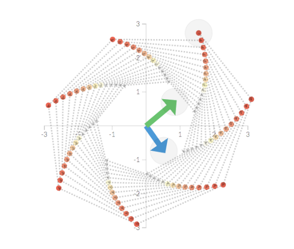](http://setosa.io/ev/)

#### [Explained Visually](http://setosa.io/ev/)

An experiment in making hard ideas intuitive.

 [ 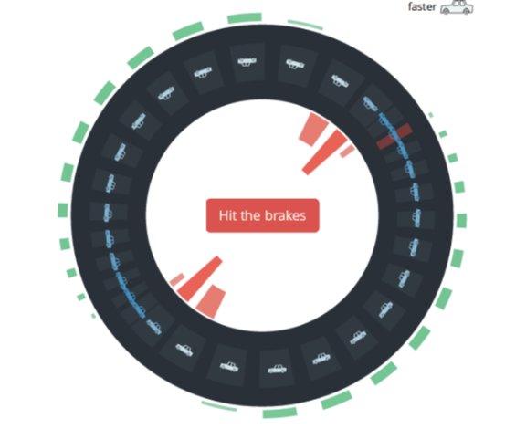](http://blogs.kqed.org/lowdown/2013/11/12/traffic-waves)

#### [Traffic Waves](http://blogs.kqed.org/lowdown/2013/11/12/traffic-waves)

Negative feedback

 [ 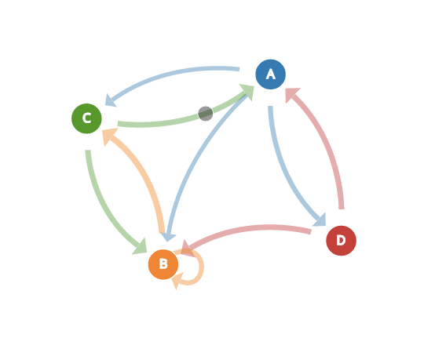](http://setosa.io/blog/2014/07/26/markov-chains/index.html)

####   [Markov Chains](http://setosa.io/blog/2014/07/26/markov-chains/index.html)

Mark on, Markov

 [ 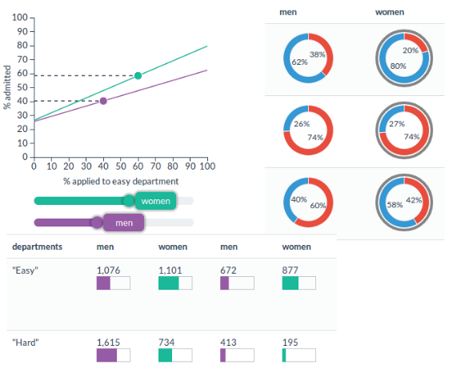](http://vudlab.com/simpsons/)

#### [Simpson's Paradox](http://vudlab.com/simpsons/)

Girls gone average. Averages gone wild.

 [ 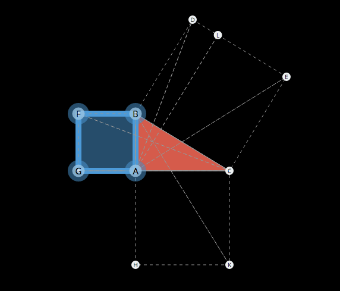](http://setosa.io/pythagorean)

#### [Pythagorean Theorem](http://setosa.io/pythagorean)

Prove it.

 [ 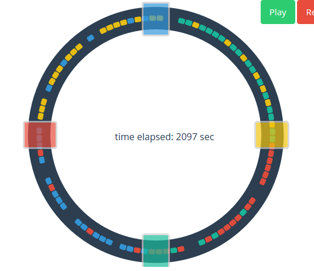](http://setosa.io/blog/2014/09/02/gridlock/)

#### [Gridlock vs. Bottlenecks](http://setosa.io/blog/2014/09/02/gridlock/)

Our site generates lots of traffic.

 [ 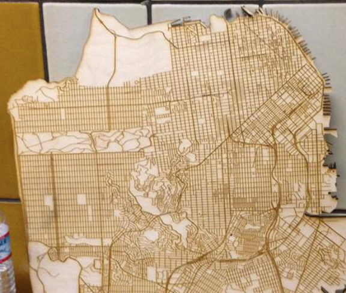](http://setosa.io/blog/2014/08/10/woodcut-data-visualization/)

#### [Woodcut Data Visualization](http://setosa.io/blog/2014/08/10/woodcut-data-visualization/)

Because lasers.

 

####   [Stop to Stop on BART](http://vudlab.com/bart/)

Where did you come from? Where did you go?

 [ 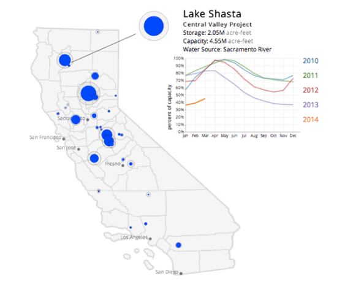](http://blogs.kqed.org/lowdown/2014/03/18/into-the-drought-californias-shrinking-reservoirs/)

####   [Shrinking Reservoirs](http://blogs.kqed.org/lowdown/2014/03/18/into-the-drought-californias-shrinking-reservoirs/)

How the Drought is Shrinking California’s Reservoirs

 [ 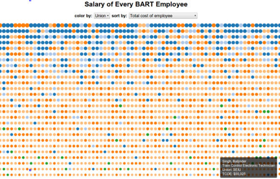](http://blog.vctr.me/bart/)

####   [Bart Salaries](http://blog.vctr.me/bart/)

Make $120k OT on $80k base.

 [ 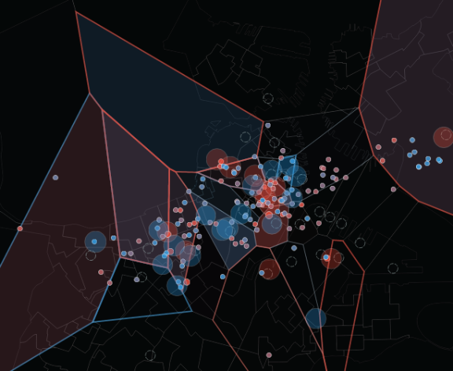](http://mitbigdatachallenge.s3.amazonaws.com/public/map.html)

#### [Boston Taxis](http://mitbigdatachallenge.s3.amazonaws.com/public/map.html)

The MIT Big Data Challenge.

 

#### [CSV Fingerprints](http://setosa.io/blog/2014/08/03/csv-fingerprints/)

CSI: CSV

 [ 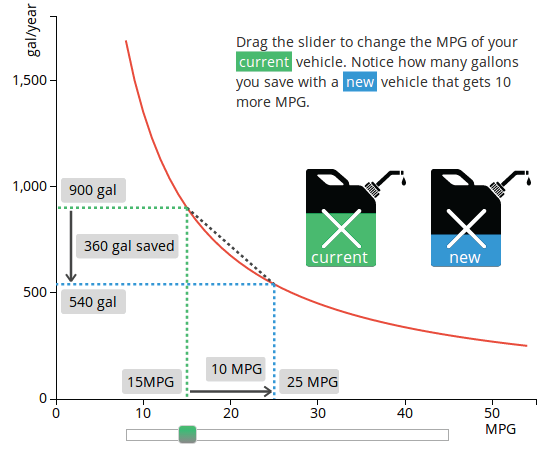](http://blogs.kqed.org/lowdown/2013/12/10/gas-mileage/)

#### [Deceptions per Gallon](http://blogs.kqed.org/lowdown/2013/12/10/gas-mileage/)

A matter of proportion.

 

#### [Conditional Probability](http://setosa.io/conditional/)

You probably wouldn't understand.

 [ 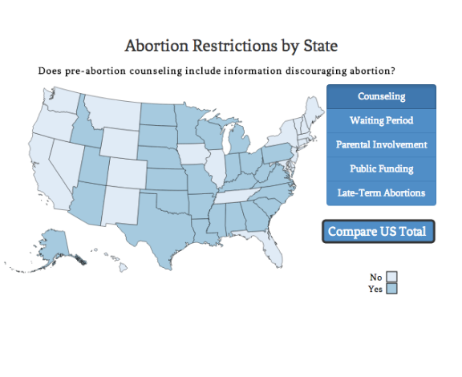](http://blogs.kqed.org/lowdown/2014/03/27/abortion)

#### [State Abortion Rates](http://blogs.kqed.org/lowdown/2014/03/27/abortion)

Abortion Rates and Restrictions Where You Live

 [ 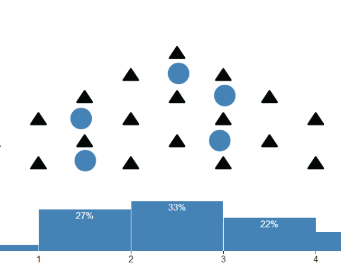](http://blog.vctr.me/posts/central-limit-theorem.html)

#### [The Central Limit Theorem](http://blog.vctr.me/posts/central-limit-theorem.html)

Too much of anything is perfectly normal.

 [ 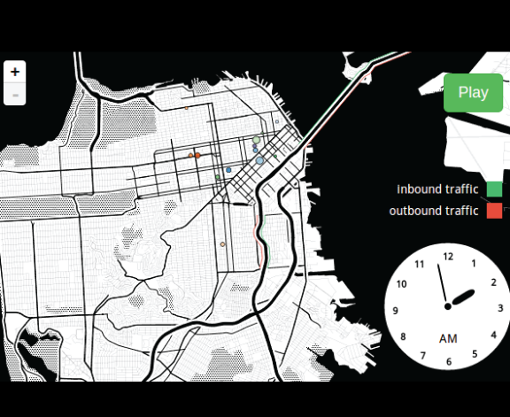](http://blogs.kqed.org/lowdown/2014/01/10/how-city-populations-change)

####   [San Francisco's Ebb and Flow](http://blogs.kqed.org/lowdown/2014/01/10/how-city-populations-change)

How parked cars show people moving.

 [ 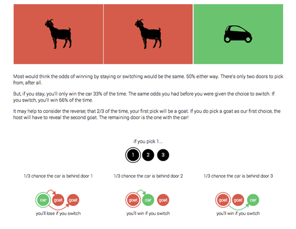](http://blog.vctr.me/monty-hall/)

#### [Monty Hall](http://blog.vctr.me/monty-hall/)

hint: you should switch