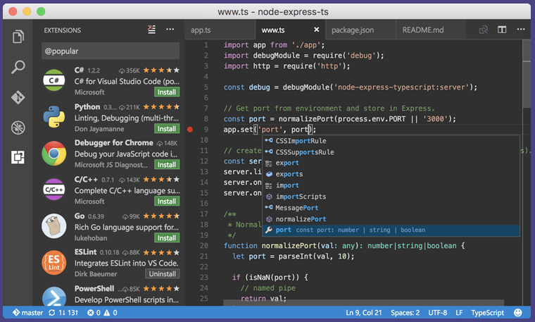
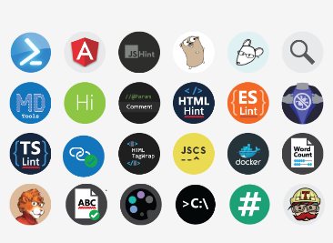
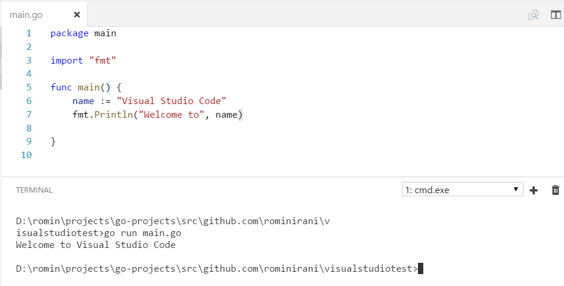
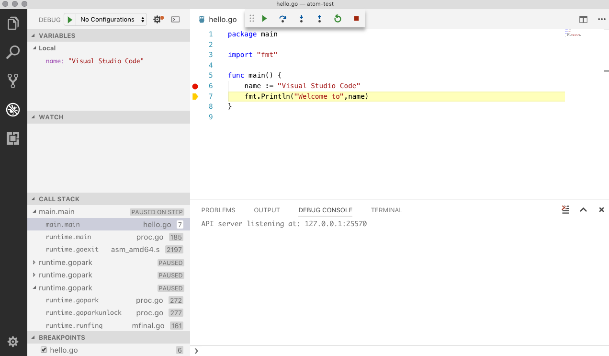

Setup Go Development Environment with Visual Studio Code

# Setup Go Development Environment with Visual Studio Code

> Last Update : October 14, 2017 : Updated instructions for latest version of Visual Studio Code with screenshots.

Its been a while since I moved to Visual Studio Code for Golang and it has been a great experience. Earlier, I had [written about configuring the Atom Editor for Golang development](https://rominirani.com/setup-go-development-environment-with-atom-editor-a87a12366fcf) and this one is about setting Visual Studio Code for the same.

Visual Studio Code is not the same as the full Visual Studio, that Microsoft is well-known for. Years back, when I was doing development with Microsoft, this was the IDE that set high standards and I personally think, no other IDE can still come close to that.

Just like Atom, [Visual Studio Code](https://code.visualstudio.com/) is an excellent editor with a plugin ecosystem for most languages and tools. Install the right plugins and you are good to Go :-)

What I liked about Visual Studio code was that it felt a lot more responsive compared to Atom. Your experience could be different though. Let’s get going with the setup.

Keep in mind that we are talking about setting up a Golang environment in Visual Studio but it has a huge ecosystem of extensions that you can install for the development language of your choice.

First up, we are go to install and setup Visual Studio Code Editor. Follow these steps:

- •Download the installer for your OS and install Visual Studio Code from [https://code.visualstudio.com](https://code.visualstudio.com/). Go with the defaults for all the installation steps.
- •Ensure you have already installed Go on the same development machine.
- •Make sure that GO binaries are available in the PATH and that GOPATH Environment variable has been set up too.
- •Make sure that you are connected to the Internet since the plugins will be downloaded from external repositories.
- •Launch Visual Studio Code.
- •Use the (**Ctrl (Command on Mac)+Shift+x) **combination to go to the Extensions option in Visual Studio Code or click on the last option in the navigation bar, which is for Extensions as shown below:

- •You can type “go lang” in the search bar and you should come to the Go extension.

- •Click on Install for the first extension that comes up (by lukehoban). The message will change to “Installing” .. give it some time and then it will change to the following:

- •Click on **Reload.** It will mention that the reload operation will activate the “Go” extension, which is what we want. So click on “OK”. This will reload the Visual Studio Code Editor
- •If you click on the “Extensions” option again, you will see that the Go Extension is now installed in your editor.

### Preferences — Go Development

If you would like to change any of the preferences vis-a-vis the different actions, Go Tools that Visual Studio will invoke for you, you should go to **Preferences **from the main menu.

This will bring up the settings in the editor and you can go to the Go configuration as shown below:

Click that and you will see the various Go Tools settings:

Note that it opens up a **settings.json** file on the right side and allows you to override the default settings, which is a neat feature.

### Visual Studio Code in Action

Let us now validate our Visual Studio Code editor.

Assuming that you have launched Visual Studio Code, the first step to do is to add a Project folder. Assuming that you have setup the GOPATH for your Go Projects, you can select a folder in which you are going to keep your project files. You can take any existing project, but I suggest you make a new folder in your sources folder.

- •In the Visual Studio Editor, go to **File → Open … **You can select the folder that points to the root of your application.
- •Create a new file named** main.go**. You can do that by click on the new file icon as shown below:

Name it main.go as mentioned and put in the standard Hello World program.

- •On saving a file at any time, the file is checked for any compile time issues and several other things like automatically adding the imports or removing them if you are not using them is taken care of. That’s pretty neat. Go ahead and try that.
- •***You might see some missing packages or tools that Visual Studio will prompt you to install. Go ahead and install them.***
- •For e.g. if you make some basic errors in the Go file and you save the file, you will see the errors show up below as shown below:

- •You can either hover over the statement having a problem or better still, simply go to **View → Problems ( or Ctrl-Shift-M) **and see the Problems windows integrated in the IDE itself as shown below:

- •Now let us take a look at how to run the Go application from within the Visual Studio Code editor itself via an Integrated Command Line Windows (Terminal).
- •Now you can launch the Terminal at any time via the **Ctrl + `** key combination. You can also toggle it with this combination.
- •You can now use standard Go commands to run your application. For e.g. go run as shown below:

### Integrated Debugger

The other interesting thing is the integrated debugger in Visual Studio Code. Go ahead and install **delve **first. The instructions are provided over [here](https://github.com/derekparker/delve/blob/master/Documentation/installation/README.md). Once you have that setup, simply go ahead and click in the space before the line number that you want to place a breakpoint on.

Next click on the **Debug **Play icon in the left side top bar and the process breaks at the line where you have placed your breakpoint. You can check the stack, watch a variable or two and even check on the current values of the variables.

Happy Go Programming with Visual Studio Code.

### Troubleshooting

I suggest that you go through the Go for Visual Studio Code [Github page](https://github.com/Microsoft/vscode-go). It contains a ton of information on the Extension and also talks about various features and which tools it uses to provide you this feature. For e.g. completion lists is provided via gocode and so on.

It is likely that you might not have all those tools and you might see a message in the status bar below that says that some tools are missing. Simply click on that to enable the tools to be downloaded. Alternately, the go get commands to get the tools are mentioned in the Github page also.

In case you Intellisense is not working, I suggest to do the following as mentioned in the Github page and over [here](https://github.com/Microsoft/vscode-go/issues/441).

- •Close Visual Studio Code.
- •Go to running process and you might find gocode running. Just kill that.
- •Do a “go get -u github.com/nsf/gocode”
- •Launch the Visual Studio Code editor again.