Seven Days of Heroin

# Seven Days of Heroin

This is what an epidemic looks like

The Enquirer sent more than 60 reporters, photographers and videographers into their communities to chronicle an ordinary week in this extraordinary time.

Enquirer and Media Network of Central Ohio staff

September 10, 2017

 
Underwriter

It’s a little after sunrise on the first day of another week, and Cincinnati is waking up again with a heroin problem. So is Covington. And Middletown. And Norwood. And Hamilton. And West Chester Township. And countless other cities and towns across Ohio and Kentucky.

This particular week, July 10 through 16, will turn out to be unexceptional by the dreary standards of what has become the region’s greatest health crisis.

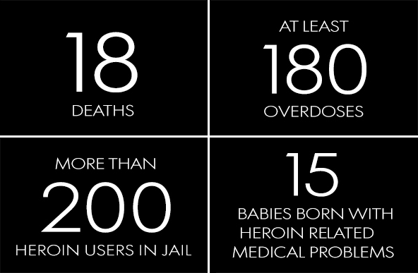

This is normal now, a week like any other. But a terrible week is no less terrible because it is typical. When heroin and synthetic opiates kill one American every 16 minutes, there is little comfort in the routine.

There is only the struggle to endure and survive.

Advertisement

Monday

“I just walked in and my buddy, he hasn’t been answering his phone. I believe he’s OD’d and I think he’s dead.”

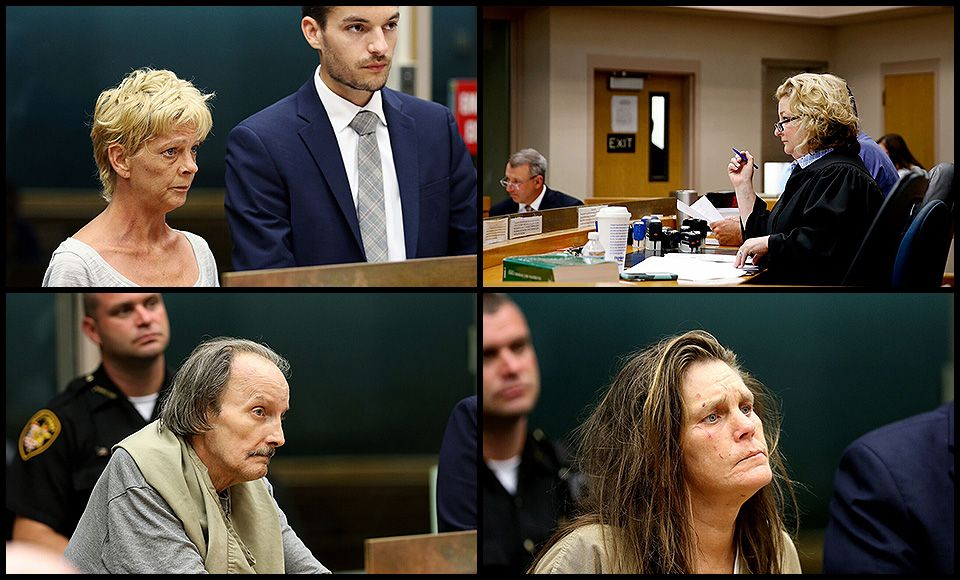

7:25 a.m.

Jimmy Doherty arrives at the halfway house on Ravine Street still wearing the blue slippers he got in jail.

He came straight here after his release this morning because he thinks the program at the Pax House in Cincinnati will help him get his addiction under control.

“We’ll get you going,” says the house manager.

Doherty crushes his cigarette and sits down to fill out a form for new residents, but he’s stumped by a question about his history with drugs. It’s a long history.

“Describe *all* mood-altering substances?” Doherty asks.

The manager shakes his head. “Drug of choice,” he says. “Just put your drug of choice.”

Doherty nods. He turns back to the page and writes a single word.

Heroin.

9 a.m.

On some days, even before she calls their names, Judge Gwen Bender can tell why the defendants are in Courtroom A.

Their bones look as if they might poke through their skin. Their eyes are sunken, their hair a tangled mess. Some are unsteady on their feet. Others scratch at sores on their arms.

A few lean on the table in front of the judge as if it is the only thing holding them up.

“This is a heroin case?” the judge asks.

This morning, as on most mornings, one in four felony cases on this Hamilton County court docket is directly connected to heroin.

There’s a 70-year-old Army veteran who stashed a bag of syringes in a basement crawl space. A Taylor Mill woman who tried to hide needles in her vagina after shooting up. A St. Bernard woman who overdosed when a friend injected her with heroin.

The woman from St. Bernard looks confused, as if she’s unsure how she got here. She was on the floor of her friend’s house, barely breathing, less than 12 hours ago.

Now she’s standing before the judge, eyes sunken and hair tangled, leaning hard against the table.

10:22 a.m.

Tim Reagan’s radio crackles to life as he pulls his late-model sedan onto I-275.

“I’ve got him,” says one voice.

“He drove right past me,” says another.

Reagan is the agent in charge of the Drug Enforcement Administration in Cincinnati. He’s on the road today with about 50 other agents and police officers.

They’re all on the tail of a man suspected of hauling two to three kilos of heroin to a potential buyer in Columbus. Each kilo, which is more than two pounds, is worth up to $300,000 on the street.

Heroin is big business, but not for the Mexican immigrant Reagan is tailing today. He’s just a suspected courier who might make $500 or so. The real money flows to the gangs that control distribution, and to the drug cartels back in Mexico.

When they finally pull him over, police rip up the floor boards and dig through the driver’s back pack. They check the bumpers and the trunk and look for secret compartments in the doors.

Nothing.

Reagan is frustrated. There *have* to be drugs in that car, he thinks.

The agents don’t have time to dwell on what went wrong. About 7,000 kilograms of heroin are seized in the United States every year, three times as much as a decade ago. They will be hunting someone new tomorrow.

11 a.m.

Jeremiah Dotson stands before the judge at the Hamilton County Courthouse, hands shackled behind his back.

He’s been in this spot before. Two years ago, he was charged with heroin possession. Since then, he’s missed meetings with his probation officer and failed to submit urine samples for drug testing.

Judge Melba Marsh looks over his record and tells him he has a choice between two doors: One leads to jail, the other to a treatment facility.

“Which one are you thinking you want to go through?” Marsh asks.

Dotson chooses jail.

“You’re not going to change me,” he says.

12:30 p.m.

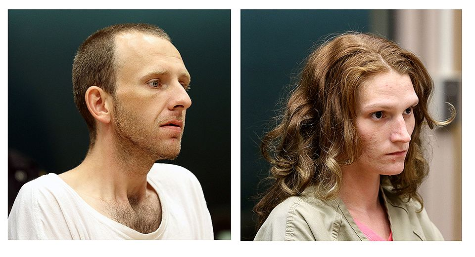

Derrick Stewart, 26, of Lexington, Kentucky and Rikki Asher, 25, of Cynthiana, Ky., pleaded not guilty during their arraignments in Courtroom A at the Hamilton County Justice Center. According to Cincinnati police, the couple 'admitted to shooting up heroin in the vehicle'. Their three-year-old daughter was in the car at the time.

The Enquirer/Cara Owsley

Rikki Asher and Derrick Stewart step into Courtroom A, one after the other. They were arrested two days earlier after running a red light on Gilbert Avenue. Police say they admitted to shooting heroin while Asher was driving.

A used needle was on the floor of the car.

Their 3-year-old daughter was in the back seat.

1:16 p.m.

The Clermont County Quick Response Team pulls up to a small ranch house where a couple in their 60s overdosed the night before.

The couple was given naloxone, also known as Narcan, which reverses the effects of heroin and other opiates and can save people who overdose. Both survived.

It’s the response team’s job to reach out to survivors to try to guide them to treatment.

Union Township Fire Lt. Charlie Caudill walks to the front door and knocks. He waits several minutes before a shirtless man, covered in sores, nudges open the door to see what Caudill wants.

This man is younger than the two overdose survivors. A counselor on the team thinks he’s high.

He pushes the door open just a few inches.

Team members explain why they’re there and offer to set up a time to train him to use naloxone. The man doesn’t want their help.

“I’m not the one with the problem,” he says.

1:25 p.m.

*“Possible heroin overdose, woman on the corner with her eyes rolling in the back of her head.”* – Police scanner call, corner of Melrose and Lincoln.

1:48 p.m.

*“Possible heroin overdose, subject in main area on the first floor between shelves.”* – Police scanner call, Covedale branch library.

2:59 p.m.

*“Overdose in a gold vehicle, other subjects are attempting to perform CPR, last seen driving at high speeds.”* – Police scanner call, no location given.

3:17 p.m.

Dispatcher: “Cincinnati 911.”

Caller: “Hello! Yes, please, sir, my brother and his friend overdosed in my car. I picked them up at McDonald’s and they overdosed in my car.”

“Where you at?”

“I’m by the Rapid Run Park.”

“Are they breathing?”

“Yes.”

“If they’re breathing, do not do CPR.”

“But what if they’re blue?”

“We’re sending the paramedics.”

“OK. Please try to hurry.”

7 p.m.

The meeting begins, as it always does, with the women taking turns sharing how long it’s been since they’ve used drugs.

“I have 65 days.”

“I have 41 days.”

“I have 20 days.”

Tonight, the two dozen women at the WRAP House in Covington are waiting to hear from a young mother who quit heroin three years ago. Some of the women here have been using drugs most of their adult lives. Some are pregnant. Some have children.

To them, three years is a lifetime.

The young mother sits in the middle of the group with her curly haired daughter on her lap. The girl is 3 now. After she was born, the woman left the hospital to buy heroin. Today, she’s working two jobs, has an apartment and is trying to regain full custody of her child.

Then she asks the question about her recovery that she knows they’re all thinking.

“Is it hard?” she says.

“Yeah, it’s hard.”

7:54 p.m.

### The Lost Boys – Part 1: Two sons, two moms, one week

Dispatcher: Campbell County 911. What is your emergency?

Caller: “Yes, um, … I just walked in and my buddy, he hasn’t been answering his phone. I believe he’s OD’d and I think he’s dead.”

Minutes later, Kim Hill’s phone rings. It’s her son Tommy’s girlfriend. She’s hysterical, sobbing, and Kim can’t make out the words.

It sounds like she’s saying her son overdosed. But that can’t be right. Tommy has been doing great. He’s been free of heroin for a year now. He goes to meetings. He’s a mentor to others struggling with addiction.

She hands the phone to a friend. “I think she’s telling me my baby’s dead,” Kim says.

She races to the car and drives to Tommy’s apartment in Newport, where he’s been living on his own for a few months. There are cops on the sidewalk. Someone from the coroner’s office is standing nearby.

This can’t be happening, she thinks. Her baby boy, the son she still calls “Tom Tom” even though he’s now 34, can’t be dead.

She watches the paramedics carry a body bag out the front door and down the concrete steps to the sidewalk. The body is heavy. One of the paramedics loses his grip.

Kim can tell the body inside is hunched over and stiff, as if he’d been dead for hours before anyone found him. As if he were still face down on his bed, alone for God knows how long, a needle in his arm.

Kim screams at them.

“That’s my child! He is not a piece of garbage!”

* * *

Later that night, Lizzie Hamblin logs into Facebook and sees a post from Kim about Tommy. Their sons grew up together, played together.

And battled heroin addiction together.

Lizzie’s son, Scotty Hamblin, walks into the apartment and she can tell he knows about Tommy.

Tommy was more than Scotty’s friend. He was a role model. He sponsored Scotty, 24, in a sober living program, and counseled him as he struggled to stay off heroin.

Lizzie hugs her son. He’s cold and clammy, sweating through his white T-shirt. Something isn’t right.

He’s using again, she thinks.

End of day

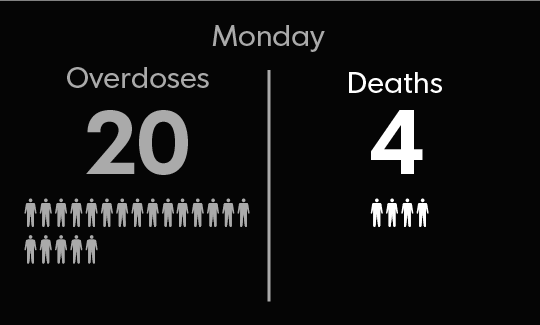

Tuesday

“Please don’t let this destroy you.”

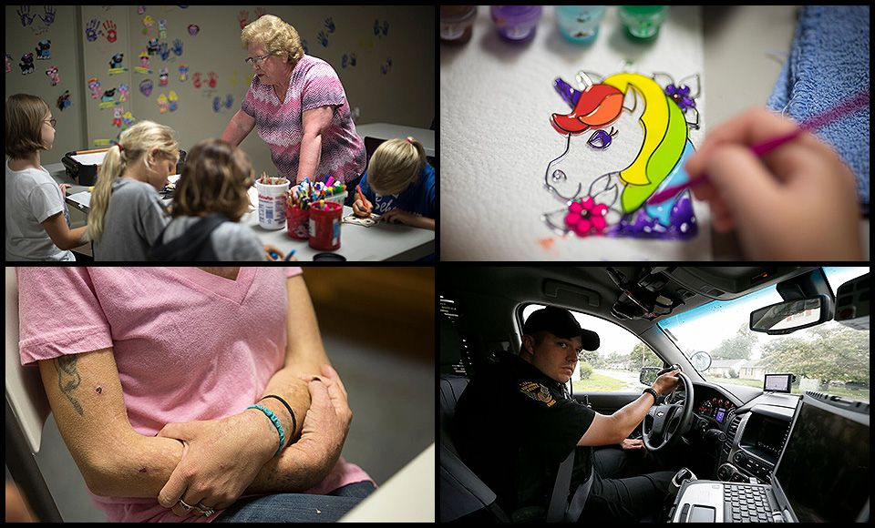

7:40 a.m.

The parking lot at the NKY Med Clinic in Covington is bustling. About 1,200 people come here every day for a dose of methadone, a drug that can stabilize brains rewired by heroin.

One man walks toward the glass doors at the clinic’s entrance with a sleeping baby on his shoulder and a girl in pajamas at his side.

Two women with little boys follow a few minutes later.

Then a man in a business suit.

And a woman in a waitress uniform.

And a young man walking his dog.

And five pregnant jail inmates in orange and white stripes shuffling single file from a van to the entrance, wrists shackled, hands resting on their bellies.

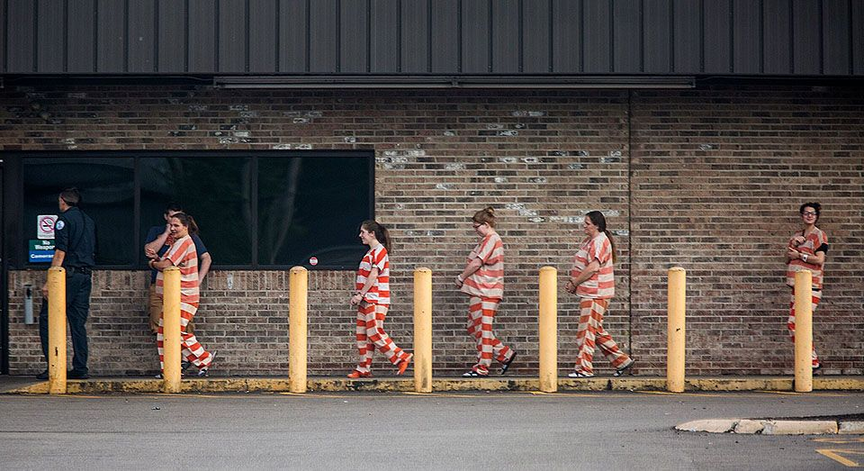

Pregnant inmates are led into the Northern Kentucky Med Clinic in Covington where they receive methadone and counseling. Medication assisted treatment is standard care for women battling addiction to protect the fetus.

The Enquirer/Liz Dufour

9:19 a.m.

A 36-year-old woman paces the kitchen at Tamar’s Place in Over-the-Rhine, waiting for her frozen pizza to finish cooking in the microwave. She’s in a good mood this morning, but it may not last long.

She’ll start going through withdrawal soon unless she gets some heroin.

Sarah came to Tamar’s to clean up and grab a bite to eat. It’s a safe place for prostitutes and women addicted to heroin, but she knows she can’t stay.

Sarah talks to a homeless woman in the kitchen while eating her pizza. The woman says she’s lost two children to heroin in just the past year. She describes waking up in an abandoned building one morning to find her 25-year-old daughter at her side, cold and dead.

Sarah shakes her head. Her arms are covered with sores and needle tracks. She’s been using heroin since she was 17, almost half her life.

“I’m tired of this shit,” Sarah says.

Tomorrow, she tells the woman, she will go to a treatment center. Tomorrow, she will change her life.

Minutes later, tiny bumps appear on Sarah’s arms. It’s gooseflesh, a symptom of withdrawal.

She grabs her phone and heads for the door, racing down two flights of stairs. Once she’s outside, Sarah calls a man she refers to as her “sugar daddy” and asks him to wire money to a nearby Western Union.

Sarah needs a fix.

11 a.m.

### The Lost Boys – Part 2

Kim Hill usually looks forward to the call from Tommy's brother, Devlin. Not today.

Her oldest son, who is doing time for assault in a Kentucky prison, checks in with her every morning around this time. He doesn’t know yet that Tommy is dead.

Kim tells him.

“Please don’t let this destroy you,” Devlin says.

* * *

Lizzie Hamblin hasn’t heard from her son, Scotty, since he walked out the night before. She’s certain he’s using heroin again.

“Scott Hamblin Jr. I need to hear from you,” Lizzie posts on her Facebook page.

She calls him, too. And texts. Each message is more desperate than the last.

“Call me.”

“I need you.”

“I need to hear you are alright.”

12:17 p.m.

Police approach a parked car in Cheviot and find a 33-year-old West Chester woman about to inject heroin into her right arm. She’s holding a syringe filled with the drug and has three other needles in the car.

There’s a man in the car with her. He has a used syringe tucked behind his left ear.

1:10 p.m.

Kacie Rolfes walks into the conference room at the psychiatric hospital and takes a seat across the table from a 7-year-old girl.

The girl is wearing pink shorts and a bright blue T-shirt that reads, “I’m a Dream Believer.”

“Do you know why you’re in this situation?” Rolfes asks.

“Because my mom and dad did drugs,” the girl says.

Rolfes is a Hamilton County social worker. She made the five-hour drive today to the Belmont Pines psychiatric hospital in Youngstown to check on the girl, who suffers from post-traumatic stress disorder and other psychiatric problems.

The girl is from Colerain Township, but she hasn’t been home since she found her mother slumped over the toilet last year, high on heroin and barely conscious. Her father died of an overdose earlier this year.

Children’s services placed the girl with a foster family, but that ended when she tried to drown her foster sister in a YMCA swimming pool. After that, the girl’s doctors sent her here for more intensive treatment.

“Do you need me to do anything for you?” Rolfes asks.

The girl says she’d like Rolfes to bring some things from home.

“I want the picture of me, my brother, sister and mom with my dad,” she says. “A necklace, too. It has a cross on it. My dad gave it to me before he died.”

Rolfes promises to do her best to find the photo and the necklace. If she can, she’ll bring them to their next visit.

When they finish the meeting, the girl leans on the table, looking tired and bored, ready to move on to whatever comes next. Rolfes pats her back softly.

“Take care of yourself, kiddo,” she says.

3 p.m.

Jeff Daunt bounces the baby girl in his arms and makes the kind of goofy face only someone holding a baby can pull off.

“Hi!” he says. “Hiiiiiiiiiiiiiiiiiiiiii there!”

The baby looks up, eyes wide, and gives him a big, toothless grin. This is good, Daunt thinks. This is progress.

Not long ago, Daunt and his wife, Sandy, worried the baby and her 2-year-old sister would never connect to people this way. The children were distant, detached. For months, the baby cried whenever someone tried to hold her.

The Daunts adopted the oldest girl last year and hope to do the same with the baby. They say both kids are the children of heroin users here in Butler, Ky.

Today, the Daunts brought the kids to FIREhouse Ministries for a children’s program. They’re surrounded by a dozen or so other kids who are coloring and playing games. The 2-year-old is right in the middle of it. The baby, still smiling, is taking it all in.

Sandy and Jeff are glad to see them so engaged. Though they have no family relation to the girls, the Daunts, whose biological children are grown, decided they had to help.

They’d looked on for months as the girls' parents, their neighbors, left the children strapped in car seats for hours, or dropped them off with friends for days at a time. Sandy remembers hearing the girls cry and cry inside the trailer where they lived, wondering why no one picked them up and held them and told them everything would be OK.

Someone should be holding those babies, she’d tell herself.

Someone should do something.

10:06 p.m.

An Indiana man is arrested in Avondale after his mother called police to say she caught him using heroin in her car. Police find him in the passenger seat of the car with a needle containing heroin.

End of day

Wednesday

“I need my kids more than they need me.”

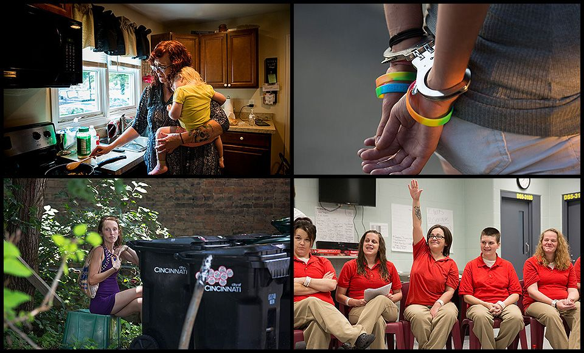

6:06 a.m.

“Good morning!”

Officer Tim Eppstein’s greeting wakes about a half dozen homeless people dozing beneath the I-71 overpass on Butler Street in Cincinnati. Their heads poke out from under dirty blankets, eyes squinting to see who’s there.

“You’re not under arrest,” Eppstein assures them. He’s making the rounds at Cincinnati homeless camps to hand out eviction notices.

As the residents of the makeshift camps slowly get to their feet, Eppstein encourages those addicted to heroin to get some help. He can see by the orange syringe caps littering the ground that many of them need it.

The brightening morning light reveals some familiar faces. Terri Byrd, 26, is here with her boyfriend. Eppstein knows she’s got warrants out for her arrest, mostly on charges of carrying drugs and syringes.

He explains to Byrd that he has to arrest her.

“I’m sorry,” Eppstein says.

The handcuffs snap shut, and tears burst from Byrd’s bright blue eyes.

Her boyfriend stuffs their belongings into a backpack and turns to his girlfriend, now slouched in the caged backseat of the police car.

He blows her a kiss. Then starts walking down Third Street, disappearing into the crowd of people making their way to work.

10 a.m.

### The Lost Boys – Part 3

Kim Hill arrives at the Don Catchen & Sons funeral home in Covington to see her dead son.

Catchen buried her parents a few years back. She trusts him to do his best for Tommy, but he warns her it will be a challenge. Tommy was dead for most of the day before his friend found him and made that 911 call.

“All you are going to see is his face,” Catchen says.

Kim walks downstairs to the mortuary. Tommy’s face is purple and swollen. She thinks it makes his red hair stand out even more.

Kim lies across his chest.

“Why would you do this?” she says, over and over. “Why would you do this, Tom Tom? Why, when you were doing so good?”

* * *

Lizzie Hamblin’s phone pings and she quickly takes a look at the text message. Finally, she thinks, it’s Scotty.

“You don’t give a (expletive) about ur son mom,” the message begins.

Any doubt she had about him using heroin again is gone. This is what the drug does to him. He’s hurting, so he hurts her.

11:30 a.m.

The green Saturn Ion leaves a trail of smoke and sparks as it weaves around traffic on I-471 in Fort Thomas.

A police cruiser pulls up behind and the Saturn veers across the highway, stopping on the emergency strip. Officer Zac Rohlfer sees a lot of this. He’s a member of the Heroin Interdiction Team, which targets dealers and users on the highway.

Rohlfer walks toward the car and tells the two men inside to get out. Michael Fryman and Terry Ray Caseltine emerge slowly from the car, both wearing basketball shorts, tank tops and flip-flops with socks.

Rohlfer and other officers question the men while they search the car. Both seem indifferent, barely paying attention.

The officers find two syringes, one empty and one filled with heroin. Rohlfer explains why he’s arresting them, but he has a question for Fryman before putting him in the police cruiser.

Why would he drive a car after using heroin?

Fryman shrugs his shoulders, and a sheepish grin crosses his face.

“Because I like to drive.”

1:42 p.m.

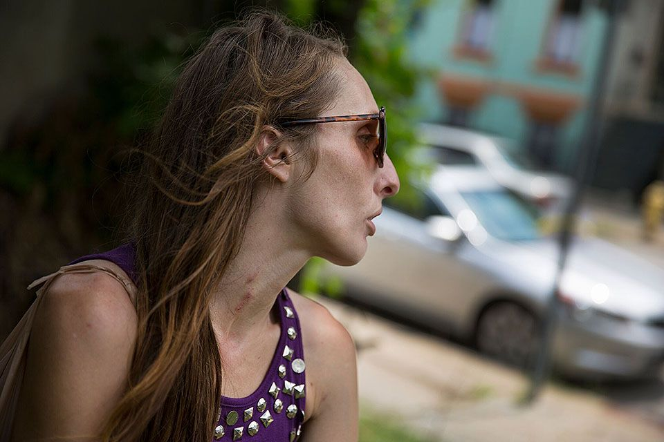

Ali, 25, talks about her need to get some money for fentanyl, her preferred drug, as she stand along West McMicken. Sores on her neck are from the heroin/ fentanyl use.

The Enquirer/Liz Dufour

Ali walks along McMicken Avenue in Over-the-Rhine, looking for someone willing to pay her for sex.

It's what she does to get money to buy fentanyl, and to keep a roof over her head. She’s 25 and addicted to the synthetic opiate. She used to take heroin, but now she prefers the more powerful and more dangerous synthetic.

She’s having trouble finding someone to pick her up on this steamy afternoon.

Ali already has changed her dress today. She’s wearing a metallic-studded, purple mini dress. She knows that sometimes her customers want someone pretty. Other times, it doesn’t seem to matter.

Tall and fine-boned, Ali could be a model. But she is emaciated. She has bruises on her neck from shooting up.

She runs a hand through her long, thick hair, grasps it and lifts it from her shoulders before letting it fall back down. Then she does it again. She’s getting anxious. Withdrawal symptoms are starting to set in and Ali thinks she might vomit on the sidewalk if she doesn’t get a fix.

Ali darts across the street, vanishes for a few minutes and returns with her drug in hand. She hides behind a couple of trash cans and uses it.

About 15 minutes later, she’s back, feeling better, walking the street in the hot summer sun.

2:36 p.m.

Amy Parker is talking about accountability to a roomful of people trying to recover from heroin addiction.

She knows better than most that this is a tough sell.

“It requires you to be responsible,” she says. “It requires you to be honest.”

Heads nod in agreement, but Parker is wary. She quit heroin almost five years ago and she remembers how she’d do and say anything to get by, to get money, to get more heroin.

It took her years and more relapses than she can recall to live drug-free. But she did. She got medicine and treatment. She got a job, met a good guy, renewed her relationship with her daughter and had a baby.

Now Parker is here, at Brightview treatment center in Colerain Township, working as a peer counselor with about a dozen people who are where she used to be: Walking the line between sobriety and relapse.

On the drive home, less than an hour later, Parker spots one of the group members in a parking lot. As she sits at a stop light, Parker watches the woman sidle up to a nice car, lean into an open window and walk away with her fist clenched, as if holding something tightly.

Parker’s heart sinks. She’s seen this before. She’s done this before, back when she was using.

She knows what that clenched fist conceals.

3:11 p.m.

Dispatcher: “Cincinnati 911, what is the address of your emergency?”

Caller: “Hatmaker … it’s the school parking lot. It’s like an emergency. I think he overdosed.”

“Is he breathing?”

“Yeah, but he’s like, ahhhhhrrrrrrrrgh, like he’s growling or something.”

“You’re not sure if he’s breathing?”

“He’s breathing. He’s out. He’s passed out. I think he overdosed.”

4:08 p.m.

The woman begins to cry as she tells the social worker about her conversation today with her kids.

Her oldest sons are 7 and 8 years old. They just passed their swimming tests, and one of them won an award at school for being kind to others. Her 3-year-old girl had a big day, too.

“Mom, I ate an apple,” she’d told her.

The woman is locked up at a Talbert House treatment center and her kids are in a foster home three hours away. She’s been separated from her four children since the day last August when she and her husband shot heroin and overdosed at a family picnic.

“I need my kids,” she says, still crying. “I need my kids more than they need me.”

7:54 p.m.

The paramedics are waiting for Doyle Burke when he walks into the Atrium Medical Center in Middletown.

As the chief investigator for the Warren County coroner’s office, he knows these guys pretty well. They’re the ones who try to revive overdose victims, and Burke is the one who collects the bodies when they can’t.

He’s here tonight to collect a 56-year-old Middletown resident. The paramedics found her unresponsive near her TV. They tried to save her with naloxone, but it was too late.

“Was she ever conscious enough to say anything?” Burke asks.

She wasn’t, they tell him.

They look defeated, and Burke understands why. As a former police detective in Dayton, he took tough cases personally, too. He learned long ago that sometimes it doesn’t matter how hard you work or how much time you invest in someone.

So Burke looks at the paramedics and says the only thing he can think to say.

“You did everything you could do.”

8:35 p.m.

The police officers and medics find the man on the floor of the Speedway bathroom on West Main Street in Newark, sprawled next to the toilet, head under the sink.

They’ve tried spraying naloxone into his nostrils, but it’s had no effect. He’s not breathing. They’re running out of time.

One of the medics takes a drill out of his bag and turns it on. It whirs like a dental drill as he pushes it into the man’s shin bone, trying to create a more direct path for the naloxone to enter the bloodstream.

The medics install a stent and start pushing in doses of the life-saving drug.

The man rouses and tries to stand.

“Lay down, buddy. You overdosed,” a medic says. “We just brought you back to life.”

Later, at the hospital, the man hops off the gurney and runs outside, the stent still embedded in his leg.

End of day

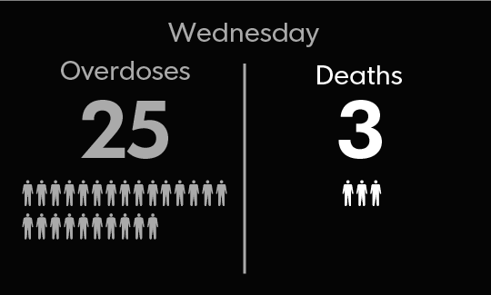

Thursday

“Taxpayers are paying for this crisis, but they didn’t create this crisis.”

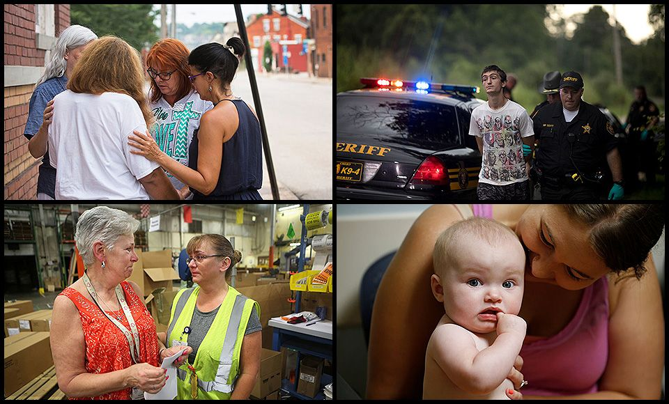

6:16 a.m.

*“Good morning Zachary Ziehm I just wanted to say I love you.”* – Facebook post by Tami George of Crestview Hills, whose son, Zachary, died of a heroin and fentanyl overdose in 2016.

8:22 a.m.

Subject: Desperate need of help

*My family is in desperate need of help. Both my fiancé and I have a substance abuse problem. We have two children one we are about to lose to the state due to our problems. we’ve battled with these addictions most of our lives. We love our daughter and we have tried so hard … I know if we could get away from our area and the poor influences we could succeed and keep this family together. please please help us.* – A post on the website of Transitions, Inc., a Northern Kentucky treatment center.

9:47 a.m.

*“The taxpayers are paying for this crisis, but they didn’t create this crisis.”* – Clermont County Commissioner David Painter, announcing a lawsuit that claims wholesale pharmaceutical distributors fueled the heroin epidemic.

11:07 a.m.

Stephanie Gaffney is cuddling her baby when the nurse practitioner walks into the examining room.

“She got so big!” says the nurse, Patsy Uebel.

Elliana, who turns eight months old today, is here for a checkup at Cincinnati Children’s Hospital Medical Center. She’s a patient at a special clinic that treats babies for neonatal abstinence syndrome, which occurs when babies are born to mothers addicted to heroin.

The infants can suffer tremors, sleeplessness, seizures and other withdrawal symptoms.

Elliana gurgles and wobbles a bit when Uebel sits her on the examining table. As she checks out the baby, Uebel quizzes Gaffney on Elliana’s progress.

“Is she holding things?”

“She takes stuff and then drops it out of her chair,” Gaffney says. “She looks at it, then she looks at me and laughs.”

“Good,” Uebel says.

The clinic’s goal is to monitor the babies, but also to support the mothers. Many, like Gaffney, used heroin and other opiates for years.

Gaffney, 28, quit cold turkey after learning she was pregnant. She’s living now with the baby at First Step Home, a treatment center in Walnut Hills. They plan to move into an apartment together soon.

After years of addiction, Gaffney’s goals are modest. She wants to raise her child in a normal home. She wants a normal life.

Uebel finishes the examination. “She looks real, real good,” she says.

Gaffney is relieved. She scoops Elliana into her arms and takes her appointment card for her next visit to the clinic in December.

“See you then,” she says.

*(Ten days later, Gaffney is dead from a heroin overdose.)*

11:53 a.m.

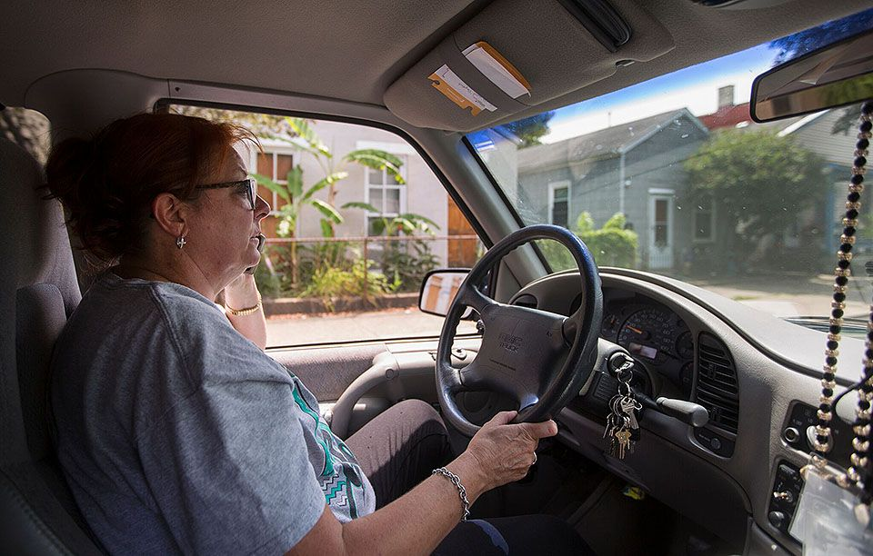

Scarlett Hudson is on a mission. Her nonprofit, the Women of Alabaster Ministries, Inc., has been on West McMicken for almost two years. It's faith based and assists women caught in human trafficking and struggling with addiction. Hudson often drives the women to appointments. The women know they can call Hudson and she'll come. Twice a week, she also does outreach ministry on the streets in Over-the-Rhine and Covington. In the building, women can get food, shower, a nap, clothes and see a nurse once a week. But most important, Hudson says, is not judging what these women are going through.

The Enquirer/Liz Dufour

Scarlet Hudson pulls over when she spots the woman in fuzzy slippers walking along West Pike Street in Covington.

Hudson, known around town as “Momma Scarlet,” is with Women of Alabaster Ministries, a group that helps prostitutes with drug addictions. Many of them, like the woman in the fuzzy slippers, are addicted to heroin.

Today, Hudson packed 20 hamburgers from McDonald's and plastic bags filled with toothpaste, shampoo, wet wipes and other toiletries.

She hands out the food and supplies because the women need them, and because she wants them to know someone cares.

Each bag comes with one of Hudson’s “Momma Scarlet” business cards bearing her phone number.

The woman in the slippers opens one of the bags. “Oooooooh!” she says, smiling.

She’s 53 and a long-time heroin user. Hudson encourages her to give up the street life.

“When you’re ready, sweetie, we’ll help you find a way.”

12:30 p.m.

Despite a steady drizzle, the neighbors gather in the parking lot to gawk as the cops and medics rush inside.

The lot in front of the Middletown apartment complex is small, so there isn’t much room. A rental sign out front says, “Mature Adults -- $400.”

After several minutes inside, a police officer walks out of the building, smiling broadly.

“Hallelujah!” she says. “Narcan works!”

They’d just used the drug to save someone who’d overdosed on heroin. A woman in a purple shirt emerges from the apartment soon after. She’s disheveled with stringy blond hair, walking unsteadily and looking around, as if in an unfamiliar place.

A medic keeps his hand on her elbow as she makes her way to the fire truck.

“Big step,” he says, leading her inside.

2 p.m.

The needle exchange van pulls to a stop alongside a vacant building in Middletown, out of sight from passersby on the road.

Two women hop out and set up a large blue umbrella to hide the faces of clients. They run the Cincinnati Exchange Project like a covert operation: For the next hour or so, drug users will anonymously drop off used needles and walk away with new ones.

The goal is to prevent the spread of HIV, hepatitis C and other viruses that thrive when drug users share needles.

It quickly becomes a popular stop. Skinny young men. Middle-aged women in yoga pants. A guy in a lawn care truck.

One by one, they slip behind the blue umbrella, emerging moments later, new needles in hand.

4:28 p.m.

Dispatcher: "Cincinnati police and fire. How can I help you?"

Caller: "Yes, I'm currently at the Burger King on Glenway and there's somebody passed out in the women's bathroom ... Yeah, she's OD'd."

"Are you sure it's a drug overdose?"

"Yes, the needle was right by her arm."

8:30 p.m.

Brandon McCormick finds a seat in the back of the conference room and waits for the others to arrive.

It’s his first meeting with the “Bedtime Breakfast Club,” a support group at Dorman Products in Warsaw, Ky.

McCormick, 32, is new to the auto parts supplier and to the group. He was worried about coming because he thought it might be held against him, but he was more worried about trying to stay off heroin on his own.

“I’ve been on pills and heroin for the better part of the last seven years,” he tells the group.

He hasn’t used drugs in a month, he says, but he knows he’s not out of the woods. He tells them he thinks about using every day, multiple times a day. He’s afraid of what he might do next week when he cashes his first paycheck and has some money to spend.

“I have nobody to talk to,” McCormick says.

The group leader tells him he’s wrong.

“Now you have a whole big ol' family,” he says.

10:30 p.m.

### The Lost Boys – Part 4

Kim Hill searches through the boxes filled with her son’s belongings, unsure what she’s looking for. There’s a box for Tommy’s clothes, sneakers and hats. There’s a box for his cologne.

She can smell him on the clothes he’ll never wear again, and on the green comforter from the bed he’ll never return home to sleep in.

Kim decides to take the comforter home with her.

She will hold it close tonight, in her own bed, while she tries again to sleep. And she will think, “This is what is left of my child.”

End of day

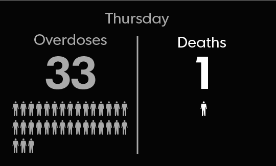

Friday

“She looked bad. She didn’t look like my mom.”

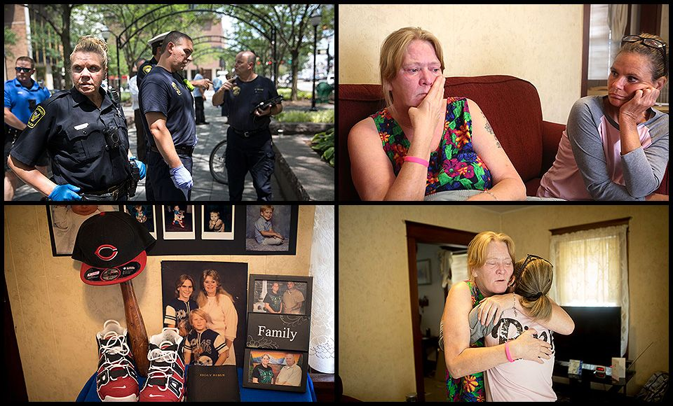

8:01 a.m.

*“This has been a crazy light week for ODs.”* – Andrea Hatten, chief administrator for the Hamilton County coroner’s office, in an email to law enforcement and the media. So far this week, there have been at least 96 overdoses and 10 deaths in Greater Cincinnati.

10:34 a.m.

*“This is a heroin run.”* – Police scanner call regarding ambulance taking someone to Mercy West Hospital.

11:08 a.m.

The door swings open and Tammy Isbel’s two children run to her.

“Give mommy a kiss!” she says, arms enveloping the kids. “A big hug, a big hug.”

Isbel is here at the Family Nurturing Center to celebrate her son’s birthday. Bentley will be 6 in a few days, but she won’t be able to have a party at home with him and his little sister, 3-year-old Bailee.

The children are in the custody of Hamilton County children’s services because Isbel recently relapsed and overdosed on heroin. She’s struggled with addiction for 16 years. The only way she sees the kids now is through supervised visits like this one at the center.

The center is divided into 35 family visitation areas, each 24-by-24 feet. A camera records everything and a social worker watches and listens.

Still, Isbel does her best to make the room feel like home. She and the kids’ dad, Eric Inabnitt, decorated with streamers and balloons. They brought pizza and chips for the kids and a Batman birthday cake for Bentley.

The kids laugh and tear open presents. About an hour into the party, the social worker says: “OK, you guys have a half an hour.”

The family quickly poses for pictures. They hug and kiss and say goodbye. And when the kids say they need to use the bathroom, Isbel takes them by the hand and leads them out of the room. They laugh and squirm.

“Oh no,” she says. “You are not getting away from me.”

11:15 a.m.

*“Three white males just sold heroin. Should be a large amount of heroin in the vehicle.”* – Police scanner call about vehicle heading north on I-71.

11:44 a.m.

*“Prostitute and possible heroin users present in apartment.”* – Police scanner call about possible break-in at home in North Avondale.

noon

### The Lost Boys – Part 5

Lizzie Hamblin pulls a plastic bag filled with photographs from her purse and hands it to Kim Hill.

They sit together on a couch in Kim’s living room, trying to pick which photos to use in the collage they’re making for Kim’s son’s funeral.

There’s one of Tommy and his brother at Easter. Another of Tommy at Christmas.

“I want copies of that,” Kim says.

“You’ll get them,” Lizzie says.

They’ve been friends for so long that many of these memories are shared. Kim asks if Lizzie remembers how people would think Tommy was a girl when he was little because his hair was so long.

Lizzie smiles and they laugh together on the couch, still staring at the photos in their hands.

12:40 p.m.

A 35-year-old woman in a blue tank top and yoga pants collapses on the floor of the public restroom at Findlay Market. A syringe loaded with heroin is at her side when a shopper pushes open the door and finds her, struggling to breathe.

Police and medics are called, but a woman at the market takes action first. She has naloxone packs in her purse and administers the drug before medics arrive.

The woman regains consciousness. Medics take her to the hospital.

1:05 p.m.

Janie Foxx sits at the kitchen table of her Middletown home and imagines the funeral she would like to have for her sons.

Her youngest son, Kevin, died in 2014 from an infection he got using dirty needles. Her oldest, Darrell, overdosed on heroin and died last summer. She keeps their ashes in two black, shoebox-sized containers on a shelf in her family room.

A candle and photos of the boys stand nearby on the shelf. But Foxx wants to do better for them.

She wants to have a memorial service where people could remember her boys as they were before heroin turned their lives to ash. She wants to release white doves and find a nice place to spread their remains.

Foxx is 70, though, and her husband is sick with cancer. They have bills. More money going out than coming in.

So Foxx sits at her kitchen table, drinking coffee reheated from this morning, planning a funeral she may never see.

2:33 p.m.

It’s 86 degrees in Piatt Park when the middle-aged man passes out on a bench in front of Café de Paris.

A bike cop spots him and calls for paramedics. He shoots naloxone into the man’s nostrils, but it doesn’t work.

“He don’t hurt nobody. He’s my friend,” a bystander says.

“He’s drunk,” says another.

No one else pays much attention. Men in business suits walk by. A woman pushes a stroller.

When paramedics show up, they insert an IV and give him another naloxone dose. This time, the man rouses. The medics tell him he should go to the hospital, but he ignores them.

He gets to his feet and slowly walks away.

3:18 p.m.

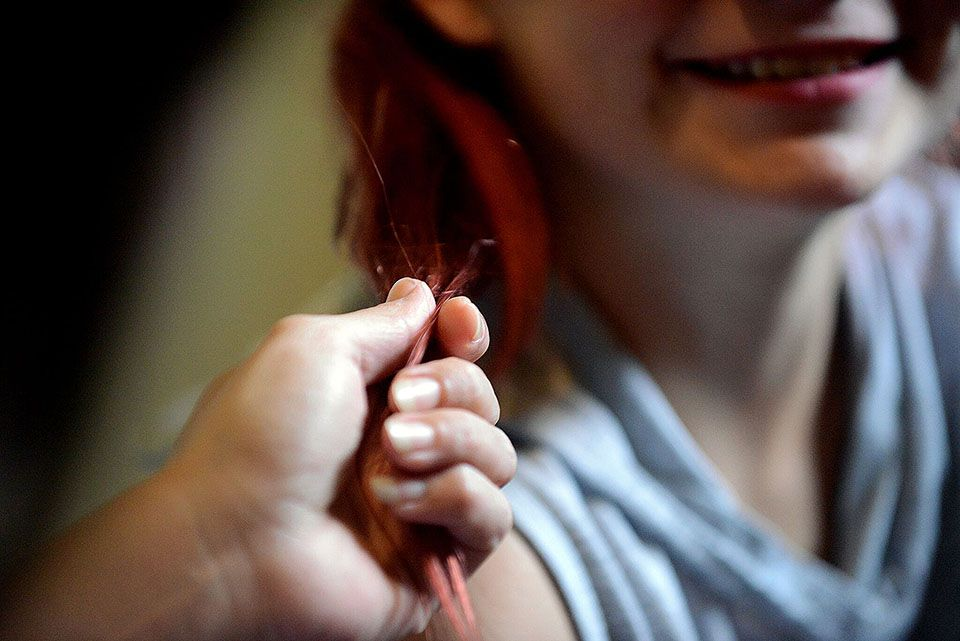

Bree Schreck, a case worker with South Central Ohio Child Protective Services, runs her hand through a young client's hair as she tells her how much she likes the new bright red color. Schreck carries a caseload of a 23 families and must meet with each one at least once a month. Photo shot Friday 14,2017.

The Gazette/Matthew Berry

Bree Schreck walks around the girl’s bedroom, checking out the bright butterfly stickers on the ceiling and the lava lamp on the night stand.

Schreck, a children’s services caseworker, is visiting the 12-year-old girl at her aunt’s house in Chillicothe, where she’s been staying for months because her mom is addicted to heroin.

The girl seems to be doing well. She’s eager to show off her hair, which she’s dyed bright red and braided, like a crown. Shiny bracelets dangle from her wrist and her room is as neat as it is colorful.

But her mood turns when Schreck asks her about the last time she saw her mom. It was in court, the girl says quietly, eyes fixed on the floor.

“How was that?”

“She didn’t look good. She looked bad,” the girl says. “She didn’t look like my mom.”

4:19 p.m..

Dispatcher: “Butler County 911, where is your emergency?”

Caller: “Yeah, I got a possible overdose.”

“Do you know this person?”

“Yeah, it’s my son.”

“Is he awake right now?”

“No.”

“Is he breathing?”

“No … Well, yes. Lowly. I can’t see his chest rising up and down or anything.”

“You probably need to start CPR.”

7:30 p.m.

*"It made me crazy, so insanely hating everything.*

*I tried to change the pain. I cannot take it.*

*I’m breaking down, hoping the next shot of dope I took*

*Would take me down.”*

– Aaron Young raps at the Community Life Church recovery block party in Mount Healthy about his recovery from heroin addiction.

8:36 p.m.

Dispatcher: "What is the address of your emergency?"

Caller: (Gives address in Fairfield Township) "She looks like she's overdosing. The girl just drove off and left her."

"She dropped her off at the house?"

"She just pulled up and put her out of the car. We need to hurry, please!"

"Is she breathing at all?"

"I don't know. You need to hurry."

8:50 p.m.

The 24-year-old woman is wearing a green jumpsuit with silver buttons that barely cover her pregnant belly when she walks into the booking area of the Richland County jail in Mansfield.

She’s starting to experience withdrawal symptoms, which are dangerous to her baby, so corrections officers are going to send her to the hospital.

One of the officers locks a chain to her ankle and another to her hands, across her belly.

“Try not to put it on too tight,” the woman says.

She sits to answer some medical questions, rocking back and forth. She taps her fingers on the chain. Tink, tink, tink.

“How often do you use heroin during the pregnancy?” the medic asks.

“Every day,” she says.

End of day

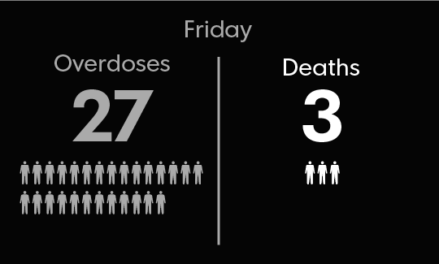

Saturday

“This is a war. There are casualties.”

8:30 a.m.

Gary Moore steps to the podium at the Boone County Sheriff’s office and looks over the crowd.

About 80 people are here, preparing to hand out thousands of pamphlets and door hangers packed with information about addiction and treatment. Some wear T-shirts proclaiming “NKY Hates Heroin,” or “Hope over Heroin.”

Moore, the county’s judge-executive, asks for a show of hands from anyone who’s been touched by the heroin crisis. Nearly every hand goes up.

Then he turns to the few people without hands in the air.

“You are touched by it,” he tells them. “You just don’t know it.”

11:15 a.m.

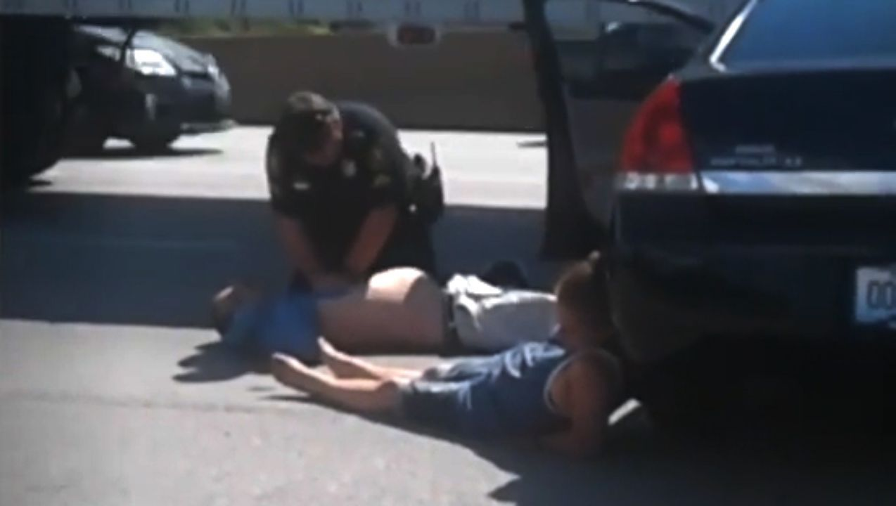

Cars skid and swerve wildly on I-75, near the Western Hills Viaduct. Two slam into a semi-truck and the rest of the cars stop in the middle of the highway.

Horns honk. Tempers flare. Traffic comes to a standstill on the region’s busiest interstate.

Motorists get out of their cars to see if they can help. One peers into the window of a black Chevrolet and sees a woman sitting on a man’s lap in the driver’s seat. The man is turning blue and the woman is tapping on the window, trying to escape the car as she loses consciousness.

Paramedics arrive moments later and revive them both.

Police charge the driver, Kevin Dwayne Pearson, with operating a vehicle under the influence of heroin.

2 p.m.

Becky Neal stands with a small group of protesters, holding a sign bearing the image of the Tin Man from the Wizard of Oz.

“Have a heart! Carry Narcan! Save Lives,” it says.

She’s part of a protest against Butler County Sheriff Rick Jones, who won’t let his deputies carry Narcan. He's the only sheriff in southwest Ohio whose department doesn't use it. Two doses of Narcan cost about $75.

Across the street from Neal, counter-protesters gather to support Jones. They carry very different signs.

“Police are Not Doctors.”

“Heroin Addicts Can Buy Their Own Narcan.”

As TV cameras swarm, one of Jones’ supporters sums up the attitude of his crowd. “This is a war,” he says. “There are casualties.”

3:53 p.m.

An 11-year-old girl dials 911. She can’t wake up her dad. Neither can her brother.

“Are you there, sweetheart?” the dispatcher asks.

“Me and my brother’s here.”

She tells the dispatcher she can’t get her dad up. He’s been like this since last night. He snores, but they cannot wake him.

“I’m afraid that he’s gonna wake up and get mad that I called you guys. But I’m just trying, because I don’t want him to die.”

The two stay on the line, waiting for police and paramedics to show up. But the father’s girlfriend arrives first and takes the phone.

“Oh my God!” the woman yells.

“He’s turning purple!”

Police and paramedics arrive and begin treating the father for an opiate overdose. The little girl takes back the phone.

“You did a great job of calling, OK?” the dispatcher tells the girl.

She’s sobbing, but manages to answer.

“You’re welcome.”

5 p.m.

### The Lost Boys – Part 6

Lizzie Hamblin’s phone keeps buzzing while she gets ready for her cousin’s wedding. The text messages quickly fill up the screen.

“How could you call yourself a mother?”

“You are a rat.”

“Stay out of my life.”

It’s her son, still lashing out. She wants to talk to Scotty, to see him, but she doesn’t respond. Not to messages like these.

Lizzie finishes getting dressed and drives to the wedding in Warsaw, Ky. She decides it will be good for her to get away for a few hours, to be where no one is talking about Scotty or Tommy or heroin.

7:43 p.m.

*“Happy Birthday in Heaven.”* – Facebook post from Kimberly Wright, in memory of Nicholas Specht, who died of a heroin overdose in Fort Thomas in 2013.

8 p.m.

The sun cascades through the enormous oak trees in Maureen Sharib’s front yard as her grandchildren drop into the grass and roll down the hill, giggling most of the way.

Sharib can hear their laughter from the back deck, where she’s sipping lemonade and watching the sun set.

Sometimes, Sharib wonders how they can be so happy. Jaxon is 4 and Brianna is 9 and they have plenty of reasons not to be. Their mom, Natalie Bauer, overdosed and died in January after a decade of battling an addiction to heroin and painkillers.

Sharib, Natalie's mom, is raising Brianna now, and Sharib's sister is raising Jaxon. They’re doing their best to provide safe and happy homes, but it's hard.

Some nights, Brianna will cry out, “I want my mommy! I want my mommy!” Some nights, she climbs into the closet and digs out an old framed photograph of her mom that Sharib hides away, for fear it will upset the kids.

The children will spend the night together, as they do most weekends, here at Sharib’s house in Mount Lookout. They go to bed around 9:30, but Brianna keeps getting up and coming back into the living room.

She finally climbs onto her grandmother's lap. Sharib strokes her hair and kisses her forehead until Brianna closes her eyes.

End of day

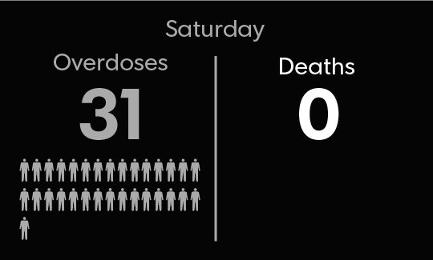

Sunday

“There are no perfect people. It’s important to understand we all make mistakes.”

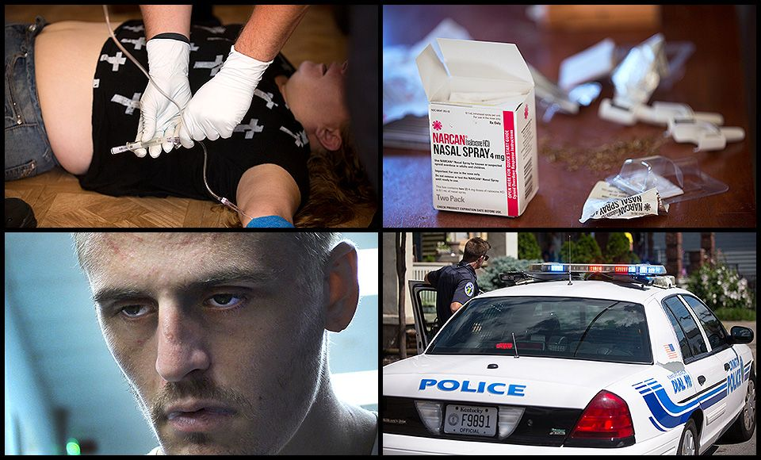

10:35 a.m.

*“There are no perfect people. If you think you’re perfect, think again, because you’re not. It’s important to understand that we all make mistakes.”* – Pastor Troy Gray in a sermon at Zion Baptist Church in Chillicothe, which runs a program to help men after addiction or incarceration.

3:30 p.m.

Covington paramedics find the woman on the floor of a flop house on Howell Street, barely breathing.

Her name is Gracie and they aren’t sure about her age. She’s in pretty bad shape. A neighbor said he gave her three doses of naloxone before the cops arrived. The paramedics are hooking her up to an IV to give her more.

“Gracie? Wake up, Gracie,” one of them says, kneeling next to her.

They rub her chest and continue setting up the IV. They talk about the possibility she took something even worse than heroin, like carfentanil, a synthetic opiate that’s blamed for a growing number of overdoses.

“Either she got a new dealer, or her dealer hosed her,” a paramedic says.

“Gracie? Gracie? Gracie? Want to wake up?”

She gasps and moves her arm.

“Gracie, wake up.”

She moves again and jerks her arm. They warn her to watch the IV line.

“I’m fine,” she says, sleepily.

They ask her to sit up, and she does. “Thank you,” she says.

The cops and paramedics laugh, relieved she’s going to make it. “You’re welcome,” one says.

They tell her they’re going to take her to the hospital, but she doesn’t want to go. She keeps saying she’s fine, that she doesn’t do drugs. Maybe, she says, she just drank too much alcohol and passed out.

They tell her naloxone doesn’t work on alcohol, only on heroin or a synthetic opiate.

“Gracie, you overdosed.”

“No, I didn’t. I don’t do drugs.”

8 p.m.

When the music stops at FIREhouse ministries, Michael Cummins begins to speak.

“A year ago yesterday,” he says, “I lost my 30-year-old son to heroin.”

Many of the 60 or so people who came for evening services at FIREhouse Ministries in Butler, Ky., nod their heads.

“For 15 years, he struggled.”

The music begins to play again, and the people raise their hands and sing.

*“Some bright morning when this life is over,*

*I’ll fly away.*

*To that home on God’s celestial shore,*

*I’ll fly away.”*

8:56 p.m.

The young man wobbles back and forth, struggling to stand, as the deputy at the Hamilton County Justice Center instructs him to take off his shoes.

He manages to get them off, barely, and sits in a plastic chair. A dirty bandage tinged with blood hangs from his arm. His head bobs up and down and he’s slurring his words so much the nurse can barely understand him.

“It’s going to be all right,” she tells him. “It’s going to be all right, baby.”

His name is Dan Stieritz. He’s 24 and he’s the last person sent to the Justice Center this week on charges related to using opiates. The nurse, Tammy Hopkins, is trying to ask him questions before he’s booked into the jail.

“Did you use heroin?”

He doesn’t answer. His head bobs. His eyes flutter.

“Dan? Dan?”

“I heard you,” he says.

Hopkins cleans the wound on the man’s arm and wraps it in white gauze and a new bandage. When she’s finished, Dan looks at his arm and then at the nurse who patched him up.

“Thank you,” he says.

10:30 p.m.

*“Saying so long until I see you again little country girl.”* – Facebook post by Candace Brewer of Covington, in memory of  Devany Mariah Stroude, who died on Wednesday from a heroin overdose.

She was 18.

11:41 p.m.

### The Lost Boys – Part 7

Lizzie Hamblin stands in the doorway of her son’s room. It’s mostly empty now.

Scotty returned while she was gone and took almost everything of value that he owned. He’ll probably sell it, she thinks, so he can buy heroin.

Lizzie told him not to come home if he’s using drugs. She told him she’d call his parole officer if he did. She wants Scotty safe, but for too long she’s let her love for him stand in the way of doing what’s best for him. He needs to get treatment.

Earlier today, Lizzie talked to Kim Hill. She’ll see her tomorrow at the funeral for Kim’s son, Tommy.

Kim told Lizzie she’s praying Scotty gets arrested and locked up before it’s too late.

Lizzie scrolls through her text messages from Scotty. They have been angry, cruel. He blames her for his problems. It’s what he does when he’s using heroin.

She types a message to him: “Love you.”

She will keep saying those words until he hears her.

Her phone pings and she picks it up. It’s a message from Scotty.

“Love you too.”

End of day

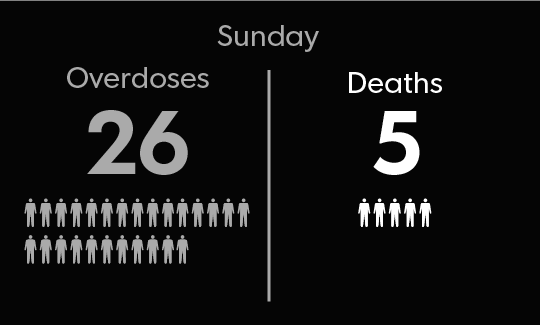

It's almost midnight on the last day of another week, and the heroin epidemic has done its damage.

18: Deaths known or suspected to be the result of overdoses.

180: Overdoses reported to hospitals in the region. This figure underestimates the actual number of overdoses because it only includes those requiring hospital treatment.

210: Inmates in the Hamilton County Justice Center, the region's largest jail, who admitted to using heroin or other opioids. Jail officials have estimated that as many as half of all inmates, about 870 this week, have an opioid problem.

$95,550: Cost to taxpayers to house those 210 inmates for one week. If the inmate total is closer to the estimated 870, the cost would be $395,850.

15: Babies born with health problems because their mothers used heroin or other opioids.

34: Investigations opened in southwest Ohio into the well-being of a child whose parent or guardian was known or suspected of using heroin or other opioids.

102 hours, 42 minutes: Time it took first responders to tend to overdose patients. This figure is considered low by dispatch supervisors because many overdose runs are not initially called in as such.

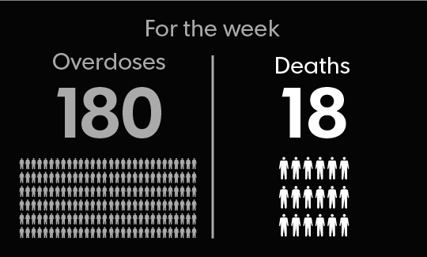

About this project: [From the editor: Why we did this](http://www.cincinnati.com/story/news/2017/09/09/editor-why-we-did/635589001/)

*This story was written by Dan Horn and Terry DeMio.*

*Reported and photographed by Kim Armstrong, Jessie Balmert, Matthew Berry, Keith BieryGolick, Carrie Blackmore Smith, Dana Branham, Sarah Brookbank, Bethany Bruner, Daniel Carson, Mark Caudill, Carrie Cochran, Shae Combs, Chris Crook, Alex Coolidge, Sharon Coolidge, Mark Curnutte, Terry DeMio, Maria Devito, Phil Didion, Liz Dufour, Kareem Elgazzar, Kevin Grasha, Chris Graves, Sam Greene, Dan Horn, Jeanne Houck, Amber Hunt, Jona Ison, Jennie Key, Chad Klimack, Cameron Knight, Lara Korte, Chris Mayhew, Kelly McBride, Courtney McNaull, Emily Mills, Jason Molyet, Carol Motsinger, Sydney Murray, Mike Nyerges, Cara Owsley, Mariel Padilla, Jessica Phelps, James Pilcher, Melissa Reinert, Amanda Rossmann, Anne Saker, Shelly Schultz, Deirdre Shesgreen, Brian Smith, Kathryn Snyder, Hannah Sparling, Jon Stinchcomb, Trista Thurston, Monroe Trombly, Randy Tucker, Sheila Vilvens, Meg Vogel, Sarah Volpenhein, Scott Wartman, Lou Whitmire and Jason Williams.*

*Edited by Amy Wilson, Chrissie Thompson, Amanda Rossmann and Cara Owsley.*

*(These statistics were gathered for Hamilton, Butler, Clermont and Warren counties in Ohio, and Boone, Kenton and Campbell counties in Kentucky. Sources include: coroner's offices in every county, dispatch centers in every county, Job and Family Services in Hamilton, Butler, Clermont and Warren counties, Hamilton County's Department of Pretrial and Community Intervention Services, the Hamilton County Sheriff's Office, Hamilton County Job and Family Services, and The Health Collaborative on behalf of all regional hospitals. Overdose statistics could include a small number of cases involving a drug other than heroin or other opioids.)*



