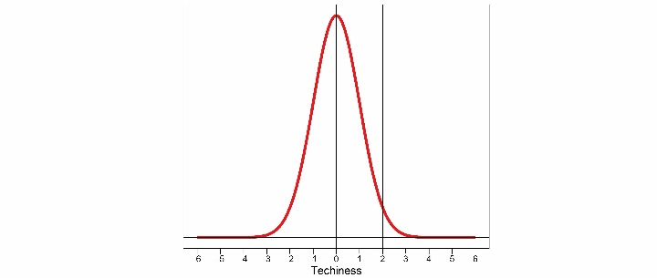
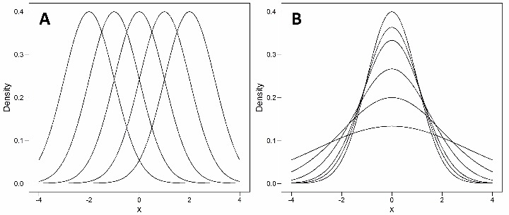
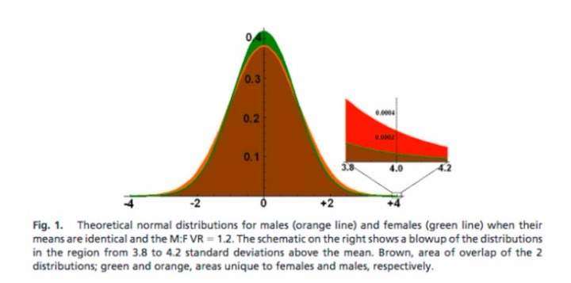
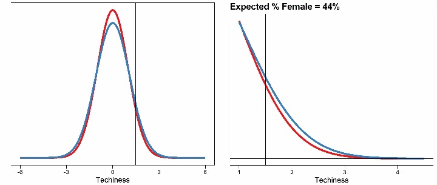

Sex differences |

# Sex differences

    Tue, Sep 12, 2017       **  [academic](https://darrendahly.github.io/tags/academic)

- [**](https://www.facebook.com/sharer.php?u=%2fpost%2f2017-09-12-sex-differences%2f)

- [**](https://twitter.com/intent/tweet?text=Sex%20differences&url=%2fpost%2f2017-09-12-sex-differences%2f)

- [**](https://www.linkedin.com/shareArticle?mini=true&url=%2fpost%2f2017-09-12-sex-differences%2f&title=Sex%20differences)

- [**](http://service.weibo.com/share/share.php?url=%2fpost%2f2017-09-12-sex-differences%2f&title=Sex%20differences)

- [**](https://darrendahly.github.io/post/2017-09-12-sex-differences/mailto:?subject=Sex%20differences&body=%2fpost%2f2017-09-12-sex-differences%2f)

## The Introduction

Remember the whole [Google Memo](https://assets.documentcloud.org/documents/3914586/Googles-Ideological-Echo-Chamber.pdf) thing that happened a hundred years ago? Its central argument (as far as I could tell) was that the large male to female sex ratios we observe in Tech can be reasonably explained by small differences in the sex-specific probability distributions of innate characteristics. Thus Google’s attempts to increase diversity were silly at best, perhaps harmful or unjust, and largely due to a culture of political correctness that was oppressive to “conservative viewpoints”.

The apparent applea of this message wasn’t limited to chauvinist TechBros. Many “moderate” commentators also seemed quite impressed. After all, the memo wasn’t arguing that all men, or even most of them, are better suited than women for tech jobs. That would be ridiculous! But since the existence of sex differences in some traits is scientifically uncontroversial, some supporters of the Google Memo claimed the scientific high-ground. “You see? We aren’t sexist or biased”, they proclaimed. “This is just science.” And you can’t hate on science.

However, despite their self-professed love of logic, scepticism, critical-thinking, reason, data, facts, and evidence, the supporters of the Google Memo never seemed to take next logical step - they never asked the question, “Exactly how big would these differences need to be to explain the large male to female ratios we observe in Tech?”

## Ground Rules

Before answering this question, I want to set a few simplifying assumptions. The first of these is that Google hires fairly, and the male to female ratio we observe in tech jobs at Google is reflective of the total pool of qualified potential applicants. Next we will assume that to be “qualified”, a person has to have high levels of tech related traits which we will reduce to a single, normally distributed variable that we will call *Techiness*. We will further assume that the distribution of Techiness is sex-specific; and that those sex-differences exist at birth and aren’t the result of later social or environmental factors. Taken together, these assumptions (which seem to fall largely in line with what many supporters of the Google Memo believe) mean that any male to female ratio we consider in this scenario would be completely driven by the degree of difference in the sex-specific distribution of innate Techiness.

## The Normal Distribution

Before going on, I want to briefly review the concept of a probability distribution for anyone who needs it (this is most people). Probability distributions play a central role in statistics and data analysis, so as a statistician, they are something that I think about pretty much all the time.

A probability distribution is just a statement that says how often we should expect to see the various values of a given variable (or trait/feature/characteristic/etc.). For example, the plot below (figure 1 A) shows a distribution of height values in a sample of adult men. You will notice that values around 70 inches are relatively common, while values larger than 76 inches are rare. These kinds of statements have great practical value; e.g. what sizes of clothes should I offer in my shop to maximize profit?

Figure 1.

Often times the distributions we observe can be closely approximated by mathematical functions of just a few parameters. The distribution of heights above, for example, is well described by the most famous and useful of these, the normal distribution (figure 1 B), which we see frequently in nature because it describes variables that are themselves influenced by lots of other things.

In mathematical terms, the normal distribution is defined as:
y=1√2πσ2e−(x−μ)22σ2y=12πσ2e−(x−μ)22σ2

It has just two parameters: its mean (μμ) and its standard deviation (σσ). The first parameter, the mean, is pretty easy to understand for most people (it’s just the average value). The SD is a bit trickier. To calculate it, you subtract the mean from each person’s observation (i.e. how different they are from the average); square those values (so positive and negative differences have the same value); take the average of these values (this is called the variance); and then take the square root of the result so you are back on the same scale as the mean. The SD (or the variance) then gives a sense of the dispersion of the sample. It is also common to discuss normally distributed variables in units of SD (e.g. 1 SD of height is equal to 3 inches).

If we are happy to assume that some variable is normally distributed, and we have calculated the mean and SD in the sample, then we can make probability statements about any given range of the variable’s values. For example, the plot below (figure 2) is of the *standard normal*, which is a normal distribution with a mean of zero and a SD of one. The total area under the bell shaped curve represents 100% of the sample’s values. So if we took all the people with a value < 0 (the mean), that would cut the curve exactly in half, i.e. 50% of the sample would have a value < 0. It is also apparent that the bulk of the observations are crowded around the mean.

Figure 2.

We can also calculate the % of people we expect to have a value of X or more, which is critical for what follows. For example, the plot above also divides the distribution at +2 SD. The left side of the divide then contains about 95% of the sample (i.e. 95% of total space under the curve), and the right side (which we might call the right tail of the distribution) includes the other 5%. In words, only about 5% of the people will have a value of 2 or more SDs.

The right tail of the distribution is critical to this exercise because any differences in the sex-specific distributions of our Techiness variable will be more obvious out in the tails of the distribution, and because Google only hires people with the highest Techiness scores. In other words, their pool of potential applicants *is* the right tail of the distribution.

## Back to the question

Given that we are dealing with normal distributions, there are two ways we can perturb the distribution: we can shift the mean left or right (figure 3 A), and/or we can increase or decrease the SD (or variance; figure 3 B). The effect of the latter is to squish the observations out into the tails of the distribution, just as if you were pushing a balloon down with your finger, since the areas under each curve must all equal one.

Figure 3.

The differences in means is what the Google Memo seems to focus on, while the differences in variability were repeatedly brought up in the memo’s aftermath, and appeared again just last week when [Sean Stevens and Jonathan Haidt of Heterodox Academy fame wrote about the Greater Male Variability Hypothesis](https://heterodoxacademy.org/2017/09/04/the-greater-male-variability-hypothesis/). We will start there.

The Greater Male Variability Hypothesis states that some traits will be similarly distributed for men and women, except that the men’s distribution will be more variable, so that there will be more men than women at both the lowest and highest values of the distribution. If this was in fact true for Techiness, then yes, we would expect to see more males than females employed in tech jobs. How much of difference would then be a function of two things – how much more variable the men’s distribution is compared to the women’s, and how far out into the tail you are drawing your workers from.

Stevens and Haidt illustrate this with a plot from [Hyde and Mertz (2009)](http://www.pnas.org/content/106/22/8801.full.pdf), shown below. It essentially shows 2 overlapping normal distributions, one for men (red/orange) and one for women (green; and brown is the overlap), where the means are both zero, but the variance of the men’s distribution is 20% greater than that of the females (this is similar to figure 3B, above). Because the area under each of the overlapping curves must both be equal to one, the green curve is more peaked at the mean, and the red curve is more spread out and has fatter tails.

The plot also zooms in on the values ranging from +3.8 to +4.2 SD and the relative amount of (red + brown) compared to (green + brown) would give the observed sex ratio if this was the place in the distribution where you were drawing your employees from. It’s easy enough to see that the fat tails of the male distribution take up much more space than the tails of the female distribution. Thus the expected male to female ratio in this scenario would be quite large (back with specifics shortly).

Figure 4.

Following from this plot, Stevens and Haidt make the following conclusion:

> “Thus, if males are overrepresented in the upper tail of the distributions for spatial abilities, mechanical reasoning, and mathematics, it would be possible for Google to end up hiring more males and, at the same time, not be discriminatory in their hiring practices. This is because the pool of potentially qualified applicants may contain more males.”

At this point, anyone already familiar with the normal distribution is probably having a sensible chuckle. This is because while Google might be selective in their hiring practices, they aren’t +4 SD selective. This is because, given a normal distribution, we only expect 0.000032% of observations to have a score ≥ 4 SDs above the mean. This percentage equates to just 273 New Yorkers, 30 people from San Francisco, or just 11 thousand people in the entire United States, the 3rd most populous country on earth. Google apparently employs about 50-70k. I don’t know what proportion of these are tech jobs, but I guarantee very few of them are filled with +4SD type talent.

So under these rather unrealistic conditions (+4SD), the exact male to female ratio is 4 to 1 (0.00013 / 0.000032). So what happens if we instead say that Google recruits from the mere mortals with Techiness scores ≥ 2SD, which is still the top 5% of all people? That ratio drops to 1.5 to 1. Despite my enjoyment of Google’s products, I have a hard time believing they are even this selective, so if I lower the hiring threshold to 1.5 SD, the male to female ratio drops to 1.3 to 1 (figure 5).

Figure 5.

I can hear you thinking, “But you said the observed male to female ratio was also a function of the difference in variability of the sex-specific distributions.” So let’s say I double the variance. Then the sex ratio at ≥1.5 SD becomes 2:1. How realistic is this scenario? I have no idea, but thankfully Stevens and Haidt link to a bunch of studies that provide estimates about sex-specific differences in the variance (or SD) of many possibly relevant traits. And guess what? Every one I looked at was well under a 2X difference. Most seem to be around 1.1X to 1.2X.

That’s the hard part done. What about shifting the mean? Starting again from the standard normal, adding 0.10 SD to the male mean would lead to a 1.2 to 1 male to female ratio (at ≥1.5SD); but adding a full SD would give almost 5:1. Remember, a 1 SD shift is a pretty big one (e.g. a difference of 3 inches for height), so not suprisingly, the evidence seems to suggest that the 10% increase in the mean is the more realistic scenario for most variables where differences seem to exist.

## The Conclusion

Science is a tool for explaining what we observe. There is almost always more than one plausible explantion for any observation, and so it’s the job of the scientist to pit these against each other and see which comes out on top. So while differences in sex-specific distributions of innate traits *could* contribute to the male to female sex ratios we see in Tech, they don’t seem to be the dominant factor. As a scientist, I can only conclude that other factors must be at play.

And if you don’t want to stop the fun, I made an [app that you can use](https://darrendahly.shinyapps.io/app1) to recreate the examples above, or to play around with the parameters to your heart’s content.