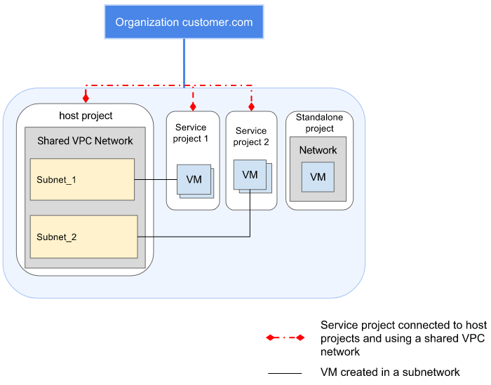
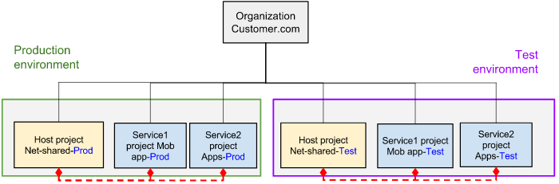
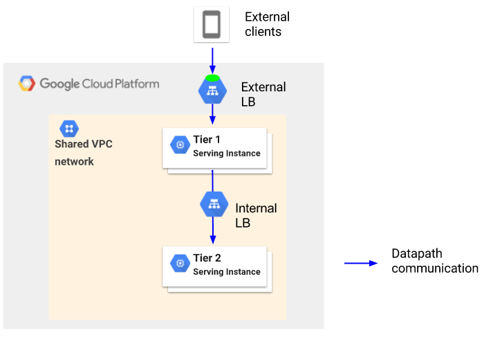
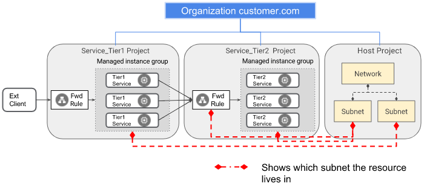
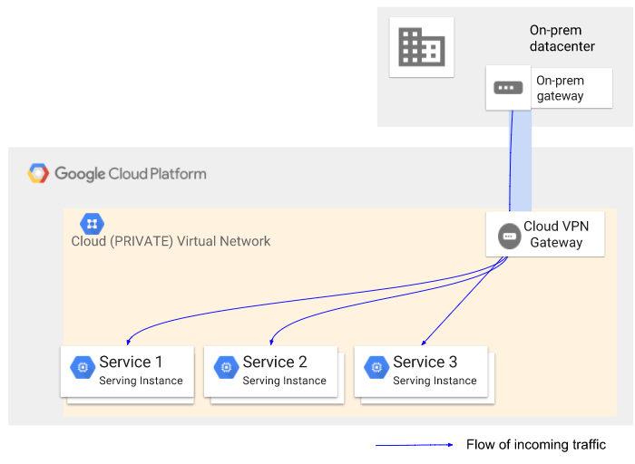
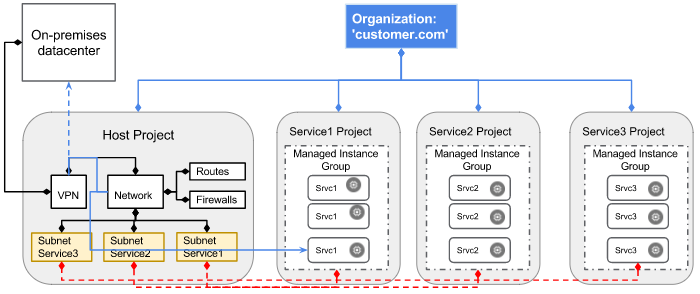

Shared VPC Overview  |  Compute Engine Documentation       |  Google Cloud Platform

star_border
star_border
star_border
star_border
star_border

- [Compute Engine](https://cloud.google.com/compute/)

- chevron_right

 [Documentation](https://cloud.google.com/compute/docs/)

#  Shared VPC Overview

- [Contents](https://cloud.google.com/compute/docs/shared-vpc/#top_of_page)
- [Concepts and terminology](https://cloud.google.com/compute/docs/shared-vpc/#concepts_and_terminology)
- [Shared VPC overview](https://cloud.google.com/compute/docs/shared-vpc/#shared_vpc_overview)
- [Specifications](https://cloud.google.com/compute/docs/shared-vpc/#specifications)
    - [Shared VPC within an Organization structure](https://cloud.google.com/compute/docs/shared-vpc/#shared_vpc_within_an_organization_structure)

    -
    -
    -
    -
-
-
-
    -
    -
-
    -
    -
-
-

You can share Google Cloud Platform (GCP) Virtual Private Cloud (VPC) networks across projects in your[Cloud Organization](https://cloud.google.com/resource-manager/docs/cloud-platform-resource-hierarchy). This capability is referred to as Shared VPC.

star**Note:** Shared VPC was previously known as Cross-Project Networking (XPN).

In large organizations, you may need to put different departments or different applications into different projects for purposes of separating budgeting, access control, and so on. With Shared VPC, Cloud Organization administrators can give multiple projects permission to use a single, shared VPC network and corresponding networking resources.

Shared VPC allows creation of a VPC network of[RFC1918open_in_new](https://tools.ietf.org/html/rfc1918)IP spaces that associated projects can then use. Admins in associated projects can create virtual machine (VM) instances in the shared VPC network spaces. Network and security admins can create VPNs and firewall rules usable by all the projects in the VPC network. Consistent policies can be applied and enforced easily across a Cloud Organization.

## [arrow_upward](https://cloud.google.com/compute/docs/shared-vpc/#top_of_page)Concepts and terminology

The following concepts and terminology are useful when understanding the purpose and scope of Shared VPC.

star**Note:** Shared VPC is sometimes abbreviated as "XPN" in the API and command-line interface.

- **Shared VPC host project** — Project that hosts sharable VPC networking resources within a Cloud Organization. The shared VPC networking resources can be used by other departments (contained in separate Shared VPC service projects) in the Cloud Organization. A shared VPC host project can have several service projects associated with it. You can define which resources can be referenced by other projects and which resources are constrained within a specific project.
- **Shared VPC service project** — Project that has permission to use the shared VPC networking resources from the host project. You can separate service projects so that each service project is operated by a different department in the Cloud Organization. Each department has the ownership of the workloads contained in its project.
- **Standalone project** — A project that does not share networking resources with any other project.In this context, a project that is not an shared VPC host or service project.
- **Shared VPC network** — A VPC network owned by the host project and shared with one or more service projects in the Cloud Organization.
- **[IAM roles and policies](https://cloud.google.com/iam/)** — Policies that you apply to users, groups, or service accounts that provide permissions for them to manage or use resources in the shared VPC network.
- **[Organization](https://cloud.google.com/resource-manager/docs/creating-managing-organization)** — The Cloud Organization is the top level in the [Cloud Resource Hierarchy](https://cloud.google.com/resource-manager/docs/cloud-platform-resource-hierarchy) and the top-level owner of all the projects and resources created under it. A given host project and its service projects must be under the same Cloud Organization.
- **Org admin** (`resourcemanager.organizationAdmin`) — The administrator for a Cloud Organization.
- **Shared VPC admin** (`compute.xpnAdmin`) — The administrator responsible for configuring shared VPC in the Cloud Organization by enabling projects as host projects and attaching service projects to host projects. As a best practice, we recommend that the Shared VPC admin also be a project owner on the host project.
- **Service project admin** — A project admin of a shared VPC service project. Can be project Owners, Editors, Instance admins, or Network admins. See [IAM roles](https://cloud.google.com/compute/docs/access/iam#iam_roles) for details about these roles.
    - **Network admin** (`compute.networkAdmin`) — The administrator with full control of project networking resources.
    - **Security admin** (`compute.securityAdmin`) — The administrator with full control of project security resources.

## [arrow_upward](https://cloud.google.com/compute/docs/shared-vpc/#top_of_page)Shared VPC overview

With Shared VPC, you can make a VPC network shareable across several projects in your Cloud Organization. The shared VPC network must be hosted in a project that you designate as the shared VPC host project. The following diagram shows a host project sharing its VPC network with two service projects. It is sharing "Subnet_1" with one project and "Subnet_2" with another project.

"Standalone project" has not been designated a service project, so it can share no resources with the host project.

 

Sharing a host project VPC network (click to enlarge)

## [arrow_upward](https://cloud.google.com/compute/docs/shared-vpc/#top_of_page)Specifications

The following are some of the key properties and considerations when using Shared VPC.

### Shared VPC within an Organization structure

- You can use Shared VPC only if the host and service projects all belong to the same [Cloud Organization](https://cloud.google.com/resource-manager/docs/creating-managing-organization).
- You can create shared VPC host and service projects in a Cloud Organization at any time after the organization is created.
- You can enable or disable an existing project in the Cloud Organization as a shared VPC host or service project at any time.
- A Cloud Organization can have multiple shared VPC host projects. The following diagram illustrates how a Cloud Organization can have two separate environments, `production` and `test`, each with multiple services. The test environment can be kept isolated from the production environment, and each of them is controlled by their respective administrators.

 

Shared VPC hierarchy (click to enlarge)

### Shared VPC host project and service project associations

- You can associate a service project with one host project only.
- You cannot designate a project as both a service project and a host project at the same time.
- You can only allocate external IPs from the same project where the resource lives. That is, you can only give an instance created in a service project an external IP from that service project.
- Your existing projects can use shared VPC networks. All you need to do is to associate them to a shared VPC host project. However, existing instances in the service network can't be migrated to the shared VPC network. Those instances need to recreated in the shaed VPC network.

### Shared VPC networks

- All existing and future VPC networks and subnets of a shared VPC host project are shared with its associated service projects. Users with `compute.subnetworks.use` permission on the host project or its subnets can use the shared subnetworks.
- [Legacy](https://cloud.google.com/compute/docs/vpc/legacy) networks in a host project are not shared with service projects. The shared VPC networks in a host project must be VPC networks. The VPC networks can be either auto mode VPC networks or custom mode VPC networks.
- Each service project can have its own, unshared VPC networks.

### Quota

- Shared VPC networks charge network quota of the host project the same as non-shared VPC networks.
- A service project can create no more instances or Internal load balancing forwarding rules than its quota allows.
- The host project can have no more instances or Internal load balancing forwarding rules than its quota allows.
- Regardless of quotas, a shared VPC network can have no more than 7000 instances from all projects creating instances in that network. It can have no more than 50 forwarding rules used for Internal load balancing.

### Billing

- Traffic across projects is [billed](https://cloud.google.com/compute/pricing) with the same rules as if it was within a single project.
- In a shared VPC setup, traffic egress billing is attributed to the project that originated the egress traffic. Egress traffic from a virtual machine instance is attributed to the project where the instance lives.
- Costs associated with a [load balancer](https://cloud.google.com/compute/pricing#lb) are charged to the project containing the load balancer.
- Egress traffic to VPNs is attributed to the project that hosts the VPN gateway in GCP. If there is a shared VPN in the host project that is used for several projects in the Cloud Organization, the VPN egress cost for all the projects using the VPN is attributed to the host project.

## [arrow_upward](https://cloud.google.com/compute/docs/shared-vpc/#top_of_page)Shared VPC and internal DNS

VM instances in a shared VPC host network can communicate with each other via internal IP addresses even if the instances were created by different service projects. Instances can also reach each other via fully qualified[internal DNS](https://cloud.google.com/compute/docs/vpc/internal-dns) names in the format `[HOST_NAME].c.[PROJECT_ID].internal`.

## [arrow_upward](https://cloud.google.com/compute/docs/shared-vpc/#top_of_page)Resources that can be attached to shared VPC networks from a service project

This section describes which resources in service projects you can attach to a shared VPC network and its associated subnets. The following shared VPC associations are allowed:

| Shared VPC service project resource | Permitted in VPC Network or Subnet |
| --- | --- |
| Instance | VPC Network, Subnet |
| Instance Template | VPC Network, Subnet |
| Instance Group | VPC Network, Subnet |
| Forwarding rule for Internal load balancing | VPC Network, Subnet |

Service project admins can create instances and instance templates in the shared VPC network.

- When you attempt to create an instance, GCP verifies that you have permission to use the subnet where the instance is created.
- When you attempt to create an instance template, GCP does not check your whether you can use the subnet specified in the instance template. However, when you attempt to create an instance group using the instance template, GCP will check whether you have permissions to all the resources specified in the instance template, including the subnet. This means that while you might have permissions to create an instance template, you might not have permissions to create or use the resources specified in the instance template.

To ensure that you have permission to use a subnet, grant the`compute.networkUser` role. See[IAM in shared VPC](https://cloud.google.com/compute/docs/shared-vpc/#iam_in_shared_vpc) for more information about that role.

You can create instance groups (managed and unmanaged) in service projects attached to a shared VPC network. Instances created as part of managed instance group as part of autoscaling use a[service account](https://cloud.google.com/compute/docs/access/service-accounts).

You can create Internal load balancers in a shared VPC network from a service project. If an Internal load balancer forwarding rule is in the shared VPC network, any instances in the same shared VPC network and in the same region as the forwarding rule can reach the load balancer service, and through it, the load balanced instances.

You must create external load balancers in the same project as the instances they point to.

Only VPC networks can be shared. The following applies when creating instances in VPC networks:

- If your network is an auto mode VPC network, the internal IP address comes from the region's subnet. Therefore, either the VPC network or the subnet can be referenced in the [create instance command](https://cloud.google.com/sdk/gcloud/reference/compute/instances/create) or [create instance template command](https://cloud.google.com/sdk/gcloud/reference/compute/instance-templates/create).
- If your network is a custom mode VPC network, you must specify which subnet the internal IP address comes from. Therefore, the subnet must be referenced in the [create instance command](https://cloud.google.com/sdk/gcloud/reference/compute/instances/create) or [create instance template command](https://cloud.google.com/sdk/gcloud/reference/compute/instance-templates/create).

External IPs live in the same project as the resource that is using them. This applies to instances and forwarding rules.

Resources not listed in this section are not able to link and use an shared VPC network from service projects.

## [arrow_upward](https://cloud.google.com/compute/docs/shared-vpc/#top_of_page)Use cases

This section describes common scenarios that can be used as shared VPC configurations examples.

### Two-tier web service

This scenario reflects a a Cloud Organization with two-tier web services, an externally exposed Tier 1 load balancer and a private Internal load balancer as Tier 2. In this example, each load balancer and associated instances is managed by a different team.

 

Two-tier load balancing with shared VPC (click to enlarge)

The Tier 1 and Tier 2 services can be managed by different teams in the Cloud Organization, each using a different project. Each team has complete control of its service.

- Each team can deploy and operate its services autonomously.
- Each project is billed separately.
- Each project admin can manage their own resources, like virtual machine instances, but has no privileges over the workloads or resources of other teams' projects.
- There can be a single centralized group of network and security admins that are responsible for providing networking connectivity and controlling the security rules for the Cloud Organization.

Shared VPC allows you to map the Tier 1 and Tier 2 services to different projects so that they can be owned autonomously by different teams while sharing a common RFC1918 IP space for the Cloud Organization.

 

Two-tier load balancing details (click to enlarge)

A service project admin in project Service_Tier1 creates an[instance template](https://cloud.google.com/compute/docs/instance-templates)and associated instance groups in a shared VPC host project subnet. A service project admin in project Service_Tier2 creates an[Internal load balancer](https://cloud.google.com/compute/docs/load-balancing/internal/)setup in a different subnet of the shared VPC host project network. In both cases, the resources are owned and maintained in the respective service projects, but they operate in the shared VPC network.

For more details on how to create the VM instance templates and the Internal load balancer forwarding rules, see the section on[creating resources](https://cloud.google.com/compute/docs/shared-vpc/provisioning-shared-vpc#create-resources).

### Hybrid cloud scenario

This scenario describes a Cloud Organization with a hybrid environment in which part of the services are hosted in GCP while some of the applications are kept in their on-premises datacenters.

While different services and applications in the cloud are owned by different departments operating autonomously, a common connectivity with on-premises datacenters must be available to the different cloud applications. Additionally, the connectivity and security rules across services and from/to the on-premises datacenter are controlled by Network and Security admins within the Cloud Organization.

 

Hybrid cloud scenario (click to enlarge)

The administration of the services and its connectivity exhibit the following properties in this scenario:

- Each service is owned and operated by a different department and requires separate billing.
- Each service has admin capabilities over its owned resources (e.g, virtual machine instances), but has no privileges over other departments' workloads or resources.
- Services must communicate within an internal RFC1918 space with some centralized services on-premises, for example an LDAP directory, AAA services, or centralized databases.
- There is a single centralized group of Network and Security admins that are responsible for providing networking connectivity and controlling the security rules for the Cloud Organization.

Shared VPC allows you to map `Service1`, `Service2`, and `Service3` to different projects so that they can be owned autonomously by different departments while sharing a common RFC1918 IP space and a common VPN connectivity with on-premises resources for all the services in the Cloud Organization .

 

Shared VPC setup (click to enlarge)

In this setup, you[create the VM instances](https://cloud.google.com/compute/docs/shared-vpc/provisioning-shared-vpc#create-resources)in the service projects are created with the fully qualified URL or path of the subnet to be used in the shared VPC host project. These instances can also be created as part of a[managed instance group](https://cloud.google.com/compute/docs/instance-groups/), in which case, the subnet is specified as part of the instance templates. As a result, the instances are associated with the specified subnets in the host project. The red dashed lines indicate which subnet the instances are associated with.

Additionally, the VPC network in the host project that contains the subnets has a VPN for private connectivity to on-premises resources. As a consequence, all the instances in the shared network have connectivity with on-premises datacenter through a common VPN. The blue line indicates the data path connecting Service 1 instances with on-premises resources via the shared VPN.

## [arrow_upward](https://cloud.google.com/compute/docs/shared-vpc/#top_of_page)IAM in shared VPC

In Shared VPC, the same as with any standalone project, operations are subject to [Identity and Access Management](https://cloud.google.com/iam/docs/overview) (IAM) permission checks.

### Background

Shared VPC network access is governed by a Cloud IAM policy. IAM policies define a set of bindings between members (e.g., groups) and roles, which define a set of permissions.

GCP IAM allows you to view, set, and test[IAM policies](https://cloud.google.com/iam/docs/managing-policies) via the`GetIamPolicy`, `SetIamPolicy`, and `TestIamPermissions` commands.`GetIamPolicy` and `SetIamPolicy` calls allow users to retrieve and modify the IAM ACLs associated with a resource.

### IAM roles required for shared VPC

#### `compute.XpnAdmin`

An shared VPC admin is responsible for configuring the shared VPC setup by specifying the host projects and associating the service projects. Shared VPC host project admins can also grant `compute.networkUser` permissions to service project admins.

See `compute.networkUser` role in the list of[Available IAM roles](https://cloud.google.com/compute/docs/access/iam#iam_roles) for role permissions.

#### `compute.networkUser`

Shared VPC networks and subnets live in a different project from the one where instances or instance templates are created. A shared VPC admin can grant the `compute.NetworkUser` role to allow a service project admin to "use" a shared VPC project for its instances and instance templates. The Service project admin must also have relevant permissions in their own project.

A user must have two different roles in order to create instances and instance templates in an shared VPC network:

1. A Service project admin role such as Project Owner, Project Editor, or [`compute.instanceAdmin.v1`](https://cloud.google.com/compute/docs/access/iam#iam_roles) in the service project

2. The `compute.networkUser` role at host project or shared subnet level

See `compute.networkUser` role in the list of[Available IAM roles](https://cloud.google.com/compute/docs/access/iam#iam_roles) for role permissions

## [arrow_upward](https://cloud.google.com/compute/docs/shared-vpc/#top_of_page)What's next

- See [Provisioning Shared VPC](https://cloud.google.com/compute/docs/shared-vpc/provisioning-shared-vpc) for instructions on setting up Shared VPC.
- See [Deprovisioning Shared VPC](https://cloud.google.com/compute/docs/shared-vpc/deprovisioning-shared-vpc) for instructions on deleting a Shared VPC setup.

Was this page helpful? Let us know how we did:
star_border
star_border
star_border
star_border
star_border

Except as otherwise noted, the content of this page is licensed under the [Creative Commons Attribution 3.0 License](http://creativecommons.org/licenses/by/3.0/), and code samples are licensed under the [Apache 2.0 License](http://www.apache.org/licenses/LICENSE-2.0). For details, see our [Site Policies](https://developers.google.com/terms/site-policies). Java is a registered trademark of Oracle and/or its affiliates.

Last updated June 7, 2017.