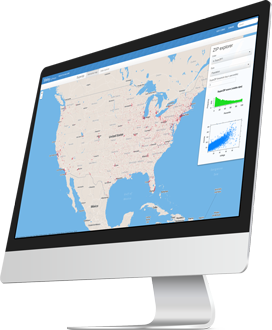

Shiny Server

# Put Shiny Web Apps Online

RStudio lets you put shiny web applications and interactive documents online in the way that works best for you.

For Shiny applications, consider Shiny Server or Shiny Server Pro, which adds enterprise grade scaling, security, and admin features to the basic open source edition.

If you prefer for us to host your Shiny applications, one of our shinyapps.io plans is sure to work for you.

When you’re ready, RStudio Connect is a new publishing platform for all the work your teams create in R. Share Shiny applications, R Markdown reports, dashboards, plots, APIs, and more in one convenient place. Use push-button publishing from the RStudio IDE, scheduled execution of reports, and flexible security policies to bring the power of data science to your entire enterprise.

[**Download Shiny Server Open Source](https://www.rstudio.com/products/shiny/download-server/)

[**Download Shiny Server Pro](https://www.rstudio.com/products/shiny-server-pro/evaluation/)

[**Download RStudio Connect](https://www.rstudio.com/products/connect/evaluation/)

# Compare RStudio Connect, Shiny Server Pro, Shiny Server and Shinyapps.io

| Category | Description | RStudio Connect | Shiny Server Pro | Shiny Server Open Source | Shinyapps.io |
| --- | --- | --- | --- | --- | --- |
| Overview | [Commercial License (not AGPL)](https://www.rstudio.com/products/rstudio/EULA/) |  |     |     |     |
|     | [RStudio Support](https://www.rstudio.com/about/support-agreement/) |     |     |     |     |
|     | Deploy Shiny applications to the Web |     |     |     |     |
|     | Push-button publishing from RStudio IDE |     |     |     |     |
|     | Deploy and access shiny apps, dashboards, R Markdown reports, static plots, and APIs in one place |     |     |     |     |
|     | Scheduled updates and distribution of reports |     |     |     |     |
|     | Self-managed content – see and manage what you’ve published or can access from others |     |     |     | Publishers Only |
|     | Professional Drivers – connect to some of the most popular databases |     |     |     |     |
| Security & Authentication | Password protect applications |     |     |     | *   |
|     | Deploy Shiny applications behind firewalls |     |     |     |     |
|     | Controlled access via SSL and LDAP, Active Directory, Google OAuth, PAM, proxied authentication, or passwords |     |     |     |     |
| Tuning & Scaling | Scale applications across multiple R processes |     |     |     |     |
|     | Persistent R processes for faster load times |     |     |     |
| Metrics & Management | Performance and resource metrics |     |     |     |     |
|     | Health check endpoint |     |     |     |     |

* For shinyapps.io plans that include authentication, your application users must have a Google, Github or a shinyapps.io account