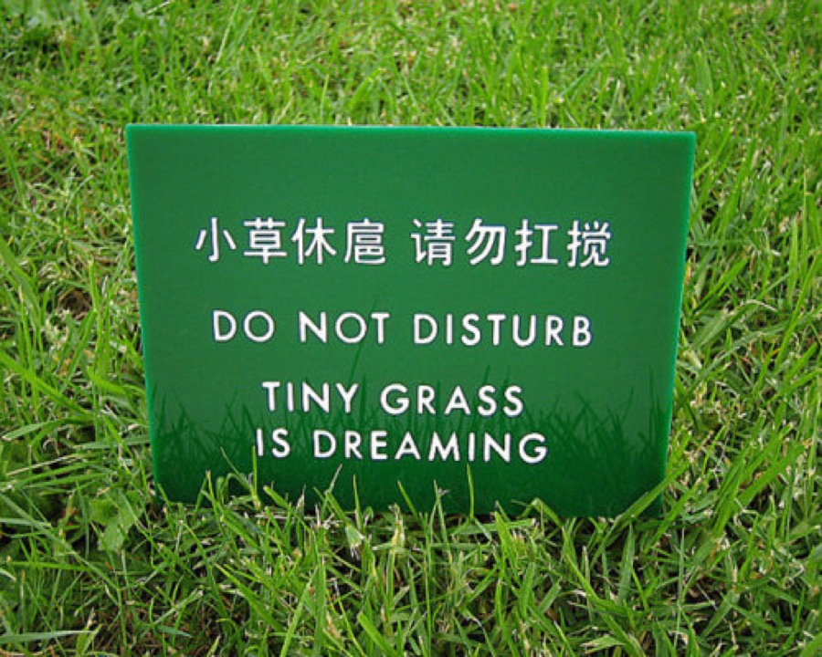

Simon DeDeo

# Laboratory for Social Minds

The Lab for Social Minds studies the present and past of the human species to better understand its future.

Working together, we undertake empirical investigations, and build mathematical theories, of both historical and contemporary phenomena. We range from the centuries-long timescales of cultural evolution to the second-by-second emergence of social hierarchy in the non-human animals, from the editors of Wikipedia to the French Revolution to the gas stations of Indiana. We create synthetic, deep-time accounts of major transitions in political order, with the goal of the predicting and understanding our species’ future. [Read more](http://tuvalu.santafe.edu/~simon/page4/page4.html).

In the past ten years, we have mentored over twenty-five graduate-level researchers; they have gone on to a diverse range of academic careers including cognitive science, economics, sociology, information sciences, biophysics, mathematics, computer science, ethology, anthropology, and theology. In the past five years, two of our researchers have been awarded the National Science Foundation Graduate Research Fellowship, two have won prize postdoctoral fellowships, and one was recently awarded the Rhodes.

*Latest preprint:*  [Individuals, Institutions, and Innovation in the Debates of the French Revolution](https://arxiv.org/abs/1710.06867).

*Recent online lectures* include the SFI Complex Systems [Renormalization MOOC](http://renorm.complexityexplorer.org/), [Information Processing and Political Order](https://www.youtube.com/watch?v=i6S_IvWsFwk&list=PLSWD0p7lHTmQ3AH0ILfpYfj4_cG7jFwoX), a talk to the Global Brain Institute at the University of Brussels (Vrije Universiteit Brussel), and [State-space Compression, Coarse-Graining, and the Averaging of Life and Mind](http://www.perimeterinstitute.ca/videos/state-space-compression-coarse-graining-and-averaging-life-and-mind), a colloquium at the Perimeter Institute for Theoretical Physics.

*Popular events*: [why you should abandon utility theory in favor of epistemic drives](https://www.youtube.com/watch?v=pOqQhXrIIIs).

*Podcasts*: [The Fermi Paradox, consciousness, and Twitter blocklists](https://www.jimruttshow.com/simon-dedeo/) on the Jim Rutt Show.

*Laboratory Blog: *[Axiom of Chance](http://simondedeo.com/).

*Online education: *SFI Complexity Explorer MOOC on [Renormalization and Coarse-Graining](http://renorm.complexityexplorer.org/).

*Recent research:* see [Google Scholar for the most up-to-date list](https://scholar.google.co.uk/citations?hl=en&user=UW3tRn8AAAAJ&view_op=list_works&sortby=pubdate), including links where possible to open-access PDFs.

## Simon DeDeo

Simon DeDeo is an Assistant Professor in [Social and Decision Sciences](https://www.cmu.edu/dietrich/sds/) at [Carnegie Mellon University](https://www.cmu.edu/), and External Professor at the [Santa Fe Institute](http://santafe.edu/). He was previously affiliated with [CNetS](http://www.soic.indiana.edu/research/centers/complex-networks.shtml) and the [Cognitive Science Program](http://cogs.indiana.edu/) at Indiana University.

At the Santa Fe Institute he was an [Omidyar Fellow](http://www.santafe.edu/omidyar-fellowship/) for three years. He is now supported in part by the National Science Foundation under an [Emerging Frontiers](http://www.nsf.gov/awardsearch/showAward.do?AwardNumber=1137929&WT.z_pims_id=501066) grant and by the Second Foundation Project.

``

	[[BLOCK_OPEN]][[BLOCK_OPEN]] [[BLOCK_OPEN]][[BLOCK_OPEN]] [[BLOCK_OPEN]]   [[BLOCK_OPEN]][[BLOCK_CLOSE]]   [[BLOCK_CLOSE]] [[BLOCK_OPEN]][[BLOCK_OPEN]][[BLOCK_OPEN]][[BLOCK_OPEN]][[BLOCK_CLOSE]][[BLOCK_CLOSE]][[BLOCK_OPEN]][[BLOCK_CLOSE]][[BLOCK_OPEN]][[BLOCK_CLOSE]][[BLOCK_OPEN]][[BLOCK_CLOSE]][[BLOCK_OPEN]][[BLOCK_CLOSE]][[BLOCK_OPEN]]  [[BLOCK_CLOSE]][[BLOCK_CLOSE]][[BLOCK_OPEN]][[BLOCK_CLOSE]][[BLOCK_OPEN]][[BLOCK_OPEN]][[BLOCK_CLOSE]][[BLOCK_CLOSE]][[BLOCK_OPEN]][[BLOCK_OPEN]][[BLOCK_CLOSE]][[BLOCK_OPEN]][[BLOCK_OPEN]]  [[BLOCK_OPEN]]  [[BLOCK_CLOSE]][[BLOCK_CLOSE]][[BLOCK_CLOSE]][[BLOCK_OPEN]][[BLOCK_OPEN]]  [[BLOCK_OPEN]][[BLOCK_OPEN]][[BLOCK_CLOSE]][[BLOCK_OPEN]][[BLOCK_CLOSE]][[BLOCK_OPEN]][[BLOCK_CLOSE]][[BLOCK_OPEN]][[BLOCK_CLOSE]][[BLOCK_OPEN]][[BLOCK_CLOSE]][[BLOCK_OPEN]][[BLOCK_OPEN]]02:49[[BLOCK_CLOSE]][[BLOCK_CLOSE]][[BLOCK_CLOSE]]  [[BLOCK_OPEN]][[BLOCK_OPEN]][[BLOCK_CLOSE]][[BLOCK_OPEN]][[BLOCK_CLOSE]][[BLOCK_OPEN]][[BLOCK_CLOSE]][[BLOCK_OPEN]][[BLOCK_CLOSE]][[BLOCK_OPEN]][[BLOCK_CLOSE]][[BLOCK_CLOSE]]     [[BLOCK_CLOSE]] [[BLOCK_CLOSE]][[BLOCK_CLOSE]][[BLOCK_CLOSE]]
	[[BLOCK_CLOSE]][[BLOCK_CLOSE]][[BLOCK_CLOSE]][[BLOCK_CLOSE]]

From [Ingenious](http://nautil.us/issue/12/feedback/ingenious-simon-dedeo), an interview to accompany [When Theft was Worse than Murder](http://nautil.us/issue/12/feedback/when-theft-was-worse-than-murder).

``

[SFIHMM](http://tuvalu.santafe.edu/~simon/styled-8/), optimized C code for estimating hidden Markov models, Perron-Perron Cluster Analysis, and Viteri path reconstruction.

[PyRated](http://tuvalu.santafe.edu/~simon/styled-13/), python code for building efficient rate-distortion codebooks.

[THOTH](http://tuvalu.santafe.edu/~simon/page7/page7.html), a python package for the efficient estimation of information-theoretic quantities, is in development.

[Notes](http://tuvalu.santafe.edu/~simon/page6/page6.html) (now including [lecture video](http://www.youtube.com/watch?v=nqbWVoZVOfQ&list=PLZlVBTf7N6GpbHLbWGMJcUcslPSmnl5-z&index=1&feature=plpp_video)) useful to students at the Complex Systems Summer School at the Santa Fe Institute are online. [Information Theory for Intelligent People](http://santafe.edu/~simon/it.pdf) is a short and simple PDF written for past Summer Schools that has found a following; a similar document, [Bayesian Reasoning for Intelligent People](http://tuvalu.santafe.edu/~simon/br.pdf), is also now available.

At SFI, I ran a blue sky seminar series, a.k.a. [reckless ideas](http://santafe.edu/~simon/reckless_ideas.txt). Work on [humanistic topics](http://tuvalu.santafe.edu/~simon/page5/page5.html) has its own section. [Records of the Undecidables](http://santafe.edu/~simon/undecidables.txt), a group interested in questions of self-reference in mathematics and society, are also available.

Finally, my [curriculum vitæ](http://santafe.edu/~simon/cv.pdf) is available.

``Simon DeDeo

[Porter Hall 219B, Social and Decision Sciences](https://www.google.com/maps/place/Baker+Hall/@40.4414155,-79.9446257,15z/data=!4m5!3m4!1s0x0:0x13a0f93d36e6191e!8m2!3d40.4414155!4d-79.9446257!6m1!1e1)

sdedeo [at] andrew.cmu.edu
@[simondedeo](https://twitter.com/simondedeo)

[pasted-graphic.jpg](../_resources/b2a4e20e6ab4856ae8fd9465105e7878.bin)
photo credit: John D. Norton

This material is based upon work supported in part by the National Science Foundation under Grant No. EF-1137929. Any opinions, findings and conclusions or recommendations expressed in this material are those of the author(s) and do not necessarily reflect the views of the National Science Foundation (NSF).

"But the placing of the cap-sheaf to all this blundering business was reserved for the scientific Frederick Cuvier, brother to the famous Baron. In 1836, he published a Natural History of Whales, in which he gives what he calls a picture of the Sperm Whale. Before showing that picture to any Nantucketer, you had best provide for your summary retreat from Nantucket. In a word, Frederick Cuvier's Sperm Whale is not a Sperm Whale, but a squash. Of course, he never had the benefit of a whaling voyage (such men seldom have), but whence he derived that picture, who can tell?"

Moby Dick, Chapter LV, "Of the Monstrous Pictures of Whales"

photographer unknown; see http://languagelog.ldc.upenn.edu/nll/?p=3978

-----BEGIN [PGP PUBLIC KEY BLOCK](http://santafe.edu/~simon/FE497EE2.asc)-----
Version: GnuPG/MacGPG2 v2.0.22 (Darwin)
Comment: GPGTools - https://gpgtools.org

mQENBFKU4MMBCADpg1eow/h5CCT6L++PtoCDy2ueFwbYFWy1a29qPj0agFec0b5m
04FbWtBrifnCh3WwfkTK4YU5X6/ZWswNvseuU0/zW8OkXm8Kf+9kgmarpAw4cqYr
77NOw5UZwB0Ji0baitDnqi30c0pVU6RUhmDTzR3EQFNE9jK6aOeObkLvLqBMw/o8
jaTMKY1UBWzKns7YIMB3rayCCCp7Aq9T1bLx4kLCZWlOQekwg2mFqCGs5JLul6MB
m1jItK4FavH2+GFozepe5AAiy0+iK7XIDkkdAFYk1j/s9biq0ejF5F06+khg5mHF
YmtxFYyJl4QzrX6pPC9Jd8iveAEeYC9+1wuRABEBAAG0NVNpbW9uIERlRGVvIChJ
bmRpYW5hIFVuaXZlcnNpdHkpIDxzZGVkZW9AaW5kaWFuYS5lZHU+iQE9BBMBCgAn
BQJSlOIjAhsDBQkHhh+ABQsJCAcDBRUKCQgLBRYCAwEAAh4BAheAAAoJEN6LY/v+
SX7iQLUIAICKZfNZJ2VNUcB7wCyUF47El0jIMGVYQmPuSHyhFwd+yxHCMxY31WKL
RA2d96LeUMJHcDXSpIA1sJbteQw1eVDaZtmPYEXTP/AQ5TR5M+Dmc2iBrc+I91i3
kXbPDTbmnWtMEBNifFVwuk1l/WPWwmSVPTAfx2Thwn2dCejKAZOZn6JBYAjIBfO2
8tDDd8tYKN07h/ygIYEXKdgFgoaCafo/yHyoKBJQqPoCrsiLwh3xSWhEhE2/MD6i
+hzCRXrq2OoSXLIAHnsELFN+pbdD06a4SqdluWy/X5N1CH8BJwg6Xrguo25dX8ec
rbN925BkEmGY/LHC1lVXK8yC7pWatAG0NFNpbW9uIERlRGVvIChTYW50YSBGZSBJ
bnN0aXR1dGUpIDxzaW1vbkBzYW50YWZlLmVkdT6JAT0EEwEKACcFAlKU4hQCGwMF
CQeGH4AFCwkIBwMFFQoJCAsFFgIDAQACHgECF4AACgkQ3otj+/5JfuIV/Qf/Yl+q
K1fiS8U0s61aLCyJHUrd/7YcS4bS3UdUqOFG7FoacLFF+qN5zb1brDP0MiZh82Gu
wGz9W66/dJTIoB/Ty0bwISwd6A0b51UHKYyo8r59HQp7YxOOwj6rR2w0LrTBNJC5
IiyCeDfuqFI9NN0eA9sH1++agmuAAtIT8oDielo0seisiFMe0Hkshf9jcbiC3HHn
eE2JZwk4Au7iHlt3Uava9ym2Uz/LInXX0SvBptlKGGZhQEXHpotdPfoqkwbB4d/T
AQ1jPkHlkO1SdN52fyd3RoftejmF1TytNXBbUknbp3HFC6kXO+m8OBHSKeyAnPa6
9A+Gsp8t6kki/Y3U8rQjU2ltb24gRGVEZW8gPHNpbW9uLmRlZGVvQGdtYWlsLmNv
bT6JAUAEEwEKACoCGwMFCQeGH4AFCwkIBwMFFQoJCAsFFgIDAQACHgECF4AFAlKU
4qgCGQEACgkQ3otj+/5JfuLMJAgAsDXOUiZfLMQiB3pC/0BTKX1mzSW9AWj/kUKH
WrIwwMBTVTy0/7Op/1ZkaZMviBT/e0UkVOnynEvsuRVYihPM3tAp1x0YVIJ7HCCt
z6l6d/BqCuaEVs5QjVuXAXUige2bVGMyPrgJ23JoYgsSZLVmWa4dmhvhoUuKfYai
G6mUT6nG6xIe+Hpyi9R5oXiNRfisGoBKiAKG8Z9MAs3cnH941Hu085l9kDohlE1K
VDDost5kKp3GWKJ3xOXbs0OnghXcwjJgsX2sc2Jho46ePxd9jd8vjFO3c6f2LTyZ
O/wQnzEZxt4+V3ofJU+DuFd78JD4LUqBCfhCJGsxqZtMTl2b9bkBDQRSlODDAQgA
xERpNVaDZKeKdgIt9mCDefWMAeTQ/UnDRtjjffp1JnyL9wmIc9KF3ANhpWPZeH1n
BWgLHtr0Y8pE49JdN7tBoIrjLkv12rL35/YtH71LTi2lq+fwHCe/oWqTFr5bEwDF
xQ8nh67Jhga6K87yRvOkndcCb+PkLs90ed/itwOPIt3SNwGfFr6yQANxZj4AjqLj
OxS3C0JICM5GbdZlNd+Vlw5zzMTNeBzs2sjFByCmshuQ1Ot2itRRNcK6gvkf6pnF
sNKLcT+Qoe4an5HFlBx6VzimRhSd9tcKhe//GNZBy3TG1TaEAjrh0aKvBvxFXT5y
h9d7NdaWLw13L0MiL1x9YQARAQABiQElBBgBCgAPBQJSlODDAhsMBQkHhh+AAAoJ
EN6LY/v+SX7iIbcH/RXEdP9w2lJtrlQXE4askaGPpKVfVU9jEeZ+7tCgmf+LOHch
BEwmwU8LJpiw8j7naYtm0QxghUt3cJM5r9KTrGVgcNGX40oqIxeg2bqNSFineL1u
YZ7oYtZGIdCkoOmXhAeA3IvQAT3A6SlBpKkRH4NEXd0bF0FMCcCUzbzUofR7KmcO
GnpbiYvcq9iXnKRmBp1/kEhITfHMk5nvYqbR+LMv3bzzvjzVtgGXfABavBhiUUTW
PhyQ37J9vZ3K0R+90+q9g8ZZY+UprdKWUkAsIkuvawaITRSwm3Ydj5ORPyENOtzC
zMYgQQdgbFxcNEX7MbeTWRH28Sgx716SCwv1Ejo=
=bbpk
-----END PGP PUBLIC KEY BLOCK-----

also available at [hkp://keys.gnupg.net](http://tuvalu.santafe.edu/~simon/hkp://keys.gnupg.net) and

http://pgp.mit.edu/pks/lookup?op=get&search=0xDE8B63FBFE497EE2
Fingerprint: 6923 F12F EEDB 3E48 04C6 732A DE8B 63FB FE49 7EE2

The First Rule of Second Foundation is “you don’t talk about Second Foundation.”