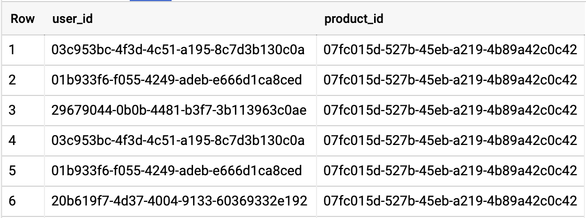
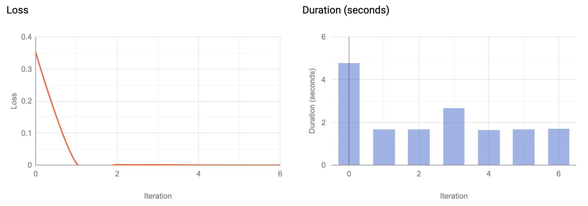
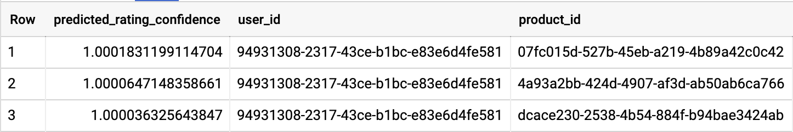

Simple machine learning recommendations with BigQuery | LinkedIn

#  Simple machine learning recommendations with BigQuery

- Published on May 9, 2020

[ ##  Thomas van Latum](https://www.linkedin.com/in/tlatum/)

  Google Cloud Architect & Data Engineer at g-company

[3 articles](https://www.linkedin.com/in/tlatum/detail/recent-activity/posts/)

One of the coolest features of BigQuery is the ability to create machine learning models only with SQL. Today I'm going to show you how to create simple recommendations using BigQuery's matrix factorization! The data we are going to use is a simple dataset containing the click behaviour of users.

The dataset has a row for each click user that views a product on the website.

What we need for the recommendation is a rating so let's create a view containing the number of views per user, per product. Im using a materialized view so I don't have to worry about updates coming in in the source table.

CREATE MATERIALIZED VIEW orders.count_views AS

SELECT user_id, product_id, count(*) as views FROM `experiment-center.orders.product_views`

GROUP BY 1,2

Because number of clicks on a product are implicit ratings we will use BigQuery's implicit matrix factorization. There is an awesome guide about recommendations from [explicit movie ratings](https://cloud.google.com/bigquery-ml/docs/bigqueryml-mf-explicit-tutorial).

Now let's create our model using only SQL! Pro tip, to create a matrix factorization model you need to setup reservations in BigQuery this can be a complex process in some situations. If you need help with how to setup reservations in your organisation give me a shout.

CREATE OR REPLACE MODEL orders.implicit_reccomendation
OPTIONS
  (model_type='matrix_factorization',
   feedback_type='implicit',
   user_col='user_id',
   item_col='product_id',
   rating_col='rating',
   num_factors=5) AS
SELECT
  user_id,
  product_id,
  views / (select max(views) from orders.count_views) AS rating
FROM orders.count_views

For the model to work you need to specify the user, item and rating columns and the number of factors. Generally the lower the amount of unique combinations of users and items the lower number of factors you use. No worries BigQuery will warn you if your number of factors is too high! Also note that I've normalised the ratings to lie between 0 and 1. When the training is complete you get some nice graphics about the training phase.

### Let's create recommendations!

SELECT
  *
FROM
  ML.RECOMMEND(MODEL orders.implicit_reccomendation,
  (SELECT "94931308-2317-43ce-b1bc-e83e6d4fe581" as user_id))
  order by predicted_rating_confidence desc

Fun fact, in the dataset the product with the highest recommendation only received one click from this user! With this model you can create product recommendations for your users. You can even export this model to deploy in your machine learning pipeline!

There are optimisations that can be done with BigQuery ML, like adding l2 regularisation and the number of iterations. If you need help with creating or optimising your model or if you want to talk about other BigQuery ML options send me a message.

### Published by

[Thomas van Latum](https://www.linkedin.com/in/tlatum/)

Google Cloud Architect & Data Engineer at g-company

Published • 1w

[3 articles](https://www.linkedin.com/in/tlatum/detail/recent-activity/posts/)

BigQuery allows us to create Machine Learning models using only SQL! With the matrix factorization now in Beta we can build a simple recommendation model  [hashtag#bigquery](https://www.linkedin.com/feed/hashtag/?keywords=%23bigquery)  [hashtag#sql](https://www.linkedin.com/feed/hashtag/?keywords=%23sql)  [hashtag#googlecloud](https://www.linkedin.com/feed/hashtag/?keywords=%23googlecloud)  [hashtag#googlecloudplatform](https://www.linkedin.com/feed/hashtag/?keywords=%23googlecloudplatform)

- ·

-

###  Reactions

- 

- 

- 

- 

- 

- 

- 

- 

- 

- 

-

###    6 Comments    Comments on Thomas van Latum’s article

 

*Add a comment…*

  [ ###     Silviu Daniel Eftimie  • out of network3rd+     Senior Data Engineer at BMind Sales Maker Company S.L.](https://www.linkedin.com/in/eftimiesilviudaniel/)

 1w

Nice tutorial/post [Thomas van Latum](https://www.linkedin.com/in/ACoAAAvGgSUBhkRf6pWzNnaRv1VNI4lBSGlY61w/) . Back to '18, BigQuery ML catch my eye for his simplicity of doing ML with SQL. Great to see that it's evolving. Also I have 3 questions: - How much focus and dedication are allocated from BQ team on BQ ML part? - I would love to take a look & give it a spin on BQ ML with XGBoost, DNN & Build Time Series forecasting (Alpha) models. [BMIND](https://www.linkedin.com/company/10226436/) it's one of the partners of Google on all this pillars: Cloud, Analytics and Advertising.  - Can you recommend a tutorial/post/book related with BQ ML + TensorFlow custom models? (all the steps)

Thank you !

 ·

·

  [ ###     Thomas van Latum  • 2nd degree connection2nd     Google Cloud Architect & Data Engineer at g-company](https://www.linkedin.com/in/tlatum/)

 1w

Thanks [Silviu Daniel Eftimie](https://www.linkedin.com/in/ACoAAAMEA9EBa5S7Mqm72QobPodDKs275XD0a-A/), I don't know the dedication on BQ ML but the release notes show the dedication in my opinion: https://cloud.google.com/bigquery-ml/docs/release-notesI have not read a tutorial about custom TF models on BQ ML, I will put it on my list!

 ·

  [ ###     Jamie Fry  • 2nd degree connection2nd     Looker Tech Lead at Datatonic](https://www.linkedin.com/in/fryjamie/)

 6d

[Thomas van Latum](https://www.linkedin.com/in/ACoAAAvGgSUBhkRf6pWzNnaRv1VNI4lBSGlY61w/) feel free to chat to our ml engineers, we use custom TF on bq. (we are Google partner so same team!)

 ·

[(L)](https://www.linkedin.com/in/baumannrene/)  [ ###     René Baumann  • out of network3rd+     General Manager DACH & Nordics at smartphoto group](https://www.linkedin.com/in/baumannrene/)

 1w

Hi Thomas, nice. I didn't expect that this can be done with so few lines of code. Does Google evtl. indicate the minimum nbr. of products and, for each user clicks/views-product combination, the min. nbr of views or clicks required for model training and accuracy? Also interesting to know if you can include historical basket info for "pre-training".

 ·

·

  [ ###     Thomas van Latum  • 2nd degree connection2nd     Google Cloud Architect & Data Engineer at g-company](https://www.linkedin.com/in/tlatum/)

 1w

Hi René, thank you for your comment. More data is always better for accuracy! That being said sometimes average recommendations is better than no recommendations at all. About the the historical basket, (I suspect you mean historical shopping carts) you can definitely use this for training, a good recommendation system combines multiple recommendation models. Let's connect next week so we can discuss your use-case!

[ ##  Thomas van Latum](https://www.linkedin.com/in/tlatum/)

### Google Cloud Architect & Data Engineer at g-company

### More from Thomas van Latum

- [           BigQuery unnest and primary keys in Looker      Thomas van Latum on LinkedIn](https://www.linkedin.com/pulse/bigquery-unnest-primary-keys-looker-thomas-van-latum/)
- [           Working with BigQuery's new materialized views in Looker     Thomas van Latum on LinkedIn](https://www.linkedin.com/pulse/working-big-querys-new-materialized-views-looker-thomas-van-latum/)