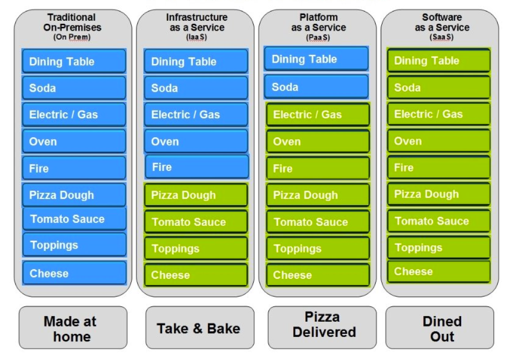
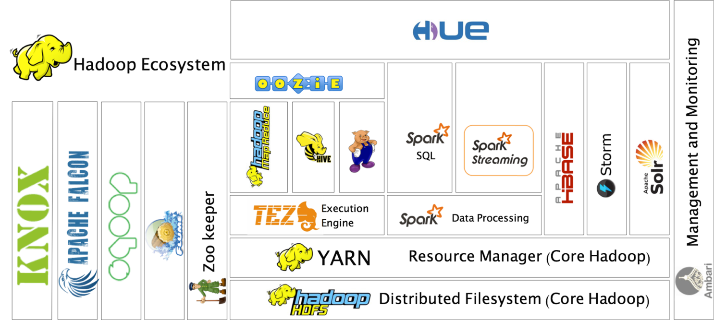

Simplifying Big Data with Google Cloud Dataproc – Google Cloud Platform — Community – Medium

# Simplifying Big Data with Google Cloud Dataproc

My former boss, Larry Ellison (Oracle's founder and current CTO) used to say that there is no "Cloud", [that it's just a computer attached to a network](https://www.youtube.com/watch?v=UOEFXaWHppE). He was not completely wrong, but cloud computing is not only about that.

It's not water vapor.

> What are you talking about? **> It’s not water vapor**> . It’s a computer attached to a network!” — Larry Ellison, Oracle, 2009

Cloud computing, as defined by the National Institute of Standards and Technology (NIST), is composed by five essential characteristics:

1. 1On-demand self-service: you should be able to request the service without human intervention at anytime you may need the service.

2. 2Broad network access: it should be accessible everywhere
3. 3Resource pooling: you share resources with other people (companies)
4. 4Rapid elasticity: you have the ability to scale up and down, and quickly

5. 5Measured service: your consumption is measured so you can pay only for what you really used.

Also, it defines three service models: Infrastructure as a Service (IaaS), Platform as a Service (PaaS) and Software as a Service (SaaS).

There is an interesting analogy on the web that I like to use to explain these service models. It is called "Pizza as a Service". Imagine you want to eat pizza… you actually have 4 different ways you can use to fulfill you desire:

1. 1Do it yourself: let's say you have the oven, you have the raw materials and you want to cook it from scratch. You not only will have to cook but also worry about setting up the table, putting the dishes and purchasing some soda. And let's not forget about the cleaning up! :) That's the pizza making equivalent of having an On-Premise technology stack: hardware and software, everything installed, configured and run by your team.

2. 2Take & Bake: same as before, but instead of making the pizza from the raw materials you have the pre-made pizza. You still have to cook it and do everything else. Some of the steps were made by you… that's Infrastructure as a Service: they provide you with a virtual machine, but that's it. The software setup and usage is with you.

3. 3Delivery: you have the pizza made and delivered to you, but you still have to worry about setting up the table and cleaning the dishes afterwards. That's Platform as a Service: you have a complete platform delivered to you, be it a database, a middleware layer or a machine learning stack. The final application is up to you, but you have most of the stack ready for use.

4. 4Dining out: you don't want to worry about anything, you just want to eat your pizza! That's Software as a Service, the product is ready for your usage, for instance, like Gmail, Google Documents or Hangouts.

The Pizza as a Service model (author unknown)

The main advantage of using a cloud service is to be able to use a high end environment without having to pay for it's full price. Like, you don't need to purchase all the hardware and keep a staff just for wiring and supporting everything, while on-premise you have to pay the full price upfront even if you don't use it 24/7.

Also, you have the flexibility to upscale or downscale the resources as you need. With an on-premise setup you may never downscale.

Gopher by Takuya Ueda ([tenntenn](http://twitter.com/tenntenn)) / Renee French

Like most of the clouds out there, the Google Cloud offers all service levels, but for the rest of this article I'll be focusing on their data processing PaaS offer: Google Dataproc.

I've chosen this technology to talk about because there is no better example of complex environment than the Big Data technology stack. It soon will become evident the benefits of running this type of workload on the cloud.

But in order to understand Dataproc, first let's dig a bit deeper in the Big Data world.

Big Data, as the name implies, is about processing huge amounts of data. The first time the term appears on literature was at a paper written by Michael Cox and David Ellsworth from NASA, published in October, 1997:

> We call this the problem of **> big data**> . When data sets do not fit in main memory (in core), or when they do not fit even on local disk. — Michael Cox and David Ellsworth, 1997

The term started gaining momentum after the publications of "Google Filesystem" in 2003 and "MapReduce: Simplified Data Processing on Large Clusters" in 2004, both papers written by Google's engineers. They described how did Google build an engine to process huge amounts of data using clusters made of commodity hardware.

The answer to those articles was the creation of Hadoop in 2006, an open source framework that implemented a distributed filesystem like Google's, called HDFS (Hadoop Distributed File System), and had the capabilities of running MapReduce workloads.

Besides being able to run workloads on a cluster, the MapReduce model had it's limitations because it implied that complex workloads would need to stage intermediate results on disk.

Running over Hadoop and designed to lift this disk staging limitations, rises Apache Spark as a new distributed computation framework. It uses the concepts of Resilient Distributed Datasets, datasets that exists only on memory, to allow the processing of iterative workloads without necessarily staging data to disk.

This change in architecture gave a performance boost of up to two orders of magnitude on the average case and soon Spark became the new gold standard of the industry.

But still, in order to run Spark workloads we need a setup similar to this one:

Big Data technology stack (not an exhaustive list)

Spark is there in the middle, but there are so many other Big Data tools... It looks like a zoo so much that it even have a tool called "Zoo Keeper" to keep everything in place.

Seems like a lot of trouble, right? It is! But luckily we can now leverage Dataproc to do this crazy setup for us so we only need to worry about eating the pizza… I mean, running our workloads! :)

The sales pitch of Dataproc says we can setup an entire cluster in less than 90 seconds. If there's any company that can make a crazy statement like this is Google, but I must say that in my personal experience it sometimes took about 2 to 2 and half minutes to create it. But hey, look at all that craziness above, it's still pretty impressive!

Google Dataproc allows you to run Spark jobs from the command line (using the Google Cloud SDK's gcloud command) or the Cloud console. It also has the option to run jobs written in both Scala and Python (PySpark).

It also has connectors to other Google Cloud Platform products, like for instance, BigQuery. That means you can run a data processing or machine learning Spark job and output it to BigQuery for further analysis, or you can use BigQuery data as input to your workloads.

By the way, if you are interested in this scenario you should definitely check out the documentation: [Using the BigQuery Connector with Spark](https://cloud.google.com/dataproc/docs/tutorials/bigquery-connector-spark-example).

In summary, by using Google Cloud Platform you can simplify the deployment of the Big Data stack to the level that with a few clicks and a couple of minutes you will have a cluster ready for processing your workloads. Also, if you ever need to scale it up or down it can be done in the same fashion, so you don't need to worry about long term sizing or paying for the infrastructure upfront.

GCP is definitely the way to go if you want to play around with Big Data without paying high entry costs. It allows practically any kind of company to have access to the disruptive power of Big Data.

*P.S.: This article is a modified version of my talk on Google Cloud Platform given at Google Launchpad Build Porto Alegre on August 5th, 2017.*