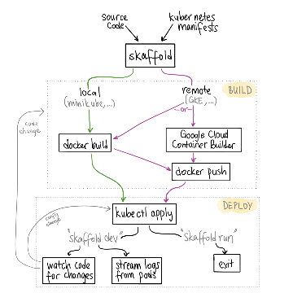

Skaffold: happy Kubernetes workflows

Skaffold: happy Kubernetes workflows

https://ahmet.im/blog/skaffold/

Skaffold: happy Kubernetes workflows Ahmet Alp Balkan , posted on 31 May 2018 Skaffold is my top Kubernetes developer tool of the year so far. Since its accidental reveal about 3 months ago, it already got 3,700 stars on GitHub. Clearly the community is lovin’ it. I have been using Skaffold from the get go for all my new projects that involve multi-tier microservices, and it works like a charm on top of Docker for Mac/Minikube. Skaffold 101 Skaffold is a tool to develop containerized applications locally or remotely while deploying them on Kubernetes. It automatically builds and deploys your apps as you change your source code.