Sketched Books –

## Sketched Books

 **[18 Comments](https://sachachua.com/blog/sketched-books/#disqus_thread)**

Feel free to use these under the Creative Commons Attribution License. I hope they help you learn from, remember, and share ideas from books. Click on the links or images to learn more or to get high-resolution versions. E-mail me at [sacha@sachachua.com](https://sachachua.com/blog/sketched-books/mailto:sacha@sachachua.com) to suggest your favourite books or upcoming books on your radar.

Update 2014-12-15: You can now download a free [PDF](https://www.dropbox.com/s/qfun17emcdiq2b1/sketched-books.pdf?dl=0) / [ZIP](https://www.dropbox.com/s/aucb9r05n6rzlh8/sketched-books.zip?dl=0) / [EPUB](https://www.dropbox.com/s/5kfp7yujb8ifsg2/sketched-books.epub?dl=0) / [MOBI](https://www.dropbox.com/s/fqnnbk2uifzw2qj/sketched-books.mobi?dl=0) with the high-resolution images. Easy to flip through or print. No e-mail address required. Enjoy!

- [Visual Book Notes: Between Parent and Child (2003)](https://sachachua.com/blog/2019/03/visual-book-notes-between-parent-and-child-2003/)

[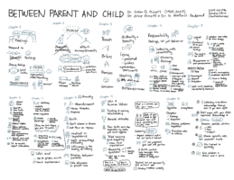](https://sachachua.com/blog/2019/03/visual-book-notes-between-parent-and-child-2003/)

March 18, 2019

- [Visual Book Notes: No-Drama Discipline (2014)](https://sachachua.com/blog/2019/03/visual-book-notes-no-drama-discipline-2014/)

[(L)](https://sachachua.com/blog/2019/03/visual-book-notes-no-drama-discipline-2014/)

March 16, 2019

- [Book: Unconditional Parenting](https://sachachua.com/blog/2018/07/book-unconditional-parenting/)

[(L)](https://sachachua.com/blog/2018/07/book-unconditional-parenting/)
July 27, 2018

- [Sketched Book – Self-compassion: Stop Beating Yourself Up and Leave Insecurity Behind – Kristin Neff](https://sachachua.com/blog/2015/03/sketched-book-self-compassion-stop-beating-yourself-up-and-leave-insecurity-behind-kristin-neff/)

[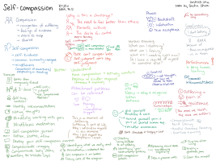](https://sachachua.com/blog/2015/03/sketched-book-self-compassion-stop-beating-yourself-up-and-leave-insecurity-behind-kristin-neff/)

March 30, 2015

- [Sketched Book – The Obstacle Is The Way: The Timeless Art of Turning Trials into Triumph – Ryan Holiday](https://sachachua.com/blog/2015/03/sketched-book-obstacle-way-timeless-art-turning-trials-triumph-ryan-holiday/)

[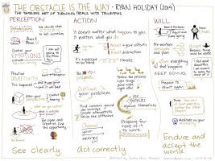](https://sachachua.com/blog/2015/03/sketched-book-obstacle-way-timeless-art-turning-trials-triumph-ryan-holiday/)

March 23, 2015

- [Sketched Book – The Checklist Manifesto: How to Get Things Right – Atul Gawande](https://sachachua.com/blog/2015/03/sketched-book-checklist-manifesto-get-things-right-atul-gawande/)

[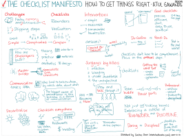](https://sachachua.com/blog/2015/03/sketched-book-checklist-manifesto-get-things-right-atul-gawande/)

March 9, 2015

- [Sketched Book: Write Faster, Write Better – David A. Fryxell](https://sachachua.com/blog/2015/03/sketched-book-write-faster-write-better-david-fryxell/)

[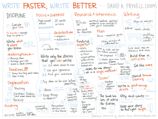](https://sachachua.com/blog/2015/03/sketched-book-write-faster-write-better-david-fryxell/)

March 2, 2015

- [Sketched Book – So Good They Can’t Ignore You: Why Skills Trump Passion in the Quest for Work You Love – Cal Newport](https://sachachua.com/blog/2015/02/sketched-book-good-cant-ignore-skills-trump-passion-quest-work-love-cal-newport/)

[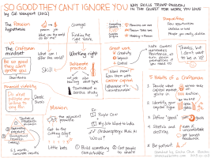](https://sachachua.com/blog/2015/02/sketched-book-good-cant-ignore-skills-trump-passion-quest-work-love-cal-newport/)

February 23, 2015

- [Sketched Book: Take Charge of Your Talent: Three Keys to Thriving in Your Career, Organization, and Life – Don Maruska, Jay Perry (2013)](https://sachachua.com/blog/2015/02/sketched-book-take-charge-talent-three-keys-thriving-career-organization-life-don-maruska-jay-perry-2013/)

[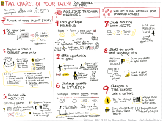](https://sachachua.com/blog/2015/02/sketched-book-take-charge-talent-three-keys-thriving-career-organization-life-don-maruska-jay-perry-2013/)

February 16, 2015

- [Sketched Book: Start With Why: How Great Leaders Inspire Everyone to Take Action – Simon Sinek](https://sachachua.com/blog/2015/01/sketched-book-start-great-leaders-inspire-everyone-take-action-simon-sinek/)

[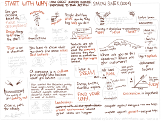](https://sachachua.com/blog/2015/01/sketched-book-start-great-leaders-inspire-everyone-take-action-simon-sinek/)

January 12, 2015

- [Sketched Book: The Inner Game of Work – W. Timothy Gallwey](https://sachachua.com/blog/2014/12/sketched-book-inner-game-work-w-timothy-gallwey/)

[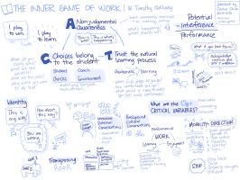](https://sachachua.com/blog/2014/12/sketched-book-inner-game-work-w-timothy-gallwey/)

December 29, 2014

- [Sketched Book: The Stoic Art of Living: Inner Resilience and Outer Results – Tom Morris](https://sachachua.com/blog/2014/12/sketched-book-stoic-art-living/)

[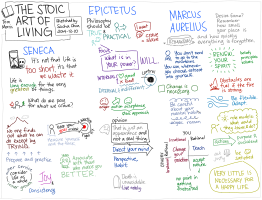](https://sachachua.com/blog/2014/12/sketched-book-stoic-art-living/)

December 15, 2014

- [Sketched Book: Just F*cking Ship – Amy Hoy, Alex Hillman](https://sachachua.com/blog/2014/12/sketched-book-just-fucking-ship-amy-hoy-alex-hillman/)

[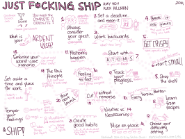](https://sachachua.com/blog/2014/12/sketched-book-just-fucking-ship-amy-hoy-alex-hillman/)

December 12, 2014

- [Visual book notes: Mastery (Robert Greene)](https://sachachua.com/blog/2014/05/visual-book-notes-mastery-robert-greene/)

[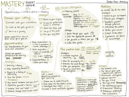](https://sachachua.com/blog/2014/05/visual-book-notes-mastery-robert-greene/)

May 14, 2014

- [Visual book review: Conscious Millionaire: Grow your business by making a difference (JV Crum III)](https://sachachua.com/blog/2014/03/visual-book-review-conscious-millionaire-grow-business-making-difference-jv-crum-iii/)

[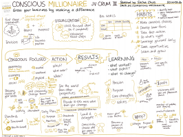](https://sachachua.com/blog/2014/03/visual-book-review-conscious-millionaire-grow-business-making-difference-jv-crum-iii/)

March 28, 2014

- [Visual book review: How to make a complete map of every thought you think (Lion Kimbro)](https://sachachua.com/blog/2013/10/visual-book-review-how-to-make-a-complete-map-of-every-thought-you-think-lion-kimbro/)

[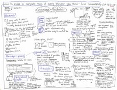](https://sachachua.com/blog/2013/10/visual-book-review-how-to-make-a-complete-map-of-every-thought-you-think-lion-kimbro/)

October 23, 2013

- [Visual book review: The First 20 Hours: How to Learn Anything… Fast (Josh Kaufman)](https://sachachua.com/blog/2013/07/visual-book-review-the-first-20-hours-how-to-learn-anything-fast-josh-kaufman/)

[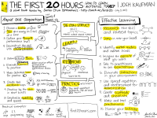](https://sachachua.com/blog/2013/07/visual-book-review-the-first-20-hours-how-to-learn-anything-fast-josh-kaufman/)

July 15, 2013

- [Visual book review: Leading Out Loud: A Guide for Engaging Others in Creating the Future (Terry Pearce)](https://sachachua.com/blog/2013/07/visual-book-review-leading-out-loud-a-guide-for-engaging-others-in-creating-the-future/)

[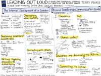](https://sachachua.com/blog/2013/07/visual-book-review-leading-out-loud-a-guide-for-engaging-others-in-creating-the-future/)

July 5, 2013

- [Visual Book Review: Customer CEO: How to Profit from the Power of Your Customers (Chuck Wall)](https://sachachua.com/blog/2013/06/visual-book-review-customer-ceo-how-to-profit-from-the-power-of-your-customers-chuck-wall/)

[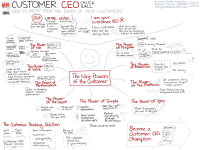](https://sachachua.com/blog/2013/06/visual-book-review-customer-ceo-how-to-profit-from-the-power-of-your-customers-chuck-wall/)

June 19, 2013

- [Visual book review: The Visual Marketing Revolution (Stephanie Diamond)](https://sachachua.com/blog/2013/05/visual-book-review-the-visual-marketing-revolution-stephanie-diamond/)

[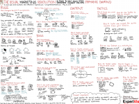](https://sachachua.com/blog/2013/05/visual-book-review-the-visual-marketing-revolution-stephanie-diamond/)

May 23, 2013

- [Visual book review: Red Thread Thinking: Weaving Together Connections for Brilliant Ideas and Profitable Innovation (Debra Kaye with Karen Kelly)](https://sachachua.com/blog/2013/05/visual-book-review-red-thread-thinking-weaving-together-connections-for-brilliant-ideas-and-profitable-innovation-debra-kaye-with-karen-kelly/)

[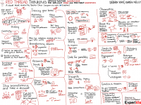](https://sachachua.com/blog/2013/05/visual-book-review-red-thread-thinking-weaving-together-connections-for-brilliant-ideas-and-profitable-innovation-debra-kaye-with-karen-kelly/)

May 3, 2013

- [Visual book review: The Culture Blueprint (Robert Richman)](https://sachachua.com/blog/2013/04/visual-book-review-the-culture-blueprint-robert-richman/)

[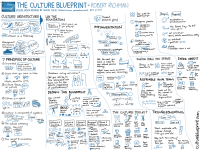](https://sachachua.com/blog/2013/04/visual-book-review-the-culture-blueprint-robert-richman/)

April 9, 2013

- [Visual book review: To Sell is Human (Daniel Pink)](https://sachachua.com/blog/2013/03/visual-book-summary-to-sell-is-human-daniel-pink/)

[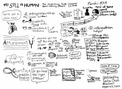](https://sachachua.com/blog/2013/03/visual-book-summary-to-sell-is-human-daniel-pink/)

March 7, 2013

- [Visual book review: Cool Time: A Hands-on Plan for Managing Work and Balancing Time–Steve Prentice](https://sachachua.com/blog/2013/01/visual-book-review-cool-time-a-hands-on-plan-for-managing-work-and-balancing-timesteve-prentice/)

[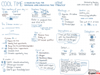](https://sachachua.com/blog/2013/01/visual-book-review-cool-time-a-hands-on-plan-for-managing-work-and-balancing-timesteve-prentice/)

January 16, 2013

- [Visual book review: The Art of Pricing: How to Find the Hidden Profits to Grow Your Business–Rafi Mohammed](https://sachachua.com/blog/2013/01/visual-book-review-the-art-of-pricing-how-to-find-the-hidden-profits-to-grow-your-businessrafi-mohammed/)

[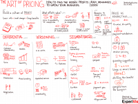](https://sachachua.com/blog/2013/01/visual-book-review-the-art-of-pricing-how-to-find-the-hidden-profits-to-grow-your-businessrafi-mohammed/)

January 9, 2013

- [Visual book review: Blue Ocean Strategy–W. Chan Kim, Renée Mauborgne](https://sachachua.com/blog/2013/01/visual-book-review-blue-ocean-strategyw-chan-kim-rene-mauborgne/)

[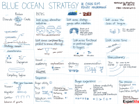](https://sachachua.com/blog/2013/01/visual-book-review-blue-ocean-strategyw-chan-kim-rene-mauborgne/)

January 2, 2013

- [Visual book review: Running Lean–Ash Maurya](https://sachachua.com/blog/2012/12/visual-book-review-running-leanash-maurya/)

[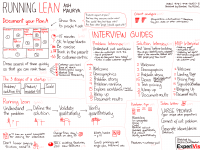](https://sachachua.com/blog/2012/12/visual-book-review-running-leanash-maurya/)

December 30, 2012

- [Visual book review: The Sketchnote Handbook–Mike Rohde](https://sachachua.com/blog/2012/12/visual-book-review-the-sketchnote-handbook-mike-rohde/)

[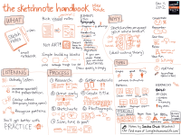](https://sachachua.com/blog/2012/12/visual-book-review-the-sketchnote-handbook-mike-rohde/)

December 11, 2012

- [Visual book notes: Best Practices Are Stupid: 40 ways to Out-Innovate the Competition–Stephen M. Shapiro](https://sachachua.com/blog/2012/12/visual-book-notes-best-practices-are-stupidstephen-m-shapiro/)

[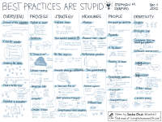](https://sachachua.com/blog/2012/12/visual-book-notes-best-practices-are-stupidstephen-m-shapiro/)

December 11, 2012

- [Visual book review: Help Your Kids Get Better Grades](https://sachachua.com/blog/2012/09/visual-book-review-help-your-kids-get-better-grades/)

[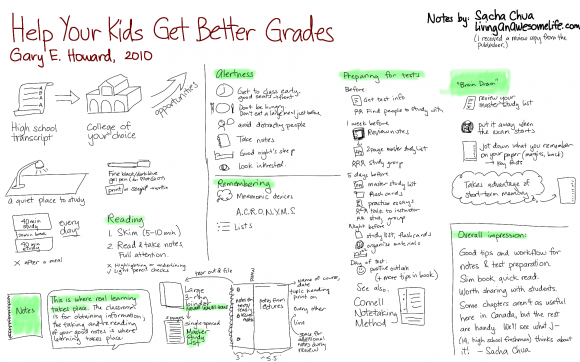](https://sachachua.com/blog/2012/09/visual-book-review-help-your-kids-get-better-grades/)

September 5, 2012

- [Sketchnotes: The $100 Startup: Reinvent the Way You Make a Living, Do What You Love, and Create a New Future](https://sachachua.com/blog/2012/05/sketchnotes-the-100-startup-reinvent-the-way-you-make-a-living-do-what-you-love-and-create-a-new-future/)

[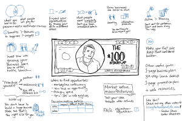](https://sachachua.com/blog/2012/05/sketchnotes-the-100-startup-reinvent-the-way-you-make-a-living-do-what-you-love-and-create-a-new-future/)

May 9, 2012

- [Visual book review: Thank You for Arguing: What Aristotle, Lincoln, and Homer Simpson Can Teach Us about the Art of Persuasion](https://sachachua.com/blog/2012/04/visual-book-review-thank-you-for-arguing-what-aristotle-lincoln-and-homer-simpson-can-teach-us-about-the-art-of-persuasion/)

[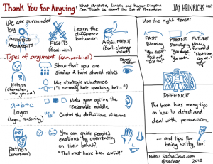](https://sachachua.com/blog/2012/04/visual-book-review-thank-you-for-arguing-what-aristotle-lincoln-and-homer-simpson-can-teach-us-about-the-art-of-persuasion/)

April 3, 2012

- [Visual book review: Getting to Yes: Negotiating Agreement Without Giving In](https://sachachua.com/blog/2012/03/visual-book-notes-getting-to-yes-negotiating-agreement-without-giving-in/)

[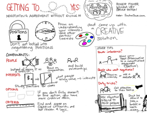](https://sachachua.com/blog/2012/03/visual-book-notes-getting-to-yes-negotiating-agreement-without-giving-in/)

March 27, 2012

- [Visual book review: Enough, by Patrick Rhone](https://sachachua.com/blog/2012/03/visual-book-review-enough/)

[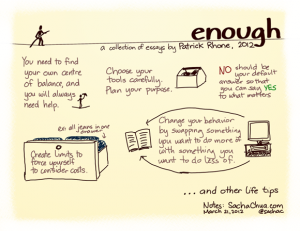](https://sachachua.com/blog/2012/03/visual-book-review-enough/)

March 22, 2012

- [Visual book review: Critical Inquiry: The Process of Argument](https://sachachua.com/blog/2012/03/visual-book-review-critical-inquiry-the-process-of-argument/)

[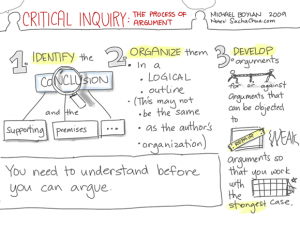](https://sachachua.com/blog/2012/03/visual-book-review-critical-inquiry-the-process-of-argument/)

March 20, 2012

- [Visual book notes: How to Read a Book](https://sachachua.com/blog/2012/03/visual-book-notes-how-to-read-a-book/)

[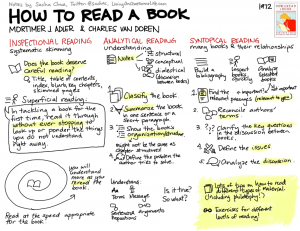](https://sachachua.com/blog/2012/03/visual-book-notes-how-to-read-a-book/)

March 6, 2012

- [Visual book notes: The Start-up of You (Reid Hoffman, Ben Casnocha)](https://sachachua.com/blog/2012/03/visual-book-notes-the-start-up-of-you-reid-hoffman-ben-casnocha/)

[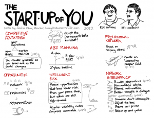](https://sachachua.com/blog/2012/03/visual-book-notes-the-start-up-of-you-reid-hoffman-ben-casnocha/)

March 5, 2012

- [Visual book notes: 6 Secrets to Startup Success](https://sachachua.com/blog/2012/03/visual-book-notes-6-secrets-to-startup-success/)

[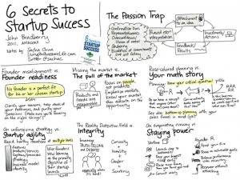](https://sachachua.com/blog/2012/03/visual-book-notes-6-secrets-to-startup-success/)

March 2, 2012

- [Visual book notes: The Lean Startup by Eric Ries](https://sachachua.com/blog/2012/02/visual-book-notes-the-lean-startup-by-eric-ries/)

[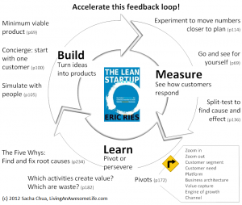](https://sachachua.com/blog/2012/02/visual-book-notes-the-lean-startup-by-eric-ries/)

February 29, 2012

## Get updates about new sketches

Email Address

Alternatively, you can subscribe to the [RSS feed](https://sachachua.com/blog/category/visual-book-notes/feed) using a [blog reader](https://sachachua.com/blog/2014/01/read-blogs-efficiently-feed-reader/) like [Feedly](https://feedly.com/)

E-mail me at [sacha@sachachua.com](https://sachachua.com/blog/sketched-books/mailto:sacha@sachachua.com) to suggest your favourite books or upcoming books on your radar. For your convenience, this page is available at [sketchedbooks.com](http://sketchedbooks.com/). Enjoy!