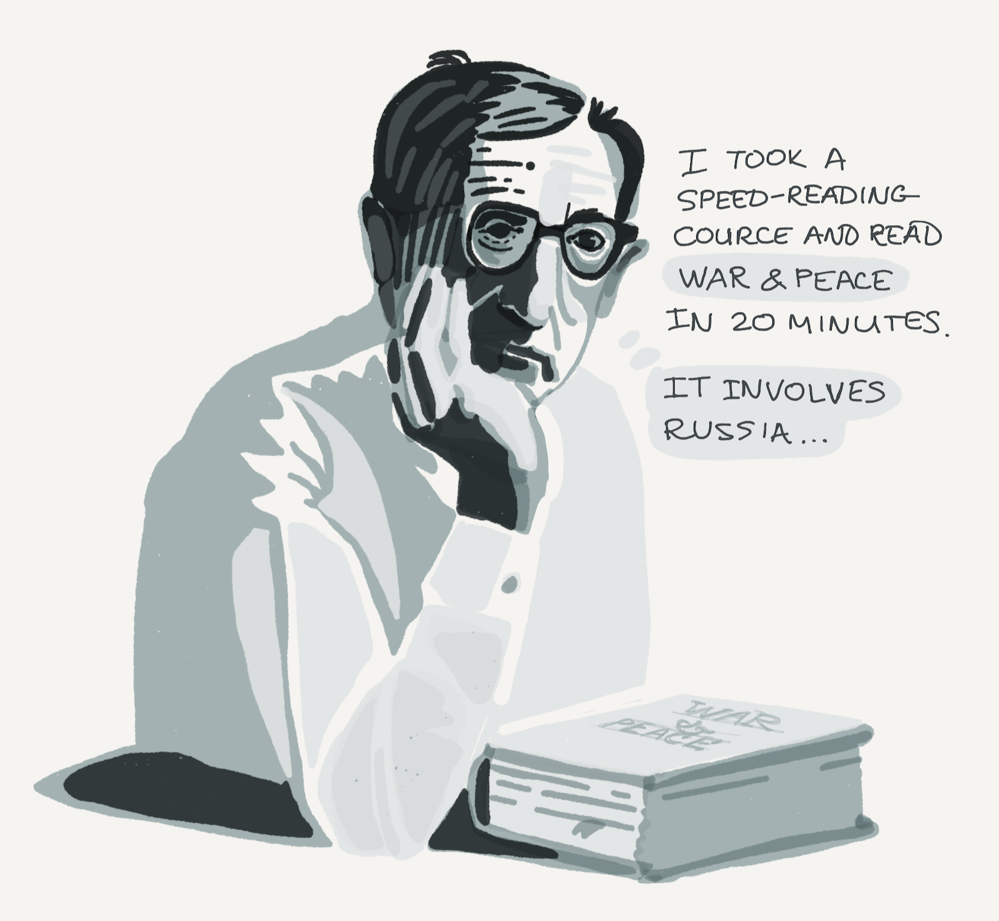
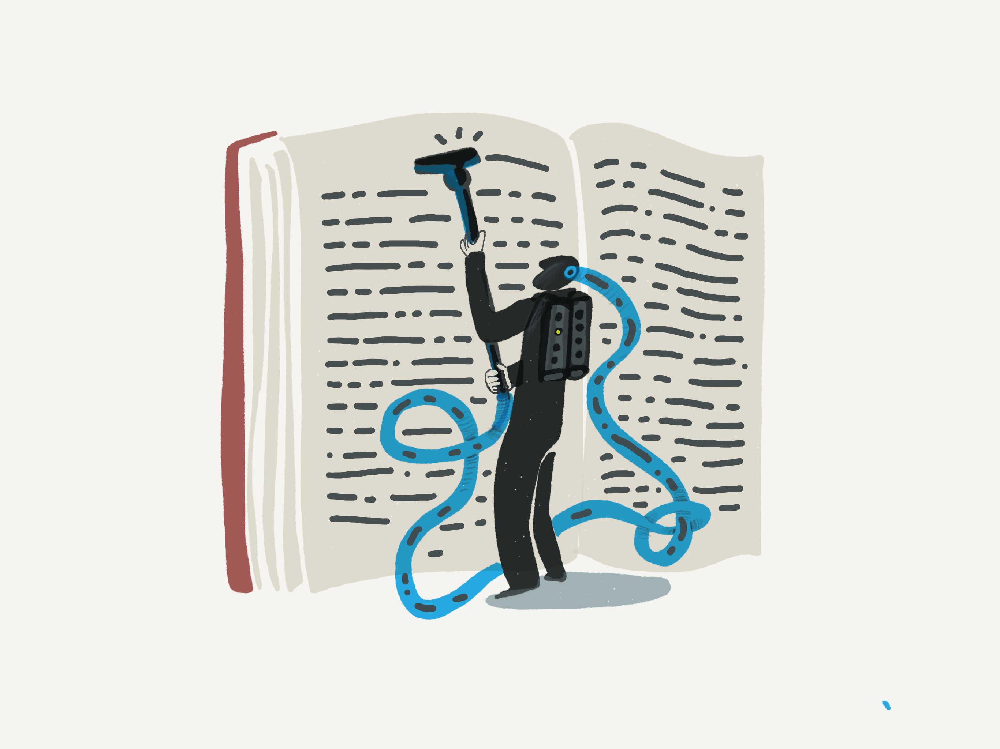
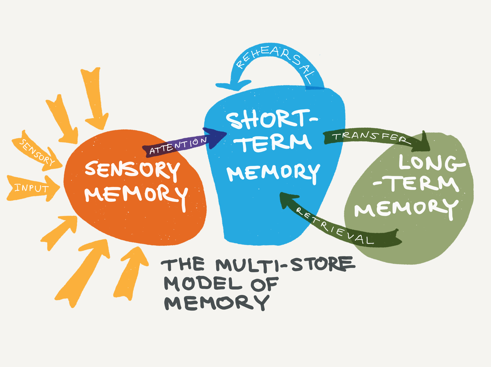
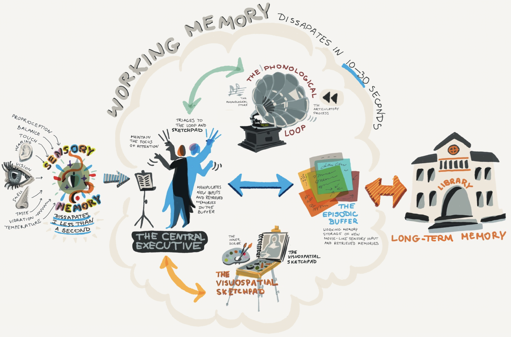
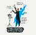
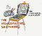

Slow-Reading is the New Deep Learning - Better Humans - Medium

## Applied Brain Science

# Slow-Reading is the New Deep Learning

## Speed-reading is for skimmers. Slow-reading is for scholars.

[David Handel, MD](https://medium.com/@iDoRecall?source=post_page-----452f179c0289----------------------)

[Nov 19](https://medium.com/better-humans/slow-reading-is-the-new-deep-learning-452f179c0289?source=post_page-----452f179c0289----------------------) · 15 min read

Woody Allen’s experience with speed-reading applies to all reading where we don’t invest the time to properly engage with the material. (All illustrations courtesy of [iDoRecall.com](https://idorecall.com/))

I was just a youth when Evelyn Wood debuted her speed-reading course back in 1959. For years, I was fascinated with the prospect of getting my reading assignments over with as quickly as possible so that I could get on to the fun part of life. Obviously, with this attitude, I wasn’t much of a student during my K–12 years. Fortunately, [I massively turned that around](https://medium.com/better-humans/how-to-unlock-the-amazing-power-of-your-brain-and-become-a-top-student-369e5ba59484). The Evelyn Wood Reading Dynamics course became a huge sensation. So much so that the Kennedy White House sent staff members to take the course. JFK was [(falsely](https://slate.com/news-and-politics/2000/02/the-1000-word-dash.html)) said to be a speed-reader. The course still exists, even years after Ms. Wood’s passing.

About six years ago, a spate of [speed-reading apps](https://slate.com/technology/2014/03/spritz-spreeder-rsvp-technology-speed-reading-apps-are-amazing.html) suddenly appeared and went viral. Most of them are based upon the concept of Rapid Serial Visual Presentation (RSVP). These apps control what your eyes see and eliminate the natural process where we glance back at words we just read, so-called *regressions*, to reread them. The problem is that these regressions are one of the keys to reading comprehension. Imagine that your mind drifts for even a split second, and your eyes are blocked from glancing back at the words that you just read.

This is an example from the open-source speed-reading app[Zethos](https://github.com/Zolmeister/Zethos) which utilizes RSVP to eliminate regressions.

Other strategies of speed-reading training include coaching to eliminate subvocalizations—the way we think out the sounds of the words we’re reading. In fact, we do more than simply *think* of the sounds. We also make subtle, often imperceptible movements of our tongue and vocal apparatus as we read. We usually can’t perceive subvocalizations, but electrode sensors in the lab can detect them. Despite even the most deliberate effort of speed-readers to quash subvocalizations, they are impossible to eliminate, and we wouldn’t really want to eliminate them even if we could! They are an essential part of the natural mechanism we use to process and comprehend what we read. Reading, after all, is not the simple vacuuming of words from a page into our brains. It’s is a far more complex process — involving, at its very core, language comprehension.

Unfortunately, we can’t simply vacuum the words off of a page and into our long-term memory.

The typical educated adult reads somewhere between 250–400 WPM. Speed-readers aspire to double, triple, or even massively increase their base reading rate. [Research paper](https://www.ncbi.nlm.nih.gov/pubmed/29461715) after [research paper](https://www.ncbi.nlm.nih.gov/pubmed/26769745) has concluded that **as reading speed goes up as a result of effortful speed-reading, comprehension goes down**. Speed-reading has its use case. It’s sensible to use it (if you’re capable) when you want to skim and get the gist of a text. But it doesn’t make sense to skim-read when your goal is to acquire knowledge. Bottom line: comprehension goes down as your reading speed goes up. It eventually gets to the point that you’re really just skimming.

But there is a far more profound issue at hand that most critics overlook when they bash speed-reading. Reading with the intention of learning involves far more than achieving simple comprehension. Comprehension is not equivalent to knowledge acquisition. You must employ metacognition. You have to read slowly in order to enable and activate the processes that support knowledge acquisition as you read. If you’re reading to learn, you need to engage with the content and associate the new concepts with your existing knowledge. Only then can you install new knowledge in your mind and be able to utilize this knowledge in the future. You have to do the work to learn, and “the work” has to be the right work done correctly.

Slow-reading is for scholars. The more slow-reading you do, the more your knowledge base will expand.

**If you want to massively expand your knowledge, become a voracious slow reader.**

I’ve written before about [how to read academic content](https://medium.com/better-humans/how-to-read-academic-content-once-and-remember-it-forever-e44f26d82566) and remember it forever. Here we’re going to review how to slow read and intentionally learn. But first, I am going to teach you how our minds acquire new knowledge and memories.

[**How We Learn New Things**](https://medium.com/better-humans/slow-reading-is-the-new-deep-learning-452f179c0289#1cbd)**

**[The central executive](https://medium.com/better-humans/slow-reading-is-the-new-deep-learning-452f179c0289#667b)

[The visuospatial sketchpad](https://medium.com/better-humans/slow-reading-is-the-new-deep-learning-452f179c0289#cfc3)

[The phonological loop](https://medium.com/better-humans/slow-reading-is-the-new-deep-learning-452f179c0289#bae6)

[The independent operation of the slave systems](https://medium.com/better-humans/slow-reading-is-the-new-deep-learning-452f179c0289#77d6)

[The episodic buffer](https://medium.com/better-humans/slow-reading-is-the-new-deep-learning-452f179c0289#4210)

[The hippocampus](https://medium.com/better-humans/slow-reading-is-the-new-deep-learning-452f179c0289#fbb5)[**You Can Only Achieve Deep Learning by Slow-Reading**](https://medium.com/better-humans/slow-reading-is-the-new-deep-learning-452f179c0289#631c)[**How to Read Metacognitively**](https://medium.com/better-humans/slow-reading-is-the-new-deep-learning-452f179c0289#da41)

* * *

*...*

# How We Learn New Things

What follows is an outline of the most widely accepted scientific views of learning and memory from a cognitive psychology perspective. Please be aware that for every proposed and even heavily supported model, there are always contrary views in the scientific community. Other models for understanding how memory works are continuously being proposed. This section is for the curious who want to take a look under-the-hood and understand how we learn.

I’ve written before about [how memory and learning work](https://medium.com/@iDoRecall/the-neuroscience-of-learning-memory-part-i-fcf79a479615) where I took a mostly neuroscience perspective, but here we’re going to look at memory and learning from a cognitive psychology point of view.

As we encounter experiences in the world, we store information initially in [Sensory Memory](https://en.wikipedia.org/wiki/Sensory_memory). *Sensory memory* receives the sum total of all sensory input, and it’s an overwhelming firehose of data. Imagine for a minute walking into a stadium and in a split second seeing a thousand faces come into focus, and many more thousands of blurry faces in the distance. At the same time, there is a massive amount of non-visual sensory input. There are all kinds of smells. You are also experiencing other sensory inputs in the same instant such as your sense of balance, touch, proprioception, vibration, and temperature. How can you store this continuous massive data input for the rest of your life? Would you even want to? Sensory memory input is overwhelming and fortunately, it has a very short half-life. You can only store less than a second of it at a time before it vanishes. It’s probably best that 99.99% of our sensory memory evaporates in a split second. We don’t need a complete high-resolution experiential recording of our lives in order to survive and enjoy a wonderful life.

A small percentage of sensory memory does survive and is passed to *short-term memory*. Short-term memory is also fleeting, lasting somewhere on the order of 10 seconds up to 30 seconds. In certain circumstances, it may last up to a minute. Short-term memory is extremely limited in capacity. The canonical research of this capacity limit culminated in the classical paper “[The Magical Number Seven, Plus or Minus Two…](http://www2.psych.utoronto.ca/users/peterson/psy430s2001/Miller%20GA%20Magical%20Seven%20Psych%20Review%201955.pdf)” by Harvard Professor George Miller. He proposed that we can only remember about seven things, such as the digits of a phone number, for only a few fleeting seconds. This limit is a human experience to which we can all relate.

If a new memory is important enough to remember beyond a few seconds, it may get stored in your *long-term memory*, and perhaps you will remember it for a lifetime. But how does it get there? (More about this later.)

What I’ve just described is the [Atkinson-Shiffrin memory model](http://www.rca.ucsd.edu/selected_papers/2_Human%20memory_A%20proposed%20system%20and%20its%20control%20processes.pdf) or Multi-Store Model of memory. But today, cognitive psychology has a much deeper understanding of how memory works.

The Multi-Store Model of Memory

Let’s discuss for a few minutes an important enhancement to the Multi-Store Model. The [Working Memory Model](https://www.sciencedirect.com/science/article/pii/S0079742108604521) (WMM), initially proposed by [Baddely and Hitch in 1974](http://www.psychologyunlocked.com/baddeleyhitch1974/). It has been enhanced over the subsequent decades and even today it is well-accepted and has a lot of solid research to support it. [The WMM redefines the short-term memory portion of the Multi-Store Model](https://www.ncbi.nlm.nih.gov/pmc/articles/PMC3425965/) and breaks it into a series of components.

[*Working memory*](https://www.ncbi.nlm.nih.gov/pmc/articles/PMC4677100/) is one of the most profound attributes of higher cognitive functioning. It is critical for achieving goals. Working memory is short-term storage of information, which is relevant to what we are currently doing and what we’ll do next. We employ our working memory in conjunction with other higher cognitive functions such as[cognitive flexibility](https://www.jstor.org/stable/2785779?origin=crossref&seq=1#page_scan_tab_contents) (the ability to shift between different tasks and concepts) to help us decide on the best approach to complete tasks. Specifically, we use working memory in conjunction with other higher cognitive functions as tools. These tools enable us to integrate our current external experiences and revive long-term memories and knowledge. We take that information and use it to interpret, analyze, manipulate, and make judgments to shape our behavior.

The Working Memory Model has enhanced our understanding of what previously called Short-Term Memory. *Working Memory* is where we focus our attention utilizing *The Central Executive*. *The Phonological Loop* allows us to briefly store and replay incoming auditory information. *The Visuospatial Sketchpad* permits us to briefly store and replay incoming visual information. The *Episodic Buffer* is where we manipulate ideas, new inputs, and memories. It’s the “RAM to our long-term ROM” and has been posited to be the connector between working memory and long-term memory.

The WMM has refined our understanding of short-term memory and how memories get stored in long-term memory. The original WMM described three components: *The Central Executive,* and two so-called “slave systems”: *The Visuospatial Sketchpad* and *The Phonological Loop*. Since 1974 the WMM has been expanded and refined. Here is an overview and summary of our current understanding of working memory.

## The central executive

The central executive is a multi-faceted system that “oversees” control of working memory. It enables us to focus our attention on the current “thing” of interest while suppressing other irrelevant “things.”

These “things” could be something in the external world or they could be an internal entity such as a memory or concept. It also enables our capability to coordinate performance between several tasks, because in our modern daily lives we are very rarely only doing one thing. We have to be capable of applying multiple memories or learned concepts simultaneously. Finally, it enables us to retrieve long-term memories, so that we can apply and work with these retrieved memories to achieve our current goals.

## **The visuospatial sketchpad**

Commonly referred to as “the mind’s eye”, the visuospatial sketchpad is the first of the “slave systems.”

The sketchpad is where you mentally visualize a current experience or a visual memory. For example, if I ask you to describe the experience of walking through your house, you will picture it in your “mind’s eye” as you describe it. This sketchpad is comprised of two components. There is a *visual cache* that stores but does not process optical information.

Additionally, there is the *inner scribe* that rehearses and replays visual, spatial, and motion data. It passes it along to the central executive. We take for granted that we have this magical ability to be able to visualize our optical memories with “the mind’s eye”, but some people, either on an acquired basis such as brain trauma or on a congenital basis, suffer from [aphantasia](https://www.exeter.ac.uk/news/research/title_467790_en.html?fbclid=IwAR04PPKIAFxlQXx9djeNrmeBWVKN6D7TuAQSnMdkMVFumDBPmqLNq0a9z4A) and can’t visualize a departed loved one or a sunrise.

## **The phonological loop**

The phonological loop is also comprised of two parts: a *phonological store* of auditory memory traces that rapidly decays in about two seconds and an *articulatory process *that we utilize to prolong the life of auditory traces in the store.

The articulatory process is used for “rehearsal”, consisting of an “internal dialog” between our “inner voice” and our “inner ear.”

Think of how you silently repeat a phone number over and over until you can find a pen and write it down. This limit of up to 2 seconds of “tape” in the store is probably the basis of the 7 +/- 2 rule.

## **The independent operation of the slave systems**

It’s interesting that the two slave systems operate almost as if they exist on separate cores on a multi-microprocessor CPU. They each can handle only one task at a time and cannot multitask. But because they are separate systems located in anatomically distinct regions of the brain, they can function in parallel on their own tasks.

This is why, for example, we may struggle to remember a phone number told to us in a noisy cafe: the phonological loop is already engaged due to the background sounds. But we can easily recall the voice and face of a loved one at the same time since these tasks separately utilize the two slave systems. Because these systems reside in different anatomic regions, we can also prove their separateness by studying patients with brain lesions which only affect one of the slave systems. The study of patients with brain lesions is widely used in cognitive psychology to localize where functionality resides.

## **The episodic buffer**

[A fourth component](https://www.cell.com/trends/cognitive-sciences/fulltext/S1364-6613(00)01538-2?_returnURL=https%3A%2F%2Flinkinghub.elsevier.com%2Fretrieve%2Fpii%2FS1364661300015382%3Fshowall%3Dtrue)was added to the WMM in 2000. *The Episodic Buffer* has not yet received the same degree of validation as the first three components but does appear to be generally sound.

The buffer has a limited capacity and serves as a mechanism for storing a coherent narrative that integrates the inputs from the phonological loop, visuospatial sketchpad, and perhaps other sources. It adds chronological timestamps of sorts to create an almost movie-like record.

We consciously access the episodic buffer so we can use its content to assist the completion of the current task. The episodic buffer may also underlie how memories are exchanged between short and long-term stores.

## The hippocampus

The hippocampus—a part of the brain in the temporal lobe—is essential for the conversion of short-term memory (stored in the episodic buffer) into long-term memory. If your hippocampi were removed like [Henry Molaison’s](https://www.ncbi.nlm.nih.gov/pmc/articles/PMC2649674/), you would be incapable of creating new long-term memories.

Only a small portion of our working memory makes the trip into long-term storage. This occurs through a process called *consolidation*. Consolidation seems to happen best when we are not as actively engaged with the material, such as when we’re sleeping, relaxing, or taking a walk. Subconsciously, during these times, various processes within the hippocampi replay and ‘encode’ the contents of the episodic buffer to the neocortex. This repetition creates new synaptic connections and strengthens existing connections to create small groups of neurons known as [engrams](https://www.ncbi.nlm.nih.gov/pmc/articles/PMC6509747/)​, which together as a unit store the memory. Furthermore, these engrams are also encoded in the prefrontal areas, the region of the brain which enables higher executive functioning, highlighting how important our memories are to shaping our behavior in complex tasks.

* * *

*...*

# You Can Only Achieve Deep Learning by Slow-Reading

Now that we have a good foundation and understanding of how memory works, we can focus on why slow-reading is necessary to achieve deep learning.

We said at the beginning that “reading for knowledge” doesn’t happen by simply vacuuming the words of the page and “bam!”, the ideas, facts, and concepts will get filed in your long-term memory and available for future use. In fact, the bar for success touted by speed-reading advocates is the maintenance of *adequate comprehension* as you speed-read. Putting aside that their claims are untrue, that bar is too low.

Ultimately, reading for knowledge should result in acquiring durable, lasting knowledge that can be used in the future to solve life’s challenges, create new ideas, and synthesize novel solutions. The gap between mere comprehension and the acquisition of durable knowledge is a leap across a chasm.

How many books have you read where if you were asked to write about what you learned, or what the book is about, you couldn’t fill a single sheet of paper? I bet that there are quite a lot of books you’ve read where you could only say, like Woody Allen, “it involves Russia,” but not much more.

Converting conceptual understanding into knowledge requires time. More time than can be calculated using a simple metric like “words per minute.” **All new facts and concepts we learn need to be integrated with our existing knowledge. **We have a web of knowledge in our minds, akin to the internet. Adding to our knowledge requires making new mental connections to what we already know.

By reading slowly, you allow for the requisite time to employ your central executive. You need to focus your attention, utilize the phonological loop and the visuospatial sketchpad. New ideas, concepts and facts you’re encountering must be moved into the episodic buffer where you can play with and manipulate them. And the best kind of manipulation you can employ with your working memory is metacognition.

Be certain to employ your powers of metacognition as you read.

Metacognition is often described as “thinking about your thinking.” But that is only part of the story. Metacognition is also about purposely self-regulating what you do to enhance your learning.

For example, as you read, you should be having an internal dialog using your inner voice (phonological loop) to perform quality assurance of the words that you are seeing and reading (visuospatial sketchpad). As you read, you should be consciously asking yourself questions such as: “*Am I paying attention or has my mind drifted?*”; “*Does this make sense?*”; “*What do I already know that supports or refutes this*?”; “*Since this is unclear, what should I do to better understand this concept?*”; and so forth.

Then you should use the results of this self-interrogation to regulate your next steps to master the material. While research has not confirmed this with absolute certainty, the [central executive](https://books.google.com/books?id=tRE_AAAAQBAJ&pg=PA85&lpg=PA85&dq=%22central+executive%22+metacognition&source=bl&ots=eJWk3xqdtS&sig=ACfU3U3S6DwGlZn_DmrwfxkAJhqr7I3OAA&hl=en&sa=X&ved=2ahUKEwiQ_ZOKh5nlAhUBlKwKHeSSBOoQ6AEwDnoECAkQAQ#v=onepage&q=%22central%20executive%22%20metacognition&f=false) and the components of working memory are at the core of the apparatus for metacognitive monitoring and self-regulation.

* * *

*...*

# How to Read Metacognitively

To trigger the internal dialog needed for metacognition, it may help to have some examples of the kinds of questions you can employ to stimulate an internal dialogue as you read.

You can use this following set of questions as both a cheat sheet and a petri dish for growing your own catalog of metacognitive questions.

- Is this something that I want or need to memorize?
- Does this remind me Iof anything in another unrelated domain of knowledge?
- Can I think of anything else I know that contradicts this concept?
- What other things that I already know support the veracity of this concept?
- Can I think of any practical examples of this?
- Is this the first time that I’ve come across this nugget of knowledge?
- Where else have I come across this idea?
- Who else has tried to teach me this before?
- How certain am I that this is true and correct?
- Does this relate to anything else that I already know?
- Where else in life can I find an example of this?
- What other related concepts come to mind?
- How difficult was it for me to grasp this?
- If this is a WHAT, then can I explain the WHY?
- How can this information be applied in my life?
- Why is this important to know?
- What else do I know about this topic?
- What else would I like to learn about this subject?
- Do I fully understand this?
- Can I break this down into smaller parts?
- How would I explain this to a child?
- How does this fit in with the rest of what I know about this subject?
- Is this information reliable?
- Is this totally believable?
- What, if anything, surprises me about this?
- Is this easy to grasp?
- Do I find this interesting and why?
- How can I apply this it the real world?
- Why is this important to know?
- Am I curious to learn more about this?
- What else might I want to learn more about because of this?
- What does this mean to me?
- Do I need to consult another source to better understand this?
- What questions does this raise for me?
- Does this have any broader implications?
- Why is this important?
- What other ways could I express this concept?
- Does this bring any examples to mind?
- Would I like to be able to remember this forever?
- Should I consult another source?
- How would I succinctly summarize this?

I’m sure that you apply metacognition to one degree or another, but some people read 100% passively and get nothing in return for the time spent. Try to consciously and deliberately ask yourself more questions as you read. Talk to yourself!

Metacognitive reading slows you down as you take the time to engage with the material. But slow-reading is a more profound reading experience and it is the methodology used by most elite learners.

I urge you to embrace slow-reading. Strive to read a lot of great books, slowly and deeply.

Speed-reading is good for skimming but detracts from comprehension.

Slow-reading is the path to deep learning. But we’re not talking about slow passive reading. The reason why elite learners succeed with slow-reading is that they actively engage with the material through metacognition. They use their working memory to have an internal conversation to quality control their experience with the text. They focus their attention not only on the page but also on the episodic buffer where they manipulate the concepts and quality-assure the experience. They determine where the material fits in with their existing knowledge and mental models. They self-regulate and follow up to fill in the gaps in their learning that were uncovered as they read.

Slow-reading is for deep learners. If you are going to invest time reading for knowledge, take the time and do the work to get your money’s worth.

**If you want to massively expand your knowledge, become a voracious slow reader.**