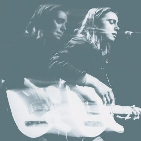
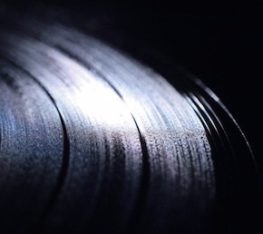
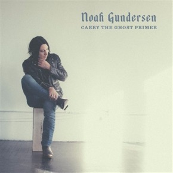
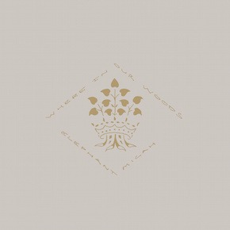
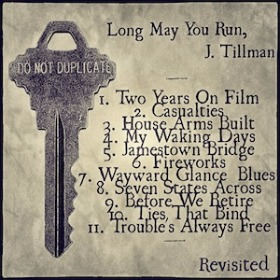

Slowcoustic

 

## [Necessary Listening: Julien Baker – Funeral Pyre](http://slowcoustic.com/2017/01/21/listening-julien-baker-funeral-pyre/)

On 21 January, 2017 by slowcoustic

[0 Comment](http://slowcoustic.com/2017/01/21/listening-julien-baker-funeral-pyre/#respond)

Best of the last bit - Julien Baker does not disappoint with anything she does. Best new everything.

 [Read More →](http://slowcoustic.com/2017/01/21/listening-julien-baker-funeral-pyre/)

 

## [Slowcoustic’s Favourite Albums of 2015](http://slowcoustic.com/2015/12/26/slowcoustics-favourite-albums-2015/)

On 26 December, 2015 by slowcoustic

[1 Comment](http://slowcoustic.com/2015/12/26/slowcoustics-favourite-albums-2015/#comments)

A collection of favourite albums from 2015 that I enjoyed more than a punch in the face.

 [Read More →](http://slowcoustic.com/2015/12/26/slowcoustics-favourite-albums-2015/)

 

## [When I grow up, I will be Noah Gundersen.](http://slowcoustic.com/2015/07/31/grow-up-noah-gundersen/)

On 31 July, 2015 by slowcoustic
[0 Comment](http://slowcoustic.com/2015/07/31/grow-up-noah-gundersen/#respond)

When I grow up, I will be Noah Gundersen. Period.
 [Read More →](http://slowcoustic.com/2015/07/31/grow-up-noah-gundersen/)

 

## [Night Beds: “Me Liquor And God”](http://slowcoustic.com/2015/01/03/night-beds-me-liquor-god/)

On 3 January, 2015 by slowcoustic

[0 Comment](http://slowcoustic.com/2015/01/03/night-beds-me-liquor-god/#respond)

New music from Night Beds. Highly anticipated and definitely not disappointing. Who said a folkie can't groove just a little bit?

 [Read More →](http://slowcoustic.com/2015/01/03/night-beds-me-liquor-god/)

 

## [Slowcoustic’s Favourite Music of 2014](http://slowcoustic.com/2015/01/01/slowcoustics-favourite-music-2014/)

On 1 January, 2015 by slowcoustic

[0 Comment](http://slowcoustic.com/2015/01/01/slowcoustics-favourite-music-2014/#respond)

What I thought was good in music for the year 2014

 [Read More →](http://slowcoustic.com/2015/01/01/slowcoustics-favourite-music-2014/)

 

## [Pre-order: Elephant Micah’s “Where in Our Woods”](http://slowcoustic.com/2014/11/01/pre-order-elephant-micahs-where-woods/)

On 1 November, 2014 by slowcoustic

[0 Comment](http://slowcoustic.com/2014/11/01/pre-order-elephant-micahs-where-woods/#respond)

New album from Elephant Micah has a pre-order for your purchase and a stream of the lead off track for your ears.

 [Read More →](http://slowcoustic.com/2014/11/01/pre-order-elephant-micahs-where-woods/)

1[2](http://slowcoustic.com/page/2/)[3](http://slowcoustic.com/page/3/)[4](http://slowcoustic.com/page/4/)[5](http://slowcoustic.com/page/5/)[6](http://slowcoustic.com/page/6/)[7](http://slowcoustic.com/page/7/)...[194](http://slowcoustic.com/page/194/)[»](http://slowcoustic.com/page/2/)

-

### Search Slowcoustic

-

### Slowcoustic Cover-Song Projects

 [(L)](http://slowcoustic.com/long-run-j-tillman-revisited/)

-

-

-

### Archives

    - ►[2017 (1)](http://slowcoustic.com/2017/)

    - ►[2015 (4)](http://slowcoustic.com/2015/)

    - ►[2014 (25)](http://slowcoustic.com/2014/)

    - ►[2013 (75)](http://slowcoustic.com/2013/)

    - ►[2012 (167)](http://slowcoustic.com/2012/)

    - ►[2011 (190)](http://slowcoustic.com/2011/)

    - ►[2010 (246)](http://slowcoustic.com/2010/)

    - ►[2009 (324)](http://slowcoustic.com/2009/)

    - ►[2008 (127)](http://slowcoustic.com/2008/)