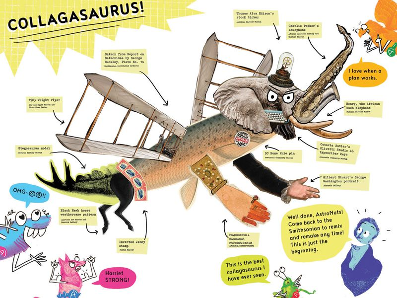
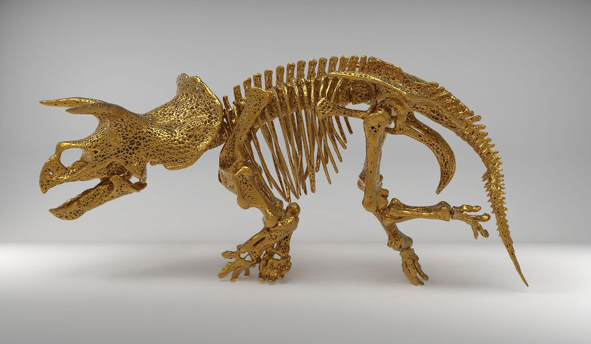
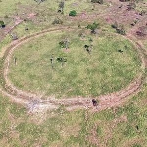

Smithsonian Releases 2.8 Million Images Into Public Domain | At the Smithsonian | Smithsonian Magazine

# Smithsonian Releases 2.8 Million Images Into Public Domain

## The launch of a new open access platform ushers in a new era of accessibility for the Institution

Author-illustrator duo Jon Scieszka and Steven Weinberg debut *How to Make a Collagasaurus,* a how-to booklet inviting kids to transform the Smithsonian collections into zany new art forms. (Jon Scieszka and Steven Weinberg)

By [Katherine J. Wu](https://www.smithsonianmag.com/author/katherine-j-wu/)

  smithsonianmag.com
   February 25, 2020 11:05AM

 AddThis Sharing Buttons

[Share to Facebook%3b width: 20px%3b height: 20px%3b' data-evernote-id='247'%3e%3ctitle id='at-svg-facebook-1' data-evernote-id='892' class='js-evernote-checked'%3eFacebook%3c/title%3e%3cg data-evernote-id='893' class='js-evernote-checked'%3e%3cpath d='M22 5.16c-.406-.054-1.806-.16-3.43-.16-3.4 0-5.733 1.825-5.733 5.17v2.882H9v3.913h3.837V27h4.604V16.965h3.823l.587-3.913h-4.41v-2.5c0-1.123.347-1.903 2.198-1.903H22V5.16z' fill-rule='evenodd' data-evernote-id='894' class='js-evernote-checked'%3e%3c/path%3e%3c/g%3e%3c/svg%3e)8.6K]()[Share to Twitter%3b width: 20px%3b height: 20px%3b' data-evernote-id='248'%3e%3ctitle id='at-svg-twitter-2' data-evernote-id='899' class='js-evernote-checked'%3eTwitter%3c/title%3e%3cg data-evernote-id='900' class='js-evernote-checked'%3e%3cpath d='M27.996 10.116c-.81.36-1.68.602-2.592.71a4.526 4.526 0 0 0 1.984-2.496 9.037 9.037 0 0 1-2.866 1.095 4.513 4.513 0 0 0-7.69 4.116 12.81 12.81 0 0 1-9.3-4.715 4.49 4.49 0 0 0-.612 2.27 4.51 4.51 0 0 0 2.008 3.755 4.495 4.495 0 0 1-2.044-.564v.057a4.515 4.515 0 0 0 3.62 4.425 4.52 4.52 0 0 1-2.04.077 4.517 4.517 0 0 0 4.217 3.134 9.055 9.055 0 0 1-5.604 1.93A9.18 9.18 0 0 1 6 23.85a12.773 12.773 0 0 0 6.918 2.027c8.3 0 12.84-6.876 12.84-12.84 0-.195-.005-.39-.014-.583a9.172 9.172 0 0 0 2.252-2.336' fill-rule='evenodd' data-evernote-id='901' class='js-evernote-checked'%3e%3c/path%3e%3c/g%3e%3c/svg%3e)]()[Share to Reddit%3b width: 20px%3b height: 20px%3b' data-evernote-id='249'%3e%3ctitle id='at-svg-reddit-3' data-evernote-id='905' class='js-evernote-checked'%3eReddit%3c/title%3e%3cg data-evernote-id='906' class='js-evernote-checked'%3e%3cpath d='M27 15.5a2.452 2.452 0 0 1-1.338 2.21c.098.38.147.777.147 1.19 0 1.283-.437 2.47-1.308 3.563-.872 1.092-2.06 1.955-3.567 2.588-1.506.634-3.143.95-4.91.95-1.768 0-3.403-.316-4.905-.95-1.502-.632-2.69-1.495-3.56-2.587-.872-1.092-1.308-2.28-1.308-3.562 0-.388.045-.777.135-1.166a2.47 2.47 0 0 1-1.006-.912c-.253-.4-.38-.842-.38-1.322 0-.678.237-1.26.712-1.744a2.334 2.334 0 0 1 1.73-.726c.697 0 1.29.26 1.78.782 1.785-1.258 3.893-1.928 6.324-2.01l1.424-6.467a.42.42 0 0 1 .184-.26.4.4 0 0 1 .32-.063l4.53 1.006c.147-.306.368-.553.662-.74a1.78 1.78 0 0 1 .97-.278c.508 0 .94.18 1.302.54.36.36.54.796.54 1.31 0 .512-.18.95-.54 1.315-.36.364-.794.546-1.302.546-.507 0-.94-.18-1.295-.54a1.793 1.793 0 0 1-.533-1.308l-4.1-.92-1.277 5.86c2.455.074 4.58.736 6.37 1.985a2.315 2.315 0 0 1 1.757-.757c.68 0 1.256.242 1.73.726.476.484.713 1.066.713 1.744zm-16.868 2.47c0 .513.178.95.534 1.315.356.365.787.547 1.295.547.508 0 .942-.182 1.302-.547.36-.364.54-.802.54-1.315 0-.513-.18-.95-.54-1.31-.36-.36-.794-.54-1.3-.54-.5 0-.93.183-1.29.547a1.79 1.79 0 0 0-.54 1.303zm9.944 4.406c.09-.09.135-.2.135-.323a.444.444 0 0 0-.44-.447c-.124 0-.23.042-.32.124-.336.348-.83.605-1.486.77a7.99 7.99 0 0 1-1.964.248 7.99 7.99 0 0 1-1.964-.248c-.655-.165-1.15-.422-1.486-.77a.456.456 0 0 0-.32-.124.414.414 0 0 0-.306.124.41.41 0 0 0-.135.317.45.45 0 0 0 .134.33c.352.355.837.636 1.455.843.617.207 1.118.33 1.503.366a11.6 11.6 0 0 0 1.117.056c.36 0 .733-.02 1.117-.056.385-.037.886-.16 1.504-.366.62-.207 1.104-.488 1.456-.844zm-.037-2.544c.507 0 .938-.182 1.294-.547.356-.364.534-.802.534-1.315 0-.505-.18-.94-.54-1.303a1.75 1.75 0 0 0-1.29-.546c-.506 0-.94.18-1.3.54-.36.36-.54.797-.54 1.31s.18.95.54 1.315c.36.365.794.547 1.3.547z' fill-rule='evenodd' data-evernote-id='907' class='js-evernote-checked'%3e%3c/path%3e%3c/g%3e%3c/svg%3e)176]()[Share to Pinterest%3b width: 20px%3b height: 20px%3b' data-evernote-id='250'%3e%3ctitle id='at-svg-pinterest_share-4' data-evernote-id='912' class='js-evernote-checked'%3ePinterest%3c/title%3e%3cg data-evernote-id='913' class='js-evernote-checked'%3e%3cpath d='M7 13.252c0 1.81.772 4.45 2.895 5.045.074.014.178.04.252.04.49 0 .772-1.27.772-1.63 0-.428-1.174-1.34-1.174-3.123 0-3.705 3.028-6.33 6.947-6.33 3.37 0 5.863 1.782 5.863 5.058 0 2.446-1.054 7.035-4.468 7.035-1.232 0-2.286-.83-2.286-2.018 0-1.742 1.307-3.43 1.307-5.225 0-1.092-.67-1.977-1.916-1.977-1.692 0-2.732 1.77-2.732 3.165 0 .774.104 1.63.476 2.336-.683 2.736-2.08 6.814-2.08 9.633 0 .87.135 1.728.224 2.6l.134.137.207-.07c2.494-3.178 2.405-3.8 3.533-7.96.61 1.077 2.182 1.658 3.43 1.658 5.254 0 7.614-4.77 7.614-9.067C26 7.987 21.755 5 17.094 5 12.017 5 7 8.15 7 13.252z' fill-rule='evenodd' data-evernote-id='914' class='js-evernote-checked'%3e%3c/path%3e%3c/g%3e%3c/svg%3e)10]()[Share to LinkedIn%3b width: 20px%3b height: 20px%3b' data-evernote-id='251'%3e%3ctitle id='at-svg-linkedin-5' data-evernote-id='919' class='js-evernote-checked'%3eLinkedIn%3c/title%3e%3cg data-evernote-id='920' class='js-evernote-checked'%3e%3cpath d='M26 25.963h-4.185v-6.55c0-1.56-.027-3.57-2.175-3.57-2.18 0-2.51 1.7-2.51 3.46v6.66h-4.182V12.495h4.012v1.84h.058c.558-1.058 1.924-2.174 3.96-2.174 4.24 0 5.022 2.79 5.022 6.417v7.386zM8.23 10.655a2.426 2.426 0 0 1 0-4.855 2.427 2.427 0 0 1 0 4.855zm-2.098 1.84h4.19v13.468h-4.19V12.495z' fill-rule='evenodd' data-evernote-id='921' class='js-evernote-checked'%3e%3c/path%3e%3c/g%3e%3c/svg%3e)]()[Share to Flipboard%3b width: 20px%3b height: 20px%3b' data-evernote-id='252'%3e%3ctitle id='at-svg-flipboard-6' data-evernote-id='925' class='js-evernote-checked'%3eFlipboard%3c/title%3e%3cg data-evernote-id='926' class='js-evernote-checked'%3e%3cpath d='M25 12.334h-6.334v6.333h-6.333V25H6V6h19z' fill-rule='evenodd' data-evernote-id='927' class='js-evernote-checked'%3e%3c/path%3e%3c/g%3e%3c/svg%3e)]()[Share to Email%3b width: 20px%3b height: 20px%3b' data-evernote-id='253'%3e%3ctitle id='at-svg-email-7' data-evernote-id='931' class='js-evernote-checked'%3eEmail%3c/title%3e%3cg data-evernote-id='932' class='js-evernote-checked'%3e%3cg fill-rule='evenodd' data-evernote-id='933' class='js-evernote-checked'%3e%3c/g%3e%3cpath d='M27 22.757c0 1.24-.988 2.243-2.19 2.243H7.19C5.98 25 5 23.994 5 22.757V13.67c0-.556.39-.773.855-.496l8.78 5.238c.782.467 1.95.467 2.73 0l8.78-5.238c.472-.28.855-.063.855.495v9.087z' data-evernote-id='934' class='js-evernote-checked'%3e%3c/path%3e%3cpath d='M27 9.243C27 8.006 26.02 7 24.81 7H7.19C5.988 7 5 8.004 5 9.243v.465c0 .554.385 1.232.857 1.514l9.61 5.733c.267.16.8.16 1.067 0l9.61-5.733c.473-.283.856-.96.856-1.514v-.465z' data-evernote-id='935' class='js-evernote-checked'%3e%3c/path%3e%3c/g%3e%3c/svg%3e)]()[Share to Print%3b width: 20px%3b height: 20px%3b' data-evernote-id='254'%3e%3ctitle id='at-svg-print-8' data-evernote-id='939' class='js-evernote-checked'%3ePrint%3c/title%3e%3cg data-evernote-id='940' class='js-evernote-checked'%3e%3cpath d='M24.67 10.62h-2.86V7.49H10.82v3.12H7.95c-.5 0-.9.4-.9.9v7.66h3.77v1.31L15 24.66h6.81v-5.44h3.77v-7.7c-.01-.5-.41-.9-.91-.9zM11.88 8.56h8.86v2.06h-8.86V8.56zm10.98 9.18h-1.05v-2.1h-1.06v7.96H16.4c-1.58 0-.82-3.74-.82-3.74s-3.65.89-3.69-.78v-3.43h-1.06v2.06H9.77v-3.58h13.09v3.61zm.75-4.91c-.4 0-.72-.32-.72-.72s.32-.72.72-.72c.4 0 .72.32.72.72s-.32.72-.72.72zm-4.12 2.96h-6.1v1.06h6.1v-1.06zm-6.11 3.15h6.1v-1.06h-6.1v1.06z' data-evernote-id='941' class='js-evernote-checked'%3e%3c/path%3e%3c/g%3e%3c/svg%3e)]()[Share to More%3b width: 20px%3b height: 20px%3b' data-evernote-id='255'%3e%3ctitle id='at-svg-addthis-9' data-evernote-id='945' class='js-evernote-checked'%3eAddThis%3c/title%3e%3cg data-evernote-id='946' class='js-evernote-checked'%3e%3cpath d='M18 14V8h-4v6H8v4h6v6h4v-6h6v-4h-6z' fill-rule='evenodd' data-evernote-id='947' class='js-evernote-checked'%3e%3c/path%3e%3c/g%3e%3c/svg%3e)370]()

Culture connoisseurs, rejoice: The [Smithsonian Institution](https://www.si.edu/) is inviting the world to engage with its vast repository of resources like never before.

For the first time in its 174-year history, the Smithsonian has released 2.8 million high-resolution two- and three-dimensional images from across its collections onto an [open access online platform](https://www.si.edu/openaccess) for patrons to peruse and download free of charge. Featuring data and material from all 19 Smithsonian museums, nine research centers, libraries, archives and the National Zoo, the new digital depot encourages the public to not just view its contents, but use, reuse and transform them into just about anything they choose—be it a postcard, a beer koozie or a[(L)](https://www.pinterest.com/pin/186688347023920332/)pair of bootie shorts.

And this gargantuan data dump is just the beginning. Throughout the rest of 2020, the Smithsonian will be rolling out another 200,000 or so images, with more to come as the Institution continues to digitize its collection of [155 million items and counting](https://www.si.edu/collections).

“Being a relevant source for people who are learning around the world is key to our mission,” says [Effie Kapsalis](https://profiles.si.edu/display/nKapsalisE3152005), who is heading up the effort as the Smithsonian’s senior digital program officer. “We can’t imagine what people are going to do with the collections. We’re prepared to be surprised.”

Advertisement

The database’s launch also marks the latest victory for a growing global effort to migrate museum collections into the public domain. Nearly 200 other institutions worldwide—including Amsterdam’s [Rijksmuseum](https://www.smithsonianmag.com/smart-news/explore-netherlands-most-iconic-museum-180959578/), New York’s Metropolitan Museum of Art and the [Art Institute of Chicago](https://www.smithsonianmag.com/smart-news/art-institute-chicago-now-offers-open-access-44313-images-and-counting-its-collections-180970633/)—have made similar moves to digitize and liberate their masterworks in recent years. But the scale of the Smithsonian’s release is “unprecedented” in both depth and breadth, says [Simon Tanner](https://www.kcl.ac.uk/people/professor-simon-tanner), an expert in digital cultural heritage at King’s College London.

Spanning the arts and humanities to science and engineering, the release compiles artifacts, specimens and datasets from an array of fields onto a single online platform. Noteworthy additions include portraits of [Pocahontas](https://npg.si.edu/object/npg_NPG.65.61) and [Ida B. Wells](https://npg.si.edu/object/npg_NPG.2009.36), images of Muhammad Ali’s [boxing headgear](https://nmaahc.si.edu/object/nmaahc_2010.19.1) and Amelia Earhart’s record-shattering [Lockheed Vega 5B](https://airandspace.si.edu/collection-objects/lockheed-vega-5b-amelia-earhart), along with thousands of 3-D models that range in size from a petite [Embreea orchid](https://3d.si.edu/object/3d/embreea-herrenhusana:ee5523da-9d43-475b-b9f3-f000b7b8a156?destination=node/10?edan_local=&edan_q=flower) just a few centimeters in length to the [Cassiopeia A supernova remnant](https://chandra.harvard.edu/photo/2013/casa/), estimated at about 29 light-years across.

“The sheer scale of this interdisciplinary dataset is astonishing,” says Tanner, who advised Smithsonian’s open access initiative. “It opens up a much wider scope of content that crosses science and culture, space and time, in a way that no other collection out there has done, or could possibly even do. This is a staggering contribution to human knowledge.”

Until recently, the Smithsonian was among the thousands of museums and cultural centers around the world that still retained the rights to high-quality digital versions of their artworks, releasing them only upon request for personal or educational purposes and forbidding commercialization. The reluctance is [often justified](https://museumsdigitalculture.prattsi.org/beyond-digitization-planning-for-open-access-collections-fb7325163f5d). Institutions may be beholden to copyrights, for instance, or worry that ceding control over certain works could lead to their exploitation or forgery, or [sully their reputation](https://www.smithsonianmag.com/smart-news/start-2020-ushers-thousands-once-copyrighted-works-public-domain-180973887/) through sheer overuse.

Advertisement

Still, Kapsalis thinks the [benefits of the Smithsonian’s public push](http://siarchives.si.edu/sites/default/files/pdfs/2016_03_10_OpenCollections_Public.pdf), which falls in line with the Institution’s new [digital-first strategy](https://www.si.edu/strategicplan/goal3), will [far outweigh](http://msc.mellon.org/msc-files/Open%20Access%20Report%2004%2025%2013-Final.pdf) the potential downsides. “Bad actors will still do bad,” she says. “We’re empowering good actors to do good.”

One of the most tangible perks, Tanner says, is a “massive increase” in the scale of the public’s interaction with the Smithsonian—something that will maintain and boost the organization’s already substantial cultural cachet for audiences old and new, especially as content trickles onto open knowledge platforms like Wikipedia. “As soon as you open the collections up, it’s transformative,” he says.

Most of the change, however, will happen far beyond the Smithsonian’s walls. Listed under a [Creative Commons Zero](https://creativecommons.org/publicdomain/zero/1.0/) (CC0) license, the 2.8 million images in the new database are now liberated from all restrictions, copyright or otherwise, enabling anyone with a decent Internet connection to build on them as raw materials—and ultimately participate in their evolution.

“Digitizing the knowledge that’s held [at the Smithsonian] to access and reuse transfers a lot of the power to the public,” says [Andrea Wallace](https://socialsciences.exeter.ac.uk/law/staff/wallace/), an expert in cultural heritage law at the University of Exeter. People are now free to interact with these images, she says, “according to their own ideas, their own parameters, their own inspirations,” completely unencumbered.

To showcase a few of the countless spin-offs that access to the collections might generate, the Smithsonian invited artists, educators and researchers for a sneak peak into the archives, and will be featuring some of their creations at a launch event set to take place this evening.

Advertisement

       

Artist Amy Karle unveils a series of sculptures of the National Museum of Natural History’s 66-million-year-old triceratops, Hatcher. (2020 Amy Karle, collaboration with SI)

Among them is a series of sculptures crafted by artist [Amy Karle](https://www.amykarle.com/), depicting the National Museum of Natural History’s 66-million-year-old triceratops, Hatcher. Karle, who specializes in 3-D artworks that highlight body form and function, was keen on bringing the fossil to life in an era where modern technology has made de-extinctions of ancient species a tantalizing possibility. Six of her [nine 3-D printed sculptures](https://www.amykarle.com/project/_smithsonian_collaboration/) are intricate casts of Hatcher’s spine, each slightly “remixed” in the spirit of bioengineering.

“It’s really important to share this kind of data,” Karle says. “Otherwise it’s like having a library with all the doors closed.”

Also on deck for the evening are three Smithsonian-inspired songs produced in collaboration with the Portland-based non-profit [N. M. Bodecker Foundation](https://bodeckerfoundation.org/), which offers creative mentorship to local students. Written and recorded by Bodecker mentees, the songs will hopefully make the colossal open access collection seem approachable, says Decemberists guitarist [Chris Funk](https://www.chrisfunkmusic.com/), who runs a recording studio on the grounds of the Bodecker Building and mentored the songs’ production.

“Historical figures probably wouldn’t be the first thing you’d hear written in modern music,” Funk says. But his students’ creations add a contemporary pop culture twist to the tales of prominent figures like [Solomon Brown](https://siarchives.si.edu/history/featured-topics/stories/solomon-brown-first-african-american-employee-smithsonian-institution), the Smithsonian’s first African American employee, and [Mary Henry](https://siarchives.si.edu/history/featured-topics/stories/mary-henry-eyewitness-civil-war), daughter of the Institution’s first secretary, Joseph Henry.

Advertisement

Additionally, author-illustrator duo [Jon Scieszka](http://www.jsworldwide.com/) and [Steven Weinberg](http://www.stevenweinbergstudio.com/) will debut *How to Make a Collagasaurus*, a how-to booklet inviting kids to transform the Smithsonian collections into zany new art forms. The approach is an echo of their 2019 children’s book, *[AstroNuts](https://www.astronuts.space/)*, which featured a cast of goofy, colorful characters pieced together from images from the Rijksmuseum’s 2013 open access launch.

In the booklet, Smithsonian founder [James Smithson](https://siarchives.si.edu/history/featured-topics/stories/james-smithson-founder-smithsonian-institution), backed by an entourage of AstroNuts, walks the reader through the construction of an example Collagasaurus, cobbled together from museum mainstays now in the public domain, including George Washington’s arm, a stegosaurus tail and Charlie Parker’s saxophone as an elephantine nose.

“Steven and I are perfectly built for this,” Scieszka says. “The thing I love to do is take something somebody else has, and mess it up.” The goal, he adds, is to encourage kids to do the same—and maybe even learn a thing or two along the way.

“Walking through a museum is one way you can see a work of art,” Weinberg says. “When kids make their own … that’s when you start diving deeper into a subject. They’re going to have this really rich knowledge of pieces of art.”

       

Spanning the arts and humanities to science and engineering, the release compiles artifacts, specimens, datasets and portraits (above: Ida B. Wells by Sallie E. Garrity) from an array of fields onto a single online platform. (NPG)

A bevy of research efforts are likely to flourish under the era of open access as well. In one partnership with Google, the Smithsonian has deployed machine-learning algorithms to its datasets to flesh out its list of notable women who have shaped the history of science—an effort that’s previously been aided by [contributions from the public](https://siarchives.si.edu/blog/thanks-your-help-women%E2%80%99s-history-month-summary-0).

Advertisement

“Being able to see an item is a very different thing than to make another use of it,” Tanner says. “You get innovation more frequently and earlier if the knowledge people are relying on is available openly.”

With more than 150 million additional items in its archives, museums, libraries and research centers, the Smithsonian is featuring less than 2 percent of its total collections in this initial launch. Much of the rest may someday be headed for a similar fate. But Kapsalis stresses the existence of an important subset that won’t be candidates for the public domain in the foreseeable future, including location information on endangered species, exploitative images and artifacts from marginalized communities. If released, data and materials like these could imperil the livelihood, values or even survival of a vulnerable population, she explains.

“The way people have captured some cultures in the past has not always been respectful,” Kapsalis says. “We don’t feel we could ethically share [these items] as open access.” Before that can even be discussed as a possibility, she adds, the communities affected must first be consulted and be made a crucial part of the conversation.

But Kapsalis and other Smithsonian personnel also stress the importance of avoiding erasure. Many of these materials will remain available for viewing on-site at museums or even online, but the Smithsonian will retain restrictions on their use. “Representation can empower or disempower people,” says [Taína Caragol](https://npg.si.edu/staff/ta%C3%ADna-caragol), curator of painting and sculpture and Latino art and history at the National Portrait Gallery. “It can honor someone or be mocking. We are not banning access. But some things need more context, and they need a different protocol for accessing them.”

Above all, the open access initiative forges a redefined relationship between the Smithsonian and its audiences around the world, Kapsalis says. That means trust has to go both ways. But at the same time, the launch also represents a modern-day revamp of the Institution’s mission—the “increase and diffusion of knowledge,” now tailored to all that the digital age has to offer. For the first time, visitors to the Smithsonian won’t just be observers, but participants and collaborators in its legacy.

Advertisement

“The Smithsonian is our national collection, the people’s collection,” Funk says. “There’s something to that. To me, this [launch] is the Smithsonian saying: ‘This is your collection, to take and create with.’ That’s really empowering.”

Like this article? SIGN UP for our newsletter

[Privacy Policy](https://www.smithsonianmag.com/smithsonian-institution/smithsonian-releases-28-million-images-public-domain-180974263/), [Terms of Use](https://www.smithsonianmag.com/smithsonian-institution/smithsonian-releases-28-million-images-public-domain-180974263/)

###### About Katherine J. Wu

 

Katherine J. Wu is a Boston-based science journalist and Story Collider senior producer. She holds a Ph.D. in Microbiology and Immunobiology from Harvard University. Previously, she served as a Digital Editor at NOVA Next and was *Smithsonian* magazine's 2018 AAAS Mass Media Fellow.

[Read more from this author](https://www.smithsonianmag.com/author/katherine-j-wu/)| [Follow @katherinejwu](https://twitter.com/katherinejwu)

##### Tags

 [Art](https://www.smithsonianmag.com/tag/art/)  [Artifacts](https://www.smithsonianmag.com/tag/artifacts/)  [National Zoo](https://www.smithsonianmag.com/tag/national-zoo/)  [Photography](https://www.smithsonianmag.com/tag/photography/)  [Smithsonian Gardens](https://www.smithsonianmag.com/tag/smithsonian-gardens/)  [Smithsonian Institution](https://www.smithsonianmag.com/tag/smithsonian-institution/)  [Smithsonian Institution Archives](https://www.smithsonianmag.com/tag/smithsonian-institution-archives/)  [Smithsonian Institution Libraries](https://www.smithsonianmag.com/tag/smithsonian-institution-libraries/)

 AddThis Sharing Buttons

[Share to Facebook%3b width: 20px%3b height: 20px%3b' data-evernote-id='256'%3e%3ctitle id='at-svg-facebook-10' data-evernote-id='1046' class='js-evernote-checked'%3eFacebook%3c/title%3e%3cg data-evernote-id='1047' class='js-evernote-checked'%3e%3cpath d='M22 5.16c-.406-.054-1.806-.16-3.43-.16-3.4 0-5.733 1.825-5.733 5.17v2.882H9v3.913h3.837V27h4.604V16.965h3.823l.587-3.913h-4.41v-2.5c0-1.123.347-1.903 2.198-1.903H22V5.16z' fill-rule='evenodd' data-evernote-id='1048' class='js-evernote-checked'%3e%3c/path%3e%3c/g%3e%3c/svg%3e)8.6K]()[Share to Twitter%3b width: 20px%3b height: 20px%3b' data-evernote-id='257'%3e%3ctitle id='at-svg-twitter-11' data-evernote-id='1053' class='js-evernote-checked'%3eTwitter%3c/title%3e%3cg data-evernote-id='1054' class='js-evernote-checked'%3e%3cpath d='M27.996 10.116c-.81.36-1.68.602-2.592.71a4.526 4.526 0 0 0 1.984-2.496 9.037 9.037 0 0 1-2.866 1.095 4.513 4.513 0 0 0-7.69 4.116 12.81 12.81 0 0 1-9.3-4.715 4.49 4.49 0 0 0-.612 2.27 4.51 4.51 0 0 0 2.008 3.755 4.495 4.495 0 0 1-2.044-.564v.057a4.515 4.515 0 0 0 3.62 4.425 4.52 4.52 0 0 1-2.04.077 4.517 4.517 0 0 0 4.217 3.134 9.055 9.055 0 0 1-5.604 1.93A9.18 9.18 0 0 1 6 23.85a12.773 12.773 0 0 0 6.918 2.027c8.3 0 12.84-6.876 12.84-12.84 0-.195-.005-.39-.014-.583a9.172 9.172 0 0 0 2.252-2.336' fill-rule='evenodd' data-evernote-id='1055' class='js-evernote-checked'%3e%3c/path%3e%3c/g%3e%3c/svg%3e)]()[Share to Reddit%3b width: 20px%3b height: 20px%3b' data-evernote-id='258'%3e%3ctitle id='at-svg-reddit-12' data-evernote-id='1059' class='js-evernote-checked'%3eReddit%3c/title%3e%3cg data-evernote-id='1060' class='js-evernote-checked'%3e%3cpath d='M27 15.5a2.452 2.452 0 0 1-1.338 2.21c.098.38.147.777.147 1.19 0 1.283-.437 2.47-1.308 3.563-.872 1.092-2.06 1.955-3.567 2.588-1.506.634-3.143.95-4.91.95-1.768 0-3.403-.316-4.905-.95-1.502-.632-2.69-1.495-3.56-2.587-.872-1.092-1.308-2.28-1.308-3.562 0-.388.045-.777.135-1.166a2.47 2.47 0 0 1-1.006-.912c-.253-.4-.38-.842-.38-1.322 0-.678.237-1.26.712-1.744a2.334 2.334 0 0 1 1.73-.726c.697 0 1.29.26 1.78.782 1.785-1.258 3.893-1.928 6.324-2.01l1.424-6.467a.42.42 0 0 1 .184-.26.4.4 0 0 1 .32-.063l4.53 1.006c.147-.306.368-.553.662-.74a1.78 1.78 0 0 1 .97-.278c.508 0 .94.18 1.302.54.36.36.54.796.54 1.31 0 .512-.18.95-.54 1.315-.36.364-.794.546-1.302.546-.507 0-.94-.18-1.295-.54a1.793 1.793 0 0 1-.533-1.308l-4.1-.92-1.277 5.86c2.455.074 4.58.736 6.37 1.985a2.315 2.315 0 0 1 1.757-.757c.68 0 1.256.242 1.73.726.476.484.713 1.066.713 1.744zm-16.868 2.47c0 .513.178.95.534 1.315.356.365.787.547 1.295.547.508 0 .942-.182 1.302-.547.36-.364.54-.802.54-1.315 0-.513-.18-.95-.54-1.31-.36-.36-.794-.54-1.3-.54-.5 0-.93.183-1.29.547a1.79 1.79 0 0 0-.54 1.303zm9.944 4.406c.09-.09.135-.2.135-.323a.444.444 0 0 0-.44-.447c-.124 0-.23.042-.32.124-.336.348-.83.605-1.486.77a7.99 7.99 0 0 1-1.964.248 7.99 7.99 0 0 1-1.964-.248c-.655-.165-1.15-.422-1.486-.77a.456.456 0 0 0-.32-.124.414.414 0 0 0-.306.124.41.41 0 0 0-.135.317.45.45 0 0 0 .134.33c.352.355.837.636 1.455.843.617.207 1.118.33 1.503.366a11.6 11.6 0 0 0 1.117.056c.36 0 .733-.02 1.117-.056.385-.037.886-.16 1.504-.366.62-.207 1.104-.488 1.456-.844zm-.037-2.544c.507 0 .938-.182 1.294-.547.356-.364.534-.802.534-1.315 0-.505-.18-.94-.54-1.303a1.75 1.75 0 0 0-1.29-.546c-.506 0-.94.18-1.3.54-.36.36-.54.797-.54 1.31s.18.95.54 1.315c.36.365.794.547 1.3.547z' fill-rule='evenodd' data-evernote-id='1061' class='js-evernote-checked'%3e%3c/path%3e%3c/g%3e%3c/svg%3e)176]()[Share to Pinterest%3b width: 20px%3b height: 20px%3b' data-evernote-id='259'%3e%3ctitle id='at-svg-pinterest_share-13' data-evernote-id='1066' class='js-evernote-checked'%3ePinterest%3c/title%3e%3cg data-evernote-id='1067' class='js-evernote-checked'%3e%3cpath d='M7 13.252c0 1.81.772 4.45 2.895 5.045.074.014.178.04.252.04.49 0 .772-1.27.772-1.63 0-.428-1.174-1.34-1.174-3.123 0-3.705 3.028-6.33 6.947-6.33 3.37 0 5.863 1.782 5.863 5.058 0 2.446-1.054 7.035-4.468 7.035-1.232 0-2.286-.83-2.286-2.018 0-1.742 1.307-3.43 1.307-5.225 0-1.092-.67-1.977-1.916-1.977-1.692 0-2.732 1.77-2.732 3.165 0 .774.104 1.63.476 2.336-.683 2.736-2.08 6.814-2.08 9.633 0 .87.135 1.728.224 2.6l.134.137.207-.07c2.494-3.178 2.405-3.8 3.533-7.96.61 1.077 2.182 1.658 3.43 1.658 5.254 0 7.614-4.77 7.614-9.067C26 7.987 21.755 5 17.094 5 12.017 5 7 8.15 7 13.252z' fill-rule='evenodd' data-evernote-id='1068' class='js-evernote-checked'%3e%3c/path%3e%3c/g%3e%3c/svg%3e)10]()[Share to LinkedIn%3b width: 20px%3b height: 20px%3b' data-evernote-id='260'%3e%3ctitle id='at-svg-linkedin-14' data-evernote-id='1073' class='js-evernote-checked'%3eLinkedIn%3c/title%3e%3cg data-evernote-id='1074' class='js-evernote-checked'%3e%3cpath d='M26 25.963h-4.185v-6.55c0-1.56-.027-3.57-2.175-3.57-2.18 0-2.51 1.7-2.51 3.46v6.66h-4.182V12.495h4.012v1.84h.058c.558-1.058 1.924-2.174 3.96-2.174 4.24 0 5.022 2.79 5.022 6.417v7.386zM8.23 10.655a2.426 2.426 0 0 1 0-4.855 2.427 2.427 0 0 1 0 4.855zm-2.098 1.84h4.19v13.468h-4.19V12.495z' fill-rule='evenodd' data-evernote-id='1075' class='js-evernote-checked'%3e%3c/path%3e%3c/g%3e%3c/svg%3e)]()[Share to Flipboard%3b width: 20px%3b height: 20px%3b' data-evernote-id='261'%3e%3ctitle id='at-svg-flipboard-15' data-evernote-id='1079' class='js-evernote-checked'%3eFlipboard%3c/title%3e%3cg data-evernote-id='1080' class='js-evernote-checked'%3e%3cpath d='M25 12.334h-6.334v6.333h-6.333V25H6V6h19z' fill-rule='evenodd' data-evernote-id='1081' class='js-evernote-checked'%3e%3c/path%3e%3c/g%3e%3c/svg%3e)]()[Share to Email%3b width: 20px%3b height: 20px%3b' data-evernote-id='262'%3e%3ctitle id='at-svg-email-16' data-evernote-id='1085' class='js-evernote-checked'%3eEmail%3c/title%3e%3cg data-evernote-id='1086' class='js-evernote-checked'%3e%3cg fill-rule='evenodd' data-evernote-id='1087' class='js-evernote-checked'%3e%3c/g%3e%3cpath d='M27 22.757c0 1.24-.988 2.243-2.19 2.243H7.19C5.98 25 5 23.994 5 22.757V13.67c0-.556.39-.773.855-.496l8.78 5.238c.782.467 1.95.467 2.73 0l8.78-5.238c.472-.28.855-.063.855.495v9.087z' data-evernote-id='1088' class='js-evernote-checked'%3e%3c/path%3e%3cpath d='M27 9.243C27 8.006 26.02 7 24.81 7H7.19C5.988 7 5 8.004 5 9.243v.465c0 .554.385 1.232.857 1.514l9.61 5.733c.267.16.8.16 1.067 0l9.61-5.733c.473-.283.856-.96.856-1.514v-.465z' data-evernote-id='1089' class='js-evernote-checked'%3e%3c/path%3e%3c/g%3e%3c/svg%3e)]()[Share to Print%3b width: 20px%3b height: 20px%3b' data-evernote-id='263'%3e%3ctitle id='at-svg-print-17' data-evernote-id='1093' class='js-evernote-checked'%3ePrint%3c/title%3e%3cg data-evernote-id='1094' class='js-evernote-checked'%3e%3cpath d='M24.67 10.62h-2.86V7.49H10.82v3.12H7.95c-.5 0-.9.4-.9.9v7.66h3.77v1.31L15 24.66h6.81v-5.44h3.77v-7.7c-.01-.5-.41-.9-.91-.9zM11.88 8.56h8.86v2.06h-8.86V8.56zm10.98 9.18h-1.05v-2.1h-1.06v7.96H16.4c-1.58 0-.82-3.74-.82-3.74s-3.65.89-3.69-.78v-3.43h-1.06v2.06H9.77v-3.58h13.09v3.61zm.75-4.91c-.4 0-.72-.32-.72-.72s.32-.72.72-.72c.4 0 .72.32.72.72s-.32.72-.72.72zm-4.12 2.96h-6.1v1.06h6.1v-1.06zm-6.11 3.15h6.1v-1.06h-6.1v1.06z' data-evernote-id='1095' class='js-evernote-checked'%3e%3c/path%3e%3c/g%3e%3c/svg%3e)]()[Share to More%3b width: 20px%3b height: 20px%3b' data-evernote-id='264'%3e%3ctitle id='at-svg-addthis-18' data-evernote-id='1099' class='js-evernote-checked'%3eAddThis%3c/title%3e%3cg data-evernote-id='1100' class='js-evernote-checked'%3e%3cpath d='M18 14V8h-4v6H8v4h6v6h4v-6h6v-4h-6z' fill-rule='evenodd' data-evernote-id='1101' class='js-evernote-checked'%3e%3c/path%3e%3c/g%3e%3c/svg%3e)370]()

Around the Web[Sponsored by ZergNet](https://www.zergnet.com/privacy-widget)

[The Tragedy of Jim Carrey Just Keeps Getting Sadder and Sadder](https://www.zergnet.com/i/4568922/49076/0/0/0/1)

[Love Scenes That Went Too Far](https://www.zergnet.com/i/4519987/49076/0/0/0/2)

[Another Advanced Species May Have Existed on Earth Before Humans](https://www.zergnet.com/i/3793232/49076/0/0/0/3)

[Study Reveals After You Die, Your Brain Knows You're Dead](https://www.zergnet.com/i/4785592/49076/0/0/0/4)

[Put Salt in the Corners of Your House and Watch What Happens](https://www.zergnet.com/i/4369812/49076/0/0/0/5)

[The Messed Up Truth About the Radium Girls](https://www.zergnet.com/i/4742197/49076/0/0/0/6)

 [          ###### Previous Article    #### In a First, Cheetah Cubs Born Through Surrogacy at the Columbus Zoo](https://www.smithsonianmag.com/smithsonian-institution/first-cheetah-cubs-born-through-surrogacy-columbus-zoo-180974258/)

## Comment on this Story

What do you think?
17 Responses

Upvote

Funny

Love

Surprised

Angry

Sad

- [0 comments]()
- [**Smithsonian Magazine**](https://disqus.com/home/forums/smithsonianmagazine/)
- [** Privacy Policy](https://help.disqus.com/customer/portal/articles/466259-privacy-policy)
- [Login](https://disqus.com/embed/comments/?base=default&f=smithsonianmagazine&t_i=article-smithsonian-releases-28-million-images-public-domain&t_u=https%3A%2F%2Fwww.smithsonianmag.com%2Fsmithsonian-institution%2Fsmithsonian-releases-28-million-images-public-domain-180974263%2F&t_d=Smithsonian%20Releases%202.8%20Million%20Images%20Into%20Public%20Domain%20%7C%20At%20the%20Smithsonian%20%7C%20Smithsonian%20Magazine&t_t=Smithsonian%20Releases%202.8%20Million%20Images%20Into%20Public%20Domain%20%7C%20At%20the%20Smithsonian%20%7C%20Smithsonian%20Magazine&s_o=default#)
- [1](https://disqus.com/home/inbox/)
- [ Recommend](https://disqus.com/embed/comments/?base=default&f=smithsonianmagazine&t_i=article-smithsonian-releases-28-million-images-public-domain&t_u=https%3A%2F%2Fwww.smithsonianmag.com%2Fsmithsonian-institution%2Fsmithsonian-releases-28-million-images-public-domain-180974263%2F&t_d=Smithsonian%20Releases%202.8%20Million%20Images%20Into%20Public%20Domain%20%7C%20At%20the%20Smithsonian%20%7C%20Smithsonian%20Magazine&t_t=Smithsonian%20Releases%202.8%20Million%20Images%20Into%20Public%20Domain%20%7C%20At%20the%20Smithsonian%20%7C%20Smithsonian%20Magazine&s_o=default#)
- tTweetfShare
- [Sort by Best](https://disqus.com/embed/comments/?base=default&f=smithsonianmagazine&t_i=article-smithsonian-releases-28-million-images-public-domain&t_u=https%3A%2F%2Fwww.smithsonianmag.com%2Fsmithsonian-institution%2Fsmithsonian-releases-28-million-images-public-domain-180974263%2F&t_d=Smithsonian%20Releases%202.8%20Million%20Images%20Into%20Public%20Domain%20%7C%20At%20the%20Smithsonian%20%7C%20Smithsonian%20Magazine&t_t=Smithsonian%20Releases%202.8%20Million%20Images%20Into%20Public%20Domain%20%7C%20At%20the%20Smithsonian%20%7C%20Smithsonian%20Magazine&s_o=default#)

Start the discussion…

###### Log in with

-
-
-
-

######  or sign up with Disqus

?

### Disqus is a discussion network

- Disqus never moderates or censors. The rules on this community are its own.
- Don't be a jerk or do anything illegal. Everything is easier that way.

[Read full terms and conditions](https://docs.disqus.com/kb/terms-and-policies/)

Be the first to comment.

- [Powered by Disqus](https://disqus.com/)
- [*✉*Subscribe*✔*](https://disqus.com/embed/comments/?base=default&f=smithsonianmagazine&t_i=article-smithsonian-releases-28-million-images-public-domain&t_u=https%3A%2F%2Fwww.smithsonianmag.com%2Fsmithsonian-institution%2Fsmithsonian-releases-28-million-images-public-domain-180974263%2F&t_d=Smithsonian%20Releases%202.8%20Million%20Images%20Into%20Public%20Domain%20%7C%20At%20the%20Smithsonian%20%7C%20Smithsonian%20Magazine&t_t=Smithsonian%20Releases%202.8%20Million%20Images%20Into%20Public%20Domain%20%7C%20At%20the%20Smithsonian%20%7C%20Smithsonian%20Magazine&s_o=default#)
- [*d*Add Disqus](https://publishers.disqus.com/engage?utm_source=smithsonianmagazine&utm_medium=Disqus-Footer)
- [*⚠*Do Not Sell My Data](https://disqus.com/data-sharing-settings/)