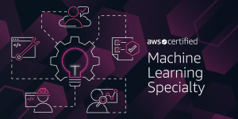

So you are thinking of taking the AWS Certified Machine Learning Specialty exam – THE DATA SCIENCE NINJA

# So you are thinking of taking the AWS Certified Machine Learning Specialty exam

Amazon recently announced that the certification exam for AWS Machine Learning Specialty is out of beta. I took it this morning at one of the AWS testing sites. Below are my thoughts on how to successfully tackle this new certification.

Amazon provides a [study guide](https://d1.awsstatic.com/training-and-certification/machinelearning/AWS%20Certified%20Machine%20Learning%20-%20Specialty_Exam%20Guide_v1.1_FINAL.pdf) on what domains to expect in the exam and how many questions there will be for each particular domain. This should be your first stop to start framing the topics that you should study for the exam. By no means should it be the last.

For the guide, we learn that this will be the breakdown of the domains tested:

|     |     |
| --- | --- |
| **Domain** | **% of Examination** |
| Domain 1: Data Engineering | 20 % |
| Domain 2: Exploratory Data Analysis | 24 % |
| Domain 3: Modeling | 36 % |
| Domain 4: Machine Learning Implementation and Operations | 20 % |
| **TOTAL:** | **100 %** |

While this breakdown is useful. I will provide a couple of other ways that hopefully you will find useful as well. During the exam, I found the questions roughly broke down like this:

Questions that required AWS knowledge: 33%
Questions on Machine Learning that didn’t require AWS knowledge: 33%
Questions that combined Machine Learning with AWS topics: 33%

Your mileage may vary and you might see a different breakdown but from the above breakdown, you can see that you will be able to answer a good bit of questions even if you don’t know anything about the AWS services. However, in order to pass, you will need to know to understand when certain AWS services are applicable and how to use them together to solve machine learning problems. My estimation is that if you have passed at least one of the Associate level certifications AND you are familiar with the AWS machine learning services, you will have enough AWS expertise to be able to pass this certification.

**AWS Services**

Next, let’s explore which AWS services you should focus on and learn about to pass the certification.  I will list them in order of importance.

1. Sagemaker, Sagemaker, Sagemaker. By far this was the service that showed up the most. If you are sitting down for this exam, it would be surprising if you are not at least somewhat familiar with this important AWS service. Make sure you comprehensively cover:

    1. The Sagemaker built-in algorithms (LinearLearner, XGBoost, DeepAR, etc)

    2. Sagemaker endpoint configuration (Blue/Green deployment, Canary deployments, etc)

    3. Hyperparameter Optimization and Automatic Model Tuning

2. All the other AWS Machine Learning Services. Know what they all do, their basic features and usage, and when one is better than the other.

    1. Amazon ML
    2. Amazon Polly
    3. Amazon Lex
    4. Amazon Comprehend
    5. Amazon Rekognition and Amazon Rekognition Video
    6. Amazon Transcribe
    7. Amazon Translate
    8. Deep Learning AMI
    9.

3. Amazon Kinesis. This service was prominently featured in my exam. Know the following and when you used them:

    1. Kinesis Streams
    2. Kinesis Video Streams
    3. Kinesis Firehouse
    4. Kinesis Data Analytics

4. Amazon EMR and AWS Glue. Know what they are and when to use one over the other. Also be at least somewhat familiar with Spark, Hadoop, Hive, etc.

5. Amazon S3. This basic, unsexy and super useful services had quite a presence in the exam.

    1. Know how to use S3 with Sagemaker securely.

    2. Be familiar with CSV, JSON, Parquet, RecordIO protobut and other common formats.

    3. When are certain repositories better solutions? S3 vs. RDS, etc.

6. Amazon Identity and Access Management (IAM). Security is always an important topic and having secure deployments and data is applicable as well in the machine learning domain.

**Machine Learning Topics**

Next, let’s explore what you should expect in the area of machine learning topics. Arguably, it is harder to study for this because machine learning is such a vast area of study. For example, machine learning includes such fun topics as genetic algorithms, generative adversarial networks, swarm intelligence, and even robotics. Let me put you at ease, none of these topics were in my exam and I don’t expect them to be covered thoroughly in general. The machine learning topics and the level of knowledge that you can expect will revolve around:

1. The usage of Sagemaker to create instances, develop, train, optimize and deploy models

2. The Sagemaker built-in algorithms
3. The use of the other AWS machine learning services.
4. Measuring model performance
5. Deep Learning

To keep the article short, I will merely list out words and key phrases that should allow you to research the machine learning relevant topics that you can expect in the test.

**Sagemaker model development, training, and deployment keywords**

Features, dimensions, outliers, pipeline, normal distribution, one hot encoding, label encoding, normalization, multiple imputation, missing data, data frame, sparse matrix, endpoints, hyperparameters vs parameters, automatic model tuning, t-SNE vs PCA, imbalanced dataset, oversampling, undersampling, supervised learning, unsupervised learning, reinforcement learning, labeled data, unlabeled data, converge, dimension reduction, noise, objective function, synthetic feature, A/B testing, blue/green deployment, canary deployment

**Sagemaker built-in algorithm keywords**

Image Classification Algorithm, Latent Dirichlet Allocation, Neural Topic Model, BlazingText, DeepAR, Forecasting, Factorization Machines, IP Insights, Linear Learner, XGBoost, Sequence-to-Sequence, K-means, Random Cut Forest, Object2Vec, Semantic Segmentation, K-Nearest Neighbors, linear regression, logistic regression, multinomial classification, binomial classification, boosting, random forest, decision tree, ensemble, bag of words, n-gram, NLP, NLU

**Deep Learning keywords**

Softmax, ReLU, lasso vs. ridge, regularization, sigmoid, CNNs, RNNs, LSTM, layers, L1 loss, L2 loss, L1 regularization, L2 regularization

**Model performance measurement keywords**

Training set vs testing set, target variable, mean square error (MSE), hinge loss, overfitting, underfitting, confusion matrix, false negative, false positive, precision, recall, accuracy, area under the ROC curve (AUC), bias, variance, elbow method, Log loss, early stopping, stochastic gradient descent, global minimum, local minimum, cost function

**Recommended Training**

There are two courses out right now that focus on the AWS Machine Learning Specialty Certification

[The Acloud.guru AWS Certified Machine Learning – Specialty (Preview) with Scott Pletcher and Brock Tubre](https://learn.acloud.guru/course/aws-certified-machine-learning-specialty/dashboard)

[The Safari Online AWS Machine Learning Specialty Certification Crash Course with Noah Gift](https://www.oreilly.com/live-training/courses/aws-machine-learning-specialty-certification-crash-course/0636920259589/)

Both courses are in development and I expect them to get better in the next few months. The Acloud guru offering has a lot of stubbed out lessons which are not yet developed but will most likely be done in short notice. Noah Gift’s course is more complete as of now and I did get the chance to talk to Noah and he mentioned he has plans to keep on improving the course as he gets more feedback from his students.

Also, both courses require a subscription to the sites that host the courses. In the case of Safari Online, they offer an online trial period.

**Last Words**

Finally, a little advise about the data of the test. Like the other specialty exams, you have 3 hours to complete the exam. I know this topic fairly well so it took me 90 minutes to finish the exam. I found that some the questions while hard are not long. I believe I had to scroll down the page in only one of them. If you study appropriately you should be able to finish on time but do make sure to pace yourself during the exam.

For some of the other exams, I found it useful to have “gate” questions. These are questions where I will look up and see how I am doing with the time. In this case, the math is easy, in this exam there were 65 questions and you have 180 minutes so that means that you should be done with 22 questions at the end of the first hour and with 44 questions by the end of the second hour. It’s important to keep a steady pace to make sure you are not going too quickly, making mistakes and burning out or too slow and run out of time. Try to not look at the clock until you get to your “gate” questions. You don’t want to waste time watching the clock.

Also, I have always made sure to schedule the exams on a Saturday. You want to be well rested and in an optimal state of mind when you take the exam. This is especially true with the Professional and Specialty exams. Please post any questions you might have below but make sure to not ask questions about specific questions from the exam. Good luck!

Author   [Alberto Artasanchez](http://thedatascience.ninja/author/user/)/Posted on [April 7, 2019](http://thedatascience.ninja/2019/04/07/so-you-are-thinking-of-taking-the-aws-certified-machine-learning-specialty-exam/)