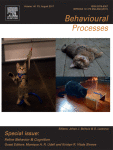

Social interaction, food, scent or toys? A formal assessment of domestic pet and shelter cat (Felis silvestris catus) preferences

## [Behavioural Processes](https://www.sciencedirect.com/science/journal/03766357)

[Volume 141, Part 3](https://www.sciencedirect.com/science/journal/03766357/141/part/P3), August 2017, Pages 322-328

# Social interaction, food, scent or toys? A formal assessment of domestic pet and shelter cat (*Felis silvestris catus*) preferences

Author links open overlay panel[Kristyn R.Vitale Shrevea](https://www.sciencedirect.com/science/article/abs/pii/S0376635716303424#!)[…Lindsay R.Mehrkamb](https://www.sciencedirect.com/science/article/abs/pii/S0376635716303424#!)[…Monique A.R.Udella](https://www.sciencedirect.com/science/article/abs/pii/S0376635716303424#!)

https://doi.org/10.1016/j.beproc.2017.03.016[Get rights and content](https://s100.copyright.com/AppDispatchServlet?publisherName=ELS&contentID=S0376635716303424&orderBeanReset=true)

## Highlights

•
A free-operant preference assessment was conducted with pet and shelter cats.
•

Preference assessment categories included social interaction, food, toys, and scent.

•
There was clear individual variability in cat preference.
•
The majority of cats preferred human social interaction and food.
•
Preferred stimuli may serve as a reinforcer or enrichment items for cats.

## Abstract

Domestic cats (*[Felis](https://www.sciencedirect.com/topics/agricultural-and-biological-sciences/felis)* silvestris catus) engage in a variety of relationships with humans and can be conditioned to engage in numerous behaviors using Pavlovian and operant methods Increasingly cat cognition research is providing evidence of their complex socio-cognitive and problem solving abilities. Nonetheless, it is still common belief that cats are not especially sociable or trainable. This disconnect may be due, in part, to a lack of knowledge of what stimuli cats prefer, and thus may be most motivated to work for. The current study investigated domestic cat preferences at the individual and population level using a free operant preference assessment. Adult cats from two populations (pet and shelter) were presented with three stimuli within each of the following four categories: human social interaction, food, toy, and scent. Proportion of time interacting with each stimulus was recorded. The single most-preferred stimulus from each of the four categories were simultaneously presented in a final session to determine each cat’s most-preferred stimulus overall. Although there was clear individual variability in cat preference, social interaction with humans was the most-preferred stimulus category for the majority of cats, followed by food. This was true for cats in both the pet and shelter population. Future research can examine the use of preferred stimuli as enrichment in applied settings and assess individual cats’ motivation to work for their most-preferred stimulus as a measure of reinforcer efficacy.

- [**Previous **article in issue](https://www.sciencedirect.com/science/article/pii/S0376635716303254)
- [**Next **article in issue](https://www.sciencedirect.com/science/article/pii/S0376635716302947)

## Keywords

Domestic cat
*Felis sylvestris catus*
Human-cat bond
Human interaction
Preference assessment

[View full text](https://www.sciencedirect.com/science/article/pii/S0376635716303424)

© 2017 Elsevier B.V. All rights reserved.