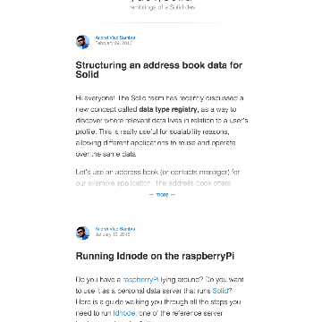

Solid

Solid

https://solid.mit.edu/

f Solid Solid Home About Contribute Inrupt Showcase Team Sponsors Contact What is Solid? Solid is an exciting new project led by Prof. Tim Berners-Lee, inventor of the World Wide Web, taking place at MIT . The project aims to radically change the way Web applications work today, resulting in true data ownership as well as improved privacy. What does Solid offer? Solid (derived from "social linked data") is a proposed set of conventions and tools for building decentralized social applications based on Linked Data principles. Solid is modular and extensible and it relies as much as possible on existing