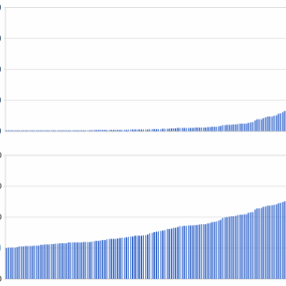

Solving Every Sudoku Puzzle

Solving Every Sudoku Puzzle

http://norvig.com/sudoku.html

Solving Every Sudoku Puzzle by Peter Norvig In this essay I tackle the problem of solving every Sudoku puzzle. It turns out to be quite easy (about one page of code for the main idea and two pages for embellishments) using two ideas: constraint propagation and search . Sudoku Notation and Preliminary Notions First we have to agree on some notation. A Sudoku puzzle is a grid of 81 squares; the majority of enthusiasts label the columns 1-9, the rows A-I, and call a collection of nine squares (column, row, or box) a