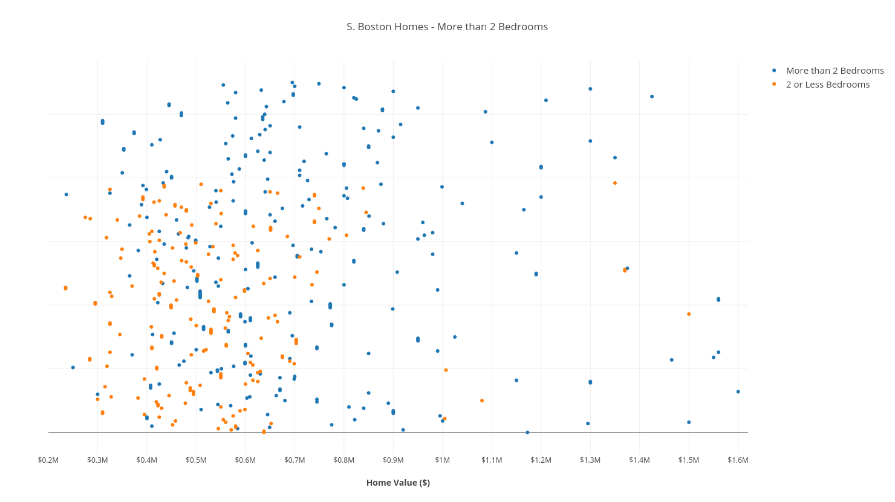
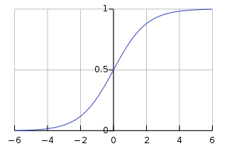
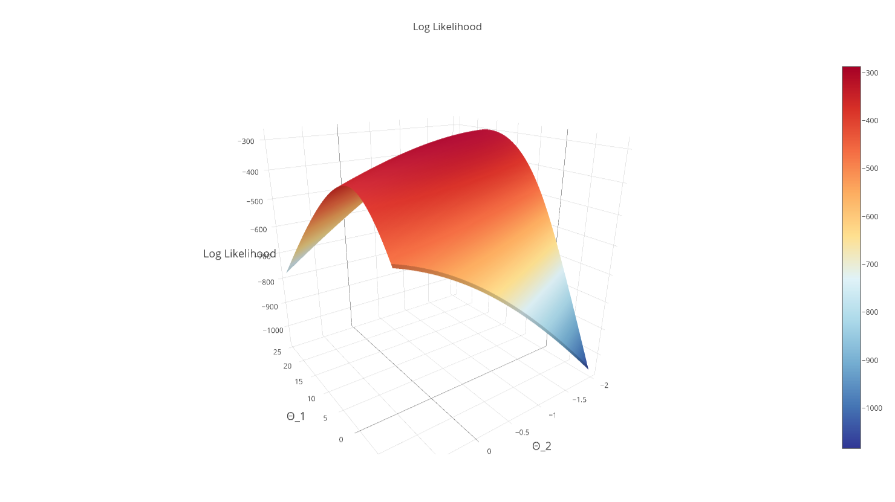
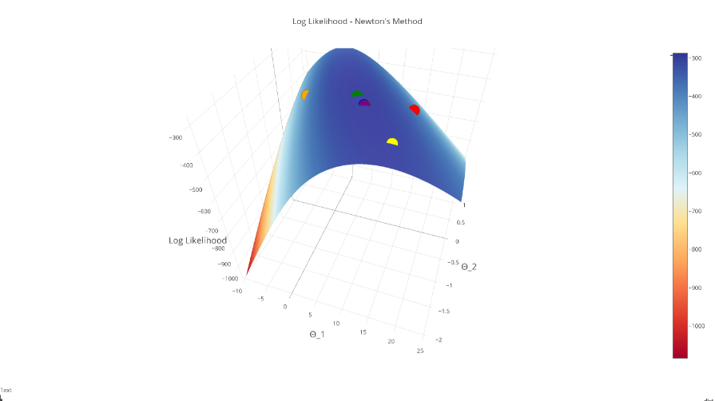
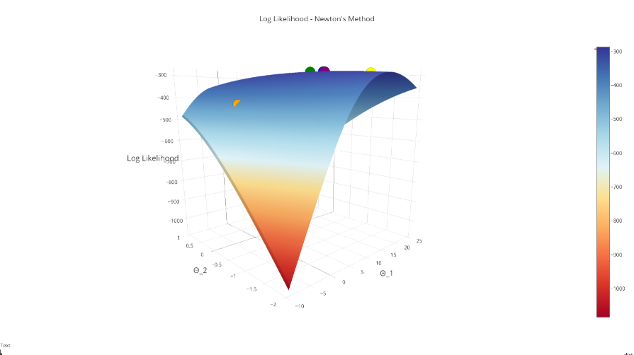
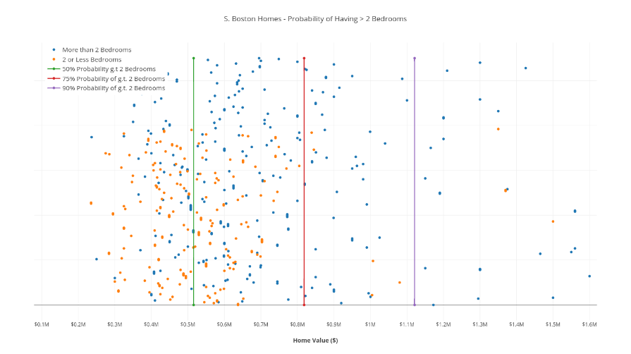

Solving Logistic Regression with Newton's Method

# Solving Logistic Regression with Newton's Method

 06 Jul 2017 on [Math-of-machine-learning](http://thelaziestprogrammer.com/tag/math-of-machine-learning)

In this post we introduce **Newton’s Method**, and how it can be used to solve **Logistic Regression**. Logistic Regression introduces the concept of the **Log-Likelihood** of the Bernoulli distribution, and covers a neat transformation called the **sigmoid function**.

We also introduce **The Hessian**, a square matrix of second-order partial derivatives, and how it is used in conjunction with **The Gradient** to implement Newton’s Method.

Similiar to the [initial post covering Linear Regression and The Gradient](http://thelaziestprogrammer.com/sharrington/math-of-machine-learning/the-gradient-a-visual-descent), we will explore Newton’s Method visually, mathematically, and programatically with Python to understand how our math concepts translate to implementing a practical solution to the problem of binary classification: Logistic Regression.

**Suggested prior knowledge:**

1. Derivatives and the Chain Rule (*Calculus*)

2. Partial Derivatives & [The Gradient](http://http//thelaziestprogrammer.com/sharringto%20n/math-of-machine-learning/the-gradient-a-visual-descent)(*Multivariate Calculus*)

3. Basic Vector Operations (*Linear Algebra*)

4. Basic Understanding of NumPy

5. Basic Understanding of Independent Probability

### The Data

Our dataset is made up of South Boston real estate data, including the value of each home, and a (*boolean*) column indicating if that home *has more than 2 bathrooms*.

x̂ =HomeValue=⟨550000.00,600000.00,...578000.00⟩Tx^=HomeValue=⟨550000.00,600000.00,...578000.00⟩Tŷ =MoreThan2Bathrooms=⟨1,0,0,...1⟩Ty^=MoreThan2Bathrooms=⟨1,0,0,...1⟩T

### The Model

We will be learning a **Logistic Regression** model, that will act as a **binary classifier** predicting whether or not a home has more than 2 bathroom, given its value (in dollars).

We still want to solve a linear combination of features & weights, but we need to transform this linear combination by wrapping it in a function that is smooth, and has its range defined as [0,1][0,1] (*because we are trying to map our linear combination to a binary output of 0 or 1!*)

The logistic function, or **sigmoid function**, accomplishes all of these things:

h(x)=1/(1+e−z),  z=θ1x+θ2h(x)=1/(1+e−z),  z=θ1x+θ2

**Note:**  *We add θ2θ2 to the exponent as “the intercept” to provide more flexibility; we have 1 dimension of data, **house_value**, but we are solving a 2-dimensional model!*

Similiar to the way we defined our **sum of squares** objective function for linear regression, we want to use our hypothesis function, h(x)h(x), and formulate our **likelihood function** to maximize and fit our weights. **Here’s where things get mathy:**

### The Math: Defining a Likelihood Function

First we need to define a [Probability Mass Function](https://en.wikipedia.org/wiki/Probability_mass_function):

P(y=1| x;θ)=hθ(x)P(y=1| x;θ)=hθ(x)
P(y=0| x;θ)=1−hθ(x)P(y=0| x;θ)=1−hθ(x)

**Note:**  *The left-hand side of the first statement reads “The probability that y equals 1, given a feature-vector xx, and the hypothesis function’s weights θθ.” Our hypothesis function (right-hand-side) calculates this probability.*

These two statements can be condensed into one:
P(y| x;θ)=hθ(x)y(1−hθ(x))1−yP(y| x;θ)=hθ(x)y(1−hθ(x))1−y

The table below shows how incorrect predictions by our hypothesis function (i.e. h(x)=.25,y=1h(x)=.25,y=1) are penalized by generating low values. It also helps to understand how we condense the two statements into one.

|     |     |     |
| --- | --- | --- |
| h(x)h(x) | y=0y=0 | y=1y=1 |
| .25 | **.75** | **.25** |
| .5  | **.5** | **.5** |
| .75 | **.25** | **.75** |
| .9  | **.1** | **.9** |

Naturally, we want to maximize the right-hand-side of the above statement, which happens to be our **likelihood function**.

I like to think of the **likelihood function** as “*the likelihood that our model will **correctly** predict any given yy value, given its corresponding feature vector x̂ x^*”. It is, however, important to [distinguish between probability and likelihood.](https://stats.stackexchange.com/questions/2641/what-is-the-difference-between-likelihood-and-probability).

Now, we expand our **likelihood** function by applying it to every sample in our training data. We multiply each individual **likelihood** together to get the cumulative likelihood that our model is accurately predicting yy values of our training data:

L(θ)=∏i=1np(yi|xi;θ)L(θ)=∏i=1np(yi|xi;θ)
L(θ)=∏i=1nhθ(xi)yi(1−hθ(xi))1−yiL(θ)=∏i=1nhθ(xi)yi(1−hθ(xi))1−yi

Seeing that we are multiplying “nn” likelihoods together (*all less than 1.0*), where nn is the number of training samples, we are going to get a product of magnitude 10−n10−n. This is bad news! Eventually, we will **run out of precision**, and Python will turn our very small floats to 00.

Our solution is to take the loglog of our likelihood function:
ℓ(θ)=log L(θ)ℓ(θ)=log L(θ)

ℓ(θ)=∑i=1nyilog(hθ(xi))+(1−yi)log(1−hθ(xi))ℓ(θ)=∑i=1nyilog⁡(hθ(xi))+(1−yi)log⁡(1−hθ(xi))

**Note:**  *Remember that log(xy)=log(x)+log(y)log(xy)=log(x)+log(y), and that: log(x)n=nlog(x)log(x)n=nlog(x)*.

This is called the **log-likelihood** of our hypothesis function.

Remember, our hypothesis function penalizes bad predictions by generating small values, so we want to **maximize the log-likelihood.** The curve of our log-likelihood is shown below:

***Note:** By taking the log of our function to derive the **log-likelihood**, we guarantee (as an added bonus) that our objective function is **strictly concave**, meaning there is 1 global maximum.*

### The Math: Newton’s Method with One Variable

Before we maximize our log-likelihood, let’s introduce **Newton’s Method**.

**Newton’s Method** is an iterative equation solver: it is an algorithm to find the roots of a polynomial function. In the simple, one-variable case, Newton’s Method is implemented as follows:

1. *Find the tangent line to f(x)f(x) at point (xn,yn)(xn,yn)*

    - y=f′(xn)(x−xn)+f(xn)y=f′(xn)(x−xn)+f(xn)

2. *Find the x-intercept of the tangent line, xn+1xn+1*

    - 0=f′(xn)(xn+1−xn)+f(xn)0=f′(xn)(xn+1−xn)+f(xn)

    - −f(xn)=f′(xn)(xn+1−xn)−f(xn)=f′(xn)(xn+1−xn)

    - xn+1=xn−f(xn)f′(xn)xn+1=xn−f(xn)f′(xn)

3. *Find the yy value at the x-intercept.*

    - yn+1=f(xn+1)yn+1=f(xn+1)

4. *If yn+1−yn≈0yn+1−yn≈0:*

    - **return yn+1yn+1** because we’ve converged!

5. *Else update point (xn,yn)(xn,yn), and iterate*

    - x=xn+1,y=yn+1x=xn+1,y=yn+1, **goto (1)**.

The following .gif (from Wikipedia) helps to visualize this method:

If you understand the more-verbose algorithm above, you will see that this boils down to:

1. **Until xn−xn+1≈0xn−xn+1≈0:**

    - xn+1=xn−f(xn)f′(xn)xn+1=xn−f(xn)f′(xn)

Anyone who passed high school Calculus may be able to understand the above. But how do we generalize to the multivariate, “n-dimensional” case?

### The Math: Newton’s Method in N-dimensions

Recall that in n-dimensions, we replace single-variable derivatives with a vector of partial derivatives called the **gradient**.

[Review the gradient here](http://thelaziestprogrammer.com/sharrington/math-of-machine-learning/the-gradient-a-visual-descent#the-math-finding-the-gradient) if this concept is fuzzy to you.

Thus, our update rule, in its multivariate form, becomes our vector of parameters x̂ x^, minus the scalar f(x̂ )f(x^) multiplied by the inverse of the gradient vector:

x̂ n+1=x̂ n−f(x̂ n)∗∇f(x̂ n)−1x^n+1=x^n−f(x^n)∗∇f(x^n)−1

**Note:**  *The f′(xn)f′(xn) in f(xn)f′(xn)f(xn)f′(xn) becomes ∇f(x̂ n)−1∇f(x^n)−1 because we generalize the “reciprocal of the scalar, f(xn)f(xn)” to the multivariate case, replacing it with the “inverse of the gradient, ∇f(x̂ n)−1∇f(x^n)−1”.*

### The Math: Maximizing Log-Likelihood with Newton’s Method

Recall that we want to maximize the log-likelihood, ℓ(θ)ℓ(θ) of our hypothesis function, hθ(x)hθ(x)

To maximize our function, we want to find the partial derivatives of ℓ(θ)ℓ(θ), and set them equal to 0, and solve for θ1θ1 and θ2θ2 to find the [critical point](https://en.wikipedia.org/wiki/Critical_point_(mathematics)#Application_to_optimization) of the partials. This critical point will be the **max** of our log-likelihood.

**Note:**  *Since the log-likelihood is strictly concave, we have one **global max**. This means that we only have 1 **critical point**, so our solution hashed out above is the only solution!*

This should sound familiar. We are trying to find values for θ1θ1 and θ2θ2 that make the partial derivatives 0. We are finding the *“roots”* of the vector of partials (*the gradient*). We can use Newton’s Method to this! Recall the update step in Newton’s Method:

x̂ n+1=x̂ n−f(x̂ n)1∇f(x̂ n)x^n+1=x^n−f(x^n)1∇f(x^n)
We can substitute f(x̂ n)f(x^n) with the gradient, ∇ℓ(θ)∇ℓ(θ), leaving us with:
x̂ n+1=x̂ n−∇ℓ(θ)1?x^n+1=x^n−∇ℓ(θ)1?

What about the ?? term above? Intuition tells us that we need to take the derivative of the gradient vector, just like we previously took the derivative of f(x̂ n)f(x^n).

Enter **The Hessian.**

### The Math: The Hessian

Given our pre-requisite knowledge of **Multivariate Calculus**, we should know that to find the “*second-order*” partial derivatives of a function, we take the partial derivative of each first-order partial, with respect to each parameter. If we have nn parameters, then we have n2n2 second-order partial derivatives.

Consequently, The Hessian is a square matrix of second-order partial derivatives of order n x nn x n.

In our case of 2 parameters, (θ1,θ2)(θ1,θ2), our Hessian looks as follows:

Hℓ(θ̂ )=⎡⎣⎢⎢⎢⎢∂2ℓ∂θ21∂2ℓ∂θ2∂θ1∂2ℓ∂θ1∂θ2∂2ℓ∂θ22⎤⎦⎥⎥⎥⎥Hℓ(θ^)=[∂2ℓ∂θ12∂2ℓ∂θ1∂θ2∂2ℓ∂θ2∂θ1∂2ℓ∂θ22]

### The Math: Putting it all Together

By substituting **The Hessian** into the **Newton’s Method** update step, we are left with:

θn+1=θn+H−1ℓ(θ̂ )∇ℓ(θ)θn+1=θn+Hℓ(θ^)−1∇ℓ(θ)

**Note:**  *We take the **inverse** of The Hessian, rather than taking its reciprocal because it is a matrix*

For brevity’s sake, this post leaves out the actual derivation of the gradient and the hessian. Resources to understand the following derivations can be found at:

1. [Derivation of the Gradient of our Log-Likelihood](http://cs229.stanford.edu/notes/cs229-notes1.pdf), Andrew Ng’s lecture notes, pages 17-18.

2. The derivation of the hessian is pretty straight forward, given Andrew Ng’s notes on the derivative of the **sigmoid function**, g′(z)g′(z), once you’ve calculated the gradient.

The **gradient** of ℓ(θ)ℓ(θ) is:
∇ℓ=⟨∑ni=1(yi−hθ(xi))xi∑ni=1(yi−hθ(xi))⟩∇ℓ=⟨∑i=1n(yi−hθ(xi))xi∑i=1n(yi−hθ(xi))⟩
While the **hessian** of ℓ(θ)ℓ(θ) is:

Hℓ(θ̂ )=⎡⎣⎢⎢⎢⎢⎢∑i=1nhθ(xi)(1−hθ(xi))θ1θ1, ∑i=1nhθ(xi)(1−hθ(xi))θ1, ∑i=1nhθ(xi)(1−hθ(xi))θ1∑i=1nhθ(xi)(1−hθ(xi))⎤⎦⎥⎥⎥⎥⎥Hℓ(θ^)=[∑i=1nhθ(xi)(1−hθ(xi))θ1θ1, ∑i=1nhθ(xi)(1−hθ(xi))θ1∑i=1nhθ(xi)(1−hθ(xi))θ1, ∑i=1nhθ(xi)(1−hθ(xi))]

Where hθ(x)=11+e−zhθ(x)=11+e−z and z=θ1x+θ2z=θ1x+θ2.

### Implementing Newton’s Method

We start off by defining our **hypothesis function**, which is the **sigmoid function**.

	def sigmoid(x, Θ_1, Θ_2):
	    z = (Θ_1*x + Θ_2).astype("float_")
	    return 1.0 / (1.0 + np.exp(-z))

Then we define ℓ(θ)ℓ(θ), our **log-likelihood** function:

	def log_likelihood(x, y, Θ_1, Θ_2):
	    sigmoid_probs = sigmoid(x, Θ_1, Θ_2)
	    return np.sum(y * np.log(sigmoid_probs)
	                  + (1 - y) * np.log(1 - sigmoid_probs))

Finally, we implement the **gradient** and the **hessian** of our log-likelihood.

	def gradient(x, y, Θ_1, Θ_2):
	    sigmoid_probs = sigmoid(x, Θ_1, Θ_2)
	    return np.array([[np.sum((y - sigmoid_probs) * x),
	                     np.sum((y - sigmoid_probs) * 1)]])

	def hessian(x, y, Θ_1, Θ_2):
	    sigmoid_probs = sigmoid(x, Θ_1, Θ_2)
	    d1 = np.sum((sigmoid_probs * (1 - sigmoid_probs)) * x * x)
	    d2 = np.sum((sigmoid_probs * (1 - sigmoid_probs)) * x * 1)
	    d3 = np.sum((sigmoid_probs * (1 - sigmoid_probs)) * 1 * 1)
	    H = np.array([[d1, d2],[d2, d3]])
	    return H

With all of our math implemented in these 4 functions, we can create the outer *while loop* and iterate using **Newton’s Method** until we converge on the maximum.

	def newtons_method(x, y):
	    """
	    :param x (np.array(float)): Vector of Boston House Values in dollars
	    :param y (np.array(boolean)): Vector of Bools indicting if house has > 2 bedrooms:
	    :returns: np.array of logreg's parameters after convergence, [Θ_1, Θ_2]
	    """

	    *# Initialize log_likelihood & parameters                                                                   *
	    Θ_1 = 15.1
	    Θ_2 = -.4 *# The intercept term                                                                 *
	    Δl = np.Infinity
	    l = log_likelihood(x, y, Θ_1, Θ_2)
	    *# Convergence Conditions                                                        *
	    δ = .0000000001
	    max_iterations = 15
	    i = 0
	    while abs(Δl) > δ and i < max_iterations:
	        i += 1
	        g = gradient(x, y, Θ_1, Θ_2)
	        hess = hessian(x, y, Θ_1, Θ_2)
	        H_inv = np.linalg.inv(hess)
	        *# @ is syntactic sugar for np.dot(H_inv, g.T)¹*
	        Δ = H_inv @ g.T
	        ΔΘ_1 = Δ[0][0]
	        ΔΘ_2 = Δ[1][0]

	        *# Perform our update step                                                    *
	        Θ_1 += ΔΘ_1
	        Θ_2 += ΔΘ_2

	        *# Update the log-likelihood at each iteration                                     *
	        l_new = log_likelihood(x, y, Θ_1, Θ_2)
	        Δl = l - l_new
	        l = l_new
	    return np.array([Θ_1, Θ_2])

### Visualizing Newton’s Method

Let’s see what happens when we plot each iteration of Newton’s Method on our log-likelihood function’s surface:

**Note:**  *The first iteration is *red*, the second iteration is *orange*….final iteration is *purple**

This graphic lends confirmation that our “purple” point is in fact the max, and that we have converged succesfully!

### Visualizing our Solution

Normally, to visualize a 1-Dimensional dataset, you’d plot all of the points on a number-line, and place a boundary somewhere along the line. The problem here is that all of the data points get bunched together.

So instead, I’ve “stretched them out” along a y-axis, and labeled the points by color. We’ve also drawn 3 linear boundaries to separate the homes into percentiles – explained by the legend.

### Conclusion

we have covered a number of new topics, including **The Hessian**, **Log-likelihood** and **The Sigmoid Function**. Combining these methods together, we’ve been able implement **Newton’s Method** to solve **Logistic Regression**.

While these concepts enforce a **very** concrete foundation to implement our solution, we still need to be wary of things that can cause Newton’s Method to diverge. These are out of scope here, but you can read more on divergence here!

 [(L)](http://thelaziestprogrammer.com/author/sharrington)

#### [Sean Harrington](http://thelaziestprogrammer.com/author/sharrington)

I believe that cover bands should welcome guitarists in the audience on-stage, that Mat Cauthon would make any 14-book series enjoyable, and that college football players can evolve into decent software developers.

  Boston, MA  [github.com/seanharr11](http://github.com/seanharr11)  [seanharr11](https://twitter.com/seanharr11)

#### Share this post

 [](http://twitter.com/share?text=Solving%20Logistic%20Regression%20with%20Newton%27s%20Method&url=http://thelaziestprogrammer.comsharringtonmath-of-machine-learningsolving-logreg-newtons-method)  [](https://www.facebook.com/sharer/sharer.php?u=http://thelaziestprogrammer.comsharringtonmath-of-machine-learningsolving-logreg-newtons-method)  [](https://plus.google.com/share?url=http://thelaziestprogrammer.comsharringtonmath-of-machine-learningsolving-logreg-newtons-method)