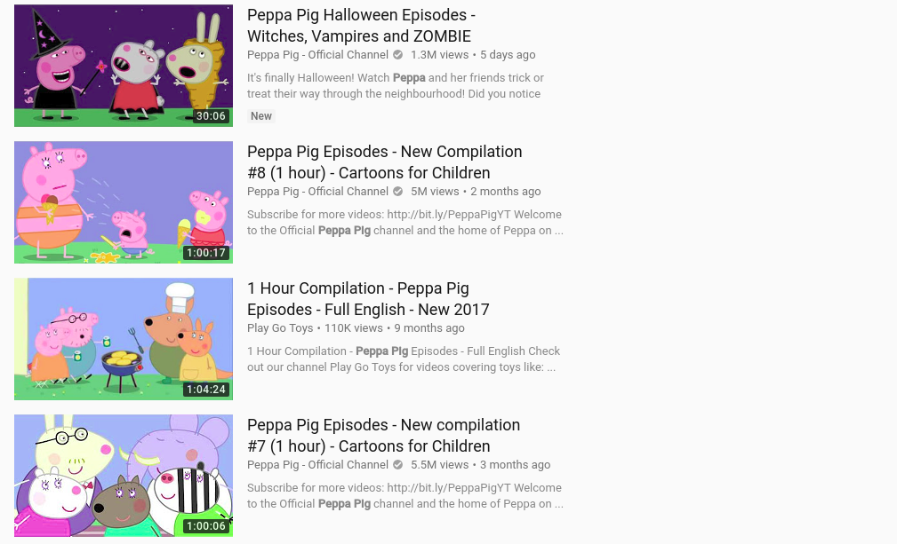
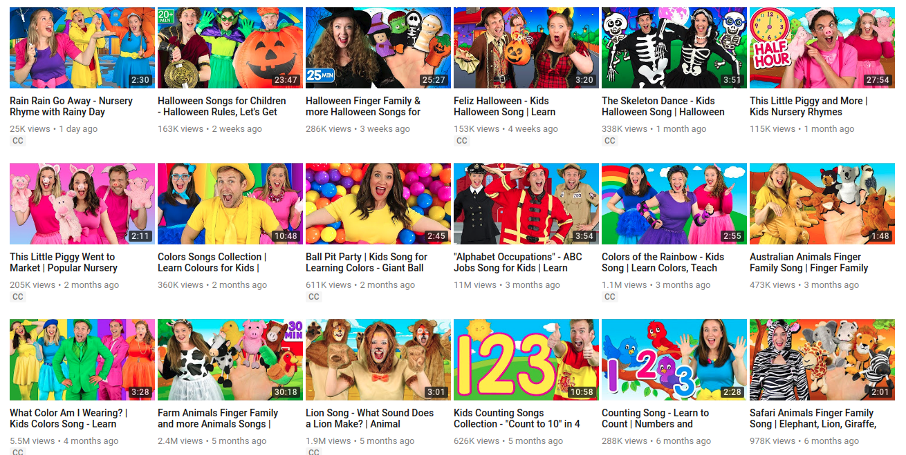
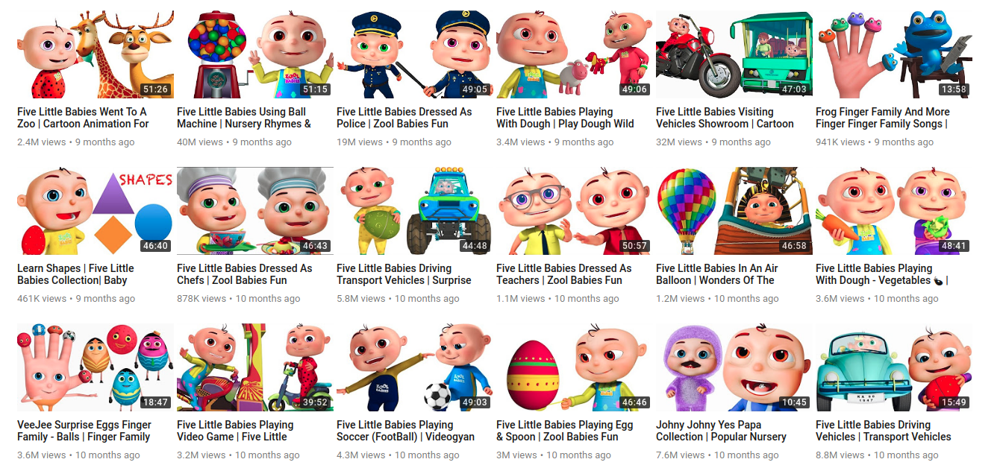
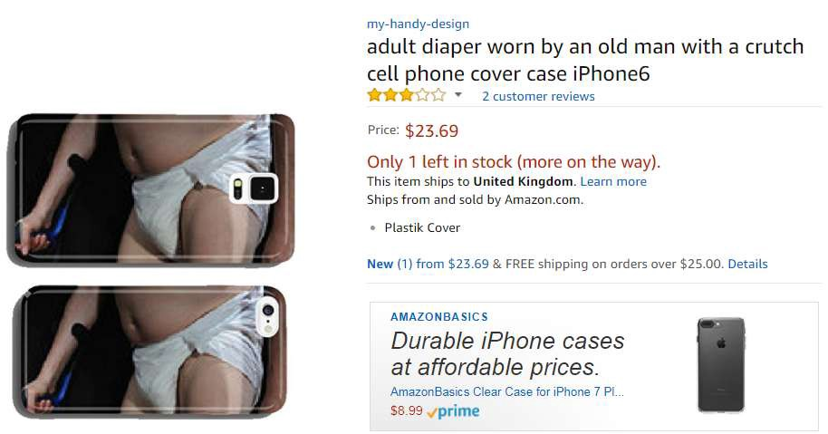
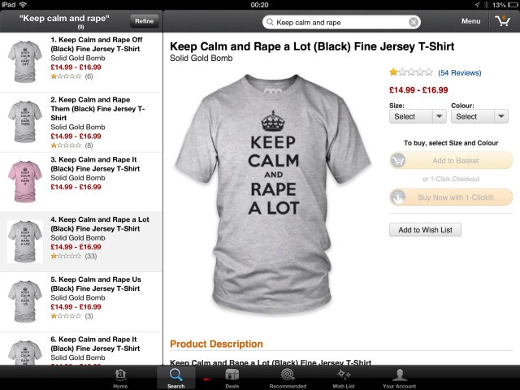
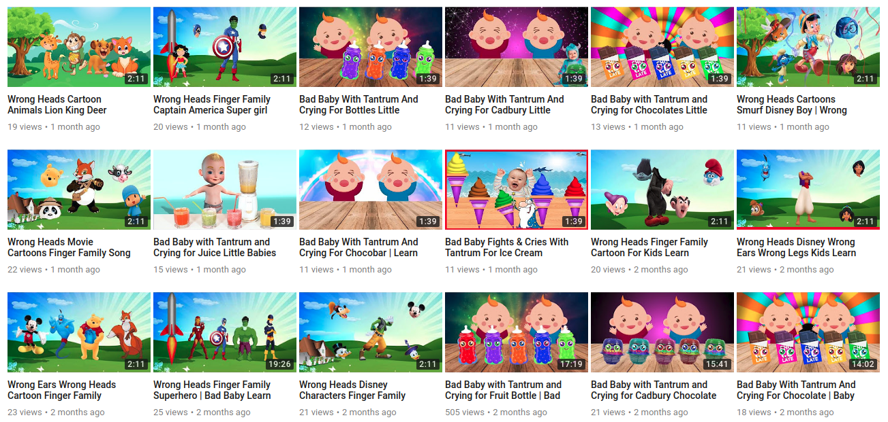
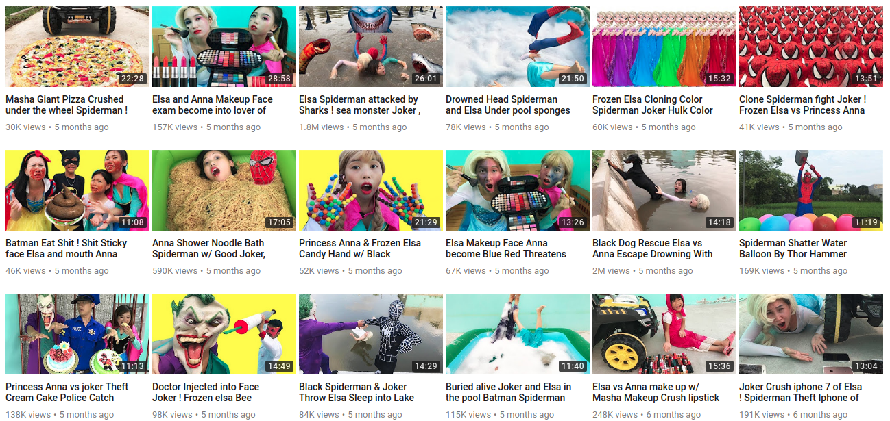

Something is wrong on the internet – James Bridle – Medium

# Something is wrong on the internet

*I’m *[*James Bridle*](http://jamesbridle.com/)*. I’m a writer and artist concerned with technology and culture. I usually write on my own blog, but frankly I don’t want what I’m talking about here anywhere near my own site. ****Please be advised: this essay describes disturbing things and links to disturbing graphic and video content. You don’t have to read it, and are advised to take caution exploring further.***

As someone who grew up on the internet, I credit it as one of the most important influences on who I am today. I had a computer with internet access in my bedroom from the age of 13. It gave me access to a lot of things which were totally inappropriate for a young teenager, but it was OK. The culture, politics, and interpersonal relationships which I consider to be central to my identity were shaped by the internet, in ways that I have always considered to be beneficial to me personally. I have always been a critical proponent of the internet and everything it has brought, and broadly considered it to be emancipatory and beneficial. I state this at the outset because thinking through the implications of the problem I am going to describe troubles my own assumptions and prejudices in significant ways.

One of so-far hypothetical questions I ask myself frequently is how I would feel about my own children having the same kind of access to the internet today. And I find the question increasingly difficult to answer. I understand that this is a natural evolution of attitudes which happens with age, and at some point this question might be a lot less hypothetical. I don’t want to be a hypocrite about it. I would want my kids to have the same opportunities to explore and grow and express themselves as I did. I would like them to have that choice. And this belief broadens into attitudes about the role of the internet in public life as whole.

I’ve also been aware for some time of the increasingly symbiotic relationship between younger children and YouTube. I see kids engrossed in screens all the time, in pushchairs and in restaurants, and there’s always a bit of a Luddite twinge there, but I am not a parent, and I’m not making parental judgments for or on anyone else. I’ve seen family members and friend’s children plugged into Peppa Pig and nursery rhyme videos, and it makes them happy and gives everyone a break, so OK.

But I don’t even have kids and right now I just want to burn the whole thing down.

**Someone or something or some combination of people and things is using YouTube to systematically frighten, traumatise, and abuse children, automatically and at scale, and it forces me to question my own beliefs about the internet, at every level. **Much of what I am going to describe next has been covered elsewhere, although none of the mainstream coverage I’ve seen has really grasped the implications of what seems to be occurring.

To begin: Kid’s YouTube is definitely and markedly weird. I’ve been aware of its weirdness for some time. Last year, there were [a number of articles](http://nymag.com/selectall/2016/04/inside-the-strange-world-of-million-view-surprise-egg-youtube-videos.html) posted about the Surprise Egg craze. Surprise Eggs videos depict, often at excruciating length, the process of unwrapping Kinder and other egg toys. That’s it, but kids are captivated by them. There are thousands and thousands of these videos and thousands and thousands, if not millions, of children watching them.

From [the article linked above](http://nymag.com/selectall/2016/04/inside-the-strange-world-of-million-view-surprise-egg-youtube-videos.html):

> The maker of my particular favorite videos is “> [> Blu Toys Surprise Brinquedos & Juegos](https://www.youtube.com/user/Blucollection)> ,” and since 2010 he seems to have accrued 3.7 million subscribers and just under 6 billion views for a kid-friendly channel entirely devoted to opening surprise eggs and unboxing toys. The video titles are a continuous pattern of obscure branded lines and tie-ins: > [> “Surprise Play Doh Eggs Peppa Pig Stamper Cars Pocoyo Minecraft Smurfs Kinder Play Doh Sparkle Brilho](https://www.youtube.com/watch?v=IYjxnvH0dYE)> ,” “> [> Cars Screamin’ Banshee Eats Lightning McQueen Disney Pixar](https://www.youtube.com/watch?v=yNmQO1qIlKM)> ,” “> [> Disney Baby Pop Up Pals Easter Eggs SURPRISE](https://www.youtube.com/watch?v=E8pvoa-SFZI)> .”

> As I write this he has done a total of 4,426 videos and counting. With so many views — for comparison, Justin Bieber’s official channel has more than 10 billion views, while full-time YouTube celebrity PewDiePie has nearly 12 billion — it’s likely this man makes a living as a pair of gently murmuring hands that unwrap Kinder eggs. (Surprise-egg videos are all accompanied by pre-roll, and sometimes mid-video and ads.)

That should give you some idea of just how odd the world of kids online video is, and that list of video titles hints at the extraordinary range and complexity of this situation. We’ll get into the latter in a minute; for the moment know that it’s already very strange, if apparently pretty harmless, out there.

Another huge trope, especially the youngest children, is nursery rhyme videos.

[Little Baby Bum](https://www.youtube.com/channel/UCKAqou7V9FAWXpZd9xtOg3Q), which made the above video, is the [7th most popular channel](https://socialblade.com/youtube/top/500/mostviewed) on YouTube. With just 515 videos, they have accrued **11.5 million subscribers and 13 billion views. **Again, there are questions as to the accuracy of these numbers, which I’ll get into shortly, but the key point is that this is a huge, huge network and industry.

On-demand video is catnip to both parents and to children, and thus to content creators and advertisers. Small children are mesmerised by these videos, whether it’s familiar characters and songs, or simply bright colours and soothing sounds. The length of many of these videos — one common video tactic is to assemble many nursery rhyme or cartoon episodes into hour+ compilations —and the way that length is marketed as part of the video’s appeal, points to the amount of time some kids are spending with them.

YouTube broadcasters have thus developed a huge number of tactics to draw parents’ and childrens’ attention to their videos, and the advertising revenues that accompany them. The first of these tactics is simply to copy and pirate other content. A simple search for “Peppa Pig” on YouTube in my case yielded “About 10,400,000 results” and the front page is almost entirely from the verified “Peppa Pig Official Channel”, while one is from an unverified channel called [Play Go Toys](https://www.youtube.com/channel/UCWRbkHMZys99xnNY6pvHSiQ), which you really wouldn’t notice unless you were looking out for it:

[Play Go Toys’ channel](https://www.youtube.com/channel/UCWRbkHMZys99xnNY6pvHSiQ/videos) consists of (I guess?) pirated Peppa Pig and other cartoons, videos of toy unboxings (another kid magnet), and videos of, one supposes, the channel owner’s own children. I am not alleging anything bad about Play Go Toys; I am simply illustrating how the structure of YouTube facilitates the delamination of content and author, and how this impacts on our awareness and trust of its source.

As [another blogger notes](https://theoutline.com/post/1239/youtube-has-a-fake-peppa-pig-problem), one of the traditional roles of branded content is that it is a trusted source. Whether it’s Peppa Pig on children’s TV or a Disney movie, whatever one’s feelings about the industrial model of entertainment production, they are carefully produced and monitored so that kids are essentially safe watching them, and *can be trusted as such*. This no longer applies when brand and content are disassociated by the platform, and so known and trusted content provides a seamless gateway to unverified and potentially harmful content.

(Yes, this is the exact same process as the delamination of trusted news media on [Facebook feeds](https://www.wired.co.uk/article/how-to-spot-fake-news) and [in Google results](https://gizmodo.com/googles-top-stories-promoted-misinformation-about-the-l-1819053288) that is currently wreaking such havoc on our cognitive and political systems and I am not going to explicitly explore that relationship further here, but it is obviously deeply significant.)

A second way of increasing hits on videos is through keyword/hashtag association, which is a whole dark art unto itself. When some trend, such as Surprise Egg videos, reaches critical mass, content producers pile onto it, creating thousands and thousands more of these videos in every possible iteration. This is the origin of all the weird names in the list above: branded content and nursery rhyme titles and “surprise egg” all stuffed into the same word salad to capture search results, sidebar placement, and “up next” autoplay rankings.

A striking example of the weirdness is the [Finger Family videos](https://www.youtube.com/results?search_query=finger+family) (harmless example embedded above). I have no idea where they came from or the origin of the children’s rhyme at the core of the trope, but there are **at least 17 million versions** of this currently on YouTube, and again they cover every possible genre, with billions and billions of aggregated views.

Once again, the view numbers of these videos must be taken under serious advisement. A huge number of these videos are essentially created by bots and viewed by bots, and even commented on by bots. That is a whole strange world in and of itself. But it shouldn’t obscure that there are also many actual children, plugged into iphones and tablets, watching these over and over again — in part accounting for the inflated view numbers — learning to type basic search terms into the browser, or simply mashing the sidebar to bring up another video.

What I find somewhat disturbing about the proliferation of even (relatively) normal kids videos is the impossibility of determining the degree of automation which is at work here; how to parse out the gap between human and machine. The example above, from a channel called [Bounce Patrol Kids](https://www.youtube.com/user/BouncePatrolKids/videos), with almost two million subscribers, show this effect in action. It posts professionally produced videos, with dedicated human actors, at the rate of about one per week. Once again, I am not alleging anything untoward about Bounce Patrol, which clearly follows in the footsteps of pre-digital kid sensations like their fellow Australians [The Wiggles](https://en.wikipedia.org/wiki/The_Wiggles).

And yet, there is something weird about a group of people endlessly acting out the implications of a combination of algorithmically generated keywords: “Halloween Finger Family & more Halloween Songs for Children | Kids Halloween Songs Collection”, “Australian Animals Finger Family Song | Finger Family Nursery Rhymes”, “Farm Animals Finger Family and more Animals Songs | Finger Family Collection - Learn Animals Sounds”, “Safari Animals Finger Family Song | Elephant, Lion, Giraffe, Zebra & Hippo! Wild Animals for kids”, “Superheroes Finger Family and more Finger Family Songs! Superhero Finger Family Collection”, “Batman Finger Family Song — Superheroes and Villains! Batman, Joker, Riddler, Catwoman” and on and on and on. This is content production in the age of algorithmic discovery — even if you’re a human, you have to end up impersonating the machine.

Other channels do away with the human actors to create infinite reconfigurable versions of the same videos over and over again. What is occurring here is clearly automated. Stock animations, audio tracks, and lists of keywords being assembled in their thousands to produce an endless stream of videos. The above channel, [Videogyan 3D Rhymes — Nursery Rhymes & Baby Songs](https://www.youtube.com/user/videogyan/videos), posts several videos a week, in increasingly byzantine combinations of keywords. They have almost five million subscribers — more than double Bounce Patrol — although once again it’s impossible to know who or what is actually racking up these millions and millions of views.

I’m trying not to turn this essay into an endless list of examples, but it’s important to grasp how vast this system is, and how indeterminate its actions, process, and audience. It’s also international: there are variations of Finger Family and Learn Colours videos for [Tamil epics](https://www.youtube.com/watch?v=l264aHISSqc&feature=share) and [Malaysian cartoons](https://www.youtube.com/watch?v=iy7QZa1DobU) which are unlikely to pop up in any Anglophone search results. This very indeterminacy and reach is key to its existence, and its implications. Its dimensionality makes it difficult to grasp, or even to really think about.

We’ve encountered pretty clear examples of the disturbing outcomes of full automation before — some of which have been thankfully leavened with a dark kind of humour, others not so much. Much has been made of the algorithmic interbreeding of stock photo libraries and on-demand production of everything from tshirts to coffee mugs to infant onesies and cell phone covers. The above example, available until recently on Amazon, is one such case, and [the story of how it came to occur is fascinating and weird but essentially comprehensible](https://omr.com/en/my-handy-design-nightmarish-phone-cases-amazon/). Nobody set out to create phone cases with drugs and medical equipment on them, it was just a deeply weird mathematical/probabalistic outcome. The fact that it took a while to notice might ring some alarm bells however.

Likewise, [the case of the “Keep Calm and Rape A Lot” tshirts](https://boingboing.net/2013/03/02/how-an-algorithm-came-up-with.html) (along with the “Keep Calm and Knife Her” and “Keep Calm and Hit Her” ones) is depressing and distressing but comprehensible. Nobody set out to create these shirts: they just paired an unchecked list of verbs and pronouns with an online image generator. It’s quite possible that none of these shirts ever physically existed, were ever purchased or worn, and thus that no harm was done. Once again though, the people creating this content failed to notice, and neither did the distributor. [They literally had no idea what they were doing.](http://money.cnn.com/2013/03/05/smallbusiness/keep-calm-and-carry-on/index.html)

What I will argue, on the basis of these cases and of those I’m going to describe further, is that the scale and logic of the system is complicit in these outputs, and requires us to think through their implications.

(Also again: I’m not going to dig into the wider social implications of such processes outside the scope of what I am writing about here, but it’s clear that one can draw a clear line from examples such as these to pressing contemporary issues such as [racial](https://www.theguardian.com/inequality/2017/aug/08/rise-of-the-racist-robots-how-ai-is-learning-all-our-worst-impulses) and [gender](https://www.wired.com/2013/03/hiring-women/) bias in big data and machine intelligence-driven systems, which require urgent attention but in the same manner do not have anything resembling easy or even preferable solutions.)

Let’s look at just one video among the piles of kid videos, and try to parse out where it comes from. It’s important to stress that I didn’t set out to find this particular video: it appeared organically and highly ranked in a search for ‘finger family’ in an [incognito browser window](https://support.google.com/chrome/answer/95464?co=GENIE.Platform%3DDesktop&hl=en) (i.e. it should not have been influenced by previous searches). This automation takes us to very, very strange places, and at this point the rabbithole is so deep that it’s impossible to know how such a thing came into being.

*Once again, a content warning: this video is not inappropriate in any way, but it is decidedly ****off****, and contains elements which might trouble anyone.****  ****It’s very mild on the scale of such things, but. I describe it below if you don’t want to watch it and head down that road. This warning will recur.*

The above video is entitled [Wrong Heads Disney Wrong Ears Wrong Legs Kids Learn Colors Finger Family 2017 Nursery Rhymes](https://www.youtube.com/watch?v=D52hg9ogvWc&list=PLjFupVfcGCI5Rio5wFkipQNwrOWMvV_MP&index=12). The title alone confirms its automated provenance. I have no idea where the “Wrong Heads” trope originates, but I can imagine, as with the Finger Family Song, that somewhere there is a totally original and harmless version that made enough kids laugh that it started to climb the algorithmic rankings until it made it onto the word salad lists, combining with Learn Colors, Finger Family, and Nursery Rhymes, and all of these tropes — not merely as words but as images, processes, and actions — to be mixed into what we see here.

The video consists of a regular version of the Finger Family song played over an animation of character heads and bodies from Disney’s Aladdin swapping and intersecting. Again, this is weird but frankly no more than the Surprise Egg videos or anything else kids watch. I get how innocent it is. The *offness *creeps in with the appearance of a non-Aladdin character —Agnes, the little girl from Despicable Me. Agnes is the arbiter of the scene: when the heads don’t match up, she cries, when they do, she cheers.

The video’s creator, [BABYFUN TV](https://www.youtube.com/channel/UCIprmZ70jfMBxLpEuqk5iag/videos) (screenshot above), has produced many similar videos. As many of the Wrong Heads videos as I could bear to watch all work in exactly the same way. The character Hope from Inside Out weeps through a [Smurfs and Trolls head swap](https://www.youtube.com/watch?v=Ge8GJvP23tQ). It goes on and on. I get the game, but the constant overlaying and intermixing of different tropes starts to get inside you. BABYFUN TV only has 170 subscribers and very low view rates, but then there are thousands and thousands of channels like this. [Numbers in the long tail aren’t significant in the abstract, but in their accumulation.](https://en.wikipedia.org/wiki/Long_tail)

The question becomes: how did this come to be? The “Bad Baby” trope also present on BABYFUN TV features the same crying. While I find it disturbing, I can understand how it might provide some of the rhythm or cadence or relation to their own experience that actual babies are attracted to in this content, although it has been warped and stretched through algorithmic repetition and recombination in ways that I don’t think anyone actually wants to happen.

[Toy Freaks](https://www.youtube.com/channel/UC9fUm_9ZouDuLIMlml6bw5w) is a hugely popular channel ([68th on the platform](https://socialblade.com/youtube/top/500/mostviewed)) which features a father and his two daughters playing out — or in some cases perhaps originating — many of the tropes we’ve identified so far, including “Bad Baby”, above. As well as nursery rhymes and learning colours, Toy Freaks specialises in gross-out situations, as well as activities which many, many viewers feel border on abuse and exploitation, if not cross the line entirely, including videos of the children vomiting and in pain. Toy Freaks is a YouTube verified channel, whatever that means. (I think we know by now it means [nothing useful](https://www.dailydot.com/unclick/twitter-nazi-problem/).)

As with Bounce Patrol Kids, however you feel about the content of these videos, it feels impossible to know where the automation starts and ends, who is coming up with the ideas and who is roleplaying them. In turn, the amplification of tropes in popular, human-led channels such as Toy Freaks leads to them being endlessly repeated across the network in increasingly outlandish and distorted recombinations.

There’s a second level of what I’m characterising as human-led videos which are much more disturbing than the mostly distasteful activities of Toy Freaks and their kin. Here is a relatively mild, but still upsetting example:

A step beyond the simply pirated Peppa Pig videos mentioned previously are the knock-offs. These too seem to teem with violence. In the official Peppa Pig videos, Peppa does indeed go to the dentist, and the episode in which she does so seems to be popular — although, confusingly, what appears to be [the real episode](https://www.youtube.com/watch?v=-NFndeAdKf0) is only available on an unofficial channel. In the official timeline, Peppa is appropriately reassured by a kindly dentist. In the version above, she is basically tortured, before turning into a series of Iron Man robots and performing the Learn Colours dance. A search for “peppa pig dentist” returns the above video on the front page, and it only gets worse from here.

Disturbing Peppa Pig videos, which tend towards extreme violence and fear, with [Peppa eating her father](https://www.youtube.com/watch?v=f70ymlTt8ek) or [drinking bleach](https://www.youtube.com/watch?v=owm0ZgAVEWU), are, it turns out very widespread. They make up an entire YouTube subculture. Many are obviously [parodies](https://www.youtube.com/watch?v=YswyonklNmY), or even satires of themselves, in the pretty common style of the internet’s outrageous, deliberately offensive kind. All the 4chan tropes are there, the trolls are out, we know this.

In the example above, the agency is less clear: the video starts with a trollish Peppa parody, but later syncs into the kind of automated repetition of tropes we’ve seen already. I don’t know which camp it belongs to. Maybe it’s just trolls. I kind of hope it is. But I don’t think so. Trolls don’t cover the intersection of human actors and more automated examples further down the line. They’re at play here, but they’re not the whole story.

I suppose it’s naive not to see the deliberate versions of this coming, but many are so close to the original, and so unsignposted — like the dentist example — that [many, many kids are watching them](http://www.bbc.com/news/blogs-trending-39381889). I understand that most of them are not *trying* to mess kids up, not really, even though they are.

I’m trying to understand why, as plainly and simply troubling as it is, this is not a simple matter of “won’t somebody think of the children” hand-wringing. *Obviously* this content is inappropriate, *obviously* there are bad actors out there, *obviously* some of these videos should be removed. *Obviously* too this raises questions of fair use, appropriation, free speech and so on. But reports which simply understand the problem through this lens fail to fully grasp the mechanisms being deployed, and thus are incapable of thinking its implications in totality, and responding accordingly.

The New York Times, headlining their article on a subset of this issue “[On YouTube Kids, Startling Videos Slip Past Filters](https://www.nytimes.com/2017/11/04/business/media/youtube-kids-paw-patrol.html?_r=0)”, highlights the use of knock-off characters and nursery rhymes in disturbing content, and frames it as a problem of moderation and legislation. YouTube Kids, an official app which claims to be kid-safe but is quite obviously not, is the problem identified, because it wrongly engenders trust in users. An article in the British tabloid The Sun, “[Kids left traumatised after sick YouTube clips showing Peppa Pig characters with knives and guns appear on app for children](https://www.thesun.co.uk/news/1418668/kids-left-traumatised-after-sick-youtube-clips-showing-peppa-pig-characters-with-knifes-and-guns-appear-on-app-for-children/)” takes the same line, with an added dose of right-wing technophobia and self-righteousness. But both stories take at face value YouTube’s assertions that these results are incredibly rare and quickly removed: assertions utterly refuted by the proliferation of the stories themselves, and the growing number of social media posts, largely by concerned parents, from which they arise.

But as with Toy Freaks, what is concerning to me about the Peppa videos is how the obvious parodies and even the shadier knock-offs interact with the legions of algorithmic content producers until it is completely impossible to know what is going on. (“The creatures outside looked from pig to man, and from man to pig, and from pig to man again; but already it was impossible to say which was which.”)

[Good Baby Toys ](https://www.youtube.com/channel/UCenMWMQOjul4ufo49xkvTYg/featured)channel

[Here’s what is basically a version of Toy Freaks produced in Asia](https://www.youtube.com/channel/UCenMWMQOjul4ufo49xkvTYg/featured) (screenshot above). [Here’s one from Russia](https://www.youtube.com/channel/UC0LEMyF8X-yc_ERU0kh1mfg). I don’t really want to use the term “human-led” any more about these videos, although they contain all the same tropes and actual people acting them out. I no longer have any idea what’s going on here and I really don’t want to and I’m starting to think that that is kind of the point. That’s part of why I’m starting to think about the deliberateness of this all. There is a lot of effort going into making these. More than spam revenue can generate — can it? Who’s writing these scripts, editing these videos? Once again, I want to stress: *this is still really mild, even funny stuff compared to a lot of what is out there.*

Here are a few things which are disturbing me:

The first is the level of horror and violence on display. Some of the times it’s troll-y gross-out stuff; most of the time it seems deeper, and more unconscious than that. The internet has a way of amplifying and enabling many of our latent desires; in fact, it’s what it seems to do best. I spend a lot of time arguing *for* this tendency, with regards to human sexual freedom, individual identity, and other issues. Here, and overwhelmingly it sometimes feels, that tendency is itself a violent and destructive one.

The second is the levels of exploitation, not of children because they are children but of children because they are powerless. Automated reward systems like YouTube algorithms necessitate exploitation in the same way that capitalism necessitates exploitation, and if you’re someone who bristles at the second half of that equation then maybe this should be what convinces you of its truth. Exploitation is encoded into the systems we are building, making it harder to see, harder to think and explain, harder to counter and defend against. Not in a future of AI overlords and robots in the factories, but right here, now, on your screen, in your living room and in your pocket.

Many of these latest examples confound any attempt to argue that nobody is actually watching these videos, that these are all bots. There are humans in the loop here, even if only on the production side, and I’m pretty worried about them too.

I’ve written enough, too much, but I feel like I actually need to justify all this raving about violence and abuse and automated systems with an example that sums it up. Maybe after everything I’ve said you won’t think it’s so bad. I don’t know what to think any more.

[BURIED ALIVE Outdoor Playground Finger Family Song Nursery Rhymes Animation Education Learning Video](https://www.youtube.com/watch?v=uXjJdv5fj5k)

[  Colors for Children to Learn with Toy Trains - Colors Videos Collection  Super Kids TV • 29M views  22:03](https://www.youtube.com/watch?v=qCs0pm_D_hM)[  Superheroes Toys Colors Balls Finger Family Song Johny Johny Yes Papa Nursery Rhymes Education Video  Animals For Kids • 1.3M views  26:47](https://www.youtube.com/watch?v=lgSinAcQMiI)[  Learn Colors With Superheroes Finger Family Johny Johny Yes Papa Nursery Rhymes | Learning Video  super hero kids rhymes • 6.4M views  30:13](https://www.youtube.com/watch?v=rRiNlxRbqrw)[  Frozen Elsa Pregnant Prank Spiderman Hulk VS Joker Venom PInk SpiderGirl Superheroes Animals  Cartoon Rhymes • 3.3M views  37:44](https://www.youtube.com/watch?v=2dE3_Zjy3Xc)[  ملعب داخلي الأسرة المرح منطقة لعب للأطفال اللعب والطفل أغاني أغنية  Finger Family Song • 13M views  12:36](https://www.youtube.com/watch?v=CSXvuITiHcU)[  Bad Babies Trolls and Funny Kid Playing Johny Johny Yes Papa Baby Song Nursery Rhymes for Children  Like Nastya • 53M views  3:35](https://www.youtube.com/watch?v=6Stic1ylMoI)[  Colors Spider Man Vs Venom Joker Witch Scream Face killer Clown Superheroes Frozen Elsa Hulk  Baby Cartoon Rhymes • 6M views  30:52](https://www.youtube.com/watch?v=xs-mfDFDUsg)[  Spiderman Airplane Colors Fun for Kids with Nursery Rhymes  Nursery Rhymes Fun TV • 3.3M views  12:31](https://www.youtube.com/watch?v=_kA3y5mJ_pg)[  Superheros Pregnant Soccer Balls Fidget Spinner Spiderman Joker Hulk Cartoon Funny Kids Video Pranks  Animals For Kids • 18K views  25:55](https://www.youtube.com/watch?v=Wm4Algab_qk)[  TAYO BUS BURIED Superheroes Outdoor Playground Baby Little Bus Riding Animation Education Learning  Superheroes World Kids Children Movies • 351K views  20:10](https://www.youtube.com/watch?v=B7Uc5D8oNl4)[  Superheroes Swimming Race INDOOR PLAYGROUND Family Fun Johny Johny Yes Papa Song Preschool Education  Animals For Kids • 115K views  30:44](https://www.youtube.com/watch?v=b5qE5I_U0MM)[  Bad Kid Learn colors with Balls in Pool Candy Giant Chupa Chups Baby Songs nursery rhyme for kids  Funny Songs for Kids • 5.2M views  10:24](https://www.youtube.com/watch?v=AFwnK4GZKmA)

0:02 / 30:43
[(L)](https://www.youtube.com/watch?v=uXjJdv5fj5k)

This video, [BURIED ALIVE Outdoor Playground Finger Family Song Nursery Rhymes Animation Education Learning Video](https://www.youtube.com/channel/UCKiU2dP6GrJqtXasFTlZVhQ/videos), contains all of the elements we’ve covered above, and takes them to another level. Familiar characters, nursery tropes, keyword salad, full automation, violence, and the very stuff of kids’ worst dreams. And of course there are vast, vast numbers of these videos. [Channel](https://www.youtube.com/channel/UCFB54902vyW97dXfvqWOI4g/videos) after [channel](https://www.youtube.com/channel/UCKiU2dP6GrJqtXasFTlZVhQ/videos) after [channel](https://www.youtube.com/channel/UC-VnVeGK1QyhonFcemhSnMg) of similar content, churned out at the rate of hundreds of new videos every week. Industrialised nightmare production.

*For the final time: There is more violent and more sexual content like this available. I’m not going to link to it. I don’t believe in traumatising other people, but it’s necessary to keep stressing it, and not dismiss the psychological effect on children of things which aren’t overtly disturbing to adults, just incredibly dark and weird.*

A friend who works in digital video described to me what it would take to make something like this: a small studio of people (half a dozen, maybe more) making high volumes of low quality content to reap ad revenue by tripping certain requirements of the system (length in particular seems to be a factor). According to my friend, online kids’ content is one of the few alternative ways of making money from 3D animation because the aesthetic standards are lower and independent production can profit through scale. It uses existing and easily available content (such as character models and motion-capture libraries) and it can be repeated and revised endlessly and mostly meaninglessly because the algorithms don’t discriminate — and neither do the kids.

These videos, wherever they are made, however they come to be made, and whatever their conscious intention (i.e. to accumulate ad revenue) are feeding upon a system which was consciously intended to show videos to children for profit. The unconsciously-generated, emergent outcomes of that are all over the place.

To expose children to this content is abuse. We’re not talking about the debatable but undoubtedly real effects of film or videogame violence on teenagers, or the effects of pornography or extreme images on young minds, which were alluded to in my opening description of my own teenage internet use. Those are important debates, but they’re not what is being discussed here. What we’re talking about is very young children, effectively from birth, being deliberately targeted with content which will traumatise and disturb them, via networks which are extremely vulnerable to exactly this form of abuse. It’s not about trolls, but about a kind of violence inherent in the combination of digital systems and capitalist incentives. It’s down to that level of the metal.

This, I think, is my point: *The system is complicit in the abuse**.*

And right now, right here, YouTube and Google are complicit in that system. The architecture they have built to extract the maximum revenue from online video is being hacked by persons unknown to abuse children, *perhaps not even deliberately*, but at a massive scale. I believe they have an absolute responsibility to deal with this, just as they have a responsibility to deal with the radicalisation of (mostly) young (mostly) men via extremist videos — of any political persuasion. They have so far showed absolutely no inclination to do this, which is in itself despicable. However, a huge part of my troubled response to this issue is that I have no idea how they can respond without shutting down the service itself, and most systems which resemble it. We have built a world which operates at scale, where human oversight is simply impossible, and no manner of inhuman oversight will counter most of the examples I’ve used in this essay. The asides I’ve kept in parentheses throughout, if expanded upon, would allow one with minimal effort to rewrite everything I’ve said, with very little effort, to be not about child abuse, but about white nationalism, about violent religious ideologies, about fake news, about climate denialism, about 9/11 conspiracies.

This is a deeply dark time, in which the structures we have built to sustain ourselves are being used against us — all of us — in systematic and automated ways. It is hard to keep faith with the network when it produces horrors such as these. While it is tempting to dismiss the wilder examples as trolling, of which a significant number certainly are, that fails to account for the sheer volume of content weighted in a particularly grotesque direction. It presents many and complexly entangled dangers, including that, just as with the increasing focus on alleged Russian interference in social media, such events will be used as justification for increased control over the internet, increasing censorship, and so on. This is not what many of us want.

I’m going to stop here, saying only this:

What concerns me is not just the violence being done to children here, although that concerns me deeply. What concerns me is that this is just one aspect of a kind of infrastructural violence being done to all of us, all of the time, and we’re still struggling to find a way to even talk about it, to describe its mechanisms and its actions and its effects. As I said at the beginning of this essay: this is being done by people and by things and by a combination of things and people. Responsibility for its outcomes is impossible to assign but the damage is very, very real indeed.