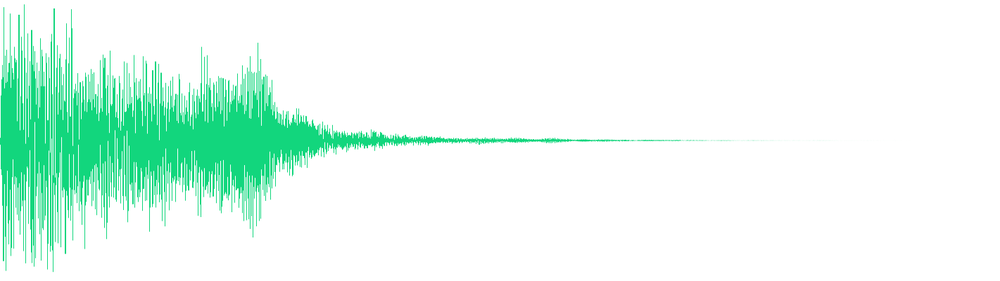
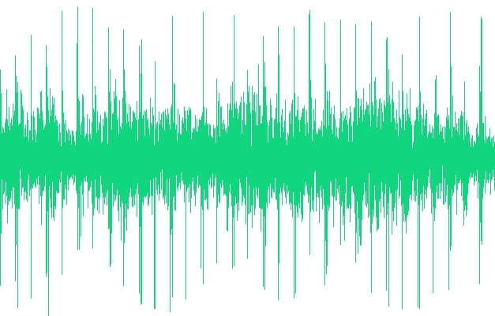
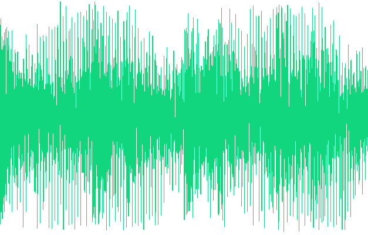
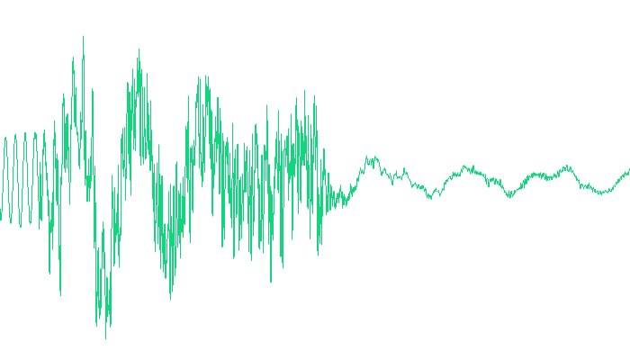
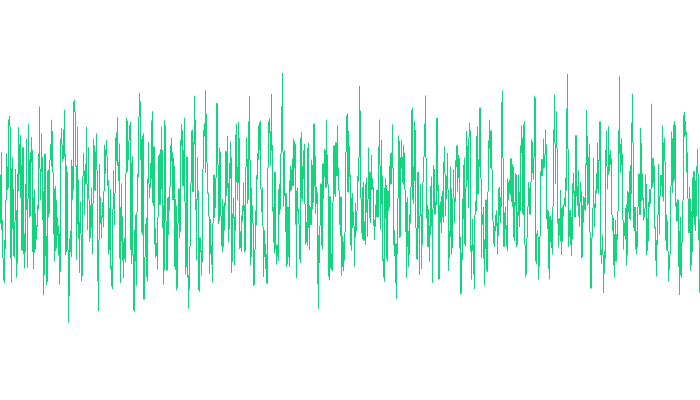
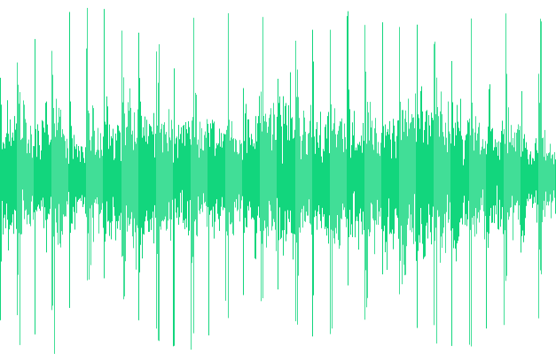
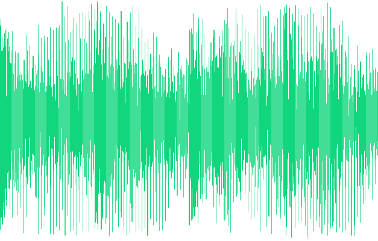
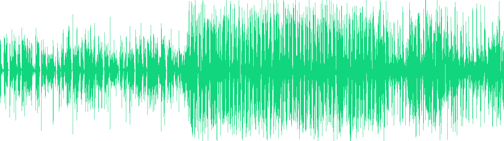
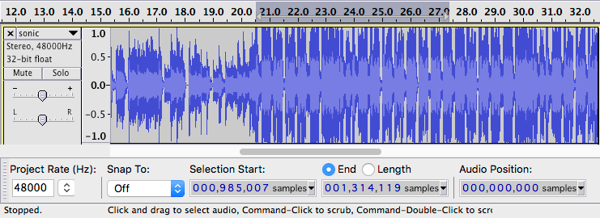

Sounds fun - JakeArchibald.com

# Sounds fun

  Posted 29 November 2016

I played with the [web audio API](https://webaudio.github.io/web-audio-api/) for the first time recently, so I thought I'd write up what I learned. I think that's my job or something.

## Playing a sound

The simplest demonstrable thing we can do with web audio is "play a sound". But to do that, we first we need to load & decode something:

// The context is connected to the device speakers.// You only need one of these per document.const  context  =  new  AudioContext();// Fetch the filefetch('sound.mp4')  // Read it into memory as an arrayBuffer  .then(response  =>  response.arrayBuffer())  // Turn it from mp3/aac/whatever into raw audio data  .then(arrayBuffer  =>  context.decodeAudioData(arrayBuffer))  .then(audioBuffer  =>  {  // Now we're ready to play!  });

Unfortunately we need to work around a few things in Safari. We need to use `webkitAudioContext` - Safari doesn't support the unprefixed version. It doesn't support `fetch` yet (it's [in development](https://webkit.org/status/#specification-fetch-api)) so we'll [need to use XHR](https://gist.github.com/jakearchibald/b7d63a48db6484e1b5701331ed8c7a02)). And `decodeAudioData` doesn't support promises, so we'll [need to polyfill that](https://gist.github.com/jakearchibald/131d7101b134b6f7bed1d8320e4da599).

But once we've got our audio buffer, we can play it:

// Create a source:// This represents a playback head.const  source  =  context.createBufferSource();// Give it the audio data we loaded:source.buffer  =  audioBuffer;// Plug it into the output:source.connect(context.destination);// And off we go!source.start();

Job done!

 

So yeah, it's way more complicated than just using `<audio src="…">` to play a sound, but web audio can do so much more. The amount of control web audio gives you is great fun, but also kinda daunting. In this post I'm just going to scratch the surface, and look at how to loop and queue sounds.

## The Big Web Quiz

At Chrome Dev Summit [Paul](https://twitter.com/aerotwist) & I ran a web-based interactive quiz between talks.

CSS properties on the Big Web Quiz

We tried to make it as ridiculous as possible, and the music was a big part of that. The music was produced by [Plan8](http://plan8.se/), and it only took them a day to compose (we misread the licence on a piece of music we were going to use, so the deadline was *our* fault. Anyway, the music they made is way better). They also have JS libraries for scheduling audio, but hey I was in the mood for some procrastination, so I did it myself.

## Switching between clips

The music in the Big Web Quiz has three phases, and we wanted to switch between them during questions. Using the code above, I loaded three buffers, `phase1AudioBuffer`, `phase2AudioBuffer`, and `stabAudioBuffer`, each representing a different phase of Big Web Quiz's music.

A naive solution is to play phase 1, then later stop it and play phase 2:

const  phase1Source  =  context.createBufferSource();phase1Source.buffer  =  phase1AudioBuffer;phase1Source.connect(context.destination);phase1Source.start();// Then later…const  phase2Source  =  context.createBufferSource();phase2Source.buffer  =  phase2AudioBuffer;phase2Source.connect(context.destination);// Stop phase 1phase1Source.stop();// Start phase 2phase2Source.start();

 

 

 

This doesn't really work. Switching between phases is jarring for a few reasons…

## Sound may not play instantly

Even though we have our audio data loaded in memory, there's still a gap between us calling `start()` and the audio actually playing.

This is fine if you want the sound to play as soon as possible and don't mind if it's a few milliseconds out, such as playing a sound in a game when the player collects a coin, but when syncronising two clips things need to be precise.

To do anything precise with audio, you need to schedule things in advance. Both `start` and `stop` take an optional number, the time to actually start/stop, and `context.currentTime` gives you the current time as far as the audio context is concerned.

How much advance notice you have to give depends on hardware, but [Chris Wilson reliably informs me](https://github.com/WebAudio/web-audio-api/issues/296#issuecomment-257104709) that a quarter of a second is super-safe more-than-enough, even for slow hardware.

So:

const  safetyBuffer  =  0.25;const  switchTime  =  context.currentTime  +  safetyBuffer;phase1Source.stop(switchTime);phase2Source.start(switchTime);

A quarter of a second is a long delay, but in this case syncronisation is more important to us than immediacy.

Note: In the web audio API, time is in seconds, whereas most other web APIs use milliseconds.

But there's another delay to tackle…

## Different decoders are different

Encoding audio down to formats like MP3 or AAC is a lossy process, but you at least get to pick the encoder. When you use `decodeAudioData` you're relying on whatever decoder the browser uses, and this may come as a shock, but sometimes different browsers do things differently.

Here's the start/end of an AAC clip decoded by your browser:

 

 

The original clip is gapless at the start/end, but if you're in Chrome stable, Firefox, or Edge, you'll see a huge gap. By huge I mean 45 milliseconds, but y'know, that's a big deal when we're trying to instantly switch between two clips.

The gap is almost gone in Chrome Canary. Safari on the other hand gets it spot-on, no gap at all.

In the first draft of this article I congratulated Safari on a job well done, but actual expert [Paul Adenot](https://twitter.com/padenot) from Mozilla dropped a few knowledge bombs on me (in a friendly way of course).

The gap at the start is specified by the encoder as metadata. From [Apple's documentation](https://developer.apple.com/library/content/documentation/QuickTime/QTFF/QTFFAppenG/QTFFAppenG.html):

> …encoders add at least 1024 samples of silence before the first ‘true’ audio sample, and often add more. This is called variously “priming”, “priming samples”, or “encoder delay”…

> Therefore, a playback system must trim the silent priming samples to preserve correct synchronization. This trimming by the playback system should be done in two places:

- > When playback first begins
- > When the playback position is moved to another location. For example, the user skips ahead or back to another part of the media and begins playback from that new location.

The question is, should the browser remove the "priming samples" as part of `decodeAudioData`, or are we (as users of the web audio API) the "playback system", meaning we have to deal with it.

I still feel that Safari is doing the right thing here, especially as finding out the number of priming samples from the metadata is really non-trivial. To try and bring some consistency here, [I've filed an issue with the spec](https://github.com/WebAudio/web-audio-api/issues/1091).

In the meantime, we can work around the gap by finding out how long it is:

function  findStartGapDuration(audioBuffer)  {  // Get the raw audio data for the left & right channels.  const  l  =  audioBuffer.getChannelData(0);  const  r  =  audioBuffer.getChannelData(1);  // Each is an array of numbers between -1 and 1 describing  // the waveform, sample by sample.  // Now to figure out how long both channels remain at 0:  for  (let  i  =  0;  i  <  l.length;  i++)  {  if  (l[i]  ||  r[i])  {  // Now we know which sample is non-zero, but we want  // the gap in seconds, not samples. Thankfully sampleRate  // gives us the number of samples per second.  return  i  /  audioBuffer.sampleRate;  }  }  // Hmm, the clip is entirely silent  return  audioBuffer.duration;}

Once we have the gap, we can use source's second parameter to start playback at that point, after the silence:

const  phase1StartGap  =  findStartGapDuration(phase1AudioBuffer);const  phase1Source  =  context.createBufferSource();phase1Source.buffer  =  phase1AudioBuffer;phase1Source.connect(context.destination);// Cater for the gap:phase1Source.start(context.currentTime  +  safetyBuffer,  phase1StartGap);// Then later…const  phase2StartGap  =  findStartGapDuration(phase2AudioBuffer);const  phase2Source  =  context.createBufferSource();phase2Source.buffer  =  phase2AudioBuffer;phase2Source.connect(context.destination);const  switchTime  =  context.currentTime  +  safetyBuffer;// Stop phase 1phase1Source.stop(switchTime);// Start phase 2phase2Source.start(switchTime,  phase2StartGap);

And here's the result:

 

 

 

Better, but not perfect. Depending on when you press the button, the switch from phase 2 to the end stab can feel mistimed, but we can fix that…

## Musically-aware scheduling

Ideally we want the phases to switch right at the end of a musical bar. Phase 1 is 110bpm, and phase 2 is 123bpm, so we can figure out the duration of each bar:

function  getBarDuration(bpm,  beatsPerBar)  {  return  60  /  bpm  *  beatsPerBar;}const  phase1BarDuration  =  getBarDuration(110,  4);  const  phase2BarDuration  =  getBarDuration(123,  4);

We want to switch the phases at the end of the next bar, unless that's less than our `safetyBuffer`, in which case we want to switch at the end of the following bar.

function  getPhaseSwitchTime(currentTime,  phaseStartTime,  barDuration)  {  // How long the phase has been playing:  const  phasePlaybackPosition  =  currentTime  -  phaseStartTime;  // How long has it been playing the current bar:  const  positionWithinBar  =  phasePlaybackPosition  %  barDuration;  // How long until the next bar:  let  untilSwitch  =  barDuration  -  positionWithinBar;  // If it's less than our safetyBuffer, add another bar:  if  (untilSwitch  <  safetyBuffer)  untilSwitch  +=  barDuration;  // Add on the current time:  return  untilSwitch  +  currentTime;}

Unfortunately the web audio API doesn't tell us the current playblack position of a source ([it might eventually](https://github.com/WebAudio/web-audio-api/issues/296)), so we have to track that ourselves:

const  phase1StartTime  =  context.currentTime  +  safetyBuffer;  phase1Source.start(phase1StartTime,  phase1StartGap);// Then later…const  phase2StartTime  =  getPhaseSwitchTime(context.currentTime,  phase1StartTime,  phase1BarDuration);phase1Source.stop(phase2StartTime);phase2Source.start(phase2StartTime,  phase2StartGap);

Job done! Here it is:

 

 

 

Sometimes switching between clips can cause a click if the samples don't join at a zero value. If you get this, you can use a [gain node](https://developer.mozilla.org/en-US/docs/Web/API/GainNode) to create a really short, imperceptible, fade-out and fade-in.

## Dynamic looping

Switching multiple clips isn't the only way to create multi-phase audio. BEHOLD[:](https://twitter.com/philhawksworth/status/802302348991176705)

 

Credit: [Sonic 2, chemical plant zone, Protostar remix](https://soundcloud.com/psdub/sonic-chemical-plant-zone).

This is a single source that loops, but the loop-points change dynamically. Compared to what we've done already, looping a clip is pretty simple:

// Cater for buggy AAC decoders as before:const  sonicStartGap  =  findStartGapDuration(sonicAudioBuffer);// Create the source:const  sonicSource  =  context.createBufferSource();sonicSource.buffer  =  sonicAudioBuffer;sonicSource.connect(context.destination);// Loop it!sonicSource.loop  =  true;// Set loop points:sonicSource.loopStart  =  loopStartTime  +  sonicStartGap;sonicSource.loopEnd  =  loopEndTime  +  sonicStartGap;// Play!sonicSource.start(0,  sonicStartGap);

And changing those loop points is just…

sonicSource.loopStart  =  anotherLoopStartTime  +  sonicStartGap;sonicSource.loopEnd  =  anotherLoopEndTime  +  sonicStartGap;

Although discovering the loop points is easier said than done.

## Finding the loop points

Tools like [Audacity](http://www.audacityteam.org/) (free) and [Adobe Audition](https://www.adobe.com/Audition) (not so free) are great for chopping and looping audio.

Once we've found the loop points, we need to find the *sample* they start & end on. This is the most accurate measurement we'll get.

 
Selecting by sample in Audacity

const  loopPoints  =  [  {start:  328948,  end:  656828},  {start:  985007,  end:  1314119},  {start:  1643272,  end:  1972421},  {start:  1972421,  end:  2137288},];

But `loopStart` and `loopEnd` want the time in seconds, so we convert them:

const  loopPointTimes  =  loopPoints.map(loop  =>  ({  start:  loop.start  /  48000  +  sonicStartGap,  end:  loop.end  /  48000  +  sonicStartGap}));

`48000` needs to be replaced with the sample rate of the clip as viewed in Audacity. Don't do what I did & use `buffer.sampleRate`, as the decoded sample rate can be different to the sample rate of the file. Audio is decoded to `context.sampleRate`, which is 44,100 on my mac, but 48,000 on my phone.

## Looping back to an earlier point

At the end of the demo above, the clip loops back to an earlier point. Unfortunately, if you set `loopEnd` to a point earlier than the current playback point, it immediately goes back to `loopStart`, whereas we want it to play through to the end, *then* go back to an earlier loop.

The least hacky way to do this would be to stop `sonicSource` looping, and queue up a new `sonicSource2` to start looping once `sonicSource` reaches its natural finish.

However, to do this, we'd need to know the current playback position of `sonicSource`, and as I mentioned earlier, this [feature hasn't landed yet](https://github.com/WebAudio/web-audio-api/issues/296). We can't even reliably work around this - the source has been looping all over the place, and we can't be sure each write to `loopStart` and `loopEnd` made it to the sound card in time. I'm hacking it for the purposes of the visualisations above, but it isn't accurate enough for sound.

To work around this we make two changes to the loop. We loop from the start of the earlier loop, right to the end of the clip. Then, once the clip has played past the end, we change `loopEnd` to the end of the earlier loop.

// Current loop startconst  currentLoopStart  =  sonicSource.loopStart;  // The earlier loop we want to move to.const  targetLoop  =  loopPointTimes[1];// The point we want to reach before looping back.// sonicSource.duration is not good enough here, due to// the AAC decoding bug mentioned earlier.const  endSample  =  658624;const  endTime  =  endSample  /  48000  +  sonicStartGap;// Play to the end, then loop back to the start:sonicSource.loopStart  =  targetLoop.start;sonicSource.loopEnd  =  endTime;// But once it's gone back to loopStart, we don't want// it to play all the way to loopEnd, we want targetLoop.end.// Hack time!setTimeout(()  =>  {  sonicSource.loopEnd  =  targetLoop.end;},  (endTime  -  currentLoopStart)  *  1000);

`endTime - currentLoopStart` is the maximum time the clip could play before it loops back to `targetLoop.start`, after that it's safe to move the end point. Done!

While the web audio API isn't something you'll use in every project, it's suprisingly powerful and fun. If you're wanting to dig a little deeper, I recommend this [multi-part guide](http://teropa.info/blog/2016/08/19/what-is-the-web-audio-api.html) by [Tero Parviainen](https://twitter.com/teropa).

Speaking of procrastination, I really should be getting back to the service worker spec…

Huge thanks to [Paul Adenot](https://twitter.com/padenot), [Stuart Memo](https://twitter.com/stuartmemo), [Chris Wilson](https://twitter.com/cwilso), and [Jen Ross](https://twitter.com/jenross83) for proof-reading and fact-checking.