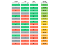
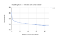
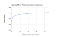

Spaced Repetition for All: Cognitive Science Meets Big Data in a Procrastinating World

# Spaced Repetition for All: Cognitive Science Meets Big Data in a Procrastinating World

Here at Quizlet, our goal is to help students practice and master whatever they’re learning — and to do it as efficiently as possible. Research shows that the most effective way to learn involves spreading study out over a long period of time and reviewing terms with longer and longer delays each time, a process known as [spaced repetition](https://en.wikipedia.org/wiki/Spaced_repetition). However, students don’t always have the luxury of spending days or weeks repeatedly reviewing material. They’ve got a test tomorrow, and they need to learn the material ***now***. So our challenge is: How can we present learning material so students are always focusing on whatever they need to work on the most?

With that goal in mind, we set out to build a brand new framework for choosing and ordering terms to study on Quizlet. We call it the Learning Assistant Platform. It powers the new Learn, which [launches today](https://quizlet.com/blog/introducing-the-new-quizlet-learn) on iOS, and soon on Android and Web! We aim to have this algorithm drive the question selection for many of the learning experiences on Quizlet.

### Existing Solutions

#### Classic Quizlet Learn

The original Quizlet Learn had a very simple algorithm: Answer one question for every term, repeat all the questions you got wrong, and continue until you’ve gotten each question correct. This is a great start, but it’s usually not enough to be ready for a test. We took a look at a small sample of all the answers on Quizlet and saw that after getting a term correct on the first try, once a user sees it a second time (whenever that may be), there’s only about an 87% chance they’ll get it right. And if it took a few tries to get right, that number drops much lower: below 70%. Students could keep studying by restarting Learn from the beginning, but now they’re spending a lot of time re-studying terms they already know fairly well instead of focusing on the ones that need more work. That’s not the most efficient use of time, and we knew we could improve on that.

#### Long-Term Learning

About a year ago, Quizlet launched [Long-Term Learning](https://quizlet.com/help/2444098/long-term-learning). Long-Term Learning uses a standard spaced repetition algorithm, similar to [SuperMemo](https://en.wikipedia.org/wiki/SuperMemo) or [Anki](https://en.wikipedia.org/wiki/Anki_%28software%29). It works something like this:

- Introduce a few new terms each day
- Study all of the day’s terms until you get them all correct, then study the new terms again the next day
- Each time a term is answered correctly, increase the delay until it’s studied again by a little more than double (Study 1 day later, 3 days after that, then 7 days, 16 days, etc.)
- If a term is answered incorrectly, start over and reset the delay for that term to 1 day

Long-Term Learning works great when there’s no particular deadline for when a student needs to finish learning the material. By deferring review of each term until just as it’s about to be forgotten, Long-Term Learning minimizes the effort needed to commit the terms to long-term memory. However, it won’t allow students to study all their terms in a single day, nor to review a term after they’ve already studied it in a given day.

This is great for the students who have long-term study goals. However, the majority of Quizlet users only study a set on a single day; 95% study a set over four days at most, which is still too few for the Long-Term Learning algorithm to be effective. Cramming is a reality for many students, and we want to help them make the best of their study time however they spend it.

### Our Approach

A key idea behind spaced repetition is that a student should always study a term just before they’re about to forget it, when there’s about an 80% chance to get the answer correct. But at Quizlet we can’t wait long enough for students to *almost* forget some terms. Many students don’t have the time, and even if they did, we wouldn’t want them going into a test with only an 81% chance of getting the answers right! So instead, our new Learning Assistant algorithm prioritizes the terms we think students are *closest* to forgetting, the terms we think the student is least likely to get correct. So every question a student sees is always on one of the few terms that need the most work, and within that framework, we can build a term scheduling algorithm that works well for *any* time scale.

So how do we know which terms a student is most likely to forget? That’s where machine learning comes into play. Quizlet has tens of millions of users who have submitted tens of *billions*of answers on billions of terms. For each user’s answer, we know which term they were studying, what time they answered it, and whether they got the question correct or incorrect.

We started by sampling a small subset of about 1.5 million answers from our database and grouped them into streaks for each user, on each term. Then we looked for patterns that correlate with higher or lower recall probability — a user’s chance to answer a term correctly at a given time. Finally, we were able to use that model in our new Learning Assistant algorithm to predict recall probability and prioritize the lowest scored terms.

### Identifying the Features

Any machine learning algorithm must start by identifying “features”: Pieces of information from which the algorithm can learn to make predictions. Our algorithm has four main features we use to predict recall probability:

- Correctness of answers
- Time since last answer
- Time between previous answers
- Direction of study

#### Answer Correctness

Three answers, two incorrect, and one correct

Unsurprisingly, the single strongest predictor of whether the next question will be answered correctly is whether or not the most recent answer for the term was correct. But whether or not older answers were correct is also very important. The farther back the answer was, the less it influences the chances of getting the upcoming question correct. Two wrong answers followed by a correct answer is very different from a correct answer followed by two wrong answers.

Recall probability for all possible answer sequences up to three deep

This feature is the key to allowing us to determine what terms need to be reviewed the most, even if they were all studied very recently.

#### Forgetting Curve: Time Since Last Question

Three answers, some time ago

The longer it’s been since a student saw a term, the less likely they are to remember it. This is known to follow an exponential decay function, called the [forgetting curve](https://en.wikipedia.org/wiki/Forgetting_curve). The forgetting curve is one of two key cognitive science principles that inform the design of all spaced repetition algorithms. Here’s our model of the forgetting curve for a typical case:

Our predictions of recall probability will decay over time as the student starts to forget a term, leading us to prioritize terms that haven’t been studied recently.

#### Spacing Effect: Time Between Previous Questions

Three answers, with some delay between the most recent two

The more a student spaces out their study, the better they’ll remember the material. This is known as the [spacing effect](https://en.wikipedia.org/wiki/Spacing_effect). This is another cognitive science principle behind the idea of spaced repetition. We measure the time between the previous two answers, and like the forgetting curve, we assume an exponential relationship.

If students space their study out over longer periods of time, as opposed to cramming in a single sitting, we’ll expect them to remember the terms better, and won’t need to ask them to study the terms as many times.

#### **Study Direction**

Just because a student can remember the English definition for a Spanish word doesn’t necessarily mean they’ll be able to remember the Spanish word when given the English definition. We treat each direction you can study a term as separate but related facts. If a student only studies a term in one direction, they’ll be less likely to get that term correct in the other direction.

As a result, we tend to ask the question side the student has seen and gotten correct less often, making sure the student learns the term front and back!

### The Model

Finally, with all these features derived from over a million answers, we trained a machine learning model to predict recall probability using [logistic regression](https://en.wikipedia.org/wiki/Logistic_regression). Logistic regression finds an equation that takes each of the features as an input and returns a number between 0 and 1. For us, 0 represents an incorrect answer and 1 represents a correct answer. Logistic regression attempts to minimize the error between the predictions it generates and the actual observed results. We can interpret these predictions as recall probability, which then we use to determine the best ordering of questions.

Our model performed pretty well! A standard approach for evaluating a model like this is the [AUROC](https://en.wikipedia.org/wiki/Receiver_operating_characteristic#Area_under_the_curve) metric. A value of 1 would indicate perfect predictions, and 0.5 would indicate random guessing. Our AUROC was 0.815, which is pretty good. Because we know our predictions are fairly accurate, we can be confident that the lowest scored terms really are the ones that need the most work.

While there are other, more sophisticated machine learning algorithms available, we chose logistic regression for two reasons: First, it produces a very simple, easy to interpret model, allowing us to understand and quantify how these variables affect learning. Second, and more important for us, is model portability. Quizlet is used in many different environments around the world — on the road, in developing countries, and in schools with limited network capacity. Our goal is to make quality learning tools accessible to *every* student, so robust offline support in our mobile apps is a priority. Logistic regression produces a simple equation that we can transcribe to a [JavaScript module](https://quizlet.com/blog/comparison-shopping-searching-for-javascript-engines-forandroid) that we can use on the website and compile into both the iOS and Android apps, putting the power of machine learning in your pocket!

### Future Improvements

Now that we’ve launched this for new Learn, we’re excited to see the results and improve on them. Within this framework, there’s a lot more we can do to make the algorithm even better! Here’s some of the ideas we have in mind:

#### Better modeling of different question types

Before now, Quizlet hasn’t had a learning experience with the mix of question types we have in the new Learn (which includes multiple choice, self-assessment flashcards, and others). We trained our model on old Learn, which includes only written questions, so it isn’t able to capture the fact that multiple choice questions are easier than written questions, for example. Once we develop a model for the new question types, we’ll be able to quantify how well studying with each question type prepares a student to answer written questions.

#### Measuring inherent difficulty of terms

Some terms are just going to be harder than others, regardless of how they’re studied or who’s studying them. For example, one might expect words with irregular spellings to be more difficult to remember. We can look at each word that’s commonly studied on Quizlet, measure how often users get it correct, and use that to make better term ordering decisions, even for people who haven’t started studying the material.

#### Improving behavior over longer periods of time

Because our algorithm is based on the principles of spaced repetition, it should in theory behave like other spaced repetition algorithms and, over the course of many days, introduce longer and longer delays between each time a term is studied. However, in practice, because we assumed a simple exponential decay forgetting curve and trained our model on a random sample of Quizlet data which is heavily biased towards time ranges of under a couple days, our model isn’t very sensitive to time changes over longer periods of time. But we can address that by sampling our data to include more long-term study behavior, and by modelling the time components more flexibly (not assuming a strict exponential relationship). That will allow us to build an algorithm that works great whether a student crams studying ten terms the night before a test, or spends years studying thousands of terms.

### Moving Forward

The Quizlet Learning Assistant Platform paves the way forward for more intelligent and efficient learning on Quizlet. The classic Learn algorithm is simple but not efficient, and the Long-Term Learning algorithm only works well for students without deadlines. By using machine learning to build a predictive model informed by the same cognitive science theories behind spaced repetition, we were able to build an algorithm that makes studying efficient and practical for all our users. We’re excited to launch this as part of the [new Learn](https://quizlet.com/blog/introducing-the-new-quizlet-learn), and we’re looking forward to continuing to improve it in the future!