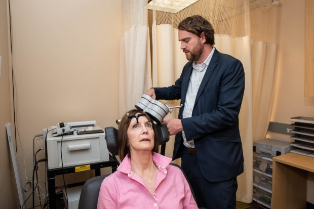

Stanford researchers devise treatment that relieved depression in 90% of participants in small study | News Center | Stanford Medicine

 [** Email  **](http://med.stanford.edu/news/all-news/2020/04/stanford-researchers-devise-treatment-that-relieved-depression-i.htmlmailto:?subject=Stanford%20researchers%20devise%20treatment%20that%20relieved%20depression%20in%2090%%20of%20participants%20in%20small%20study&body=http://med.stanford.edu/news/all-news/2020/04/stanford-researchers-devise-treatment-that-relieved-depression-i.html)

[(L)](https://www.facebook.com/sharer/sharer.php?kid_directed_site=0&sdk=joey&u=https%3A%2F%2Fmed.stanford.edu%2Fcontent%2Fsm%2Fnews%2Fall-news%2F2020%2F04%2Fstanford-researchers-devise-treatment-that-relieved-depression-i.html&display=popup&ref=plugin&src=share_button)

[**Tweet](https://twitter.com/intent/tweet?original_referer=http%3A%2F%2Fmed.stanford.edu%2Fnews%2Fall-news%2F2020%2F04%2Fstanford-researchers-devise-treatment-that-relieved-depression-i.html&ref_src=twsrc%5Etfw&text=Stanford%20researchers%20devise%20treatment%20that%20relieved%20depression%20in%2090%25%20of%20participants%20in%20small%20study&tw_p=tweetbutton&url=http%3A%2F%2Fmed.stanford.edu%2Fnews%2Fall-news%2F2020%2F04%2Fstanford-researchers-devise-treatment-that-relieved-depression-i.html)

# Stanford researchers devise treatment that relieved depression in 90% of participants in small study

Stanford Medicine researchers used high doses of magnetic stimulation, delivered on an accelerated timeline and targeted to individual neurocircuitry, to treat patients with severe depression.

 Apr 6  2020

Deirdre Lehman, who suffered from depression, with Nolan Williams, who oversaw a clinical trial of a potential treatment that uses transcranial magnetic stimulation. In this photo, Williams and Lehman demonstrate how a patient is positioned and the equipment is used during the treatment.

*Steve Fisch*

A new form of magnetic brain stimulation rapidly relieved symptoms of severe depression in 90% of participants in a small study conducted by researchers at the [Stanford University School of Medicine](https://med.stanford.edu/).

The researchers are conducting a larger, double-blinded trial in which half the participants are receiving fake treatment. The researchers are optimistic the second trial will prove to be similarly effective in treating people whose condition hasn’t improved with medication, talk therapy or other forms of electromagnetic stimulation.

The treatment is called Stanford Accelerated Intelligent Neuromodulation Therapy, or SAINT. It is a form of transcranial magnetic stimulation, which is approved by the Food and Drug Administration for treatment of depression. The researchers reported that the therapy improves on current FDA-approved protocols by increasing the number of magnetic pulses, speeding up the pace of the treatment and targeting the pulses according to each individual’s neurocircuitry.

Before undergoing the therapy, all 21 study participants were severely depressed, according to several diagnostic tests for depression. Afterward, 19 of them scored within the nondepressed range. Although all of the participants had suicidal thoughts before the therapy, none of them reported having suicidal thoughts after treatment. All 21 participants had previously not experienced improvements with medications, FDA-approved transcranial magnetic stimulation or electroconvulsive therapy.

The only side effects of the new therapy were fatigue and some discomfort during treatment, the study reported. The [results](https://ajp.psychiatryonline.org/doi/10.1176/appi.ajp.2019.19070720) were published online April 6 in the* American Journal of Psychiatry.*

“There’s never been a therapy for treatment-resistant depression that’s broken 55% remission rates in open-label testing,” said [Nolan Williams](https://med.stanford.edu/profiles/nolan-williams), MD, assistant professor of psychiatry and behavioral sciences and a senior author of the study. “Electroconvulsive therapy is thought to be the gold standard, but it has only an average 48% remission rate in treatment-resistant depression. No one expected these kinds of results.”

### Calming the brain chatter

When Deirdre Lehman, 60, woke up the morning of June 30, 2018, she said she was hit by “a tsunami of darkness.” Lehman had struggled with bipolar disorder all her adult life, but with medications and psychotherapy her mood had been stable for 15 years.

After undergoing the experimental treatment, Lehman's depression dissipated. She has since completed a bachelor’s degree at the University of California-Santa Barbara, where she had dropped out as a young woman when her bipolar symptoms overwhelmed her studies.

*Steve Fisch*

“There was a constant chattering in my brain: It was my own voice talking about depression, agony, hopelessness,” she said. “I told my husband, ‘I’m going down and I’m heading toward suicide.’ There seemed to be no other option.”

Lehman’s psychiatrist had heard of the SAINT study and referred her to Stanford. After researchers pinpointed the spot in her brain that would benefit from stimulation, Lehman underwent the therapy.

“By the third round, the chatter started to ease,” she said. “By lunch, I could look my husband in the eye. With each session, the chatter got less and less until it was completely quiet.

“That was the most peace there’s been in my brain since I was 16 and started down the path to bipolar disorder.”

In transcranial magnetic stimulation, electric currents from a magnetic coil placed on the scalp excite a region of the brain implicated in depression. The treatment, as approved by the FDA, requires six weeks of once-daily sessions. Only about half of patients who undergo this treatment improve, and only about a third experience remission from depression.

Stanford researchers hypothesized that some modifications to transcranial magnetic stimulation could improve its effectiveness. Studies had suggested that a stronger dose, of 1,800 pulses per session instead of 600, would be more effective. The researchers were cautiously optimistic of the safety of the treatment, as that dose of stimulation had been used without harm in other forms of brain stimulation for neurological disorders, such as Parkinson’s disease.

Other studies suggested that accelerating the treatment would help relieve patients’ depression more rapidly. With SAINT, study participants underwent 10 sessions per day of 10-minute treatments, with 50-minute breaks in between. After a day of therapy, Lehman’s mood score indicated she was no longer depressed; it took up to five days for other participants. On average, three days of the therapy were enough for participants to have relief from depression.

“The less treatment-resistant participants are, the longer the treatment lasts,” said postdoctoral scholar [Eleanor Cole](https://med.stanford.edu/profiles/eleanor-cole), PhD, a lead author of the study.

### Strengthening a weak connection

The researchers also conjectured that targeting the stimulation more precisely would improve the treatment’s effectiveness. In transcranial magnetic stimulation, the treatment is aimed at the location where most people’s dorsolateral prefrontal cortex lies. This region regulates executive functions, such as selecting appropriate memories and inhibiting inappropriate responses.

For SAINT, the researchers used magnetic-resonance imaging of brain activity to locate not only the dorsolateral prefrontal cortex, but a particular subregion within it. They pinpointed the subregion in each participant that has a relationship with the subgenual cingulate, a part of brain that is overactive in people experiencing depression.

In people who are depressed, the connection between the two regions is weak, and the subgenual cingulate becomes overactive, said [Keith Sudheimer](https://med.stanford.edu/profiles/keith-sudheimer), PhD, clinical assistant professor of psychiatry and a senior author of the study. Stimulating the subregion of the dorsolateral prefrontal cortex reduces activity in the subgenual cingulate, he said.

To test safety, the researchers evaluated the participants’ cognitive function before and after treatment. They found no negative side effects; in fact, they discovered that the participants’ ability to switch between mental tasks and to solve problems had improved — a typical outcome for people who are no longer depressed.

One month after the therapy, 60% of participants were still in remission from depression. Follow-up studies are underway to determine the duration of the antidepressant effects.

The researchers plan to study the effectiveness of SAINT on other conditions, such as obsessive-compulsive disorder, addiction and autism spectrum disorders.

### ‘Resilient and stable’

The depression Lehman woke up to almost two years ago was the worst episode she had ever experienced. Today, she said, she is happy and calm.

Since undergoing SAINT treatment, she has completed a bachelor’s degree at the University of California-Santa Barbara; she had dropped out as a young woman when her bipolar symptoms overwhelmed her studies.

“I used to cry over the slightest thing,” she said. “But when bad things happen now, I’m just resilient and stable. I’m in a much more peaceful state of mind, able to enjoy the positive things in life with the energy to get things done.”

Graduate student Katy Stimpson and [Brandon Bentzley](https://med.stanford.edu/profiles/brandon-bentzley), MD, PhD, a medical fellow in psychiatry and behavioral sciences, are also lead authors.

Other Stanford co-authors are former lab manager Merve Gulser; graduate students Kirsten Cherian, Elizabeth Choi, Haley Aaron and Austin Guerra; [Flint Espil](https://med.stanford.edu/profiles/flint-espil), PhD, clinical assistant professor of psychiatry and behavioral sciences; research coordinators Claudia Tischler, Romina Nejad and Heather Pankow; medical student Jaspreet Pannu; postdoctoral scholars Xiaoqian Xiao, PhD, [James Bishop](https://med.stanford.edu/profiles/james-bishop), PhD, [John Coetzee](https://med.stanford.edu/profiles/208701), PhD, and [Angela Phillips](https://med.stanford.edu/profiles/angela-phillips), PhD; [Hugh Solvason](https://med.stanford.edu/profiles/hugh-solvason), MD, PhD, clinical professor of psychiatry and behavioral sciences; research manager Jessica Hawkins; [Booil Jo](https://med.stanford.edu/profiles/booil-jo), PhD, associate professor of psychiatry and behavioral sciences; [Kristin Raj](https://med.stanford.edu/profiles/kristin-raj), MD, clinical assistant professor of psychiatry and behavioral sciences; [Charles DeBattista](https://med.stanford.edu/profiles/charles-debattista), MD, professor of psychiatry and behavioral sciences; [Jennifer Keller](https://med.stanford.edu/profiles/jennifer-keller), PhD, clinical associate professor of psychiatry and behavioral sciences; and [Alan Schatzberg](https://med.stanford.edu/profiles/alan-schatzberg), MD, professor of psychiatry and behavioral sciences.

The research was supported by Charles R. Schwab, the Marshall and Dee Ann Payne Fund, the Lehman Family Neuromodulation Research Fund, the Still Charitable Fund, the Avy L. and Robert L. Miller Foundation, a Stanford Psychiatry Chairman’s Small Grant, the Stanford CNI Innovation Award, the National Institutes of Health (grants T32035165 and UL1TR001085), the Stanford Medical Scholars Research Scholarship, the NARSAD Young Investigator Award and the Gordie Brookstone Fund.

* * *

- [Press Releases **](http://med.stanford.edu/news/all-news/brands/press.html)

-

By  Mandy Erickson

Mandy Erickson is a science writer in the Office of Communications. Email her at merickso@stanford.edu.

* * *

Stanford Medicine integrates research, medical education and health care at its three institutions - [Stanford University School of Medicine](http://med.stanford.edu/school.html), [Stanford Health Care (formerly Stanford Hospital & Clinics)](http://stanfordhealthcare.org/), and [Lucile Packard Children's Hospital Stanford](http://stanfordchildrens.org/). For more information, please visit the Office of Communication & Public Affairs site at [http://mednews.stanford.edu](http://mednews.stanford.edu/).