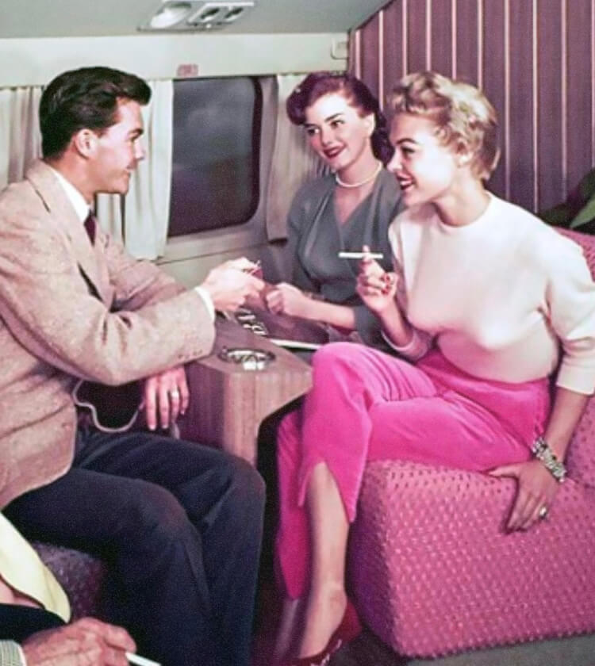
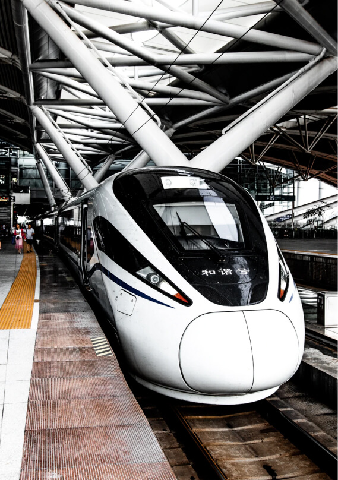
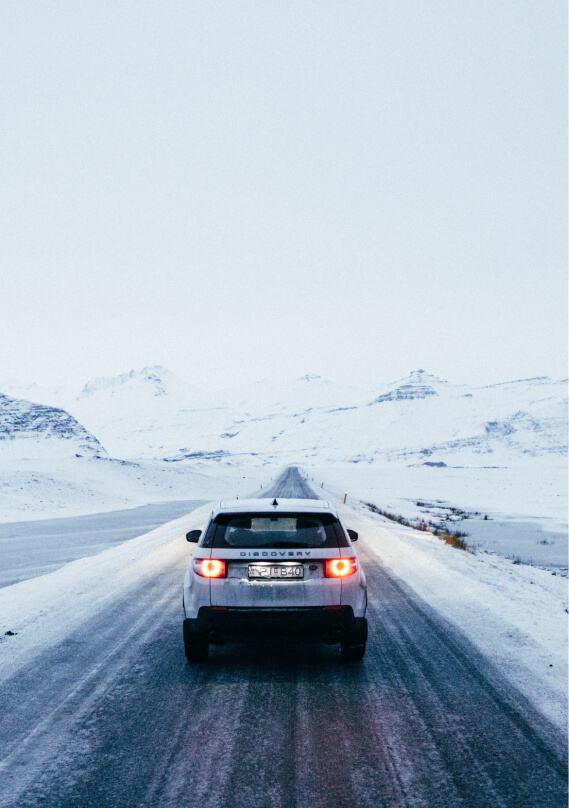
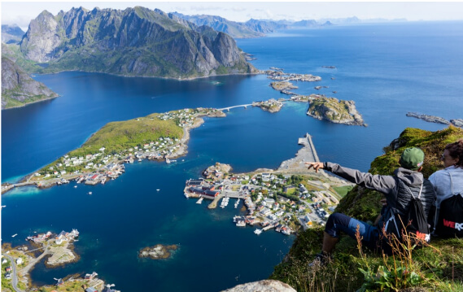
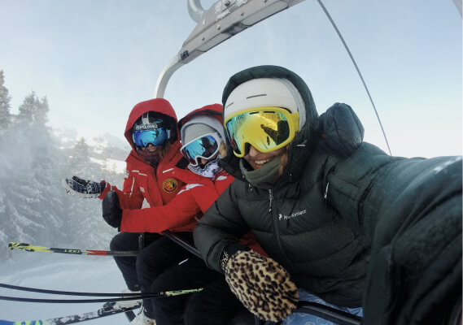
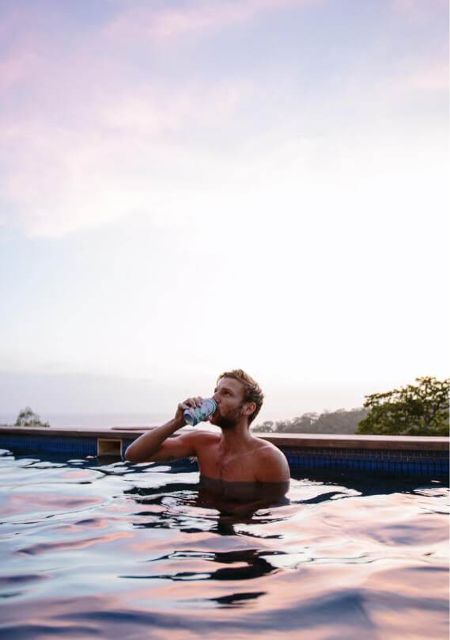

State of Cheap Flights in 2020

A deep dive analysis on how consumers are planning to travel in 2020

# The Golden Age of Cheap Flights

The Golden Age of Flight is associated with the 1950s, when flying was relatively new, seats were large, meals were lavish, and only the wealthy could afford to fly across the country or over the ocean. Although the Golden Age of Flight kicked off 70 years ago, the Golden Age of Cheap Flights is happening right now.

It’s never been cheaper to fly overseas as it is today. For example, in 1948, a roundtrip ticket from NYC to Rome cost $848. That’s nearly $9,000 in today’s dollars. And yet, right now, we regularly see flights from NYC to Rome available for less than $300 roundtrip.

“For example, in 1948, a roundtrip ticket from NYC to Rome cost $848. That’s nearly $9,000 in today’s dollars.”

So what does that mean for travelers? We’ve surveyed 2,000 Scott's Cheap Flights members—and dove deep into our own data—to look at how consumers are traveling now and how things may change in the coming year. In this, our first annual Report on the State of Cheap Flights, we’ll look at how consumers are spending on travel, how they choose flights, where they’re going, and how much they’re spending to get there.

01

# People plan to travel more in 2020.

More than half of respondents said they plan to take more trips in 2020 than they did in 2019. Only 11% said they would take fewer trips this year. For the majority of people, that means taking 2-3 international trips in 2020.

%3b' data-evernote-id='226' class='js-evernote-checked'%3e%3cdefs data-evernote-id='494' class='js-evernote-checked'%3e%3cclipPath id='__lottie_element_7' data-evernote-id='495' class='js-evernote-checked'%3e%3crect width='220' height='126' x='0' y='0' data-evernote-id='496' class='js-evernote-checked'%3e%3c/rect%3e%3c/clipPath%3e%3cmask id='__lottie_element_14' mask-type='alpha' data-evernote-id='497' class='js-evernote-checked'%3e%3cg transform='matrix(1%2c0%2c0%2c1%2c-1.311004638671875%2c0.1439971923828125)' opacity='1' style='display: block%3b' data-evernote-id='498' class='js-evernote-checked'%3e%3cg opacity='1' transform='matrix(1%2c0%2c0%2c1%2c111.31099700927734%2c63.053001403808594)' data-evernote-id='499' class='js-evernote-checked'%3e%3cpath fill='rgb(232%2c235%2c247)' fill-opacity='1' d=' M-109.08300018310547%2c54.025001525878906 C-111.06199645996094%2c56.14400100708008 -109.63800048828125%2c59.606998443603516 -106.74099731445312%2c59.72100067138672 C-106.74099731445312%2c59.72100067138672 -28.660999298095703%2c62.79600143432617 -28.660999298095703%2c62.79600143432617 C-28.660999298095703%2c62.79600143432617 -28.66200065612793%2c62.803001403808594 -28.66200065612793%2c62.803001403808594 C-28.66200065612793%2c62.803001403808594 -28.549999237060547%2c62.79999923706055 -28.549999237060547%2c62.79999923706055 C-28.549999237060547%2c62.79999923706055 -28.485000610351562%2c62.803001403808594 -28.485000610351562%2c62.803001403808594 C-28.485000610351562%2c62.803001403808594 -28.483999252319336%2c62.79899978637695 -28.483999252319336%2c62.79899978637695 C-28.483999252319336%2c62.79899978637695 106.59600067138672%2c59.608001708984375 106.59600067138672%2c59.608001708984375 C109.51899719238281%2c59.540000915527344 110.98799896240234%2c56.04800033569336 108.99299621582031%2c53.9119987487793 C108.99299621582031%2c53.9119987487793 0.00800000037997961%2c-62.803001403808594 0.00800000037997961%2c-62.803001403808594 C0.00800000037997961%2c-62.803001403808594 -0.3050000071525574%2c-61.43000030517578 -0.3050000071525574%2c-61.43000030517578 C-0.3050000071525574%2c-61.43000030517578 0.007000000216066837%2c-62.803001403808594 0.007000000216066837%2c-62.803001403808594 C0.007000000216066837%2c-62.803001403808594 -109.08300018310547%2c54.025001525878906 -109.08300018310547%2c54.025001525878906z' data-evernote-id='500' class='js-evernote-checked'%3e%3c/path%3e%3c/g%3e%3c/g%3e%3c/mask%3e%3c/defs%3e%3cg clip-path='url(%23__lottie_element_7)' data-evernote-id='501' class='js-evernote-checked'%3e%3cg transform='matrix(1%2c0%2c0%2c1%2c-1.311004638671875%2c0.1439971923828125)' opacity='1' style='display: block%3b' data-evernote-id='502' class='js-evernote-checked'%3e%3cg opacity='1' transform='matrix(1%2c0%2c0%2c1%2c111.31099700927734%2c63.053001403808594)' data-evernote-id='503' class='js-evernote-checked'%3e%3cpath fill='rgb(232%2c235%2c247)' fill-opacity='1' d=' M-109.08300018310547%2c54.025001525878906 C-111.06199645996094%2c56.14400100708008 -109.63800048828125%2c59.606998443603516 -106.74099731445312%2c59.72100067138672 C-106.74099731445312%2c59.72100067138672 -28.660999298095703%2c62.79600143432617 -28.660999298095703%2c62.79600143432617 C-28.660999298095703%2c62.79600143432617 -28.66200065612793%2c62.803001403808594 -28.66200065612793%2c62.803001403808594 C-28.66200065612793%2c62.803001403808594 -28.549999237060547%2c62.79999923706055 -28.549999237060547%2c62.79999923706055 C-28.549999237060547%2c62.79999923706055 -28.485000610351562%2c62.803001403808594 -28.485000610351562%2c62.803001403808594 C-28.485000610351562%2c62.803001403808594 -28.483999252319336%2c62.79899978637695 -28.483999252319336%2c62.79899978637695 C-28.483999252319336%2c62.79899978637695 106.59600067138672%2c59.608001708984375 106.59600067138672%2c59.608001708984375 C109.51899719238281%2c59.540000915527344 110.98799896240234%2c56.04800033569336 108.99299621582031%2c53.9119987487793 C108.99299621582031%2c53.9119987487793 0.00800000037997961%2c-62.803001403808594 0.00800000037997961%2c-62.803001403808594 C0.00800000037997961%2c-62.803001403808594 -0.3050000071525574%2c-61.43000030517578 -0.3050000071525574%2c-61.43000030517578 C-0.3050000071525574%2c-61.43000030517578 0.007000000216066837%2c-62.803001403808594 0.007000000216066837%2c-62.803001403808594 C0.007000000216066837%2c-62.803001403808594 -109.08300018310547%2c54.025001525878906 -109.08300018310547%2c54.025001525878906z' data-evernote-id='504' class='js-evernote-checked'%3e%3c/path%3e%3c/g%3e%3c/g%3e%3cg mask='url(%23__lottie_element_14)' style='display: block%3b' data-evernote-id='505' class='js-evernote-checked'%3e%3cg transform='matrix(1%2c0%2c0%2c1%2c141.26100158691406%2c81.9020004272461)' opacity='1' data-evernote-id='506' class='js-evernote-checked'%3e%3cg opacity='1' transform='matrix(1.4164100885391235%2c0%2c0%2c1.6379189491271973%2c-31.172000885009766%2c15.43246078491211)' data-evernote-id='507' class='js-evernote-checked'%3e%3cpath fill='rgb(55%2c87%2c224)' fill-opacity='1' d=' M79.93199920654297%2c-18.04599952697754 C79.93199920654297%2c-18.04599952697754 79.93199920654297%2c18.04599952697754 79.93199920654297%2c18.04599952697754 C79.93199920654297%2c18.04599952697754 -79.93199920654297%2c18.04599952697754 -79.93199920654297%2c18.04599952697754 C-79.93199920654297%2c18.04599952697754 -79.93199920654297%2c-18.04599952697754 -79.93199920654297%2c-18.04599952697754 C-79.93199920654297%2c-18.04599952697754 79.93199920654297%2c-18.04599952697754 79.93199920654297%2c-18.04599952697754z' data-evernote-id='508' class='js-evernote-checked'%3e%3c/path%3e%3cpath stroke-linecap='butt' stroke-linejoin='miter' fill-opacity='0' stroke-miterlimit='4' stroke='rgb(255%2c255%2c255)' stroke-opacity='1' stroke-width='0' d=' M79.93199920654297%2c-18.04599952697754 C79.93199920654297%2c-18.04599952697754 79.93199920654297%2c18.04599952697754 79.93199920654297%2c18.04599952697754 C79.93199920654297%2c18.04599952697754 -79.93199920654297%2c18.04599952697754 -79.93199920654297%2c18.04599952697754 C-79.93199920654297%2c18.04599952697754 -79.93199920654297%2c-18.04599952697754 -79.93199920654297%2c-18.04599952697754 C-79.93199920654297%2c-18.04599952697754 79.93199920654297%2c-18.04599952697754 79.93199920654297%2c-18.04599952697754z' data-evernote-id='509' class='js-evernote-checked'%3e%3c/path%3e%3c/g%3e%3c/g%3e%3c/g%3e%3cg transform='matrix(1%2c0%2c0%2c1%2c81.22300720214844%2c0.14500045776367188)' opacity='1' style='display: block%3b' data-evernote-id='510' class='js-evernote-checked'%3e%3cg opacity='1' transform='matrix(1%2c0%2c0%2c1%2c28.784000396728516%2c19.461999893188477)' data-evernote-id='511' class='js-evernote-checked'%3e%3cpath fill='rgb(247%2c248%2c251)' fill-opacity='1' d=' M-28.534000396728516%2c11.527000427246094 C-28.534000396728516%2c11.527000427246094 -8.260000228881836%2c6.40500020980835 -8.260000228881836%2c6.40500020980835 C-8.260000228881836%2c6.40500020980835 -8.260000228881836%2c19.21299934387207 -8.260000228881836%2c19.21299934387207 C-8.260000228881836%2c19.21299934387207 2.253000020980835%2c6.40500020980835 2.253000020980835%2c6.40500020980835 C2.253000020980835%2c6.40500020980835 28.534000396728516%2c11.527000427246094 28.534000396728516%2c11.527000427246094 C28.534000396728516%2c11.527000427246094 0.0010000000474974513%2c-19.21299934387207 0.0010000000474974513%2c-19.21299934387207 C0.0010000000474974513%2c-19.21299934387207 -28.534000396728516%2c11.527000427246094 -28.534000396728516%2c11.527000427246094z' data-evernote-id='512' class='js-evernote-checked'%3e%3c/path%3e%3c/g%3e%3c/g%3e%3cg transform='matrix(1%2c0%2c0%2c1%2c80.9990005493164%2c0)' opacity='0.13' style='display: block%3b' data-evernote-id='513' class='js-evernote-checked'%3e%3cg opacity='1' transform='matrix(1%2c0%2c0%2c1%2c69.26399993896484%2c63)' data-evernote-id='514' class='js-evernote-checked'%3e%3cpath fill='rgb(21%2c26%2c51)' fill-opacity='1' d=' M65.94300079345703%2c60.117000579833984 C68.86399841308594%2c60.05500030517578 70.33999633789062%2c56.57099914550781 68.3550033569336%2c54.428001403808594 C68.3550033569336%2c54.428001403808594 -40.47999954223633%2c-63 -40.47999954223633%2c-63 C-40.47999954223633%2c-63 -69.26399993896484%2c63 -69.26399993896484%2c63 C-69.26399993896484%2c63 65.94300079345703%2c60.117000579833984 65.94300079345703%2c60.117000579833984z' data-evernote-id='515' class='js-evernote-checked'%3e%3c/path%3e%3c/g%3e%3c/g%3e%3c/g%3e%3c/svg%3e)

50%
Said “I’ll take more trips in 2020”

%3b' data-evernote-id='227' class='js-evernote-checked'%3e%3cdefs data-evernote-id='520' class='js-evernote-checked'%3e%3cclipPath id='__lottie_element_43' data-evernote-id='521' class='js-evernote-checked'%3e%3crect width='220' height='126' x='0' y='0' data-evernote-id='522' class='js-evernote-checked'%3e%3c/rect%3e%3c/clipPath%3e%3cmask id='__lottie_element_50' mask-type='alpha' data-evernote-id='523' class='js-evernote-checked'%3e%3cg transform='matrix(1%2c0%2c0%2c1%2c-1.311004638671875%2c0.1439971923828125)' opacity='1' style='display: block%3b' data-evernote-id='524' class='js-evernote-checked'%3e%3cg opacity='1' transform='matrix(1%2c0%2c0%2c1%2c111.31099700927734%2c63.053001403808594)' data-evernote-id='525' class='js-evernote-checked'%3e%3cpath fill='rgb(232%2c235%2c247)' fill-opacity='1' d=' M-109.08300018310547%2c54.025001525878906 C-111.06199645996094%2c56.14400100708008 -109.63800048828125%2c59.606998443603516 -106.74099731445312%2c59.72100067138672 C-106.74099731445312%2c59.72100067138672 -28.660999298095703%2c62.79600143432617 -28.660999298095703%2c62.79600143432617 C-28.660999298095703%2c62.79600143432617 -28.66200065612793%2c62.803001403808594 -28.66200065612793%2c62.803001403808594 C-28.66200065612793%2c62.803001403808594 -28.549999237060547%2c62.79999923706055 -28.549999237060547%2c62.79999923706055 C-28.549999237060547%2c62.79999923706055 -28.485000610351562%2c62.803001403808594 -28.485000610351562%2c62.803001403808594 C-28.485000610351562%2c62.803001403808594 -28.483999252319336%2c62.79899978637695 -28.483999252319336%2c62.79899978637695 C-28.483999252319336%2c62.79899978637695 106.59600067138672%2c59.608001708984375 106.59600067138672%2c59.608001708984375 C109.51899719238281%2c59.540000915527344 110.98799896240234%2c56.04800033569336 108.99299621582031%2c53.9119987487793 C108.99299621582031%2c53.9119987487793 0.00800000037997961%2c-62.803001403808594 0.00800000037997961%2c-62.803001403808594 C0.00800000037997961%2c-62.803001403808594 -0.3050000071525574%2c-61.43000030517578 -0.3050000071525574%2c-61.43000030517578 C-0.3050000071525574%2c-61.43000030517578 0.007000000216066837%2c-62.803001403808594 0.007000000216066837%2c-62.803001403808594 C0.007000000216066837%2c-62.803001403808594 -109.08300018310547%2c54.025001525878906 -109.08300018310547%2c54.025001525878906z' data-evernote-id='526' class='js-evernote-checked'%3e%3c/path%3e%3c/g%3e%3c/g%3e%3c/mask%3e%3c/defs%3e%3cg clip-path='url(%23__lottie_element_43)' data-evernote-id='527' class='js-evernote-checked'%3e%3cg transform='matrix(1%2c0%2c0%2c1%2c-1.311004638671875%2c0.1439971923828125)' opacity='1' style='display: block%3b' data-evernote-id='528' class='js-evernote-checked'%3e%3cg opacity='1' transform='matrix(1%2c0%2c0%2c1%2c111.31099700927734%2c63.053001403808594)' data-evernote-id='529' class='js-evernote-checked'%3e%3cpath fill='rgb(232%2c235%2c247)' fill-opacity='1' d=' M-109.08300018310547%2c54.025001525878906 C-111.06199645996094%2c56.14400100708008 -109.63800048828125%2c59.606998443603516 -106.74099731445312%2c59.72100067138672 C-106.74099731445312%2c59.72100067138672 -28.660999298095703%2c62.79600143432617 -28.660999298095703%2c62.79600143432617 C-28.660999298095703%2c62.79600143432617 -28.66200065612793%2c62.803001403808594 -28.66200065612793%2c62.803001403808594 C-28.66200065612793%2c62.803001403808594 -28.549999237060547%2c62.79999923706055 -28.549999237060547%2c62.79999923706055 C-28.549999237060547%2c62.79999923706055 -28.485000610351562%2c62.803001403808594 -28.485000610351562%2c62.803001403808594 C-28.485000610351562%2c62.803001403808594 -28.483999252319336%2c62.79899978637695 -28.483999252319336%2c62.79899978637695 C-28.483999252319336%2c62.79899978637695 106.59600067138672%2c59.608001708984375 106.59600067138672%2c59.608001708984375 C109.51899719238281%2c59.540000915527344 110.98799896240234%2c56.04800033569336 108.99299621582031%2c53.9119987487793 C108.99299621582031%2c53.9119987487793 0.00800000037997961%2c-62.803001403808594 0.00800000037997961%2c-62.803001403808594 C0.00800000037997961%2c-62.803001403808594 -0.3050000071525574%2c-61.43000030517578 -0.3050000071525574%2c-61.43000030517578 C-0.3050000071525574%2c-61.43000030517578 0.007000000216066837%2c-62.803001403808594 0.007000000216066837%2c-62.803001403808594 C0.007000000216066837%2c-62.803001403808594 -109.08300018310547%2c54.025001525878906 -109.08300018310547%2c54.025001525878906z' data-evernote-id='530' class='js-evernote-checked'%3e%3c/path%3e%3c/g%3e%3c/g%3e%3cg mask='url(%23__lottie_element_50)' style='display: block%3b' data-evernote-id='531' class='js-evernote-checked'%3e%3cg transform='matrix(1%2c0%2c0%2c1%2c141.26100158691406%2c81.9020004272461)' opacity='1' data-evernote-id='532' class='js-evernote-checked'%3e%3cg opacity='1' transform='matrix(1.4164100885391235%2c0%2c0%2c0.9879193902015686%2c-31.172000885009766%2c27.1324520111084)' data-evernote-id='533' class='js-evernote-checked'%3e%3cpath fill='rgb(55%2c87%2c224)' fill-opacity='1' d=' M79.93199920654297%2c-18.04599952697754 C79.93199920654297%2c-18.04599952697754 79.93199920654297%2c18.04599952697754 79.93199920654297%2c18.04599952697754 C79.93199920654297%2c18.04599952697754 -79.93199920654297%2c18.04599952697754 -79.93199920654297%2c18.04599952697754 C-79.93199920654297%2c18.04599952697754 -79.93199920654297%2c-18.04599952697754 -79.93199920654297%2c-18.04599952697754 C-79.93199920654297%2c-18.04599952697754 79.93199920654297%2c-18.04599952697754 79.93199920654297%2c-18.04599952697754z' data-evernote-id='534' class='js-evernote-checked'%3e%3c/path%3e%3cpath stroke-linecap='butt' stroke-linejoin='miter' fill-opacity='0' stroke-miterlimit='4' stroke='rgb(255%2c255%2c255)' stroke-opacity='1' stroke-width='0' d=' M79.93199920654297%2c-18.04599952697754 C79.93199920654297%2c-18.04599952697754 79.93199920654297%2c18.04599952697754 79.93199920654297%2c18.04599952697754 C79.93199920654297%2c18.04599952697754 -79.93199920654297%2c18.04599952697754 -79.93199920654297%2c18.04599952697754 C-79.93199920654297%2c18.04599952697754 -79.93199920654297%2c-18.04599952697754 -79.93199920654297%2c-18.04599952697754 C-79.93199920654297%2c-18.04599952697754 79.93199920654297%2c-18.04599952697754 79.93199920654297%2c-18.04599952697754z' data-evernote-id='535' class='js-evernote-checked'%3e%3c/path%3e%3c/g%3e%3c/g%3e%3c/g%3e%3cg transform='matrix(1%2c0%2c0%2c1%2c81.22300720214844%2c0.14500045776367188)' opacity='1' style='display: block%3b' data-evernote-id='536' class='js-evernote-checked'%3e%3cg opacity='1' transform='matrix(1%2c0%2c0%2c1%2c28.784000396728516%2c19.461999893188477)' data-evernote-id='537' class='js-evernote-checked'%3e%3cpath fill='rgb(247%2c248%2c251)' fill-opacity='1' d=' M-28.534000396728516%2c11.527000427246094 C-28.534000396728516%2c11.527000427246094 -8.260000228881836%2c6.40500020980835 -8.260000228881836%2c6.40500020980835 C-8.260000228881836%2c6.40500020980835 -8.260000228881836%2c19.21299934387207 -8.260000228881836%2c19.21299934387207 C-8.260000228881836%2c19.21299934387207 2.253000020980835%2c6.40500020980835 2.253000020980835%2c6.40500020980835 C2.253000020980835%2c6.40500020980835 28.534000396728516%2c11.527000427246094 28.534000396728516%2c11.527000427246094 C28.534000396728516%2c11.527000427246094 0.0010000000474974513%2c-19.21299934387207 0.0010000000474974513%2c-19.21299934387207 C0.0010000000474974513%2c-19.21299934387207 -28.534000396728516%2c11.527000427246094 -28.534000396728516%2c11.527000427246094z' data-evernote-id='538' class='js-evernote-checked'%3e%3c/path%3e%3c/g%3e%3c/g%3e%3cg transform='matrix(1%2c0%2c0%2c1%2c80.9990005493164%2c0)' opacity='0.13' style='display: block%3b' data-evernote-id='539' class='js-evernote-checked'%3e%3cg opacity='1' transform='matrix(1%2c0%2c0%2c1%2c69.26399993896484%2c63)' data-evernote-id='540' class='js-evernote-checked'%3e%3cpath fill='rgb(21%2c26%2c51)' fill-opacity='1' d=' M65.94300079345703%2c60.117000579833984 C68.86399841308594%2c60.05500030517578 70.33999633789062%2c56.57099914550781 68.3550033569336%2c54.428001403808594 C68.3550033569336%2c54.428001403808594 -40.47999954223633%2c-63 -40.47999954223633%2c-63 C-40.47999954223633%2c-63 -69.26399993896484%2c63 -69.26399993896484%2c63 C-69.26399993896484%2c63 65.94300079345703%2c60.117000579833984 65.94300079345703%2c60.117000579833984z' data-evernote-id='541' class='js-evernote-checked'%3e%3c/path%3e%3c/g%3e%3c/g%3e%3c/g%3e%3c/svg%3e)

39%
Said “I’ll take the same amount of trips in 2020”

%3b' data-evernote-id='228' class='js-evernote-checked'%3e%3cdefs data-evernote-id='546' class='js-evernote-checked'%3e%3cclipPath id='__lottie_element_59' data-evernote-id='547' class='js-evernote-checked'%3e%3crect width='220' height='126' x='0' y='0' data-evernote-id='548' class='js-evernote-checked'%3e%3c/rect%3e%3c/clipPath%3e%3cmask id='__lottie_element_66' mask-type='alpha' data-evernote-id='549' class='js-evernote-checked'%3e%3cg transform='matrix(1%2c0%2c0%2c1%2c-1.311004638671875%2c0.1439971923828125)' opacity='1' style='display: block%3b' data-evernote-id='550' class='js-evernote-checked'%3e%3cg opacity='1' transform='matrix(1%2c0%2c0%2c1%2c111.31099700927734%2c63.053001403808594)' data-evernote-id='551' class='js-evernote-checked'%3e%3cpath fill='rgb(232%2c235%2c247)' fill-opacity='1' d=' M-109.08300018310547%2c54.025001525878906 C-111.06199645996094%2c56.14400100708008 -109.63800048828125%2c59.606998443603516 -106.74099731445312%2c59.72100067138672 C-106.74099731445312%2c59.72100067138672 -28.660999298095703%2c62.79600143432617 -28.660999298095703%2c62.79600143432617 C-28.660999298095703%2c62.79600143432617 -28.66200065612793%2c62.803001403808594 -28.66200065612793%2c62.803001403808594 C-28.66200065612793%2c62.803001403808594 -28.549999237060547%2c62.79999923706055 -28.549999237060547%2c62.79999923706055 C-28.549999237060547%2c62.79999923706055 -28.485000610351562%2c62.803001403808594 -28.485000610351562%2c62.803001403808594 C-28.485000610351562%2c62.803001403808594 -28.483999252319336%2c62.79899978637695 -28.483999252319336%2c62.79899978637695 C-28.483999252319336%2c62.79899978637695 106.59600067138672%2c59.608001708984375 106.59600067138672%2c59.608001708984375 C109.51899719238281%2c59.540000915527344 110.98799896240234%2c56.04800033569336 108.99299621582031%2c53.9119987487793 C108.99299621582031%2c53.9119987487793 0.00800000037997961%2c-62.803001403808594 0.00800000037997961%2c-62.803001403808594 C0.00800000037997961%2c-62.803001403808594 -0.3050000071525574%2c-61.43000030517578 -0.3050000071525574%2c-61.43000030517578 C-0.3050000071525574%2c-61.43000030517578 0.007000000216066837%2c-62.803001403808594 0.007000000216066837%2c-62.803001403808594 C0.007000000216066837%2c-62.803001403808594 -109.08300018310547%2c54.025001525878906 -109.08300018310547%2c54.025001525878906z' data-evernote-id='552' class='js-evernote-checked'%3e%3c/path%3e%3c/g%3e%3c/g%3e%3c/mask%3e%3c/defs%3e%3cg clip-path='url(%23__lottie_element_59)' data-evernote-id='553' class='js-evernote-checked'%3e%3cg transform='matrix(1%2c0%2c0%2c1%2c-1.311004638671875%2c0.1439971923828125)' opacity='1' style='display: block%3b' data-evernote-id='554' class='js-evernote-checked'%3e%3cg opacity='1' transform='matrix(1%2c0%2c0%2c1%2c111.31099700927734%2c63.053001403808594)' data-evernote-id='555' class='js-evernote-checked'%3e%3cpath fill='rgb(232%2c235%2c247)' fill-opacity='1' d=' M-109.08300018310547%2c54.025001525878906 C-111.06199645996094%2c56.14400100708008 -109.63800048828125%2c59.606998443603516 -106.74099731445312%2c59.72100067138672 C-106.74099731445312%2c59.72100067138672 -28.660999298095703%2c62.79600143432617 -28.660999298095703%2c62.79600143432617 C-28.660999298095703%2c62.79600143432617 -28.66200065612793%2c62.803001403808594 -28.66200065612793%2c62.803001403808594 C-28.66200065612793%2c62.803001403808594 -28.549999237060547%2c62.79999923706055 -28.549999237060547%2c62.79999923706055 C-28.549999237060547%2c62.79999923706055 -28.485000610351562%2c62.803001403808594 -28.485000610351562%2c62.803001403808594 C-28.485000610351562%2c62.803001403808594 -28.483999252319336%2c62.79899978637695 -28.483999252319336%2c62.79899978637695 C-28.483999252319336%2c62.79899978637695 106.59600067138672%2c59.608001708984375 106.59600067138672%2c59.608001708984375 C109.51899719238281%2c59.540000915527344 110.98799896240234%2c56.04800033569336 108.99299621582031%2c53.9119987487793 C108.99299621582031%2c53.9119987487793 0.00800000037997961%2c-62.803001403808594 0.00800000037997961%2c-62.803001403808594 C0.00800000037997961%2c-62.803001403808594 -0.3050000071525574%2c-61.43000030517578 -0.3050000071525574%2c-61.43000030517578 C-0.3050000071525574%2c-61.43000030517578 0.007000000216066837%2c-62.803001403808594 0.007000000216066837%2c-62.803001403808594 C0.007000000216066837%2c-62.803001403808594 -109.08300018310547%2c54.025001525878906 -109.08300018310547%2c54.025001525878906z' data-evernote-id='556' class='js-evernote-checked'%3e%3c/path%3e%3c/g%3e%3c/g%3e%3cg mask='url(%23__lottie_element_66)' style='display: block%3b' data-evernote-id='557' class='js-evernote-checked'%3e%3cg transform='matrix(1%2c0%2c0%2c1%2c141.26100158691406%2c81.9020004272461)' opacity='1' data-evernote-id='558' class='js-evernote-checked'%3e%3cg opacity='1' transform='matrix(1.4164100885391235%2c0%2c0%2c0.4679197371006012%2c-31.172000885009766%2c36.49244689941406)' data-evernote-id='559' class='js-evernote-checked'%3e%3cpath fill='rgb(55%2c87%2c224)' fill-opacity='1' d=' M79.93199920654297%2c-18.04599952697754 C79.93199920654297%2c-18.04599952697754 79.93199920654297%2c18.04599952697754 79.93199920654297%2c18.04599952697754 C79.93199920654297%2c18.04599952697754 -79.93199920654297%2c18.04599952697754 -79.93199920654297%2c18.04599952697754 C-79.93199920654297%2c18.04599952697754 -79.93199920654297%2c-18.04599952697754 -79.93199920654297%2c-18.04599952697754 C-79.93199920654297%2c-18.04599952697754 79.93199920654297%2c-18.04599952697754 79.93199920654297%2c-18.04599952697754z' data-evernote-id='560' class='js-evernote-checked'%3e%3c/path%3e%3cpath stroke-linecap='butt' stroke-linejoin='miter' fill-opacity='0' stroke-miterlimit='4' stroke='rgb(255%2c255%2c255)' stroke-opacity='1' stroke-width='0' d=' M79.93199920654297%2c-18.04599952697754 C79.93199920654297%2c-18.04599952697754 79.93199920654297%2c18.04599952697754 79.93199920654297%2c18.04599952697754 C79.93199920654297%2c18.04599952697754 -79.93199920654297%2c18.04599952697754 -79.93199920654297%2c18.04599952697754 C-79.93199920654297%2c18.04599952697754 -79.93199920654297%2c-18.04599952697754 -79.93199920654297%2c-18.04599952697754 C-79.93199920654297%2c-18.04599952697754 79.93199920654297%2c-18.04599952697754 79.93199920654297%2c-18.04599952697754z' data-evernote-id='561' class='js-evernote-checked'%3e%3c/path%3e%3c/g%3e%3c/g%3e%3c/g%3e%3cg transform='matrix(1%2c0%2c0%2c1%2c81.22300720214844%2c0.14500045776367188)' opacity='1' style='display: block%3b' data-evernote-id='562' class='js-evernote-checked'%3e%3cg opacity='1' transform='matrix(1%2c0%2c0%2c1%2c28.784000396728516%2c19.461999893188477)' data-evernote-id='563' class='js-evernote-checked'%3e%3cpath fill='rgb(247%2c248%2c251)' fill-opacity='1' d=' M-28.534000396728516%2c11.527000427246094 C-28.534000396728516%2c11.527000427246094 -8.260000228881836%2c6.40500020980835 -8.260000228881836%2c6.40500020980835 C-8.260000228881836%2c6.40500020980835 -8.260000228881836%2c19.21299934387207 -8.260000228881836%2c19.21299934387207 C-8.260000228881836%2c19.21299934387207 2.253000020980835%2c6.40500020980835 2.253000020980835%2c6.40500020980835 C2.253000020980835%2c6.40500020980835 28.534000396728516%2c11.527000427246094 28.534000396728516%2c11.527000427246094 C28.534000396728516%2c11.527000427246094 0.0010000000474974513%2c-19.21299934387207 0.0010000000474974513%2c-19.21299934387207 C0.0010000000474974513%2c-19.21299934387207 -28.534000396728516%2c11.527000427246094 -28.534000396728516%2c11.527000427246094z' data-evernote-id='564' class='js-evernote-checked'%3e%3c/path%3e%3c/g%3e%3c/g%3e%3cg transform='matrix(1%2c0%2c0%2c1%2c80.9990005493164%2c0)' opacity='0.13' style='display: block%3b' data-evernote-id='565' class='js-evernote-checked'%3e%3cg opacity='1' transform='matrix(1%2c0%2c0%2c1%2c69.26399993896484%2c63)' data-evernote-id='566' class='js-evernote-checked'%3e%3cpath fill='rgb(21%2c26%2c51)' fill-opacity='1' d=' M65.94300079345703%2c60.117000579833984 C68.86399841308594%2c60.05500030517578 70.33999633789062%2c56.57099914550781 68.3550033569336%2c54.428001403808594 C68.3550033569336%2c54.428001403808594 -40.47999954223633%2c-63 -40.47999954223633%2c-63 C-40.47999954223633%2c-63 -69.26399993896484%2c63 -69.26399993896484%2c63 C-69.26399993896484%2c63 65.94300079345703%2c60.117000579833984 65.94300079345703%2c60.117000579833984z' data-evernote-id='567' class='js-evernote-checked'%3e%3c/path%3e%3c/g%3e%3c/g%3e%3c/g%3e%3c/svg%3e)

11%
Said “I’ll take fewer trips in 2020”

Half of respondents said their trips will be about the same number of days as they were last year, while 38% expect to take longer trips this year. For nearly half (47%) of respondents, the average trip will be 7-10 days, while another third (34%) said they’ll take trips longer than 11 days.

0%
100%
2-3 Days

4-6 Days

7-8 Days

9-10 Days

11-14 Days

15-21 Days

22-30 Days

31+ Days

02

# People plan to spend more on travel in 2020.

More than half (52%) of respondents plan to spend more on travel in 2020 than they did in 2019. For two-thirds (64%), that still means spending less than $5,000 per year. Only 14% of people plan to spend less on travel this year than last year.

%3b' data-evernote-id='229' class='js-evernote-checked'%3e%3cdefs data-evernote-id='639' class='js-evernote-checked'%3e%3cclipPath id='__lottie_element_23' data-evernote-id='640' class='js-evernote-checked'%3e%3crect width='200' height='200' x='0' y='0' data-evernote-id='641' class='js-evernote-checked'%3e%3c/rect%3e%3c/clipPath%3e%3cmask id='__lottie_element_30' mask-type='alpha' data-evernote-id='642' class='js-evernote-checked'%3e%3cg fill='rgb(233%2c238%2c245)' font-size='36' font-family='Sofia Pro' font-style='normal' font-weight='700' aria-label='%24' transform='matrix(6.5514397621154785%2c0%2c0%2c6.5514397621154785%2c37.05699920654297%2c179.33200073242188)' opacity='1' style='display: block%3b' data-evernote-id='643' class='js-evernote-checked'%3e%3cpath stroke-linecap='butt' stroke-linejoin='round' stroke-miterlimit='4' d=' M17.73%2c-7.43 C17.73%2c-10.95 15.01%2c-12.94 11.35%2c-13.92 C11.35%2c-13.92 8.7%2c-14.61 8.7%2c-14.61 C6.27%2c-15.26 6.09%2c-16.53 6.09%2c-17.18 C6.09%2c-18.78 7.47%2c-19.98 9.39%2c-19.98 C11.38%2c-19.98 12.69%2c-18.67 12.65%2c-16.82 C12.65%2c-16.82 17%2c-16.82 17%2c-16.82 C17.08%2c-20.52 14.5%2c-23.2 10.62%2c-23.64 C10.62%2c-23.64 10.62%2c-26.79 10.62%2c-26.79 C10.62%2c-26.79 8.16%2c-26.79 8.16%2c-26.79 C8.16%2c-26.79 8.16%2c-23.64 8.16%2c-23.64 C4.53%2c-23.13 1.67%2c-20.63 1.67%2c-17.08 C1.67%2c-15.15 2.54%2c-12.18 7.47%2c-10.91 C7.47%2c-10.91 10.3%2c-10.12 10.3%2c-10.12 C12.44%2c-9.54 13.34%2c-8.48 13.34%2c-7.21 C13.34%2c-5.58 12.07%2c-4.24 9.79%2c-4.24 C7.32%2c-4.24 5.87%2c-5.76 5.87%2c-7.61 C5.87%2c-7.61 1.52%2c-7.61 1.52%2c-7.61 C1.49%2c-4.21 4.06%2c-1.31 8.16%2c-0.73 C8.16%2c-0.73 8.16%2c2.57 8.16%2c2.57 C8.16%2c2.57 10.62%2c2.57 10.62%2c2.57 C10.62%2c2.57 10.62%2c-0.65 10.62%2c-0.65 C14.65%2c-0.98 17.73%2c-3.59 17.73%2c-7.43z' style='display: inherit%3b' data-evernote-id='644' class='js-evernote-checked'%3e%3c/path%3e%3c/g%3e%3c/mask%3e%3c/defs%3e%3cg clip-path='url(%23__lottie_element_23)' data-evernote-id='645' class='js-evernote-checked'%3e%3cg fill='rgb(233%2c238%2c245)' font-size='36' font-family='Sofia Pro' font-style='normal' font-weight='700' aria-label='%24' transform='matrix(6.5514397621154785%2c0%2c0%2c6.5514397621154785%2c37.05699920654297%2c179.33200073242188)' opacity='1' style='display: block%3b' data-evernote-id='646' class='js-evernote-checked'%3e%3cpath stroke-linecap='butt' stroke-linejoin='round' stroke-miterlimit='4' d=' M17.73%2c-7.43 C17.73%2c-10.95 15.01%2c-12.94 11.35%2c-13.92 C11.35%2c-13.92 8.7%2c-14.61 8.7%2c-14.61 C6.27%2c-15.26 6.09%2c-16.53 6.09%2c-17.18 C6.09%2c-18.78 7.47%2c-19.98 9.39%2c-19.98 C11.38%2c-19.98 12.69%2c-18.67 12.65%2c-16.82 C12.65%2c-16.82 17%2c-16.82 17%2c-16.82 C17.08%2c-20.52 14.5%2c-23.2 10.62%2c-23.64 C10.62%2c-23.64 10.62%2c-26.79 10.62%2c-26.79 C10.62%2c-26.79 8.16%2c-26.79 8.16%2c-26.79 C8.16%2c-26.79 8.16%2c-23.64 8.16%2c-23.64 C4.53%2c-23.13 1.67%2c-20.63 1.67%2c-17.08 C1.67%2c-15.15 2.54%2c-12.18 7.47%2c-10.91 C7.47%2c-10.91 10.3%2c-10.12 10.3%2c-10.12 C12.44%2c-9.54 13.34%2c-8.48 13.34%2c-7.21 C13.34%2c-5.58 12.07%2c-4.24 9.79%2c-4.24 C7.32%2c-4.24 5.87%2c-5.76 5.87%2c-7.61 C5.87%2c-7.61 1.52%2c-7.61 1.52%2c-7.61 C1.49%2c-4.21 4.06%2c-1.31 8.16%2c-0.73 C8.16%2c-0.73 8.16%2c2.57 8.16%2c2.57 C8.16%2c2.57 10.62%2c2.57 10.62%2c2.57 C10.62%2c2.57 10.62%2c-0.65 10.62%2c-0.65 C14.65%2c-0.98 17.73%2c-3.59 17.73%2c-7.43z' style='display: inherit%3b' data-evernote-id='647' class='js-evernote-checked'%3e%3c/path%3e%3c/g%3e%3cg mask='url(%23__lottie_element_30)' style='display: block%3b' data-evernote-id='648' class='js-evernote-checked'%3e%3cg transform='matrix(1%2c0%2c0%2c1%2c137.26100158691406%2c152.90199279785156)' opacity='1' data-evernote-id='649' class='js-evernote-checked'%3e%3cg opacity='1' transform='matrix(1.4164100885391235%2c0%2c0%2c2.937919855117798%2c-31.172000885009766%2c-7.967555999755859)' data-evernote-id='650' class='js-evernote-checked'%3e%3cpath fill='rgb(56%2c193%2c154)' fill-opacity='1' d=' M79.93199920654297%2c-18.04599952697754 C79.93199920654297%2c-18.04599952697754 79.93199920654297%2c18.04599952697754 79.93199920654297%2c18.04599952697754 C79.93199920654297%2c18.04599952697754 -79.93199920654297%2c18.04599952697754 -79.93199920654297%2c18.04599952697754 C-79.93199920654297%2c18.04599952697754 -79.93199920654297%2c-18.04599952697754 -79.93199920654297%2c-18.04599952697754 C-79.93199920654297%2c-18.04599952697754 79.93199920654297%2c-18.04599952697754 79.93199920654297%2c-18.04599952697754z' data-evernote-id='651' class='js-evernote-checked'%3e%3c/path%3e%3cpath stroke-linecap='butt' stroke-linejoin='miter' fill-opacity='0' stroke-miterlimit='4' stroke='rgb(255%2c255%2c255)' stroke-opacity='1' stroke-width='0' d=' M79.93199920654297%2c-18.04599952697754 C79.93199920654297%2c-18.04599952697754 79.93199920654297%2c18.04599952697754 79.93199920654297%2c18.04599952697754 C79.93199920654297%2c18.04599952697754 -79.93199920654297%2c18.04599952697754 -79.93199920654297%2c18.04599952697754 C-79.93199920654297%2c18.04599952697754 -79.93199920654297%2c-18.04599952697754 -79.93199920654297%2c-18.04599952697754 C-79.93199920654297%2c-18.04599952697754 79.93199920654297%2c-18.04599952697754 79.93199920654297%2c-18.04599952697754z' data-evernote-id='652' class='js-evernote-checked'%3e%3c/path%3e%3c/g%3e%3c/g%3e%3c/g%3e%3c/g%3e%3c/svg%3e)

52%
Said “I’ll spend more on trips in 2020”

%3b' data-evernote-id='230' class='js-evernote-checked'%3e%3cdefs data-evernote-id='657' class='js-evernote-checked'%3e%3cclipPath id='__lottie_element_75' data-evernote-id='658' class='js-evernote-checked'%3e%3crect width='200' height='200' x='0' y='0' data-evernote-id='659' class='js-evernote-checked'%3e%3c/rect%3e%3c/clipPath%3e%3cmask id='__lottie_element_82' mask-type='alpha' data-evernote-id='660' class='js-evernote-checked'%3e%3cg fill='rgb(233%2c238%2c245)' font-size='36' font-family='Sofia Pro' font-style='normal' font-weight='700' aria-label='%24' transform='matrix(6.5514397621154785%2c0%2c0%2c6.5514397621154785%2c37.05699920654297%2c179.33200073242188)' opacity='1' style='display: block%3b' data-evernote-id='661' class='js-evernote-checked'%3e%3cpath stroke-linecap='butt' stroke-linejoin='round' stroke-miterlimit='4' d=' M17.73%2c-7.43 C17.73%2c-10.95 15.01%2c-12.94 11.35%2c-13.92 C11.35%2c-13.92 8.7%2c-14.61 8.7%2c-14.61 C6.27%2c-15.26 6.09%2c-16.53 6.09%2c-17.18 C6.09%2c-18.78 7.47%2c-19.98 9.39%2c-19.98 C11.38%2c-19.98 12.69%2c-18.67 12.65%2c-16.82 C12.65%2c-16.82 17%2c-16.82 17%2c-16.82 C17.08%2c-20.52 14.5%2c-23.2 10.62%2c-23.64 C10.62%2c-23.64 10.62%2c-26.79 10.62%2c-26.79 C10.62%2c-26.79 8.16%2c-26.79 8.16%2c-26.79 C8.16%2c-26.79 8.16%2c-23.64 8.16%2c-23.64 C4.53%2c-23.13 1.67%2c-20.63 1.67%2c-17.08 C1.67%2c-15.15 2.54%2c-12.18 7.47%2c-10.91 C7.47%2c-10.91 10.3%2c-10.12 10.3%2c-10.12 C12.44%2c-9.54 13.34%2c-8.48 13.34%2c-7.21 C13.34%2c-5.58 12.07%2c-4.24 9.79%2c-4.24 C7.32%2c-4.24 5.87%2c-5.76 5.87%2c-7.61 C5.87%2c-7.61 1.52%2c-7.61 1.52%2c-7.61 C1.49%2c-4.21 4.06%2c-1.31 8.16%2c-0.73 C8.16%2c-0.73 8.16%2c2.57 8.16%2c2.57 C8.16%2c2.57 10.62%2c2.57 10.62%2c2.57 C10.62%2c2.57 10.62%2c-0.65 10.62%2c-0.65 C14.65%2c-0.98 17.73%2c-3.59 17.73%2c-7.43z' style='display: inherit%3b' data-evernote-id='662' class='js-evernote-checked'%3e%3c/path%3e%3c/g%3e%3c/mask%3e%3c/defs%3e%3cg clip-path='url(%23__lottie_element_75)' data-evernote-id='663' class='js-evernote-checked'%3e%3cg fill='rgb(233%2c238%2c245)' font-size='36' font-family='Sofia Pro' font-style='normal' font-weight='700' aria-label='%24' transform='matrix(6.5514397621154785%2c0%2c0%2c6.5514397621154785%2c37.05699920654297%2c179.33200073242188)' opacity='1' style='display: block%3b' data-evernote-id='664' class='js-evernote-checked'%3e%3cpath stroke-linecap='butt' stroke-linejoin='round' stroke-miterlimit='4' d=' M17.73%2c-7.43 C17.73%2c-10.95 15.01%2c-12.94 11.35%2c-13.92 C11.35%2c-13.92 8.7%2c-14.61 8.7%2c-14.61 C6.27%2c-15.26 6.09%2c-16.53 6.09%2c-17.18 C6.09%2c-18.78 7.47%2c-19.98 9.39%2c-19.98 C11.38%2c-19.98 12.69%2c-18.67 12.65%2c-16.82 C12.65%2c-16.82 17%2c-16.82 17%2c-16.82 C17.08%2c-20.52 14.5%2c-23.2 10.62%2c-23.64 C10.62%2c-23.64 10.62%2c-26.79 10.62%2c-26.79 C10.62%2c-26.79 8.16%2c-26.79 8.16%2c-26.79 C8.16%2c-26.79 8.16%2c-23.64 8.16%2c-23.64 C4.53%2c-23.13 1.67%2c-20.63 1.67%2c-17.08 C1.67%2c-15.15 2.54%2c-12.18 7.47%2c-10.91 C7.47%2c-10.91 10.3%2c-10.12 10.3%2c-10.12 C12.44%2c-9.54 13.34%2c-8.48 13.34%2c-7.21 C13.34%2c-5.58 12.07%2c-4.24 9.79%2c-4.24 C7.32%2c-4.24 5.87%2c-5.76 5.87%2c-7.61 C5.87%2c-7.61 1.52%2c-7.61 1.52%2c-7.61 C1.49%2c-4.21 4.06%2c-1.31 8.16%2c-0.73 C8.16%2c-0.73 8.16%2c2.57 8.16%2c2.57 C8.16%2c2.57 10.62%2c2.57 10.62%2c2.57 C10.62%2c2.57 10.62%2c-0.65 10.62%2c-0.65 C14.65%2c-0.98 17.73%2c-3.59 17.73%2c-7.43z' style='display: inherit%3b' data-evernote-id='665' class='js-evernote-checked'%3e%3c/path%3e%3c/g%3e%3cg mask='url(%23__lottie_element_82)' style='display: block%3b' data-evernote-id='666' class='js-evernote-checked'%3e%3cg transform='matrix(1%2c0%2c0%2c1%2c137.26100158691406%2c152.90199279785156)' opacity='1' data-evernote-id='667' class='js-evernote-checked'%3e%3cg opacity='1' transform='matrix(1.4164100885391235%2c0%2c0%2c2.117920160293579%2c-31.172000885009766%2c6.792438507080078)' data-evernote-id='668' class='js-evernote-checked'%3e%3cpath fill='rgb(56%2c193%2c154)' fill-opacity='1' d=' M79.93199920654297%2c-18.04599952697754 C79.93199920654297%2c-18.04599952697754 79.93199920654297%2c18.04599952697754 79.93199920654297%2c18.04599952697754 C79.93199920654297%2c18.04599952697754 -79.93199920654297%2c18.04599952697754 -79.93199920654297%2c18.04599952697754 C-79.93199920654297%2c18.04599952697754 -79.93199920654297%2c-18.04599952697754 -79.93199920654297%2c-18.04599952697754 C-79.93199920654297%2c-18.04599952697754 79.93199920654297%2c-18.04599952697754 79.93199920654297%2c-18.04599952697754z' data-evernote-id='669' class='js-evernote-checked'%3e%3c/path%3e%3cpath stroke-linecap='butt' stroke-linejoin='miter' fill-opacity='0' stroke-miterlimit='4' stroke='rgb(255%2c255%2c255)' stroke-opacity='1' stroke-width='0' d=' M79.93199920654297%2c-18.04599952697754 C79.93199920654297%2c-18.04599952697754 79.93199920654297%2c18.04599952697754 79.93199920654297%2c18.04599952697754 C79.93199920654297%2c18.04599952697754 -79.93199920654297%2c18.04599952697754 -79.93199920654297%2c18.04599952697754 C-79.93199920654297%2c18.04599952697754 -79.93199920654297%2c-18.04599952697754 -79.93199920654297%2c-18.04599952697754 C-79.93199920654297%2c-18.04599952697754 79.93199920654297%2c-18.04599952697754 79.93199920654297%2c-18.04599952697754z' data-evernote-id='670' class='js-evernote-checked'%3e%3c/path%3e%3c/g%3e%3c/g%3e%3c/g%3e%3c/g%3e%3c/svg%3e)

32%
Said “I’ll spend the same amount in 2020”

%3b' data-evernote-id='231' class='js-evernote-checked'%3e%3cdefs data-evernote-id='675' class='js-evernote-checked'%3e%3cclipPath id='__lottie_element_33' data-evernote-id='676' class='js-evernote-checked'%3e%3crect width='200' height='200' x='0' y='0' data-evernote-id='677' class='js-evernote-checked'%3e%3c/rect%3e%3c/clipPath%3e%3cmask id='__lottie_element_40' mask-type='alpha' data-evernote-id='678' class='js-evernote-checked'%3e%3cg fill='rgb(233%2c238%2c245)' font-size='36' font-family='Sofia Pro' font-style='normal' font-weight='700' aria-label='%24' transform='matrix(6.5514397621154785%2c0%2c0%2c6.5514397621154785%2c37.05699920654297%2c179.33200073242188)' opacity='1' style='display: block%3b' data-evernote-id='679' class='js-evernote-checked'%3e%3cpath stroke-linecap='butt' stroke-linejoin='round' stroke-miterlimit='4' d=' M17.73%2c-7.43 C17.73%2c-10.95 15.01%2c-12.94 11.35%2c-13.92 C11.35%2c-13.92 8.7%2c-14.61 8.7%2c-14.61 C6.27%2c-15.26 6.09%2c-16.53 6.09%2c-17.18 C6.09%2c-18.78 7.47%2c-19.98 9.39%2c-19.98 C11.38%2c-19.98 12.69%2c-18.67 12.65%2c-16.82 C12.65%2c-16.82 17%2c-16.82 17%2c-16.82 C17.08%2c-20.52 14.5%2c-23.2 10.62%2c-23.64 C10.62%2c-23.64 10.62%2c-26.79 10.62%2c-26.79 C10.62%2c-26.79 8.16%2c-26.79 8.16%2c-26.79 C8.16%2c-26.79 8.16%2c-23.64 8.16%2c-23.64 C4.53%2c-23.13 1.67%2c-20.63 1.67%2c-17.08 C1.67%2c-15.15 2.54%2c-12.18 7.47%2c-10.91 C7.47%2c-10.91 10.3%2c-10.12 10.3%2c-10.12 C12.44%2c-9.54 13.34%2c-8.48 13.34%2c-7.21 C13.34%2c-5.58 12.07%2c-4.24 9.79%2c-4.24 C7.32%2c-4.24 5.87%2c-5.76 5.87%2c-7.61 C5.87%2c-7.61 1.52%2c-7.61 1.52%2c-7.61 C1.49%2c-4.21 4.06%2c-1.31 8.16%2c-0.73 C8.16%2c-0.73 8.16%2c2.57 8.16%2c2.57 C8.16%2c2.57 10.62%2c2.57 10.62%2c2.57 C10.62%2c2.57 10.62%2c-0.65 10.62%2c-0.65 C14.65%2c-0.98 17.73%2c-3.59 17.73%2c-7.43z' style='display: inherit%3b' data-evernote-id='680' class='js-evernote-checked'%3e%3c/path%3e%3c/g%3e%3c/mask%3e%3c/defs%3e%3cg clip-path='url(%23__lottie_element_33)' data-evernote-id='681' class='js-evernote-checked'%3e%3cg fill='rgb(233%2c238%2c245)' font-size='36' font-family='Sofia Pro' font-style='normal' font-weight='700' aria-label='%24' transform='matrix(6.5514397621154785%2c0%2c0%2c6.5514397621154785%2c37.05699920654297%2c179.33200073242188)' opacity='1' style='display: block%3b' data-evernote-id='682' class='js-evernote-checked'%3e%3cpath stroke-linecap='butt' stroke-linejoin='round' stroke-miterlimit='4' d=' M17.73%2c-7.43 C17.73%2c-10.95 15.01%2c-12.94 11.35%2c-13.92 C11.35%2c-13.92 8.7%2c-14.61 8.7%2c-14.61 C6.27%2c-15.26 6.09%2c-16.53 6.09%2c-17.18 C6.09%2c-18.78 7.47%2c-19.98 9.39%2c-19.98 C11.38%2c-19.98 12.69%2c-18.67 12.65%2c-16.82 C12.65%2c-16.82 17%2c-16.82 17%2c-16.82 C17.08%2c-20.52 14.5%2c-23.2 10.62%2c-23.64 C10.62%2c-23.64 10.62%2c-26.79 10.62%2c-26.79 C10.62%2c-26.79 8.16%2c-26.79 8.16%2c-26.79 C8.16%2c-26.79 8.16%2c-23.64 8.16%2c-23.64 C4.53%2c-23.13 1.67%2c-20.63 1.67%2c-17.08 C1.67%2c-15.15 2.54%2c-12.18 7.47%2c-10.91 C7.47%2c-10.91 10.3%2c-10.12 10.3%2c-10.12 C12.44%2c-9.54 13.34%2c-8.48 13.34%2c-7.21 C13.34%2c-5.58 12.07%2c-4.24 9.79%2c-4.24 C7.32%2c-4.24 5.87%2c-5.76 5.87%2c-7.61 C5.87%2c-7.61 1.52%2c-7.61 1.52%2c-7.61 C1.49%2c-4.21 4.06%2c-1.31 8.16%2c-0.73 C8.16%2c-0.73 8.16%2c2.57 8.16%2c2.57 C8.16%2c2.57 10.62%2c2.57 10.62%2c2.57 C10.62%2c2.57 10.62%2c-0.65 10.62%2c-0.65 C14.65%2c-0.98 17.73%2c-3.59 17.73%2c-7.43z' style='display: inherit%3b' data-evernote-id='683' class='js-evernote-checked'%3e%3c/path%3e%3c/g%3e%3cg mask='url(%23__lottie_element_40)' style='display: block%3b' data-evernote-id='684' class='js-evernote-checked'%3e%3cg transform='matrix(1%2c0%2c0%2c1%2c137.26100158691406%2c152.90199279785156)' opacity='1' data-evernote-id='685' class='js-evernote-checked'%3e%3cg opacity='1' transform='matrix(1.4164100885391235%2c0%2c0%2c1.1679199934005737%2c-31.172000885009766%2c23.892440795898438)' data-evernote-id='686' class='js-evernote-checked'%3e%3cpath fill='rgb(56%2c193%2c154)' fill-opacity='1' d=' M79.93199920654297%2c-18.04599952697754 C79.93199920654297%2c-18.04599952697754 79.93199920654297%2c18.04599952697754 79.93199920654297%2c18.04599952697754 C79.93199920654297%2c18.04599952697754 -79.93199920654297%2c18.04599952697754 -79.93199920654297%2c18.04599952697754 C-79.93199920654297%2c18.04599952697754 -79.93199920654297%2c-18.04599952697754 -79.93199920654297%2c-18.04599952697754 C-79.93199920654297%2c-18.04599952697754 79.93199920654297%2c-18.04599952697754 79.93199920654297%2c-18.04599952697754z' data-evernote-id='687' class='js-evernote-checked'%3e%3c/path%3e%3cpath stroke-linecap='butt' stroke-linejoin='miter' fill-opacity='0' stroke-miterlimit='4' stroke='rgb(255%2c255%2c255)' stroke-opacity='1' stroke-width='0' d=' M79.93199920654297%2c-18.04599952697754 C79.93199920654297%2c-18.04599952697754 79.93199920654297%2c18.04599952697754 79.93199920654297%2c18.04599952697754 C79.93199920654297%2c18.04599952697754 -79.93199920654297%2c18.04599952697754 -79.93199920654297%2c18.04599952697754 C-79.93199920654297%2c18.04599952697754 -79.93199920654297%2c-18.04599952697754 -79.93199920654297%2c-18.04599952697754 C-79.93199920654297%2c-18.04599952697754 79.93199920654297%2c-18.04599952697754 79.93199920654297%2c-18.04599952697754z' data-evernote-id='688' class='js-evernote-checked'%3e%3c/path%3e%3c/g%3e%3c/g%3e%3c/g%3e%3c/g%3e%3c/svg%3e)

14%
Said “I’ll spend less on trips in 2020”

0%
100%
$1,000 or less

$1,001 - $2,500

$2,501 - $5,000

$5,001 - $7,500

$7,501 - $10,000

$10,001 - $15,000

$15,001 - $20,000

More than $20k

03

# Environmental concerns are changing behaviors.

While almost half (47%) of the people surveyed said they are concerned about flying’s effects on the environment, only a small amount plan on reducing their long-haul flights. Half (54%) said they are flying the same amount but making changes in other areas of their lives, and another quarter (23%) said they are taking the same amount of long-haul flights but taking fewer short-haul flights (and taking a train, car, bus, or ferry instead.)

I'm taking the same amount of long-haul flights but trying to reduce my carbon footprint in other ways

54%

I'm taking the same amount of long-haul flights but taking fewer short-haul flights (taking train, car, bus, or ferry instead)

23%

I'm not currently doing any of these above
22%

I'm taking fewer long-haul flights
11%

I'm taking the same amount of long-haul flights but purchasing carbon offsets
7%

04

# Europe still tops bucket lists.

Europe is a destination of interest for 80% of respondents, with Asia and South America second and third choices.

0%
100%
Europe

Asia

South America

Australia & New Zealand

Mexico

Canada

Central America

Pacific Islands

Africa

Middle East

05

# Cheap flights and word of mouth influence travel decisions most.

Two-thirds of people (64%) say they chose a destination in 2019 because of a good flight price, while half (52%) also say personal recommendations influenced their choice.

I found a good deal on a flight
64%

A friend of family member recommended the place
52%

The place had a special event or festival I wanted to attend
28%

I saw a photo of the place on Instagram
22%

I read an article about the place in a travel magazine
18%

I read a book that was set in the place
7%

I saw a movie that was set in the place
6%

I saw a tv show that was set in the place
6%

I saw a photo of the place on Pinterest
6%

I heard about the place on a travel podcast
5%

A celebrity visited the place
1%

06

# Money is more limiting than time.

Half of respondents (53%) say money is what keeps them from traveling more.

Money keeps me from traveling more
53%

Time off from work or school keeps me from traveling more
29%

Family and other commitments keeps me from traveling more
10%

I'm happy with the amount I currently travel
8%

More than half the people surveyed (62%) said they expect to have the same amount of vacation time in 2020 as they did in 2019.

I'll have about the same amount of vacation time in 2020
62%

I'll have more vacation time in 2020
29%

I'll have less vacation time in 2020
9%

78% plan to use every single day. For more than 90% of respondents, that’s at least two weeks.

I will use all of my vacation days in 2020
78%

I probably won’t use all of my vacation days in 2020
21%

0%
100%
Up to 10 days

11-15 days

16-20 days

21-30 days

30+ days

07

# Travel is the top priority for many.

More than a third of respondents (37%) say travel is critical for their happiness, and another 45% say it’s highly important.

Travel is critical for my happiness
37%

Travel is highly important for my happiness
45%

Travel is somewhat important for my happiness
14%

Travel is irrelevant for my happiness
3%
And, people would give up a lot of other things instead of travel:

67%
Would give up pizza for a year

65%
Would give up social media for a year

64%
Would give up Netflix for a year

17%
Would give up dating for a year

Parents see travel as critical for their children, too. Of the respondents who have children, 89% travel with their kids, and 67% say they’d pull their kids out of school for a trip. More than half (58%) say travel is a critical part of their child’s education

08

# People who want cheap flights aren’t cheap.

When they save money on flights, 73% of people reinvest that money into other things: traveling more, traveling longer, or splurging on other parts of their trip.

The money I save on flights allows me to splurge on other things like food, hotel, and activities.

36%

The money I save on flights allows me to take more international trips.
29%

I consider it money saved but I don't spend more on other things as a result.
27%

The money I save on flights allows me to take longer trips.
7%

# Solo travelers aren’t so different.

Price and affordability still reign with 43% of solo travelers saying cost is the most important factor when determining where to go. Only 16% said safety is their biggest concern.

0%
100%
Price & affordability

Activities & attractions

Safety

Ease of travel

And, while 55% would travel more with a partner, 45% actually prefer going solo.

I prefer traveling in a group
55%

I prefer traveling solo
45%

09

# Prices are dropping, and deals are more frequent.

While the average price fluctuated by region, in general we found more—and better—deals in 2019 than we did in 2018. And year over year, we’re seeing our lowest fares inch even lower.

# 2018

1,420 Deals

Average Price

$468.58

# 2019

1,696 Deals

Average Price

$463.68

# Asia

2018 Deals

232

2019 Deals

416

2018 Average Price

$524.18

2019 Average Price

$546.52

# Europe

2018 Deals

584

2019 Deals

567

2018 Average Price

$483.89

2019 Average Price
$472.96

# Latin America

2018 Deals
363

2019 Deals
384

2018 Average Price
$319.68

2019 Average Price
$339.16

# Australia & New Zealand

2018 Deals
65

2019 Deals
69

2018 Average Price
$681.54

2019 Average Price
$659.52

# USA & Canada

2018 Deals
148

2019 Deals
150

2018 Average Price
$369.91

2019 Average Price
$384.49

# Africa

2018 Deals
38

2019 Deals
130

2018 Average Price
$555.06

2019 Average Price
$575.61

This holds true when we look at some popular routes. The lowest prices we found on these sample routes in 2019 are $30 to $140 less than the lowest prices we found in 2018.

NYC to Paris

2018 Lowest Price
$276

2019 Lowest Price
$241
LA to Tokyo

2018 Lowest Price
$526

2019 Lowest Price
$438
Atlanta to London

2018 Lowest Price
$451

2019 Lowest Price
$405
Miami to Lima

2018 Lowest Price
$353

2019 Lowest Price
$210

10

# Despite lower prices, finding cheap flights can still be a challenge.

About a third of people (30%) say their biggest complaint about air travel is high prices. And while we may be in the golden age for prices, we’re not in the golden age of travel comfort. Nearly a third (29%) of people say their biggest annoyance is small seats and lack of legroom.

High prices on flights
30%

Small seats/not enough legroom
29%

Fees for checked bags
9%

Restrictive fares (basic economy)
8%

Seat selection fees
6%

Other passengers
5%

Restrictive cancellation policies
5%

Overbooked flights
3%

Lost luggage
1%

Bad food
1%

11

# Travelers are looking for additional ways to save.

When basic economy is the lowest price, 80% book it.

I will fly basic economy if it’s the lowest price
80%

I only buy main economy or a higher class of fare
20%

And when it comes to booking directly with an airline or with an OTA, 65% say they book wherever is cheapest.

I prefer to book wherever the flight is the cheapest
65%

I prefer to book directly with the airline
34%

0%
100%
Google Flights

Direct w/ Airline

Kayak

Skyscanner

Momondo

Expedia

Priceline

Travelocity

Orbitz

More than half of people will book two roundtrips to get to their final destination (such as NYC to Athens, Athens to Santorini) if it saves them $200 and 68% would travel to an airport up to two hours away in order to get a cheaper flight.

12

# A Look at Traveler Preferences

87%
Enjoy the trip planning process

99%
Travel with some sort of camera

87%
Bring phone, laptop, tablet

43%
Bring pillow

64%
Pack snacks

72%
Go carry-on only most of the time

73%
Don't mind reclining

18%
Strongly against reclining

60%
Love window seat

38%
Prefer aisle

2%
Love middle seat

13

# Summary

# There’s never been a cheaper time to travel.

Prices for flights have continued to fall over the last few years—and we don’t expect that to change in 2020.

# People are willing to spend money on travel; they just don’t want to spend it on flights.

While people intend to spend more money on travel this year, they expect to go on more trips with that money. And when travelers save on flights, they use the money for more travel.

# Despite a lot of changes in the way people travel, some things are constant.

Europe is still the favored destination, and though Instagram plays a part in many travelers’ plans, most go where they can get a deal or to places recommended by friends and family.

# Travel—at least for Scott’s Cheap Flights members—is highly important.

For these travelers, a trip is more than a vacation, and saving on flights translates into more opportunities to see the world.

14

# About Scott's Cheap Flights

Since 2015, Scott's Cheap Flights has helped members around the world make their travel dreams come true. Our Flight Experts search thousands of flights every day to discover flight deals and Mistake Fares and email them to our 2+ million members, saving them $550 per ticket on average.

# Save up to 90% on your next trip!

Get email alerts about cheap flights departing from your favorite airports.

[Sign Up](https://app.scottscheapflights.com/signup)

