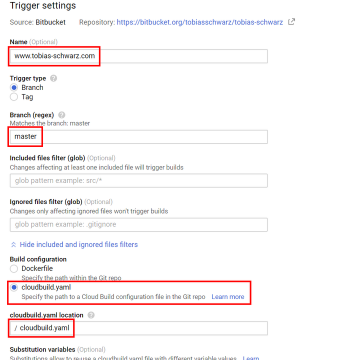

Static Website with Hugo, Cloudflare and Automated Builds using Google Cloud

Static Website with Hugo, Cloudflare and Automated Builds using Google Cloud

https://www.tobias-schwarz.com/posts/8/

Guide to setup a static website using a Google Cloud Space bucket, an automated build system using Build Triggers and Cloudflare as a CDN.