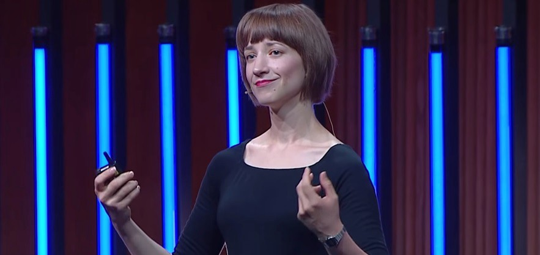
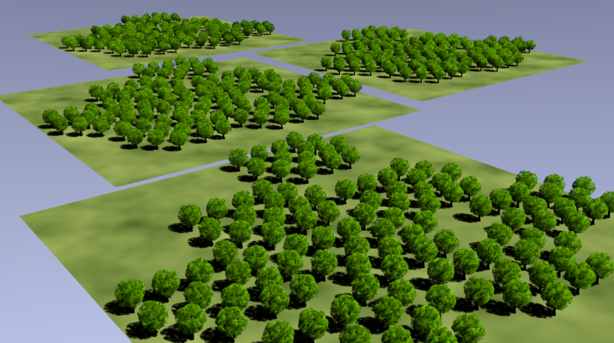
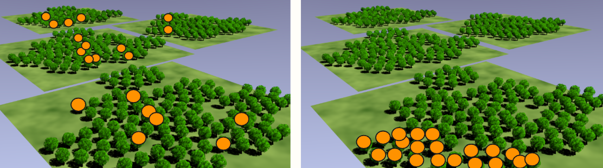
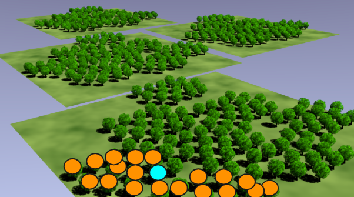
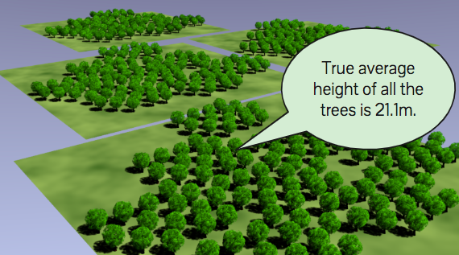
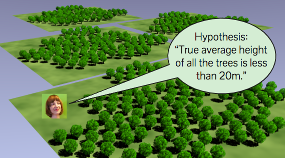
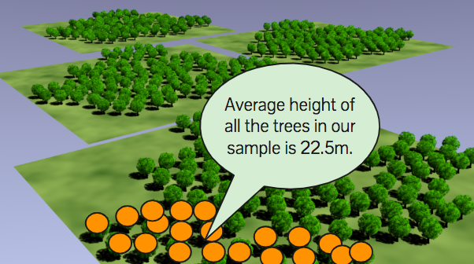
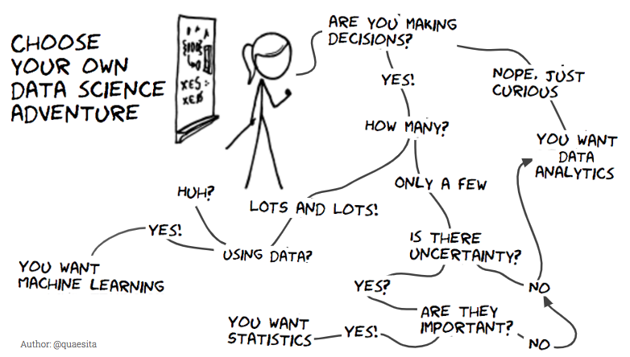

Statistician proves that statistics are boring – Towards Data Science

# Statistician proves that statistics are boring

## Back-to-basics with nuanced vocabulary

[Cassie Kozyrkov](https://towardsdatascience.com/@kozyrkov)
Mar 22·8 min read

I’m about to show you a logical proof that statistics are boring... to help you appreciate the [point](http://bit.ly/quaesita_pointofstats) of all those fancy calculations that [statisticians](http://bit.ly/quaesita_statistics) like myself get up to. As an added bonus, this is pretty much what you’d learn about on day 1 of most STAT101 classes, so it doubles as a spy mission for the stats-curious. Let’s start by wallowing in some local jargon.

This statistician is about to prove that statistics are boring. Pulling faces all the while — I’m still learning how to use my face. Humaning is hard. Come pull a face back at me [here](http://twitter.com/quaesita) if you like.

### Population

What comes to mind when the typical human thinks of the word “population”? People, right? Not just one or two of them but many. All the people! In our [discipline](http://bit.ly/quaesita_statistics), it’s more like *all the things*. A [population](http://bit.ly/quaesita_popwrong) can be people, pixels, pumpkins, Pokémon, or whatever else strikes your fancy.

> A population is the collection of all items that we are interested in.

Stop. Take a moment. You’re looking at *the*  [legal contract](http://bit.ly/quaesita_popwrong) at the heart of the whole pursuit.

Here’s the deal: by writing down a description of your [population](http://bit.ly/quaesita_popwrong), you’re agreeing that only the population, the whole population, and nothing but the population is interesting for your decision. By reading further, [you accept these terms and conditions](http://bit.ly/quaesita_savvy). (As you’d expect, this blog dwells on populations aplenty. Find more musings [here](http://bit.ly/quaesita_savvy).)

If [coming up with your population](http://bit.ly/quaesita_incomp) of interest sounds daunting, remember that it’s [up to you](http://bit.ly/quaesita_incomp) to pick what you want to be interested in. There’s no incorrect choice, as long as it’s specific and thorough. I’ll be so thorough I’ll give you a thousand words: the trees in the picture below are our population of interest for this article.

If my population is all trees in *this* forest, they represent everything I care about for this decision. I’m getting pretty excited about these trees. Actually, to be quite honest with you, the excitement is real: I’m irrationally fond of this graphic because I’ve been using it in my lectures for many years. Allow me my misguided nostalgia just this once… of course trees floating on some planes in space make perfect sense.

Since this is my population, I should remember that I have no business tumbling out of my analysis convinced I’ve learned things about trees in some other forest. My findings will apply, at best, to *these* trees. At worst, well… let’s just say that there may be some character-building moments in a [data scientist](http://bit.ly/quaesita_datasci)’s life.

Any tree you can’t see here? Dead to you, boring. It is not part of our population. Pick any single tree? Dead to you as well. Just as boring. It is not your entire population. Only all of them (together!) are interesting to us. *That’s* what the [legal contract](http://bit.ly/quaesita_popwrong) says.

### Sample

A sample any collection of items from the population.

> The sample is the > [> data](http://bit.ly/quaesita_hist)>  you have and the population is the data you *wish* you had.

Either of these orange collections of trees is a sample. I hope you have some intuition as to which one is the better one here. In a future article, I’ll tell you all about what makes a sample a good sample. I’m going to use the one that irritates professionals for the rest of this example to prove a point.

### Observation

An observation is a measurement from one single item in a sample.

The measurement we took from this blue-labeled tree is an observation. Sticklers for precise language will notice that a “sample” is a collective noun for a group of observations. Technically, “*samples*” as a plural does not mean “observations”, it means “*multiple collections of observations*.”

### Statistic

Aha! Statistic! This is surely something important, because we named our [discipline](http://bit.ly/quaesita_statistics) after these things!

> A statistic is any way of mushing up sample data.

So… what’s a statistic? It’s just some way of mushing up the [data](http://bit.ly/quaesita_hist) that we have. What a letdown! Cue the sad trombone noise. Turns out that a statistic and the discipline of statistics are different things, read all about it [here](http://bit.ly/quaesita_statistics).

Example of a statistic: if we’re interested in tree heights, you wouldn’t be surprised to see a statistic like the average height of all those orange-labeled trees. If you feel like it, though, you could also take those sample tree heights, find the top three, add them up, take the log, add to it the square root of the difference of the bottom two tree heights, send the whole unholy thing through a meat grinder… and out pops another statistic! Maybe useful, maybe not so useful, but also a statistic.

### Proof that statistics are boring

Suppose we are interested in average tree height, which happens to be 22.5m for this sample. Is this number interesting to us?

Let’s refer back to the legal contract we signed up for: only the population is interesting. Is this sample the *population*? Nope! Therefore, it’s not interesting to us. We took some boring measurements from some boring trees, then we mushed up those boring measurements… what comes out of that process is also boring.

So I have proven to you what you have known in your hearts all along: statistics are boring! Q.E.D.

### Misnomer!

Are statisticians crazy? Why would we name our discipline after some boring numbers? Actually, it’s a misnomer.

The way we use the terms these days, [analytics](http://bit.ly/quaesita_analysts) is the discipline that’s about calculating statistics, but [statistics](http://bit.ly/quaesita_statistics) is all about going *beyond* those [data](http://bit.ly/quaesita_hist) mushups — an [Icarus-like leap](http://bit.ly/quaesita_popwrong) into the unknown (expect a big splat if you’re not careful). Learn more [here](http://bit.ly/quaesita_datasci) about the subdisciplines of [data science](http://bit.ly/quaesita_datasci).

The true name of our discipline (in that sense of a True Name you can use to summon the wizard) would be wordier: the *Digestion of Statistics…* but that sounds a bit gross, so we shortened it to something approachable. (With our reputation for grumpiness, we need all the approachability we can get.)

Let me explain.

### Parameter

Enter the star of our show: the ***parameter***. This thing is so fancy and shiny. It’s going to get a bouquet after the performance, it’ll usually even get its own Greek letter (typically *θ*). You can think of the parameter as the population version of a statistic — a parameter is any way of mushing up all the interesting data, which we usually don’t have access to IRL.

> A parameter summarizes the population for you.

We’ve agreed that we are deeply excited about those trees and now I’m going to summarize for you everything you care about? Be still your little heart! You are so excited by the parameter!

Parameter value revealed: the true average height of all the trees just so happens to be 21.1 meters.

Imagine it’s Saturday morning and you are standing in the middle of a clearing in this forest. You haven’t measured any trees yet, but you *really* want to know this number — it’s everything you’ve ever dreamed of. (By [legal contract](http://bit.ly/quaesita_popwrong), that is. You can go back to being a sane person with other interests in life once we’re done with the article.)

What’s it going to take to know the parameter?

You’ll have to measure all the trees with no errors! Once you’ve done that, do you have any uncertainty? Nope, you have all the information. You can finish up by using [analytics](http://bit.ly/quaesita_datasci) — just go ahead calculate the average. Then the statistic ***is*** the parameter because your sample ***is*** the population. You are dealing with pure ***facts***. Thanks to having perfect and complete data, no complicated calculating is required.

I happen to live in New York City -by choice!- as far away from trees as possible. So the laziness kicks in when I’m faced with a daunting task like “measure all these trees perfectly.” I would love to know this parameter, but I start thinking to myself, “Do I *really* need to know it perfectly or could I measure only a few of the trees? Maybe I could get away with only a partial look at the whole picture to form a best guess about that parameter that’s… [good enough for government work](http://bit.ly/gefgovw)."

When I’m thinking that way, I am thinking statistically! I’m never going to *know* the answer. My laziness means I have to give up on getting facts or certainty, but hopefully I’ll end up with something that still reasonably helpful for making a [decision](http://bit.ly/quaesita_inspired). I could still turn it into a reasonable [action](http://bit.ly/quaesita_damnedlies). *That* is what the [discipline of statistics](http://bit.ly/quaesita_statistics) is all about.

### Something out of nothing?

Some of you are hoping I’ll say, *“With ****this**** magic formula, you can make certainty out of uncertainty!”* No, of course not. There’s no magic that makes something out of nothing.

> When we don’t have facts, all we can hope for is combining > [> data](http://bit.ly/quaesita_hist)>  with assumptions to make reasonable decisions.

### Hypothesis

A [hypothesis](http://bit.ly/quaesita_damnedlies) is a description about how the universe might look, but it doesn’t have to be true. We’ll be figuring out whether our sample makes our [hypothesis look ridiculous](http://bit.ly/quaesita_fisher) to determine whether we should change our minds, but that wanders outside the scope of *this* blog post — pick up the thread [here](http://bit.ly/quaesita_damnedlies).

Here I am, uttering some uninformed garbage like “The true average height of all the trees is less than 20 meters.” That’s a hypothesis. **You** know the truth (I’m wrong!) because **you’re** omniscient in this example …but *I* don’t know anything. My statement is a perfectly valid hypothesis, describing how reality *might* potentially look. [I’ll see how I feel about it after I get some data.](http://bit.ly/quaesita_fisher)

### Estimate and Estimator

If we knew the parameter, we’d be home right now. It’s the **fact** that we’re looking for, but unfortunately facts are not always available. Since we cannot compute the parameter, we can only make a best guess about it using a statistic.

> An estimate is just a fancy word for best guess.

An estimate is just a fancy word for ***best guess*** about the true value of a parameter. It’s the value your guess takes, while an *estimator* is the formula you use for arriving at that number.

Let me show you that you are already amazing at statistical estimation. Ready?

Let’s suppose that all you know is that one of the trees is 23m tall. Can you please tell me your *estimate* for the true average height of all the trees?

23m? Yeah, me too!

We’d have to guess 23m if this is our *only* information — if we guess anything else, we’re just makin’ stuff up. 23m is all we know, so we have to guess 23m. To get something else, we’d have to be incorporating more information (which we don’t have in this example) or we’d have to make assumptions… at which point we’re again dealing with something other than facts.

All right, let’s try another one! Say we have a sample and all we know about it is that it’s got an average of 22.5m for the height. What’s your best guess now?

22.5m? Wow! You’re so good at this! You don’t even need a course!

Here’s the punchline of several textbook chapters’ worth of statistics covering *method of moments estimation*, *maximum likelihood estimation*, and all their cousins: It turns out that the answer at the end of the proof rainbow is the same answer you just came to intuitively! In 99%+ of cases you encounter in real life, just treating your sample as if it’s your population and going with whatever’s in it is how you get the best guess. You don’t need any special courses. Taa-daa, we’re done!

It’s a lie that you always need [statistics](http://bit.ly/quaesita_statistics); you don’t. If you’re just trying to make a best guess to get [inspired](http://bit.ly/quaesita_inspired), [analytics](http://bit.ly/quaesita_bsides) is the best option for you. Shrug off those [p-values](http://bit.ly/quaesita_pvalue), you don’t need the unnecessary stress.

Instead, you can choose to live by these principles: More (relevant) [data](http://bit.ly/quaesita_hist) is better and your intuition is pretty good for making best guesses, but not for knowing how good those guesses are… so stay humble.

However, don’t for a moment think I’m bashing my discipline. I’ve devoted over a decade to studying [statistics](http://bit.ly/quaesita_statistics) and I like to think I’m not completely crazy.

> When taking a statistical approach is useful, it’s > [*> very*](http://bit.ly/quaesita_donttrust)>  useful.

So when do you actually need it? When will it prevent you from hurting yourself? Read my [*“What’s the point of statistics?”*](http://bit.ly/quaesita_pointofstats) to find out…

Learn more about the difference between the subdisciplines in data science [here](http://bit.ly/quaesita_datasci).