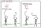

Statistics for people in a hurry - Towards Data Science

# Statistics for people in a hurry

[Cassie Kozyrkov](https://towardsdatascience.com/@kozyrkov?source=post_page-----a9613c0ed0b----------------------)

[May 29, 2018](https://towardsdatascience.com/statistics-for-people-in-a-hurry-a9613c0ed0b?source=post_page-----a9613c0ed0b----------------------) · 8 min read

Ever wished someone would just tell you what the [point of statistics](http://bit.ly/quaesita_pointofstats) is and what the jargon means in plain English? Let me try to grant that wish for you! I’ll zoom through all the biggest ideas in statistics in 8 minutes! Or just 1 minute, if you stick to the large font bits.

What’s a ***statistic***? It’s any old way of mushing up our data. Yup. 100% technically correct definition. Now let’s see what the discipline of *statistics* is [all about](http://bit.ly/quaesita_pointofstats).

> Statistics is the science of changing your mind.

Making decisions based on facts (***parameters***) is hard enough as it is, but -curses!- sometimes we don’t even have the facts we need. Instead, what we know (our [***sample***](http://bit.ly/quaesita_vocab)) is different from what we wish we knew (our [***population***](http://bit.ly/quaesita_popwrong)). That’s what it means to have [***uncertainty***](http://bit.ly/quaesita_savvy).

***Statistics*  **is the science of changing your mind under uncertainty. What might your mind be set to? A ***default action*** or a ***prior belief***. What if your mind’s a blank slate? [Read this instead](http://bit.ly/quaesita_pointofstats).

> Bayesians change their mind about beliefs.

**Bayesian statistics** is the school of thought that deals with incorporating data to update your beliefs. Bayesians like to report results using **credible intervals** (two numbers which are interpreted as, “I believe the answer lives between here and here”).

> Frequentists change their mind about actions.

***Frequentist statistics*** deals with changing your mind about actions. You don’t need to have a belief to have a [***default action***](http://bit.ly/quaesita_damnedlies)***,*** it’s simply what you’re [committed to doing](http://bit.ly/quaesita_inspired) if you don’t analyze any data. Frequentist (a.k.a. classical) statistics is the one you’re more likely to encounter in the wild and in your STAT101 class, so let’s keep it classical for the rest of this article.

> Hypotheses are descriptions of what the world might look like.

The [***null hypothesis***](http://bit.ly/quaesita_damnedlies) describes all worlds where doing the default action is a happy choice; the ***alternative hypothesis*** is all other worlds. If I convince you -with data!- that you don’t live in the null hypothesis world, then you had better change your mind and take the **alternative action**.

[For example](http://bit.ly/quaesita_fisher): “We can walk to class together (*default action*) if you usually take under 15 minutes to get ready (*null hypothesis*), but if the evidence (*data*) suggests it’s longer (*alternative hypothesis*), you can walk by yourself because I’m outta here (*alternative action*).”

> Testing in a nutshell: “Does our evidence make the null hypothesis look ridiculous?”

All of [***hypothesis testing***](http://bit.ly/quaesita_damnedlies) is all about asking: does our evidence make the null hypothesis look ridiculous? ***Rejecting the null*** hypothesis means we learned something and we should change our minds. Not rejecting the null means [***we learned nothing interesting***](http://bit.ly/quaesita_fisher), just like [going for a hike in the woods and seeing no humans](http://bit.ly/quaesita_yesbutton) doesn’t prove that there are no humans on the planet. It just means we didn’t learn anything interesting about humans existing. Does it make you sad to [learn nothing](http://bit.ly/quaesita_fisher)? It shouldn’t, because you have a lovely insurance policy: you know exactly what action to take. If you learned nothing, you have no reason to change your mind, so keep doing the [default action](http://bit.ly/quaesita_damnedlies).

So how do we know if we learned something interesting… something out of line with the world in which we want to keep doing our [default action](http://bit.ly/quaesita_inspired)? To get the answer, we can look at a [p-value](http://bit.ly/quaesita_puppies) or a confidence interval.

> The p-value’s on the periodic table: it’s the element of surprise.

The ***p-value*** says, “If I’m living in a world where I should be taking that default action, how unsurprising is my evidence?” The lower the [p-value](http://bit.ly/quaesita_p3), the more the data are yelling, “Whoa, that’s surprising, maybe you should change your mind!”

To perform the test, compare that p-value with a threshold called the [***significance level***](http://bit.ly/quaesita_p3). This is a knob you use to control how much risk you want to tolerate. It’s your maximum probability of stupidly leaving your cozy comfy default action. If you set the significance level to 0, that means you refuse to make the mistake of leaving your default incorrectly. Pens down! Don’t analyze any data, just take your default action. (But that means you might end up stupidly NOT leaving a bad default action.)

How to use p-values to get the outcome of your hypothesis test. (No one will suspect that my xkcd is a knockoff.)

A ***confidence interval*** is simply a way to report your hypothesis test results. To use it, check whether it overlaps with your null hypothesis. If it does overlap, learn nothing. If it doesn’t, change your mind.

> Only change your mind if the confidence interval doesn’t overlap with your null hypothesis.

While a confidence interval’s technical meaning is little bit weird (I’ll tell you all about it in a future post, it’s definitely not simple like the credible interval we met earlier, and wishing does not make it so), it also has two useful properties which analysts find helpful in describing their data: (1) the best guess is always in there and (2) it’s narrower when there’s more data. Beware that both it and the p-value weren’t designed to be nice to talk about, so don’t expect pithy definitions. They’re just ways to summarize test results. (If you took a class and found the definitions impossible to remember, that’s why. On behalf of statistics: it’s not you, it’s me.)

What’s the point? If you do your testing the way I just described, the math guarantees that your risk of making a mistake is capped at the [significance level](http://bit.ly/quaesita_p3) you chose (which is why it’s important that you, ahem, choose it… the math is there to guarantee you the risk settings you picked, which is kind of pointless if you don’t bother to pick ‘em).

> The math is all about building a toy model of the null hypothesis universe. That’s how you get the p-value.

The math is all about making and examining toy universes (how cool is that, fellow megalomaniacs!? So cool!) to see how likely they are to spawn datasets like yours. If your toy model of the null hypothesis universe is unlikely to give you data like the data you got from the real world, your p-value will be low and you’ll end up rejecting the null hypothesis… change your mind!

What’s with all those crazy formulas, those probabilities and [distributions](http://bit.ly/quaesita_hist)? They allow us to express the rules governing the [null hypothesis universe](http://bit.ly/quaesita_p2) so we can figure out whether that universe is the kind of place that coughs up data similar to what you got in real life. And if it isn’t, you shout: “Ridiculous! Off with its head!” If it is, you shrug and learn nothing. More on this in a future post. For now, just think of the math as building little toy worlds for us to poke at so we can see if our dataset looks reasonable in them. The [p-value](http://bit.ly/quaesita_puppies) and confidence interval are ways to summarize all that for you so you don’t need to squint at a long-winded description of a universe. They’re the endgame: use them to see whether or not to leave your [default action](http://bit.ly/quaesita_inspired). Job done!

> Did we do our homework? That’s what power measures.

Hang on, did we do our homework to make sure that we actually collected *enough* evidence to give ourselves a fair shot at changing our minds? That’s what the concept of ***power*** measures. It’s really easy not to find any mind-changing evidence… just don’t go looking for it. The more power you have, the more opportunity you’ve given yourself to change your mind if that’s the right thing to do. Power is the probability of correctly leaving your [default action](http://bit.ly/quaesita_damnedlies).

When we learn nothing and keep doing what we’re doing, we can feel better about our process if it happened with lots of power. At least we did our homework. If we had barely any power at all, we pretty much knew we weren’t going to change our minds. May as well not bother analyzing data.

> Use power analysis to check that you budgeted for enough data before you begin.

***Power analysis*** is a way to check how much power you expect for a given amount of data. You use it to plan your studies before you begin. (It’s pretty easy too; in a future post I’ll show you that all it takes is a few *for loops.*)

> Uncertainty means you can come to the wrong conclusion, even if you have the best math in the world.

What is statistics not? Magical magic that makes certainty out of uncertainty. There’s no magic that can do that; you can still make mistakes. Speaking of mistakes, here’s two mistakes you can make in Frequentist statistics. (Bayesians don’t make mistakes. Kidding! Well, sort of. Stay tuned for my Bayesian post.)

***Type I error*** is foolishly leaving your default action. Hey, you said you were comfortable with that [default action](http://bit.ly/quaesita_damnedlies) and now thanks to all your math you left it. Ouch! ***Type II error*** is foolishly not leaving your default action. (We statisticians are so creative at naming stuff. Guess which mistake is worse. Type I? Yup. So creative.)

> Type I error is changing your mind when you shouldn’t.
> Type II error is NOT changing your mind when you should.

Type I error is like convicting an innocent person and Type II error is like failing to convict a guilty person. These two error probabilities are in balance (making it easier to convict a guilty person also makes it easier to convict an innocent person), unless you get more evidence (data!), in which case both errors become less likely and everything becomes better. That’s why statisticians want you to have more, more, MOAR data! Everything becomes better when you have more data.

> More data means more protection against coming to the wrong conclusion.

What’s ***multiple comparisons correction***? You’ve got to do your testing in a different, adjusted way if you know you plan to ask multiple questions of the same dataset. If you keep putting innocent suspects on trial over and over again (if you keep fishing in your data) eventually something is going to look guilty by random accident. The term ***statistically significant*** doesn’t mean something important happened in the eyes of the universe. It simply means we changed our minds. Perhaps incorrectly. Curse that uncertainty!

> Don’t waste your time rigorously answering the wrong question. Apply statistics intelligently (and only where needed).

What’s a [***Type III error***](http://bit.ly/quaesita_wsai)? It’s kind of a statistics joke: it refers to correctly rejecting the wrong null hypothesis. In other words, using all the right math to answer the wrong question.

A cure for asking and answering the wrong question can be found in [Decision Intelligence](http://bit.ly/quaesita_gcpp), the new discipline that looks at applying data science to solving business problems and making decisions well. By mastering decision intelligence, you’ll build up your immunity to Type III error and useless [analytics](http://bit.ly/quaesita_datasci).

In summary, statistics is the science of changing your mind. There are two schools of thought. The more popular one - Frequentist statistics - is all about checking whether you should leave your default action. Bayesian statistics is all about having a prior opinion and updating that opinion with data. If your mind is truly blank before you begin, look at your data and [just go with your gut](http://bit.ly/quaesita_pointofstats).