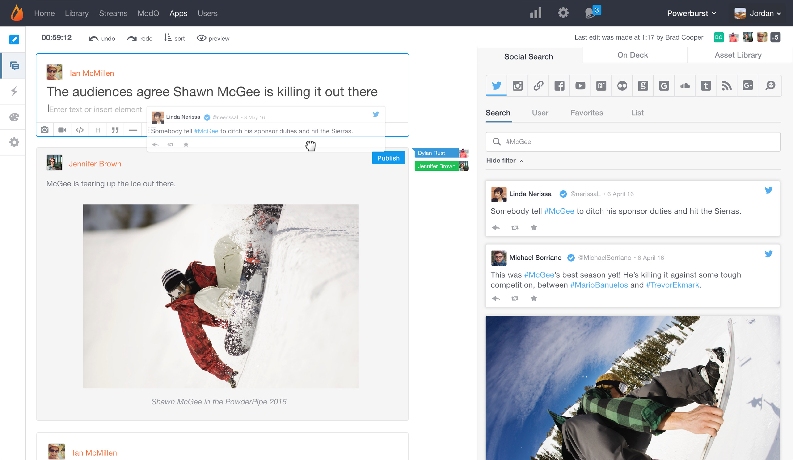
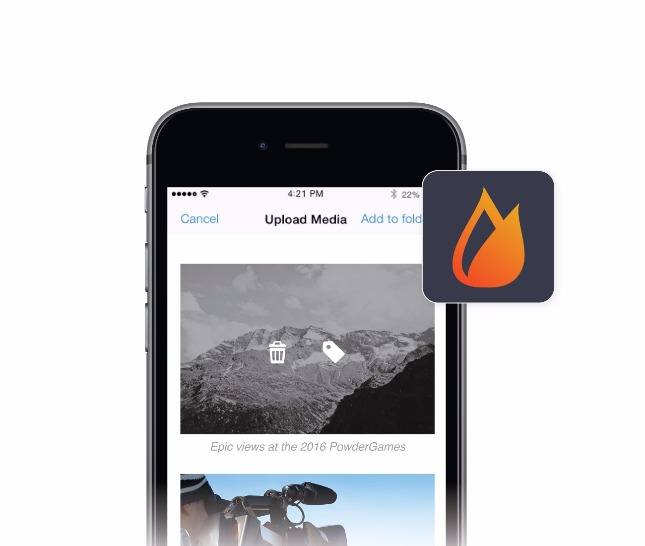
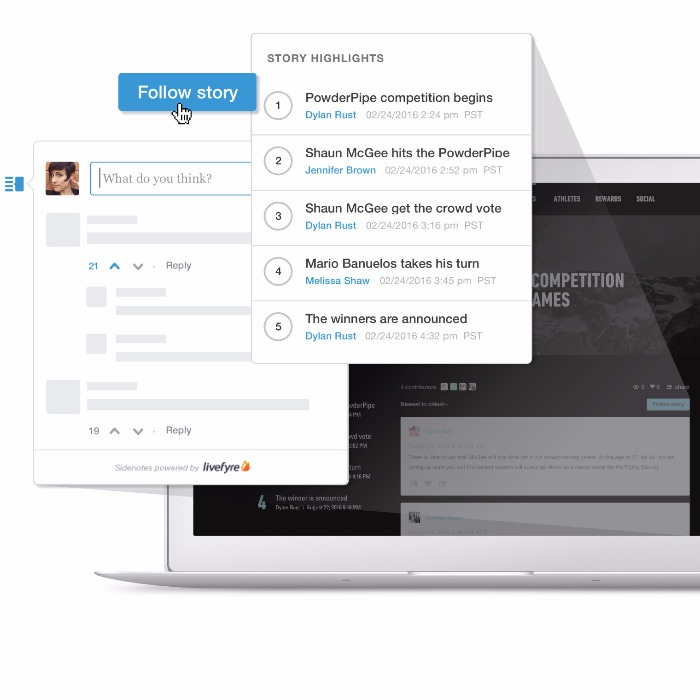

Storify - Create stories using social media

[(L)](https://storify.com/)

[Browse Stories](https://storify.com/browse)[Sign Up Free](https://storify.com/signup)[Log In](https://storify.com/login)

# Livefyre Engagement Cloud just got bigger, better.

Storify 2 gives you the tools to create the best evergreen and live blog stories, uniting traditional storytelling with engaged audiences.

[Explore Storify 2](https://storify.com/enterprise)[Storify Free Sign Up](https://storify.com/signup)

Scroll down to learn more

## A story for every use-case

- 

### Breaking News

Up-to-the-minute, non-stop updates from any source, every time.

- 

### Live Blogging

Conferences, sporting events and award shows, showcase everything that happened, live.

- 

### Hashtag Campaigns

Capture and report your hashtag’s results, or curate the best user content.

- 

### Q&A

Archive your next discussion with talent for a new show, album and more.
[Learn More](http://go.livefyre.com/LP_data_sheet_storify2_p)
What you'll get

## Real-time collaboration

Built for the social newsroom, wherever you find it. Allow multiple editors to simultaneously update, review and publish your story from anywhere.

## Create stories wherever you find them

Post content and shape your narrative on the fly with our powerful mobile app.

## One place for all your content needs

Craft authentic stories with content from your team and community. Drag and drop content to group audience moments. Quickly search, filter and publish social content from your owned assets and across the web: text, photos, even videos.

## Immersed, engaged audiences

Focus attention on what matters by pinning content and displaying at-a-glance views of key story events. Sidenotes, social sharing and other engagement features let your community voice their opinion while driving traffic right back to your site.

## Extend the life of your stories

Storify 2 is built on Livefyre Engagement Cloud, helping you turn real-time content into long-term, reusable assets. Store, tag and organize content in your social library to repurpose your best posts and re-engage readers weeks, months, even years down the road.

[Explore Social Library](http://web.livefyre.com/social-library/)

## Which Storify is right for me?

### Storify Free

Amateur blogger?
[Free Sign Up](https://storify.com/signup)

### Storify 2

Enterprise content team?
[Request a Demo](http://go.livefyre.com/lp_demo)

#### Still not sure? Take a look at our feature comparison below.

| Content Creation | Storify Free | Storify 2 |
| --- | --- | --- |
| Create, edit, publish from a single place |    |    |
| Drag and drop social content |    |    |
| Drag and drop to re-order |    |    |
| Add local photo and videos |    |    |
| Content approval workflow |    |    |
| Automated content curation |    |    |
| Native mobile app |    |    |
| Customization |     |     |
| Customized look and feel |    |    |
| Set time zone |    |    |
| One-click theme customization |    |    |
| Custom CSS styling |    |    |
| End-User Engagement |     |     |
| Full-story social sharing |    |    |
| Individual-post social sharing |    |    |
| Sidenotes in-story commenting |    |    |
| Navigation for story highlights |    |    |
| Pin posts at top of story |    |    |
| Content tag filtering |    |    |
| Monetization and SEO |     |     |
| Customer-controlled ads |    |    |
| Google real-time search optimization |    |    |
| SEO optimization |    |    |
| Livefyre Engagement Cloud Platform |     |     |
| Enterprise-level support |    |    |
| Enterprise moderation features |    |    |
| Use your own authentication provider |    |    |
| Access to Social Library |    |    |

[Free Sign Up](https://storify.com/signup)[Learn More](http://go.livefyre.com/LP_data_sheet_storify2_p)

Turn real moments into stories[Explore Storify 2](https://storify.com/enterprise)