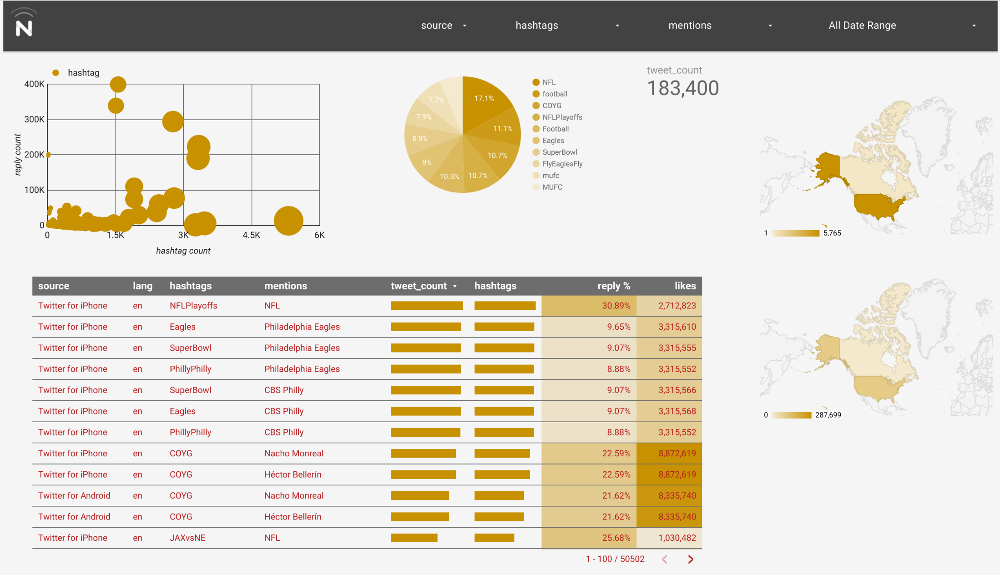
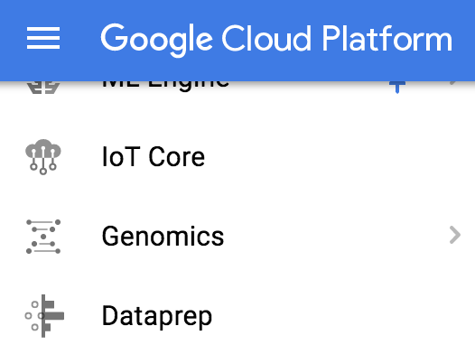
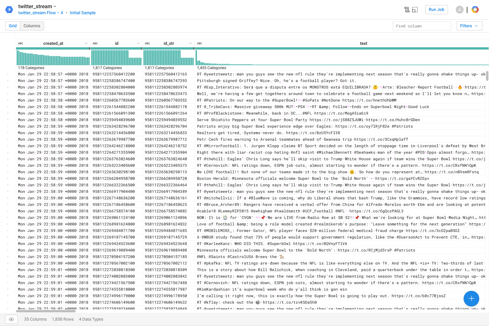
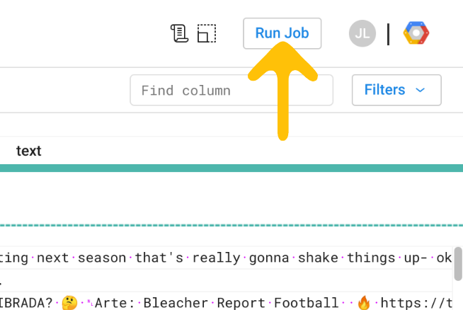
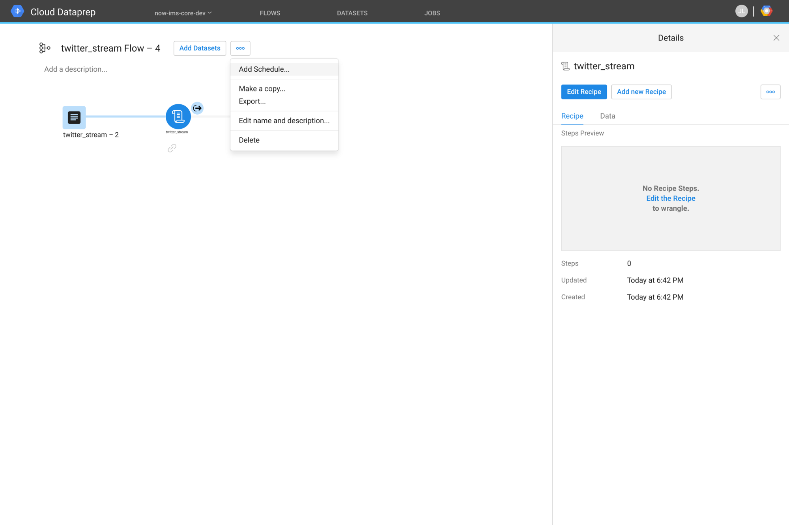
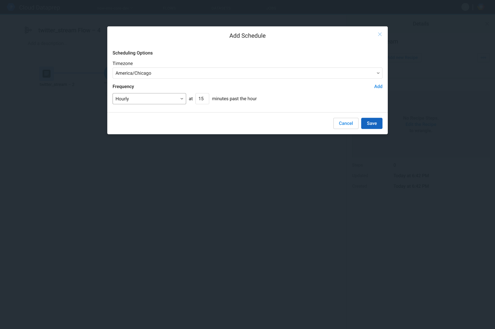
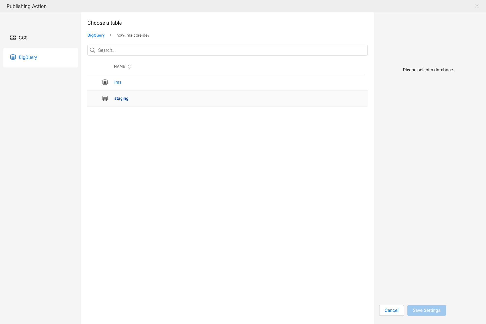
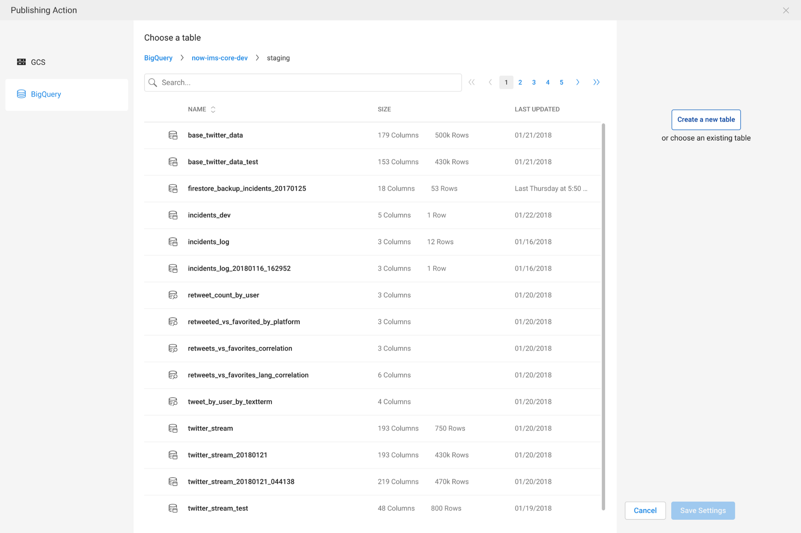
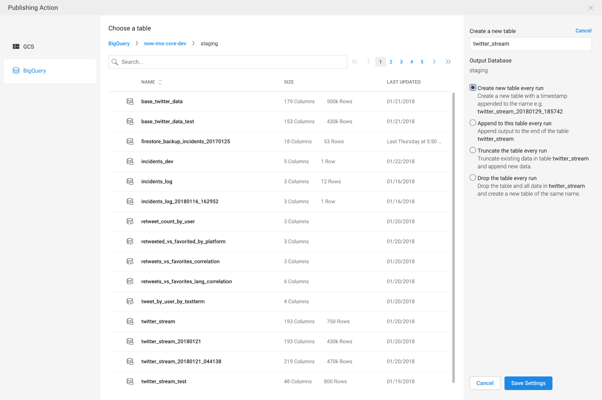
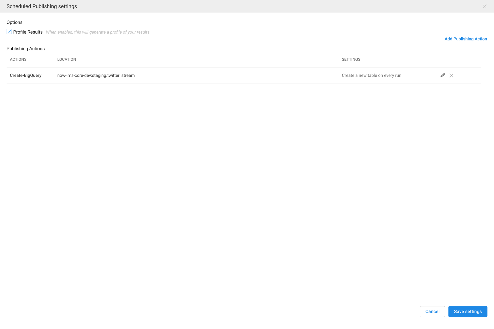

Stream Twitter Data into BigQuery with Cloud Dataprep

# Stream Twitter Data into BigQuery with Cloud Dataprep

## Inspired by [Lakshmanan V](https://medium.com/@lakshmanok)’s [article](https://medium.com/google-cloud/how-to-schedule-a-bigquery-etl-job-with-dataprep-b1c314883ab9) to show just a couple extra features

[Jeremy Lorino](https://medium.com/@jeremylorino)
Jan 30, 2018·3 min read

> All code mentioned here can be found in my > [> git repo](https://github.com/jeremylorino/gcp-dataprep-bigquery-twitter-stream)> . Contribute, steal, or do nothing with it — your choice ;)

Let’s see how much data we can get by listening to [Twitter’s Streaming API](https://developer.twitter.com/en/docs/tweets/filter-realtime/overview). I will break the code out into chunks to explain, but again all of this is included in the [git repo](https://github.com/jeremylorino/gcp-dataprep-bigquery-twitter-stream).

#### Listen to streaming Twitter data

Below we are utilizing a *TwitterStream* helper class that takes an Array of keywords that will filter the real-time tweet stream.

Configure stream listener with Twitter keyword filters

Then we bind an event listener to the data event that is emitted from the *TwitterStream* instance from above. This listener will capture all tweets emitted as JSON and buffer them into a working array. Once the buffer is full, a copy of the working array is saved to the configured Google Cloud Storage bucket via *StorageProvider*; and the working array is cleared to allow for more tweets.

And don’t forget your *config.json*. Fill in your GCP project id, the location of your default application credentials, twitter app credentials, and storage bucketName.

#### Import Cloud Storage folder to Dataprep

Open the [Google Cloud Platform dashboard](https://console.cloud.google.com/) — choose from the top left menu; *Dataprep*.

> It is normal at the *> very*>  bottom of the list — unless you have pinned it to your favorites.

Quick video on importing your dataset. For real, it is quick.

Import dataset

#### Wrangle newly imported dataset

Cloud Dataprep’s awesomeness is complemented by the fact that it would like you to “wrangle” your data. Particularly appealing to myself being a Texan.

There are at least 10,000 in-depth Cloud Dataprep articles, I will stick to the basics.

Now run that job yo. (top right)

* * *

*...*

#### Schedule Dataprep ETL to BigQuery

The best part about this little setup we are about to walk through; we are selecting a “folder” inside of a Cloud Storage bucket. Each time the flow runs it will pull all the files inside the folder and consider those files as the dataset to wrangle. So as the TwitterStream collector runs and dumps files into Cloud Storage Dataprep will continuously be able to get the latest and greatest.

Add a schedule to your flow

Every hour; 15 minutes past the hour

Select a BigQuery dataset

Select ‘Create a new table’

Select ‘Create a new table every run’

End result

* * *

*...*
> Next time…Visualize with Datastudio

