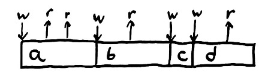
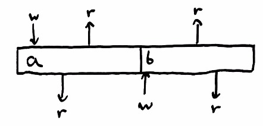
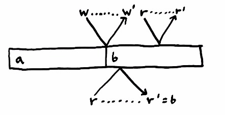
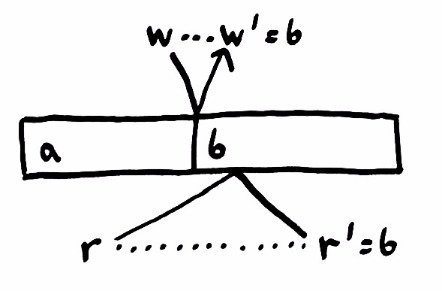
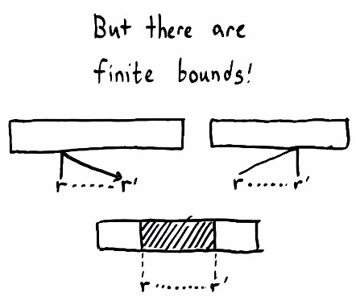
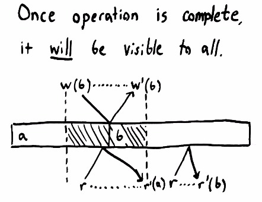
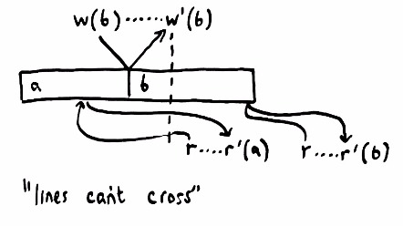
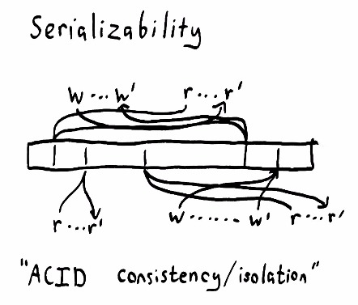
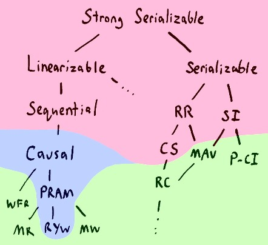
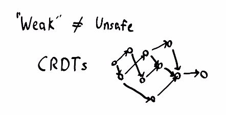

Strong consistency models

# Strong consistency models

 2014/05/15

- [Software](https://aphyr.com/tags/software)
- [Distributed Systems](https://aphyr.com/tags/Distributed-Systems)
- [Jepsen](https://aphyr.com/tags/Jepsen)
- [Networks](https://aphyr.com/tags/Networks)

*Network partitions [are going to happen](http://aphyr.com/posts/288-the-network-is-reliable).* Switches, NICs, host hardware, operating systems, disks, virtualization layers, and language runtimes, not to mention program semantics themselves, all conspire to delay, drop, duplicate, or reorder our messages. In an uncertain world, we want our software to maintain some sense of *intuitive correctness*.

Well, obviously we want intuitive correctness. Do The Right Thing™! But what exactly *is* the right thing? How might we describe it? In this essay, we’ll take a tour of some “strong” consistency models, and see how they fit together.

## Correctness

There are many ways to express an algorithm’s abstract behavior–but just for now, let’s say that a *system* is comprised of a *state*, and some *operations* that transform that state. As the system runs, it moves from state to state through some history of operations.



For instance, our state might be a variable, and the *operations* on the state could be the writes to, and reads from, that variable. In this simple Ruby program, we write and read a variable several times, printing it to the screen to illustrate the reads.

	x = "a"; puts x; puts x

	x = "b"; puts x

	x = "c"

	x = "d"; puts x

We already have an *intuitive* model of this program’s correctness: it should print “aabd”. Why? Because each of the statements *happen in order*. First we `write the value a`, then `read the value a`, then `read the value a`, then `write the value b`, and so on.

Once we set a variable to some value, like `a`, reading it should return `a`, until we change the value again. Reading a variable returns the most recently written value. We call this kind of system–a variable with a single value–a *register*.

We’ve had this model drilled into our heads from the first day we started writing programs, so it feels like second nature–but this is *not* the only way variables could work. A variable could return *any* value for a read: `a`, `d`, or `the moon`. If that happened, we’d say the system was *incorrect*, because those operations don’t align with our *model* of how variables are supposed to work.

This hints at a definition of *correctness* for a system: given some *rules* which relate the operations and state, the history of operations in the system should always *follow those rules*. We call those rules a *consistency model*.

We phrased our rules for registers as simple English statements, but they could be arbitrarily complicated mathematical structures. “A read returns the value from two writes ago, plus three, except when the value is four, in which case the read may return either cat or dog” is a consistency model. As is “Every read always returns zero”. We could even say “There are no rules at all; every operation is permitted”. That’s the *easiest* consistency model to satisfy; every system obeys it trivially.

More formally, we say that a consistency model is the *set of all allowed histories of operations*. If we run a program and it goes through a sequence of operations in the allowed set, that particular execution *is consistent*. If the program screws up occasionally and goes through a history *not* in the consistency model, we say the history was *inconsistent*. If *every* possible execution falls into the allowed set, the system *satisfies* the model. We want real systems to satisfy “intuitively correct” consistency models, so that we can write predictable programs.

## Concurrent histories

Now imagine a concurrent program, like one written in Node.js or Erlang. There are multiple logical threads of control, which we term “processes”. If we run a concurrent program with two processes, each of which works with the same register, our earlier register invariant could be *violated*.



There are two processes at work here: call them “top” and “bottom”. The top process tries to `write a`, `read`, `read`. The bottom process, meanwhile, tries to `read`, `write b`, `read`. Because the program is *concurrent*, the operations from these two processes could interleave in *more than one order*–so long as the operations for a single process happen in the order that process specifies. In this particular case, top writes `a`, bottom reads `a`, top reads `a`, bottom writes `b`, top reads `b`, and bottom reads `b`.

In this light, the concept of concurrency takes on a different shape. We might imagine every program as *concurrent by default*–when executed, operations could happen in any order. A *thread*, a *process*–in the logical sense, anyway–is a *constraint* over the history: operations belonging to the same thread *must* take place in order. Logical threads impose a partial order over the allowed operations.

Even with that order, our register invariant–from the point of view of an individual process–no longer holds. The process on top wrote `a`, read `a`, then read `b`–which is *not* the value it wrote. We must *relax* our consistency model to usefully describe concurrency. Now, a process is allowed to read the most recently written value from *any* process, not just itself. The register becomes a *place of coordination* between two processes; they *share state*.

## Light cones



Howerver, this is not the full story: in almost every real-world system, processes are *distant* from each other. An uncached value in memory, for instance, is likely on a DIMM *thirty centimeters away* from the CPU. It takes light over a full nanosecond to travel that distance–and real memory accesses are much slower. A value on a computer in a different datacenter could be thousands of kilometers–hundreds of milliseconds–away. We just can’t send information there any faster; physics, thus far, forbids it.

This means our operations are *no longer instantaneous*. Some of them might be so fast as to be negligible, but in full generality, operations *take time*. We *invoke* a write of a variable; the write travels to memory, or another computer, or the moon; the memory changes state; a confirmation travels back; and then we *know* the operation took place.



The delay in sending messages from one place to another implies *ambiguity* in the history of operations. If messages travel faster or slower, they could take place in unexpected orders. Here, the bottom process invokes a read when the value is `a`. While the read is in flight, the top process writes `b`–and by happenstance, its write arrives *before* the read. The bottom process finally completes its read and finds `b`, not `a`.

This history violates our concurrent register consistency model. The bottom process did *not* read the current value at the time it invoked the read. We might try to use the completion time, rather than the invocation time, as the “true time” of the operation, but this fails by symmetry as well; if the read arrives *before* the write, the process would receive `a` when the current value is `b`.

In a distributed system–one in which it takes time for an operation to take place–we must *relax* our consistency model again; allowing these ambiguous orders to happen.

How far must we go? Must we allow *all* orderings? Or can we still impose some sanity on the world?

## Linearizability



On careful examination, there are some bounds on the order of events. We can’t send a message back in time, so the *earliest* a message could reach the source of truth is, well, *instantly*. An operation cannot take effect *before* its invocation.

Likewise, the message informing the process that its operation completed cannot travel back in time, which means that no operation may take effect *after* its completion.

If we assume that there *is* a single global state that each process talks to; if we assume that operations on that state take place *atomically*, without stepping on each other’s toes; then we can rule out a great many histories indeed. We know that **each operation appears to take effect atomically at some point between its invocation and completion**.

We call this consistency model *linearizability*; because although operations are concurrent, and take time, there is some place–or the appearance of a place–where every operation happens in a nice linear order.



The “single global state” doesn’t have to be a single node; nor do operations actually have to be atomic. The state could be split across many machines, or take place in multiple steps–so long as the external history, from the point of view of the processes, appears *equivalent* to an atomic, single point of state. Often, a linearizable system is made up of smaller coordinating processes, each of which is itself linearizable; and *those* processes are made up of carefully coordinated smaller processes, and so on, down to [linearizable operations provided by the hardware](http://en.wikipedia.org/wiki/Compare-and-swap).

Linearizability has powerful consequences. Once an operation is complete, *everyone* must see it–or some later state. We know this to be true because each operation *must* take place before its completion time, and any operation invoked subsequently *must* take place after the invocation–and by extension, after the original operation itself. Once we successfully write `b`, every subsequently invoked read *must* see `b`–or some later value, if more writes occur.

We can use the atomic constraint of linearizability to *mutate state safely*. We can define an operation like `compare-and-set`, in which we set the value of a register to a new value if, and only if, the register currently has some other value. We can use `compare-and-set` as the basis for mutexes, semaphores, channels, counters, lists, sets, maps, trees–all kinds of shared data structures become available. Linearizability guarantees us the safe interleaving of changes.

Moreover, linearizability’s time bounds guarantee that those changes will be visible to other participants after the operation completes. Hence, linearizability prohibits stale reads. Each read will see *some* current state between invocation and completion; but not a state prior to the read. It also prohibits *non-monotonic reads*–in which one reads a new value, then an old one.

Because of these strong constraints, linearizable systems are easier to reason about–which is why they’re chosen as the basis for many concurrent programming constructs. All variables in Javascript are (independently) linearizable; as are volatile variables in Java, atoms in Clojure, or individual processes in Erlang. Most languages have mutexes and semaphores; these are linearizable too. Strong assumptions yield strong guarantees.

But what happens if we can’t satisfy those assumptions?

## Sequential consistency



If we allow processes to skew in time, such that their operations can take effect *before* invocation, or *after* completion–but retain the constraint that operations from any given process must take place in that process' order–we get a weaker flavor of consistency: *sequential consistency*.

Sequential consistency allows more histories than linearizability–but it’s still a useful model: one that we use every day. When a user uploads a video to YouTube, for instance, YouTube puts that video into a *queue* for processing, then returns a web page for the video right away. We can’t actually *watch* the video at that point; the video upload *takes effect* a few minutes later, when it’s been fully processed. Queues remove *synchronous* behavior while (depending on the queue) preserving order.

Many caches also behave like sequentially consistent systems. If I write a tweet on Twitter, or post to Facebook, it takes time to percolate through layers of caching systems. Different users will see my message at different times–but each user will see my operations *in order*. Once seen, a post shouldn’t disappear. If I write multiple comments, they’ll become visible sequentially, not out of order.

## Causal consistency

We don’t have to enforce the order of *every* operation from a process. Perhaps, only *causally related* operations must occur in order. We might say, for instance, that all comments on a blog post must appear in the same order for everyone, and insist that any *reply* be visible to a process *only after the post it replies to* is visible. If we encode those causal relationships like “I depend on operation X” as an explicit part of each operation, the database can delay making operations visible until it has all the operation’s dependencies.

This is weaker than ordering every operation from the same process–operations from the same process with independent causal chains could execute in any relative order–but prevents many unintuitive behaviors.

## Serializable consistency



If we say that the history of operations is equivalent to one that took place in some single atomic order–but say nothing about the invocation and completion times–we obtain a consistency model known as *serializability*. This model is both much stronger and much weaker than you’d expect.

Serializability is *weak*, in the sense that it permits many types of histories, because it places no bounds on time or order. In the diagram to the right, it’s as if messages could be sent arbitrarily far into the past or future, that causal lines are allowed to cross. In a serializable database, a transaction like `read x` is always allowed to execute at time 0, when `x` had not yet been initialized. Or it might be delayed infinitely far into the future! The transaction `write 2 to x` could execute right now, *or* it could be delayed until the end of time, never appearing to occur.

For instance, in a serializable system, the program

	x = 1

	x = x + 1

	puts x

is allowed to print `nil`, `1`, *or*  `2`; because the operations can take place in any order. This is a surprisingly weak constraint! Here, we assume that each line represents a single operation and that all operations succeed.

On the other hand, serializability is *strong*, in the sense that it prohibits large classes of histories, because it demands a linear order. The program

	print x if x = 3

	x = 1 if x = nil

	x = 2 if x = 1

	x = 3 if x = 2

can only be ordered in one way. It doesn’t happen in the same order we *wrote*, but it will reliably change `x` from `nil` -> `1` -> `2` -> `3`, and finally print `3`.

Because serializability allows arbitrary reordering of operations (so long as the order appears atomic), it is not particularly useful in real applications. Most databases which claim to provide serializability actually provide *strong serializability*, which has the same time bounds as linearizability. To complicate matters further, what most SQL databases term the SERIALIZABLE consistency level [actually means something weaker](http://www.bailis.org/papers/hat-hotos2013.pdf), like repeatable read, cursor stability, or snapshot isolation.

## Consistency comes with costs

We’ve said that “weak” consistency models *allow more histories* than “strong” consistency models. Linearizability, for example, guarantees that operations take place between the invocation and completion times. However, *imposing order requires coordination*. Speaking loosely, the more histories we exclude, the more careful and communicative the participants in a system must be.

You may have heard of the [CAP theorem](http://lpd.epfl.ch/sgilbert/pubs/BrewersConjecture-SigAct.pdf), which states that given consistency, availability, and partition tolerance, any given system may guarantee *at most* two of those properties. While Eric Brewer’s CAP conjecture was phrased in these informal terms, the CAP *theorem* has very precise definitions:

1. Consistency means linearizability, and in particular, a linearizable register. Registers are equivalent to other systems, including sets, lists, maps, relational databases, and so on, so the theorem can be extended to cover *all kinds* of linearizable systems.

2. Availability means that every request to a non-failing node must complete successfully. Since network partitions are allowed to last *arbitrarily long*, this means that nodes cannot simply defer responding until after the partition heals.

3. Partition tolerance means that partitions *can happen*. Providing consistency and availability when the network is reliable is *easy*. Providing both when the network is not reliable is *provably impossible*. If your network is *not* perfectly reliable–and it isn’t–you cannot choose CA. This means that all practical distributed systems on commodity hardware can guarantee, at maximum, either AP or CP.



“Hang on!” you might exclaim. “Linearizability is not the end-all-be-all of consistency models! I could work around the CAP theorem by providing *sequential* consistency, or serializability, or snapshot isolation!”

This is true; the CAP theorem only says that we cannot build totally available linearizable systems. The problem is that we have *other* proofs which tell us that you cannot build totally available systems with sequential, serializable, repeatable read, snapshot isolation, or cursor stability–or any models stronger than those. In this map from Peter Bailis' [Highly Available Transactions paper](http://www.vldb.org/pvldb/vol7/p181-bailis.pdf), models shaded in red *cannot be fully available*.

If we *relax* our notion of availability, such that client nodes must always talk to the same server, *some* types of consistency become achievable. We can provide causal consistency, PRAM, and read-your-writes consistency.

If we demand *total* availability, then we can provide monotonic reads, monotonic writes, read committed, monotonic atomic view, and so on. These are the consistency models provided by distributed stores like Riak and Cassandra, or ANSI SQL databases on the lower isolation settings. These consistency models don’t have linear orders like the diagrams we’ve drawn before; instead, they provide *partial* orders which come together in a patchwork or web. The orders are *partial* because they admit a broader class of histories.

## A hybrid approach



Some algorithms depend on linearizability for safety. If we want to build a distributed lock service, for instance, linearizability is *required*; without hard time boundaries, we could hold a lock from the future or from the past. On the other hand, many algorithms *don’t* need linearizability. Eventually consistent sets, lists, trees, and maps, for instance, can be safely expressed as [CRDTs](http://hal.upmc.fr/docs/00/55/55/88/PDF/techreport.pdf) even in “weak” consistency models.

Stronger consistency models also tend to require more coordination–more messages back and forth–to ensure their operations occur in the correct order. Not only are they less available, but they can also *impose higher latency constraints*. This is why modern CPU memory models are *not* linearizable by default–unless you explicitly say so, modern CPUs will reorder memory operations relative to other cores, or worse. While more difficult to reason about, the performance benefits are phenomenal. Geographically distributed systems, with hundreds of milliseconds of latency between datacenters, often make similar tradeoffs.

So in practice, we use *hybrid* data storage, mixing databases with varying consistency models to achieve our redundancy, availability, performance, and safety objectives. “Weaker” consistency models wherever possible, for availability and performance. “Stronger” consistency models where necessary, because the algorithm being expressed demands a stricter ordering of operations. You can write huge volumes of data to S3, Riak or Cassandra, for instance, then write a *pointer* to that data, linearizably, to Postgres, Zookeeper or Etcd. Some databases admit multiple consistency models, like tunable isolation levels in relational databases, or Cassandra and Riak’s linearizable transactions, which can help cut down on the number of systems in play. Bottom line, though: anyone who says their consistency model is the only right choice is likely trying to sell something. You can’t have your cake and eat it too.

Armed with a more nuanced understanding of consistency models, I’d like to talk about how we go about *verifying* the correctness of a linearizable system. In the next Jepsen post, we’ll discuss the linearizability checker I’ve built for testing distributed systems: [Knossos](http://aphyr.com/posts/314-computational-techniques-in-knossos).

For a more formal definition of these models, try Dziuma, Fatourou, and Kanellou’s [Survey on consistency conditions](http://www.ics.forth.gr/tech-reports/2013/2013.TR439_Survey_on_Consistency_Conditions.pdf)

 

Colin Scott, on [2014/05/17](https://aphyr.com/posts/313-strong-consistency-models#comment-1868)

Quick clarification: are you assuming something less conservative than potential causality (happens-before) while referring to “operations from the same process with independent causal chains”? I’m having a hard time thinking of a case where any two operations from the same machine are independent (concurrent) under potential causality, since one must have happened before the other.

 

Aphyr, on [2014/05/17](https://aphyr.com/posts/313-strong-consistency-models#comment-1869)

While the operations from a single process do happen in order *on that node*, they are not required to happen in that order *everywhere*. Sequential consistency enforces that constraint; causal consistency does not. Only *explicit* causal relationships are used for ordering invariant in a causally consistent system, as opposed to the *implicit* ordering by process identifier guaranteed by a sequentially consistent system.

 

Aurojit Panda, on [2014/05/18](https://aphyr.com/posts/313-strong-consistency-models#comment-1870)

Actually your answer to Colin’s question disagrees with the consistency hierarchy figure in your article: PRAM consistency requires that all nodes observe all writes from a given node in the same order (Lipton, Sandberg 1988). While what you describe as causal consistency is some consistency mode (though classically this is not causal consistency), it cannot in fact be stronger than PRAM consistency as your figure suggests.

 

Aurojit Panda, on [2014/05/18](https://aphyr.com/posts/313-strong-consistency-models#comment-1871)

Essentially what you describe by implicit causal relationships are required by PRAM consistency. If causal consistency is stronger than PRAM consistency, PRAM consistency should be implement able using any causally consistent system, requiring that causally consistent ordering correctly order writes from a single node as observed by any other node.

 

mp, on [2014/05/18](https://aphyr.com/posts/313-strong-consistency-models#comment-1873)

How do the “ifs” in your serializability example force an order? Are the supposed to mean something else than ‘if condition then do something else do nothing’? It is not really explicit from the text.

 

Michael Yeaney, on [2014/05/18](https://aphyr.com/posts/313-strong-consistency-models#comment-1874)

Question regarding causal relationships:

“…the database can delay making operations visible until it has all the operation’s dependencies”. This seems to assume *all* operations eventually show up; which, if a client has no retry logic, may not happen (network timeout, crash, etc). In this case, is the database doomed forever? If you can delay without “timeout”, it seems one hiccup would stall the whole thing.

I posted the same comment to the the recent ACM Queue article on causal enforcement..something seems fishy to me when using delays / etc. Where am I going wrong?

 

Arun Ghosh, on [2014/05/18](https://aphyr.com/posts/313-strong-consistency-models#comment-1875)

Great post! Could you please link to the literature for people who are interested in learning more ?

 

Aphyr, on [2014/05/18](https://aphyr.com/posts/313-strong-consistency-models#comment-1876)

> PRAM consistency requires that all nodes observe all writes from a given node in the same order (Lipton, Sandberg 1988). While what you describe as causal consistency is some consistency mode (though classically this is not causal consistency), it cannot in fact be stronger than PRAM consistency as your figure suggests.

See http://www.ics.forth.gr/tech-reports/2013/2013.TR439_Survey_on_Consistency_Conditions.pdf for a more detailed explanation of why causal consistency is stronger than PRAM; in specific, causally related operations may be handed off through intermediate nodes; PRAM does not enforce causal consistency’s transitivity between operations.

 

Aphyr, on [2014/05/18](https://aphyr.com/posts/313-strong-consistency-models#comment-1877)

> If you can delay without “timeout”, it seems one hiccup would stall the whole thing.

Typically, one would only perform causally subsequent values once their dependencies were acknowledged as durable by the database. If the dependencies *are* durable, they’ll eventually (once partitions have resolved) become visible. If the dependencies aren’t durable, you’ve only got two options: produce inconsistent histories or consider the dependent operations uncommitted. The former preserves availability at the cost of consistency; the second preserves consistency but then you don’t see values. Same tradeoff you make in any system, really.

 

Aphyr, on [2014/05/18](https://aphyr.com/posts/313-strong-consistency-models#comment-1878)

> How do the “ifs” in your serializability example force an order?

They force an order because there is only one sequence in which those operations could take place. If the precondition is not met, the operation can’t happen. I chose those specific operations because each operation requires *exactly one unique state* as a precondition, and each generates one unique state, and those states align in only one way. In general, serializability admits multiple orders, but I chose those to illustrate that serializability may be used to enforce very specific orderings as well.

 

W. Andrew Loe III, on [2014/06/20](https://aphyr.com/posts/313-strong-consistency-models#comment-1921)

I believe this sentence is inverted:

“We can use the atomic constraint of linearizability to mutate state safely. We can define an operation like compare-and-set, in which we set the value of a register to a new value if, and only if, the register currently has some other value.”

Do you mean “… in which we set the value of a register to a new value if, and only if, the register has the value we are comparing.”

 

Prashanth, on [2014/12/16](https://aphyr.com/posts/313-strong-consistency-models#comment-1994)

The hat not cap paper in the post doesn’t have the consistency hierarchy diagram. Maybe you meant:http://www.bailis.org/papers/hat-vldb2014.pdf

 

Prakash, on [2015/04/22](https://aphyr.com/posts/313-strong-consistency-models#comment-2312)

Regarding Question - How do the “ifs” in your serializability example force an order?

You said that -“They force an order because there is only one sequence in which those operations could take place.”

How is that possible given when we are considering execution in a concurrent environment. For example, we can have different threads, one checking if x is 3 and then printing it, and another setting x to 2. Can you please explain how we are maintaining sequence in this scenario?

 

Garry Groucer, on [2015/04/23](https://aphyr.com/posts/313-strong-consistency-models#comment-2327)

this is really a nice article.

 

Peter, on [2015/05/29](https://aphyr.com/posts/313-strong-consistency-models#comment-2412)

Hi Aphyr,

thanks for your excellent document. It makes extremely complicated material a lot easier to digest.

A remark about the YouTube example. My problem is the following; for sequential consistency program order needs to be obeyed. And I assume for discussion sake, that the actions of a single user form a single process.

If a user would place a video on the queue (an action earlier in program order) and then would display the webpage (an action later in program order) and he would not see his video, than this is a violation of program order. To put it in your terms ‘lines have crossed’.

So perhaps the actions of a single user don’t form a single process or perhaps I’m missing something :) I hope you can shed some light on your example.

 

Aphyr, on [2015/05/30](https://aphyr.com/posts/313-strong-consistency-models#comment-2416)

> How is that possible given when we are considering execution in a concurrent environment.

Serializable histories are under some transformation to a singlethreaded history; the singlethreaded history is where the state-transforming function we discussed comes into play. If you take, say the identity function as your model, *every* possible path through the history is valid, leaving the state unchanged. In order for a history to ever *not* be serializable, you have to declare some equivalent-singlethreaded-executions invalid, which is why the conditionals force a partial order.

 

Aphyr, on [2015/05/30](https://aphyr.com/posts/313-strong-consistency-models#comment-2417)

> So perhaps the actions of a single user don’t form a single process or perhaps I’m missing something :) I hope you can shed some light on your example.

I’m playing somewhat fast and loose here because caches, new sessions, incognito mode, DNS, etc can break session guarantees, but assuming sessions hold, a user sees their Youtube video go through three states:

1. Not existing
2. Processing
3. Watchable
And other users see:
1. Not existing
2. Watchable

Because both hold the same order, this kind of system is sequentially consistent. You’re right though, that if a user refreshed the page and *did not* see their video, we’d have violated sequential consistency–this invariant requires that we thread causal state through all kinds of layers, from the human’s brain through their browser, the network, CDN, load balancers, caches, app servers, databases, etc.

 

Shashank Jain, on [2015/09/27](https://aphyr.com/posts/313-strong-consistency-models#comment-2539)

Excellent write up on Different Consistency models

 

Barney, on [2015/12/30](https://aphyr.com/posts/313-strong-consistency-models#comment-2578)

 	Serializable histories are under some transformation to a singlethreaded history; the singlethreaded history is where the state-transforming function we discussed comes into play. If you take, say the identity function as your model, every possible path through the history is valid, leaving the state unchanged. In order for a history to ever not be serializable, you have to declare some equivalent-singlethreaded-executions invalid, which is why the conditionals force a partial order.

Would you mind dumbing this down ?

 

Aphyr, on [2015/12/31](https://aphyr.com/posts/313-strong-consistency-models#comment-2579)

> Would you mind dumbing this down?

I’m not sure how many ways I can explain this one, but I can try to rephrase a bit? Prakash asked why the `if` statements in the singlethreaded model constrained the possible orders in the history. If the singlethreaded model always returns a legal state, then *every* possible order of events is allowable, and all histories are serializable. The only way, in this formalism, for some histories to be serializable and other histories to be nonserializable, is for the model to distinguish between legal and illegal transitions. That’s what the if statement in the model does.

 

Philip Potter, on [2016/04/15](https://aphyr.com/posts/313-strong-consistency-models#comment-2639)

> In this map from Peter Bailis' HAT not CAP paper,

I tried looking in the paper and I didn’t see any diagrams at all, and certainly nothing that looked like the map you’ve drawn. I also didn’t see any reference in the text to Read-Your-Writes, to pick a consistency model from the map at random. Did you use the wrong reference here?

 

Aphyr, on [2016/04/15](https://aphyr.com/posts/313-strong-consistency-models#comment-2640)

Oh jeez, wrong HAT paper. That ref should have been the one presented at VLDB. I’ve updated the link! Thanks. :)

 

bobbly, on [2016/10/18](https://aphyr.com/posts/313-strong-consistency-models#comment-2704)

Automatic “split-brain” (i.e., network segmentation) resolution
[Magic](https://www.gridgain.com/resources/papers/introducing-apache-ignite)

In TRANSACTIONAL atomicity mode, you get an CP system with the option of fully ACID compliant transactions. In ATOMIC atomicity mode, you gain the speed and uptime guarantees of AP system. You can mix both modes in your application.

[Why not both?](https://www.gridgain.com/resources/blog/cap-theorem-and-apache-ignite-cp-or-ap)

Whenever anyone mentions ACID, I always remember [Martin Kleppman - StrangeLoop](https://martin.kleppmann.com/2015/09/26/transactions-at-strange-loop.html)

 

valentin, on [2016/12/05](https://aphyr.com/posts/313-strong-consistency-models#comment-2723)

You talk like isolation level is a subset of consistency model. Why does ACID needs both, consistency and isolation?

I also did not get your serializability exposition. What does it mean that it demands a linear order? I came here from WP which says that serializability is something which allows any order of independent transactions. In your linearlizability you defined a linear order for operations through the state. I interpret your first example

x = 1 x = x + 1 puts x

as 3 parallel transactions. They all succeed in any order because there are no other constraints. In the second example you build the constraints into the transactions. By saying “an only be ordered in one way” you mean that there is only one way for them all to succeed. But what does linear order mean here and what is wrong if some of the transactions fail? It is fine to me that transactions make some checks within them and fail. Not all transactions must succeed. Hardly a DB configured for serializability isolation will reorder them. It will just execute them in arbitrary order and fail those failing the constraints. So, I do not understand your “can be only ordered in one way”. It is the responsibility of DB user to read values after write, not DB engine.

 

valentin, on [2016/12/05](https://aphyr.com/posts/313-strong-consistency-models#comment-2724)

Peter Bailis also says that Consistency is Isolation in ACID whereas C in ACID stands for Correctness http://www.bailis.org/blog/when-is-acid-acid-rarely/#acidtable. Meantime, Serializability is discussed as Isolation level in ANSI ACID standard. This makes me lost in what is the relationship between Integrity, Correctness, Consistency and Isolation. I actually encountered this blog trying to find the answer but got even more confusion. You define serializability as kind of consistency (instead of isolation level), which is also a kind of correctness.

 

Aphyr, on [2016/12/05](https://aphyr.com/posts/313-strong-consistency-models#comment-2725)

> But what does linear order mean here and what is wrong if some of the transactions fail?

The easiest way to think about this is to require that every transaction in a history succeeds. If it fails, it’s not in the history. Serializability requires some legal order.

> It will just execute them in arbitrary order and fail those failing the constraints.

You’re not allowed to change what transactions fail or succeed post-hoc.

> This makes me lost in what is the relationship between Integrity, Correctness, Consistency and Isolation.

Don’t worry about it too much. Many of these (e.g. “ACID”, “integrity”) aren’t well-defined terms; you’ll see them used loosely. Serializability is both a consistency model and an isolation level, and yes, both of those are correctness invariants.

## Post a Comment

Name

Email

Http

Supports github-flavored markdown for [links](http://foo.com/), *emphasis*, _underline_, `code`, and > blockquotes. Use ```clj on its own line to start a Clojure code block, and ``` to end the block.