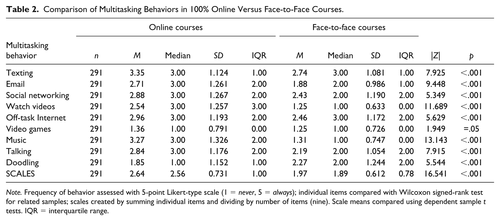

Students multitask (on things unrelated to course work) more in online settings, study finds | Inside Higher Ed

Andrew Lepp wasn't surprised -- and wouldn't expect most people familiar with higher education to be surprised -- by the headline finding of a study he and several colleagues published last week: that students in online courses said they engaged in more noneducational multitasking than did their peers in in-person courses.

"I would have bet anything that students would have multitasked more in online courses," said Lepp, a professor of recreation, park and tourism management at Kent State University. "In that way this study just confirmed what's obvious."

Enjoying this article from Inside Digital Learning?
Sign up for the free weekly newsletter.
Popular Today From Inside Digital Learning

- [Federal rules on student-teacher interaction, accreditation of innovative programs set for overhaul](https://www.insidehighered.com/digital-learning/article/2019/04/09/federal-rules-student-teacher-interaction-accreditation)
- [Which is better -- reading in print or on-screen?](https://www.insidehighered.com/digital-learning/article/2017/08/16/which-better-reading-print-or-screen)

But "where it gets interesting," Lepp said of [the study he and his colleagues published](https://journals.sagepub.com/doi/full/10.1177/2158244018824505) this month in *Sage Open*, is in the finding that students who were deemed to have similar levels of inclination to multitask were much less likely to do so in face-to-face classes than in online courses.

What that suggests, Lepp said, is that something about in-person courses constrains students from engaging in the texting, web shopping and other behaviors that are widely shown as impeding learning.

What is that something? "The presence of the teacher and other students who might look sideways at a student who is multitasking," Lepp asserts.

Lepp and his co-authors -- Jacob E. Barkley, also an education professor at Kent State; Aryn C. Karpinski, an associate professor at Kent State; and Shweta Singh, a doctoral student at Purdue University -- have done significant work on students' use of smartphones and the relationship to academic success. They take as an article of faith that multitasking and other forms of distraction from academic work are problematic for students.

Their current study was inspired by an incident two years ago in which Lepp and Karpinski happened upon a student entering data into a spreadsheet on a desktop computer, streaming Netflix on a laptop and using headphones to listen to her smartphone. Asked what she was listening to, the student said, “‘Oh, that's my online biology course,’” according to Lepp. His reply: “Yikes!”

After scanning the literature and failing to find studies assessing the role of multitasking in online courses, the researchers undertook one. They asked a sample of nearly 300 Kent State students who had taken both fully online and face-to-face courses -- the vast majority of whom lived near the physical campus -- a series of questions about their behaviors in the two settings.

As seen in the table below, students said they were about 25 percent more likely to engage in the set of behaviors (listening to music, texting, social networking, internet browsing and the like) in online rather than in in-person courses.

Students who had greater "multitasking tendency" (as measured by something called the Polychronic-Monochronic Tendency Scale) were, unsurprisingly, more likely to multitask in online settings than were those who scored low on the test. But the same was not true in face-to-face courses.

"In other words," the researchers wrote, "students who have positive attitudes about multitasking and prefer to multitask appear to better control this academically disadvantageous behavior in face-to-face courses." They attribute the students' "control" heavily to what Lepp called the "norms of the classroom" -- essentially, pressure from peers or the instructor *not* to multitask.

Lepp and his colleagues are careful to note that many students who take online courses, particularly working adults and those far from physical campuses, do so because this is their best or only option.

The findings, then, are most relevant for undergraduate students with "sufficient access to traditional face-to-face courses -- that is, students already enrolled at traditional 'brick and mortar' universities and living on or near campus," they write. For those students, "those teaching online courses should place emphasis on discouraging students’ multitasking behavior while recognizing that the methods for doing so may be very different than in face-to-face courses." Additionally, "the developers of online courses should explore technological and pedagogical solutions aimed at keeping online learners focused on their primary task in the absence of a physically present instructor."

**Limitations of the Study**

Experts on online education took issue with multiple aspects of the Kent State study, even as they acknowledged that multitasking is a problem in many settings.

George Veletsianos, holder of the Canada Research Chair in Innovative Learning and Technology at [Royal Roads University](http://royalroads.ca/prospective-students/programs/education-and-technology), in British Columbia, cited a common complaint about research like this: the tendency to compare online and face-to-face courses as if all online courses (or all face-to-face courses, for that matter) were the same. Were the online courses synchronous or asynchronous? Were they predominantly lectures of did they engage students with active learning?

"A better (and fairer) comparison for this study," Veletsianos said in an email, "would have been between courses of the same modality that included variations in something like class size or pedagogy. Such an investigation would allow us to evaluate the question of whether students are more likely to multitask when enrolled in larger vs. smaller class sizes. Or, whether pedagogy has an impact on multitasking, which I suspect it does (e.g., are you more likely to multitask when listening to a lecture or when actively working in a group to develop a solution to a posed problem?)"

Laura Gibbs, an online instructor at the University of Oklahoma who blogs frequently about technology and learning, raised similar questions in [a blog post](https://community.canvaslms.com/people/laurakgibbs/blog/2019/02/18/attention-policing-and-online-proctoring-thoughts-on-a-study) entitled "Attention-Policing and Online Proctoring: Thoughts on a Study."

"Online and face-to-face are delivery modes; they are not course designs," she wrote. "To say that online courses are alike because they are online is like saying that rocky road ice cream and tater tots are the same because you find them in the freezer section. Yes, being frozen is an important part of rocky road ice cream and of tater tots, but that does not mean they are the same thing … Studying online courses versus face-to-face courses is meaningless unless you know more about the courses in question, and about the students, than just the delivery mode."

Gibbs also balked at the researchers' suggestion that it would be an improvement to limit students' ability to multitask in online settings in the same way they might feel restricted in face-to-face courses.

"Is policing, in-person or remotely, the best way to help students develop better self-awareness and self-regulation? I don't think so," she wrote. "One of the things I like about teaching online is that it means I can give the students so much more freedom, and also so much more responsibility, so that they can, perhaps, learn new things about the best strategies for their own learning."

If students *choose* to multitask, she argues, they might have good reasons to do so: because they need more information to understand something, they're cramming for a test in another course -- or because they are bored, which just might be the professor's fault, she says.

"We need to ask students about their reasons, and students need to learn to interrogate their own reasons," Gibbs writes. "That's how you develop self-regulation. Sweeping generalizations, especially technophobic generalizations, are not going to help."

Veletsianos agreed that understanding why students are multitasking is essential for suggesting possible solutions. "Are they engaging in such behavior because our pedagogies are uninteresting, because other media are distracting them, because they believe they can multitask when in actuality this is rarely the case?" he said. "The former might require us rethinking how we teach, while the latter might require us to equip student with better study skills."

What might instructors or institutions do to diminish multitasking that *is* distracting? Might social pressure work?

"Assuming that social pressure reduces the incidence of multitasking, pedagogical practices that heighten instructor-student and student-student interactions might reduce multitasking," Veletsianos wrote. "One could include further opportunities for collaborative problem solving or small-group tutorials. In theory, reducing the amount of time that students work in isolation might reduce multitasking. Another approach might involve including information in assignments/activities that exert social pressure intended to reduce multitasking. For instance, one could imagine a timed assignment in which students are given 60 minutes to solve a problem and prior to the start of the activity they are provided a message that says something similar to this: ‘peers who multitask have reported the following X negative consequences’ (e.g., not being able to finish on time, earning a lower grade, and so on)."