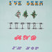
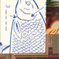
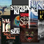
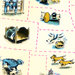
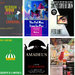

Summer Reading - The New York Times

   [# Book Review](https://www.nytimes.com/section/books/review)

## Summer Reading

## Thrillers

- **THE LAST FLIGHT**,  by Julie Clark   ✦

- **THIS IS HOW I LIED**,  by Heather Gudenkauf   ✦

- **THE GUEST LIST**,  by Lucy Foley   ✦

- **THE CHOICE**,  by Gillian McAllister   ✦

- **THESE WOMEN**,  by Ivy Pochoda   ✦

- **A GOOD MARRIAGE**,  by Kimberly McCreight   ✦

- **CLEAN HANDS**,  by Patrick Hoffman

 

 By [Sarah Lyall](https://www.nytimes.com/by/sarah-lyall)

What if you could spend the next three months doing nothing but lying around reading escapist fiction, with a margarita or a bowl of cherries or a massive Toblerone bar — or all three — at your fingertips? If there were ever a time to distract yourself with the dismaying and often preposterous predicaments of characters unlucky enough to be the protagonists of thrillers, that time is now. The more outrageous, the better.

Switching identities with someone sounds so alluring, particularly now that we’re stuck at home with nothing but our own diminishing resources. Let’s get out of here! But of course all that means is trading one set of problems for another, as Julie Clark reminds us in **THE LAST FLIGHT (Sourcebooks Landmark, 311 pp., $26.99).**

### Related Articles

- [   Need a Distraction? These Thrillers Will Have You on the Edge of Your Seat    By Sarah Lyall](https://www.nytimes.com/2020/03/20/books/review/suspense-thrillers.html)

- [   Cunning, Damaged and Deranged: The Latest Thrillers by Women    By Ivy Pochoda](https://www.nytimes.com/2019/10/25/books/review/godmother-hannelore-cayre-thrillers-by-women.html)

## True Crime

- **GONE AT MIDNIGHT**,  by Jake Anderson   ✦

- **MURDER IN THE GARMENT DISTRICT**,  by David Witwer and Catherine Rios   ✦

- **THE KIDNAP YEARS**,  by David Stout   ✦

- **THE WOMAN ON THE WINDOWSILL**,  by Sylvia Sellers-Garcia   ✦

- **MURDER, WITCHCRAFT AND THE KILLING OF WILDLIFE**,  by Stephen R. Matthews

 

 By Marilyn Stasio

The first thing you want to know when you begin reading a true-crime story is why the author chose to write about that particular crime. Did he or she play a direct role in the crime or its investigation? Were they somehow intimately involved? Or was it for the same reason that we’re reading — the story was just irresistibly interesting?

Me, I’m a sucker for cursed settings (like the Cecil Hotel), appalling crimes (like the Lindbergh baby kidnapping) and really stupid fails (like the kidnappers who forgot to ask for ransom money). All of these are represented in the crimes I’ve lined up for you, along with some others almost too outlandish to describe.

### Related Articles

- [   50 States of True Crime    By Tina Jordan and Ross MacDonald](https://www.nytimes.com/2019/07/26/books/50-states-of-true-crime.html)

- [   Decades After Two Murders, an Appalachian Town Grapples With the Crimes    By Melissa Del Bosque](https://www.nytimes.com/2020/01/20/books/review/third-rainbow-girl-emma-copley-eisenberg.html)

## Historical Fiction

- **THE EVERLASTING**,  by Katy Simpson Smith   ✦

- **CONJURE WOMEN**,  by Afia Atakora   ✦

- **AN ELEGANT WOMAN**,  by Martha McPhee   ✦

- **THE VANISHING SKY**,  by L. Annette Binder   ✦

- **THE PELTON PAPERS**,  by Mari Coates   ✦

- **MORE MIRACLE THAN BIRD**,  by Alice Miller   ✦

- **MISS AUSTEN**,  by Gill Hornby   ✦

- **THE OTHER BENNET SISTER**,  by Janice Hadlow

 

 By Alida Becker

History, it’s said, is written by the winners — and that usually means men. But in the realm of historical fiction, women have plenty of opportunity to take their revenge, and right now Hilary Mantel isn’t the only one doing it. In fact, there’s a small army of women offering their own slant on what life was like for our ancestors, near or far, famous or obscure. Here are some of them — and they’re all winners.

Katy Simpson Smith’s **THE EVERLASTING (****Harper****/HarperCollins****, 352 pp.,**** $27.99)** could only have been set in Rome, where history’s layers are visible every day and, as one of her characters remarks, “You cannot move forward … only up or down.” Each of the four central figures in her storytelling — divided by centuries but not by their emotional quandaries — experiences the city in a different way.

### Related Articles

- [   Why Are We Living in a Golden Age of Historical Fiction?    By Megan O’Grady](https://www.nytimes.com/2019/05/07/t-magazine/historical-fiction-books.html)

- [   Fiction That Takes You Back in Time    By Emma L. McAleavy](https://www.nytimes.com/2019/11/07/books/review/historical-fiction-shortlist.html)

## Sports

- **BOUTON**,  by Mitchell Nathanson   ✦

- **THE HOT HAND**,  by Ben Cohen   ✦

- **THE INSIDE GAME**,  by Keith Law   ✦

- **THE VICTORY MACHINE**,  by Ethan Sherwood Strauss   ✦

- **WAVE WOMAN**,  by Vicky Heldreich Durand   ✦

- **THE MAKING OF A MIRACLE**,  by Mike Eruzione

 

 By John Swansburg

“Take your pants off, Bouton. We’ve got a long night ahead of us.” It sounds like a line from a story about ballplayers being ballplayers — the sort of ribald yarn that made [Jim Bouton’s](https://www.npr.org/2012/04/26/151457344/ball-four-the-book-that-changed-baseball)[classic tell-all “Ball Four”](https://www.npr.org/2012/04/26/151457344/ball-four-the-book-that-changed-baseball) notorious among baseball’s old guard and irresistible to its fans.

This particular command to disrobe, however, was spoken by the grizzled [New York Post reporter Leonard Shecter](https://www.nytimes.com/1974/01/20/archives/leonard-shecter-sportswriter-ball-four-co-author-is-dead-like-a.html), who edited “Ball Four.” It was his standard greeting when Bouton would arrive at his un-air-conditioned apartment during the summer of 1969. Bouton, a former 20-game winner for the Yankees, was by then attempting to hang on to a fading career by reinventing himself as a knuckleballer for the expansion Seattle Pilots. He was also embarking on a second career, as a writer. Whenever the Pilots’ schedule took him to New York, he would visit Shecter’s sweaty rooms and the two pants-less men would pore over Bouton’s notes, jotted down on hotel stationery, envelopes, airsickness bags and toilet paper.

### Related Articles

- [   A Man of Few Words, 90% of Them Memorable    By John Williams](https://www.nytimes.com/2020/04/12/books/yogi-berra-biography-jon-pessah-interview.html)

- [   The Future Is Here, and Uncomfortably Close to Home    By Karen Thompson Walker](https://www.nytimes.com/2020/02/11/books/review/the-resisters-gish-jen.html)

## Music

- **RESISTANCE**,  by Tori Amos   ✦

- **MORE MYSELF**,  by Alicia Keys with Michelle Burford   ✦

- **THE CLUB KING**,  by Peter Gatien

 

 By [Lauretta Charlton](https://www.nytimes.com/by/lauretta-charlton)

Oh, the ’90s. How special you were with your plaid shirts, midriffs, Lilith Fairs, gangsta rap and boy bands. I don’t feel nostalgic for you, exactly, but you’re never far from my mind, especially your music, which is interesting because so much about music has changed since you were here, starting with the business itself. Today aspiring artists write rap songs about horses and cowboy boots, put them on SoundCloud and, against all odds, go on to delight the entire country, with an able assist from Billy Ray Cyrus, whose biggest hit was released in 1992. There are no massive brick-and-mortar record stores. There are no release schedules that music critics can rely on to plan their reviews. In many ways, what I love about you is that you now seem so tidy and predictable. This, I imagine, is what makes reading books about artists and other music types who came up during the ’90s — that bygone era when labels were still flush, there was no Spotify and people still waited hours to get into nightclubs — so quaint and entertaining.

And thus I went into Tori Amos’s new book, **RESISTANCE: A Songwriter’s Story of Hope, Change, and Courage (Atria, 261 pp., $26),** with an open mind, ready to feel old. Amos has maintained an impressive career since her first solo album, “Little Earthquakes,” in 1992. And as you might expect from the title of her latest book — or from anyone who writes lyrics about rape, religion and the patriarchy, for that matter — she is uncompromising and very earnest about the power of music to effect change, just like that friend from high school who practiced Wicca and carried amethyst in her pocket.

### Related Articles

- [   Dance This Mess Around: When Georgia Recreated Rock ’n’ Roll    By Richard Fausset](https://www.nytimes.com/2020/04/02/books/review/cool-town-athens-music-grace-elizabeth-hale.html)

- [   For Loretta Lynn, Books Are ‘Friends That Keep Me Company’](https://www.nytimes.com/2020/04/16/books/review/loretta-lynn-by-the-book-interview.html)

Advertisement

## Cooking

- **BEYOND THE NORTH WIND**,  by Darra Goldstein   ✦

- **THE IRISH COOKBOOK**,  by Jp McMahon   ✦

- **THE BOOK OF ST. JOHN**,  by Fergus Henderson and Trevor Gulliver   ✦

- **SEE YOU ON SUNDAY**,  by Sam Sifton   ✦

- **MEALS, MUSIC, AND MUSES**,  by Alexander Smalls with Veronica Chambers   ✦

- **THE PHOENICIA DINER COOKBOOK**,  by Mike Cioffi, Chris Bradley and Sara B. Franklin   ✦

- **HOW TO DRESS AN EGG**,  by Ned Baldwin and Peter Kaminsky

 

 By Jennifer Reese

One hundred and six recipes. Frankly, I was a bit embarrassed when I counted the lentil soups, Russian salts, creamy diner puddings, bacon cheeseburger tacos, antique Irish whiskey drinks and sheet pans of roasted broccoli that I made between February and the first week of April while evaluating the best cookbooks of the season. Weren’t there better ways I could have spent that time, like, say, sewing masks? Yes, but when you’re quarantined at home with a lot of nervous energy, a thigh-high stack of cookbooks and an assignment, it’s easy to get carried away.

It was hard to choose the best of these books. There are so many wonderful titles this year, books that will introduce you to novel pasta shapes from underexplored corners of Italy and others that will help you eat more vegetables. In the end, though, there were seven books in the stack I kept reaching for to try new recipes, reread engrossing essays tucked between those recipes or study photographs that transported me beyond the four walls of my home.

### Related Articles

- [   Kitchen Confidential: Three Culinary Memoirs    By Lisa Abend](https://www.nytimes.com/2020/05/01/books/review/chef-memoirs-bill-buford-dirt.html)

- [   The Most Important (and Literary?) Meal of the Day    By Dwight Garner](https://www.nytimes.com/2020/05/06/books/breakfast-in-literature.html)

## Hollywood

- **MORE THAN LOVE**,  by Natasha Gregson Wagner   ✦

- **I’M YOUR HUCKLEBERRY**,  by Val Kilmer   ✦

- **DOLLS! DOLLS! DOLLS!**,  by Stephen Rebello

 

 By [Caryn James](https://www.nytimes.com/by/caryn-james)

Books about Hollywood are always, at heart, about fame in all its frivolity or, in the case of Natasha Gregson Wagner, its darkness. Imagine waking up as an 11-year-old at a sleepover and hearing on the radio that your mother has died. For most of us that would be no more than a nightmare. It was real and one of the costs of fame for Wagner, who begins her graceful, loving memoir of her mother, Natalie Wood, with an affecting account of waking to news that she had drowned. **MORE THAN LOVE: An Intimate Portrait of My Mother, Natalie Wood (Scribner, 293 pp., $28) **is the best of a crop of new books that take us into the turbulent world of stardom.

Wagner’s book is part biography of Wood and part autobiography about how her mother’s early death shaped her own adult life, with decades of anxiety and insecurity. Wagner was a child of Hollywood. Her father, the producer Richard Gregson, and Wood divorced when Natasha was an infant. Her mother remarried her first husband, the actor Robert Wagner, a situation Natasha found “perfectly unremarkable.” She called her fathers Daddy Gregson and Daddy Wagner.

### Related Articles

- [   The Good, the Bad and the Ugly: A Neurotic Filmmaker’s Life Story    By Dave Itzkoff](https://www.nytimes.com/2020/03/10/books/review/barry-sonnenfeld-call-your-mother-barry-sonnenfeld.html)

- [   My Sister, My Daughter: Behind the Scenes of a Great American Film    By Mark Horowitz](https://www.nytimes.com/2020/02/12/books/review/the-big-goodbye-chinatown-sam-wasson.html)

Advertisement

## Horror

- **THE RETURN**,  by Rachel Harrison   ✦

- **THE ONLY GOOD INDIANS**,  by Stephen Graham Jones   ✦

- **THE SOUTHERN BOOK CLUB’S GUIDE TO SLAYING VAMPIRES**,  by Grady Hendrix   ✦

- **DEVOLUTION**,  by Max Brooks   ✦

- **THE BEETLE**,  by Richard Marsh   ✦

- **CATHERINE HOUSE**,  by Elisabeth Thomas   ✦

- **THE UNSUITABLE**,  by Molly Pohlig

 

 By Danielle Trussoni

Have you ever wanted to vanish? Not go invisible, but exit your life for a year, maybe two, and see where things stand when you get back? In Rachel Harrison’s debut, **THE RETURN (Berkley, 296 pp., $26),** a group of friends grapple with the disappearance, and mystifying return, of one of their own.

Once best friends, Mae, Molly, Elise and Julie went their separate ways after college. Now Mae works in fashion and dates models in New York. Molly, who lost part of a leg to cancer as a child, is a television producer in Los Angeles. Julie, an aspiring actress, married a high school crush and opened a bed-and-breakfast, only to realize that she made a mistake and should live in “L.A. or New York, not small-town Maine.” And Elise, who narrates the novel, abandoned her master’s degree only to end up emotionally paralyzed in a studio apartment in Buffalo.

### Related Articles

- [   The Essential Stephen King    By Gilbert Cruz](https://www.nytimes.com/interactive/2020/05/04/arts/best-stephen-king-books.html)

- [   Gothic Horror Fiction, Old and New    By Danielle Trussoni](https://www.nytimes.com/2020/03/13/books/review/new-horror-fiction-jess-kid-things-in-jars.html)

## Romance

- **AMERICAN SWEETHEARTS**,  by Adriana Herrera   ✦

- **BEACH READ**,  by Emily Henry   ✦

- **SAY YES TO THE DUKE**,  by Eloisa James   ✦

- **CONVENTIONALLY YOURS**,  by Annabeth Albert   ✦

- **WHEN YOU WISH UPON A ROGUE**,  by Anna Bennett   ✦

- **THE RAKESS**,  by Scarlett Peckham   ✦

- **DARING AND THE DUKE**,  by Sarah MacLean

 

 By Jaime Green

You don’t need an excuse to read romance, though if one helps, I won’t object. Say you want something steamy in summer or cozy in winter, or the state of the world has you desperate for a literary happy ending. Say you want to explore traditional gender roles, or invert them, or find a way to happiness through them or despite. Say you want to go to a game convention, a tropical island, a magical garden or a sparkling lake, with a writer, an architect, a feminist activist, a duke or another duke. For any of those excuses, or none at all, here are seven new romances to sweep you away.

Maybe the most romantic being swept away is by someone you’ve known almost your whole life. **AMERICAN SWEETHEARTS (Carina Press****, 284 pp., paper, $****8.99)****,** the fourth book in Adriana Herrera’s Dreamers series (though it works beautifully alone), opens about a year after the high school sweethearts Priscilla and Juan Pablo have broken up for what really seems to be the last time. They’ve had a rocky relationship ever since Priscilla enrolled in the police academy but Juan Pablo, instead of joining her there as planned, went to grad school instead. Now, in their early 30s, the last break seems to have stuck — until a friend’s wedding in the Dominican Republic brings them back together. But it’s not a tropical whirlwind, nor proximity, nor the ample pressure from family and friends, that gets Priscilla and Juan Pablo past everything keeping them apart. It’s working honestly and bravely through their issues. That’s swoon-worthy, in my opinion, but don’t worry if it sounds staid — this book is sweet and thoughtful, but delightfully filthy, too. (While Priscilla and Juan Pablo have to work hard on emotional honesty, they’ve been together long enough to be extremely comfortable with all of their predilections in bed.) Another swoon for the realist romantic: Juan Pablo has been in therapy for a year. We get to see Priscilla discover how he’s changed, and we see from his point of view the work that goes into changing yourself. He makes space for her, but doesn’t push her. Every moment in their love story feels beautifully earned.

### Related Articles

- [   50 States, 50 Love Stories    By Tina Jordan and Elisabeth Egan](https://www.nytimes.com/2020/02/10/books/50-states-50-love-stories.html)

- [   Beverly Jenkins Really Needs to Buy More Bookcases](https://www.nytimes.com/2020/04/02/books/review/beverly-jenkins-by-the-book-interview.html)

Advertisement

## Travel

- **LEAVE ONLY FOOTPRINTS**,  by Conor Knighton   ✦

- **THE MUSEUM OF WHALES YOU WILL NEVER SEE**,  by A. Kendra Greene   ✦

- **SOVIETISTAN**,  by Erika Fatland   ✦

- **FEASTING WILD**,  by Gina Rae La Cerva

 

 By [Sebastian Modak](https://www.nytimes.com/by/sebastian-modak)

Nothing tests the transportive abilities of a good travel book like an unprecedented global shutdown. As the coronavirus swept across the world, planes were grounded, cruise ships were docked, hotel rooms collected dust and phone systems were jammed with millions of people trying to cancel their spring and summer trips. Suddenly, if we wanted to escape the confines of our neighborhood, we had only our memories of trips past and our daydreams of trips future to depend on. But where those reach their limits, books take over. We have always relied on a good story to take us even just a little bit outside our own reality, an escapism we crave now more than ever.

The “CBS Sunday Morning” correspondent Conor Knighton was in search of his own escape when he conceived of **LEAVE ONLY FOOTPRINTS: My Acadia-to-Zion Journey Through Every National Park (Crown, 323 pp., $28).** After his fiancée unexpectedly called off their engagement, Knighton found himself unsure of how to process his heartbreak. Timing offered some inspiration. With 2016, the centennial of the National Park Service, fast approaching, Knighton proposed an idea to his bosses at CBS: a series that would have him visiting every one of the 59 national parks (three more have been added since 2016) over the course of the centennial year. Network executives met him halfway, funding a trip to some of them, with Knighton filling in the gaps. He had found his purpose, at least for a year.

### Related Articles

- [   52 Books for 52 Places    By Concepción de León](https://www.nytimes.com/2020/02/28/books/travel-reading-52-books-for-52-places-2020.html)

- [   Holiday Books    By The New York Times](https://www.nytimes.com/interactive/2019/books/travel-books-gifts.html)

Follow New York Times Books on [Facebook](https://www.facebook.com/nytbooks/), [Twitter](https://twitter.com/nytimesbooks) and [Instagram](https://www.instagram.com/nytbooks), sign up for [our newsletter](https://www.nytimes.com/newsletters/books-review) or [our literary calendar](https://www.nytimes.com/interactive/2017/books/books-calendar.html). And listen to us on the [Book Review podcast](https://www.nytimes.com/column/book-review-podcast).

Illustrations by Igor Bastidas. Art direction by Matthew Dorfman. Photo research by Erica Ackerberg and James Pomerantz. Designed and produced by Aliza Aufrichtig and Gray Beltran.

**Correction:** May 21, 2020

An earlier version of this article misstated the title of a novel by Grady Hendrix. It is “The Southern Book Club’s Guide to Slaying Vampires” (not “Killing Vampires”).