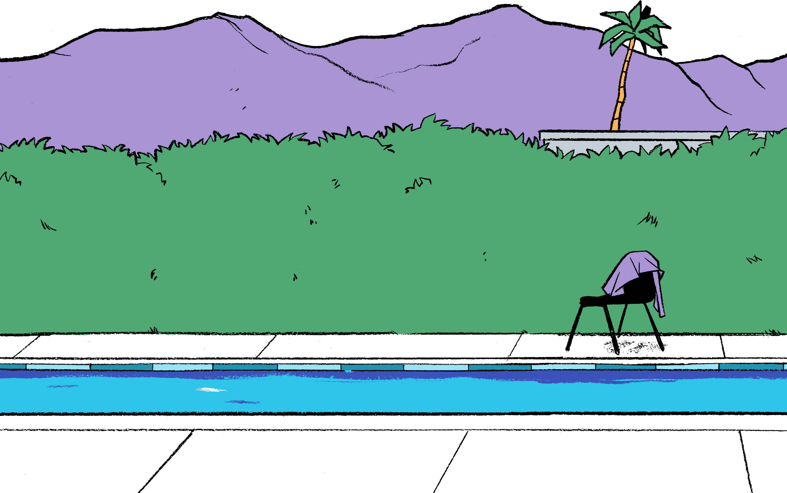
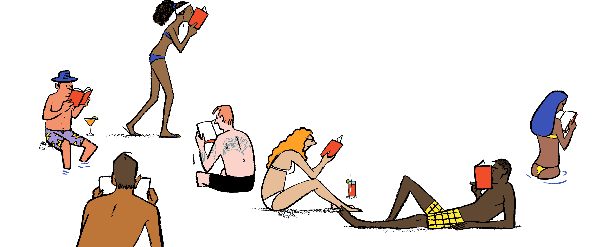
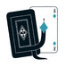
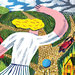

Summer Reading

## Summer Reading

Dive in! Here are 75 of the latest and greatest books to keep you company as temperatures climb and days grow long.

   

  

 
We’re finally here.

The season of beach days and barbecues, kayaking and catnapping, hammocks and homemade popsicles. Maybe you’ll be headed to the lake or a tucked-away cottage, even a tent pitched in the backyard.

Wherever you go, go prepared. Sunscreen is a must. Bottles of water essential.
And never, ever forget to bring a book.

We’ve rounded up some glorious new titles to keep any reader happy, hydrated and cool: pulse-pounding thrillers, delectable cookbooks, eerie true-crime stories to stand your hair on end. Historical fiction and travel books will help you dream of faraway eras and places. Sports and music fans will find reasons to cheer. New thrillers turn the genre on its head, and books on the great outdoors will satisfy even the most nature-averse.

So here’s your chance to get away from it all by getting into a book.

 

## Thrillers

- **Cari Mora**   by Thomas Harris   ●

- **Beyond All Reasonable Doubt**   by Malin Persson Giolito   ●

- **A Nearly Normal Family**   by M.T. Edvardsson   ●

- **All the Lost Things**   by Michelle Sacks   ●

- **Into the Jungle**   by Erica Ferencik   ●

- **The Paper Wasp**   by Lauren Acampora   ●

- **Temper**   by Layne Fargo

By [VANESSA FRIEDMAN](https://www.nytimes.com/by/vanessa-friedman)

- [**Twitter](#)
- [**Facebook](#)

It is perhaps not a major publishing plot twist that, almost two years after the #MeToo movement burst into public consciousness and began to change the conversation around gender, power and who gets a seat at what table; a year and a half after women in pop culture, sports and Hollywood began speaking up about equal opportunity; and at a time when there are more women in Congress than ever before, proving they can be just as belligerent and forceful as their male colleagues, the traditionally male-dominated world of the thriller has been ceding ground to a different kind of hero(ine).

For so long, after all, the most chart-busting thriller novels were the province of the robotic but moral special ops guy, the dissolute unshaven detective, the beefy brawler with a soul. For so long the ads in the subways and in newspapers touted boldface names like Jack Reacher, Gabriel Allon and Harry Bosch. Even J.K. Rowling adopted a male pseudonym, Robert Galbraith, to write her post-Potter adult thriller series, which centers on a disabled male private eye called Cormoran Strike.

 [Read more](https://www.nytimes.com/interactive/2019/books/best-thrillers.html)

### Related Articles

- [   A Cannibal, a Dead Viscount and a Case of Stolen Sand    By Marilyn Stasio](https://www.nytimes.com/2019/04/19/books/review/new-crime-fiction.html)

- [   The Cracking of a Cold, Cold Case    By Robert Kolker](https://www.nytimes.com/2019/04/02/books/review/last-stone-mark-bowden.html)

Advertisement

[      The truth is worth it.         See the stories               ](https://adclick.g.doubleclick.net/pcs/click?xai=AKAOjss8YneyM4-VWnCSWv6RrJIx7eOcMBPNXOBI2ZnjsmylJgTeeEwR61xlaAm4yR8QIhWWPoypWR94d8FR7vQUn38n4uIfoZShxT5w3QDD7zKla-X2wGWh0pICJ3shU0J0Uuq5cyK7RcanJGUelQn9IepVy--1g8bJfCh29IbmlaIafscFM88M0yy-0i96KRJLen43v3_ToKIW0Wgqi-_qzMjlVVzwIbdFh52yWC7iMZ78gYMhnqMcK-2u_LU&sig=Cg0ArKJSzK2AZP6bEy7jEAE&urlfix=1&adurl=https://ad.doubleclick.net/ddm/trackclk/N296811.6440THENEWYORKTIMESCOMPA/B22187340.237970964%3Bdc_trk_aid%3D435228218%3Bdc_trk_cid%3D111025435%3Bdc_lat%3D%3Bdc_rdid%3D%3Btag_for_child_directed_treatment%3D%3Btfua%3D)

 

## Travel

- **Seven at Sea**   by Erik Orton and Emily Orton   ●

- **The Salt Path**   by Raynor Winn   ●

- **This Much Country**   by Kristin Knight Pace   ●

- **In Putin's Footsteps**   by Nina Khruscheva and Jeffrey Tayler   ●

- **Lotharingia**   by Simon Winder   ●

- **Ottoman Odyssey**   by Alev Scott   ●

- **Volcanoes, Palm Trees and Privilege**   by Liz Prato   ●

- **Pagan Light**   by Jamie James   ●

- **See You in the Piazza**   by Frances Mayes   ●

- **Off the Rails**   by Beppe Severgnini   ●

- **Monsieur Mediocre**   by John von Sothen   ●

- **A Year in Paris**   by John Baxter

By LIESL SCHILLINGER

- [**Twitter](#)
- [**Facebook](#)

What do you need to know about the places you’re going? A dozen new books answer this question in strikingly idiosyncratic ways, wreathing their authors’ wanderings in vivid back story — sometimes emotional, sometimes empirical, sometimes imperial — enveloping the reader in a kind of legible Sensurround. These books ought to come with 3-D glasses and a soundtrack.

Five years ago, the Manhattanites Erik and Emily Orton, beleaguered but buoyant parents of five children between the ages of 6 and 16, hadn’t even plotted an itinerary when they bought a 38-foot catamaran (sight unseen), flew to a Caribbean harbor and set sail on a Swiss-Family-Robinson-style adventure. “Based on our best budgeting,” Erik calculated, “we’d saved enough money to sail for a year. After that we’d be broke.” Like her husband, Emily wanted to “pursue a dream so big there was room for my whole family” before their eldest left for college. Their time on the boat would be that dream. Where would they go? They didn’t know, but their shipboard byword became, “It will emerge.” In **SEVEN AT SEA: Why a New York City Family Cast Off Convention for a Life-Changing Year on a Sailboat (Shadow Mountain, $27.99),** husband and wife take turns narrating the story of their voyage, chronicling the crests and troughs of their seaborne experience. Five months in, anchored in Virgin Gorda Sound, they woke to “the blue and green water rolling past, the sun coming up in the east, the trade-wind breeze cooling the morning, the flag flapping.” Where would they go next? Anegada? Tortola? Puerto Rico? It would emerge.

 [Read more](https://www.nytimes.com/interactive/2019/books/best-travel-books.html)

### Related Articles

- [   Where to Have Your Existential Crisis: Ann Arbor or Rome?    By Erica Wagner](https://www.nytimes.com/2019/03/25/books/review/brad-leithauser-promise-of-elsewhere.html)

- [   Two Thai Novelists Explore Bangkok’s Swirl of Remembering and Forgetting    By Hannah Beech](https://www.nytimes.com/2019/04/04/books/review/bangkok-veeraporn-nitiprapha-pitchaya-sudbanthad.html)

 

## Sports

- **Ballpark**   by Paul Goldberger   ●

- **When the Crowd Didn't Roar**   by Kevin Cowherd   ●

- **The World's Fastest Man**   by Michael Kranish   ●

- **The Cost of These Dreams**   by Wright Thompson   ●

- **The Great American Sports Page**   edited by John Schulian   ●

- **Sprawlball**   by Kirk Goldsberry

By JOHN SWANSBURG

- [**Twitter](#)
- [**Facebook](#)

The baseball park is a peculiar space. As [Paul Goldberger](https://www.paulgoldberger.com/) allows in **BALLPARK: Baseball in the American City ****(Knopf, $35)**, “most of the best ballparks have not, in fact, been particularly memorable pieces of architecture by any formal standard.” In 1911, when the 37-year-old James McLaughlin was commissioned to design one, he had never worked on such a structure before, and never would again. “If he knew of Frank Lloyd Wright and other modernist architects who were beginning to challenge traditional ways of designing buildings,” Goldberger writes, “he probably did not agree with them.” The project this unadventurous soul undertook would be known as Fenway Park.

Martin F. Nolan, a reporter at The Boston Globe, later described the home of the Red Sox as “a crazy-quilt violation of city planning principles” and “an irregular pile of architecture.” These were meant as compliments. What McLaughlin’s design lacked in formal grandeur, it made up for in what Goldberger describes as its “benign quirkiness”: the ad hoc arrangement of its grandstands, its famously shallow left field.

 [Read more](https://www.nytimes.com/interactive/2019/books/best-sports-books.html)

### Related Articles

- [   A History of Baseball in 10 Pitches    By Ada Calhoun](https://www.nytimes.com/2019/05/21/books/review/baseball-history-in-10-pitches-tyler-kepner.html)

- [   A Dark Fairy Tale of American Oddballs and Candlepin Bowling    By Cathleen Schine](https://www.nytimes.com/2019/02/12/books/review/elizabeth-mccracken-bowlaway.html)

Advertisement

 

## True Crime

- **Murder by the Book**   by Claire Harman   ●

- **Where Monsters Hide**   by M. William Phelps   ●

- **City of Omens**   by Dan Werb   ●

- **The Five**   by Hallie Rubenhold   ●

- **The Belle of Bedford Avenue**   by Virginia A. McConnell   ●

- **Norco '80**   by Peter Houlahan

By MARILYN STASIO

- [**Twitter](#)
- [**Facebook](#)

Don’t let anyone tell you that a preoccupation with real-life murders and murderers is morbid. Morbid is dashing off to Paris every other week to gape at the corpses on public display at the city morgue, which is what Charles Dickens and his friend Wilkie Collins did for fun. Morbid is expecting an entire nation to wear black because you are personally in deepest mourning, which is what Queen Victoria did when her beloved Prince Albert died. Morbid is collecting 19th-century deathbed portraits — although I doubt those half-dozen vintage photos on my desk constitute a “collection.”

Speaking of Queen Victoria, she was scandalized by the violent death of Lord William Russell, as recounted by Claire Harman in **MURDER BY THE BOOK: The Crime That Shocked Dickens’s London (Knopf, $26.95).** “This is really too horrid!” the young monarch reportedly wrote in her diary about the events of May 6, 1840. “It is almost an unparalleled thing for a person of Ld William’s rank, to be killed like that,” she remarked, referring to the manner of his death. As Harman reports it: “His throat cut so deeply that the windpipe was sliced right through and the head almost severed.”

 [Read more](https://www.nytimes.com/interactive/2019/books/best-true-crime.html)

### Related Articles

- [   The True-Crime Story That Harper Lee Tried and Failed to Write    By Michael Lewis](https://www.nytimes.com/2019/05/06/books/review/casey-cep-furious-hours-harper-lee.html)

- [   ‘Say Nothing’ — Part History, Part True Crime — Illuminates the Bitter Conflict in Northern Ireland    By Roddy Doyle](https://www.nytimes.com/2019/02/22/books/review/say-nothing-patrick-radden-keefe.html)

 

## Music

- **William S. Burroughs and the Cult of Rock 'N' Roll**   by Casey Rae   ●

- **This Searing Light, The Sun and Everything Else**   by Jon Savage   ●

- **More Fun in the New World**   by John Doe with Tom DeSavia   ●

- **CSNY**   by Peter Doggett   ●

- **Crosby, Stills, Nash & Young**   by David Browne   ●

- **Chamber Music**   by Will Ashon

By JAMES PARKER

- [**Twitter](#)
- [**Facebook](#)

Kurt Cobain revered him, as did David Bowie. To Patti Smith he was “up there with the pope.” Bob Dylan, gushing about him to his friend Allen Ginsberg, said, “Tell him I’ve been reading him and that I believe every word he says.” Iggy Pop put him in a Stooges song. And Jello Biafra, of the Dead Kennedys, used his methods to help him write lyrics.

Yes, across the rock ’n’ roll generations, they all loved William Burroughs. For the pre-punks and the punks and the post-punks, he was the literary man of choice. And Burroughs, after his fashion, loved them back. Creakingly he conferred his presence upon them — his mind like a rustling of locusts, his antique courtesies and his psychotic-futuristic worldview. When the Sex Pistols got into hot water over their single “God Save the Queen,” he wrote them an encouraging letter.

 [Read more](https://www.nytimes.com/interactive/2019/books/best-music-books.html)

### Related Articles

- [   By the Book: Ani DiFranco](https://www.nytimes.com/2019/05/15/books/review/by-the-book-ani-difranco.html)

- [   Run-DMC, Aerosmith and the Song That Changed Everything    By Baz Dreisinger](https://www.nytimes.com/2019/02/13/books/review/walk-this-way-geoff-edgers.html)

Advertisement

 

## Horror

- **The Hunger**   by Alma Katsu   ●

- **Little Darlings**   by Melanie Goldberg   ●

- **Song for the Unraveling of the World**   by Brian Evenson   ●

- **The Nest**   by Gregory A. Douglas   ●

- **When Darkness Loves Us**   by Elizabeth Engstrom   ●

- **The Laws of the Skies**   by Grégoire Courtois   ●

- **Inspection**   by Josh Malerman   ●

- **Flight or Fright**   edited by Stephen King and Bev Vincent

By DANIELLE TRUSSONI

- [**Twitter](#)
- [**Facebook](#)

There’s nothing quite like summer to make me long for horror fiction. I can’t say why, but on hot and bright afternoons, when the sky is cerulean and the air thick with the scent of cut grass, my imagination bends toward shadowy spaces. So it’s no surprise that, when I’m piling up books for summer reading, my choices veer to the dark side.

 [Read more](https://www.nytimes.com/interactive/2019/books/best-horror-novels.html)

### Related Articles

- [   Spine-Chilling and Flesh-Crawling: The Latest Horror Fiction    By Danielle Trussoni](https://www.nytimes.com/2019/03/28/books/review/new-horror-fiction.html)

- [   The Book That Terrified Neil Gaiman. And Carmen Maria Machado. And Dan Simmons.](https://www.nytimes.com/2018/07/16/books/review/author-recommended-scary-books.html)

 

## Historical Fiction

- **The Daughter's Tale**   by Lucas Correa   ●

- **Mistress of the Ritz**   by Melanie Benjamin   ●

- **The Spies of Shilling Lane**   by Jennifer Ryan   ●

- **A Bend in the Stars**   by Rachel Barenbaum   ●

- **The Red Daughter**   by John Burhham Schwartz   ●

- **American Princess**   by Stephanie Marie Thornton   ●

- **Paris, 7 A.M.**   by Liza Wieland

By SUSAN ELLINGWOOD

- [**Twitter](#)
- [**Facebook](#)

Novels set during World War II can seem dismayingly similar: Families are separated, dangerous missions are undertaken, friends disappear. The books may be engrossing but the formulaic plots sometimes leave a reader wanting an unexpected twist.

Armando Lucas Correa’s** THE DAUGHTER’S TALE (Atria, $27)** inventively satisfies that want. What’s more, it’s better written and more tightly edited than most books in this genre, and the story line is breathtakingly threaded together from start to finish with the sound of a beating heart. Or more to the point, the silence between the heartbeats.

 [Read more](https://www.nytimes.com/interactive/2019/books/best-historical-fiction.html)

### Related Articles

- [   G. Willow Wilson Reimagines the Last Days of Moorish Spain    By Emily Barton](https://www.nytimes.com/2019/04/19/books/review/g-willow-wilson-bird-king.html)

- [   Cynthia Ozick Reviews Julie Orringer’s ‘The Flight Portfolio’    By Cynthia Ozick](https://www.nytimes.com/2019/05/02/books/review/flight-portfolio-julie-orringer.html)

Advertisement

 

## Cooking

- **Zaitoun**   by Yasmin Khan   ●

- **Black Sea**   by Caroline Eden   ●

- **My Mexico City Kitchen**   by Gabriela Cámara   ●

- **Indian(-ish)**   by Priya Krishna   ●

- **Vietnamese Food Any Day**   by Andrea Nguyen   ●

- **The Modern Cook's Year**   by Anna Jones   ●

- **Love & Lemons Every Day**   by Jeanine Donofrio   ●

- **Franklin Steak**   by Aaron Franklin and Jordan Mackay   ●

- **Simple Cake**   by Odette Williams   ●

- **Dappled**   by Nicole Rucker   ●

- **Happiness is Baking**   by Maida Heatter   ●

- **In Pursuit of Flavor**   by Edna Lewis with Mary Goodbody

By CHRISTINE MUHLKE

- [**Twitter](#)
- [**Facebook](#)

Spring and summer cookbooks are different from their fall and winter siblings, the big-name ones who get all the airtime. The authors’ names might be new, but their voices are strong and independent. They remind me of how the legendary cookbook author [Madhur Jaffrey](https://www.bbc.com/food/chefs/madhur_jaffrey), speaking at the recent women’s food conference [Cherry Bombe Jubilee](https://cherrybombe.com/jubilee-nyc), described her childhood: Because she was a girl, and since her sister was prettier, her parents let her run wild to satisfy her creative curiosity, thereby allowing her to become the significant person she is today. And so, as I read and cooked through this season’s assortment of outliers, I was thrilled to get to know so many bright minds and brilliant palates, to be introduced to cultures and techniques that hadn’t been front-burnered in my kitchen.

Israeli food has been celebrated since [Yotam Ottolenghi](https://ottolenghi.co.uk/) came on the scene over a decade ago. The culinary traditions of Palestine? Not so much. While working on a human rights campaign in Israel’s West Bank in 2009, [Yasmin Khan](https://www.nytimes.com/2019/02/04/dining/yasmin-khan-zaitoun-palestinian-cookbook.html) found that the difficulty of the days spent in refugee camps relented at night when she was welcomed to local tables to sample bowls of thick hummus and smoky eggplant spiked with peppery olive oil, vibrant herb salads and fresh, sharply flavorful dishes — so flavorful that they lured Khan from her home in London back to Israel and the West Bank to learn more about the recipes and realities of life for the millions of Palestinians living there, not to mention the millions who make up the world’s largest refugee population. **ZAITOUN: Recipes From the Palestinian Kitchen (Norton, $29.95****)** is valuable not just for the dishes Khan learned from local women and translated from restaurant meals — be they a warm salad of maftoul (a plump kind of couscous) with za’atar chicken, Gazan lentils with Swiss chard and tahini, or turnovers made from a very forgiving yogurt-enriched dough and stuffed with spinach, feta, pine nuts and sumac — but for the heartfelt portrait she so deftly paints of this shattered but resilient region.

 [Read more](https://www.nytimes.com/interactive/2019/books/best-cookbooks.html)

### Related Articles

- [   To Nosh or Not to Nosh: An Immigrant’s Dilemma    By Max Watman](https://www.nytimes.com/2019/03/21/books/review/boris-fishman-savage-feast.html)

- [   Ruth Reichl Dishes on the Last Days of Gourmet Magazine    By Kate Betts](https://www.nytimes.com/2019/04/09/books/review/ruth-reichl-save-me-the-plums.html)

 

## The Great Outdoors

- **A Way to Garden**   by Margaret Roach   ●

- **The Kitchen Garden**   by Alan Buckingham   ●

- **Pruning Simplified**   by Steven Bradley   ●

- **Beginner Gardening Step by Step**   ●

- **Wings in the Light**   by David Lee Myers   ●

- **Blooms**   ●

- **The Tree Book**   by Michael A. Dirr and Keith S. Warren   ●

- **The Hidden Life of Trees**   by Peter Wohlleben   ●

- **The Secret Wisdom of Nature**   by Peter Wohlleben   ●

- **Sprout Lands**   by William Bryant Logan   ●

- **How to be a Good Creature**   by Sy Montgomery

By DOMINIQUE BROWNING

- [**Twitter](#)
- [**Facebook](#)

I was recently honored with an introduction to a beguiling new baby; her name is Selah, a mysterious Hebrew word that appears mostly in the Psalms. “Selah” is considered untranslatable. Perhaps it’s a musical notation, calling for a break in the singing of those gorgeous sacred songs, or it could be an invitation for instruments to join in; it might also relay an emphatic amen, a “forever,” or be an exclamation of praise. Whatever its meaning, it seems to invite a pause — to open up a space for the contemplation of what lingers in the air.

The word “selah” was on my mind as I pored over the season’s gardening books, each one of which, in its own way, exhorts the reader to stop and reflect on what happens when we put ourselves back into the natural world. [Margaret Roach](https://margaretroach.com/) describes such moments of joy, refreshment and wonder in the indispensable **A WAY TO GARDEN: A Hands-On Primer for Every Season (Timber, $30),** a rewritten edition of a book she first published 21 years ago about her garden in the Hudson Valley. Roach’s approach is a combination, as she puts it, of “know-how and woo-woo”; she lives surrounded by “life buzzing to the maximum and also the deepest stillness.”

 [Read more](https://www.nytimes.com/interactive/2019/books/best-gardening-books.html)

### Related Articles

- [   Barry Lopez Travels to the Ends of the Earth, Seeking Glimmers of Hope    By Hillary Rosner](https://www.nytimes.com/2019/04/02/books/review/barry-lopez-horizon-environment-ecology-travel.html)

- [   Two New Books Dramatically Capture the Climate Change Crisis    By John Lanchester](https://www.nytimes.com/2019/04/12/books/review/david-wallace-wells-uninhabitable-earth-nathaniel-rich-losing-earth.html)

Advertisement

Follow New York Times Books on [Facebook](https://www.facebook.com/nytbooks/), [Twitter](https://twitter.com/nytimesbooks) and [Instagram](https://www.instagram.com/nytbooks), sign up for [our newsletter](https://www.nytimes.com/newsletters/books-review) or [our literary calendar](https://www.nytimes.com/interactive/2017/books/books-calendar.html). And listen to us on the [Book Review podcast](https://www.nytimes.com/column/book-review-podcast).

Illustrations by Nishant Choksi. Art direction by Matthew Dorfman. Designed and produced by Aliza Aufrichtig.