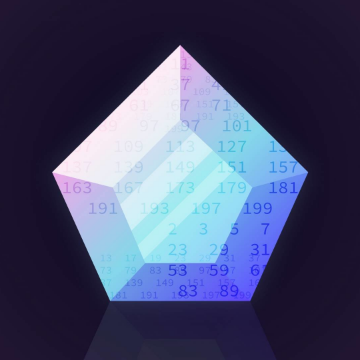

Surprising hidden order unites prime numbers and crystal-like materials

Surprising hidden order unites prime numbers and crystal-like materials

https://phys.org/news/2018-09-hidden-prime-crystal-like-materials.html

The seemingly random digits known as prime numbers are not nearly as scattershot as previously thought. A new analysis by Princeton University researchers has uncovered patterns in primes that are similar to those found in the positions of atoms inside certain crystal-like materials.