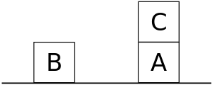
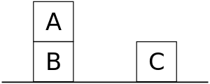
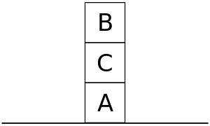

Sussman anomaly - Wikipedia

# Sussman anomaly

From Wikipedia, the free encyclopedia

|     |     |
| --- | --- |
|  | This article includes a [list of references](https://en.wikipedia.org/wiki/Wikipedia:Citing_sources), related reading or [external links](https://en.wikipedia.org/wiki/Wikipedia:External_links), **but its sources remain unclear because it lacks [inline citations](https://en.wikipedia.org/wiki/Wikipedia:Citing_sources#Inline_citations)**. Please help to [improve](https://en.wikipedia.org/wiki/Wikipedia:WikiProject_Fact_and_Reference_Check) this article by [introducing](https://en.wikipedia.org/wiki/Wikipedia:When_to_cite) more precise citations. *(January 2018)*  *([Learn how and when to remove this template message](https://en.wikipedia.org/wiki/Help:Maintenance_template_removal))* |

The **Sussman anomaly** is a problem in [artificial intelligence](https://en.wikipedia.org/wiki/Artificial_intelligence), first described by [Gerald Sussman](https://en.wikipedia.org/wiki/Gerald_Sussman), that illustrates a weakness of noninterleaved [planning algorithms](https://en.wikipedia.org/wiki/Planning_algorithm), which were prominent in the early 1970s. In the problem, three blocks (labeled A, B, and C) rest on a table. The agent must stack the blocks such that A is atop B, which in turn is atop C. However, it may only move one block at a time. The problem starts with B on the table, C atop A, and A on the table:

However, noninterleaved planners typically separate the goal (stack A atop B atop C) into subgoals, such as:

1. get A atop B
2. get B atop C

Suppose the planner starts by pursuing Goal 1. The straightforward solution is to move C out of the way, then move A atop B. But while this sequence accomplishes Goal 1, the agent cannot now pursue Goal 2 without undoing Goal 1, since both A and B must be moved atop C:

If instead the planner starts with Goal 2, the most efficient solution is to move B. But again, the planner cannot pursue Goal 1 without undoing Goal 2:

The problem was first identified by Sussman as a part of his PhD research. Sussman (and his supervisor, [Marvin Minsky](https://en.wikipedia.org/wiki/Marvin_Minsky)) believed that intelligence requires a list of exceptions or tricks, and developed a [modular](https://en.wikipedia.org/wiki/Modular) planning system for "debugging" plans. Most modern planning systems can handle this anomaly, but it is still useful for explaining why planning is non-trivial.

## See also[]

## Sources[]

- [Russell, Stuart J.](https://en.wikipedia.org/wiki/Stuart_J._Russell); [Norvig, Peter](https://en.wikipedia.org/wiki/Peter_Norvig) (2003), [*Artificial Intelligence: A Modern Approach*](http://aima.cs.berkeley.edu/) (2nd ed.), Upper Saddle River, New Jersey: Prentice Hall, p. 414, [ISBN](https://en.wikipedia.org/wiki/International_Standard_Book_Number) [0-13-790395-2](https://en.wikipedia.org/wiki/Special:BookSources/0-13-790395-2)
- G.J. Sussman (1975) *A Computer Model of Skill Acquisition* Elsevier Science Inc. New York, NY, USA. Book version of his PhD thesis.