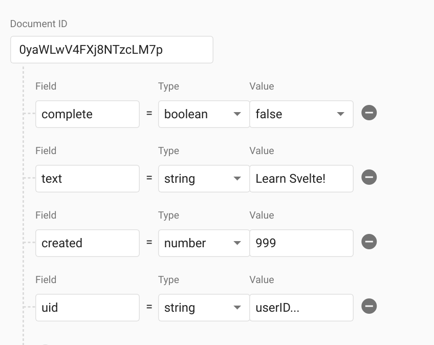

Svelte Realtime Todo List with Firebase

#  Svelte Realtime Todo List with Firebase

Build a realtime ToDo list with Svelte 3 and Firebase (RxFire) **879 words.**

 *By [Jeff Delaney](https://fireship.io/contributors/jeff-delaney/)*

Created Apr 24, 2019
 Last Updated Apr 24, 2019

 [Code](https://github.com/fireship-io/182-svelte-firebase)  [![](data:image/svg+xml,%3csvg aria-hidden='true' data-prefix='fab' data-icon='slack' role='img' xmlns='http://www.w3.org/2000/svg' viewBox='0 0 448 512' class='svgslack js-evernote-checked' data-evernote-id='832'%3e%3cpath fill='currentColor' d='M244.2 217.5l19.3 57.7-59.8 20-19.3-57.7 59.8-20zm41.4 243.7C131.6 507.4 65 471.6 18.8 317.6S8.4 97 162.4 50.8C316.4 4.6 383 40.4 429.2 194.4c46.2 154 10.4 220.6-143.6 266.8zM366.2 265c-3.9-12.2-17.2-18.6-29.4-14.7l-29 9.7-19.3-57.7 29-9.7c12.2-3.9 18.6-17.2 14.7-29.4-3.9-12.2-17.2-18.6-29.4-14.7l-29 9.7-10-30.1c-3.9-12.2-17.2-18.6-29.4-14.7-12.2 3.9-18.6 17.2-14.7 29.4l10 30.1-59.8 20.1-10-30.1c-3.9-12.2-17.2-18.6-29.4-14.7-12.2 3.9-18.6 17.2-14.7 29.4l10 30.1-29 9.7c-12.2 3.9-18.6 17.2-14.7 29.4 3.2 9.3 12.2 15.4 21.5 15.8 4.3.6 7.7-1 36.9-10.7l19.3 57.7-29 9.7c-12.2 3.9-18.6 17.2-14.7 29.4 3.2 9.3 12.2 15.4 21.5 15.8 4.3.6 7.7-1 36.9-10.7l10 30.1c3.7 10.8 15.8 18.6 29.4 14.7 12.2-3.9 18.6-17.2 14.7-29.4l-10-30.1 59.8-20.1 10 30.1c3.7 10.8 15.8 18.6 29.4 14.7 12.2-3.9 18.6-17.2 14.7-29.4l-10-30.1 29-9.7c12.2-4.2 18.6-17.5 14.7-29.6z'%3e%3c/path%3e%3c/svg%3e)Slack](https://fireship.page.link/slack)

 [#svelte](https://fireship.io/tags/svelte)  [#firebase](https://fireship.io/tags/firebase)  [#rxjs](https://fireship.io/tags/rxjs)

[Svelte](https://svelte.dev/) 3 was [announced](https://twitter.com/Rich_Harris/status/1120342713843507201) recently and it delivers a refreshing alternative to the big three component frameworks/libraries of React, Angular, and Vue. In fact, calling it a framework/library would not be very accurante, because Svelte is actually a *compiler* that turns your code into Vanilla JS, meaning it does not need to ship the entire framework in the JS bundle. Its focus on simplicity really stands out and makes for a very developer-friendly JavaScript experience.

I highly recommend watching the video from Svelte’s creator, Rich Harris, to get a better of the low-level engineering decisions that make this tool special.

## Realtime Todo List

Our goal is to build an authenticated realtime todo list with Svelte 3 and Firebase, similar to the demo below:

 

00:42

### Initial Setup

Let’s start with a blank Svelte project and install [RxFire](https://github.com/firebase/firebase-js-sdk/tree/master/packages/rxfire).

  command line

	npx degit sveltejs/template realtime-todos
	cd realtime-todos

	npm install
	npm i rxfire firebase rxjs

	npm run dev

Next, head over the the [Firebase Console](https://console.firebase.google.com/) and grab your web app credentials. Create a file to handle the initialization of Firebase.

  firebase.js

	import firebase from 'firebase/app';
	import 'firebase/auth';
	import 'firebase/firestore';
	var firebaseConfig = {
	    // ...your firebase credentials
	};

	firebase.initializeApp(firebaseConfig);

	export const auth = firebase.auth();
	export const googleProvider = new firebase.auth.GoogleAuthProvider();

	export const db = firebase.firestore();

## User Authentication

Our first milestone is to create a component that allows the user to login and logout using their Google account.

### Login

We can handle the login process by binding the Firebase popup logic to a button click event with Svelte `<button on:click={login}>`

The `authState` function is provided by RxFire and contains an Observable of the user’s authentication state. When logged-in, it provides basic Google account data like displayName, email, photoURL, etc. When logged-out, it is null.

Keep in mind, we will be creating the `Todos` and `Profile` components in the upcoming steps.

 ![](data:image/svg+xml,%3csvg viewBox='0 0 445 535' fill='none' xmlns='http://www.w3.org/2000/svg'%3e %3cpath d='M416.629 70.6913C366.97 -0.318732 268.894 -21.364 197.986 23.7808L73.4569 103.094C56.6494 113.645 42.2276 127.582 31.1121 144.015C19.9966 160.449 12.4317 179.018 8.90021 198.538C2.94525 231.484 8.15412 265.473 23.7024 295.127C13.0462 311.283 5.78481 329.435 2.35859 348.48C-1.19812 368.431 -0.728165 388.892 3.74082 408.659C8.2098 428.426 16.5876 447.1 28.3818 463.585C78.0408 534.595 176.117 555.64 247.025 510.495L371.554 431.516C388.342 420.943 402.749 407 413.862 390.57C424.975 374.14 432.552 355.582 436.111 336.072C442.044 303.137 436.818 269.165 421.261 239.531C431.912 223.367 439.188 205.22 442.653 186.178C446.198 166.227 445.723 145.768 441.255 126.003C436.786 106.237 428.414 87.5625 416.629 71.0731' fill='%23FF3E00'%3e%3c/path%3e %3cpath d='M185.813 470.817C166.209 475.907 145.517 474.857 126.529 467.808C107.54 460.759 91.1697 448.051 79.6263 431.398C72.5386 421.476 67.506 410.234 64.8247 398.336C62.1434 386.438 61.8676 374.124 64.0134 362.117C64.7177 358.212 65.7071 354.363 66.9736 350.602L69.3132 343.435L75.7111 348.213C90.4172 358.957 106.835 367.132 124.269 372.39L129.043 373.776L128.613 378.554C128.154 385.105 129.995 391.611 133.818 396.949C137.301 401.958 142.234 405.78 147.954 407.898C153.673 410.017 159.904 410.331 165.807 408.798C168.507 408.072 171.082 406.945 173.447 405.454L297.777 326.043C300.83 324.121 303.448 321.58 305.463 318.585C307.477 315.59 308.844 312.206 309.474 308.652C310.111 305.029 310.016 301.315 309.196 297.729C308.376 294.143 306.847 290.757 304.7 287.772C301.216 282.762 296.283 278.941 290.564 276.822C284.844 274.704 278.613 274.39 272.71 275.922C270.008 276.639 267.431 277.767 265.071 279.267L217.325 309.607C209.516 314.562 201 318.3 192.067 320.692C172.496 325.752 151.846 324.691 132.896 317.652C113.945 310.614 97.6043 297.934 86.0719 281.322C79.0056 271.389 73.993 260.145 71.3283 248.248C68.6636 236.351 68.4006 224.041 70.5546 212.041C72.663 200.262 77.2044 189.053 83.8884 179.131C90.5724 169.209 99.2519 160.792 109.372 154.418L234.084 75.008C241.847 70.063 250.314 66.3255 259.198 63.9231C278.794 58.8291 299.481 59.8777 318.463 66.9272C337.444 73.9767 353.806 86.6873 365.337 103.341C372.433 113.261 377.474 124.5 380.163 136.398C382.853 148.296 383.136 160.613 380.997 172.622C380.252 176.55 379.264 180.428 378.037 184.233L375.65 191.4L369.3 186.622C354.563 175.796 338.095 167.556 320.599 162.254L315.824 160.868L316.254 156.09C316.806 149.507 315.013 142.94 311.193 137.552C307.688 132.628 302.768 128.89 297.088 126.833C291.408 124.776 285.236 124.498 279.394 126.037C276.692 126.754 274.115 127.882 271.755 129.382L147.186 208.648C144.144 210.573 141.534 213.107 139.52 216.093C137.507 219.078 136.134 222.449 135.489 225.992C134.865 229.623 134.965 233.342 135.785 236.934C136.604 240.526 138.126 243.92 140.263 246.92C143.731 251.884 148.624 255.676 154.295 257.792C159.966 259.909 166.145 260.249 172.014 258.769C174.71 258.033 177.284 256.907 179.654 255.425L227.399 225.132C235.202 220.123 243.741 216.367 252.705 214C272.296 208.894 292.981 209.932 311.964 216.973C330.947 224.014 347.311 236.719 358.843 253.37C365.934 263.292 370.973 274.531 373.662 286.429C376.351 298.326 376.638 310.641 374.504 322.651C372.396 334.43 367.854 345.638 361.17 355.561C354.486 365.483 345.807 373.9 335.687 380.274L211.118 459.684C203.294 464.655 194.762 468.408 185.813 470.817' fill='white'%3e%3c/path%3e %3c/svg%3e) App.svelte

	

	<section>
	{#if user}
	    <Profile {...user} />
	    <button on:click={ () => auth.signOut() }>Logout</button>
	    

	    <Todos uid={user.uid} />
	{:else}
		<button on:click={login}>
			Signin with Google
		</button>
	{/if}
	</section>

### User Profile

When a user is logged-in, we can pass the props down to a child (dumb) component used for data presentation only. The `export` keyword makes it possible to pass a value from the parent the the child.

 ![](data:image/svg+xml,%3csvg viewBox='0 0 445 535' fill='none' xmlns='http://www.w3.org/2000/svg'%3e %3cpath d='M416.629 70.6913C366.97 -0.318732 268.894 -21.364 197.986 23.7808L73.4569 103.094C56.6494 113.645 42.2276 127.582 31.1121 144.015C19.9966 160.449 12.4317 179.018 8.90021 198.538C2.94525 231.484 8.15412 265.473 23.7024 295.127C13.0462 311.283 5.78481 329.435 2.35859 348.48C-1.19812 368.431 -0.728165 388.892 3.74082 408.659C8.2098 428.426 16.5876 447.1 28.3818 463.585C78.0408 534.595 176.117 555.64 247.025 510.495L371.554 431.516C388.342 420.943 402.749 407 413.862 390.57C424.975 374.14 432.552 355.582 436.111 336.072C442.044 303.137 436.818 269.165 421.261 239.531C431.912 223.367 439.188 205.22 442.653 186.178C446.198 166.227 445.723 145.768 441.255 126.003C436.786 106.237 428.414 87.5625 416.629 71.0731' fill='%23FF3E00'%3e%3c/path%3e %3cpath d='M185.813 470.817C166.209 475.907 145.517 474.857 126.529 467.808C107.54 460.759 91.1697 448.051 79.6263 431.398C72.5386 421.476 67.506 410.234 64.8247 398.336C62.1434 386.438 61.8676 374.124 64.0134 362.117C64.7177 358.212 65.7071 354.363 66.9736 350.602L69.3132 343.435L75.7111 348.213C90.4172 358.957 106.835 367.132 124.269 372.39L129.043 373.776L128.613 378.554C128.154 385.105 129.995 391.611 133.818 396.949C137.301 401.958 142.234 405.78 147.954 407.898C153.673 410.017 159.904 410.331 165.807 408.798C168.507 408.072 171.082 406.945 173.447 405.454L297.777 326.043C300.83 324.121 303.448 321.58 305.463 318.585C307.477 315.59 308.844 312.206 309.474 308.652C310.111 305.029 310.016 301.315 309.196 297.729C308.376 294.143 306.847 290.757 304.7 287.772C301.216 282.762 296.283 278.941 290.564 276.822C284.844 274.704 278.613 274.39 272.71 275.922C270.008 276.639 267.431 277.767 265.071 279.267L217.325 309.607C209.516 314.562 201 318.3 192.067 320.692C172.496 325.752 151.846 324.691 132.896 317.652C113.945 310.614 97.6043 297.934 86.0719 281.322C79.0056 271.389 73.993 260.145 71.3283 248.248C68.6636 236.351 68.4006 224.041 70.5546 212.041C72.663 200.262 77.2044 189.053 83.8884 179.131C90.5724 169.209 99.2519 160.792 109.372 154.418L234.084 75.008C241.847 70.063 250.314 66.3255 259.198 63.9231C278.794 58.8291 299.481 59.8777 318.463 66.9272C337.444 73.9767 353.806 86.6873 365.337 103.341C372.433 113.261 377.474 124.5 380.163 136.398C382.853 148.296 383.136 160.613 380.997 172.622C380.252 176.55 379.264 180.428 378.037 184.233L375.65 191.4L369.3 186.622C354.563 175.796 338.095 167.556 320.599 162.254L315.824 160.868L316.254 156.09C316.806 149.507 315.013 142.94 311.193 137.552C307.688 132.628 302.768 128.89 297.088 126.833C291.408 124.776 285.236 124.498 279.394 126.037C276.692 126.754 274.115 127.882 271.755 129.382L147.186 208.648C144.144 210.573 141.534 213.107 139.52 216.093C137.507 219.078 136.134 222.449 135.489 225.992C134.865 229.623 134.965 233.342 135.785 236.934C136.604 240.526 138.126 243.92 140.263 246.92C143.731 251.884 148.624 255.676 154.295 257.792C159.966 259.909 166.145 260.249 172.014 258.769C174.71 258.033 177.284 256.907 179.654 255.425L227.399 225.132C235.202 220.123 243.741 216.367 252.705 214C272.296 208.894 292.981 209.932 311.964 216.973C330.947 224.014 347.311 236.719 358.843 253.37C365.934 263.292 370.973 274.531 373.662 286.429C376.351 298.326 376.638 310.641 374.504 322.651C372.396 334.43 367.854 345.638 361.17 355.561C354.486 365.483 345.807 373.9 335.687 380.274L211.118 459.684C203.294 464.655 194.762 468.408 185.813 470.817' fill='white'%3e%3c/path%3e %3c/svg%3e) Profile.svelte

	

	<h3>Hi { displayName }!</h3>

	
	
Your userID is { uid }

## Firestore Todo List

The todo is just a document that tells us who created it, along with some text and a boolean status. We can toggle the status to mark a todo complete or incomplete.

 

Data model of todo item in Firestore

### Todo Item

The `TodoItem` is a dumb/presentational component that displays data and emits custom events back up to the parent. When the user clicks the remove ️ button it will emit a [CustomEvent](https://developer.mozilla.org/en-US/docs/Web/API/CustomEvent) that tells the parent which document ID to remove from the database. Similarly, we can toggle the *complete* status by clicking the ✔️ or ❌ buttons.

 ![](data:image/svg+xml,%3csvg viewBox='0 0 445 535' fill='none' xmlns='http://www.w3.org/2000/svg'%3e %3cpath d='M416.629 70.6913C366.97 -0.318732 268.894 -21.364 197.986 23.7808L73.4569 103.094C56.6494 113.645 42.2276 127.582 31.1121 144.015C19.9966 160.449 12.4317 179.018 8.90021 198.538C2.94525 231.484 8.15412 265.473 23.7024 295.127C13.0462 311.283 5.78481 329.435 2.35859 348.48C-1.19812 368.431 -0.728165 388.892 3.74082 408.659C8.2098 428.426 16.5876 447.1 28.3818 463.585C78.0408 534.595 176.117 555.64 247.025 510.495L371.554 431.516C388.342 420.943 402.749 407 413.862 390.57C424.975 374.14 432.552 355.582 436.111 336.072C442.044 303.137 436.818 269.165 421.261 239.531C431.912 223.367 439.188 205.22 442.653 186.178C446.198 166.227 445.723 145.768 441.255 126.003C436.786 106.237 428.414 87.5625 416.629 71.0731' fill='%23FF3E00'%3e%3c/path%3e %3cpath d='M185.813 470.817C166.209 475.907 145.517 474.857 126.529 467.808C107.54 460.759 91.1697 448.051 79.6263 431.398C72.5386 421.476 67.506 410.234 64.8247 398.336C62.1434 386.438 61.8676 374.124 64.0134 362.117C64.7177 358.212 65.7071 354.363 66.9736 350.602L69.3132 343.435L75.7111 348.213C90.4172 358.957 106.835 367.132 124.269 372.39L129.043 373.776L128.613 378.554C128.154 385.105 129.995 391.611 133.818 396.949C137.301 401.958 142.234 405.78 147.954 407.898C153.673 410.017 159.904 410.331 165.807 408.798C168.507 408.072 171.082 406.945 173.447 405.454L297.777 326.043C300.83 324.121 303.448 321.58 305.463 318.585C307.477 315.59 308.844 312.206 309.474 308.652C310.111 305.029 310.016 301.315 309.196 297.729C308.376 294.143 306.847 290.757 304.7 287.772C301.216 282.762 296.283 278.941 290.564 276.822C284.844 274.704 278.613 274.39 272.71 275.922C270.008 276.639 267.431 277.767 265.071 279.267L217.325 309.607C209.516 314.562 201 318.3 192.067 320.692C172.496 325.752 151.846 324.691 132.896 317.652C113.945 310.614 97.6043 297.934 86.0719 281.322C79.0056 271.389 73.993 260.145 71.3283 248.248C68.6636 236.351 68.4006 224.041 70.5546 212.041C72.663 200.262 77.2044 189.053 83.8884 179.131C90.5724 169.209 99.2519 160.792 109.372 154.418L234.084 75.008C241.847 70.063 250.314 66.3255 259.198 63.9231C278.794 58.8291 299.481 59.8777 318.463 66.9272C337.444 73.9767 353.806 86.6873 365.337 103.341C372.433 113.261 377.474 124.5 380.163 136.398C382.853 148.296 383.136 160.613 380.997 172.622C380.252 176.55 379.264 180.428 378.037 184.233L375.65 191.4L369.3 186.622C354.563 175.796 338.095 167.556 320.599 162.254L315.824 160.868L316.254 156.09C316.806 149.507 315.013 142.94 311.193 137.552C307.688 132.628 302.768 128.89 297.088 126.833C291.408 124.776 285.236 124.498 279.394 126.037C276.692 126.754 274.115 127.882 271.755 129.382L147.186 208.648C144.144 210.573 141.534 213.107 139.52 216.093C137.507 219.078 136.134 222.449 135.489 225.992C134.865 229.623 134.965 233.342 135.785 236.934C136.604 240.526 138.126 243.92 140.263 246.92C143.731 251.884 148.624 255.676 154.295 257.792C159.966 259.909 166.145 260.249 172.014 258.769C174.71 258.033 177.284 256.907 179.654 255.425L227.399 225.132C235.202 220.123 243.741 216.367 252.705 214C272.296 208.894 292.981 209.932 311.964 216.973C330.947 224.014 347.311 236.719 358.843 253.37C365.934 263.292 370.973 274.531 373.662 286.429C376.351 298.326 376.638 310.641 374.504 322.651C372.396 334.43 367.854 345.638 361.17 355.561C354.486 365.483 345.807 373.9 335.687 380.274L211.118 459.684C203.294 464.655 194.762 468.408 185.813 470.817' fill='white'%3e%3c/path%3e %3c/svg%3e) TodoItem.svelte

	

	

	<li>

	{#if complete}
	    { text }
	    <button on:click={toggleStatus}> ✔️ </button>
	{:else}
	    { text }
	    <button on:click={toggleStatus}> ❌ </button>
	{/if}

	<button on:click={remove}>  </button>

	</li>

### The Todo List

The `TodoList` is a smart component that queries that data and interacts with the database. The `$` used in front the *todos* in the each loop will automatically subscribe and unsubscribe to the Observable - similar to the async pipe in Angular.

 ![](data:image/svg+xml,%3csvg viewBox='0 0 445 535' fill='none' xmlns='http://www.w3.org/2000/svg'%3e %3cpath d='M416.629 70.6913C366.97 -0.318732 268.894 -21.364 197.986 23.7808L73.4569 103.094C56.6494 113.645 42.2276 127.582 31.1121 144.015C19.9966 160.449 12.4317 179.018 8.90021 198.538C2.94525 231.484 8.15412 265.473 23.7024 295.127C13.0462 311.283 5.78481 329.435 2.35859 348.48C-1.19812 368.431 -0.728165 388.892 3.74082 408.659C8.2098 428.426 16.5876 447.1 28.3818 463.585C78.0408 534.595 176.117 555.64 247.025 510.495L371.554 431.516C388.342 420.943 402.749 407 413.862 390.57C424.975 374.14 432.552 355.582 436.111 336.072C442.044 303.137 436.818 269.165 421.261 239.531C431.912 223.367 439.188 205.22 442.653 186.178C446.198 166.227 445.723 145.768 441.255 126.003C436.786 106.237 428.414 87.5625 416.629 71.0731' fill='%23FF3E00'%3e%3c/path%3e %3cpath d='M185.813 470.817C166.209 475.907 145.517 474.857 126.529 467.808C107.54 460.759 91.1697 448.051 79.6263 431.398C72.5386 421.476 67.506 410.234 64.8247 398.336C62.1434 386.438 61.8676 374.124 64.0134 362.117C64.7177 358.212 65.7071 354.363 66.9736 350.602L69.3132 343.435L75.7111 348.213C90.4172 358.957 106.835 367.132 124.269 372.39L129.043 373.776L128.613 378.554C128.154 385.105 129.995 391.611 133.818 396.949C137.301 401.958 142.234 405.78 147.954 407.898C153.673 410.017 159.904 410.331 165.807 408.798C168.507 408.072 171.082 406.945 173.447 405.454L297.777 326.043C300.83 324.121 303.448 321.58 305.463 318.585C307.477 315.59 308.844 312.206 309.474 308.652C310.111 305.029 310.016 301.315 309.196 297.729C308.376 294.143 306.847 290.757 304.7 287.772C301.216 282.762 296.283 278.941 290.564 276.822C284.844 274.704 278.613 274.39 272.71 275.922C270.008 276.639 267.431 277.767 265.071 279.267L217.325 309.607C209.516 314.562 201 318.3 192.067 320.692C172.496 325.752 151.846 324.691 132.896 317.652C113.945 310.614 97.6043 297.934 86.0719 281.322C79.0056 271.389 73.993 260.145 71.3283 248.248C68.6636 236.351 68.4006 224.041 70.5546 212.041C72.663 200.262 77.2044 189.053 83.8884 179.131C90.5724 169.209 99.2519 160.792 109.372 154.418L234.084 75.008C241.847 70.063 250.314 66.3255 259.198 63.9231C278.794 58.8291 299.481 59.8777 318.463 66.9272C337.444 73.9767 353.806 86.6873 365.337 103.341C372.433 113.261 377.474 124.5 380.163 136.398C382.853 148.296 383.136 160.613 380.997 172.622C380.252 176.55 379.264 180.428 378.037 184.233L375.65 191.4L369.3 186.622C354.563 175.796 338.095 167.556 320.599 162.254L315.824 160.868L316.254 156.09C316.806 149.507 315.013 142.94 311.193 137.552C307.688 132.628 302.768 128.89 297.088 126.833C291.408 124.776 285.236 124.498 279.394 126.037C276.692 126.754 274.115 127.882 271.755 129.382L147.186 208.648C144.144 210.573 141.534 213.107 139.52 216.093C137.507 219.078 136.134 222.449 135.489 225.992C134.865 229.623 134.965 233.342 135.785 236.934C136.604 240.526 138.126 243.92 140.263 246.92C143.731 251.884 148.624 255.676 154.295 257.792C159.966 259.909 166.145 260.249 172.014 258.769C174.71 258.033 177.284 256.907 179.654 255.425L227.399 225.132C235.202 220.123 243.741 216.367 252.705 214C272.296 208.894 292.981 209.932 311.964 216.973C330.947 224.014 347.311 236.719 358.843 253.37C365.934 263.292 370.973 274.531 373.662 286.429C376.351 298.326 376.638 310.641 374.504 322.651C372.396 334.43 367.854 345.638 361.17 355.561C354.486 365.483 345.807 373.9 335.687 380.274L211.118 459.684C203.294 464.655 194.762 468.408 185.813 470.817' fill='white'%3e%3c/path%3e %3c/svg%3e) Todos.svelte

	

	

	<ul>
		{#each $todos as todo}

	        <TodoItem {...todo} on:remove={removeItem} on:toggle={updateStatus} />

		{/each}
	</ul>

	<input bind:value={text}>

	<button on:click={add}>Add Task</button>

You need a composite index to run the database query in the code above.
 

Check the browser error logs for a link to create this index

## The End

That’s it! I can confidently say that Svelte has been the easiest JS component library to learn and start putting to use in a productive way. This is partly due to my background with other JS frameworks, but also due the fact that Svelte focuses on simplicity, has amazing docs, and creates powerful abstractions that just fit well with native DOM apis.

-

    - [Realtime Todo List](https://fireship.io/lessons/svelte-v3-overview-firebase/#realtime-todo-list)
        - [Initial Setup](https://fireship.io/lessons/svelte-v3-overview-firebase/#initial-setup)
    - [User Authentication](https://fireship.io/lessons/svelte-v3-overview-firebase/#user-authentication)
        - [Login](https://fireship.io/lessons/svelte-v3-overview-firebase/#login)
        - [User Profile](https://fireship.io/lessons/svelte-v3-overview-firebase/#user-profile)
    - [Firestore Todo List](https://fireship.io/lessons/svelte-v3-overview-firebase/#firestore-todo-list)
        - [Todo Item](https://fireship.io/lessons/svelte-v3-overview-firebase/#todo-item)
        - [The Todo List](https://fireship.io/lessons/svelte-v3-overview-firebase/#the-todo-list)
    - [The End](https://fireship.io/lessons/svelte-v3-overview-firebase/#the-end)