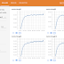

TF-Ranking: A Scalable TensorFlow Library for Learning-to-Rank

TF-Ranking: A Scalable TensorFlow Library for Learning-to-Rank

https://ai.googleblog.com/2018/12/tf-ranking-scalable-tensorflow-library.html

Posted by Xuanhui Wang and Michael Bendersky, Software Engineers, Google AI Ranking, the process of ordering a list of items in a way that...