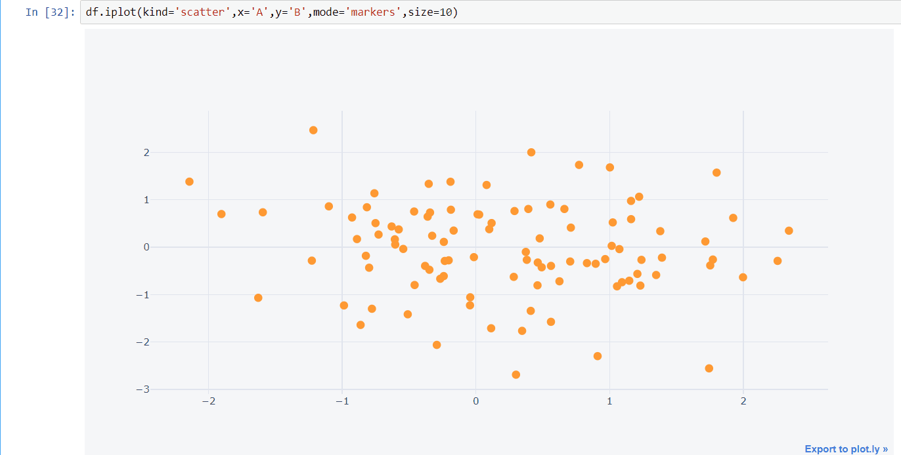
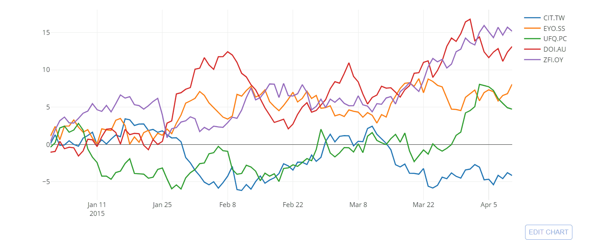
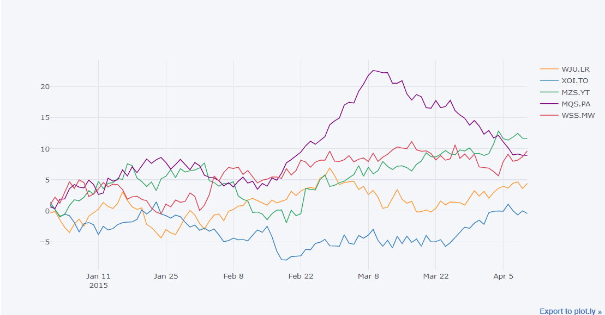
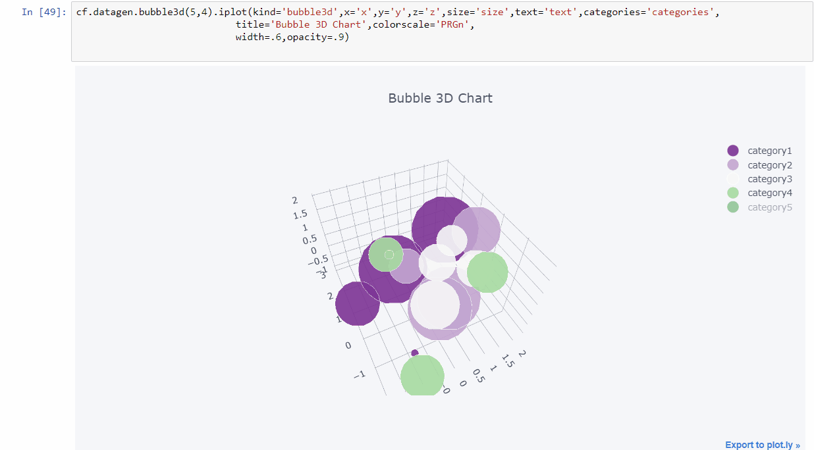
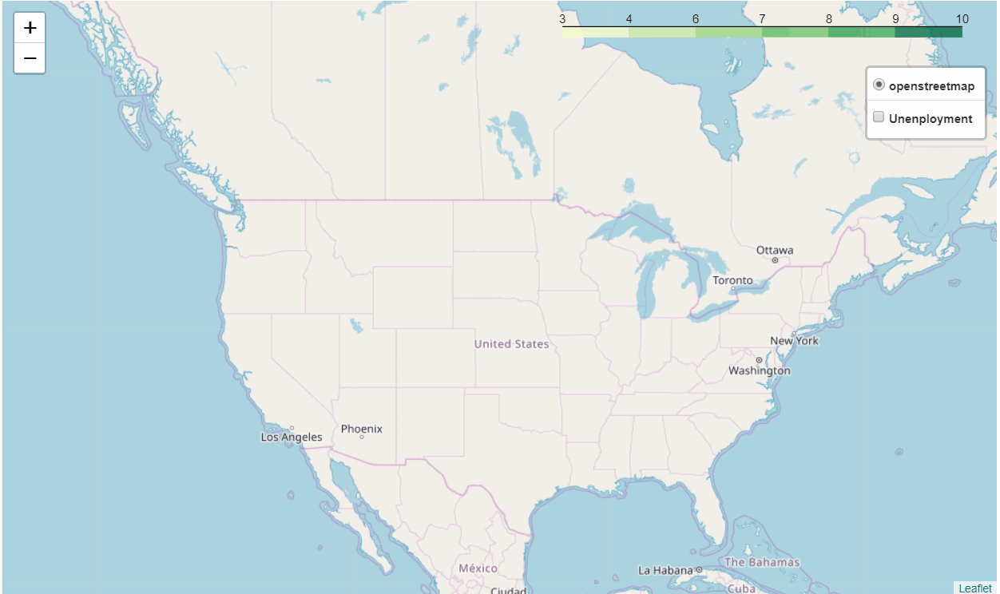
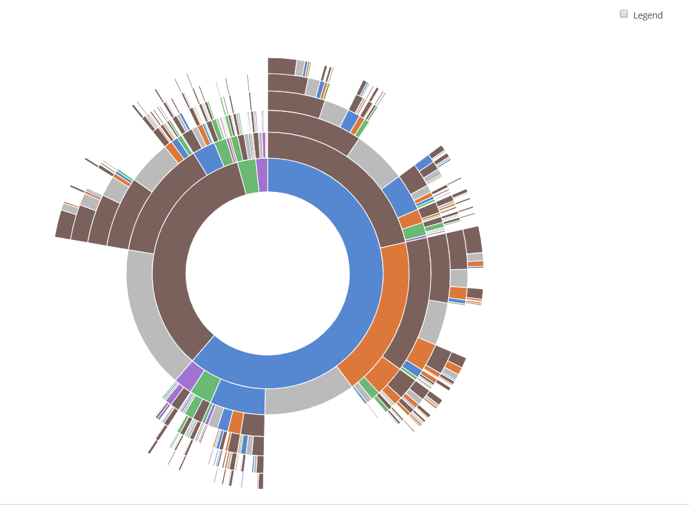
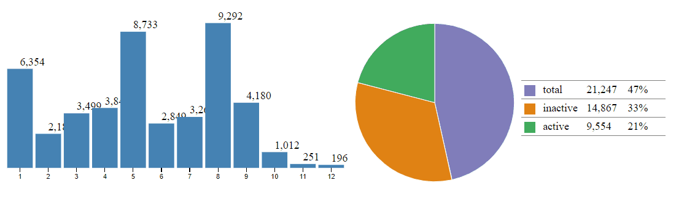

Taking Data Visualization to Another Level – Hacker Noon

# Taking Data Visualization to Another Level

[Kunal Dhariwal](https://hackernoon.com/@Mr.dhariwal)
Mar 11·7 min read

Courtesy: https://pixabay.com/illustrations/background-data-network-web-3228704/

When you tend to use one library for a certain period of time, you get used to it. But, you need to evolve and learn something new every day. If you are still stuck up with Matplotlib(Which is amazing), Seaborn(This is amazing too), Pandas(Basic, yet easy Visualization) and Bokeh, You need to move on and try something new. Many amazing visualization libraries are available in python, which turns to be very versatile. Here, I’m going to discuss about these amazing libraries:

- •***Plotly***
- •***Cufflinks***
- •***Folium***
- •***Altair + Vega***
- •**D3.js (My best Pick, i code in JS too)**

If you are aware and use the libraries mentioned above then you are on the right track of evolution. They can help in generating some amazing visualizations and syntax ain’t difficult too. Generally, I prefer more of plotly+cufflinks and **D3.js. **Alright, lets get back to the basics:

#### ***Plotly***

Plotly is an open-source, interactive and browser-based graphing library for python. Plotly is a library that allows you to create interactive plots that you can use in dashboards or websites (you can save them as html files or static images). Plotly is built on top of plotly.js which in turn is built on D3.js and it is a high-level charting library. plotly comes with over 30 chart types, including scientific charts, statistical charts, 3D graphs, financial charts and more. The best things about plotly is that you can use it in Jupyter Notebooks, as well as stand alone HTML pages. You can also use it online on their site but i prefer more to use it offline and you can also save the visualization as an image. It’s pretty simple to use it and get it to work.

***— Method to use it in Jupyter Notebook (Offline)***
First, install the plotly library.
pip install plotly
Then open jupyter notebook and type this:
from plotly import __version__
from plotly.offline import download_plotlyjs, init_notebook_mode, plot, iplot
init_notebook_mode(connected=True)

The syntax is quite simpler or simplest, i say? In P*andas*, you use *dataframe.plot() *and here, you use* dataframe.iplot(). *This *“****i****” *changes the whole definition of the visualization.

With just one line, i generated this scatter plot. You can customize it as you want. Remember to specify mode markers or you’ll just get some cluster of lines.

Scatter plot generated using plotly

> Please note that as the data increases, plotly begins to choke. So, I would only use plotly when I have less than 500K data points.

> Try it all in your Jupyter Notebook.

#### **Cufflinks**

Cufflinks binds Plotly directly to pandas dataframes. The combination is just amazing, the power of plotly combined with flexibility of Pandas. It is more effective than plotly. The syntax is even simpler than plotly. With plotly’s Python library, you can describe figures with DataFrame’s series and index, but with cufflinks you can plot it directly. Here is an example:

df = cf.datagen.lines()

py.iplot([{
'x': df.index,
'y': df[col],
'name': col
} **for** col **in** df.columns])

With Plotly
df.iplot(kind='scatter')

With Cufflinks

Cufflinks makes it much easier to plot stuffs. You can also generated amazing 3D charts with cufflinks too. I have generated this 3D with just couple of lines of code.

3D chart with Cufflinks
You can always try it out in your Jupyter Notebook.
**— Quick Hack:**
Set in the config:
> c.NotebookApp.iopub_data_rate_limit = 1.0e10
Import it the following way:
import plotly.graph_objs as go
import plotly.plotly as py
import cufflinks as cf
from plotly.offline import iplot, init_notebook_mode
cf.go_offline()

# Set global theme

cf.set_config_file(world_readable=True, theme=’pearl’, offline=True)
init_notebook_mode()
And it works inline.
Next, I’m going to talk about yet another amazing Viz library.

#### **Folium**

Folium is built on the data wrangling strengths of the Python ecosystem and the mapping strengths of the Leaflet.js library. You can manipulate your data in python, then visualize it in a Leaflet map via folium. Folium is turning out be an amazing library for plotting spatial data. You can also generate heat maps and choropleth maps using folium. Let’s learn something about folium:

1. 1 "."Maps are defined as a *folium.Map *object, addition of other folium objects on top of the *folium.Map can be done *to improve the map rendered

2. 2 "."You can use different map tiles for the map rendered by Folium, such as MapBox, OpenStreetMap , and several other tiles, for that you can visit [this github repo folder](https://github.com/python-visualization/folium/tree/master/folium/templates/tiles) or [this documentation page](http://python-visualization.github.io/folium/docs-v0.5.0/modules.html).

3. 3 "."You can also select different map projections. Many projections are available out there.

Let’s generate a Choropleth map with Geojson of US unemployment. Here is the snippet:

map = folium.Map([43, -100], zoom_start=4)

choropleth = folium.Choropleth(
geo_data=us_states,
data=state_data,
columns=['State', 'Unemployment'],
key_on='feature.id',
fill_color='YlGn',
name='Unenployment',
show=**False**,
).add_to(m)

*# The underlying GeoJson and StepColormap objects are reachable*
print(type(choropleth.geojson))
print(type(choropleth.color_scale))

folium.LayerControl(collapsed=**False**).add_to(m)

map.save(os.path.join('results', 'GeoChoro.html'))

map

This is just a basic one, you can add markers, pop ups and a lot more to it. Here is how it would look like.

Map with leaflet and folium

#### **Altair + Vega**

Altair is a declarative statistical visualization library and it is based on Vega and Vega-Lite. Altair enables you to build a wide range of statistical visualizations quickly with a powerful and concise visualization grammar. You need to install it the following way, if you are using Jupyter Notebook. It also includes some example vega datasets.

pip install -U altair vega_datasets notebook vega

Altair’s main dependency is Vega, in order to make the plots to be visible on the screen, you need to install it and also, you need to run this command for every new session.

alt.renderers.enable(‘notebook’)

Data in Altair is built around the Pandas Dataframe. One of the defining characteristics of statistical visualization is that it begins with tidy Dataframes. You can also save the plot as an image or open it in vega editor for more options. It’s definitely not the best one out there, but definitely worth a try for the sake of creators hard work.

Here is an example, I’m using cars dataset for this;
import altair as alt
from vega_datasets import data
source = data.cars()
brush = alt.selection(type='interval')
points = alt.Chart().mark_point().encode(
x='Horsepower:Q',
y='Miles_per_Gallon:Q',
color=alt.condition(brush, 'Origin:N', alt.value('lightgray'))
).add_selection(
brush
)
bars = alt.Chart().mark_bar().encode(
y='Origin:N',
color='Origin:N',
x='count(Origin):Q'
).transform_filter(
brush
)
alt.vconcat(points, bars, data=source)

Scatter plot and Histogram with Altair and Vega

> You can try it out in your own Notebook and let me know if you get stuck anywhere!

#### **D3.js (Data Driven Documents)**

**D3.js** is a JavaScript library for manipulation of documents based on the data. You can bring data to life using HTML, SVG, and CSS. D3 does not require you to tie tie yourself to any proprietary framework because modern browsers have it all that D3 needs and it is also used for combining powerful visualization components and for a data-driven approach to DOM manipulation.

D3.js is the best data visualization library out in the market. I prefer to use it almost every time. You can use it with python and as well as with R. Originally, it works with JavaScript and that becomes quite tough because JS has wide range of functions and requires much learning and experience but if you are a JS pro then you don’t need to make a second thought. Although, *Python* and *R* has made it a bit simpler, just a bit! But you get the best stuff out there with this library.

D3py has 3 three main dependencies:
1. 1 "."Numpy
2. 2 "."Pandas
3. 3 "."NetworkX

I would suggest you to use it with JavaScript or R, not with python because the version is out of date and was last updated in 2016. Though, it was just a thin python wrapper for D3.js.

R has an interface for D3 visualizations. With **r2d3**, you can bind data from R to D3 visualizations. D3 visualizations created with **r2d3** work just like R plots within RStudio, R Markdown documents, and Shiny applications. You can install the **r2d3** package from CRAN as follows:

install.packages(“r2d3”)

You can make some amazing visualizations with this one, Let me show you a couple of it here.

Sequences Sunburst — [Kerry Rodden](https://bl.ocks.org/kerryrodden)’s Block (Source)

Activity Status of an Year — Kunal Dhariwal (Me, lol)

From basics to High end, you can build anything with D3.js, Don’t forget to try it out.

> If you encounter any error or need any help, you can always make a comment or ping me on LinkedIn.

**> LinkedIn**> : > [https://bit.ly/2u4YPoF
**> Github**> : > [https://bit.ly/2SQV7ss

***P.S- Special Thanks to the creators and contributors of those amazing libraries.***

> I hope that this has helped you to enhance your knowledge base :)
> Follow me for more!
> Thanks for your read and valuable time!