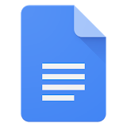
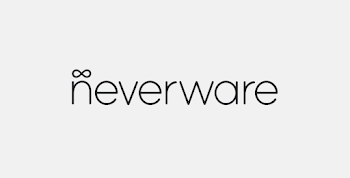

Teach from Home

 [Download Toolkit](https://storage.googleapis.com/teachfromhome.appspot.com/en-toolkit.pdf)

#   Teach from Home  ![](data:image/svg+xml,%3csvg xmlns='http://www.w3.org/2000/svg' aria-hidden='true' height='440' viewBox='0 0 400 440' width='400' data-evernote-id='130' class='js-evernote-checked'%3e %3cpath d='M96.304 158.408h-17.6v-9.416h45.056v9.416h-17.6V212h-9.856v-53.592zm49.871 55c-4.4 0-8.36-1.027-11.88-3.08-3.461-2.053-6.189-4.869-8.184-8.448-1.936-3.637-2.904-7.715-2.904-12.232 0-4.283.939-8.243 2.816-11.88 1.936-3.696 4.605-6.629 8.008-8.8 3.403-2.171 7.275-3.256 11.616-3.256 4.517 0 8.419.997 11.704 2.992 3.344 1.995 5.867 4.723 7.568 8.184 1.76 3.461 2.64 7.363 2.64 11.704 0 .821-.088 1.848-.264 3.08h-34.408c.352 4.165 1.819 7.392 4.4 9.68 2.64 2.229 5.691 3.344 9.152 3.344 2.757 0 5.133-.616 7.128-1.848 2.053-1.291 3.696-3.021 4.928-5.192l8.184 3.872c-2.112 3.696-4.869 6.6-8.272 8.712-3.403 2.112-7.48 3.168-12.232 3.168zm11.528-29.128c-.117-1.584-.616-3.139-1.496-4.664-.88-1.584-2.229-2.904-4.048-3.96-1.76-1.056-3.931-1.584-6.512-1.584-3.109 0-5.749.939-7.92 2.816-2.112 1.819-3.579 4.283-4.4 7.392h24.376zm34.181 29.128c-3.227 0-6.101-.616-8.624-1.848-2.523-1.291-4.488-3.08-5.896-5.368-1.408-2.347-2.112-4.987-2.112-7.92 0-4.635 1.731-8.301 5.192-11 3.52-2.699 7.949-4.048 13.288-4.048 2.64 0 5.016.264 7.128.792 2.112.469 3.784.997 5.016 1.584v-2.288c0-2.757-1.027-4.987-3.08-6.688-2.053-1.76-4.693-2.64-7.92-2.64a14.72 14.72 0 00-6.512 1.496c-1.995.997-3.608 2.376-4.84 4.136l-6.776-5.192c1.995-2.757 4.576-4.899 7.744-6.424 3.168-1.525 6.688-2.288 10.56-2.288 6.512 0 11.528 1.613 15.048 4.84 3.52 3.168 5.28 7.656 5.28 13.464V212h-9.504v-5.368h-.44c-1.291 1.936-3.109 3.549-5.456 4.84-2.347 1.291-5.045 1.936-8.096 1.936zm1.672-8.008c2.347 0 4.459-.557 6.336-1.672 1.877-1.115 3.344-2.611 4.4-4.488a12.182 12.182 0 001.584-6.072c-1.349-.763-2.933-1.379-4.752-1.848a21.444 21.444 0 00-5.544-.704c-3.637 0-6.307.733-8.008 2.2-1.701 1.408-2.552 3.256-2.552 5.544 0 2.053.792 3.755 2.376 5.104 1.584 1.291 3.637 1.936 6.16 1.936zm53.711 8.008c-4.458 0-8.477-1.027-12.056-3.08-3.52-2.053-6.277-4.869-8.272-8.448-1.936-3.637-2.904-7.744-2.904-12.32 0-4.576.968-8.653 2.904-12.232 1.995-3.637 4.752-6.483 8.272-8.536 3.579-2.053 7.598-3.08 12.056-3.08 4.928 0 9.123 1.115 12.584 3.344 3.462 2.229 5.926 5.251 7.392 9.064l-8.888 3.696c-1.994-4.752-5.778-7.128-11.352-7.128-2.405 0-4.634.616-6.688 1.848-1.994 1.232-3.608 2.992-4.84 5.28-1.173 2.229-1.76 4.811-1.76 7.744s.587 5.544 1.76 7.832c1.232 2.288 2.846 4.048 4.84 5.28a12.768 12.768 0 006.688 1.848c2.816 0 5.222-.616 7.216-1.848 2.054-1.291 3.608-3.109 4.664-5.456l8.712 3.784c-1.701 3.813-4.282 6.835-7.744 9.064-3.461 2.229-7.656 3.344-12.584 3.344zm29.56-64.416h9.68v17.16l-.44 6.864h.44c1.291-2.112 3.198-3.843 5.72-5.192a17.015 17.015 0 018.272-2.112c5.456 0 9.622 1.613 12.496 4.84 2.875 3.168 4.312 7.509 4.312 13.024V212h-9.68v-27.104c0-3.403-.909-5.955-2.728-7.656-1.76-1.701-4.077-2.552-6.952-2.552-2.17 0-4.136.616-5.896 1.848-1.701 1.232-3.05 2.875-4.048 4.928-.997 1.995-1.496 4.136-1.496 6.424V212h-9.68v-63.008zM108.918 257.656h-8.184v-8.536h8.184v-3.52c0-4.693 1.466-8.419 4.4-11.176 2.933-2.757 6.688-4.136 11.264-4.136 2.64 0 4.928.323 6.864.968v9.504a25.123 25.123 0 00-2.992-.968c-.88-.293-1.907-.44-3.08-.44-1.936 0-3.55.616-4.84 1.848-1.291 1.232-1.936 2.933-1.936 5.104v2.816h11.264v8.536h-11.264V294h-9.68v-36.344zm31.046-8.536h9.24v6.6h.44c.997-2.288 2.728-4.165 5.192-5.632 2.464-1.525 5.075-2.288 7.832-2.288 2.171 0 3.989.293 5.456.88v10.032c-2.581-.939-4.899-1.408-6.952-1.408-2.229 0-4.224.587-5.984 1.76-1.701 1.173-3.051 2.757-4.048 4.752-.997 1.936-1.496 4.077-1.496 6.424V294h-9.68v-44.88zm54.946 46.288c-4.517 0-8.565-1.027-12.144-3.08-3.579-2.112-6.365-4.987-8.36-8.624-1.995-3.637-2.992-7.685-2.992-12.144 0-4.459.997-8.507 2.992-12.144 1.995-3.637 4.781-6.483 8.36-8.536 3.579-2.112 7.627-3.168 12.144-3.168s8.565 1.056 12.144 3.168c3.579 2.112 6.365 4.987 8.36 8.624 1.995 3.637 2.992 7.656 2.992 12.056 0 4.459-.997 8.507-2.992 12.144-1.995 3.637-4.781 6.512-8.36 8.624-3.579 2.053-7.627 3.08-12.144 3.08zm0-8.888c2.464 0 4.752-.587 6.864-1.76 2.112-1.232 3.784-2.963 5.016-5.192 1.291-2.288 1.936-4.957 1.936-8.008 0-3.051-.645-5.691-1.936-7.92-1.232-2.229-2.904-3.931-5.016-5.104a13.387 13.387 0 00-6.864-1.848c-2.464 0-4.752.616-6.864 1.848-2.112 1.173-3.813 2.875-5.104 5.104-1.232 2.229-1.848 4.869-1.848 7.92s.616 5.72 1.848 8.008c1.291 2.229 2.992 3.96 5.104 5.192 2.112 1.173 4.4 1.76 6.864 1.76zm32.562-37.4h9.24v5.896h.44c1.349-2.171 3.256-3.931 5.72-5.28a16.238 16.238 0 017.92-2.024c3.227 0 6.043.763 8.448 2.288 2.405 1.467 4.136 3.432 5.192 5.896a17.193 17.193 0 016.072-5.896c2.581-1.525 5.603-2.288 9.064-2.288 5.163 0 9.064 1.584 11.704 4.752 2.699 3.109 4.048 7.363 4.048 12.76V294h-9.68v-27.104c0-6.805-2.904-10.208-8.712-10.208-3.109 0-5.661 1.261-7.656 3.784-1.995 2.523-2.992 5.632-2.992 9.328V294h-9.68v-27.104c0-6.805-2.992-10.208-8.976-10.208-3.051 0-5.573 1.261-7.568 3.784-1.936 2.523-2.904 5.632-2.904 9.328V294h-9.68v-44.88zM82.997 312.992h9.856v26.136h29.216v-26.136h9.768V376h-9.768v-27.544H92.853V376h-9.856v-63.008zm83.698 64.416c-4.517 0-8.565-1.027-12.144-3.08-3.578-2.112-6.365-4.987-8.36-8.624-1.994-3.637-2.992-7.685-2.992-12.144 0-4.459.998-8.507 2.992-12.144 1.995-3.637 4.782-6.483 8.36-8.536 3.579-2.112 7.627-3.168 12.144-3.168 4.518 0 8.566 1.056 12.144 3.168 3.579 2.112 6.366 4.987 8.36 8.624 1.995 3.637 2.992 7.656 2.992 12.056 0 4.459-.997 8.507-2.992 12.144-1.994 3.637-4.781 6.512-8.36 8.624-3.578 2.053-7.626 3.08-12.144 3.08zm0-8.888c2.464 0 4.752-.587 6.864-1.76 2.112-1.232 3.784-2.963 5.016-5.192 1.291-2.288 1.936-4.957 1.936-8.008 0-3.051-.645-5.691-1.936-7.92-1.232-2.229-2.904-3.931-5.016-5.104a13.387 13.387 0 00-6.864-1.848c-2.464 0-4.752.616-6.864 1.848-2.112 1.173-3.813 2.875-5.104 5.104-1.232 2.229-1.848 4.869-1.848 7.92s.616 5.72 1.848 8.008c1.291 2.229 2.992 3.96 5.104 5.192 2.112 1.173 4.4 1.76 6.864 1.76zm32.562-37.4h9.24v5.896h.44c1.349-2.171 3.256-3.931 5.72-5.28a16.238 16.238 0 017.92-2.024c3.227 0 6.043.763 8.448 2.288 2.405 1.467 4.136 3.432 5.192 5.896a17.193 17.193 0 016.072-5.896c2.581-1.525 5.603-2.288 9.064-2.288 5.163 0 9.064 1.584 11.704 4.752 2.699 3.109 4.048 7.363 4.048 12.76V376h-9.68v-27.104c0-6.805-2.904-10.208-8.712-10.208-3.109 0-5.661 1.261-7.656 3.784-1.995 2.523-2.992 5.632-2.992 9.328V376h-9.68v-27.104c0-6.805-2.992-10.208-8.976-10.208-3.051 0-5.573 1.261-7.568 3.784-1.936 2.523-2.904 5.632-2.904 9.328V376h-9.68v-44.88zm100.395 46.288c-4.4 0-8.36-1.027-11.88-3.08-3.462-2.053-6.19-4.869-8.184-8.448-1.936-3.637-2.904-7.715-2.904-12.232 0-4.283.938-8.243 2.816-11.88 1.936-3.696 4.605-6.629 8.008-8.8 3.402-2.171 7.274-3.256 11.616-3.256 4.517 0 8.418.997 11.704 2.992 3.344 1.995 5.866 4.723 7.568 8.184 1.76 3.461 2.64 7.363 2.64 11.704 0 .821-.088 1.848-.264 3.08h-34.408c.352 4.165 1.818 7.392 4.4 9.68 2.64 2.229 5.69 3.344 9.152 3.344 2.757 0 5.133-.616 7.128-1.848 2.053-1.291 3.696-3.021 4.928-5.192l8.184 3.872c-2.112 3.696-4.87 6.6-8.272 8.712-3.403 2.112-7.48 3.168-12.232 3.168zm11.528-29.128c-.118-1.584-.616-3.139-1.496-4.664-.88-1.584-2.23-2.904-4.048-3.96-1.76-1.056-3.931-1.584-6.512-1.584-3.11 0-5.75.939-7.92 2.816-2.112 1.819-3.579 4.283-4.4 7.392h24.376z' data-evernote-id='131' class='js-evernote-checked'%3e%3c/path%3e %3crect width='400' height='11' y='429' rx='1' data-evernote-id='132' class='js-evernote-checked'%3e%3c/rect%3e %3cpath d='M0 149.87a.5.5 0 00.783.412l198.42-136.164a2.001 2.001 0 012.264 0l197.75 135.704a.5.5 0 00.783-.412v-10.812c0-.989-.487-1.914-1.303-2.473L201.467.777a2.001 2.001 0 00-2.264 0L1.303 136.584A3.001 3.001 0 000 139.058v10.812z' data-evernote-id='133' class='js-evernote-checked'%3e%3c/path%3e%3c/svg%3e)

Giving teachers and families the tools and tips they need to help keep students learning.

- 

- 

- 

- 

- 

- 

##  Choose the right tools for you

- [For teachers](https://teachfromhome.google/intl/en-GB/#approach_1)

- [For schools](https://teachfromhome.google/intl/en-GB/#approach_2)

- [For families/carers](https://teachfromhome.google/intl/en-GB/#approach_3)

 **Remote teaching is easy with G Suite for Education.**

Don't have a G Suite for Education account? Check out the schools tab to learn how your administrator can sign up for our free suite of tools.

###  How do I teach remotely with video calls?

- 

#### Set up your home for video calling

Find a location with a strong WiFi signal, plenty of natural light and a clear background.

- 

#### Start a video call with your class

With Google Meet you can create video calls and invite your entire class.
 [Tutorial](https://www.youtube.com/watch?v=OY2XryZGxYE&feature=youtu.be)
 [OPEN](https://meet.google.com/)

- 

#### Record your lessons for immediate playback

Record your lessons so your students and colleagues can watch later.
 [Tutorial](https://support.google.com/meet/answer/9308681?hl=en)
 [OPEN](https://meet.google.com/)

- 

#### Livestream your lessons

Livestreaming saves bandwidth on weaker internet connections. Record your lessons and post them in Classroom for students to access later.

 [Tutorial](https://support.google.com/meet/answer/9308630)
 [OPEN](https://calendar.google.com/)

### How do I manage a virtual classroom?

- 

#### Create your first assignment in Google Classroom

Google Classroom helps teachers create and organize assignments, provide feedback, and communicate with their classes.

 [Tutorial](https://edu.google.com/teacher-center/products/classroom)
 [OPEN](https://classroom.google.com/)

- 

#### Make a class website for your students

With Google Sites you can easily create a private class website to host lesson information, worksheets, videos and more.

 [Tutorial](https://edu.google.com/teacher-center/products/sites)
 [OPEN](https://sites.google.com/new)

- 

#### Structure your lesson with Google Slides

Google Slides makes your lessons come to life with a variety of presentation themes, embedded video, animations, and more.

 [Tutorial](https://edu.google.com/teacher-center/products/slides)
 [OPEN](https://docs.google.com/presentation/u/0/?tgif=d)

- 

#### Create, share and edit Google Docs

Collaborate in real time with Google Docs, where you can create, edit, share and print documents all in one place

 [Tutorial](https://edu.google.com/teacher-center/products/docs)
 [OPEN](https://docs.google.com/)

###  How do I make lessons accessible to all?

- 

#### Use live captions

Use captions in Meet and Slides to support students who are Deaf or hard of hearing, or to help students focus.

 [Tutorial](https://www.youtube.com/watch?v=53r9EXK-Eig&list=PLP7Bvyb3ap46yvUoQVHXDIEf3lc-P5_lV&index=2&t=0s)

 [OPEN](https://meet.google.com/)

- 

#### Use a screen reader to read text aloud

Use the built-in screen reader on Chromebooks and G Suite for students who are blind or low-vision.

 [Tutorial](https://support.google.com/docs/answer/6282736?co=GENIE.Platform%3DDesktop&hl=en)

 [OPEN](https://docs.new/)

- 

#### Learn about accessibility features on a Chromebook

Teach your students how to use the accessibility features built into their Chromebooks.

 [Tutorial](https://www.youtube.com/watch?v=G8aztCnvv7U)

 [OPEN](https://edu.google.com/why-google/accessibility/chromebooks-accessibility/?modal_active=none)

- 

#### Learn about accessibility features in G Suite

Teach your students to use assistive technology in G Suite, like voice typing and braille support.

 [Tutorial](https://support.google.com/a/answer/1631886)

 [OPEN](https://edu.google.com/why-google/accessibility/gsuite-accessibility/?modal_active=none)

### How do I keep students engaged?

- 

#### Support student discussion

Encourage discussion by having students post questions and comments in Google Classroom.

 [Tutorial](https://youtu.be/tomD7kCjf6E)
 [OPEN](http://classroom.google.com/)

- 

#### Arrange 1:1 time

Set up appointment slots in Google Calendar so students can book individual one-on-ones or group sessions with you.

 [Tutorial](https://support.google.com/calendar/answer/190998)
 [OPEN](http://calendar.google.com/)

- 

#### Create an online quiz with Google Forms

Set and automatically grade quizzes and assessments with Google Forms.
 [Tutorial](https://edu.google.com/teacher-center/products/forms)
 [OPEN](https://docs.google.com/forms/u/0/?tgif=d)

- 

#### Provide real-time feedback in Google Docs

Support students by providing feedback as they work in Google Docs.
 [Tutorial](https://support.google.com/docs/answer/65129)
 [OPEN](https://docs.google.com/)

###  How do I keep in touch with other teachers?

- 

#### Take virtual coffee breaks together

It's important to stay connected with colleagues. Create regular coffee break events in Calendar and invite others to join via 'Hangouts Meet' video call.

 [Tutorial](https://www.youtube.com/watch?v=KSbirIwWX-0)
 [Open](https://calendar.google.com/)

- 

#### Share teaching resources with your team

If you're creating resources other teachers can use, share them on Google Drive.

 [Tutorial](https://teachercenter.withgoogle.com/gettingstarted/week1)
 [OPEN](http://drive.google.com/)

- 

#### Stay connected with instant messaging

Use Google Chat to stay connected with colleagues. Set up chat groups so you can connect in smaller groups.

 [Tutorial](https://support.google.com/a/users/answer/9300611#2.3)
 [OPEN](https://chat.google.com/)

- 

#### Share all-staff updates

Use Google Groups to create a mailing list to keep all your colleagues informed.

 [Tutorial](https://support.google.com/groups/answer/2464926)
 [OPEN](https://groups.google.com/)

##  Connect with your local community

-

### Weekly webinars

Join us for weekly virtual product trainings and distance learning webinars.
 [TUNE IN](https://events.withgoogle.com/distance-learning-webinar-series/)

-

### Peer communities

Join a local Google Educator Group to connect and share with others in your community.

 [LEARN MORE](https://edu.google.com/teacher-center/communities)

-

### Twitter

Join the #TeachFromHome conversation with our weekly Twitter chats.
 [JOIN](https://twitter.com/GoogleForEdu)

##  Additional support and inspiration

- 

#### Additional technology partner apps and tools

Google for Education partners have created resources to support schools with distance learning.

 [Open](https://chromebookapphub.withgoogle.com/distancelearning)

- 

#### Find more distance learning resources

Get access to product training, webinars and our latest updates on the Google for Education COVID-19 resource page.

 [Open](https://edu.google.com/latest-news/covid-19-support-resources/?modal_active=none&topic=view-all)

- 

#### Get extra help

Visit the Google for Education Help Center and product forums to ask questions and connect directly with product experts.

 [Open](http://support.google.com/edu)

## About Teach from Home

School closures affect teachers, students and parents everywhere. In these extraordinary times, technology can help make distance learning easier and more accessible.

Teach from Home is a Google-led initiative that gives you everything you need to get started. Our free, secure tools are designed to enable collaborative teaching and learning - anywhere, at any time, on any device. So education can continue, no matter what.

##  Our local partners

- 

### Oak National Academy

Head to the online classroom created by teachers, for teachers, for a weekly plan of video lessons and curriculum resources covering students from reception to year ten.

 [Visit Site](https://www.thenational.academy/)

- 

### The Key Support

Visit the Key's free resource hub to apply directly for funded support to provision G Suite for Education.

 [Apply](https://schoolleaders.thekeysupport.com/covid-19/deliver-remote-learning/make-tech-work-you/digital-education-platform-hub/)

- 

### Neverware

Neverware's CloudReady operating system enables schools and organisations to turn the computers they already own into Chrome devices.

 [Learn More](https://www.neverware.com/)

- 

### Hwb

Hwb is the Welsh Government’s digital platform for learning and teaching in Wales, providing its users with access to a range of centrally-funded, bilingual, digital tools and resources.

 [Visit Site](https://hwb.gov.wales/)

To give any of the suggestions a try, sign in with your G Suite for Education account. If you don't have one already, your school can sign up here for our free suite of tools.

 [Sign up](https://gsuite.google.com/signup/edu/welcome?hl=en)

Sign up to get updates from the Google for Education team.

 [SUBSCRIBE](https://inthecloud.withgoogle.com/edu-updates/signup.html?utm_source=web&utm_medium=web&utm_campaign=FY20-Q1-GLOBAL-demandgen-email-other-teach-from-home)

 [Give us feedback](https://services.google.com/fb/forms/teachfromhome/)  [Privacy](https://policies.google.com/privacy)  [Terms](https://policies.google.com/terms)  [Edu Privacy & Security Center](https://edu.google.com/intl/en_uk/why-google/privacy-security)    

 [' d='M9.24 8.19v2.46h5.88c-.18 1.38-.64 2.39-1.34 3.1-.86.86-2.2 1.8-4.54 1.8-3.62 0-6.45-2.92-6.45-6.54s2.83-6.54 6.45-6.54c1.95 0 3.38.77 4.43 1.76L15.4 2.5C13.94 1.08 11.98 0 9.24 0 4.28 0 .11 4.04.11 9s4.17 9 9.13 9c2.68 0 4.7-.88 6.28-2.52 1.62-1.62 2.13-3.91 2.13-5.75 0-.57-.04-1.1-.13-1.54H9.24zm15.76-2c-3.21 0-5.83 2.44-5.83 5.81 0 3.34 2.62 5.81 5.83 5.81s5.83-2.46 5.83-5.81c0-3.37-2.62-5.81-5.83-5.81zm0 9.33c-1.76 0-3.28-1.45-3.28-3.52 0-2.09 1.52-3.52 3.28-3.52s3.28 1.43 3.28 3.52c0 2.07-1.52 3.52-3.28 3.52zm28.58-8.03h-.09c-.57-.68-1.67-1.3-3.06-1.3C47.53 6.19 45 8.72 45 12c0 3.26 2.53 5.81 5.43 5.81 1.39 0 2.49-.62 3.06-1.32h.09v.81c0 2.22-1.19 3.41-3.1 3.41-1.56 0-2.53-1.12-2.93-2.07l-2.22.92c.64 1.54 2.33 3.43 5.15 3.43 2.99 0 5.52-1.76 5.52-6.05V6.49h-2.42v1zm-2.93 8.03c-1.76 0-3.1-1.5-3.1-3.52 0-2.05 1.34-3.52 3.1-3.52 1.74 0 3.1 1.5 3.1 3.54.01 2.03-1.36 3.5-3.1 3.5zM38 6.19c-3.21 0-5.83 2.44-5.83 5.81 0 3.34 2.62 5.81 5.83 5.81s5.83-2.46 5.83-5.81c0-3.37-2.62-5.81-5.83-5.81zm0 9.33c-1.76 0-3.28-1.45-3.28-3.52 0-2.09 1.52-3.52 3.28-3.52s3.28 1.43 3.28 3.52c0 2.07-1.52 3.52-3.28 3.52zM58 .24h2.51v17.57H58zm10.26 15.28c-1.3 0-2.22-.59-2.82-1.76l7.77-3.21-.26-.66c-.48-1.3-1.96-3.7-4.97-3.7-2.99 0-5.48 2.35-5.48 5.81 0 3.26 2.46 5.81 5.76 5.81 2.66 0 4.2-1.63 4.84-2.57l-1.98-1.32c-.66.96-1.56 1.6-2.86 1.6zm-.18-7.15c1.03 0 1.91.53 2.2 1.28l-5.25 2.17c0-2.44 1.73-3.45 3.05-3.45z' data-evernote-id='914' class='js-evernote-checked'%3e%3c/path%3e %3c/svg%3e)](https://google.com/)

 lg