Tech Bro Guru: Inside the Sedona Cult of Bentinho Massaro

# Tech Bro Guru: Inside the Sedona Cult of Bentinho Massaro

Photos taken from Bentinho Massaro’s Instagram account. Massaro is perhaps the first “Instagram Guru.”

*Sedona, AZ has been infiltrated by a polyamorous tech bro cult leader with a massive following. His devotees are everywhere. They believe he can control the weather with his mind. He talks about aliens & government conspiracies, sleeps with and verbally abuses students and believes he is an awakened God not responsible for his actions. He loves expensive scotch and has a sweet spot for cigars, but not Cubans. I spent one month embedded in his group under the alias “Shakti Hunter.” This is my report. #WelcomeToSedona*

* * *

*...*

**Article views as of 12/7/17**

* * *

*...*
**Written by Be Scofield, M.Div

**[FULL BIO](https://medium.com/@bescofield/about-be-scofield-f4b7aea5f263) / Author contact: shaktihunter123@gmail.com

12/1/17

> “I really feel like he is setting people up for a mass suicide. He talked about ‘The Harvest.’ I always had a weird feeling.” *> — Former core staff member*

Bentinho Massaro is crushing the startup game. He’s the visionary behind an innovative company that has captured the hearts and minds of its users like no other. He’s truly one of a kind. What makes him stand out? It’s not his identity or looks. He’s a typical twenty something founder; white, handsome, charismatic and tech savvy. It’s also not because he built a successful company from nothing. That’s common these days. What makes him particularly unique is that he brilliantly used startup principles to create a legitimately dangerous, real life, 21st century cult.* In Sedona*. *In 2017*. Tech bro Guru has arrived. The OS has been upgraded. Cult 2.0 is upon us.

Bentinho’s first talk on his Youtube channel, [“Understanding Life is Impossible”](https://youtu.be/_CFSV0AOKHk) dates back to 2010. He was young, perhaps late teens. While many of his millennial peers were seeking investment capital for their new apps or interning at Facebook, he had an even cooler idea. Whether he was cognizant or not at the time, he used elements of growth hacker marketing to begin building a new age empire. He was testing out his “product” aka spiritual ideas for no cost on the platform that defined a generation. It worked. *Build, test, measure, ****convert***. He soon began teaching to small groups which further validated his ideas and then grew from there.

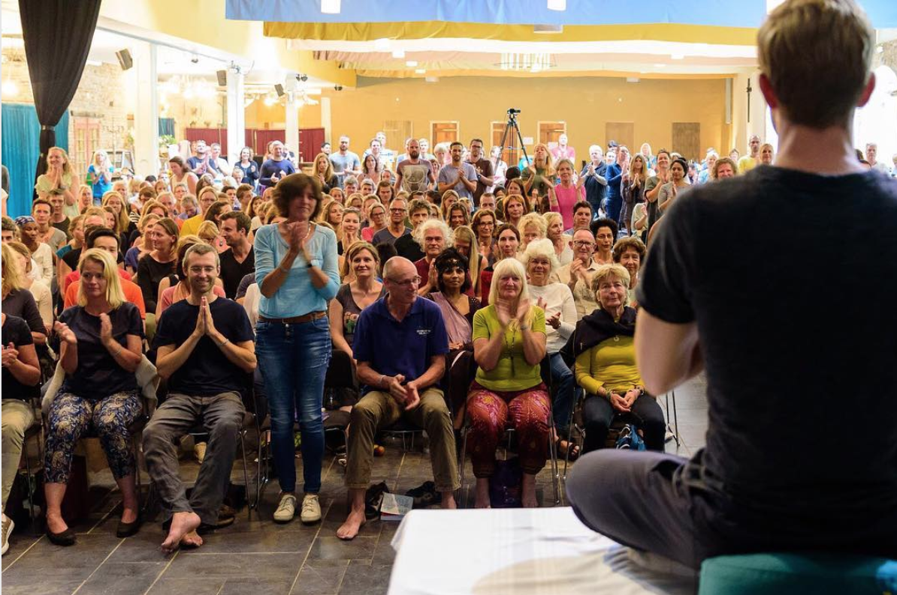

Since his first Youtube video, Bentinho has built a massive following. He can attract over 500 people to his in person retreats. His [Facebook page](https://www.facebook.com/bentinhomassaro/?fref=ts) has over 300,000 likes. Instagram is over [20,000 followers](https://www.instagram.com/bentinhomassaro/). There are two, well-run Facebook groups, one with 19,000 members. His Youtube videos have over two million views in total. He runs four exceptionally well designed websites — a free [online academy](https://www.trinfinityacademy.com/), a monthly video based [membership site](http://www.bentinhomassaro.tv/), his core [site](http://www.bentinhomassaro.com/) and the [Trinfinity Corp](https://www.trinfinity.us/projects/). master plan. At its peak Bentinho’s Trinfinity academy was bringing in $60,000 per month from member subscriptions alone. With a $14,000 a month rent for his office in Boulder that level of income was definitely needed. And he [gives talks](http://www.bentinhomassaro.com/events/season4) in Sedona that attract over a hundred people each week in which he collects cash donations. He utilizes state of the art technology to record and broadcast them live on Crowdcast and then repurpose them on his platforms. He frequently utilizes Facebook Live and his team uses WhatsApp to communicate via several different groups. One of the WhatsApp groups Bentinho named “Boner in Dona” and it uses an image of a phallic looking Red Sedona rock as its icon.

It’s evident that what has “worked” has little to do the specifics of his spiritual ideas. Bentinho mainly teaches a mashup of Advaita Vedanta and the Law of Attraction. Other influences include Osho, Bashar, “The Law of One” channeled by Ra, Nisargadatta Maharaj and some yogic texts as well. He peddles in unrealistic promises such as “find complete happiness in two steps,” or “realize the absolute in two weeks.” But the ideas could be interchanged without compromising the results. It’s the medium, the format, the method and the technique that “works.” The goal of a cult leader is the same regardless of the jargon: confuse, disassociate and control. It is about “being led away from yourself.” At a recent meeting Bentinho told his followers to not focus on the content, rather focus on what he is transmitting. And that “what” which is being transmitted is much more illusive and deceptive than his students could ever imagine.

Bentinho’s long game for his business is truly audacious. His master plan for [Trinfinity Corporation](https://www.trinfinity.us/projects/) is right out of a sci-fi movie. He’s building a global, cosmic empire in a four phase sequence that ends with a “Trinfinity City.” He wants to create an “enlightened society by 2035.” Earlier phases include apps, film, TV & record studios, virtual reality machines, an astral projection inducer, a tech lab, a publishing platform and yes, a system to foster open contact with aliens.

The Sedona Creative Life Center where Bentinho holds his weekly talks.

It’s clear that Bentinho has achieved many of the goals of a new startup: successful branding, passive income, social media reach, great design and platform creation. Bentinho has mastered the game. No, he *became* the game and upgraded it. *Cosmic domination*. He wants your soul. And his followers are the pawns of his delusional, tragic vision of an enlightened society.

In this clip Bentinho clearly lays out his plan for his new “heaven on earth” utopia, “My vision is to buy a large piece of land and start a new city with all of you…As with everything I will succeed.”

[Bentinho Massaro Intergalactic Communication](https://www.youtube.com/watch?v=UkbEAWBLBks)

[ Bentinho Massaro - How to Abuse WomenGaby Petris • 9.9K views2:56](https://www.youtube.com/watch?v=j8BjMOf-boE)[ my opinion on bentinho massaronewagegirly • 3K views5:31](https://www.youtube.com/watch?v=itYFrnUoMB4)[ Interview with Bentinho Massaro on Hearts Leadership - by Petra van BrussenBentinho Massaro • 5.5K views39:38](https://www.youtube.com/watch?v=k5mxQOl8Oyg)[ How Can I Access the DMT State? - Bentinho MassaroBentinho Massaro • 23K views7:10](https://www.youtube.com/watch?v=5HzFDjJmocw)[ Bentinho Massaro faces toughest interview yetGaby Petris • 1.5K views2:47](https://www.youtube.com/watch?v=6a0pswxI6xY)[ Bentinho Massaro (Octorber 6, 2017) - Eclipse of DisclosureArchie Rees • 5.6K views1:11:11](https://www.youtube.com/watch?v=eEXb9Z8JeRA)[ Bentinho Massaro - Holy HellGaby Petris • 4.3K views2:01](https://www.youtube.com/watch?v=opZzp7Phihc)[ Bentinho Massaro - The Ways ETs Communicate With UsEmpower Films • 3.2K views8:44](https://www.youtube.com/watch?v=I8VXC6g5t0Y)[ CFET F-18varsitymakeup • 74K views24:38](https://www.youtube.com/watch?v=tsSG07jGKjQ)

2:32 / 2:32
[(L)](https://www.youtube.com/watch?v=UkbEAWBLBks)

Video: [Gabby Petris Youtube](https://www.youtube.com/channel/UCLMnsqh8TaR3jExcDbmhHaw/videos)

Bentinho has the power, the money and the tech savviness to actually do it. He has slowly and carefully implemented a brilliant strategy to prop himself up as an infallible Guru. However, as of late, his methods are becoming more drastic and his teachings more dire. This isn’t just some pie in the sky far out Sedona hippie experiment. It’s Steve Jobs meets Jim Jones. Time to wake the fuck up.

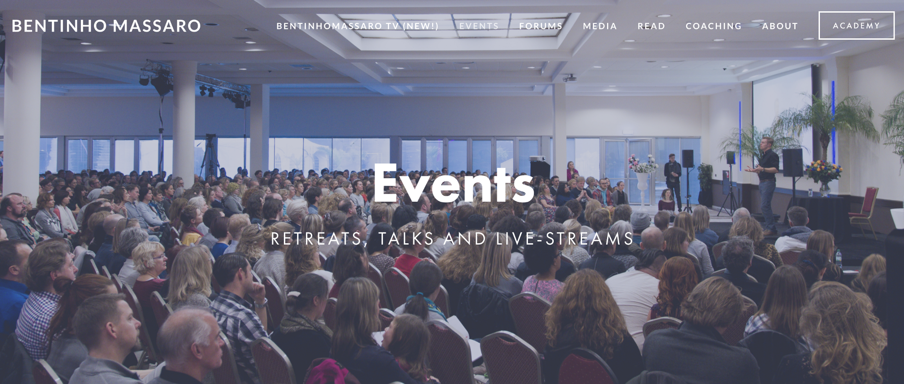

A screenshot from Bentinho Massaro’s website showing a large crowd of his followers.

### Branding is Everything

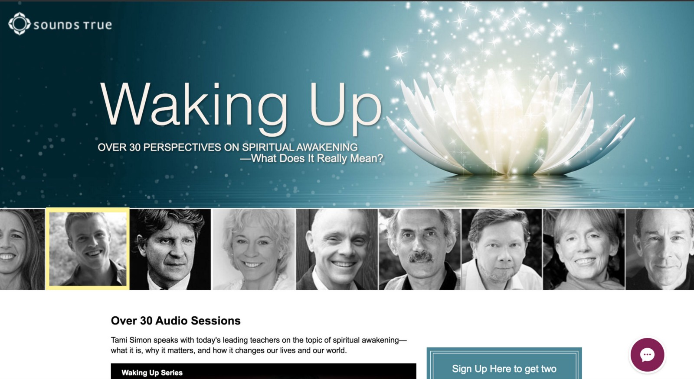

Bentinho’s “brand” brought him as far as being featured with a select group of spiritual teachers for the Sounds True audio program “Waking Up.” Alongside other luminaries such as Eckhart Tolle, Adyashanti and Jack Kornfield he discussed his views on the meanings of spiritual awakening with Sounds True founder Tami Simon. His following and his platform strategically positioned him for such a role.

However, Massaro’s brand has become increasingly tarnished. A series of attacks he made on other teachers coincided with him being disinvited from speaking at the Science and Non-Duality Conference in 2012. As his teachings and tactics become more drastic and the word spreads about his cult techniques his brand will be more and more damaged. There can be real consequences from industry insiders. Leaders like Tami Simon have taken action in the past against other figures. In 2011 she dropped spiritual teacher Marc Gafni from his book contract and [publicly spoke out](http://integral-options.blogspot.com/2011/09/breaking-marc-gafnis-sexual-impropriety.html) against his unethical actions and abuse of power.

### The “How to Start a Cult” Playbook

Bentinho can show us all how to start and run a cult.

[Clip - Enlightenment Study Course - Check In Video #2](https://www.youtube.com/watch?v=R65Fo3WpXcs)

[  "Is Hypnosis Fake?" Hypnotist stuns TEDX crowd  Albert Nerenberg • 317K views  25:23](https://www.youtube.com/watch?v=1RA2Zy_IZfQ)[  my opinion on bentinho massaro  newagegirly • 3K views  5:31](https://www.youtube.com/watch?v=itYFrnUoMB4)[  The Most Embarrassing way to Crash an Airplane  Friendly Skies Film • 110K views  6:51](https://www.youtube.com/watch?v=xISTKkLdSJU)[  Bentinho Massaro - Not true spiritual teacher. look for mooji or eckhart tolle  Daniel Eder ASMR Spiritual Growth • 4.1K views  6:55](https://www.youtube.com/watch?v=ur5ZOolP76M)[  The twenties in Color America in Color The 1920s Smithsonian Channel  Nikos Nikolakopulos • 81K views  48:01](https://www.youtube.com/watch?v=1kjqZwAAUDk)[  Jodie Foster Has Never Spoken To Anthony Hopkins - The Graham Norton Show  The Graham Norton Show • 3.2M views  2:03](https://www.youtube.com/watch?v=fXUsRIcwtSo)[  B727 manual landing: watch a REAL pilot at work! FULL ATC! [AirClips]  Air-Clips.com • 719K views  10:52](https://www.youtube.com/watch?v=HZ4BYc-fKeg)[  Jimi Hendrix Experience Live Royal Albert Hall 1969  Darryl Houston Smith • 37K views  1:21:14](https://www.youtube.com/watch?v=fxv5gMKXncs)[  Bentinho Massaro - Holy Hell  Gaby Petris • 4.3K views  2:01](https://www.youtube.com/watch?v=opZzp7Phihc)[  Interview with Bentinho Massaro on Hearts Leadership - by Petra van Brussen  Bentinho Massaro • 5.5K views  39:38](https://www.youtube.com/watch?v=k5mxQOl8Oyg)[  Smashing Pumpkins – Complete SNL Rehearsal Footage – 1993  Apathy Video • 12K views  40:48](https://www.youtube.com/watch?v=SMiZTrwcwOU)[  Bentinho Massaro faces toughest interview yet  Gaby Petris • 1.5K views  2:47](https://www.youtube.com/watch?v=6a0pswxI6xY)

1:07 / 1:11
[(L)](https://www.youtube.com/watch?v=R65Fo3WpXcs)

Video: [Gabby Petris Youtube](https://www.youtube.com/channel/UCLMnsqh8TaR3jExcDbmhHaw/videos)

#### 1. Claim divinity and special God like powers

According to an ex-member who wrote an article called [“The Cult Promise of Bentinho Massaro”](http://gabypetris.blogspot.com/2015/03/blog-post_24.html) he claims he “is not human and incarnates on numerous planets to upgrade their civilizations, is able to direct rain, wind and lightening, is a god/God, is Buddha, is awakened and has never met anyone with as much integrity as himself.” He himself publicly said so:

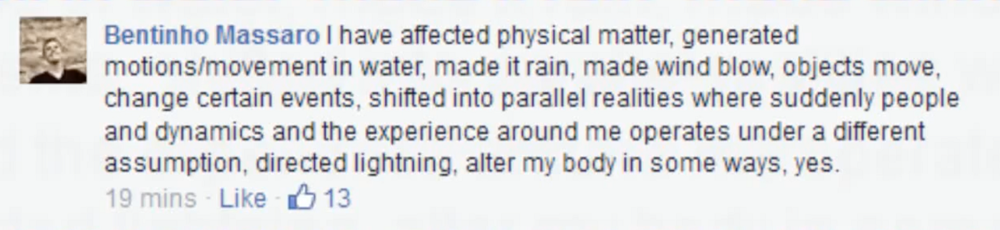

In the audio clip below, one of Bentinho’s devotees / core team member claims that she has seen him move clouds and change the weather on multiple occasions. He’s also physically moved objects with his mind she stated:

“I’ve watched him control the weather a lot of times. We’ll be at a party and I’ll be like ‘Bentinho these clouds are not good, it looks like rain. Within ten minutes they’re gone. He does it all the time. I’ve watched him move objects on tables. I’ve seen him multiple times change weather or move clouds.”

[SoundCloud cookie policyCookie policy](https://soundcloud.com/pages/cookies)

 [(L)](https://soundcloud.com/user-720522226/bentinho-has-the-power-to-control-the-weather)

 [(L)](https://soundcloud.com/user-720522226/bentinho-has-the-power-to-control-the-weather)

 [Batgirl](https://soundcloud.com/user-720522226)

 [Bentinho Has the Power to Control the Weather](https://soundcloud.com/user-720522226/bentinho-has-the-power-to-control-the-weather)

 [(L)](https://w.soundcloud.com/player/?referrer=https%3A%2F%2Fmedium.com%2Fmedia%2Fe632d6e705f362d173aece43424eeb92%3FpostId%3Da56314f830ef&show_artwork=true&url=http%3A%2F%2Fapi.soundcloud.com%2Ftracks%2F363355022)

Leave a comment at 0:42

- 2K plays2K

## Explore more music & audio like   [Bentinho Has the Power to Control the Weather](https://soundcloud.com/user-720522226/bentinho-has-the-power-to-control-the-weather) on SoundCloud.

 [       Hear more onSoundCloud](https://soundcloud.com/user-720522226/bentinho-has-the-power-to-control-the-weather)

 [(L)](https://soundcloud.com/user-720522226/bentinho-has-the-power-to-control-the-weather)

Another core team member claims that Bentinho changing the weather is “no big deal:”

[SoundCloud cookie policyCookie policy](https://soundcloud.com/pages/cookies)

 [(L)](https://soundcloud.com/user-720522226)

 [Batgirl](https://soundcloud.com/user-720522226)
   Changing the Weather is "No Big Deal"

 [(L)](https://w.soundcloud.com/player/?referrer=https%3A%2F%2Fmedium.com%2Fmedia%2F79021eabb4ac89d591014417f16cef7e%3FpostId%3Da56314f830ef&secret_token=s-6Xm0a&show_artwork=true&url=http%3A%2F%2Fapi.soundcloud.com%2Ftracks%2F362518172)

- 1.4K plays1.4K

Someone asked him in a Facebook comment: “I’ve often wondered if you are the re-embodiment of Christ. I see so many similarities and a mirroring if you will of his life here on earth with yours.” His response was disturbing, “He was a fabulous and brave and powerful messenger, but still considered himself the son, rather than having become God.” Bentinho is a God, you see. He said Jesus was only on the “4th density” out of 8. Massaro claims to be on the “8th density” according to one of his students. 8th is the highest level. Others say he is 6th density. Regardless, he claims to be ***higher*  **than Jesus!

Massaro claims that his teachings are the best “offered on all of planet earth.”

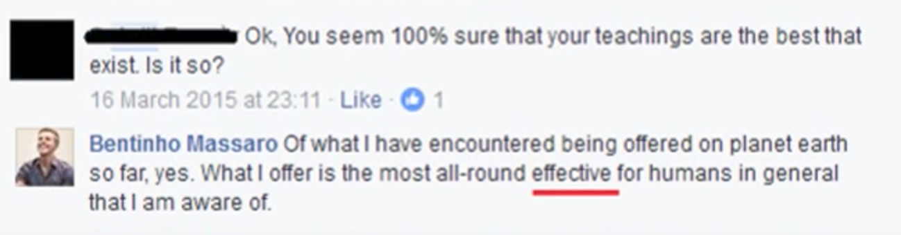

The grandiosity continues, “I always thought I was supposed to be one of the most efficient and versatile spiritual teachers on the planet. Now that that’s the case it expands my vision even more.”

One [program](https://awakening-together.org/audio-from-satsang-with-bentinho-massaro/) that Bentinho appeared on described him as “a young enlightened master who shines with joy, love and a strong sense of freedom.”

One core staff member claims that the highest, most awakened masters of all time are at “7th density” and Bentinho is at 8th. It’s common to hear his students claim that he is so evolved “there is nobody in there.” All of the students and core staff members I spoke with believe that Bentinho is highly awakened. In this clip his core staff member explains that Bentinho is the “Team leader for the Starseeds.”

[SoundCloud cookie policyCookie policy](https://soundcloud.com/pages/cookies)

 [(L)](https://soundcloud.com/user-720522226)

 [Batgirl](https://soundcloud.com/user-720522226)
   Bentinho Massaro: "Team Leader for the Starseeds"

 [(L)](https://w.soundcloud.com/player/?in=user-720522226%2Fsets%2Fbentinho-massaro-cult%2Fs-LHQwp&referrer=https%3A%2F%2Fmedium.com%2Fmedia%2F97b1a6b157d45c3d42b3c45f73944777%3FpostId%3Da56314f830ef&secret_token=s-A43Ex&show_artwork=true&url=http%3A%2F%2Fapi.soundcloud.com%2Ftracks%2F356725295)

- 1.5K plays1.5K

Here, the same follower describes how the most awakened, highly evolved masters of all time were at 7th density whereas Bentinho is at 8th.

[SoundCloud cookie policyCookie policy](https://soundcloud.com/pages/cookies)

 [(L)](https://soundcloud.com/user-720522226)

 [Batgirl](https://soundcloud.com/user-720522226)
   Highest Awakened Masters are 7th Density, Bentinho is 8th Level

 [(L)](https://w.soundcloud.com/player/?referrer=https%3A%2F%2Fmedium.com%2Fmedia%2Fa69a83db950ee07a4ebed130b816a285%3FpostId%3Da56314f830ef&secret_token=s-4CAEw&show_artwork=true&url=http%3A%2F%2Fapi.soundcloud.com%2Ftracks%2F356730650)

- 1.1K plays1.1K

Buddha and Jesus came in at 6th density and perhaps evolved to 7th according to her. Again, Bentinho resides in the 8th density she claims, which is the highest.

[SoundCloud cookie policyCookie policy](https://soundcloud.com/pages/cookies)

 [(L)](https://soundcloud.com/user-720522226)

 [Batgirl](https://soundcloud.com/user-720522226)
   Buddha & Jesus Came in at 6th Level, Bentinho is 8th Level

 [(L)](https://w.soundcloud.com/player/?referrer=https%3A%2F%2Fmedium.com%2Fmedia%2Fcb631c4568ba6610d3513fad8e45d080%3FpostId%3Da56314f830ef&secret_token=s-aIZb8&show_artwork=true&url=http%3A%2F%2Fapi.soundcloud.com%2Ftracks%2F356745437)

- 887 plays887

Another core team member can’t answer the question “Is Bentinho human?”

His core team member tells me in the clip above that Bentinho will call out the “spiritual bullshit” of other teachers. He “crucifies” Eckhart Tolle and all of the random teachings in Sedona, referring to them as “unicorn spirituality.” This is cult 101 — attack and denounce other teachings as false to prop up yours as enlightened.

#### 2. Normalize verbal abuse as part of the spiritual path and then claim impunity as a Guru

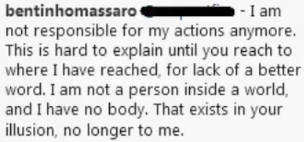

Bentinho states that he is not responsible for his actions because of the spiritual level he has attained. He repeatedly draws upon the idea, “No, it’s not me, it *you*!”

When I asked a former member why they left she told me, because, in part, “Verbal abuse and verbal degrading of members in public and private. Directing the group to shut down and shut out critics from the group.”

This video demonstrates that Massaro has clearly normalized verbal abuse as part of the spiritual “path.” A female student says she is upset because “I just asked a simple question and he said ‘fuck you.’” He goes on to repeatedly yell at her “fuck you, fuck you, fuck you, FUCK YOU.”

[Bentinho Massaro - The heart of his whole ugly con job laid bare](https://www.youtube.com/watch?v=qUHxRCDZDfo)

[ Bentinho Massaro - How to Abuse WomenGaby Petris • 9.9K views2:56](https://www.youtube.com/watch?v=j8BjMOf-boE)[ Bentinho Massaro faces toughest interview yetGaby Petris • 1.5K views2:47](https://www.youtube.com/watch?v=6a0pswxI6xY)[ Bentinho Massaro (Octorber 6, 2017) - Eclipse of DisclosureArchie Rees • 5.6K views1:11:11](https://www.youtube.com/watch?v=eEXb9Z8JeRA)[ my opinion on bentinho massaronewagegirly • 3K views5:31](https://www.youtube.com/watch?v=itYFrnUoMB4)[ Bentinho Massaro - Holy HellGaby Petris • 4.3K views2:01](https://www.youtube.com/watch?v=opZzp7Phihc)[ Bentinho Massaro OutburstGaby Petris • 5.9K views0:37](https://www.youtube.com/watch?v=-6VOzzloYxk)[ Bentinho Massaro will lead you into the lightGaby Petris • 497 views1:29](https://www.youtube.com/watch?v=wftagNPdRts)[ Piers Loses Control of Nigel Farage's Brexit Row With Alastair Campbell | Good Morning BritainGood Morning Britain • 1.3M views4:02](https://www.youtube.com/watch?v=ep2PuXu8fcY)[ Bentinho Massaro - Come to Sedona, Live in a Tent, Worship MeGaby Petris • 1K views1:32](https://www.youtube.com/watch?v=Ia-wwixG7Q8)

1:59 / 1:59
[(L)](https://www.youtube.com/watch?v=qUHxRCDZDfo)

Video: [Gabby Petris Youtube](https://www.youtube.com/channel/UCLMnsqh8TaR3jExcDbmhHaw/videos)

And in the video below he angrily tells the same woman: “If you weren’t so high up in your own ass about this fucking concept of respect you would actually see how much love there is behind me saying what I say.”

[Bentinho Massaro - How to Abuse Women](https://www.youtube.com/watch?v=j8BjMOf-boE)

[  Bentinho Massaro - Holy Hell  Gaby Petris • 4.3K views  2:01](https://www.youtube.com/watch?v=opZzp7Phihc)[  Bentinho Massaro faces toughest interview yet  Gaby Petris • 1.5K views  2:47](https://www.youtube.com/watch?v=6a0pswxI6xY)[  my opinion on bentinho massaro  newagegirly • 3K views  5:31](https://www.youtube.com/watch?v=itYFrnUoMB4)[  Bentinho Massaro - Meet the new boss. Same as the old boss.  Gaby Petris • 13K views  7:35](https://www.youtube.com/watch?v=EezWW4gGN2I)[  Bentinho Massaro (Octorber 6, 2017) - Eclipse of Disclosure  Archie Rees • 5.6K views  1:11:11](https://www.youtube.com/watch?v=eEXb9Z8JeRA)[  Noel Gallagher The Great Songwriters  Chema Fernández • 6.5K views  47:48](https://www.youtube.com/watch?v=RWiFyo9EJWI)[  Relationships: "Why can't I have the partner that's out of my league?"  Bentinho Massaro • 18K views  8:16](https://www.youtube.com/watch?v=621KZQH6o4U)[  Bentinho Massaro - Not true spiritual teacher. look for mooji or eckhart tolle  Daniel Eder ASMR Spiritual Growth • 4.1K views  6:55](https://www.youtube.com/watch?v=ur5ZOolP76M)[  Bentinho Massaro Outburst  Gaby Petris • 5.9K views  0:37](https://www.youtube.com/watch?v=-6VOzzloYxk)[  Tina Fey Strips Down to Her Spanx in Honor of David Letterman  Entertainment Tonight • 4.1M views  3:45](https://www.youtube.com/watch?v=rd4LI5MP17o)[  Bentinho Massaro - Sedona Cult Recruitment 1  Gaby Petris • 2.9K views  4:16](https://www.youtube.com/watch?v=atNReN10-Rg)[  The Only Thing You Need to Know About Triggers + How Heal Them  Marissa Ginty • 2.3K views  6:19](https://www.youtube.com/watch?v=MB79JO45ddA)

2:45 / 2:55
[(L)](https://www.youtube.com/watch?v=j8BjMOf-boE)

Video: [Gabby Petris Youtube](https://www.youtube.com/channel/UCLMnsqh8TaR3jExcDbmhHaw/videos)

Bentinho posted this disturbing excerpt on his Instagram account recently:

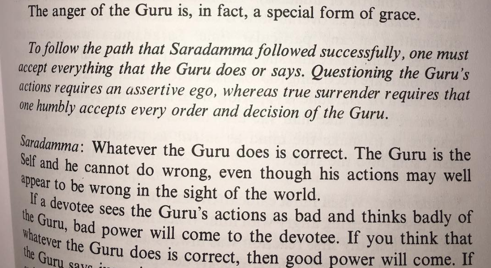

Along with this image he included an [in depth explanation](https://www.instagram.com/p/BagBLUqB-Nv/?taken-by=bentinhomassaro) to support his “anything goes” philosophy:

*> “Being friends with an awake being is nearly impossible, because: A) his first priority is your purification and elevation into truth; not kindness, niceness, agreeability or even apparent equality, and B) he is not like an ordinary person and thus cannot be successfully compared with normal standards or related to as just another person (which the finite mind does not like).”*

And here is evidence of him justifying his own verbal abuse:

More:

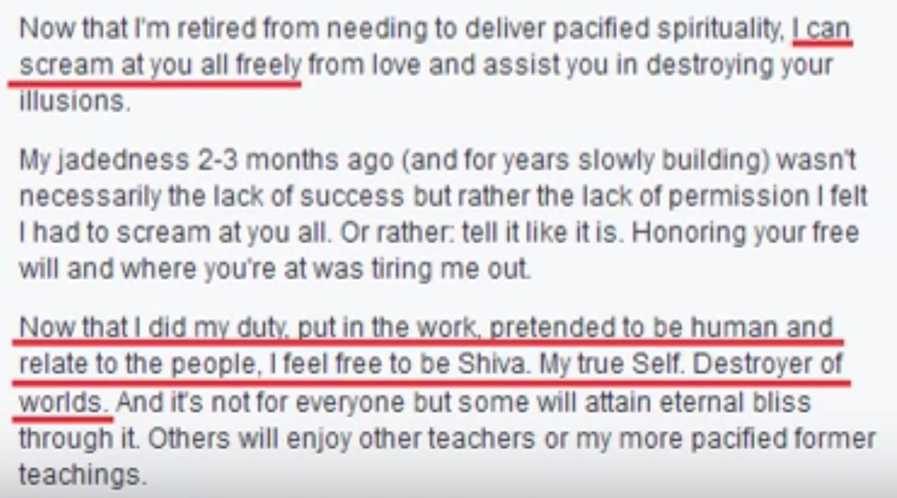

Most recently, decades of [sexual and physical abuse](http://www.telegraph.co.uk/men/thinking-man/sexual-assaults-violent-rages-inside-dark-world-buddhist-teacher/) by Sogyal Rinpoche, author of “Tibetan Book of Living and Dying” came to the forefront in a major way. A previous article I’ve written, [“Integral Abuse: Andrew Cohen & The Culture of Evolutionary Enlightenment”](https://medium.com/@bescofield/integral-abuse-andrew-cohen-the-culture-of-evolutionary-enlightenment-2010-dace41c982eb) illustrates the real life consequences this Guru devotion can lead to. Noted Buddhist scholar Stephen Bachelor recently wrote about the dangers of this path in his recent article [“Why I Quit Guru Yoga.”](https://tricycle.org/magazine/quit-guru-yoga/) Ironically, Bentinho apparently loved the online series that was produced about Andrew Cohen’s abusive cult. He gathered weekly with his staff to watch it.

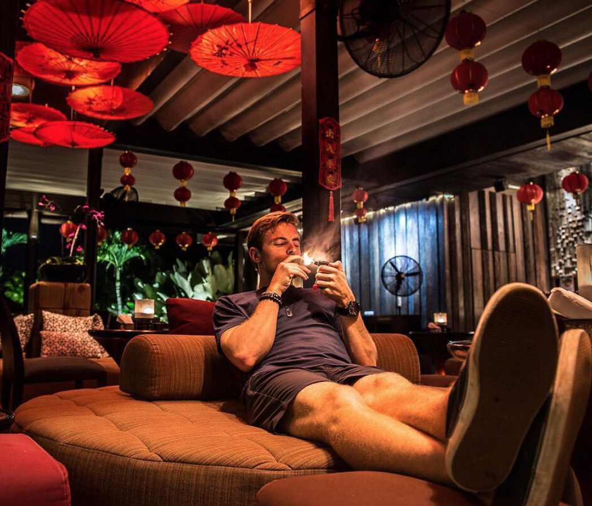

“Thinking about something is the surest way to miss out on the beauty of that actual something.”

― **Bentinho Massaro**

#### 3. Have sex with your students

Several inside sources, including former core staff members told me that while in Boulder, Massaro was having sex with one of his devotees. She was dating another group member and Massaro was married at the time. As a result he [announced](https://www.facebook.com/BMassaroFrench/posts/319478708194462) to his close followers that he and his wife were separating and that the student was part of his “new direction.”

A former core staff member also told me that on another occasion he slept with one of his students while leading a retreat in which his monogamous girlfriend was teaching the yoga sessions. She had no idea at first but discovered what he had done during the retreat which made things extremely awkward I’m told.

Massaro currently has three girlfriends and identifies as polyamorous. One of his current girlfriends was a student on one of his retreats. When speaking about Bentinho’s third, most recent girlfriend, who is only 21, his longer term partner bizarrely described him as “being in service to her.” Given the power he yields over his followers, his repeated claims that he is not responsible for his actions and the previous sexual relationships with students, I fear “poly” is being used as a cover for him to have free reign over students.

In this video, Bentinho appears to rationalize his sleeping with a student and having an affair on his wife.

[Bentinho Massaro Why I can cheat more than you](https://www.youtube.com/watch?v=qDzqFwU1-f4)

#### 4. Use disorienting methods to keep your devotees confused, distracted and in trance like states

Bentinho is currently pushing “dry fasting” on his followers. It means they cannot eat any food or drink any water, they can only have grape juice. He also recommends public participants of his “Sedona Experiment” follow this dry fasting method during the retreat. Several of his members including his girlfriends have done it. Some for 10 days, others for 21 and some for 108 days. One person told me she was in a “special place” during the middle of her 108 day fast when she discovered Bentinho’s teachings.

How safe is it to not drink water or eat food for 10–108 days? According to Dr. Douglas Graham [it is not.](http://foodnsport.com/blog/is-dry-fasting-desirable-or-deadly.html)

*> “Last night, I sat listening to a woman telling me about her dry fast experience. Three days in to the fast, she had to be hospitalized by her friends. The doctors made it clear that they were not certain she would pull through, and that only time would tell, but fortunately she lived to tell the tale. Too many others have not been so lucky. Dry fasting is extremely dangerous, and sadly, many more deaths will occur as a result of this unscientific and illogical craze.”*

Others who have tried it complain about hair and teeth falling out and then this just being described as a symptom of “detox” by the leaders in the group.

Here is one commentator who tried it:

*> “This system ruined my mental health (severe anxiety/depression). I now have heart palpitations when I lie down and pretty much have them all day. I Also got really skinny then gained more weight than I have ever had. The fast also triggered severe binge eating. The group is very cultish if you ask me. I was having extreme difficulty and was told to just keep going and pushing and fast some more. I eventually joined their video calls and expressed how the system negatively impacted my health. My testimonial was ridiculed and I have been subsequently blocked from both of the Facebook groups. I wish I never did this.”*

In this clip his devotee / core staff member discusses how she is on day 26 of no food or water and will be going for 108 days. Apparently this technique works on the level of “plasma.”

[SoundCloud cookie policyCookie policy](https://soundcloud.com/pages/cookies)

 [(L)](https://soundcloud.com/user-720522226)

 [Batgirl](https://soundcloud.com/user-720522226)
   Dry Fasting - No Food or Water

 [(L)](https://w.soundcloud.com/player/?referrer=https%3A%2F%2Fmedium.com%2Fmedia%2F34463734cad9d32065a0315022f158a8%3FpostId%3Da56314f830ef&secret_token=s-WVp9S&show_artwork=true&url=http%3A%2F%2Fapi.soundcloud.com%2Ftracks%2F356698415)

- 1.2K plays1.2K

Bentinho has also used and encouraged for his members polyphasic sleeping. It means you only sleep in small batches at a time as opposed to 6–9 hours. It’s an excellent way to keep someone in a trance state.

#### 5. Attack the family and encourage separation

In this clip Bentinho angrily tells his members:

*> “Fuck your relationships. They mean nothing. Let them go, let them go. Don’t give a fuck about your family. Don’t give a fuck about your children. Don’t give a fuck about your parents. Don’t give a fuck about your partner.”*

[Bentinho Massaro Outburst](https://www.youtube.com/watch?v=-6VOzzloYxk)

Video: [Gabby Petris Youtube](https://www.youtube.com/channel/UCLMnsqh8TaR3jExcDbmhHaw/videos)

Elsewhere he has stated: “If your family thinks you’re nuts when you express the truth of your being, it’s not your family and you should/could be excited to find a new family. If they don’t wish to be open to any of this whatsoever, they won’t have a real place in the world 10 years from now anyway.”

#### 6. Convince your devotees to lose themselves, abandon critical thinking and reframe everything as positive

Central to Bentinho’s teaching is an attack on the present moment, claiming it is based in the past. Instead we need to live in the “future present” which is our imagination or a constant state of positivity as the video clearly demonstrates. If you think about it, this teaching perfectly sets him up to verbally abuse his students while they are instructed to immediately turn it into a positive.

[Bentinho Massaro - The Program](https://www.youtube.com/watch?v=cQRPa5mL0c0)

Video: [Gabby Petris Youtube](https://www.youtube.com/channel/UCLMnsqh8TaR3jExcDbmhHaw/videos)

Another central premise of Bentinho’s teaching is dissociating from and attacking the self. Everything you think you are must disappear. It is a wholesale attack on the mind, the self and anything “real.” We shouldn’t focus on the “what” of our experience, rather just “that” we experience. Definitions, descriptions or trying to “understand” our lives is impossible. He states, “Thinking about something is the surest way to miss out on the beauty of that actual something.”

He takes this to it’s logical conclusion by attacking the very foundation of how we navigate and understand our world.

*> “Witness yourself and see where you have these allegiances to logic, to reason, to linear description and simply start destroying these. No compassion. Just eradicate them. Completely destroy them. Roast those seeds.”*

Here is one devotee revealing the lengths to which she’ll go to implement his teachings:

*> “I realized that I was just too attached to this belief about my physical body being real. I couldn’t get it to fade and dissolve deeper. So to release my attachment to it, (this sounds a little intense but was necessary) I started visualizing a chainsaw cutting off my limbs slowly. Then I visualized it sawing my body in half from the head down. I saw it clearly in my mind and began tuning into the fact that no matter what happened to the body, I still existed. The chainsaw was me and all of it was simply just presence energy that I was moving around in different ways with my thoughts believing that it was something real. I imagined my body and my”self” completely destroyed. I deeply tuned into the truth of me being the Awareness of all that is…”*

#### 7. Make dying easier

Bentinho tries to normalize dying:

*> “You will all die, so how important can this be really? We want to become a group consciousness, an enlightened civilization, do we not? This is gonna take everything you have. It’s about giving up everything you have for the sake of the vision, to become the vision.”*

[Bentinho Massaro will lead you into the light](https://www.youtube.com/watch?v=wftagNPdRts)

Video: [Gabby Petris Youtube](https://www.youtube.com/channel/UCLMnsqh8TaR3jExcDbmhHaw/videos)

In this clip, he plants the seed that “you should be excited about your death.”

[Bentinho Massaro - Be excited - I'm excited to be saying goodbye to all of you](https://www.youtube.com/watch?v=h6m8CcsQNrg)

Video: [Gabby Petris Youtube](https://www.youtube.com/channel/UCLMnsqh8TaR3jExcDbmhHaw/videos)

#### 8. Claim your teachings are so advanced, others cannot understand them

In a Facebook post, Buddhist Geeks founder Vincent Horn called one of Bentinho Massaro’s video’s “infantile spiritual narcissism” and challenged him to a public “dharma battle” in Asheville or Boulder. Horn stated:

*> “The views I’ve seen you share on Facebook and in your public teaching videos are, in my estimation, naive and immature. More than that they are harmful. I think that you’re a soon-to-be-fallen guru and I’d like to help make the fall quicker — not for your sake — but for the sake of all those people on the fence about you, and all those who are yet to become disillusioned with your nonsense.”*

Bentinho’s response was that of a classic authoritarian guru. He claimed that Horn must study his work in depth before he could even begin to grasp his teachings and be worthy of a debate. He replied, “If you first go through my entire academy, I might consider something closer to what you suggest, but unlikely even then…If you could see even 10% of what goes on in my consciousness in a single day, study my every academy lesson and practice its suggested homework with an open mind…you’d have a different opinion altogether.”

#### 9. Promise salvation to your followers

Ex-member Gaby Petris describes his promise of salvation:

*> “Massaro says his teaching will lead to ‘the cessation of suffering and endless bliss’ and ‘heaven on earth.’ He has announced he is here to ‘transform this entire planet’, ‘nothing else will do’ and ‘nothing else will make his life worth living.’ He says he does not want children because he already has 7 billion.*

*> He predicts planet earth is at the crossroads of splitting into two planes of existence. High vibration 4th dimensional beings who embody love (as do his students) will ascend to a less physical realm featuring telepathic group consciousness. Low vibration 3rd dimensional beings who embody negativity are ‘on a ship going down.”*

#### 10. Encourage your members to follow you wherever you live

Massaro tells his followers to move and follow him. Several of the members I spoke with had done just that. Many people relocated their entire families and lives to Sedona just to be with him. Some even had moved twice, first moving to Boulder, where he was for a few years and then to Sedona.

#### 11. Promote government conspiracies & talk about aliens

Massaro promotes the discredited Hillary Clinton Pizza Gate conspiracy:

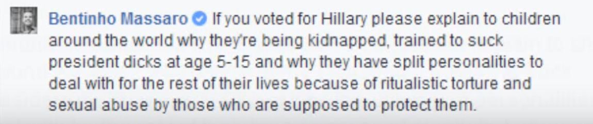

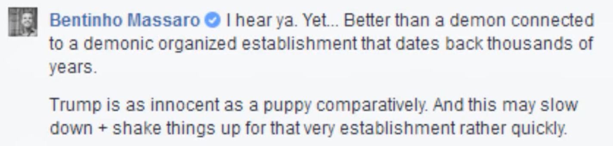

And here Bentinho claims that the Nazi’s won the war:

[Bentinho Massaro - "There are millions of humans living on Mars"](https://www.youtube.com/watch?v=ibFoTbPQGA0)

Video: [Gabby Petris Youtube](https://www.youtube.com/channel/UCLMnsqh8TaR3jExcDbmhHaw/videos)

Bentinho on aliens and ET consciousness:

*> “We have bases on the moon, a bunch of slave colonies on Mars that have been mining the asteroid belt, we have been colonizing galaxies of our solar system, we haven’t needed fossil fuels for the last 80 years because we have anti-gravitic mechanisms…The Nazi’s won the war. The US government gave up their control, their governance so we would not be exposed to free energy devices. If free energy gets released, and we’re [Trinfinity corp] working on it, it changes everything. We’ve had free energy for 80 fucking years.”*

*> “Don’t be surprised that the aliens we’ll meet — and we will meet them — look like the things you see in the movies. Don’t be like ‘oh this story of this guy is nonsense because I’ve seen that in the movies. He just got it from the movies.’ Well, did he get it from the movies or did the movies get it from them?”*

*> “The vision statement of Trinfinity is: to have an enlightened civilization by 2035 that’s ready for interstellar absorption. It means that we reach a level of maturity to where we as a collective are able to be contacted openly without us freaking out anymore, without it needing to be kept secret anymore, we have become are own government.”*

*> “Many of you are directly connected to ET consciousnesses.”*

*> “We’re going to be absorbed initially into different confederations or alliances of civilizations that are 4th density or higher. We will be taught a lot. There will be a new type of education.”*

As this short clip demonstrates, disclosing truth about alien contact is a central part of his Trinfinity organization’s budget and plan.

[Bentinho Massaro - Pay to Meet The Aliens](https://www.youtube.com/watch?v=SWlgoDJYeqw)

Video: [Gabby Petris Youtube](https://www.youtube.com/channel/UCLMnsqh8TaR3jExcDbmhHaw/videos)

This is a short clip from his “ET contact meditation” where he is talking about meeting aliens who are our “brothers.”

[Bentinho Massaro Sounding Like Marshall Applewhite](https://www.youtube.com/watch?v=U4DmvJGhrj8)

Video: [Gabby Petris Youtube](https://www.youtube.com/channel/UCLMnsqh8TaR3jExcDbmhHaw/videos)

More:

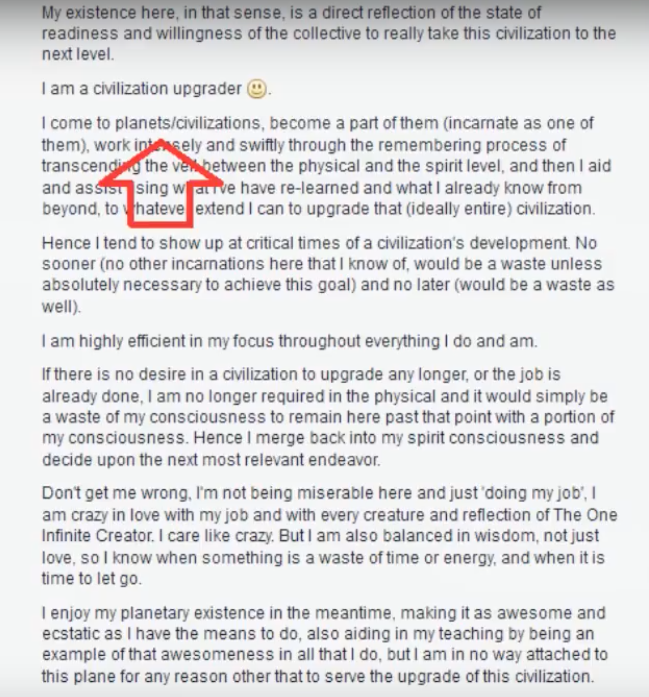

#### 12. “Guru gaze” at your followers for lengthy periods of time

[Bentinho Massaro performs John de Ruiter cover version for Sedona Cult](https://www.youtube.com/watch?v=Fe9LJblkoo8)

Video: [Gabby Petris Youtube](https://www.youtube.com/channel/UCLMnsqh8TaR3jExcDbmhHaw/videos)

#### 13. Take 12 disciples into the desert on retreat as “guinea pigs” to test your methods

> “Cult leaders do not have schools of persuasion to attend. They become masters of the folk art of human manipulation through testing and observing what works. They modify their approaches and techniques and use centuries-old manipulative devices to lead people to change.” — *> Margaret Singer, *> Cults in Our Midst

One of his main devotees told me how Bentinho took a close group of his inner circle into the desert for 14 days to give them “teachings on the absolute.” She said it was an intense period of meditation and teachings and that he was experimenting on the group. The most cult like elements certainly begin with the closest, most inner core of followers and then expand outward from there.

She states in the clip below, “He wanted to experiment with a group of 12 people as guinea pigs to be able to synthesize the best way to teach it which is what he does so well…**It felt like Jesus and the disciples because we were the first ones receiving these teachings.** It was an extraordinary experience. ”

[SoundCloud cookie policyCookie policy](https://soundcloud.com/pages/cookies)

 [(L)](https://soundcloud.com/user-720522226)

 [Batgirl](https://soundcloud.com/user-720522226)

   12 Disciples in the Desert: "He Wanted to Experiment with 12 people as Guinea Pigs"

 [(L)](https://w.soundcloud.com/player/?referrer=https%3A%2F%2Fmedium.com%2Fmedia%2Fb4f1437c9dcdf946f045fb31b4e2afe0%3FpostId%3Da56314f830ef&secret_token=s-7KD00&show_artwork=true&url=http%3A%2F%2Fapi.soundcloud.com%2Ftracks%2F356768750)

- 843 plays843

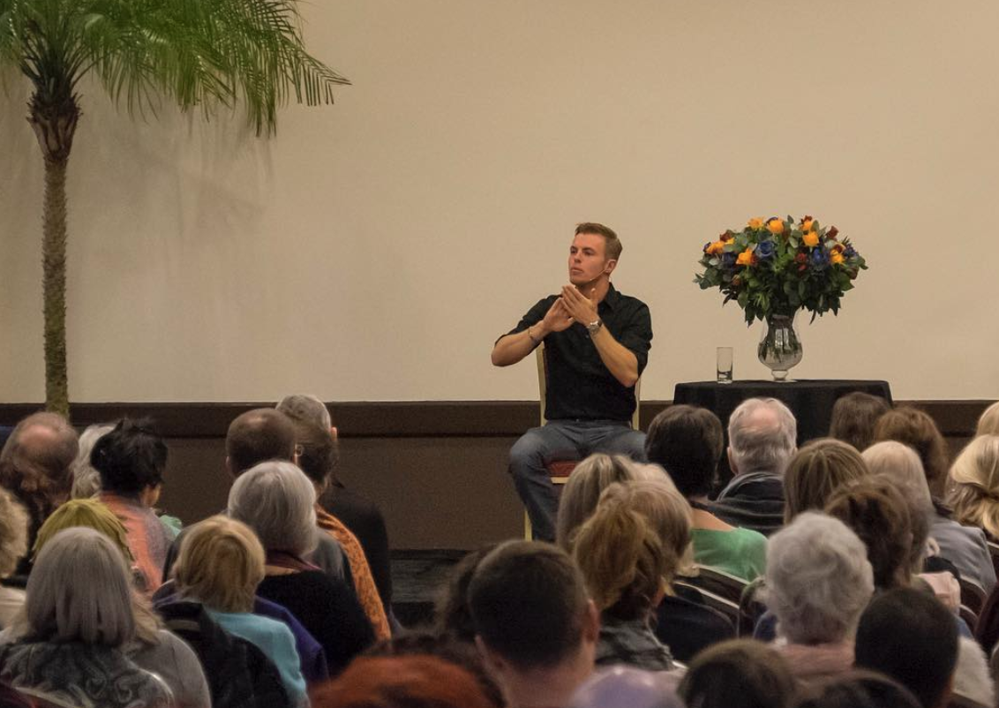

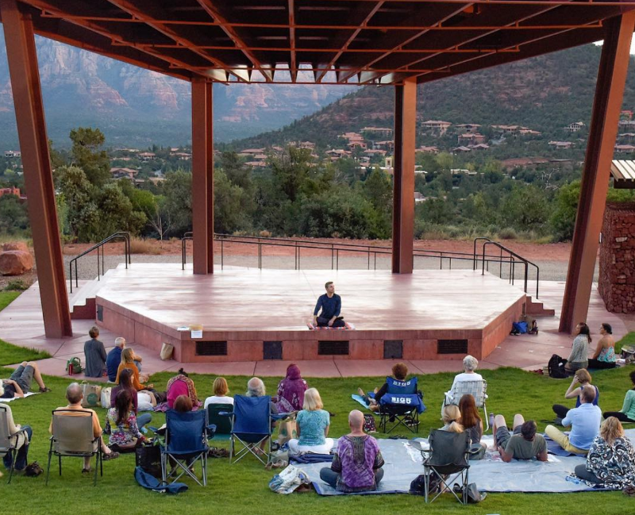

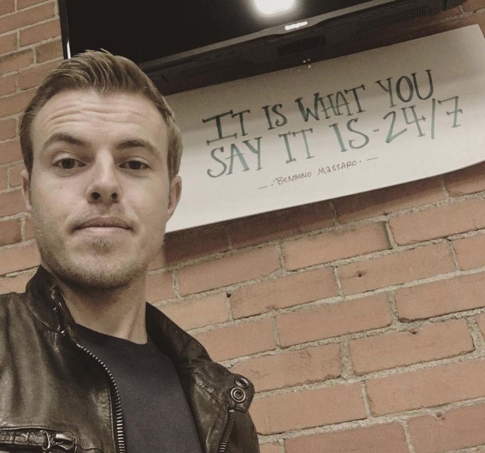

#### 14. Create an enlightened city

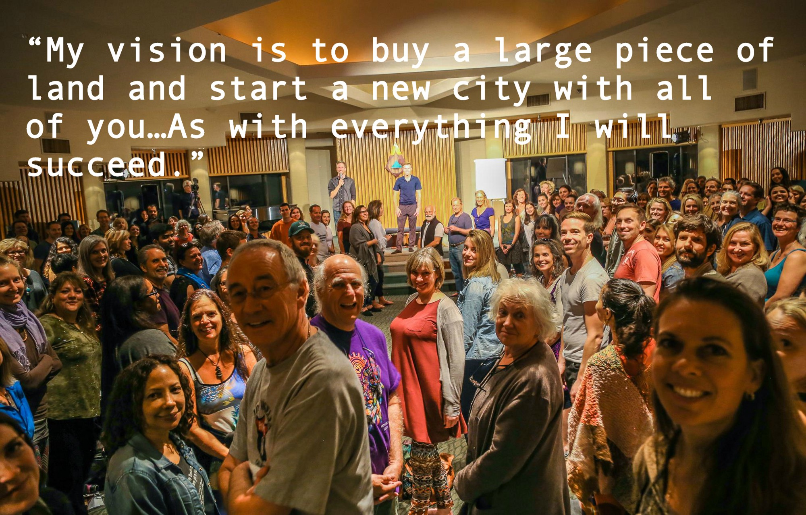

After Bentinho dissolved his Trinfinity team in Boulder, he went on a “dark retreat” in Thailand where he sat in complete darkness. It was supposed to be two weeks but after just 5 days he was shown a vision for creating the enlightened society he had been talking about for so long.

*> “When I came out of darkness, I looked up properties in this area that’s been calling me, and I found a property that would suit our needs, had almost all the elements that were in my vision, looked incredibly similar, and sits at the exact location I was shown…It’ll be the center of everything to come. An anchor for the New Earth vibrations to stream into our atmosphere and into the earth, for we will act as a receiving antenna as well as a grounding beacon.”*

Here is one of his followers telling me all about the progress they are making in enacting this vision.

[SoundCloud cookie policyCookie policy](https://soundcloud.com/pages/cookies)

 [(L)](https://soundcloud.com/user-720522226)

 [Batgirl](https://soundcloud.com/user-720522226)

   "We're Looking For Land. This is the Vision He Had in the Darkness Retreat."

 [(L)](https://w.soundcloud.com/player/?referrer=https%3A%2F%2Fmedium.com%2Fmedia%2F70c2728c50ebfd523bed2edd9418862e%3FpostId%3Da56314f830ef&secret_token=s-VO1om&show_artwork=true&url=http%3A%2F%2Fapi.soundcloud.com%2Ftracks%2F356777987)

- 862 plays862

What started as a small “build as you grow business” has now moved into the investor phase. This is a screenshot of the investor plan from his attempt to raise capital for his new earth vision.

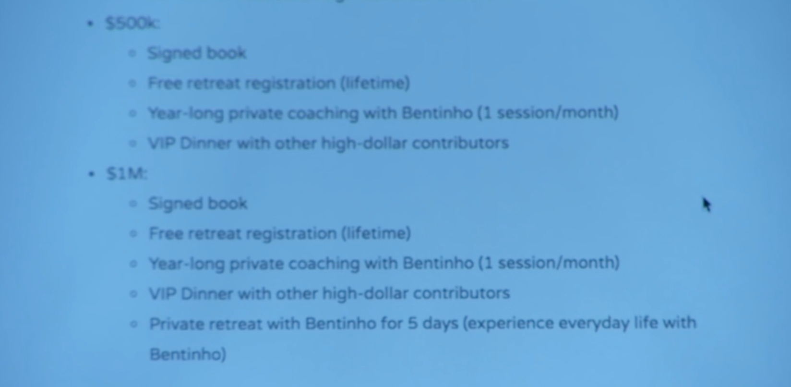

No dangerous cult began by asking members to sign over their homes or make significant financial investments. They start with seemingly benign things like “spiritual” teachings, community events and gatherings. Slowly, as the cult leader begins to gain power and influence they begin taking more drastic measures to take full control over their members.

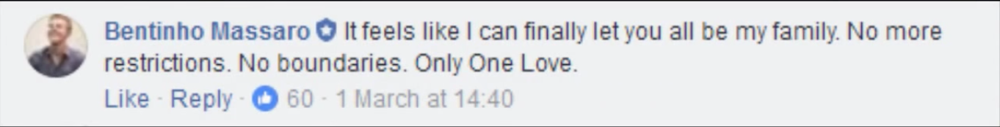

This [excerpt](http://www.bentinhomassaro.com/read/my-experience-at-a-bentinho-massaro-retreat) from one person’s experience illustrates the sort of idealization and fantasizing that is going on in his group. It is propping him to a God like reality which any cult is built upon.

*> “…when suddenly Bentinho and [his girlfriend] arrived. An air of unreality descended upon the evening, like two elvish beings warped spacetime into a plane of heightened awareness…That night Bentinho’s new partner came on stage for the first time, and it was pure regality to see them sitting there together. Everybody seemed to feel the utter beauty of humanity connected, like an ancient people before their King and Queen…[They] were simply representations of Union on this physical plane, exemplifying the Feminine and Masculine.”*

Here, Bentinho talks about consuming his sheep, “the more you become a lion or lioness and absorb and digest the sheep around you and spit them out…consumption is love.”

[Bentinho Massaro - Spit Out The Sheep](https://www.youtube.com/watch?v=F_r-z-Q6_HI)

Video: [Gabby Petris Youtube](https://www.youtube.com/channel/UCLMnsqh8TaR3jExcDbmhHaw/videos)

### Bentinho’s Mental State

In 2012 Bentinho [posted](https://imgur.com/a/gkY4v) on FB that he has been diagnosed with narcissistic personality disorder. **In one of his **[**talks**](https://youtu.be/o5C3VWQOGz8?t=44s)** he describes how he tortured a kitten when younger by repeatedly slamming it into a bush of thorns for twenty minutes.** He didn’t know at the time but it was dark “entities” that were making him do it. When I told a cult expert friend who was following my work on this story that Bentinho had openly admitted to torturing a kitten he was not surprised. He said: “Of course he did. He probably bullied and tortured other children as well. Admissions from people like this are never complete.” The torturing of animals when young is a very high predictor of psychopathy later in life.

Bentinho meets most all the criteria for Narcissistic Personality Disorder. One must meet at least 5 of the below items to qualify as a narcissist:

- •Has a grandiose sense of self-importance (exaggerates achievements, expects to be recognized as superior without commensurate achievements)
- •Is preoccupied with fantasies of unlimited power, success, brilliance, beauty or ideal love
- •Believes he is “special” and can only be understood by similarly special, high status people
- •Requires excessive admiration
- •Has a sense of entitlement
- •Is interpersonally exploitative
- •Lacks empathy
- •Is envious of others or believes others are envious of him/her
- •Shows arrogant, haughty behaviors or attitudes

*From the article *[*Narcissist or Sociopath? Similarities, Differences and Signs: 7 reasons why it’s often so tough to spot them, and how you can*](https://www.psychologytoday.com/blog/the-integrationist/201608/narcissist-or-sociopath-similarities-differences-and-signs)*.*

There are many out there who are fully aware of what Bentinho is up to and not buying into it. They have been raising the alarm bell for quite some time:

*> “Dear God, something always seemed a bit off about Bentinho to me, but I never delved deeply enough into his stuff to realize how insane and dangerous he clearly is…****> I think it should be quite obvious to any mental health professional that this guy is suffering from classic bipolar I disorder, complete with outright psychosis.****>  I’m staying far, far away.”*

*> “I met Bentinho when I had a radio program and he was a guest. When I saw him backstage, firsthand, I was appalled. I had invited him to speak at a gathering and had to uninvite him. ****> Several of his devotees came forward to me with their being abused psychologically by him.****>  He is an easy one to spot. There are many more who are wolves in sheep’s clothing that have made inroads in our trust that are unwarranted.”*

*> “He was meant to die a few years back. ****> He told all of his followers that he would be leaving the planet****> …He’s such a ding dong and the people who believe this shit are even more ding dongs!”*

In several of his videos there is a manic like energy coming through. Even in his very first posting in 2010 you can identify it. He’s often excited and giddy. Something is off. This video captures what I see more subtly in many of his other videos:

[Bentinho Massaro - Desondent! Epic! Awesome!](https://www.youtube.com/watch?v=mlJcVwOWSrg)

[ my opinion on bentinho massaronewagegirly • 3K views5:31](https://www.youtube.com/watch?v=itYFrnUoMB4)[ Bentinho Massaro - Holy HellGaby Petris • 4.3K views2:01](https://www.youtube.com/watch?v=opZzp7Phihc)[ Difference Between 'Being Spiritual' and Enlightenment - Bentinho MassaroBentinho Massaro • 12K views19:49](https://www.youtube.com/watch?v=CM_pTqyN_9E)[ Tom Cruise's Heated Interview With Matt Lauer | Archives | TODAYTODAY • 4M views13:56](https://www.youtube.com/watch?v=tFgF1JPNR5E)[ Bentinho Massaro faces toughest interview yetGaby Petris • 1.5K views2:47](https://www.youtube.com/watch?v=6a0pswxI6xY)[ Understanding Life is Impossible - Bentinho MassaroBentinho Massaro • 40K views8:58](https://www.youtube.com/watch?v=_CFSV0AOKHk)[ Bentinho Massaro - How to Abuse WomenGaby Petris • 9.9K views2:56](https://www.youtube.com/watch?v=j8BjMOf-boE)[ Let Your Worries Go & Gain Deeper Freedom - Bentinho MassaroBentinho Massaro • 29K views12:54](https://www.youtube.com/watch?v=vSF4sf6BY2E)[ Bentinho Massaro - Meet the new boss. Same as the old boss.Gaby Petris • 13K views7:35](https://www.youtube.com/watch?v=EezWW4gGN2I)

2:33 / 2:33
[(L)](https://www.youtube.com/watch?v=mlJcVwOWSrg)

Video: [Gabby Petris Youtube](https://www.youtube.com/channel/UCLMnsqh8TaR3jExcDbmhHaw/videos)

In this clip, one of his main devotees describes how they will sometimes have to “drag him back to the car” because he’ll be so deeply entranced. She translates it has him being in constant state of “the absolute.”

[SoundCloud cookie policyCookie policy](https://soundcloud.com/pages/cookies)

 [(L)](https://soundcloud.com/user-720522226)

 [Batgirl](https://soundcloud.com/user-720522226)
   Bentinho "Stares & Dazes, Have to Drag Him to Car"

 [(L)](https://w.soundcloud.com/player/?referrer=https%3A%2F%2Fmedium.com%2Fmedia%2Fbdb5c57e96d37b8af5ce436d6fc5647a%3FpostId%3Da56314f830ef&secret_token=s-qKweM&show_artwork=true&url=http%3A%2F%2Fapi.soundcloud.com%2Ftracks%2F356704682)

- 840 plays840

And another clip of him zoning out. This time while on stage. He does this for 9 minutes.

[Bentinho Massaro See what I see](https://www.youtube.com/watch?v=WePgXa8dji4)

Video: [Gabby Petris Youtube](https://www.youtube.com/channel/UCLMnsqh8TaR3jExcDbmhHaw/videos)

And another:

[Bentinho Massaro - The Self](https://www.youtube.com/watch?v=K1x_tWfe9IY)

Video: [Gabby Petris Youtube](https://www.youtube.com/channel/UCLMnsqh8TaR3jExcDbmhHaw/videos)

One of the quintessential characteristics of a narcissist is a reframing of anything they do as just someone else’s issue. It’s “No, it’s not me, it *you*!” This is Bentinho ***all day long***. It’s his entire “spiritual” schtick. One insider told me how he would just constantly deny, reflect or avoid taking any responsibility for his actions. He said it was classic spiritual bypassing. When I asked one of his girlfriends what Bentinho is like, she said, “He’s like a mirror to myself.” When I asked her what it was like being in a relationship with him she told me “it’s like being constantly shredded.”

[Bentinho Massaro - "The people of this world are my children"](https://www.youtube.com/watch?v=UfOfM4D59Vk)

Video: [Gabby Petris Youtube](https://www.youtube.com/channel/UCLMnsqh8TaR3jExcDbmhHaw/videos)

#### The Emerging Portrait

After speaking with numerous former insiders about Bentinho, a common perspective emerged. Several thought he was narcissist, but also brilliant and charismatic. One person told me that without any thought, he left a girlfriend in an instant for another woman. Another told me of Bentinho’s lack of care or interest for a retreat participant who had been suffering from serious cold exposure at one of his luxury retreats.

I’m told Bentinho was an only child who was pampered endlessly by his eclectic and offbeat mother. She apparently constantly told him that he was the most perfect, brilliant, amazing child ever. One former member told me that he thinks Bentinho is recreating this childhood reality through the adoration, praise and support from his cult followers. At one point Bentinho even told his mother that she was no longer his mother as both of his parents are students of his now. Interestingly, Andrew Cohen’s mother, Luna Tarlo, started off as his student as well but eventually broke away and wrote a tell all book called [“Mother of God.”](https://www.amazon.com/Mother-God-Luna-Tarlo/dp/098245306X)

Bentinho is a high school drop out who left for India at 16 with the help of his well off parents. He drinks whisky, loves expensive scotch, smokes cigars and loves to throw parties. Bentinho drives a $55,000 Ford Mustang, rents two homes in Sedona and was a hardcore gamer who won a sizable gaming competition when he was younger. It was that expensive Mustang and the $3 million dollar home that he was renting in Boulder that led some former staff members to become incensed at the little to nothing pay he was offering them.

### Startup or Cult? Or Both?

> “All the best apps, companies, and products have broken the way we live life, transformed how we communicate, and changed our day-to-day. Good products evolve us.”*>  — Gary Vaynerchuk*

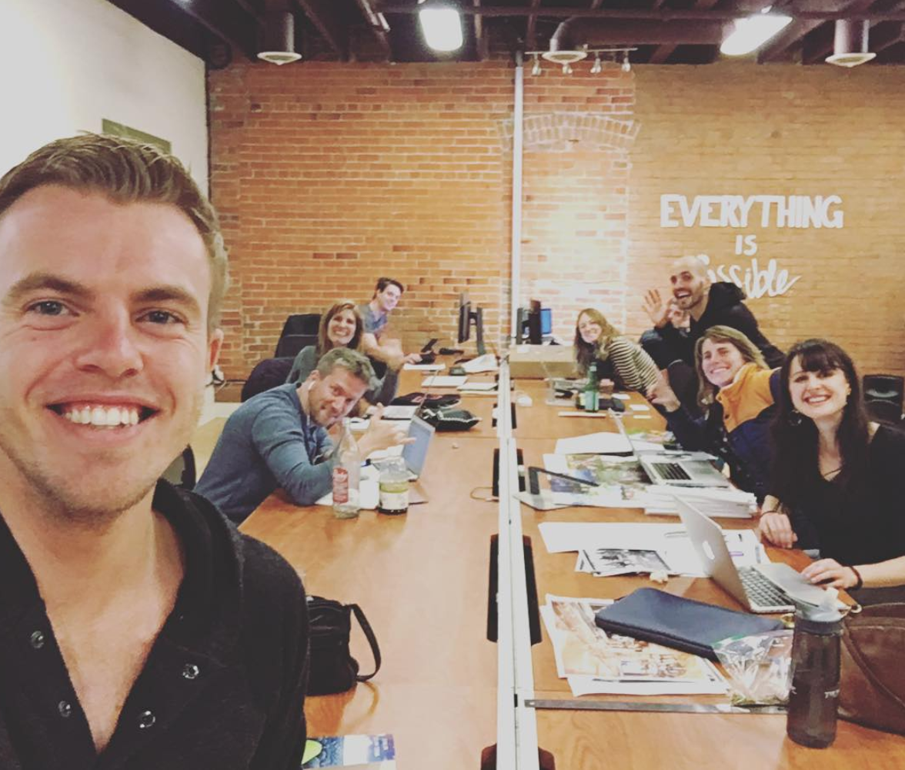

A simple google search of “startups and cults” reveals numerous articles exploring the similarities between the two. [One](https://www.wired.com/2014/09/run-startup-like-cult-heres/) claims that the best startups are “slightly less extreme kinds of cults” and that cults are “fanatically wrong about something important” whereas the best startups are “fanatically right about something those outside it have missed.”

Undoubtedly, Bentinho has accomplished what Gary Vee defines as the best qualities of a startup. He’s broken the way his followers live life. People have claimed that he’s transformed their “day-to-day” for the better. I’ve heard stories of people being healed from following his teachings, others claim their lives have been improved drastically. He’s also brilliantly combined the startup game with the Guru game, seamlessly intertwining them together.

Bentinho is not alone as being someone who brilliantly combined tech and cult. Spiritual teacher Teal Swan has made serious advancements in this department. A recent article [“Spiritual Guru or Dangerous Cult Leader?”](http://www.ozy.com/provocateurs/spiritual-guru-or-dangerous-cult-leader/81686) explores the ins and outs of her rise to fame. She has 400,000 subscribers on Youtube, almost 60,000 followers on Instagram, 150,000 likes on Facebook, 15,000 Twitter followers and runs a very active discussion forum on her site. She also has a monthly premium membership section on her site as well as an online store with her books and workshops. Her design is also on point. It’s clean, professional and well thought out. She too has created passive income and an attractive brand experience. And she’s only just beginning.

We are witnessing the birth of a new era — Cult 2.0. Teachers like Bentinho Massaro and Teal Swan offer a glimpse of what is to come. There will be a new rise of cult leaders who brilliantly use technology to grow their enterprises. Can you imagine if Jim Jones had Instagram or Facebook live? And what happens when virtual reality comes into play, something that Bentinho himself said is part of his company’s evolution?

### The End Game

> “To me death is not a fearful thing. It’s living that’s cursed.”*>  — Jim Jones*

> “I really feel like he is setting people up for a mass suicide. He talked about ‘The harvest.’ I always had a weird feeling.”*>  — Former core staff member*

Several Bentinho people, both former and current members have acknowledged a shift in his teachings over the last year. Some former members and staff are concerned and fearing the worst.

More recently Bentinho has been stepping into the role of awakened Guru and his teachings have become darker and more focused on “The Void” and “The Absolute.” He is normalizing dying. Bentinho claims to not be responsible for his actions. He thinks he can sleep with and psychologically abuse students with impunity. He’s begun “experimenting” on a core group of “guinea pig” students. He’s pushing his members to stop eating and drinking water for extended periods of time. Bentinho has successfully led his members away from themselves by attacking the core of their identities and diminishing their use of reason or logic. Everything, including Bentinho’s shouting, verbal abuse or strange actions are now expected to be interpreted as positive. He talks about the grand vision of building an enlightened city, finding land and taking his people there.

Wacky spiritual ideas, government conspiracies, alien contact or desert meditations are not that surprising for Sedona. There’s something much more disturbing going on in Bentinho’s group, however. The evidence is clear and incontrovertible. *Bentinho Massaro has built the quintessential 21st century cult*.

[Understanding Life is Impossible - Bentinho Massaro](https://www.youtube.com/watch?v=_CFSV0AOKHk)

The first talk on Bentinho’s Youtube channel dates back to 2010.

[SoundCloud cookie policyCookie policy](https://soundcloud.com/pages/cookies)

-

    - 71 plays71

Batgirl - Bentinho's Power to Control Weather

-

    - 1.2K plays1.2K

Batgirl - Dry Fasting - No Food or Water

-

    - 840 plays840

Batgirl - Bentinho "Stares & Dazes, Have to Drag Him to Car"

-

    - 1.5K plays1.5K

Batgirl - Bentinho Massaro: "Team Leader for the Starseeds"

-

    - 1.1K plays1.1K

Batgirl - Highest Awakened Masters are 7th Density, Bentinho is 8th Level

-

    - 94 plays94

Batgirl - Bentinho's Followers Love Him Because They've Been Wounded & Burned by other "False" Teachers

-

    - 887 plays887

Batgirl - Buddha & Jesus Came in at 6th Level, Bentinho is 8th Level

-

    - 125 plays125

Batgirl - "I Knew This Being Was Coming"

-

    - 843 plays843

Batgirl - 12 Disciples in the Desert: "He Wanted to Experiment with 12 people as Guinea Pigs"

-

    - 862 plays862

Batgirl - "We're Looking For Land. This is the Vision He Had in the Darkness Retreat."

This is the end... my only friend, the end.

 [Batgirl](https://soundcloud.com/user-720522226)
 Bentinho Massaro Cult Member Interview

 [  [200w.webp](../_resources/a9e1550527325363ecf89dd420a8c2c8.webp) ''](https://giphy.com/gifs/3o6fIVJhMBAzWHUGNa?utm_source=iframe&utm_medium=embed&utm_campaign=Embeds&utm_term=https%3A%2F%2Fcdn.embedly.com%2Fwidgets%2Fmedia.html%3Fsrc%3Dhttps%3A%2F%2Fgiphy.com%2Fembed%2F3o6fIVJhMBAzWHUGNa%2Ftwitter%2Fiframe&%3Burl=https%3A%2F%2Fmedia.giphy.com%2Fmedia%2F3o6fIVJhMBAzWHUGNa%2Fgiphy.mp4&%3Bimage=https%3A%2F%2Fmedia.giphy.com%2Fmedia%2F3o6fIVJhMBAzWHUGNa%2Fgiphy.gif&%3Bkey=a19fcc184b9711e1b4764040d3dc5c07&%3Btype=text%2Fhtml&%3Bschema=giphy)  [(L)](https://giphy.com/?utm_source=iframe&utm_medium=embed&utm_campaign=Embeds&utm_term=https%3A%2F%2Fcdn.embedly.com%2Fwidgets%2Fmedia.html%3Fsrc%3Dhttps%3A%2F%2Fgiphy.com%2Fembed%2F3o6fIVJhMBAzWHUGNa%2Ftwitter%2Fiframe&%3Burl=https%3A%2F%2Fmedia.giphy.com%2Fmedia%2F3o6fIVJhMBAzWHUGNa%2Fgiphy.mp4&%3Bimage=https%3A%2F%2Fmedia.giphy.com%2Fmedia%2F3o6fIVJhMBAzWHUGNa%2Fgiphy.gif&%3Bkey=a19fcc184b9711e1b4764040d3dc5c07&%3Btype=text%2Fhtml&%3Bschema=giphy)

 **


Share
 



Watch

Tech Bro Guru in the Boulder Office

 [  [200w.webp](../_resources/0fe2957940fea509eb64da7474da8358.webp) ''](https://giphy.com/gifs/bentinho-massaro-xT0xeLPq6pFS5psV8s?utm_source=iframe&utm_medium=embed&utm_campaign=Embeds&utm_term=https%3A%2F%2Fcdn.embedly.com%2Fwidgets%2Fmedia.html%3Fsrc%3Dhttps%3A%2F%2Fgiphy.com%2Fembed%2FxT0xeLPq6pFS5psV8s%2Ftwitter%2Fiframe&%3Burl=https%3A%2F%2Fgiphy.com%2Fgifs%2Fbentinho-massaro-xT0xeLPq6pFS5psV8s&%3Bimage=https%3A%2F%2Fmedia.giphy.com%2Fmedia%2FxT0xeLPq6pFS5psV8s%2Fgiphy.gif&%3Bkey=a19fcc184b9711e1b4764040d3dc5c07&%3Btype=text%2Fhtml&%3Bschema=giphy)  [(L)](https://giphy.com/?utm_source=iframe&utm_medium=embed&utm_campaign=Embeds&utm_term=https%3A%2F%2Fcdn.embedly.com%2Fwidgets%2Fmedia.html%3Fsrc%3Dhttps%3A%2F%2Fgiphy.com%2Fembed%2FxT0xeLPq6pFS5psV8s%2Ftwitter%2Fiframe&%3Burl=https%3A%2F%2Fgiphy.com%2Fgifs%2Fbentinho-massaro-xT0xeLPq6pFS5psV8s&%3Bimage=https%3A%2F%2Fmedia.giphy.com%2Fmedia%2FxT0xeLPq6pFS5psV8s%2Fgiphy.gif&%3Bkey=a19fcc184b9711e1b4764040d3dc5c07&%3Btype=text%2Fhtml&%3Bschema=giphy)

 **


Share
 



Watch

### Resources:

[The Cult Promise of Bentinho Massaro](http://gabypetris.blogspot.com/2015/03/blog-post_24.html) — Article written by former Massaro follower.

[Collection of Videos Exposing Bentinho](https://www.youtube.com/watch?v=f_Cm-D4a5BA&list=UULMnsqh8TaR3jExcDbmhHaw)

[Bentinho’s Youtube Channel](https://www.youtube.com/user/BentinhoMassaro/videos)

[Why I Quit Guru Yoga](https://tricycle.org/magazine/quit-guru-yoga/) — Stephen Bachelor explores how elevating a guru leads to abuse.

### Be Scofield, M.Div, RYT200

Be Scofield is a queer/trans writer & digital strategist who has worked with and advised NYT bestselling authors, The Yoga Alliance, Chani Nicholas and Greenmedinfo among others. She is the founder of the online yoga school Mettaversity and the popular online magazine [Decolonizing Yoga](http://decolonizingyoga.com/). Her writings on social change, spirituality and LGBTQ issues have reached hundreds of thousands of people and have appeared in Huffington Post, Tikkun Magazine, Alternet and Integral World amongst other places. She also has a chapter in the book “21st Century Yoga: Culture, Practice & Politics.” Be specializes in the radical teachings of Dr. King and has taught a graduate course called “Dr. King and Empire: How MLK Jr. Resisted War, Capitalism and Christian Fundamentalism” at the Graduate Theological Union in Berkeley.

[SEE FULL BIO](https://medium.com/@bescofield/about-be-scofield-f4b7aea5f263)

