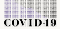
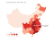
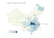
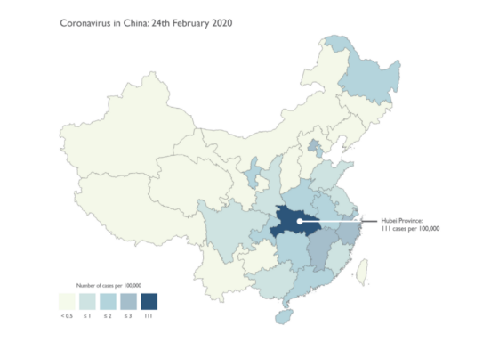
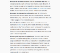
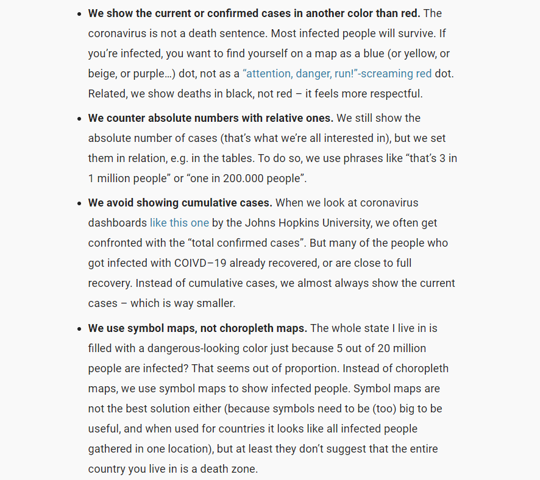
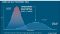
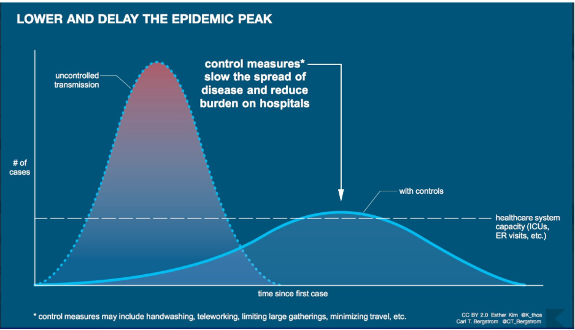

Ten Considerations Before You Create Another Chart About COVID-19

# **Ten Considerations Before You Create Another Chart About COVID-19**

## To sum it up — #vizresponsibly; which may mean not publishing your visualizations in the public domain at all

[Amanda Makulec](https://medium.com/@abmakulec?source=post_page-----27d3bd691be8----------------------)

[Mar 11](https://medium.com/nightingale/ten-considerations-before-you-create-another-chart-about-covid-19-27d3bd691be8?source=post_page-----27d3bd691be8----------------------) · 9 min read

Teams are making ready-to-use COVID-19 datasets easily accessible for the wider data visualization and analysis community. Johns Hopkins posts frequently updated data [on their github page,](https://github.com/CSSEGISandData/COVID-19) and Tableau has created a [COVID-19 Resource Hub](https://www.tableau.com/covid-19-coronavirus-data-resources) with the same data reshaped for use in Tableau.

These public assets are immensely helpful for public health professionals and authorities responding to the epidemic. They make data from multiple sources easy to use, which can enable quick development of visualizations of local case numbers and impact.

At the same time**, **the **stakes are high around how we communicate about this epidemic to the wider public**. Visualizations are powerful for communicating information, but can also mislead, misinform, and — in the worst cases — incite panic. We are in the middle of complete information overload, with hourly case updates and endless streams of information.

> As a public health professional, might I ask:

**> Please consider if what you’ve created serves an actual information need in the public domain. **> Does it add value to the public and uncover new information?

**> If not, perhaps this is one viz that should be for your own use only.**

**We want help **[**flatten the curve to minimize strain on our health system**](http://www.flattenthecurve.com/)**. **The best way to do that is to take individual actions to slow the speed of transmission — like washing your hands and self-quarantining if exposed — and amplifying the voices of experts.

If, after reading all of these caveats and warnings about the harm and panic that can be caused by misleading visualizations, you’ve decided to explore and visualize data about COVID-19, here are ten considerations for your design process.

[ ## Flattening the Curve and Expanding My Understanding   ### Takeaways from a data visualization well done    #### medium.com](https://medium.com/nightingale/flattening-the-curve-and-expanding-my-understanding-70a6c1fb671e)

# **Ten Considerations when Visualizing COVID-19 Data**

## 1. Do more to understand the numbers than just downloading and diving right into a dataset.

The available data on COVID-19 cases isn’t a dataset to go on autopilot with and play around with different chart concepts, particularly if you plan to publish for the public.

Review resources about COVID-19 and the [SARS-CoV2](https://www.cdc.gov/coronavirus/2019-ncov/summary.html)(the novel coronavirus that causes the disease). Start with the [CDC dedicated response page](https://www.cdc.gov/coronavirus/2019-ncov/index.html) and explore more on the[Johns Hopkins Coronavirus resource page](https://coronavirus.jhu.edu/).

It’s a good practice to always understand the context of the data you’re working with, but is *essential* when creating and sharing visualizations during an epidemic where those visualizations have the potential to incite panic just as much as they have the potential to inform.

## 2. Case numbers are the most readily available, thorough, routinely updated data sources, but that doesn’t make them simple to visualize.

You can find case numbers from primary sources (e.g. CDC, Ministries of Health, state departments of public health, and other agencies collecting the data) and aggregated data sets (e.g. [the dataset](https://github.com/CSSEGISandData/COVID-19) underlying the Johns Hopkins [COVID-19 operations dashboard](https://github.com/CSSEGISandData/COVID-19)).

Case numbers seem to lend themselves well to maps and have the advantage of being very local for answering the question, “Are there cases near where I live / where I traveled / where I’m thinking about going?” — but visualizations of these numbers can easily mislead.

Be clear on what kind of cases are represented — you can find case definitions [on the WHO website](https://www.who.int/emergencies/diseases/novel-coronavirus-2019/technical-guidance/surveillance-and-case-definitions). If you’re going the route of building a map, [please review Kenneth Field’s detailed recommendations for mapping COVID-19 before creating your own.](https://www.esri.com/arcgis-blog/products/product/mapping/mapping-coronavirus-responsibly/) (See more specific notes on chart considerations in #5, below.)

Examples from Kenneth Field’s “Mapping coronavirus, responsibly.” Map at left represents a flawed example, as compared to the version at right which correctly utilizes rates as opposed to totals and “…without sensationalist colour choices.” ([Source](https://www.esri.com/arcgis-blog/products/product/mapping/mapping-coronavirus-responsibly/))

## 3. Aggregations and calculations that can be done with the case data are not necessarily what *should *be done with the case data.

Tableau and other tools make it easy to quickly create charts, graphs, and maps, as well as to run calculations with those numbers. It’s also common practice in data visualization to create benchmarks or comparisons between groups and countries in our work. **However, when visualizing COVID-19 data these calculations need to reflect the basic principles of epidemiology.**

There are nuances in the definitions of [different kinds of cases](https://www.cdc.gov/urdo/downloads/CaseDefinitions.pdf)(including [COVID-19 definitions](https://www.who.int/emergencies/diseases/novel-coronavirus-2019/technical-guidance/surveillance-and-case-definitions)) which affect whether they can be aggregated or not. In public health, there are calculated metrics — such as case fatality rate — with very specific definitions that are used to understand and monitor disease spread and human impact. Just because you *can* perform a mathematical function on a set of health statistics doesn’t mean you *should*.

For example, one chart shared about COVID-19 summed the total deaths to date and divided it by the known days in the epidemic to create a special [disease deaths per day aggregation](https://twitter.com/infobeautiful/status/1237133641068826624/photo/3). Then, that number was calculated for other major diseases for comparison. At best, this is an inaccurate comparison due to major differences in our knowledge of and resources for testing and treatment of COVID-19 compared to other diseases. At worst, it significantly understates the seriousness of COVID-19 and causes people to ignore the advice of public health professionals on social distancing and other individual actions that can slow the spread of the virus.

Finally, determining the share of the population infected or the share of infected persons who die from the disease are incredibly challenging calculations due to uncertainty in the denominator. Proceed with extreme caution when calculating any rates, and, better yet*, please leave the rate calculations to the epidemiologists.*

## 4. Be cautious when making generalized predictions or comparisons based on regionally specific data.

Many factors affect the spread and impact of the virus — such as the measures taken by a government to combat the spread and underlying population demographics.

Because of these differences, consider what is implied when making comparisons between countries with very different population sizes, political environments, and public health systems.

For example, the population of Italy skews older than that of China or the US. Because elderly populations have been identified at higher risk and are more likely to require hospital care, the percentage of cases requiring hospitalization may be higher in Italy than in countries with a younger population. [(More on the ways demographics are influencing outcomes in Italy.)](https://www.wsj.com/articles/italy-with-elderly-population-has-worlds-highest-death-rate-from-virus-11583785086)

## 5. Visualizations should inform and be honest about what isn’t represented.

There is much uncertainty in the data we have, particularly when trying to extrapolate to a general population. With an emerging disease, disaggregating and looking at cases and rates in sub-populations can help us to better understand the disease.

The number of confirmed cases is only a subset of infected persons in the population, and the number is impacted by health seeking behavior (if I’m sick, do I go to the doctor?), test kit availability (if I go to the doctor, can I get a test?), health systems factors, and other considerations.

COVID-19 is not a death sentence, and our visualizations need to reflect that. Including ‘recovered cases’ is an essential piece of context in visualizing case numbers.

|     |     |
| --- | --- |
|     | Numbers for yesterday, Wednesday, April 22 |
| Yesterday, this many new people **got tested positive** for COVID-19: | 74,120 |
| And at least this number of people **died from the virus**: | 6,443 |

This chart gets updated once a day with [data by Johns Hopkins](https://www.arcgis.com/apps/opsdashboard/index.html#/bda7594740fd40299423467b48e9ecf6).

   [Get the data](https://datawrapper.dwcdn.net/907JE/1/?referrer=https%3A%2F%2Fmedium.com%2Fnightingale%2Ften-considerations-before-you-create-another-chart-about-covid-19-27d3bd691be8data:application/octet-stream;charset=utf-8,rn%2CV1%0A%20%2C%22Numbers%20for%20yesterday%2C%20Wednesday%2C%20April%2022%22%0A%22Yesterday%2C%20this%20many%20new%20people%20%3Cb%3Egot%20tested%20positive%3C%2Fb%3E%20for%20COVID-19%3A%22%2C74120%0AAnd%20at%20least%20this%20number%20of%20people%20%3Cb%3Edied%20from%20the%20virus%3C%2Fb%3E%3A%2C6443)      •  [Created with Datawrapper](https://www.datawrapper.de/_/907JE/)

 

Reiterating here: calculating rates — like the case fatality rate — is challenging without an accurate denominator.** Leave the rate calculations to the epidemiologists.**

## 6. Epidemiologists and public health agencies create complex models to understand how the disease may progress.

These data are likely not going to feed into a dashboard, but sometimes get cited and sourced in static charts and graphs. The benefit of using results from models from WHO, CDC, and other public health experts is that they typically go through some level of peer-review before being published.

Proceed with caution if incorporating these numbers in a visualization though: models are complex, as they try to account for the behavior of the virus, human behavior, and systems factors. As a result, models will change. If you use data from a model, document the inputs and sources thoroughly.

## 7. Data scientists and statisticians have also been publishing their own models and related conclusions about disease projections.

Use these with caution in framing your visualization and analysis unless they are well sourced, documented, and explained. ***Preferably validated by an epidemiologist or someone else with related expertise*.**

Modeling disease is complex (see #6). Rough, “back of the envelope” calculations can be more fear-inducing than helpful.

Instead, rely on well-sourced models from public health agencies and experts.

## 8. Make thoughtful design decisions.

Still committed to creating a visualization about COVID-19? Read existing resources on responsible visualization approaches in this context before publishing any charts or maps.

Datawrapper has an [excellent set of responsible visualizations of COVID-19](https://blog.datawrapper.de/coronaviruscharts/)with notes on the design decisions they made.

“What we considered when making these visualizations” from the awesome team at Datawrapper ([Source](https://blog.datawrapper.de/coronaviruscharts/))

You can also read this [excellent thread of recommendations and critiques on visualizing COVID-19 from Evan Peck](https://twitter.com/EvanMPeck/status/1237088603160928256).

## 9. Consider the human side of what you create.

Reference terms correctly (see [WHO definitions for COVID-19 cases](https://www.who.int/emergencies/diseases/novel-coronavirus-2019/technical-guidance/surveillance-and-case-definitions), an [explainer on R0](https://www.healthline.com/health/r-nought-reproduction-number), and the [CDC Glossary](https://www.cdc.gov/csels/dsepd/ss1978/glossary.html) as resources) and clearly define each metric for your audience somewhere in the visualization — that can be a footnote, title, subtitle, annotation, explainer text…just make sure it’s there.

*Be considerate of the language you use in your visualization.*

Remember that behind [every data point is a person in a COVID-19 dataset](https://sonsofhierarchies.com/?p=930).** If you wouldn’t feel comfortable having someone from a high risk group read what you wrote, please revise.**

## 10. Consider how visualizations can impact (and encourage) social responsibility as we see COVID-19 in our respective communities.

Self quarantine where appropriate. Ensure we’re not stigmatizing people who are from countries and regions that have had a lot of cases. Understand what additional steps you can take to [**flatten the curve**](https://www.flattenthecurve.com/) and slow the spread of the virus in your community.

Esther Kim and Carl Bergstrom ([Source](https://twitter.com/CT_Bergstrom/status/1236426968444235777/photo/1))

And finally, c[onsider visualizing other relevant data about impacted communities](https://twitter.com/MaroonInspiring/status/1237163217652191234) if you don’t feel you have the public health knowledge to add to the conversation around COVID-19 cases. Epidemic data isn’t a dataset to play with just to have something to show off on Twitter.