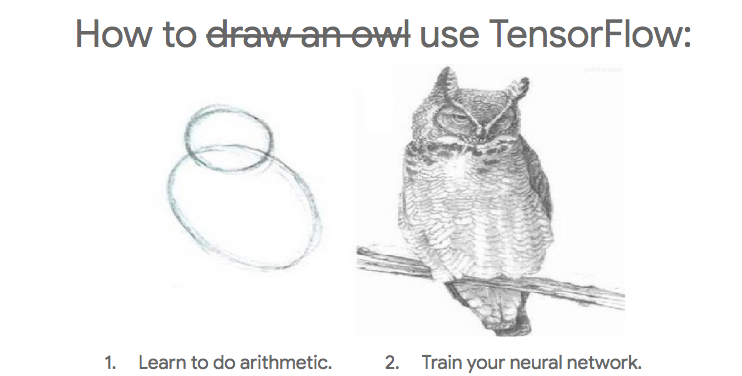
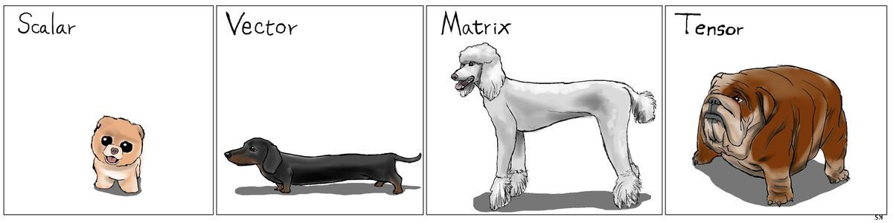
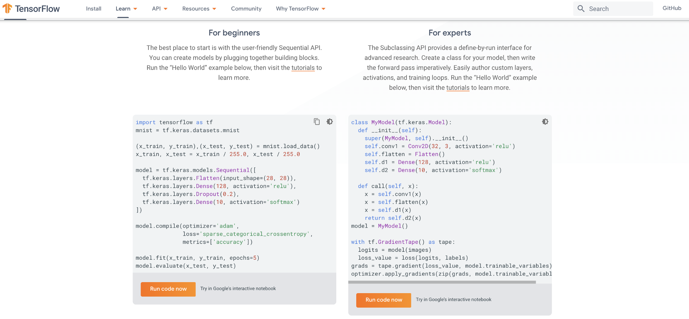
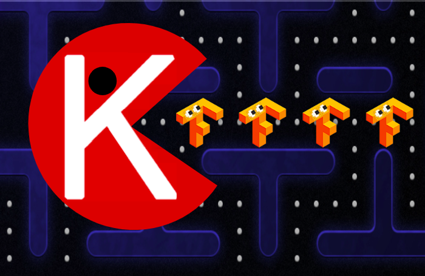
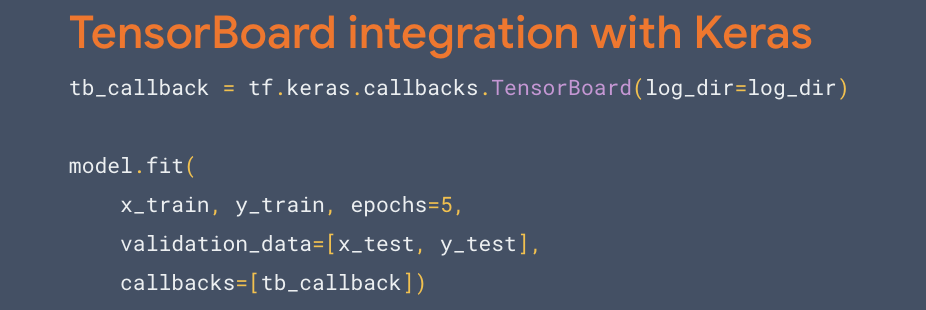
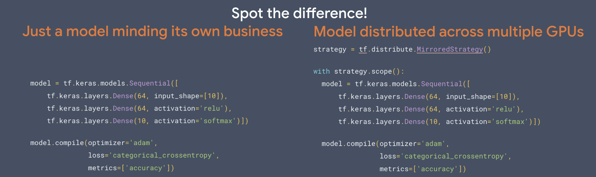

TensorFlow is dead, long live TensorFlow! – Hacker Noon

# TensorFlow is dead, long live TensorFlow!

[Cassie Kozyrkov](https://hackernoon.com/@kozyrkov)
Mar 28·8 min read

If you’re an [AI](http://bit.ly/quaesita_simplest) enthusiast and you didn’t see the big news this month, you might have just snoozed through an off-the-charts earthquake. Everything is about to change!

What is this? The [TensorFlow](http://bit.ly/quaesita_tf) logo or the letter you use to answer tough True/False exam questions?

Last year I wrote [*9 Things You Need To Know About TensorFlow*](http://bit.ly/quaesita_tf)… but there’s ***one*** thing you need to know above all others: TensorFlow 2.0 is here!

> The revolution is here! Welcome to TensorFlow 2.0.

It’s a radical makeover. The consequences of what just happened are going to have major ripple effects on every industry, just you wait. If you’re a TF beginner in mid-2019, you’re extra lucky because you picked the best possible time to enter [AI](http://bit.ly/quaesita_ai) (though you might want to start from scratch if your old tutorials have the word “*session*” in them).

In a nutshell:**  **[**TensorFlow**](http://bit.ly/quaesita_tf)** has just gone full **[**Keras**](http://bit.ly/kerasio). Those of you who know those words just fell out of your chairs. Boom!

### A prickly experience

I doubt that many people have accused [TensorFlow](http://bit.ly/quaesita_tf) 1.x of being easy to love. It’s the [industrial lathe of AI](http://bit.ly/quaesita_tf)… and about as user-friendly. At best, you might feel grateful for being able to accomplish your AI mission at mind-boggling scale.

You’d also attract some raised eyebrows if you claimed that TensorFlow 1.x was easy to get the hang of. Its steep learning curve made it mostly inaccessible to the casual user, but mastering it meant you could talk about it the way you’d brag about that toe you lost while climbing Everest. Was it fun? No, c’mon, really: was it *fun*?

You‘re not the only one — it’s what TensorFlow 1.x tutorials used to feel like for everybody.

TensorFlow’s core strength is performance. It was built for taking models from research to production at *massive* scale and it delivers, but TF 1.x made you sweat for it. Persevere and you’d be able to join the ranks of ML practitioners who use it for incredible things, like [finding new planets and pioneering medicine](http://bit.ly/quaesita_tf).

What a pity that such a powerful tool was in the hands of so few… until now.

Don’t worry about what tensors are. We just called them (generalized) matrices where I grew up. The name *TensorFlow* is a nod to the fact that TF’s very good at performing distributed computations involving multidimensional arrays (er, matrices), which you’ll find handy for [AI](http://bit.ly/quaesita_emperor) at scale. [Image source](http://karlstratos.com/drawings/drawings.html).

### Cute and cuddly Keras

Now that we’ve covered cactuses, let’s talk about something you’d actually want to hug. Overheard at my place of work: *“I think I have an actual crush on *[*Keras*](http://bit.ly/kerasio)*.”*

[Keras](http://bit.ly/kerasio) is a specification for building models layer-by-layer that works with [multiple](http://bit.ly/kerasio) machine learning frameworks (so it’s not a TF thing), but you might know it as a high level API accessed from within TensorFlow as [*tf.keras*](http://bit.ly/tfkeras)*.*

Incidentally, I’m writing this section on Keras’ 4th birthday (Mar 27, 2019) for an extra dose of warm fuzzies.

Keras was built from the ground up to be [Pythonic](http://bit.ly/pyisfun) and always put people first — it was designed to be inviting, flexible, and simple to learn.

### Why don’t we have both?

Why must we choose between Keras’s cuddliness and traditional TensorFlow’s mighty performance? What don’t we have both?

Great idea! Let’s have both! That’s TensorFlow 2.0 in a nutshell.

This is TensorFlow 2.0. You can mash those orange buttons yourself [here](http://bit.ly/tfoview).

> “We don’t think you should have to choose between a simple API and scalable API. We want a higher level API that takes you all the way from MNIST to planet scale.” — > [> Karmel Allison](https://www.linkedin.com/in/karmel)> , TF Engineering Leader at Google

### The usability revolution

Going forward, [Keras](http://bit.ly/kerasio) will be *the *high level API for TensorFlow and it’s extended so that you can use *all* the advanced features of TensorFlow directly from [*tf.keras*](http://bit.ly/tfkeras).

> All of TensorFlow with Keras simplicity at every scale and with all hardware.

In the new version, everything you’ve hated most about [TensorFlow](http://bit.ly/quaesita_tf) 1.x gets the guillotine. Having to perform a dark ritual just to add two numbers together? Dead. TensorFlow [Sessions](http://bit.ly/tfsession)? Dead. A million ways to do the exact same thing? Dead. Rewriting code if you switch hardware or scale? Dead. Reams of boilerplate to write? Dead. Horrible unactionable error messages? Dead. Steep learning curve? Dead.

> TensorFlow is dead, long live TensorFlow 2.0!

You’re expecting the obvious catch, aren’t you? Worse performance? Guess again! We’re not giving up performance.

TensorFlow is now cuddly and this is a game-changer, because it means that one of the most potent tools of our time just dropped the bulk of its barriers to entry. Tech enthusiasts from all walks of life are finally empowered to join in because the new version opens access beyond researchers and other highly-motivated folks with an impressive pain threshold.

> One of the most potent tools of our time just dropped the bulk of its barriers to entry!

Everyone is welcome. Want to play? Then [come play](http://bit.ly/quaesita_tfalpha)!

### Eager to please

In TensorFlow 2.0, eager execution is now the default. You can take advantage of graphs even in eager context, which makes your debugging and prototyping easy, while the TensorFlow runtime takes care of performance and scaling under the hood.

Wrangling graphs in TensorFlow 1.x (declarative programming) was disorienting for many, but it’s all just a bad dream now with eager execution (imperative programming). If you skipped learning it before, so much the better. TF 2.0 is a fresh start for everyone.

### As easy as one… one… one…

Many APIs got consolidated across TensorFlow under [Keras](http://tf.keras/), so now it’s easier to know what you should use when. For example, now you only need to work with ***one*** set of optimizers and ***one*** set of metrics. How many sets of layers? You guessed it! ***One***! Keras-style, naturally.

In fact, the whole ecosystem of tools got a spring cleaning, from data processing pipelines to easy model exporting to [TensorBoard](http://bit.ly/tfboard) integration with Keras, which is now a… ***one***-liner!

There are also great tools that let you switch and optimize distribution strategies for amazing scaling efficiency without losing any of the convenience of Keras.

Those distribution strategies are pretty, aren’t they?

### The catch!

If the catch isn’t performance, what is it? There has to be a catch, right?

Actually, the catch was your suffering up to now. TensorFlow demanded quite a lot of patience from its users while a friendly version was brewing. This wasn’t a matter of sadism. Making tools for [deep learning](http://bit.ly/quaesita_ai) is new territory, and we’re all charting it as we go along. Wrong turns were inevitable, but we learned a lot along the way.

> It’s not a matter of sadism. Deep learning was uncharted territory.

The TensorFlow community put in a lot of elbow grease to make the initial magic happen, and then more effort again to polish the best gems while scraping out less fortunate designs. The plan was never to force you to use a rough draft forever, but perhaps you habituated so well to the discomfort that you didn’t realize it was temporary. Thank you for your patience!

> We’re not giving up performance!

The reward is everything you appreciate about TensorFlow 1.x made friendly under a consistent API with tons of duplicate functionality removed so it’s cleaner to use. Even the errors are cleaned up to be concise, simple to understand, and actionable. Mighty performance stays!

### What’s the big deal?

Haters (who’re gonna hate) might say that much of v2.0 could be cobbled together in v1.x if you searched hard enough, so what’s all the fuss about? Well, not everyone wants to spend our days digging around in clutter for buried treasure. The makeover and clean-up are worth a standing ovation. But that’s not the biggest big deal.

The point not to miss is this: TensorFlow just announced an uncompromising focus on usability.

> It’s an unprecedented step in AI democratization!

AI lets you automate tasks you can’t come up with instructions for. It lets you [automate the ineffable](http://bit.ly/quaesita_simplest). Democratization means that AI at scale will no longer be the province of a tiny tech elite.

> Now anyone can get their hands on the steering wheel!

Imagine a future where* “I know how to make things with *[*Python*](http://bit.ly/pyisfun)*”* and *“I know how to make things with *[*AI*](http://bit.ly/quaesita_emperor)*” *are equally commonplace statements… Exactly! I’m almost tempted to use that buzzword “[*disruptive*](http://bit.ly/disruptiveoven)” here.

### The great migration

We know it’s hard work to [upgrade](http://bit.ly/tfupgrade) to a new version, especially when the changes are so dramatic. If you’re about to embark on [migrating](http://bit.ly/tfmigrate) your codebase to 2.0, you’re not alone — we’ll be doing the same here at Google with one of the largest codebases in the world. As we go along, we’ll be sharing migration guides to help you out.

> We’re giving you great tools to make your migration easier.

If you rely on specific functionality, you won’t be left in the lurch — except for *contrib*, all TF 1.x functions will live on in the [*compat.v1*](http://bit.ly/tfupgrade) compatibility module. We’re also giving you a [script](http://bit.ly/tfupgrade) which automatically updates your code so it runs on TensorFlow 2.0. Learn more in [the video](http://bit.ly/tf2point0) below.

This video’s is a great resource if you’re eager to dig deeper into TF 2.0 and geek out on code snippets.

### Your clean slate

TF 2.0 is a beginner’s paradise, so it will be a downer for those who’ve been looking forward to watching newbies suffer the way you once suffered. If you were hoping to use TensorFlow for hazing new recruits, you might need to search for some other way to inflict existential horror.

> If you’re a TensorFlow beginner, you may be late to the AI party, but yours is the fashionable kind of late. Now’s the best time to arrive!

Sitting out might have been the smartest move, because *now’s* the best time to arrive on the scene. As of March 2019, TensorFlow 2.0 is available in alpha (that’s a preview, you hipster you), so learning it now gets you ready in time for the full release that the community is gearing up for over the next quarter.

> TF 2.0 is a beginner’s paradise.

Following the dramatic changes, you won’t be as much of a beginner as you imagined. The playing field got leveled, the game got easier, and there’s a seat saved just for you. Welcome! I’m glad you’re finally here and I hope you’re as excited about this new world of possibilities as I am.

### Dive in!

Check out the shiny redesigned [tensorflow.org](http://bit.ly/tfdotorg) for tutorials, examples, documentation, and tools to get you started… or dive straight in with:

pip install tensorflow==2.0.0-alpha0
You’ll find detailed instructions [here](http://bit.ly/tfalpha).