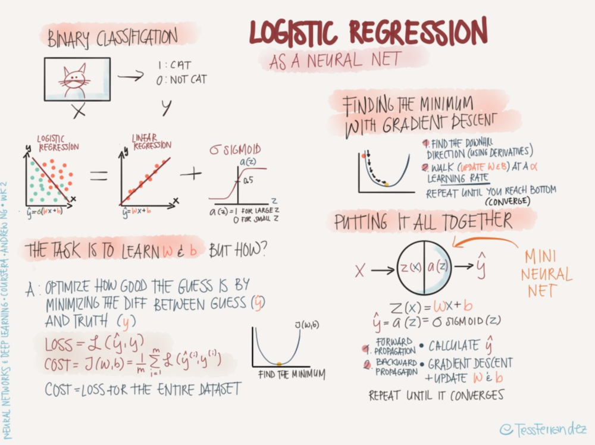
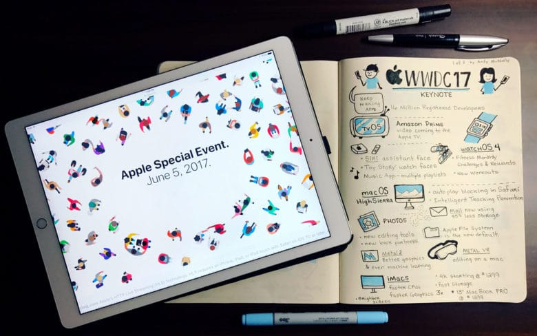

Tess Ferrandez - Sketchnoting a Course on Deep Learning

 Mar 12

## Tess Ferrandez - Sketchnoting a Course on Deep Learning

 

## **Tess Ferrandez created an extensive extensive set of sketchnotes on a very technical subject. We wondered… what’s the story behind them?**

*These *[*sketchnotes*](https://slideshare.net/TessFerrandez/notes-from-coursera-deep-learning-courses-by-andrew-ng)* are from a course in Deep Machine Learning by Andrew Ng. This course is one of the best in the industry, but it is very technical and math heavy, and I am a very visual learner.*

*I found myself garbling the concepts when I was just writing down the equations while listening so I decided to start over and just listen and note down and draw the core concepts instead of the details. The drawings are extremely rudimentary, but hopefully convey the essence.*

*I wasn't really expecting the amount of nice feedback and cheers I have gotten from fellow learners who use this as a supplement to the course and often say it helped them learn. And as a result, the amount of people I have connected to on Twitter, Linked In and other social media with similar interest has been beyond expectation. If I was into cheezy puns, I would call this my lucky draw.*

I certainly enjoyed looking through them and learned a thing or two along the way.

You can find Tess on Twitter [@TessFerrandez](https://twitter.com/TessFerrandez) and the full set of sketchnotes [here](https://slideshare.net/TessFerrandez/notes-from-coursera-deep-learning-courses-by-andrew-ng).

Thanks for sharing with the community Tess (both the sketchnotes and the cheezy pun).

— Steve

[Steve Silbert](https://sketchnotearmy.com/?author=5aad8dd75ebcd53f10e86909)

 [Facebook](https://www.facebook.com/sharer/sharer.php?u=https%3A%2F%2Fsketchnotearmy.com%2Fblog%2F2019%2F3%2F12%2Ftess-ferrandez-sketchnoting-deep-learning)[Twitter](https://twitter.com/intent/tweet?url=https%3A%2F%2Fsketchnotearmy.com%2Fblog%2F2019%2F3%2F12%2Ftess-ferrandez-sketchnoting-deep-learning&text=)[LinkedIn](https://www.linkedin.com/shareArticle?mini=true&source=Sketchnote+Army&summary=&url=https%3A%2F%2Fsketchnotearmy.com%2Fblog%2F2019%2F3%2F12%2Ftess-ferrandez-sketchnoting-deep-learning)[Pinterest](https://www.pinterest.com/pin/create/link/?description=&media=https://static1.squarespace.com/static/5aad8b6ff8370a964b27188d/5aad8dd75ebcd53f10e868f4/5bcde436e5e5f0b9fb1064a4/1552660493781/Tess-Fernandez-Sketchhnote.jpg&url=https%3A%2F%2Fsketchnotearmy.com%2Fblog%2F2019%2F3%2F12%2Ftess-ferrandez-sketchnoting-deep-learning)[0 Likes](https://sketchnotearmy.com/blog/2019/3/12/tess-ferrandez-sketchnoting-deep-learning#)

### Latest Article

 

 [Sketchnoting Apple’s WWDC: Andy McNally](https://sketchnotearmy.com/blog/2019/4/2/sketchnoting-wwdc-andy-mcnally)

Apr 2, 2019

### Latest Podcasts

-

Sketchnote Army Podcast - The Podcast Refresh: Michael Clayton & Mike Rohde - SE05 / EP00

-

Sketchnote Army Podcast - Brandy Agerbeck - SE05 / EP01

-

Sketchnote Army Podcast - Austin Kleon - SE05 / EP02

-

Sketchnote Army Podcast - Magalie Le Gall - SE05 / EP03

-

Sketchnote Army Podcast - Ben Crothers - SE05 / EP04

### Never miss a post!

[Subscribe](https://sketchnotearmy.com/newsletter) to the Sketchnote Army Newsletter.

### Follow Us

 [ ![](data:image/svg+xml,%3csvg xmlns='http://www.w3.org/2000/svg' class='sqs-svg-icon--social js-evernote-checked' viewBox='0 0 64 64' data-evernote-id='213'%3e %3cpath d='M48%2c22.1c-1.2%2c0.5-2.4%2c0.9-3.8%2c1c1.4-0.8%2c2.4-2.1%2c2.9-3.6c-1.3%2c0.8-2.7%2c1.3-4.2%2c1.6 C41.7%2c19.8%2c40%2c19%2c38.2%2c19c-3.6%2c0-6.6%2c2.9-6.6%2c6.6c0%2c0.5%2c0.1%2c1%2c0.2%2c1.5c-5.5-0.3-10.3-2.9-13.5-6.9c-0.6%2c1-0.9%2c2.1-0.9%2c3.3 c0%2c2.3%2c1.2%2c4.3%2c2.9%2c5.5c-1.1%2c0-2.1-0.3-3-0.8c0%2c0%2c0%2c0.1%2c0%2c0.1c0%2c3.2%2c2.3%2c5.8%2c5.3%2c6.4c-0.6%2c0.1-1.1%2c0.2-1.7%2c0.2c-0.4%2c0-0.8%2c0-1.2-0.1 c0.8%2c2.6%2c3.3%2c4.5%2c6.1%2c4.6c-2.2%2c1.8-5.1%2c2.8-8.2%2c2.8c-0.5%2c0-1.1%2c0-1.6-0.1c2.9%2c1.9%2c6.4%2c2.9%2c10.1%2c2.9c12.1%2c0%2c18.7-10%2c18.7-18.7 c0-0.3%2c0-0.6%2c0-0.8C46%2c24.5%2c47.1%2c23.4%2c48%2c22.1z'%3e%3c/path%3e %3cpath d='M0%2c0v64h64V0H0z M44.7%2c25.5c0%2c0.3%2c0%2c0.6%2c0%2c0.8C44.7%2c35%2c38.1%2c45%2c26.1%2c45c-3.7%2c0-7.2-1.1-10.1-2.9 c0.5%2c0.1%2c1%2c0.1%2c1.6%2c0.1c3.1%2c0%2c5.9-1%2c8.2-2.8c-2.9-0.1-5.3-2-6.1-4.6c0.4%2c0.1%2c0.8%2c0.1%2c1.2%2c0.1c0.6%2c0%2c1.2-0.1%2c1.7-0.2 c-3-0.6-5.3-3.3-5.3-6.4c0%2c0%2c0-0.1%2c0-0.1c0.9%2c0.5%2c1.9%2c0.8%2c3%2c0.8c-1.8-1.2-2.9-3.2-2.9-5.5c0-1.2%2c0.3-2.3%2c0.9-3.3 c3.2%2c4%2c8.1%2c6.6%2c13.5%2c6.9c-0.1-0.5-0.2-1-0.2-1.5c0-3.6%2c2.9-6.6%2c6.6-6.6c1.9%2c0%2c3.6%2c0.8%2c4.8%2c2.1c1.5-0.3%2c2.9-0.8%2c4.2-1.6 c-0.5%2c1.5-1.5%2c2.8-2.9%2c3.6c1.3-0.2%2c2.6-0.5%2c3.8-1C47.1%2c23.4%2c46%2c24.5%2c44.7%2c25.5z'%3e%3c/path%3e %3c/svg%3e)](https://twitter.com/SketchnoteArmy)[ ![](data:image/svg+xml,%3csvg xmlns='http://www.w3.org/2000/svg' class='sqs-svg-icon--social js-evernote-checked' viewBox='0 0 64 64' data-evernote-id='214'%3e %3cpath d='M46.91%2c25.816c-0.073-1.597-0.326-2.687-0.697-3.641c-0.383-0.986-0.896-1.823-1.73-2.657c-0.834-0.834-1.67-1.347-2.657-1.73c-0.954-0.371-2.045-0.624-3.641-0.697C36.585%2c17.017%2c36.074%2c17%2c32%2c17s-4.585%2c0.017-6.184%2c0.09c-1.597%2c0.073-2.687%2c0.326-3.641%2c0.697c-0.986%2c0.383-1.823%2c0.896-2.657%2c1.73c-0.834%2c0.834-1.347%2c1.67-1.73%2c2.657c-0.371%2c0.954-0.624%2c2.045-0.697%2c3.641C17.017%2c27.415%2c17%2c27.926%2c17%2c32c0%2c4.074%2c0.017%2c4.585%2c0.09%2c6.184c0.073%2c1.597%2c0.326%2c2.687%2c0.697%2c3.641c0.383%2c0.986%2c0.896%2c1.823%2c1.73%2c2.657c0.834%2c0.834%2c1.67%2c1.347%2c2.657%2c1.73c0.954%2c0.371%2c2.045%2c0.624%2c3.641%2c0.697C27.415%2c46.983%2c27.926%2c47%2c32%2c47s4.585-0.017%2c6.184-0.09c1.597-0.073%2c2.687-0.326%2c3.641-0.697c0.986-0.383%2c1.823-0.896%2c2.657-1.73c0.834-0.834%2c1.347-1.67%2c1.73-2.657c0.371-0.954%2c0.624-2.045%2c0.697-3.641C46.983%2c36.585%2c47%2c36.074%2c47%2c32S46.983%2c27.415%2c46.91%2c25.816z M44.21%2c38.061c-0.067%2c1.462-0.311%2c2.257-0.516%2c2.785c-0.272%2c0.7-0.597%2c1.2-1.122%2c1.725c-0.525%2c0.525-1.025%2c0.85-1.725%2c1.122c-0.529%2c0.205-1.323%2c0.45-2.785%2c0.516c-1.581%2c0.072-2.056%2c0.087-6.061%2c0.087s-4.48-0.015-6.061-0.087c-1.462-0.067-2.257-0.311-2.785-0.516c-0.7-0.272-1.2-0.597-1.725-1.122c-0.525-0.525-0.85-1.025-1.122-1.725c-0.205-0.529-0.45-1.323-0.516-2.785c-0.072-1.582-0.087-2.056-0.087-6.061s0.015-4.48%2c0.087-6.061c0.067-1.462%2c0.311-2.257%2c0.516-2.785c0.272-0.7%2c0.597-1.2%2c1.122-1.725c0.525-0.525%2c1.025-0.85%2c1.725-1.122c0.529-0.205%2c1.323-0.45%2c2.785-0.516c1.582-0.072%2c2.056-0.087%2c6.061-0.087s4.48%2c0.015%2c6.061%2c0.087c1.462%2c0.067%2c2.257%2c0.311%2c2.785%2c0.516c0.7%2c0.272%2c1.2%2c0.597%2c1.725%2c1.122c0.525%2c0.525%2c0.85%2c1.025%2c1.122%2c1.725c0.205%2c0.529%2c0.45%2c1.323%2c0.516%2c2.785c0.072%2c1.582%2c0.087%2c2.056%2c0.087%2c6.061S44.282%2c36.48%2c44.21%2c38.061z M32%2c24.297c-4.254%2c0-7.703%2c3.449-7.703%2c7.703c0%2c4.254%2c3.449%2c7.703%2c7.703%2c7.703c4.254%2c0%2c7.703-3.449%2c7.703-7.703C39.703%2c27.746%2c36.254%2c24.297%2c32%2c24.297z M32%2c37c-2.761%2c0-5-2.239-5-5c0-2.761%2c2.239-5%2c5-5s5%2c2.239%2c5%2c5C37%2c34.761%2c34.761%2c37%2c32%2c37z M40.007%2c22.193c-0.994%2c0-1.8%2c0.806-1.8%2c1.8c0%2c0.994%2c0.806%2c1.8%2c1.8%2c1.8c0.994%2c0%2c1.8-0.806%2c1.8-1.8C41.807%2c22.999%2c41.001%2c22.193%2c40.007%2c22.193z'%3e%3c/path%3e %3cpath d='M43.693%2c23.153c-0.272-0.7-0.597-1.2-1.122-1.725c-0.525-0.525-1.025-0.85-1.725-1.122c-0.529-0.205-1.323-0.45-2.785-0.517c-1.582-0.072-2.056-0.087-6.061-0.087s-4.48%2c0.015-6.061%2c0.087c-1.462%2c0.067-2.257%2c0.311-2.785%2c0.517c-0.7%2c0.272-1.2%2c0.597-1.725%2c1.122c-0.525%2c0.525-0.85%2c1.025-1.122%2c1.725c-0.205%2c0.529-0.45%2c1.323-0.516%2c2.785c-0.072%2c1.582-0.087%2c2.056-0.087%2c6.061s0.015%2c4.48%2c0.087%2c6.061c0.067%2c1.462%2c0.311%2c2.257%2c0.516%2c2.785c0.272%2c0.7%2c0.597%2c1.2%2c1.122%2c1.725s1.025%2c0.85%2c1.725%2c1.122c0.529%2c0.205%2c1.323%2c0.45%2c2.785%2c0.516c1.581%2c0.072%2c2.056%2c0.087%2c6.061%2c0.087s4.48-0.015%2c6.061-0.087c1.462-0.067%2c2.257-0.311%2c2.785-0.516c0.7-0.272%2c1.2-0.597%2c1.725-1.122s0.85-1.025%2c1.122-1.725c0.205-0.529%2c0.45-1.323%2c0.516-2.785c0.072-1.582%2c0.087-2.056%2c0.087-6.061s-0.015-4.48-0.087-6.061C44.143%2c24.476%2c43.899%2c23.682%2c43.693%2c23.153z M32%2c39.703c-4.254%2c0-7.703-3.449-7.703-7.703s3.449-7.703%2c7.703-7.703s7.703%2c3.449%2c7.703%2c7.703S36.254%2c39.703%2c32%2c39.703z M40.007%2c25.793c-0.994%2c0-1.8-0.806-1.8-1.8c0-0.994%2c0.806-1.8%2c1.8-1.8c0.994%2c0%2c1.8%2c0.806%2c1.8%2c1.8C41.807%2c24.987%2c41.001%2c25.793%2c40.007%2c25.793z M0%2c0v64h64V0H0z M46.91%2c38.184c-0.073%2c1.597-0.326%2c2.687-0.697%2c3.641c-0.383%2c0.986-0.896%2c1.823-1.73%2c2.657c-0.834%2c0.834-1.67%2c1.347-2.657%2c1.73c-0.954%2c0.371-2.044%2c0.624-3.641%2c0.697C36.585%2c46.983%2c36.074%2c47%2c32%2c47s-4.585-0.017-6.184-0.09c-1.597-0.073-2.687-0.326-3.641-0.697c-0.986-0.383-1.823-0.896-2.657-1.73c-0.834-0.834-1.347-1.67-1.73-2.657c-0.371-0.954-0.624-2.044-0.697-3.641C17.017%2c36.585%2c17%2c36.074%2c17%2c32c0-4.074%2c0.017-4.585%2c0.09-6.185c0.073-1.597%2c0.326-2.687%2c0.697-3.641c0.383-0.986%2c0.896-1.823%2c1.73-2.657c0.834-0.834%2c1.67-1.347%2c2.657-1.73c0.954-0.371%2c2.045-0.624%2c3.641-0.697C27.415%2c17.017%2c27.926%2c17%2c32%2c17s4.585%2c0.017%2c6.184%2c0.09c1.597%2c0.073%2c2.687%2c0.326%2c3.641%2c0.697c0.986%2c0.383%2c1.823%2c0.896%2c2.657%2c1.73c0.834%2c0.834%2c1.347%2c1.67%2c1.73%2c2.657c0.371%2c0.954%2c0.624%2c2.044%2c0.697%2c3.641C46.983%2c27.415%2c47%2c27.926%2c47%2c32C47%2c36.074%2c46.983%2c36.585%2c46.91%2c38.184z M32%2c27c-2.761%2c0-5%2c2.239-5%2c5s2.239%2c5%2c5%2c5s5-2.239%2c5-5S34.761%2c27%2c32%2c27z'%3e%3c/path%3e %3c/svg%3e)](http://instagram.com/sketchnotearmy_official)[ ![](data:image/svg+xml,%3csvg xmlns='http://www.w3.org/2000/svg' class='sqs-svg-icon--social js-evernote-checked' viewBox='0 0 64 64' data-evernote-id='215'%3e %3cpath d='M43.6%2c30c-0.6%2c0-1.2%2c0.1-1.7%2c0.3c-0.3-4-3.7-7.1-7.7-7.1c-1%2c0-2%2c0.2-2.8%2c0.5 C31.1%2c23.9%2c31%2c24%2c31%2c24.3v13.9c0%2c0.3%2c0.2%2c0.5%2c0.5%2c0.5c0%2c0%2c12.2%2c0%2c12.2%2c0c2.4%2c0%2c4.4-1.9%2c4.4-4.4C48%2c31.9%2c46%2c30%2c43.6%2c30z M27.2%2c25.1 c-0.7%2c0-1.2%2c0.5-1.2%2c1.1v11.3c0%2c0.7%2c0.6%2c1.2%2c1.2%2c1.2c0.7%2c0%2c1.2-0.6%2c1.2-1.2V26.2C28.4%2c25.6%2c27.8%2c25.1%2c27.2%2c25.1z M22.2%2c27.8 c-0.7%2c0-1.2%2c0.5-1.2%2c1.1v8.5c0%2c0.7%2c0.6%2c1.2%2c1.2%2c1.2s1.2-0.6%2c1.2-1.2V29C23.4%2c28.3%2c22.9%2c27.8%2c22.2%2c27.8z M17.2%2c30.2 c-0.7%2c0-1.2%2c0.5-1.2%2c1.1v4.9c0%2c0.7%2c0.6%2c1.2%2c1.2%2c1.2c0.7%2c0%2c1.2-0.6%2c1.2-1.2v-4.9C18.5%2c30.7%2c17.9%2c30.2%2c17.2%2c30.2z'%3e%3c/path%3e %3cpath d='M0%2c0v64h64V0H0z M18.5%2c36.3c0%2c0.7-0.6%2c1.2-1.2%2c1.2c-0.7%2c0-1.2-0.6-1.2-1.2v-4.9c0-0.6%2c0.6-1.1%2c1.2-1.1 c0.7%2c0%2c1.2%2c0.5%2c1.2%2c1.1V36.3z M23.4%2c37.5c0%2c0.7-0.6%2c1.2-1.2%2c1.2S21%2c38.2%2c21%2c37.5V29c0-0.6%2c0.6-1.1%2c1.2-1.1s1.2%2c0.5%2c1.2%2c1.1V37.5z M28.4%2c37.5c0%2c0.7-0.6%2c1.2-1.2%2c1.2c-0.7%2c0-1.2-0.6-1.2-1.2V26.2c0-0.6%2c0.6-1.1%2c1.2-1.1c0.7%2c0%2c1.2%2c0.5%2c1.2%2c1.1V37.5z M43.6%2c38.7 c0%2c0-12.1%2c0-12.2%2c0c-0.3%2c0-0.5-0.2-0.5-0.5V24.3c0-0.3%2c0.1-0.4%2c0.4-0.5c0.9-0.3%2c1.8-0.5%2c2.8-0.5c4%2c0%2c7.4%2c3.1%2c7.7%2c7.1 c0.5-0.2%2c1.1-0.3%2c1.7-0.3c2.4%2c0%2c4.4%2c2%2c4.4%2c4.4C48%2c36.8%2c46%2c38.7%2c43.6%2c38.7z'%3e%3c/path%3e %3c/svg%3e)](http://soundcloud.com/sketchnote-army-podcast)