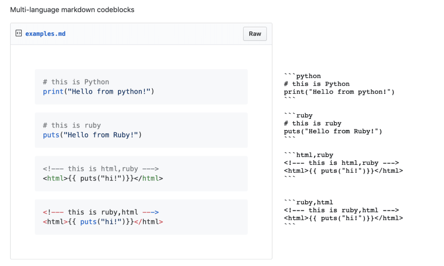

Testable tutorials - DEV Community 👩‍💻👨‍💻

#  Testable tutorials

###     [  Katie McLaughlin](https://dev.to/glasnt)        Oct 29 '19  ・2 min read

Often when developing complex projects, having a walk-through tutorial is exceedingly useful.

However, ensuring the validity of that tutorial is even more important. It's not going to help someone learn your system if your tutorial is broken.

One way to accomplish this is to automatically copy out all your code in a tutorial, and try running it, thereby testing it.

A good tutorial that is a walk-through will have sections of prose and sections of code. However, there also may be scattered blocks of sample output, which would break out algorithm of just 'run every code block'.

Thankfully there's a way around this: marking codeblocks.
In Markdown, you can flag blocks of code as being from different languages.
For example:

	# this is Python
	print("Hello from python!")

	# this is ruby
	puts("Hello from Ruby!")

The outputs are slightly different (depending on your markdown parser), but what's important is the tagging used. We used `python` and `ruby` tags. But did you know that in GitHub-flavoured markdown, you can tag multiple languages? Check out [this example](https://gist.github.com/glasnt/7c1d965c14ab8fb5b0ded9f7c8f042dc) and the [raw markdown](https://gist.githubusercontent.com/glasnt/7c1d965c14ab8fb5b0ded9f7c8f042dc/raw/919e781d06fc4da0ef638a746c8759edb716f505/examples.md).

Depending on your flavour of markdown, only the first tag will be recognised and used as the type of highlighting to use.

* * *

Using this functionality, we can hide metadata in our codeblock declarations while still highlighting. For example, `shell` blocks, but also `shell,sampleoutput` blocks.

Then, we can create a basic parser that will, for markdown codeblocks, only copy out codeblocks marked `shell`, excluding any that have say "sampleoutput" as well:

	# parse.py docs/ - Python 3.7

	import re
	import sys
	from pathlib import Path

	def extract(f, filter=None):
	    code_blocks = []
	    while True:
	        line = f.readline()
	        if not line:
	            break

	        # Three backticks breaks dev.to parsing, but this wrapping
	        # one in square brackets is functionally equivelent
	        out = re.match("[^`]*`[`]`(.*)$", line)
	        if out:
	            if filter and filter.strip() != out.group(1).strip():
	                continue
	            code_block = [f.readline()]
	            while re.search("`[`]`", code_block[-1]) is None:
	                code_block.append(f.readline())
	            code_blocks.append("".join(code_block[:-1]))
	    return code_blocks

	# Given a folder in the script parameters, grab a glob of all the markdown files.
	path = sys.argv[1]
	targets = sorted(Path(path).glob("*.md"))

	for x in targets:
	    print(f"# {x.name}")
	    with open(x) as f:
	        print("\n".join(extract(f, "shell")))

This code is based on [excode](https://github.com/nschloe/excode/blob/master/excode/main.py#L25) by nschole.

To invoke:

	python parse.py docs/

In this example: for a tutorial with multiple `shell` blocks scattered around `shell,sample` and `python` blocks, only the `shell` blocks will be exported. These can then be tested by whatever your testing setup entails (recommendations for this is a story for another time :)

Happy verification!

* * *

Important note: the "markdown parsers" used here are the parsers used in dev.to and GitHub Flavoured markdown. Other parsers may vary and may get very confused about the non-standard configurations.