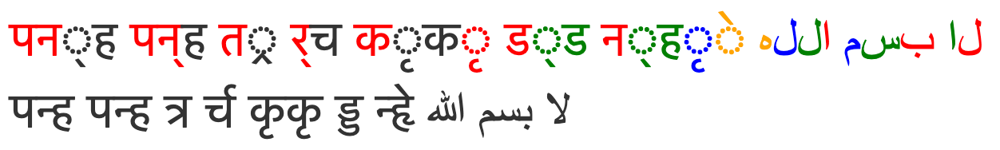
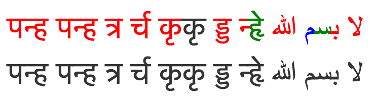
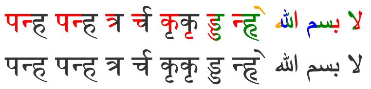
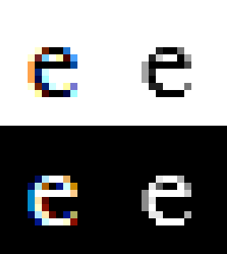

Text Rendering Hates You

# Text Rendering Hates You

Alexis Beingessner
*September 28th, 2019*

- [1 Terminology](https://gankra.github.io/blah/text-hates-you/#terminology)

- [2 Style, Layout, and Shape All Depend On Each Other?](https://gankra.github.io/blah/text-hates-you/#style-layout-and-shape-all-depend-on-each-other)

- [3 Text Isn't Individual Characters](https://gankra.github.io/blah/text-hates-you/#text-isnt-individual-characters)
    - [3.1 Text Overlaps](https://gankra.github.io/blah/text-hates-you/#text-overlaps)

    - [3.2 Style Can Change Mid-Ligature](https://gankra.github.io/blah/text-hates-you/#style-can-change-mid-ligature)

- [4 Emoji Broke Color and Style](https://gankra.github.io/blah/text-hates-you/#emoji-broke-color-and-style)

- [5 Anti-Aliasing Is Hell](https://gankra.github.io/blah/text-hates-you/#anti-aliasing-is-hell)
    - [5.1 Subpixel Offsets Break Glyph Caches](https://gankra.github.io/blah/text-hates-you/#subpixel-offsets-break-glyph-caches)

    - [5.2 Subpixel-AA Isn't Composable](https://gankra.github.io/blah/text-hates-you/#subpixel-aa-isnt-composable)

- [6 Esoterica](https://gankra.github.io/blah/text-hates-you/#esoterica)
    - [6.1 Fonts Can Contain SVG](https://gankra.github.io/blah/text-hates-you/#fonts-can-contain-svg)

    - [6.2 Characters Can Be Too Damn Big](https://gankra.github.io/blah/text-hates-you/#characters-can-be-too-damn-big)

    - [6.3 Selection Isn't A Box, And Text Goes In All The Directions](https://gankra.github.io/blah/text-hates-you/#selection-isnt-a-box-and-text-goes-in-all-the-directions)

    - [6.4 How Do You Write That You Can't Write?](https://gankra.github.io/blah/text-hates-you/#how-do-you-write-that-you-cant-write)

    - [6.5 Style Is Part of The Font (Except When It's Not)](https://gankra.github.io/blah/text-hates-you/#style-is-part-of-the-font-except-when-its-not)

    - [6.6 There's Is No Ideal Text Rendering](https://gankra.github.io/blah/text-hates-you/#theres-is-no-ideal-text-rendering)

- [7 Additional Links](https://gankra.github.io/blah/text-hates-you/#additional-links)

Rendering text, how hard could it be? As it turns out, incredibly hard! To my knowledge, literally no system renders text "perfectly". It's all best-effort, although some efforts are more important than others.

I'll be assuming you want to support arbitrary text provided by users with custom fonts, colors, and styles with line-wrapping and support for text-selection. Basically the minimum required to properly display a simple rich-text document, terminal, webpage, or anything else.

The overarching theme here will be: there are no consistent right answers, everything is way more important than you think, and everything affects everything else.

The topics I focus on here have no particular rhyme or reason, they're just the ones that come to mind after a few years of working on rendering in Firefox. For instance, I don't spend much time talking about the challenges of text-segmentation or managing the different platform-specific text libraries, because I don't look at that much.

# [1 Terminology](https://gankra.github.io/blah/text-hates-you/#terminology)

Text is complicated and english is bad at expressing these nuances. For the purpose of this document, I will try to stick to the following terms. Note that these words aren't "right", I just find them useful for communicating the key concepts to native english speakers who don't have backgrounds in linguistics.

Characters:

- Scalar: A Unicode Scalar, the "smallest unit" unicode describes (AKA a code point).
- Character: A Unicode Extended Grapheme Cluster (EGC), the "biggest unit" unicode describes (potentially composed of multiple scalars).
- Glyph: An atomic unit of rendering yielded by the font. Generally this will have a unique ID in the font.
- Ligature: A glyph that is made up of several scalars, and potentially even several characters (native speakers may or may not think of a ligature as multiple "characters", but to the font it's just one "character").
- Emoji: A "full color" glyph.

Fonts:

- Font: A document that maps characters to glyphs.
- Script: The set of glyphs that make up some language (fonts tend to implement particular scripts).
- Cursive Script: Any script where glyphs touch and flow into each other (like Arabic).
- Color: RGB and Alpha values for fonts (alpha isn't needed for some usecases, but it's interesting).
- Style: Bold and Italics modifiers for fonts (hinting, aliasing, and other settings tend to also get crammed in here in practical implementations).

# [2 Style, Layout, and Shape All Depend On Each Other?](https://gankra.github.io/blah/text-hates-you/#style-layout-and-shape-all-depend-on-each-other)

Just so you have an idea for how a typical text-rendering pipeline works, here's a quick sketch:

1. Styling (parse markup, query system for fonts)
2. Layout (break text into lines)
3. Shaping (compute the glyphs in a line and their positions)
4. Rasterization (rasterize needed glyphs into an atlas/cache)
5. Composition (copy glyphs from the atlas to their desired positions)
Unfortunately, these steps aren't as clean as they might seem.

Most fonts don't actually provide every glyph in existence. There's too many glyphs, so fonts are usually designed to only implement a particular script. End users usually don't know or care about this, and so a robust system must *cascade* into other fonts when characters aren't available.

For instance, even though the markup of the following text doesn't *suggest* the presence of multiple fonts, drawing it correctly on all systems absolutely requires it: hello मनीष بسم 好. This is dangerously close to Step 1 (Styling) depending on the results of Step 3 (Shaping)!

(Alternatively, you can take the [Noto approach](https://www.google.com/get/noto/) and use a single Uber Font that contains every character ever. Although that means users can't configure the font, and you can't provide a "native" text experience to users on all platforms. But let's assume you want the more robust solution.)

Similarly, layout requires you to know how much space each part of your text takes up, but this is only known once you shape the text! Step 2 depends on the results of Step 3?

Shaping absolutely depends on you knowing your layout and styling, so we seem to be stuck. What do we do?

First off, styling gets to cheat. Although what we *really* want from a font is full glyphs, styling only needs to ask about *scalars*. If a font doesn't properly support a script it shouldn't claim to know anything about the scalars that make up that script. So we can easily find the "best" font as follows:

For every character (EGC) in our text, keep asking each font in our cascade if it knows about all the scalars that make up that character, and use it if it does. If we get to the end of the cascade with no providers, then we yield tofu ( , a missing glyph indicator).

In the case of emoji, you've probably seen the failure mode of this process before! Because some emoji are actually ligatures of several simpler emoji, a font may successfully report support for the character while only yielding the components. So ‍♀️ may literally appear as ‍ ♀ if the font is "too old" to know about the new ligature. This can also happen if your unicode implementation is "too old" to know about a character, causing the styling system to accept a partial match in the font.

So now we know exactly what fonts we'll use without looking at layout or shape (although shaping might change our colors, more on that in later sections). Can we untie layout and shape as well? Nope! Things like paragraph breaks give you a nice hard break on lines, but the only way to do wrapping is to iteratively do shaping!

You have to assume that your text fits on a single line and shape it until you run out of space. At that point you can perform layout operations and figure out where to break the text and start the next line. Repeat until everything is shaped and laid out.

# [3 Text Isn't Individual Characters](https://gankra.github.io/blah/text-hates-you/#text-isnt-individual-characters)

Coming from english, you might think ligatures are just fancy fluff. I mean, who *really* cares if "æ" is written as "ae"? Well, as it turns out, some languages are basically entirely ligatures. For instance "ड्ड بسم" has individual characters of "ड् ड ب س م". If you're viewing this in a competent text-rendering system (any of the major browsers), those two strings should look *very* different.

And no: this isn't about the difference between unicode scalars and extended grapheme clusters. If you ask a unicode-robust system (such as Swift) for the extended grapheme clusters of that string, it will spit out those 5 characters!

The shape of a character depends on its neighbours: **you cannot correctly draw text character-by-character**.

Which is to say, you must use a *shaping* library. The industry standard for this is [HarfBuzz](https://www.freedesktop.org/wiki/Software/HarfBuzz/), and it's extremely hard to implement your own. Use HarfBuzz.

## [3.1 Text Overlaps](https://gankra.github.io/blah/text-hates-you/#text-overlaps)

Cursive scripts frequently have their glyphs intersect to avoid seams, and that can cause you problems.

Let's look at "मनीष منش" again. Seems fine, eh? Let's blow it up:
मनीष منش
Still seems fine, let's make the text color partially transparent:
मनीष منش

If you're in Safari or Edge, this might still look ok! If you're in Firefox or Chrome, it looks awful, like this:

 

The problem is that Chrome and Firefox are trying to *cheat*. They ate their vegetables and properly shaped the text, but once they had glyphs they still tried to draw them individually. This mostly works fine, except for when there's transparency and overlapping. Then you get darkening at the overlaps.

A "correct" implementation will draw the text to a temporary surface *without* transparency and then composite that surface into the scene *with* transparency. Firefox and Chrome don't do this because it's expensive and *usually* unnecessary for the major western languages. Interestingly, they *do* understand the issue, because they actually bend over backwards to specially handle this for emoji (but we'll get to that later).

## [3.2 Style Can Change Mid-Ligature](https://gankra.github.io/blah/text-hates-you/#style-can-change-mid-ligature)

Ok this one is *mostly* a curiosity in that I'm not aware of any super-reasonable cases where this happens, but it naturally falls out of markups. Here's two pieces of text with the same *content* but different color styling:

 पन्ह पन्ह त्र र्च कृकृ  ड्ड  न्हृे  لا  بسم  الله
पन्ह पन्ह त्र र्च कृकृ ड्ड न्हृे لا بسم الله

Here's what they look like in Safari:
 

Here's what they look like in Chrome (if using its [new layout implementation](https://www.chromium.org/blink/layoutng)):

 

And here's what they look like in Firefox:
 

To summarize:

- Safari breaks
- Chrome is legible but throws away a lot of the colors
- Firefox is both legible and colorful

I guess everyone should do what Firefox does, right? But if we zoom in, we can see that it's doing something very janky:

It just split this one ligature into 4 equal parts with different colors!

The problem is, there's really no reasonable answer for what *should* happen here. We've broken up a ligature with different stylings, and since the ligature is in some sense a rendering "unit" it's reasonable to simply refuse to support this (as most do).

For whatever reason, [someone working on Firefox got really enthusiastic about trying to handle it more gracefully](https://robert.ocallahan.org/2006/10/partial-ligatures_24.html). The general approach is to draw the ligature multiple times with best-guess masks and different colors, which works surprisingly well!

There is a *some* merit in trying to support these "partial ligatures": only shaping can know if a ligature will happen, and it can depend on system-specific fonts, so a ligature may show up where no one expected! The classic english example here is an æ ligature from a user-installed font spanning the boundary of a hyperlink.

Also it kinda sucks that english can change style mid-word but cursive scripts can't?

Don't ask about the code which line-breaks partial ligatures though.

# [4 Emoji Broke Color and Style](https://gankra.github.io/blah/text-hates-you/#emoji-broke-color-and-style)

If you draw emoji the way the native system would, you need to disrespect the text's color settings (except for transparency):

Hello ❤️ ™️ There (Black)
Hello ❤️ ™️ There (Red)
Hello ❤️ ™️ There (Transparent)
Hello ❤️ ™️ There (Bold)
*Hello ❤️ ™️ There (Italics)*

Emoji generally have their own native colors, and this color can even have semantic meaning, as is the case for skin-tone modifiers. More problematically: they have multiple colors!

As far as I can tell, this wasn't really a thing before emoji, and so different platforms approach this in different ways. Some provide emoji as a straight-up image (Apple), others provide emoji as [a series of single-color *layers*](https://docs.microsoft.com/en-us/typography/opentype/spec/colr) (Microsoft).

The latter approach is kinda nice because it integrates well with existing text rendering pipelines by "just" desugarring a glyph into a series of single-color glyphs, which everyone is used to working with.

However that means that your style can change *repeatedly* while drawing a "single" glyph. It also means that a "single" glyph can overlap itself, leading to the transparency issues discussed in an earlier section. And yet, as shown above, browsers *do* properly composite the transparency for emoji!

You can rationalize this inconsistency in three ways:

- You already need to detect color glyphs and handle them specially, so it's easy to take a special compositing path for them
- Cursive scripts are slightly ugly with bad transparency, but emoji are terrifying/gibberish, so extra work is justified
- Western-centric developers care more about emoji than languages like Arabic and Marathi.

You decide.

Oh also, what does it mean to italicize or bold an emoji? Should you ignore those styles? Should you synthesize them? Who knows. ‍♀️

Also hey do these emoji seem weirdly small?

Yeah for whatever reason a bunch of systems secretly increase the font-size for emoji to make them look better.

# [5 Anti-Aliasing Is Hell](https://gankra.github.io/blah/text-hates-you/#anti-aliasing-is-hell)

Text is really small and detailed, and it's really important that it's easily legible. Sounds like a job for anti-aliasing (AA)! Oh, 480p really is low resolution huh. More AA!!!

e
e
e
e

So there's two major kinds of AA:

- Greyscale Anti-Aliasing
- Subpixel Anti-Aliasing

Greyscale-AA is the "natural" approach to anti-aliasing. The basic idea is to give partially-covered pixels partial-transparency. During composition, this will cause that pixel to be slightly tinted as if it were slightly covered, creating clearer details.

It's greyscale because that's the term used for one-dimensional color, like our one-dimensional transparency (otherwise glyphs tend to be a single solid color). Also in the common case of black text on a white background, the anti-aliasing literally shows up as greyness around the edges.

Subpixel-AA is a trick that abuses the common way pixels are laid out on desktop monitors. It's more complicated than this, so if you're really interested you should look it up, but here's a TL;DR of the high-level concept:

Your monitor's pixels are actually three little columns of RED GREEN BLUE. If you make a pixel red you're *kinda* also making it "WHITE BLACK BLACK". Similarly, if you make it blue, you're making "BLACK BLACK WHITE". In other words, by messing around with colors you can *triple* your horizontal resolution and get way more details!

You might think that this would look super messed up and rainbowy, but in practice it honestly works out really well (some disagree). The human brain likes to see patterns and smooth things out. That said, if you take a screenshot of subpixel-AA text you will *absolutely* be able to see the colors if you resize the image, or even look at it on a monitor with a different subpixel layout. This is why screenshots of text often look really weird and bad.

(As a total aside, the fact that this works also means that the color of an icon can accidentally change its perceived size and position, which is really annoying.)

So subpixel-AA is a really neat hack that can significantly improve text legibility, great! But, sadly, it's also a huge pain in the neck!

Note that regardless of the AA system you use, you can also have *subpixel glyph offsets*. Although you always want your rasterized glyphs to be snapped to full pixels, the rasterization itself is for a specific subpixel offset (a value between 0 and 1).

To understand this, imagine a 1x1 black square with greyscale-aa:

- If its subpixel offset was 0, then its rasterization is just a black pixel
- If its subpixel offset was 0.5, then its rasterization would be two 50% grey pixels

## [5.1 Subpixel Offsets Break Glyph Caches](https://gankra.github.io/blah/text-hates-you/#subpixel-offsets-break-glyph-caches)

Rasterizing glyphs is surprisingly expensive, so you really want to cache it in an atlas. But how do you cache glyph rasterizations when you're using subpixel-offsets? Each offset is its own unique rasterization, so you're incredibly unlikely to get cache hits like that!

Quality and performance must be balanced here, and that can be done by snapping your subpixel offsets. For english text, a reasonable balance is to have no vertical subpixel precision while snapping the horizontal subpixel offset to a quarter-integer. This leaves you with only 4 subpixel-positions, which is still a big improvement in quality while allowing for a reasonable amount of caching.

## [5.2 Subpixel-AA Isn't Composable](https://gankra.github.io/blah/text-hates-you/#subpixel-aa-isnt-composable)

One nice thing about greyscale-AA is that you can play a bit fast-and-loose with it, and it will degrade gracefully. For instance, if you transform a texture with text on it (scaling, rotating, or translating), it might look a bit blurry but it will look basically fine.

If you do the same thing with subpixel-AA, it will look terrible. The entire idea behind subpixel-AA is that you are abusing how the pixels are laid out in a display. If the pixels of the display don't line up with the pixels of your texture, the red and blue edges will be clearly visible!

One might think that the "fix" for this is to just rerasterize the glyphs in their new location. And indeed, if the transform is static, this can work. But if the transform is an *animation* this will actually look *even worse*. This is actually a really common browser bug: if we *ever* fail to detect that an animation is happening to some text, the characters will *jiggle* as each glyph bounces around between different subpixel snappings and hints on each frame.

As a result, browsers contain several heuristics to detect things which might be animations so that they can force-disable subpixel-AA for that part of the page (and ideally even subpixel-positioning). This can be pretty hard to do reliably, because arbitrarily complex JS can drive an animation without giving any clear "heads up" to the browser.

Furthermore, if partial transparency is involved, subpixel-AA is also problematic. Basically, we're tweaking our R, G, and B channels to encode 3 transparency values (one for each subpixel), but the text itself also has a color, and the thing the text is on does to, so information easily gets lost.

When using greyscale-AA we have a dedicated alpha channel so nothing is ever lost. As such, browsers tend to use greyscale-AA when transparency is involved.

...Except Firefox. Yet again, this is a weird place where someone working on Firefox got really enthusiastic and did something complicated: Component Alpha. It turns out you can in fact properly composite subpixel-AA text, but it involves effectively having 3 extra channels dedicated to the transparency of your R, G, and B channels. Unsurprisingly, this doubles the memory footprint of text that's composited in this way.

Mercifully, subpixel-AA has become less relevant over the years:

- Retina displays really don't need it
- The subpixel layout on phones prevents the trick from working (without major work)
- On newer versions of macos, subpixel-aa of text is disabled at the OS level by default
- Chrome seems to be disabling subpixel-aa more aggressively (not sure what the exact policy is)
- Firefox's new graphics backend (webrender) has abandoned Component Alpha for the sake of simplicity

# [6 Esoterica](https://gankra.github.io/blah/text-hates-you/#esoterica)

This part's just a grab bag of little things that don't need merit much discussion.

## [6.1 Fonts Can Contain SVG](https://gankra.github.io/blah/text-hates-you/#fonts-can-contain-svg)

God this blows. These fonts are mostly provided by Adobe, because they got really into SVG a while ago. Sometimes you can just ignore the SVG parts (I believe the Source Code Pro font technically contains some SVG glyphs, but in practice they aren't actually used by websites), but in general you need to implement SVG support to draw All The Fonts.

Also have you heard of [Animated SVG Fonts](https://colorfonts.langustefonts.com/disco.html)? No? Good. I think they're broken/unimplemented everywhere now. (Firefox randomly supported it for a while because of some enthusiastic developer.)

## [6.2 Characters Can Be Too Damn Big](https://gankra.github.io/blah/text-hates-you/#characters-can-be-too-damn-big)

If you naively respect a user's request for a very large font (or very large zoom level), you will run into extreme memory management problems with the size of your glyph atlas, as each character may be bigger than the entire screen. There are a few ways to handle this:

- Refuse to draw the glyph (sad user)
- Rasterize the glyph at a smaller size, and upscale during composition (easy, produces blurry edges)
- Rasterize the glyph directly into your composited surface (hard, potentially expensive)

## [6.3 Selection Isn't A Box, And Text Goes In All The Directions](https://gankra.github.io/blah/text-hates-you/#selection-isnt-a-box-and-text-goes-in-all-the-directions)

It's pretty common for folks to know that the primary direction of text can be left-to-right (english), right-to-left (arabic), or top-to-bottom (japanese).

So here's some fun text:

Hello There لا بسم الله Beep Boop!!

On a desktop, if you drag your mouse across that text to select it, you may notice that the selection becomes discontinuous and jumpy in the middle. This is because we're mixing left-to-right and right-to-left text in the same line, which absolutely happens all the time.

At first dragging right *increases* the selection, but then it *decreases* it until it suddenly starts increasing again. This is in fact totally correct and desirable: the selection is just remaining contiguous *in the actual underlying string*. This way you can correctly copy a fragment of text that spans the transition.

So you need to deal with that in your selection code's hit-detection. Also you need to deal with that in your line breaking algorithm during layout.

But did you know there's more?

oh hey what?oh لا بسم الله no你好1234你好

Hopefully you don't need to deal with that stuff.

## [6.4 How Do You Write That You Can't Write?](https://gankra.github.io/blah/text-hates-you/#how-do-you-write-that-you-cant-write)

When characters are missing from fonts, it's nice to be able to communicate to the user that this happened. This is the "tofu" glyph. Now, you can just draw a blank tofu (a rectangle) and leave it at that, but if you want to be helpful you can write out the value of the missing character so it can be debugged more easily.

But, wait, we're using text to explain that we can't draw text? Hmm.

You could appeal to an assumption that the system must have a basic font that can draw 0-9 and A-F, but for those who expect to truly Destroy Their Tools With Their Tools you can do what Firefox does: the microfont!

Inside Firefox there's a little hardcoded array describing one-bit pixel art of a tiny font atlas for exactly those 16 characters. So when drawing tofu, it can blit those glyphs out without worrying about fonts.

## [6.5 Style Is Part of The Font (Except When It's Not)](https://gankra.github.io/blah/text-hates-you/#style-is-part-of-the-font-except-when-its-not)

For high-quality fonts, stylings like *italics* and **bold** are provided natively, as there isn't a simple algorithmic way to do those effects nicely.

Except some fonts don't provide those stylings, and so you need a simple algorithmic way to do those effects.

Exactly how you detect and handle all of this is pretty system-specific, hairy, and outside my area of expertise, so I can't really explain it well. I would just be digging through [Webrender's font code](https://searchfox.org/mozilla-central/source/gfx/wr/webrender_api/src/font.rs).

Anyway, no matter what you do, you need a *synthetic* fallback. Thankfully, the implementations are actually pretty straightforward:

Synthetic italics: apply a skew transform to each glyph.

Synthetic bold: paint every glyph multiple times with a slight offset in your text-direction.

Honestly, these approaches do a pretty decent job! But users might notice that things seem "wrong" and you can do better if you put in the work.

## [6.6 There's Is No Ideal Text Rendering](https://gankra.github.io/blah/text-hates-you/#theres-is-no-ideal-text-rendering)

Platform-specific bugs, optimizations, and quirks have thrived for long enough to become aesthetics. So even if you adamantly believe that certain things are ideal or important, there's always going to be a huge group of users with different preferences. A robust text rendering system supports those different preferences (while picking reasonable defaults).

You should support system configurations, font-specific configurations, application-specific configurations, and text-run-specific configurations. You should also try to match each platform's native "look and feel" (quirks).

This includes:

- Being able to disable subpixel-AA (some people really hate it)
- Being able to disable *all* AA (yes, people do it)
- Tons of platform/format-specific properties like hinting, smoothing, variation, gamma, etc

This also means that [you should use the system's native text libraries](https://github.com/pcwalton/font-kit/wiki/FAQ) to match that system's aesthetic (Core Text, DirectWrite, and FreeType on their respective platforms).

# [7 Additional Links](https://gankra.github.io/blah/text-hates-you/#additional-links)

Here's some extra articles about how rendering text is a nightmare:

- [Windows has to monkey-patch some truetype fonts to work](http://rastertragedy.com/RTRCh4.htm#Sec1)
- [There's so many coordinate spaces in Firefox](https://staktrace.com/spout/entry.php?id=800)