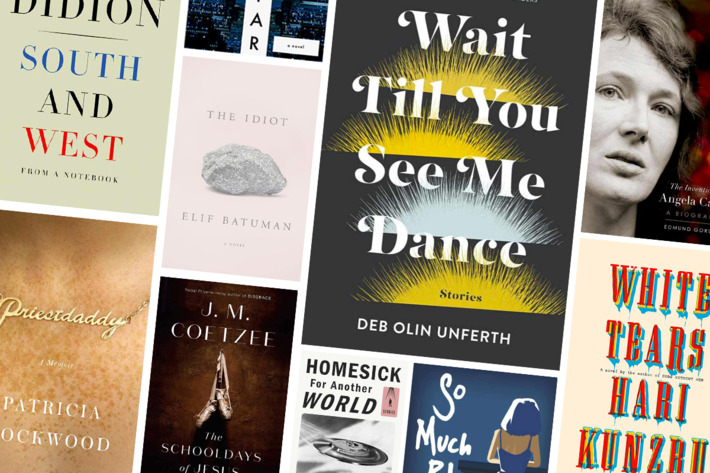
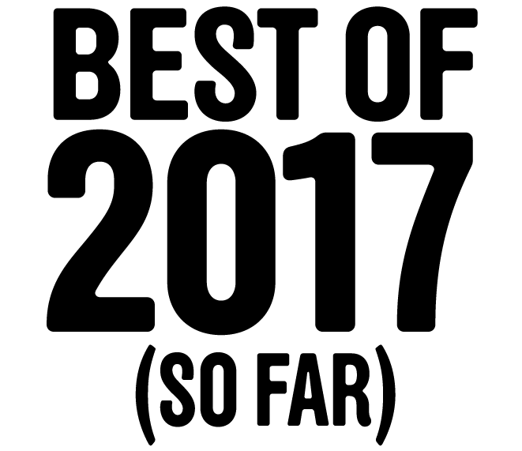
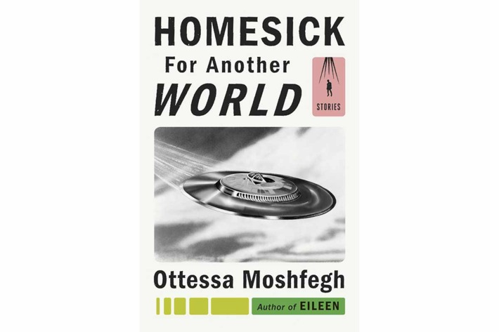
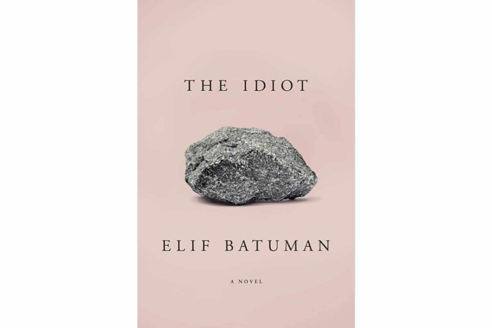
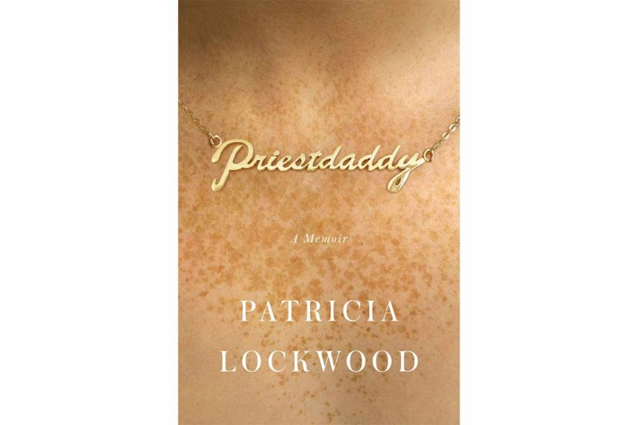
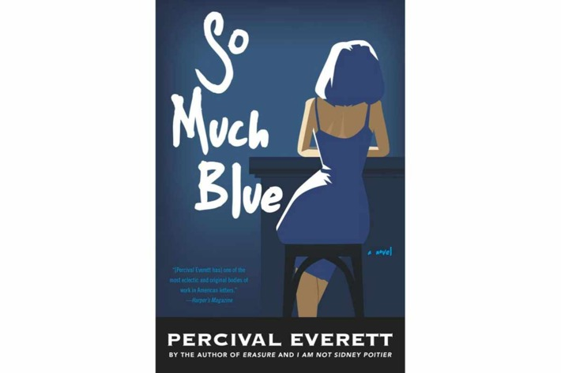
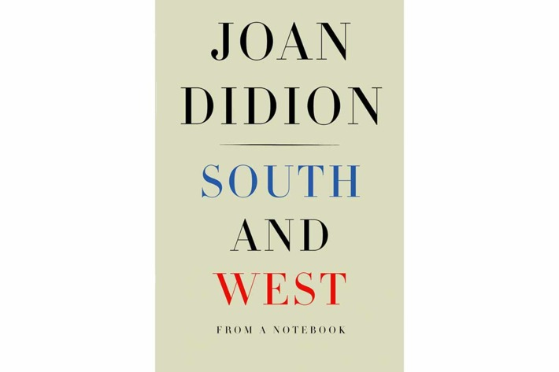
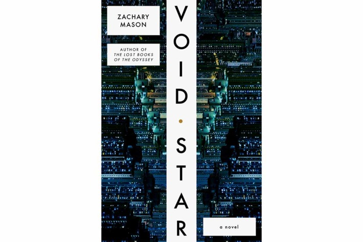
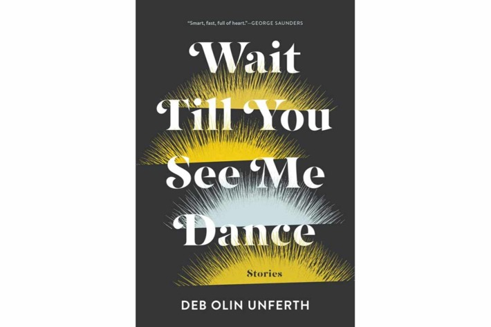
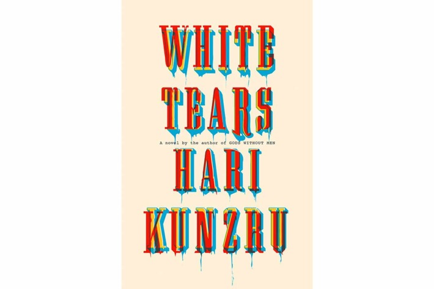

The 10 Best Books of 2017 (So Far)

 

 

*This week, Vulture is looking back at the best releases so far in 2017.*

Much ink has been spilled this spring about Americans’ thirst for dystopian fiction, stories that tell us how bad things can get. There have been a few good books along those lines, especially Zachary Mason’s *Void Star*. We should be glad that so far the literature of 2017 is nothing like our polarized politics. It’s multivalent, eclectic, and impossible to predict.

 

[***Homesick for Another World* by Ottessa Moshfegh**](https://www.amazon.com/Homesick-Another-World-Ottessa-Moshfegh/dp/0399562885/ref=sr_1_1?ie=UTF8&qid=1498251565&sr=8-1&keywords=Homesick+for+Another+World+by+Ottessa+Moshfegh)

The characters in [this story collection](http://www.vulture.com/2017/02/ottessa-moshfeghs-homesick-for-another-world-book-review.html) are at the ends of their ropes and out of their dirty minds — just the right state for that epiphany we’ve all been waiting for.

 

[***The Idiot* by Elif Batuman**](https://www.amazon.com/Idiot-Elif-Batuman/dp/1594205612/ref=sr_1_1?ie=UTF8&qid=1498251310&sr=8-1&keywords=The+Idiot+by+Elif+Batuman)

What 18-year-old college freshman isn’t a total dumb-dumb and how much worse was it for the teens who showed up in the mid-1990s when email was a new thing and its modes of humiliation weren’t yet codified? [In her first novel, Batuman](http://www.vulture.com/2017/03/elif-batuman-on-writers-block-and-the-magic-of-early-email.html), author of *The Possessed*, plumbs the depths, to great comic effect.

 

[***The Invention of Angela Carter* by Edmund Gordon**](https://www.amazon.com/Invention-Angela-Carter-Biography/dp/0190626844/ref=sr_1_1?ie=UTF8&qid=1498251474&sr=8-1&keywords=The+Invention+of+Angela+Carter+by+Edmund+Gordon)

Angela Carter changed anglophone literature, reviving the gothic style and pioneering magic realism, before she died much too soon in 1992 at age 51. Gordon’s biography renders the author an unforgettable character in her own right.

 

[***Priestdaddy* by Patricia Lockwood**](https://www.amazon.com/Priestdaddy-Memoir-Patricia-Lockwood/dp/1594633738/ref=sr_1_1?ie=UTF8&qid=1498251333&sr=8-1&keywords=Priestdaddy+by+Patricia+Lockwood)

[A poet’s memoir](http://www.vulture.com/2017/04/review-of-priestdaddy-patricia-lockwoods-new-memoir.html) of coming home as a 20-something refugee from the hipster archipelago to the reactionary heartland, *Priestdaddy *is the rare book that veers from hilarious to heartbreaking and back from page to page.

 

[***The Schooldays of Jesus* by J. M. Coetzee**](https://www.amazon.com/Schooldays-Jesus-J-M-Coetzee/dp/0735222665/ref=sr_1_1?ie=UTF8&qid=1498251284&sr=8-1&keywords=The+Schooldays+of+Jesus+by+J.+M.+Coetzee)

[The second volume](http://www.vulture.com/2017/02/is-total-apathy-the-key-to-j-m-coetzee.html) in the Nobel laureate’s projected trilogy about refugees bereft of their memories in a strange Spanish-speaking land, *Schooldays *is an education in Dostoevsky, Bach, and Plato that delivers the pleasures of a thriller.

 

[***So Much Blue* by Percival Everett**](https://www.amazon.com/So-Much-Blue-Percival-Everett/dp/1555977820/ref=sr_1_1?ie=UTF8&qid=1498251356&sr=8-1&keywords=So+Much+Blue+by+Percival+Everett)

Three plots from the life of a cynical and disabused painter intertwine in [this elegant and haunting novel](http://www.vulture.com/article/percival-everetts-so-much-blue-is-winding-and-beguiling.html) that moves from Rhode Island to Paris to El Salvador and through meditations on war, love, family, and art.

 

[***South and West* by Joan Didion**](https://www.amazon.com/South-West-Notebook-Joan-Didion/dp/1524732796/ref=sr_1_1?ie=UTF8&qid=1498251549&sr=8-1&keywords=South+and+West+by+Joan+Didion)

Two of Didion’s 1970s magazine assignments — to write about the Gulf Coast and the Patty Hearst trial — never took flight, but [the notes for those projects collected here](http://www.vulture.com/2017/03/when-joan-didion-visited-the-south-in-1970.html) are both fascinating historical documents and revealing glimpses at a great writer’s methods.

 

[***Void Star* by Zachary Mason**](https://www.amazon.com/Void-Star-Novel-Zachary-Mason/dp/0374285063/)

A vision of the future replete with drones, artificial intelligence, rising seas, and a desertified corn belt, Mason’s novel is the year’s most cerebral and chilling dystopia.

 

[***Wait Till You See Me Dance* by Deb Olin Unferth**](https://www.amazon.com/Wait-Till-You-See-Dance/dp/1555977685/ref=sr_1_1?ie=UTF8&qid=1498251497&sr=8-1&keywords=Wait+Till+You+See+Me+Dance+by+Deb+Olin+Unferth)

Worth it for the title story alone, Unferth’s collection certifies her as a virtuoso minimalist and an heir to Diane Williams and Lydia Davis.

 

[***White Tears* by Hari Kunzru**](https://www.amazon.com/White-Tears-novel-Hari-Kunzru/dp/0451493699/ref=sr_1_1?ie=UTF8&qid=1498251521&sr=8-1&keywords=White+Tears+by+Hari+Kunzru)

What starts as story of music and friendship moves into the tricky territory of cultural appropriation before becoming a ghost story about the shames of American history.

 *Related*  [The Best TV Shows of 2017 (So Far)](http://www.vulture.com/article/best-tv-shows-of-2017-so-far.html)